# Application Layer

Network applications are the _raisons d’être_ of a computer network—if we couldn’t conceive of any useful applications, there wouldn’t be any need for networking infra- structure and protocols to support them. Since the Internet’s inception, numerous useful and entertaining applications have indeed been created. These applications have been the driving force behind the Internet’s success, motivating people in homes, schools, govern- ments, and businesses to make the Internet an integral part of their daily activities.

Internet applications include the classic text-based applications that became pop- ular in the 1970s and 1980s: text e-mail, remote access to computers, file transfers, and newsgroups. They include _the_ killer application of the mid-1990s, the World Wide Web, encompassing Web surfing, search, and electronic commerce. Since the begin- ning of new millennium, new and highly compelling applications continue to emerge, including voice over IP and video conferencing such as Skype, Facetime, and Google Hangouts; user generated video such as YouTube and movies on demand such as Netflix; and multiplayer online games such as Second Life and World of Warcraft. During this same period, we have seen the emergence of a new generation of social networking applications—such as Facebook, Instagram, and Twitter—which have created human networks on top of the Internet’s network or routers and communi- cation links. And most recently, along with the arrival of the smartphone and the ubiquity of 4G/5G wireless Internet access, there has been a profusion of location based mobile apps, including popular check-in, dating, and road-traffic forecasting apps (such as Yelp, Tinder, and Waz), mobile payment apps (such as WeChat and Apple Pay) and messaging apps (such as WeChat and WhatsApp). Clearly, there has been no slowing down of new and exciting Internet applications. Perhaps some of the readers of this text will create the next generation of killer Internet applications!

In this chapter, we study the conceptual and implementation aspects of network applications. We begin by defining key application-layer concepts, including net- work services required by applications, clients and servers, processes, and trans- port-layer interfaces. We examine several network applications in detail, including the Web, e-mail, DNS, peer-to-peer (P2P) file distribution, and video streaming. We then cover network application development, over both TCP and UDP. In particular, we study the socket interface and walk through some simple client-server applications in Python. We also provide several fun and interesting socket programming assign- ments at the end of the chapter.

The application layer is a particularly good place to start our study of protocols. It’s familiar ground. We’re acquainted with many of the applications that rely on the protocols we’ll study. It will give us a good feel for what protocols are all about and will introduce us to many of the same issues that we’ll see again when we study transport, network, and link layer protocols.

## Principles of Network Applications
Suppose you have an idea for a new network application. Perhaps this application will be a great service to humanity, or will please your professor, or will bring you great wealth, or will simply be fun to develop. Whatever the motivation may be, let’s now examine how you transform the idea into a real-world network application.

At the core of network application development is writing programs that run on different end systems and communicate with each other over the network. For exam- ple, in the Web application there are two distinct programs that communicate with each other: the browser program running in the user’s host (desktop, laptop, tablet, smartphone, and so on); and the Web server program running in the Web server host. As another example, in a Video on Demand application such as Netflix (see Sec- tion 2.6), there is a Netflix-provided program running on the user’s smartphone, tablet, or computer; and a Netflix server program running on the Netflix server host. Servers often (but certainly not always) are housed in a data center, as shown in Figure 2.1.

Thus, when developing your new application, you need to write software that will run on multiple end systems. This software could be written, for example, in C, Java, or Python. Importantly, you do not need to write software that runs on net- work-core devices, such as routers or link-layer switches. Even if you wanted to write application software for these network-core devices, you wouldn’t be able to do so. As we learned in Chapter 1, and as shown earlier in Figure 1.24, network-core devices do not function at the application layer but instead function at lower layers— specifically at the network layer and below. This basic design—namely, confining application software to the end systems—as shown in Figure 2.1, has facilitated the rapid development and deployment of a vast array of network applications.

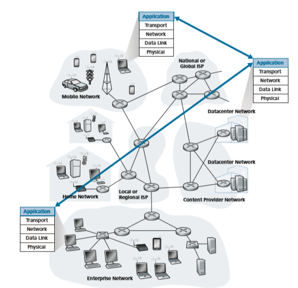

**Figure 2.1**  ♦   Communication for a network application takes place between end systems at the application layer
### Network Application Architectures
Before diving into software coding, you should have a broad architectural plan for your application. Keep in mind that an application’s architecture is distinctly differ- ent from the network architecture (e.g., the five-layer Internet architecture discussed in Chapter 1). From the application developer’s perspective, the network architec- ture is fixed and provides a specific set of services to applications. The **application architecture
, on the other hand, is designed by the application developer and dic- tates how the application is structured over the various end systems. In choosing the application architecture, an application developer will likely draw on one of the two predominant architectural paradigms used in modern network applications: the client-server architecture or the peer-to-peer (P2P) architecture.

In a **client-server architecture**, there is an always-on host, called the _server_, which services requests from many other hosts, called _clients_. A classic example is the Web application for which an always-on Web server services requests from browsers running on client hosts. When a Web server receives a request for an object from a client host, it responds by sending the requested object to the client host. Note that with the client-server architecture, clients do not directly communicate with each other; for example, in the Web application, two browsers do not directly communi- cate. Another characteristic of the client-server architecture is that the server has a fixed, well-known address, called an IP address (which we’ll discuss soon). Because the server has a fixed, well-known address, and because the server is always on, a cli- ent can always contact the server by sending a packet to the server’s IP address. Some of the better-known applications with a client-server architecture include the Web, FTP, Telnet, and e-mail. The client-server architecture is shown in Figure 2.2(a).

Often in a client-server application, a single-server host is incapable of keep- ing up with all the requests from clients. For example, a popular social-networking site can quickly become overwhelmed if it has only one server handling all of its requests. For this reason, a **data center**, housing a large number of hosts, is often used to create a powerful virtual server. The most popular Internet services—such as search engines (e.g., Google, Bing, Baidu), Internet commerce (e.g., Amazon, eBay, Alibaba), Web-based e-mail (e.g., Gmail and Yahoo Mail), social media (e.g., Facebook, Instagram, Twitter, and WeChat)—run in one or more data centers. As discussed in Section 1.3.3, Google has 19 data centers distributed around the world, which collectively handle search, YouTube, Gmail, and other services. A data center can have hundreds of thousands of servers, which must be powered and maintained. Additionally, the service providers must pay recurring interconnection and band- width costs for sending data from their data centers.

In a **P2P architecture**, there is minimal (or no) reliance on dedicated servers in data centers. Instead the application exploits direct communication between pairs of intermittently connected hosts, called _peers_. The peers are not owned by the service provider, but are instead desktops and laptops controlled by users, with most of the peers residing in homes, universities, and offices. Because the peers communicate

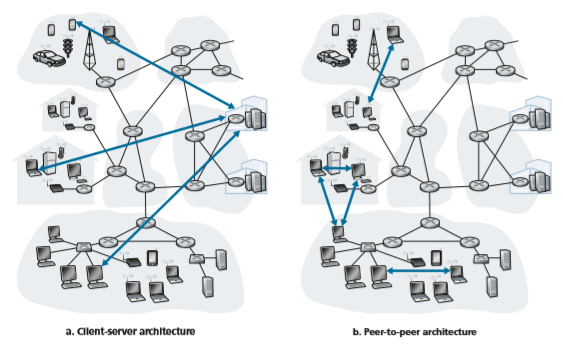

**Figure 2.2**  ♦  (a) Client-server architecture; (b) P2P architecture

without passing through a dedicated server, the architecture is called peer-to-peer. An example of a popular P2P application is the file-sharing application BitTorrent. 
One of the most compelling features of P2P architectures is their **self- scalability**. For example, in a P2P file-sharing application, although each peer generates workload by requesting files, each peer also adds service capacity to the system by distributing files to other peers. P2P architectures are also cost effective, since they normally don’t require significant server infrastructure and server band- width (in contrast with clients-server designs with datacenters). However, P2P appli- cations face challenges of security, performance, and reliability due to their highly decentralized structure.

### Processes Communicating
Before building your network application, you also need a basic understanding of how the programs, running in multiple end systems, communicate with each other. In the jargon of operating systems, it is not actually programs but **processes** that

communicate. A process can be thought of as a program that is running within an end system. When processes are running on the same end system, they can communicate with each other with interprocess communication, using rules that are governed by the end system’s operating system. But in this book, we are not particularly interested in how processes in the same host communicate, but instead in how processes run- ning on _different_ hosts (with potentially different operating systems) communicate.

Processes on two different end systems communicate with each other by exchanging **messages** across the computer network. A sending process creates and sends messages into the network; a receiving process receives these messages and possibly responds by sending messages back. Figure 2.1 illustrates that processes communicating with each other reside in the application layer of the five-layer pro- tocol stack.

**Client and Server Processes**

A network application consists of pairs of processes that send messages to each other over a network. For example, in the Web application a client browser process exchanges messages with a Web server process. In a P2P file-sharing system, a file is transferred from a process in one peer to a process in another peer. For each pair of communicating processes, we typically label one of the two processes as the **client** and the other process as the **server**. With the Web, a browser is a client process and a Web server is a server process. With P2P file sharing, the peer that is downloading the file is labeled as the client, and the peer that is uploading the file is labeled as the server.

You may have observed that in some applications, such as in P2P file sharing, a process can be both a client and a server. Indeed, a process in a P2P file-sharing system can both upload and download files. Nevertheless, in the context of any given communication session between a pair of processes, we can still label one process as the client and the other process as the server. We define the client and server pro- cesses as follows:

_In the context of a communication session between a pair of processes, the pro- cess that initiates the communication (that is, initially contacts the other process at the beginning of the session) is labeled as the_ client_. The process that waits to be contacted to begin the session is the_ server_._

In the Web, a browser process initializes contact with a Web server process; hence the browser process is the client and the Web server process is the server. In P2P file sharing, when Peer A asks Peer B to send a specific file, Peer A is the cli- ent and Peer B is the server in the context of this specific communication session. When there’s no confusion, we’ll sometimes also use the terminology “client side and server side of an application.” At the end of this chapter, we’ll step through sim- ple code for both the client and server sides of network applications.

**The Interface Between the Process and the Computer Network**
As noted above, most applications consist of pairs of communicating processes, with the two processes in each pair sending messages to each other. Any message sent from one process to another must go through the underlying network. A process sends messages into, and receives messages from, the network through a software interface called a **socket**. Let’s consider an analogy to help us understand processes and sockets. A process is analogous to a house and its socket is analogous to its door. When a process wants to send a message to another process on another host, it shoves the message out its door (socket). This sending process assumes that there is a trans- portation infrastructure on the other side of its door that will transport the message to the door of the destination process. Once the message arrives at the destination host, the message passes through the receiving process’s door (socket), and the receiving process then acts on the message.

Figure 2.3 illustrates socket communication between two processes that com- municate over the Internet. (Figure 2.3 assumes that the underlying transport protocol used by the processes is the Internet’s TCP protocol.) As shown in this figure, a socket is the interface between the application layer and the transport layer within a host. It is also referred to as the **Application Programming Interface (API)** between the application and the network, since the socket is the programming interface with which network applications are built. The application developer has control of everything on the application-layer side of the socket but has little control of the transport-layer side of the socket. The only control that the application developer has on the transport- layer side is (1) the choice of transport protocol and (2) perhaps the ability to fix a few 


**Figure 2.3**  ♦   Application processes, sockets, and underlying transport protocol

transport-layer parameters such as maximum buffer and maximum segment sizes (to be covered in Chapter 3). Once the application developer chooses a transport protocol (if a choice is available), the application is built using the transport-layer services provided by that protocol. We’ll explore sockets in some detail in Section 2.7.

**Addressing Processes**

In order to send postal mail to a particular destination, the destination needs to have an address. Similarly, in order for a process running on one host to send packets to a process running on another host, the receiving process needs to have an address. To identify the receiving process, two pieces of information need to be specified: (1) the address of the host and (2) an identifier that specifies the receiving process in the destination host.

In the Internet, the host is identified by its **IP address**. We’ll discuss IP addresses in great detail in Chapter 4. For now, all we need to know is that an IP address is a 32-bit quantity that we can think of as uniquely identifying the host. In addition to know- ing the address of the host to which a message is destined, the sending process must also identify the receiving process (more specifically, the receiving socket) running in the host. This information is needed because in general a host could be running many network applications. A destination **port number** serves this purpose. Popular applica- tions have been assigned specific port numbers. For example, a Web server is identified by port number 80. A mail server process (using the SMTP protocol) is identified by port number 25. A list of well-known port numbers for all Internet standard protocols can be found at www.iana.org. We’ll examine port numbers in detail in Chapter 3.

### Transport Services Available to Applications
 Recall that a socket is the interface between the application process and the trans- port-layer protocol. The application at the sending side pushes messages through the socket. At the other side of the socket, the transport-layer protocol has the responsi- bility of getting the messages to the socket of the receiving process.

Many networks, including the Internet, provide more than one transport-layer protocol. When you develop an application, you must choose one of the available transport-layer protocols. How do you make this choice? Most likely, you would study the services provided by the available transport-layer protocols, and then pick the protocol with the services that best match your application’s needs. The situation is similar to choosing either train or airplane transport for travel between two cities. You have to choose one or the other, and each transportation mode offers different services. (For example, the train offers downtown pickup and drop-off, whereas the plane offers shorter travel time.)

What are the services that a transport-layer protocol can offer to applications invoking it? We can broadly classify the possible services along four dimensions: reliable data transfer, throughput, timing, and security.

**Reliable Data Transfer**

As discussed in Chapter 1, packets can get lost within a computer network. For exam- ple, a packet can overflow a buffer in a router, or can be discarded by a host or router after having some of its bits corrupted. For many applications—such as electronic mail, file transfer, remote host access, Web document transfers, and financial appli- cations—data loss can have devastating consequences (in the latter case, for either the bank or the customer!). Thus, to support these applications, something has to be done to guarantee that the data sent by one end of the application is delivered cor- rectly and completely to the other end of the application. If a protocol provides such a guaranteed data delivery service, it is said to provide **reliable data transfer**. One important service that a transport-layer protocol can potentially provide to an applica- tion is process-to-process reliable data transfer. When a transport protocol provides this service, the sending process can just pass its data into the socket and know with complete confidence that the data will arrive without errors at the receiving process.

When a transport-layer protocol doesn’t provide reliable data transfer, some of the data sent by the sending process may never arrive at the receiving process. This may be acceptable for **loss-tolerant applications**, most notably multimedia applica- tions such as conversational audio/video that can tolerate some amount of data loss. In these multimedia applications, lost data might result in a small glitch in the audio/ video—not a crucial impairment.

**Throughput**

In Chapter 1, we introduced the concept of available throughput, which, in the context of a communication session between two processes along a network path, is the rate at which the sending process can deliver bits to the receiving process. Because other sessions will be sharing the bandwidth along the network path, and because these other sessions will be coming and going, the available throughput can fluctuate with time. These observations lead to another natural service that a transport-layer protocol could provide, namely, guaranteed available throughput at some specified rate. With such a service, the application could request a guaranteed throughput of _r_ bits/sec, and the transport protocol would then ensure that the avail- able throughput is always at least _r_ bits/sec. Such a guaranteed throughput service would appeal to many applications. For example, if an Internet telephony applica- tion encodes voice at 32 kbps, it needs to send data into the network and have data delivered to the receiving application at this rate. If the transport protocol cannot provide this throughput, the application would need to encode at a lower rate (and receive enough throughput to sustain this lower coding rate) or may have to give up, since receiving, say, half of the needed throughput is of little or no use to this Internet telephony application. Applications that have throughput requirements are said to be **bandwidth-sensitive applications**. Many current multimedia applications are bandwidth sensitive, although some multimedia applications may use adaptivecoding techniques to encode digitized voice or video at a rate that matches the cur- rently available throughput.

While bandwidth-sensitive applications have specific throughput requirements, **elastic applications** can make use of as much, or as little, throughput as happens to be available. Electronic mail, file transfer, and Web transfers are all elastic applica- tions. Of course, the more throughput, the better. There’s an adage that says that one cannot be too rich, too thin, or have too much throughput!

**Timing**

A transport-layer protocol can also provide timing guarantees. As with throughput guarantees, timing guarantees can come in many shapes and forms. An example guarantee might be that every bit that the sender pumps into the socket arrives at the receiver’s socket no more than 100 msec later. Such a service would be appealing to interactive real-time applications, such as Internet telephony, virtual environments, teleconferencing, and multiplayer games, all of which require tight timing constraints on data delivery in order to be effective, see \[Gauthier 1999; Ramjee 1994\]. Long delays in Internet telephony, for example, tend to result in unnatural pauses in the conversation; in a multiplayer game or virtual interactive environment, a long delay between taking an action and seeing the response from the environment (for example, from another player at the end of an end-to-end con- nection) makes the application feel less realistic. For non-real-time applications, lower delay is always preferable to higher delay, but no tight constraint is placed on the end-to-end delays.

**Security**

Finally, a transport protocol can provide an application with one or more security services. For example, in the sending host, a transport protocol can encrypt all data transmitted by the sending process, and in the receiving host, the transport-layer pro- tocol can decrypt the data before delivering the data to the receiving process. Such a service would provide confidentiality between the two processes, even if the data is somehow observed between sending and receiving processes. A transport protocol can also provide other security services in addition to confidentiality, including data integrity and end-point authentication, topics that we’ll cover in detail in Chapter 8.

### Transport Services Provided by the Internet
 Up until this point, we have been considering transport services that a computer net- work _could_ provide in general. Let’s now get more specific and examine the type of transport services provided by the Internet. The Internet (and, more generally, TCP/ IP networks) makes two transport protocols available to applications, UDP and TCP. When you (as an application developer) create a new network application for the
 
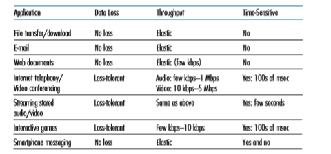

**Figure 2.4**  ♦  Requirements of selected network applications

 Internet, one of the first decisions you have to make is whether to use UDP or TCP. Each of these protocols offers a different set of services to the invoking applications. Figure 2.4 shows the service requirements for some selected applications.

**TCP Services**

The TCP service model includes a connection-oriented service and a reliable data transfer service. When an application invokes TCP as its transport protocol, the application receives both of these services from TCP.

• _Connection-oriented service._ TCP has the client and server exchange transport- layer control information with each other _before_ the application-level mes- sages begin to flow. This so-called handshaking procedure alerts the client and server, allowing them to prepare for an onslaught of packets. After the handshaking phase, a **TCP connection** is said to exist between the sockets of the two processes. The connection is a full-duplex connection in that the two processes can send messages to each other over the connection at the same time. When the application finishes sending messages, it must tear down the connec- tion. In Chapter 3, we’ll discuss connection-oriented service in detail and examine how it is implemented.

• _Reliable data transfer service._ The communicating processes can rely on TCP to deliver all data sent without error and in the proper order. When one side of the application passes a stream of bytes into a socket, it can count on TCP to deliver the same stream of bytes to the receiving socket, with no missing or duplicate bytes.


TCP also includes a congestion-control mechanism, a service for the general welfare of the Internet rather than for the direct benefit of the communicating pro- cesses. The TCP congestion-control mechanism throttles a sending process (client or server) when the network is congested between sender and receiver. As we will see in Chapter 3, TCP congestion control also attempts to limit each TCP connection to its fair share of network bandwidth.

**UDP Services**

UDP is a no-frills, lightweight transport protocol, providing minimal services. UDP is connectionless, so there is no handshaking before the two processes start to com- municate. UDP provides an unreliable data transfer service—that is, when a process sends a message into a UDP socket, UDP provides _no_ guarantee that the message will ever reach the receiving process. Furthermore, messages that do arrive at the receiving process may arrive out of order.

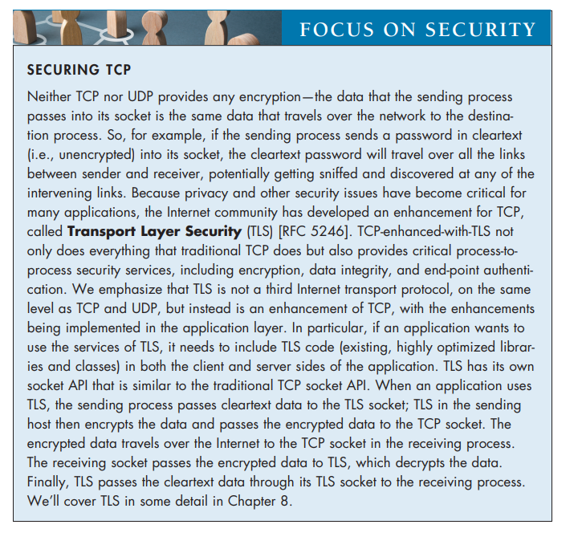

**FOCUS ON SECURITY**UDP does not include a congestion-control mechanism, so the sending side of UDP can pump data into the layer below (the network layer) at any rate it pleases. (Note, however, that the actual end-to-end throughput may be less than this rate due to the limited transmission capacity of intervening links or due to congestion).

**Services Not Provided by Internet Transport Protocols**

We have organized transport protocol services along four dimensions: reliable data transfer, throughput, timing, and security. Which of these services are provided by TCP and UDP? We have already noted that TCP provides reliable end-to-end data transfer. And we also know that TCP can be easily enhanced at the application layer with TLS to provide security services. But in our brief description of TCP and UDP, conspicuously missing was any mention of throughput or timing guarantees— services _not_ provided by today’s Internet transport protocols. Does this mean that time- sensitive applications such as Internet telephony cannot run in today’s Internet? The answer is clearly no—the Internet has been hosting time-sensitive applications for many years. These applications often work fairly well because they have been designed to cope, to the greatest extent possible, with this lack of guarantee. Nevertheless, clever design has its limitations when delay is excessive, or the end-to-end throughput is limited. In summary, today’s Internet can often provide satisfactory service to time- sensitive applications, but it cannot provide any timing or throughput guarantees.

Figure 2.5 indicates the transport protocols used by some popular Internet appli- cations. We see that e-mail, remote terminal access, the Web, and file transfer all use TCP. These applications have chosen TCP primarily because TCP provides reliable data transfer, guaranteeing that all data will eventually get to its destination. Because Internet telephony applications (such as Skype) can often tolerate some loss but require a minimal rate to be effective, developers of Internet telephony applications


**Figure 2.5**  ♦   Popular Internet applications, their application-layer protocols, and their underlying transport protocols

usually prefer to run their applications over UDP, thereby circumventing TCP’s congestion control mechanism and packet overheads. But because many firewalls are configured to block (most types of) UDP traffic, Internet telephony applications often are designed to use TCP as a backup if UDP communication fails.

### Application-Layer Protocols

We have just learned that network processes communicate with each other by sending messages into sockets. But how are these messages structured? What are the meanings of the various fields in the messages? When do the processes send the messages? These questions bring us into the realm of application-layer protocols. An **application-layer protocol**
 defines how an application’s processes, running on different end systems, pass messages to each other. In particular, an application-layer protocol defines:

• The types of messages exchanged, for example, request messages and response messages

• The syntax of the various message types, such as the fields in the message and how the fields are delineated

• The semantics of the fields, that is, the meaning of the information in the fields

• Rules for determining when and how a process sends messages and responds to messages

Some application-layer protocols are specified in RFCs and are therefore in the public domain. For example, the Web’s application-layer protocol, HTTP (the HyperText Transfer Protocol [RFC 7230]), is available as an RFC. If a browser developer follows the rules of the HTTP RFC, the browser will be able to retrieve Web pages from any Web server that has also followed the rules of the HTTP RFC. Many other application-layer protocols are proprietary and intentionally not avail- able in the public domain. For example, Skype uses proprietary application-layer protocols.

It is important to distinguish between network applications and application-layer protocols. An application-layer protocol is only one piece of a network application (albeit, a very important piece of the application from our point of view!). Let’s look at a couple of examples. The Web is a client-server application that allows users to obtain documents from Web servers on demand. The Web application consists of many components, including a standard for document formats (that is, HTML), Web browsers (for example, Chrome and Microsoft Internet Explorer), Web servers (for example, Apache and Microsoft servers), and an application-layer protocol. The Web’s application-layer protocol, HTTP, defines the format and sequence of messages exchanged between browser and Web server. Thus, HTTP is only one piece (albeit, an important piece) of the Web application. As another example, we’ll see in Section 2.6 that Netflix’s video service also has many components,including servers that store and transmit videos, other servers that manage billing and other client functions, clients (e.g., the Netflix app on your smartphone, tablet, or computer), and an application-level DASH protocol defines the format and sequence of messages exchanged between a Netflix server and client. Thus, DASH is only one piece (albeit, an important piece) of the Netflix application.

### Network Applications Covered in This Book
 New applications are being developed every day. Rather than covering a large number of Internet applications in an encyclopedic manner, we have chosen to focus on a small number of applications that are both pervasive and important. In this chapter, we discuss five important applications: the Web, electronic mail, directory service, video streaming, and P2P applications. We first discuss the Web, not only because it is an enormously popular application, but also because its application-layer protocol, HTTP, is straightforward and easy to understand. We then discuss electronic mail, the Internet’s first killer application. E-mail is more complex than the Web in the sense that it makes use of not one but sev- eral application-layer protocols. After e-mail, we cover DNS, which provides a directory service for the Internet. Most users do not interact with DNS directly; instead, users invoke DNS indirectly through other applications (including the Web, file transfer, and electronic mail). DNS illustrates nicely how a piece of core network functionality (network-name to network-address translation) can be implemented at the application layer in the Internet. We then discuss P2P file sharing applications, and complete our application study by discussing video streaming on demand, including distributing stored video over content distribu- tion networks.

## The Web and HTTP
Until the early 1990s, the Internet was used primarily by researchers, academics, and university students to log in to remote hosts, to transfer files from local hosts to remote hosts and vice versa, to receive and send news, and to receive and send elec- tronic mail. Although these applications were (and continue to be) extremely useful, the Internet was essentially unknown outside of the academic and research commu- nities. Then, in the early 1990s, a major new application arrived on the scene—the World Wide Web [Berners-Lee 1994]. The Web was the first Internet application that caught the general public’s eye. It dramatically changed how people interact inside and outside their work environments. It elevated the Internet from just one of many data networks to essentially the one and only data network.

Perhaps what appeals the most to users is that the Web operates _on demand_. Users receive what they want, when they want it. This is unlike traditional broadcastradio and television, which force users to tune in when the content provider makes the content available. In addition to being available on demand, the Web has many other wonderful features that people love and cherish. It is enormously easy for any individual to make information available over the Web—everyone can become a publisher at extremely low cost. Hyperlinks and search engines help us navigate through an ocean of information. Photos and videos stimulate our senses. Forms, JavaScript, video, and many other devices enable us to interact with pages and sites. And the Web and its protocols serve as a platform for YouTube, Web-based e-mail (such as Gmail), and most mobile Internet applications, including Instagram and Google Maps.

### Overview of HTTP

The **HyperText Transfer Protocol (HTTP)**
,the Web’s application-layer protocol, is at the heart of the Web. It is defined in [RFC 1945], [RFC 7230] and [RFC 7540]. HTTP is implemented in two programs: a client program and a server program. The client program and server program, executing on different end systems, talk to each other by exchanging HTTP messages. HTTP defines the structure of these messages and how the client and server exchange the messages. Before explaining HTTP in detail, we should review some Web terminology.

A **Web page** (also called a document) consists of objects. An **object** is simply a file—such as an HTML file, a JPEG image, a Javascrpt file, a CCS style sheet file, or a video clip—that is addressable by a single URL. Most Web pages consist of a **base HTML file** and several referenced objects. For example, if a Web page contains HTML text and five JPEG images, then the Web page has six objects: the base HTML file plus the five images. The base HTML file refer- ences the other objects in the page with the objects’ URLs. Each URL has two components: the hostname of the server that houses the object and the object’s path name. For example, the URL

http://www.someSchool.edu/someDepartment/picture.gif

has www.someSchool.edu for a hostname and someDepartment picture. gif for a path name. Because **Web browsers** (such as Internet Explorer and Chrome) implement the client side of HTTP, in the context of the Web, we will use the words _browser_ and _client_ interchangeably. **Web servers**, which implement the server side of HTTP, house Web objects, each addressable by a URL. Popular Web servers include Apache and Microsoft Internet Information Server.

HTTP defines how Web clients request Web pages from Web servers and how servers transfer Web pages to clients. We discuss the interaction between client and server in detail later, but the general idea is illustrated in Figure 2.6. When a user requests a Web page (for example, clicks on a hyperlink), the browser sends
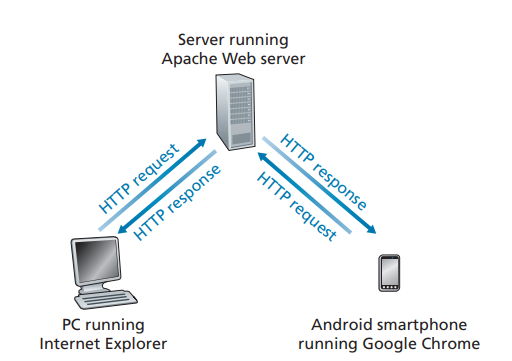
**Figure 2.6**  ♦  HTTP request-response behavior

HTTP request messages for the objects in the page to the server. The server receives the requests and responds with HTTP response messages that contain the objects.

HTTP uses TCP as its underlying transport protocol (rather than running on top of UDP). The HTTP client first initiates a TCP connection with the server. Once the connection is established, the browser and the server processes access TCP through their socket interfaces. As described in Section 2.1, on the client side the socket inter- face is the door between the client process and the TCP connection; on the server side it is the door between the server process and the TCP connection. The client sends HTTP request messages into its socket interface and receives HTTP response mes- sages from its socket interface. Similarly, the HTTP server receives request messages from its socket interface and sends response messages into its socket interface. Once the client sends a message into its socket interface, the message is out of the client’s hands and is “in the hands” of TCP. Recall from Section 2.1 that TCP provides a reliable data transfer service to HTTP. This implies that each HTTP request message sent by a client process eventually arrives intact at the server; similarly, each HTTP response message sent by the server process eventually arrives intact at the client. Here we see one of the great advantages of a layered architecture—HTTP need not worry about lost data or the details of how TCP recovers from loss or reordering of data within the network. That is the job of TCP and the protocols in the lower layers of the protocol stack.

It is important to note that the server sends requested files to clients without storing any state information about the client. If a particular client asks for the same object twice in a period of a few seconds, the server does not respond by saying that it just served the object to the client; instead, the server resends the object, as it has completely forgotten what it did earlier. Because an HTTP server maintains

no information about the clients HTTP is said to be a **stateless protocol**. We also remark that the Web uses the client-server application architecture, as described in Section 2.1. A Web server is always on, with a fixed IP address, and it services requests from potentially millions of different browsers.

The original version of HTTP is called HTTP/1.0 and dates back to the early 1990’s [RFC 1945]. As of 2020, the majority of HTTP transactions take place over HTTP/1.1 [RFC 7230]. However, increasingly browsers and Web servers also sup- port a new version of HTTP called HTTP/2 [RFC 7540]. At the end of this Section, we’ll provide an introduction to HTTP/2.

### Non-Persistent and Persistent Connections
In many Internet applications, the client and server communicate for an extended period of time, with the client making a series of requests and the server respond- ing to each of the requests. Depending on the application and on how the application is being used, the series of requests may be made back-to-back, peri- odically at regular intervals, or intermittently. When this client-server interaction is taking place over TCP, the application developer needs to make an important decision—should each request/response pair be sent over a _separate_ TCP connec- tion, or should all of the requests and their corresponding responses be sent over the _same_ TCP connection? In the former approach, the application is said to use **non-persistent connections**; and in the latter approach, **persistent connections
. To gain a deep understanding of this design issue, let’s examine the advantages and dis- advantages of persistent connections in the context of a specific application, namely, HTTP, which can use both non-persistent connections and persistent connections. Although HTTP uses persistent connections in its default mode, HTTP clients and servers can be configured to use non-persistent connections instead.

**HTTP with Non-Persistent Connections**

Let’s walk through the steps of transferring a Web page from server to client for the case of non-persistent connections. Let’s suppose the page consists of a base HTML file and 10 JPEG images, and that all 11 of these objects reside on the same server. Further suppose the URL for the base HTML file is

http://www.someSchool.edu/someDepartment/home.index

Here is what happens:

1\. The HTTP client process initiates a TCP connection to the server www.someSchool.edu on port number 80, which is the default port number for HTTP. Associated with the TCP connection, there will be a socket at the client and a socket at the server.2\. The HTTP client sends an HTTP request message to the server via its socket. The request message includes the path name /someDepartment/home .index. (We will discuss HTTP messages in some detail below.)

3\. The HTTP server process receives the request message via its socket, retrieves the object /someDepartment/home.index from its storage (RAM or disk), encapsulates the object in an HTTP response message, and sends the response message to the client via its socket.

4\. The HTTP server process tells TCP to close the TCP connection. (But TCP doesn’t actually terminate the connection until it knows for sure that the client has received the response message intact.)

5\. The HTTP client receives the response message. The TCP connection termi- nates. The message indicates that the encapsulated object is an HTML file. The client extracts the file from the response message, examines the HTML file, and finds references to the 10 JPEG objects.

6\. The first four steps are then repeated for each of the referenced JPEG objects.

As the browser receives the Web page, it displays the page to the user. Two different browsers may interpret (that is, display to the user) a Web page in some- what different ways. HTTP has nothing to do with how a Web page is interpreted by a client. The HTTP specifications ([RFC 1945] and [RFC 7540]) define only the communication protocol between the client HTTP program and the server HTTP program.

The steps above illustrate the use of non-persistent connections, where each TCP connection is closed after the server sends the object—the connection does not persist for other objects. HTTP/1.0 employes non-persistent TCP connections. Note that each non-persistent TCP connection transports exactly one request message and one response message. Thus, in this example, when a user requests the Web page, 11 TCP connections are generated.

In the steps described above, we were intentionally vague about whether the client obtains the 10 JPEGs over 10 serial TCP connections, or whether some of the JPEGs are obtained over parallel TCP connections. Indeed, users can configure some browsers to control the degree of parallelism. Browsers may open multiple TCP con- nections and request different parts of the Web page over the multiple connections. As we’ll see in the next chapter, the use of parallel connections shortens the response time.

Before continuing, let’s do a back-of-the-envelope calculation to estimate the amount of time that elapses from when a client requests the base HTML file until the entire file is received by the client. To this end, we define the **round-trip time (RTT)**, which is the time it takes for a small packet to travel from client to server and then back to the client. The RTT includes packet-propagation delays, packet- queuing delays in intermediate routers and switches, and packet-processing delays. (These delays were discussed in Section 1.4.) Now consider what happens when a user clicks on a hyperlink. As shown in Figure 2.7, this causes the browser to initiate a TCP connection between the browser and the Web server; this involvesa 
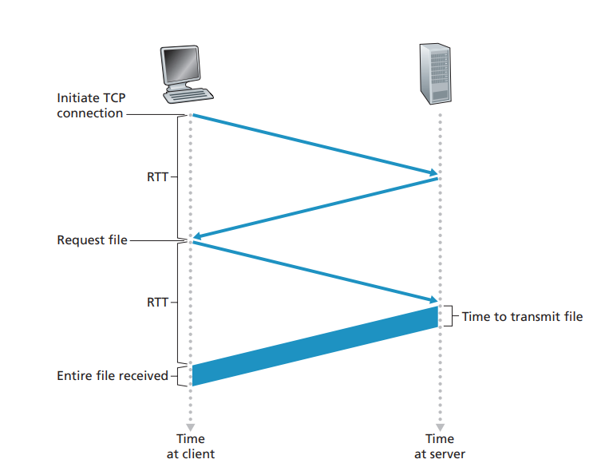
**Figure 2.7**  ♦  Back-of-the-envelope calculation for the time needed 
to request and receive an HTML filE

“three-way handshake”—the client sends a small TCP segment to the server, the server acknowledges and responds with a small TCP segment, and, finally, the cli- ent acknowledges back to the server. The first two parts of the three-way handshake take one RTT. After completing the first two parts of the handshake, the client sends the HTTP request message combined with the third part of the three-way handshake (the acknowledgment) into the TCP connection. Once the request message arrives at the server, the server sends the HTML file into the TCP connection. This HTTP request/response eats up another RTT. Thus, roughly, the total response time is two RTTs plus the transmission time at the server of the HTML file.

**HTTP with Persistent Connections**

Non-persistent connections have some shortcomings. First, a brand-new connection must be established and maintained for _each requested object_. For each of these connections, TCP buffers must be allocated and TCP variables must be kept in both the client and server. This can place a significant burden on the Web server, which may be serving requests from hundreds of different clients simultaneously. Second,
we just described, each object suffers a delivery delay of two RTTs—one RTT to establish the TCP connection and one RTT to request and receive an object.

With HTTP/1.1 persistent connections, the server leaves the TCP connection open after sending a response. Subsequent requests and responses between the same client and server can be sent over the same connection. In particular, an entire Web page (in the example above, the base HTML file and the 10 images) can be sent over a single persistent TCP connection. Moreover, multiple Web pages residing on the same server can be sent from the server to the same client over a single persistent TCP connection. These requests for objects can be made back-to-back, without wait- ing for replies to pending requests (pipelining). Typically, the HTTP server closes a connection when it isn’t used for a certain time (a configurable timeout interval). When the server receives the back-to-back requests, it sends the objects back-to- back. The default mode of HTTP uses persistent connections with pipelining. We’ll quantitatively compare the performance of non-persistent and persistent connections in the homework problems of Chapters 2 and 3. You are also encouraged to see [Heidemann 1997; Nielsen 1997; RFC 7540].

### HTTP Message Format
 The HTTP specifications [RFC 1945; RFC 7230; RFC 7540] include the definitions of the HTTP message formats. There are two types of HTTP messages, request mes- sages and response messages, both of which are discussed below.

**HTTP Request Message**

Below we provide a typical HTTP request message:
```
GET /somedir/page.html HTTP/1.1 
Host: www.someschool.edu 
Connection: close 
User-agent: Mozilla/5.0 
Accept-language: fr
```
We can learn a lot by taking a close look at this simple request message. First of all, we see that the message is written in ordinary ASCII text, so that your ordinary computer-literate human being can read it. Second, we see that the message consists of five lines, each followed by a carriage return and a line feed. The last line is fol- lowed by an additional carriage return and line feed. Although this particular request message has five lines, a request message can have many more lines or as few as one line. The first line of an HTTP request message is called the **request line**; the subsequent lines are called the **header lines**. The request line has three fields: the method field, the URL field, and the HTTP version field. The method field can take on several different values, including GET, POST, HEAD, PUT, and DELETE.The great majority of HTTP request messages use the GET method. The GET method is used when the browser requests an object, with the requested object identified in the URL field. In this example, the browser is requesting the object /somedir/ page.html. The version is self-explanatory; in this example, the browser imple- ments version HTTP/1.1.

Now let’s look at the header lines in the example. The header line Host: www.someschool.edu specifies the host on which the object resides. You might think that this header line is unnecessary, as there is already a TCP connection in place to the host. But, as we’ll see in Section 2.2.5, the information provided by the host header line is required by Web proxy caches. By including the Connection: close header line, the browser is telling the server that it doesn’t want to bother with persistent connections; it wants the server to close the connection after sending the requested object. The User-agent: header line specifies the user agent, that is, the browser type that is making the request to the server. Here the user agent is Mozilla/5.0, a Firefox browser. This header line is useful because the server can actu- ally send different versions of the same object to different types of user agents. (Each of the versions is addressed by the same URL.) Finally, the Accept-language: header indicates that the user prefers to receive a French version of the object, if such an object exists on the server; otherwise, the server should send its default version. The Accept-language: header is just one of many content negotiation headers available in HTTP.

Having looked at an example, let’s now look at the general format of a request message, as shown in Figure 2.8. We see that the general format closely follows our earlier example. You may have noticed, however, that after the header lines (and the additional carriage return and line feed) there is an “entity body.”

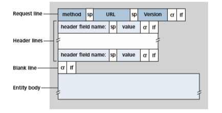
**Figure 2.8**  ♦  General format of an HTTP request messageis 

empty with the GET method, but is used with the POST method. An HTTP client often uses the POST method when the user fills out a form—for example, when a user provides search words to a search engine. With a POST message, the user is still requesting a Web page from the server, but the specific contents of the Web page depend on what the user entered into the form fields. If the value of the method field is POST, then the entity body contains what the user entered into the form fields.

We would be remiss if we didn’t mention that a request generated with a form does not necessarily have to use the POST method. Instead, HTML forms often use the GET method and include the inputted data (in the form fields) in the requested URL. For example, if a form uses the GET method, has two fields, and the inputs to the two fields are monkeys and bananas, then the URL will have the structure www.somesite.com/animalsearch?monkeys&bananas. In your day-to- day Web surfing, you have probably noticed extended URLs of this sort.

The HEAD method is similar to the GET method. 
When a server receives a request with the HEAD method, it responds with an HTTP message but it leaves out the requested object. Application developers often use the HEAD method for debug- ging. The PUT method is often used in conjunction with Web publishing tools. It allows a user to upload an object to a specific path (directory) on a specific Web server. The PUT method is also used by applications that need to upload objects to Web servers. The DELETE method allows a user, or an application, to delete an object on a Web server.

**HTTP Response Message**

Below we provide a typical HTTP response message. This response message could be the response to the example request message just discussed.
```
HTTP/1.1 200 OK 
Connection: close 
Date: Tue, 18 Aug 2015 15:44:04 GMT 
Server: Apache/2.2.3 (CentOS) 
Last-Modified: Tue, 18 Aug 2015 15:11:03 GMT Content-Length: 6821 
Content-Type: text/html

(data data data data data...)
```
Let’s take a careful look at this response message. It has three Sections: an initial **status line**, six **header lines**, and then the **entity body**. The entity body is the meat of the message—it contains the requested object itself (represented by data data data data data ...). The status line has three fields: the protocol version field, a status code, and a corresponding status message. In this example, the status line indicates that the server is using HTTP/1.1 and that everything is OK (that is, the server has found, and is sending, the requested object).
Now let’s look at the header lines. The server uses the Connection: close header line to tell the client that it is going to close the TCP connection after sending the message. The Date: header line indicates the time and date when the HTTP response was created and sent by the server. Note that this is not the time when the object was created or last modified; it is the time when the server retrieves the object from its file system, inserts the object into the response message, and sends the response message. The Server: header line indicates that the message was gener- ated by an Apache Web server; it is analogous to the User-agent: header line in the HTTP request message. The Last-Modified: header line indicates the time and date when the object was created or last modified. The Last-Modified: header, which we will soon cover in more detail, is critical for object caching, both in the local client and in network cache servers (also known as proxy servers). The Content-Length: header line indicates the number of bytes in the object being sent. The Content-Type: header line indicates that the object in the entity body is HTML text. (The object type is officially indicated by the Content-Type: header and not by the file extension.)

Having looked at an example, let’s now examine the general format of a response message, which is shown in Figure 2.9. This general format of the response message matches the previous example of a response message. Let’s say a few additional words about status codes and their phrases. The status code and associated phrase indicate the result of the request. Some common status codes and associated phrases include:

• 200 OK: Request succeeded and the information is returned in the response.

• 301 Moved Permanently: Requested object has been permanently moved; the new URL is specified in Location: header of the response message. The client software will automatically retrieve the new URL.

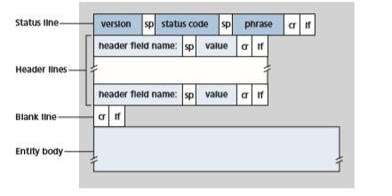
**Figure 2.9**  ♦  General format of an HTTP response message

• 400 Bad Request: This is a generic error code indicating that the request could not be understood by the server.

• 404 Not Found: The requested document does not exist on this server.

• 505 HTTP Version Not Supported: The requested HTTP protocol ver- sion is not supported by the server.

How would you like to see a real HTTP response message? This is highly rec- ommended and very easy to do! First Telnet into your favorite Web server. Then type in a one-line request message for some object that is housed on the server. For example, if you have access to a command prompt, type:
```
telnet gaia.cs.umass.edu 80

GET /kurose\_ross/interactive/index.php HTTP/1.1 Host: gaia.cs.umass.edu
```
(Press the carriage return twice after typing the last line.) This opens a TCP con- nection to port 80 of the host gaia.cs.umass.edu and then sends the HTTP request message. You should see a response message that includes the base HTML file for the interactive homework problems for this textbook. If you’d rather just see the HTTP message lines and not receive the object itself, replace GET with HEAD.

In this Section, we discussed a number of header lines that can be used within HTTP request and response messages. The HTTP specification defines many, many more header lines that can be inserted by browsers, Web servers, and net- work cache servers. We have covered only a small number of the totality of header lines. We’ll cover a few more below and another small number when we discuss network Web caching in Section 2.2.5. A highly readable and comprehensive dis- cussion of the HTTP protocol, including its headers and status codes, is given in [Krishnamurthy 2001].

How does a browser decide which header lines to include in a request message? How does a Web server decide which header lines to include in a response mes- sage? A browser will generate header lines as a function of the browser type and version, the user configuration of the browser and whether the browser currently has a cached, but possibly out-of-date, version of the object. Web servers behave similarly: There are different products, versions, and configurations, all of which influence which header lines are included in response messages.

### User-Server Interaction: Cookies
 We mentioned above that an HTTP server is stateless. This simplifies server design and has permitted engineers to develop high-performance Web servers that can han- dle thousands of simultaneous TCP connections. However, it is often desirable for a Web site to identify users, either because the server wishes to restrict user access or because it wants to serve content as a function of the user identity. For these pur- poses, HTTP uses cookies. Cookies, defined in [RFC 6265], allow sites to keep track of users. Most major commercial Web sites use cookies today.

As shown in Figure 2.10, cookie technology has four components: (1) a cookie header line in the HTTP response message; (2) a cookie header line in the HTTP request message; (3) a cookie file kept on the user’s end system and managed by the user’s browser; and (4) a back-end database at the Web site. Using Figure 2.10, let’s walk through an example of how cookies work. Suppose Susan, who always

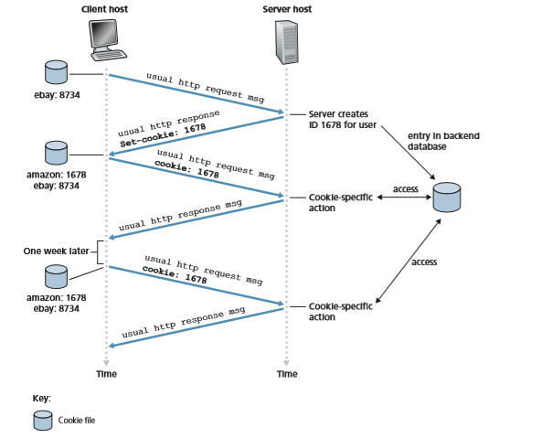
**Figure 2.10**  ♦  Keeping user state with cookiesaccesses the Web using Internet Explorer from her home PC, contacts Amazon.com for the first time. Let us suppose that in the past she has already visited the eBay site. When the request comes into the Amazon Web server, the server creates a unique identification number and creates an entry in its back-end database that is indexed by the identification number. The Amazon Web server then responds to Susan’s browser, including in the HTTP response a Set-cookie: header, which contains the identification number. For example, the header line might be:
```
Set-cookie: 1678
```
When Susan’s browser receives the HTTP response message, it sees the Set-cookie: header. The browser then appends a line to the special cookie file that it manages. This line includes the hostname of the server and the identification number in the Set-cookie: header. Note that the cookie file already has an entry for eBay, since Susan has visited that site in the past. As Susan continues to browse the Amazon site, each time she requests a Web page, her browser consults her cookie file, extracts her identification number for this site, and puts a cookie header line that includes the identification number in the HTTP request. Specifically, each of her HTTP requests to the Amazon server includes the header line:
```
Cookie: 1678
```
In this manner, the Amazon server is able to track Susan’s activity at the Amazon site. Although the Amazon Web site does not necessarily know Susan’s name, it knows exactly which pages user 1678 visited, in which order, and at what times! Amazon uses cookies to provide its shopping cart service—Amazon can maintain a list of all of Susan’s intended purchases, so that she can pay for them collectively at the end of the session.

If Susan returns to Amazon’s site, say, one week later, her browser will con- tinue to put the header line Cookie: 1678 in the request messages. Amazon also recommends products to Susan based on Web pages she has visited at Amazon in the past. If Susan also registers herself with Amazon—providing full name, e-mail address, postal address, and credit card information—Amazon can then include this information in its database, thereby associating Susan’s name with her identifica- tion number (and all of the pages she has visited at the site in the past!). This is how Amazon and other e-commerce sites provide “one-click shopping”—when Susan chooses to purchase an item during a subsequent visit, she doesn’t need to re-enter her name, credit card number, or address.

From this discussion, we see that cookies can be used to identify a user. The first time a user visits a site, the user can provide a user identification (possibly his or her name). During the subsequent sessions, the browser passes a cookie header to the server, thereby identifying the user to the server. Cookies can thus be used to create a user session layer on top of stateless HTTP. For example, when a user logs in toa Web-based e-mail application (such as Hotmail), the browser sends cookie infor- mation to the server, permitting the server to identify the user throughout the user’s session with the application.

Although cookies often simplify the Internet shopping experience for the user, they are controversial because they can also be considered as an invasion of privacy. As we just saw, using a combination of cookies and user-supplied account informa- tion, a Web site can learn a lot about a user and potentially sell this information to a third party.

### Web CachingA

**Web cache**—also called a **proxy server**
—is a network entity that satisfies HTTP requests on the behalf of an origin Web server. The Web cache has its own disk storage and keeps copies of recently requested objects in this storage. As shown in Figure 2.11, a user’s browser can be configured so that all of the user’s HTTP requests are first directed to the Web cache [RFC 7234]. Once a browser is configured, each browser request for an object is first directed to the Web cache. As an example, suppose a browser is requesting the object http://www.someschool.edu/ campus.gif. Here is what happens:

1\. The browser establishes a TCP connection to the Web cache and sends an HTTP request for the object to the Web cache.

2\. The Web cache checks to see if it has a copy of the object stored locally. If it does, the Web cache returns the object within an HTTP response message to the client browser.

3\. If the Web cache does not have the object, the Web cache opens a TCP connec- tion to the origin server, that is, to www.someschool.edu. The Web cache


**Figure 2.11**  ♦  Clients requesting objects through a Web cache
then sends an HTTP request for the object into the cache-to-server TCP connec- tion. After receiving this request, the origin server sends the object within an HTTP response to the Web cache.

4\. When the Web cache receives the object, it stores a copy in its local storage and sends a copy, within an HTTP response message, to the client browser (over the existing TCP connection between the client browser and the Web cache).

Note that a cache is both a server and a client at the same time. When it receives requests from and sends responses to a browser, it is a server. When it sends requests to and receives responses from an origin server, it is a client.

Typically a Web cache is purchased and installed by an ISP. For example, a uni- versity might install a cache on its campus network and configure all of the campus browsers to point to the cache. Or a major residential ISP (such as Comcast) might install one or more caches in its network and preconfigure its shipped browsers to point to the installed caches.

Web caching has seen deployment in the Internet for two reasons. First, a Web cache can substantially reduce the response time for a client request, particularly if the bottleneck bandwidth between the client and the origin server is much less than the bottleneck bandwidth between the client and the cache. If there is a high-speed connection between the client and the cache, as there often is, and if the cache has the requested object, then the cache will be able to deliver the object rapidly to the client. Second, as we will soon illustrate with an example, Web caches can sub- stantially reduce traffic on an institution’s access link to the Internet. By reducing traffic, the institution (for example, a company or a university) does not have to upgrade bandwidth as quickly, thereby reducing costs. Furthermore, Web caches can substantially reduce Web traffic in the Internet as a whole, thereby improving performance for all applications.

To gain a deeper understanding of the benefits of caches, let’s consider an exam- ple in the context of Figure 2.12. This figure shows two networks—the institutional network and the rest of the public Internet. The institutional network is a high-speed LAN. A router in the institutional network and a router in the Internet are connected by a 15 Mbps link. The origin servers are attached to the Internet but are located all over the globe. Suppose that the average object size is 1 Mbits and that the average request rate from the institution’s browsers to the origin servers is 15 requests per second. Suppose that the HTTP request messages are negligibly small and thus cre- ate no traffic in the networks or in the access link (from institutional router to Internet router). Also suppose that the amount of time it takes from when the router on the Internet side of the access link in Figure 2.12 forwards an HTTP request (within an IP datagram) until it receives the response (typically within many IP datagrams) is two seconds on average. Informally, we refer to this last delay as the “Internet delay.”

The total response time—that is, the time from the browser’s request of an object until its receipt of the object—is the sum of the LAN delay, the access delay (that is, the delay between the two routers), and the Internet delay. Let’s now do**Public Internet**

**Institutional network**

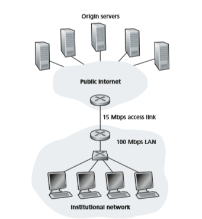
**Figure 2.12**  ♦  Bottleneck between an institutional network and the Internet

a very crude calculation to estimate this delay. The traffic intensity on the LAN (see Section 1.4.2) is


(15 requests/sec) . (1 Mbits/request)/(100 Mbps) = 0.15

whereas the traffic intensity on the access link (from the Internet router to institution router) is

(15 requests/sec) . (1 Mbits/request)/(15 Mbps) = 1

A traffic intensity of 0.15 on a LAN typically results in, at most, tens of millisec- onds of delay; hence, we can neglect the LAN delay. However, as discussed in Section 1.4.2, as the traffic intensity approaches 1 (as is the case of the access link in Figure 2.12), the delay on a link becomes very large and grows without bound. Thus, the average response time to satisfy requests is going to be on the order of minutes, if not more, which is unacceptable for the institution’s users. Clearly something must be done.

One possible solution is to increase the access rate from 15 Mbps to, say, 100 Mbps. This will lower the traffic intensity on the access link to 0.15, which translates to neg- ligible delays between the two routers. In this case, the total response time will roughly be two seconds, that is, the Internet delay. But this solution also means that the institu- tion must upgrade its access link from 15 Mbps to 100 Mbps, a costly proposition.

Now consider the alternative solution of not upgrading the access link but instead installing a Web cache in the institutional network. This solution is illustrated in Figure 2.13. Hit rates—the fraction of requests that are satisfied by a cache— typically range from 0.2 to 0.7 in practice. For illustrative purposes, let’s suppose that the cache provides a hit rate of 0.4 for this institution. Because the clients and the cache are connected to the same high-speed LAN, 40 percent of the requests will be satisfied almost immediately, say, within 10 milliseconds, by the cache. Neverthe- less, the remaining 60 percent of the requests still need to be satisfied by the origin servers. But with only 60 percent of the requested objects passing through the access link, the traffic intensity on the access link is reduced from 1.0 to 0.6. Typically, a


**Figure 2.13**  ♦  Adding a cache to the institutional network

traffic intensity less than 0.8 corresponds to a small delay, say, tens of milliseconds, on a 15 Mbps link. This delay is negligible compared with the two-second Internet delay. Given these considerations, average delay therefore is

0.4.(0.01 seconds) + 0.6.(2.01 seconds)

which is just slightly greater than 1.2 seconds. Thus, this second solution provides an even lower response time than the first solution, and it doesn’t require the institution to upgrade its link to the Internet. The institution does, of course, have to purchase and install a Web cache. But this cost is low—many caches use public-domain soft- ware that runs on inexpensive PCs.

Through the use of **Content Distribution Networks (CDNs)**, Web caches are increasingly playing an important role in the Internet. A CDN company installs many geographically distributed caches throughout the Internet, thereby localizing much of the traffic. There are shared CDNs (such as Akamai and Limelight) and dedicated CDNs (such as Google and Netflix). We will discuss CDNs in more detail in Section 2.6.

**The Conditional GET**

Although caching can reduce user-perceived response times, it introduces a new problem—the copy of an object residing in the cache may be stale. In other words, the object housed in the Web server may have been modified since the copy was cached at the client. Fortunately, HTTP has a mechanism that allows a cache to verify that its objects are up to date. This mechanism is called the **conditional GET** [RFC 7232]. An HTTP request message is a so-called conditional GET message if (1) the request message uses the GET method and (2) the request message includes an 

```
If-Modified-Since: header line.
```
To illustrate how the conditional GET operates, let’s walk through an example. First, on the behalf of a requesting browser, a proxy cache sends a request message to a Web server:
```
GET /fruit/kiwi.gif HTTP/1.1
Host: www.exotiquecuisine.com
```
Second, the Web server sends a response message with the requested object to the cache:
```
HTTP/1.1 200 OK 
Date: Sat, 3 Oct 2015 15:39:29 
Server: Apache/1.3.0 (Unix) 
Last-Modified: Wed, 9 Sep 2015 09:23:24 
Content-Type: image/gif
(data data data data data ...)
```
The cache forwards the object to the requesting browser but also caches the object locally. Importantly, the cache also stores the last-modified date along with the object. Third, one week later, another browser requests the same object via the cache, and the object is still in the cache. Since this object may have been modified at the Web server in the past week, the cache performs an up-to-date check by issuing a conditional GET. Specifically, the cache sends:
```
GET /fruit/kiwi.gif HTTP/1.1 
Host: www.exotiquecuisine.com 
If-modified-since: Wed, 9 Sep 2015 09:23:24
```
Note that the value of the If-modified-since: header line is exactly equal to the value of the Last-Modified: header line that was sent by the server one week ago. This conditional GET is telling the server to send the object only if the object has been modified since the specified date. Suppose the object has not been modified since 9 Sep 2015 09:23:24. Then, fourth, the Web server sends a response message to the cache:
```
HTTP/1.1 304 Not Modified 
Date: Sat, 10 Oct 2015 15:39:29 
Server: Apache/1.3.0 (Unix)

(empty entity body)
```
We see that in response to the conditional GET, the Web server still sends a response message but does not include the requested object in the response message. Including the requested object would only waste bandwidth and increase user- perceived response time, particularly if the object is large. Note that this last response message has 304 Not Modified in the status line, which tells the cache that it can go ahead and forward its (the proxy cache’s) cached copy of the object to the requesting browser.

### HTTP/2

HTTP/2 [RFC 7540], standardized in 2015, was the first new version of HTTP since HTTP/1.1, which was standardized in 1997. Since standardization, HTTP/2 has taken off, with over 40% of the top 10 million websites supporting HTTP/2 in 2020 [W3Techs]. Most browsers—including Google Chrome, Internet Explorer, Safari, Opera, and Firefox—also support HTTP/2.

The primary goals for HTTP/2 are to reduce perceived latency by enabling request and response multiplexing over a _single_ TCP connection, provide request prioritization and server push, and provide efficient compression of HTTP header fields. HTTP/2 does not change HTTP methods, status codes, URLs, or header fields. Instead, HTTP/2 changes how the data is formatted and transported between the client and server.To motivate the need for HTTP/2, recall that HTTP/1.1 uses persistent TCP connections, allowing a Web page to be sent from server to client over a single TCP connection. By having only one TCP connection per Web page, the number of sockets at the server is reduced and each transported Web page gets a fair share of the network bandwidth (as discussed below). But developers of Web browsers quickly discovered that sending all the objects in a Web page over a single TCP connec- tion has a **Head of Line (HOL) blocking** problem. To understand HOL blocking, consider a Web page that includes an HTML base page, a large video clip near the top of Web page, and many small objects below the video. Further suppose there is a low-to-medium speed bottleneck link (for example, a low-speed wireless link) on the path between server and client. Using a single TCP connection, the video clip will take a long time to pass through the bottleneck link, while the small objects are delayed as they wait behind the video clip; that is, the video clip at the head of the line blocks the small objects behind it. HTTP/1.1 browsers typically work around this problem by opening multiple parallel TCP connections, thereby having objects in the same web page sent in parallel to the browser. This way, the small objects can arrive at and be rendered in the browser much faster, thereby reducing user-perceived delay.

TCP congestion control, discussed in detail in Chapter 3, also provides brows- ers an unintended incentive to use multiple parallel TCP connections rather than a single persistent connection. Very roughly speaking, TCP congestion control aims to give each TCP connection sharing a bottleneck link an equal share of the available bandwidth of that link; so if there are _n_ TCP connections operating over a bottleneck link, then each connection approximately gets _1/n_th of the bandwidth. By opening multiple parallel TCP connections to transport a single Web page, the browser can “cheat” and grab a larger portion of the link bandwidth. Many HTTP/1.1 browsers open up to six parallel TCP connections not only to circumvent HOL blocking but also to obtain more bandwidth.

One of the primary goals of HTTP/2 is to get rid of (or at least reduce the num- ber of) parallel TCP connections for transporting a single Web page. This not only reduces the number of sockets that need to be open and maintained at servers, but also allows TCP congestion control to operate as intended. But with only one TCP connection to transport a Web page, HTTP/2 requires carefully designed mecha- nisms to avoid HOL blocking.

**HTTP/2 Framing**

The HTTP/2 solution for HOL blocking is to break each message into small frames, and interleave the request and response messages on the same TCP connection. To under- stand this, consider again the example of a Web page consisting of one large video clip and, say, 8 smaller objects. Thus the server will receive 9 concurrent requests from any browser wanting to see this Web page. For each of these requests, the server needs to send 9 competing HTTP response messages to the browser. Suppose all frames are offixed length, the video clip consists of 1000 frames, and each of the smaller objects consists of two frames. With frame interleaving, after sending one frame from the video clip, the first frames of each of the small objects are sent. Then after sending the second frame of the video clip, the last frames of each of the small objects are sent. Thus, all of the smaller objects are sent after sending a total of 18 frames. If interleav- ing were not used, the smaller objects would be sent only after sending 1016 frames. Thus the HTTP/2 framing mechanism can significantly decrease user-perceived delay.

The ability to break down an HTTP message into independent frames, inter- leave them, and then reassemble them on the other end is the single most important enhancement of HTTP/2. The framing is done by the framing sub-layer of the HTTP/2 protocol. When a server wants to send an HTTP response, the response is processed by the framing sub-layer, where it is broken down into frames. The header field of the response becomes one frame, and the body of the message is broken down into one for more additional frames. The frames of the response are then interleaved by the framing sub-layer in the server with the frames of other responses and sent over the single persistent TCP connection. As the frames arrive at the client, they are first reassembled into the original response messages at the framing sub-layer and then processed by the browser as usual. Similarly, a client’s HTTP requests are broken into frames and interleaved.

In addition to breaking down each HTTP message into independent frames, the framing sublayer also binary encodes the frames. Binary protocols are more efficient to parse, lead to slightly smaller frames, and are less error-prone.

**Response Message Prioritization and Server Pushing**

Message prioritization allows developers to customize the relative priority of requests to better optimize application performance. As we just learned, the fram- ing sub-layer organizes messages into parallel streams of data destined to the same requestor. When a client sends concurrent requests to a server, it can prioritize the responses it is requesting by assigning a weight between 1 and 256 to each message. The higher number indicates higher priority. Using these weights, the server can send first the frames for the responses with the highest priority. In addition to this, the client also states each message’s dependency on other messages by specifying the ID of the message on which it depends.

Another feature of HTTP/2 is the ability for a server to send multiple responses for a single client request. That is, in addition to the response to the original request, the server can _push_ additional objects to the client, without the client having to request each one. This is possible since the HTML base page indicates the objects that will be needed to fully render the Web page. So instead of waiting for the HTTP requests for these objects, the server can analyze the HTML page, identify the objects that are needed, and send them to the client _before receiving explicit requests for these objects_. Server push eliminates the extra latency due to waiting for the requests.

**HTTP/3**

QUIC, discussed in Chapter 3, is a new “transport” protocol that is implemented in the application layer over the bare-bones UDP protocol. QUIC has several features that are desirable for HTTP, such as message multiplexing (interleaving), per-stream flow control, and low-latency connection establishment. HTTP/3 is yet a new HTTP protocol that is designed to operate over QUIC. As of 2020, HTTP/3 is described in Internet drafts and has not yet been fully standardized. Many of the HTTP/2 fea- tures (such as message interleaving) are subsumed by QUIC, allowing for a simpler, streamlined design for HTTP/3.

## Electronic Mail in the Internet
Electronic mail has been around since the beginning of the Internet. It was the most popular application when the Internet was in its infancy [Segaller 1998], and has become more elaborate and powerful over the years. It remains one of the Internet’s most important and utilized applications.

As with ordinary postal mail, e-mail is an asynchronous communication medium—people send and read messages when it is convenient for them, without having to coordinate with other people’s schedules. In contrast with postal mail, electronic mail is fast, easy to distribute, and inexpensive. Modern e-mail has many powerful features, including messages with attachments, hyperlinks, HTML- formatted text, and embedded photos.

In this Section, we examine the application-layer protocols that are at the heart of Internet e-mail. But before we jump into an in-depth discussion of these protocols, let’s take a high-level view of the Internet mail system and its key components.

Figure 2.14 presents a high-level view of the Internet mail system. We see from this diagram that it has three major components: **user agents**, **mail servers**, and the **Simple Mail Transfer Protocol (SMTP)**. We now describe each of these compo- nents in the context of a sender, Alice, sending an e-mail message to a recipient, Bob. User agents allow users to read, reply to, forward, save, and compose messages. Examples of user agents for e-mail include Microsoft Outlook, Apple Mail, Web- based Gmail, the Gmail App running in a smartphone, and so on. When Alice is finished composing her message, her user agent sends the message to her mail server, where the message is placed in the mail server’s outgoing message queue. When Bob wants to read a message, his user agent retrieves the message from his mailbox in his mail server.

Mail servers form the core of the e-mail infrastructure. Each recipient, such as Bob, has a **mailbox** located in one of the mail servers. Bob’s mailbox manages and maintains the messages that have been sent to him. A typical message starts its journey in the sender’s user agent, then travels to the sender’s mail server.
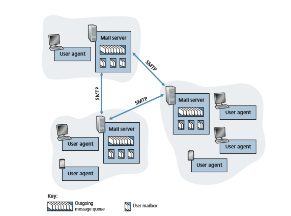
**Figure 2.14**  ♦  A high-level view of the Internet e-mail system

travels to the recipient’s mail server, where it is deposited in the recipient’s mailbox. When Bob wants to access the messages in his mailbox, the mail server containing his mailbox authenticates Bob (with his username and password). Alice’s mail server must also deal with failures in Bob’s mail server. If Alice’s server cannot deliver mail to Bob’s server, Alice’s server holds the message in a **message queue** and attempts to transfer the message later. Reattempts are often done every 30 minutes or so; if there is no success after several days, the server removes the message and notifies the sender (Alice) with an e-mail message.

SMTP is the principal application-layer protocol for Internet electronic mail. It uses the reliable data transfer service of TCP to transfer mail from the sender’s mail server to the recipient’s mail server. As with most application-layer protocols, SMTP has two sides: a client side, which executes on the sender’s mail server, and a server side, which executes on the recipient’s mail server. Both the client and server sides of

SMTP run on every mail server. When a mail server sends mail to other mail servers, it acts as an SMTP client. When a mail server receives mail from other mail servers, it acts as an SMTP server.

### SMTP
 SMTP, defined in RFC 5321, is at the heart of Internet electronic mail. As men- tioned above, SMTP transfers messages from senders’ mail servers to the recipients’ mail servers. SMTP is much older than HTTP. (The original SMTP RFC dates back to 1982, and SMTP was around long before that.) Although SMTP has numerous wonderful qualities, as evidenced by its ubiquity in the Internet, it is nevertheless a legacy technology that possesses certain archaic characteristics. For example, it restricts the body (not just the headers) of all mail messages to simple 7-bit ASCII. This restriction made sense in the early 1980s when transmission capacity was scarce and no one was e-mailing large attachments or large image, audio, or video files. But today, in the multimedia era, the 7-bit ASCII restriction is a bit of a pain—it requires binary multimedia data to be encoded to ASCII before being sent over SMTP; and it requires the corresponding ASCII message to be decoded back to binary after SMTP transport. Recall from Section 2.2 that HTTP does not require multimedia data to be ASCII encoded before transfer.

To illustrate the basic operation of SMTP, let’s walk through a common sce- nario. Suppose Alice wants to send Bob a simple ASCII message.

1\. Alice invokes her user agent for e-mail, provides Bob’s e-mail address (for example, bob@someschool.edu), composes a message, and instructs the user agent to send the message.

2\. Alice’s user agent sends the message to her mail server, where it is placed in a message queue.

3\. The client side of SMTP, running on Alice’s mail server, sees the message in the message queue. It opens a TCP connection to an SMTP server, running on Bob’s mail server.

4\. After some initial SMTP handshaking, the SMTP client sends Alice’s message into the TCP connection.

5\. At Bob’s mail server, the server side of SMTP receives the message. Bob’s mail server then places the message in Bob’s mailbox.

6\. Bob invokes his user agent to read the message at his convenience.

The scenario is summarized in Figure 2.15. 

It is important to observe that SMTP does not normally use intermediate mail servers for sending mail, even when the two mail servers are located at opposite ends of the world. If Alice’s server is in Hong Kong and Bob’s server is in St. Louis, the TCP connection is a direct connection between the Hong Kong and St. Louis servers. In

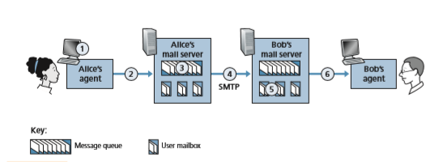
**Figure 2.15**  ♦  Alice sends a message to BobS

particular, if Bob’s mail server is down, the message remains in Alice’s mail server and waits for a new attempt—the message does not get placed in some intermediate mail server.

Let’s now take a closer look at how SMTP transfers a message from a send- ing mail server to a receiving mail server. We will see that the SMTP proto- col has many similarities with protocols that are used for face-to-face human interaction. First, the client SMTP (running on the sending mail server host) has TCP establish a connection to port 25 at the server SMTP (running on the receiv- ing mail server host). If the server is down, the client tries again later. Once this connection is established, the server and client perform some application- layer handshaking—just as humans often introduce themselves before trans- ferring information from one to another, SMTP clients and servers introduce themselves before transferring information. During this SMTP handshaking phase, the SMTP client indicates the e-mail address of the sender (the person who gener- ated the message) and the e-mail address of the recipient. Once the SMTP client and server have introduced themselves to each other, the client sends the message. SMTP can count on the reliable data transfer service of TCP to get the message to the server without errors. The client then repeats this process over the same TCP connection if it has other messages to send to the server; otherwise, it instructs TCP to close the connection.

Let’s next take a look at an example transcript of messages exchanged between an SMTP client (C) and an SMTP server (S). The hostname of the client is crepes.fr and the hostname of the server is hamburger.edu. The ASCII text lines prefaced with C: are exactly the lines the client sends into its TCP socket, and the ASCII text lines prefaced with S: are exactly the lines the server sends into its TCP socket. The following transcript begins as soon as the TCP connection is established.
```
S:  220 hamburger.edu
C:  HELO crepes.fr
S:  250 Hello crepes.fr, pleased to meet you
C:  MAIL FROM: <alice@crepes.fr>
S:  250 alice@crepes.fr ... Sender ok
C:  RCPT TO: <bob@hamburger.edu>
S:  250 bob@hamburger.edu ... Recipient ok
C:  DATA
S:  354 Enter mail, end with ”.” on a line by itself
C:  Do you like ketchup?
C:  How about pickles?
C:  .
S:  250 Message accepted for delivery
C:  QUIT
S:  221 hamburger.edu closing connection
```
In the example above, the client sends a message (“Do you like ketchup? How about pickles?”) from mail server crepes.fr to mail server hamburger.edu. As part of the dialogue, the client issued five commands: HELO (an abbreviation for HELLO), MAIL FROM, RCPT TO, DATA, and QUIT. These commands are self-explanatory. The client also sends a line consisting of a single period, which indicates the end of the message to the server. (In ASCII jar- gon, each message ends with CRLF.CRLF, where CR and LF stand for carriage return and line feed, respectively.) The server issues replies to each command, with each reply having a reply code and some (optional) English-language expla- nation. We mention here that SMTP uses persistent connections: If the sending mail server has several messages to send to the same receiving mail server, it can send all of the messages over the same TCP connection. For each message, the client begins the process with a new MAIL FROM: crepes.fr, designates the end of message with an isolated period, and issues QUIT only after all messages have been sent.

It is highly recommended that you use Telnet to carry out a direct dialogue with an SMTP server. To do this, issue
```
telnet serverName 25
``````
where ```serverName``` is the name of a local mail server. When you do this, you are simply establishing a TCP connection between your local host and the mail server. After typing this line, you should immediately receive the ```220``` reply from the server. Then issue the SMTP commands ```HELO, MAIL FROM, RCPT TO, DATA, CRLF.CRLF, and QUIT``` at the appropriate times. It is also highly recommended that you do Programming Assignment 3 at the end of this chapter. In that assign- ment, you’ll build a simple user agent that implements the client side of SMTP. It will allow you to send an e-mail message to an arbitrary recipient via a local mail server.

### Mail Message Formats

 When Alice writes an ordinary snail-mail letter to Bob, she may include all kinds of peripheral header information at the top of the letter, such as Bob’s address, her own return address, and the date. Similarly, when an e-mail message is sent from one person to another, a header containing peripheral information precedes the body of the message itself. This peripheral information is contained in a series of header lines, which are defined in RFC 5322. The header lines and the body of the message are separated by a blank line (that is, by CRLF). RFC 5322 specifies the exact format for mail header lines as well as their semantic interpretations. As with HTTP, each header line contains readable text, consisting of a keyword followed by a colon followed by a value. Some of the keywords are required and others are optional. Every header must have a From: header line and a To: header line; a header may include a Subject: header line as well as other optional header lines. It is important to note that these header lines are _different_ from the SMTP commands we studied in Section 2.3.1 (even though they contain some common words such as “from” and “to”). The commands in that Section were part of the SMTP handshaking protocol; the header lines examined in this Section are part of the mail message itself.

A typical message header looks like this:
```
From: alice@crepes.fr
To: bob@hamburger.edu 
Subject: Searching for the meaning of life.
```
After the message header, a blank line follows; then the message body (in ASCII) follows. You should use Telnet to send a message to a mail server that contains some header lines, including the Subject: header line. To do this, issue telnet serverName 25, as discussed in Section 2.3.1.

### Mail Access Protocols

Once SMTP delivers the message from Alice’s mail server to Bob’s mail server, the message is placed in Bob’s mailbox. Given that Bob (the recipient) executes his user agent on his local host (e.g., smartphone or PC), it is natural to consider placing a mail server on his local host as well. With this approach, Alice’s mail server would dia- logue directly with Bob’s PC. There is a problem with this approach, however. Recall that a mail server manages mailboxes and runs the client and server sides of SMTP. If Bob’s mail server were to reside on his local host, then Bob’s host would have to remain always on, and connected to the Internet, in order to receive new mail, which can arrive at any time. This is impractical for many Internet users. Instead, a typical user runs a user agent on the local host but accesses its mailbox stored on an always- on shared mail server. This mail server is shared with other users.


**Figure 2.16**  ♦  E-mail protocols and their communicating entities

Now let’s consider the path an e-mail message takes when it is sent from Alice to Bob. We just learned that at some point along the path the e-mail message needs to be deposited in Bob’s mail server. This could be done simply by having Alice’s user agent send the message directly to Bob’s mail server. However, typically the send- er’s user agent does not dialogue directly with the recipient’s mail server. Instead, as shown in Figure 2.16, Alice’s user agent uses SMTP or HTTP to deliver the e-mail message into her mail server, then Alice’s mail server uses SMTP (as an SMTP cli- ent) to relay the e-mail message to Bob’s mail server. Why the two-step procedure? Primarily because without relaying through Alice’s mail server, Alice’s user agent doesn’t have any recourse to an unreachable destination mail server. By having Alice first deposit the e-mail in her own mail server, Alice’s mail server can repeatedly try to send the message to Bob’s mail server, say every 30 minutes, until Bob’s mail server becomes operational. (And if Alice’s mail server is down, then she has the recourse of complaining to her system administrator!)

But there is still one missing piece to the puzzle! How does a recipient like Bob, running a user agent on his local host , obtain his messages, which are sitting in a mail server? Note that Bob’s user agent can’t use SMTP to obtain the messages because obtaining the messages is a pull operation, whereas SMTP is a push protocol.

Today, there are two common ways for Bob to retrieve his e-mail from a mail server. If Bob is using Web-based e-mail or a smartphone app (such as Gmail), then the user agent will use HTTP to retrieve Bob’s e-mail. This case requires Bob’s mail server to have an HTTP interface as well as an SMTP interface (to communicate with Alice’s mail server). The alternative method, typically used with mail clients such as Microsoft Outlook, is to use the **Internet Mail Access Protocol (IMAP)** defined in RFC 3501. Both the HTTP and IMAP approaches allow Bob to manage folders, maintained in Bob’s mail server. Bob can move messages into the folders he creates, delete messages, mark messages as important, and so on.

## DNS—The Internet’s Directory Service

We human beings can be identified in many ways. For example, we can be iden- tified by the names that appear on our birth certificates. We can be identified by our social security numbers. We can be identified by our driver’s license numbers.

Although each can be used to identify people, within a given context one identifier may be more appropriate than another. For example, the computers at the IRS (the infamous tax-collecting agency in the United States) prefer to use fixed-length social security numbers rather than birth certificate names. On the other hand, ordinary people prefer the more mnemonic birth certificate names rather than social security numbers. (Indeed, can you imagine saying, “Hi. My name is 132-67-9875. Please meet my husband, 178-87-1146.”)

Just as humans can be identified in many ways, so too can Internet hosts. One identifier for a host is its **hostname**. Hostnames—such as www.facebook.com, www.google.com, gaia.cs.umass.edu—are mnemonic and are therefore appreciated by humans. However, hostnames provide little, if any, information about the location within the Internet of the host. (A hostname such as www.eurecom. fr, which ends with the country code .fr, tells us that the host is probably in France, but doesn’t say much more.) Furthermore, because hostnames can consist of variable-length alphanumeric characters, they would be difficult to process by rout- ers. For these reasons, hosts are also identified by so-called **IP addresses**.

We discuss IP addresses in some detail in Chapter 4, but it is useful to say a few brief words about them now. An IP address consists of four bytes and has a rigid hierarchical structure. An IP address looks like 121.7.106.83, where each period separates one of the bytes expressed in decimal notation from 0 to 255. An IP address is hierarchical because as we scan the address from left to right, we obtain more and more specific information about where the host is located in the Internet (that is, within which network, in the network of networks). Similarly, when we scan a postal address from bottom to top, we obtain more and more specific information about where the addressee is located.

### Services Provided by DNS

We have just seen that there are two ways to identify a host—by a hostname and by an IP address. People prefer the more mnemonic hostname identifier, while routers prefer fixed-length, hierarchically structured IP addresses. In order to rec- oncile these preferences, we need a directory service that translates hostnames to IP addresses. This is the main task of the Internet’s **domain name system (DNS)**. The DNS is (1) a distributed database implemented in a hierarchy of **DNS servers
, and (2) an application-layer protocol that allows hosts to query the distributed database. The DNS servers are often UNIX machines running the Berkeley Inter- net Name Domain (BIND) software [BIND 2020]. The DNS protocol runs over UDP and uses port 53.

DNS is commonly employed by other application-layer protocols, including HTTP and SMTP, to translate user-supplied hostnames to IP addresses. As an exam- ple, consider what happens when a browser (that is, an HTTP client), running on some user’s host, requests the URL www.someschool.edu/index.html. In order for the user’s host to be able to send an HTTP request message to the Webserver ```www.someschool.edu,```the user’s host must first obtain the IP address of ```www.someschool.edu.``` This is done as follows.

1. The same user machine runs the client side of the DNS application. 
2. The browser extracts the hostname, www.someschool.edu, from the URL and passes the hostname to the client side of the DNS application. 
3. The DNS client sends a query containing the hostname to a DNS server. 
4. The DNS client eventually receives a reply, which includes the IP address for the hostname. 
5. Once the browser receives the IP address from DNS, it can initiate a TCP connection to the HTTP server process located at port 80 at that IP address.

We see from this example that DNS adds an additional delay—sometimes substantial—to the Internet applications that use it. Fortunately, as we discuss below, the desired IP address is often cached in a “nearby” DNS server, which helps to reduce DNS network traffic as well as the average DNS delay.

DNS provides a few other important services in addition to translating host- names to IP addresses:

• **Host aliasing.** A host with a complicated hostname can have one or more alias names. For example, a hostname such as relay1.west-coast .enterprise.com could have, say, two aliases such as enterprise.com and www.enterprise.com. In this case, the hostname relay1 .west-coast.enterprise.com is said to be a **canonical hostname**. Alias hostnames, when present, are typically more mnemonic than canonical host- names. DNS can be invoked by an application to obtain the canonical hostname for a supplied alias hostname as well as the IP address of the host.

• **Mail server aliasing.** For obvious reasons, it is highly desirable that e-mail addresses be mnemonic. For example, if Bob has an account with Yahoo Mail, Bob’s e-mail address might be as simple as bob@yahoo.com. However, the hostname of the Yahoo mail server is more complicated and much less mnemonic than simply yahoo.com (for example, the canonical hostname might be some- thing like relay1.west-coast.yahoo.com). DNS can be invoked by a mail application to obtain the canonical hostname for a supplied alias hostname as well as the IP address of the host. In fact, the MX record (see below) permits a company’s mail server and Web server to have identical (aliased) hostnames; for example, a company’s Web server and mail server can both be called enter- prise.com.

• **Load distribution.** DNS is also used to perform load distribution among replicated servers, such as replicated Web servers. Busy sites, such as cnn.com, are replicated over multiple servers, with each server running on a different end system and each having a different IP address. For replicated Web servers,


addresses is thus associated with one alias hostname. The DNS database contains this set of IP addresses. When clients make a DNS query for a name mapped to a set of addresses, the server responds with the entire set of IP addresses, but rotates the ordering of the addresses within each reply. Because a client typically sends its HTTP request message to the IP address that is listed first in the set, DNS rota- tion distributes the traffic among the replicated servers. DNS rotation is also used for e-mail so that multiple mail servers can have the same alias name. Also, con- tent distribution companies such as Akamai have used DNS in more sophisticated ways [Dilley 2002] to provide Web content distribution (see Section 2.6.3).

The DNS is specified in RFC 1034 and RFC 1035, and updated in several addi- tional RFCs. It is a complex system, and we only touch upon key aspects of its operation here. The interested reader is referred to these RFCs and the book by Albitz and Liu [Albitz 1993]; see also the retrospective paper [Mockapetris 1988], which provides a nice description of the what and why of DNS, and [Mockapetris 2005].

### Overview of How DNS Works

We now present a high-level overview of how DNS works. Our discussion will focus on the hostname-to-IP-address translation service.

Suppose that some application (such as a Web browser or a mail client) running in a user’s host needs to translate a hostname to an IP address. The application will invoke the client side of DNS, specifying the hostname that needs to be translated. (On many UNIX-based machines, ```gethostbyname()``` is the function call that an application calls in order to perform the translation.) DNS in the user’s host then
takes over, sending a query message into the network. All DNS query and reply mes- sages are sent within UDP datagrams to port 53. After a delay, ranging from millisec- onds to seconds, DNS in the user’s host receives a DNS reply message that provides the desired mapping. This mapping is then passed to the invoking application. Thus, from the perspective of the invoking application in the user’s host, DNS is a black box providing a simple, straightforward translation service. But in fact, the black box that implements the service is complex, consisting of a large number of DNS servers distributed around the globe, as well as an application-layer protocol that specifies how the DNS servers and querying hosts communicate.

A simple design for DNS would have one DNS server that contains all the map- pings. In this centralized design, clients simply direct all queries to the single DNS server, and the DNS server responds directly to the querying clients. Although the simplicity of this design is attractive, it is inappropriate for today’s Internet, with its vast (and growing) number of hosts. The problems with a centralized design include:

• **A single point of failure.** If the DNS server crashes, so does the entire Internet!

• **Traffic volume.** A single DNS server would have to handle all DNS queries (for all the HTTP requests and e-mail messages generated from hundreds of millions of hosts).

• **Distant centralized database.** A single DNS server cannot be “close to” all the querying clients. If we put the single DNS server in New York City, then all que- ries from Australia must travel to the other side of the globe, perhaps over slow and congested links. This can lead to significant delays.

• **Maintenance.** The single DNS server would have to keep records for all Internet hosts. Not only would this centralized database be huge, but it would have to be updated frequently to account for every new host.

In summary, a centralized database in a single DNS server simply _doesn’t scale._ Consequently, the DNS is distributed by design. In fact, the DNS is a wonderful example of how a distributed database can be implemented in the Internet.

**A Distributed, Hierarchical Database**

In order to deal with the issue of scale, the DNS uses a large number of servers, organized in a hierarchical fashion and distributed around the world. No single DNS server has all of the mappings for all of the hosts in the Internet. Instead, the map- pings are distributed across the DNS servers. To a first approximation, there are three classes of DNS servers—root DNS servers, top-level domain (TLD) DNS servers, and authoritative DNS servers—organized in a hierarchy as shown in Figure 2.17. To understand how these three classes of servers interact, suppose a DNS client wants to determine the IP address for the hostname ```www.amazon.com.``` To a first approximation, the following events will take place. The client first contacts one of 

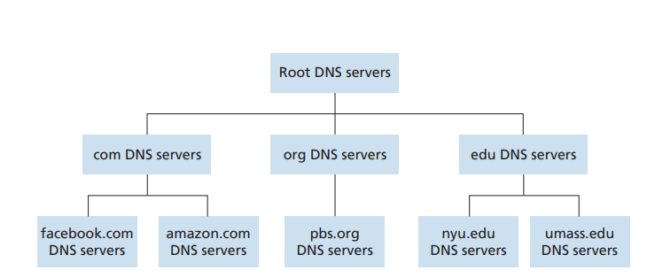
Figure 2.17  ♦  Portion of the hierarchy of DNS servers

the root servers, which returns IP addresses for TLD servers for the top-level domain com. The client then contacts one of these TLD servers, which returns the IP address of an authoritative server for amazon.com. Finally, the client contacts one of the authoritative servers for amazon.com, which returns the IP address for the host- name www.amazon.com. We’ll soon examine this DNS lookup process in more detail. But let’s first take a closer look at these three classes of DNS servers:

• **Root DNS servers.** There are more than 1000 root servers instances scattered all over the world, as shown in Figure 2.18. These root servers are copies of 13 dif- ferent root servers, managed by 12 different organizations, and coordinated through the Internet Assigned Numbers Authority [IANA 2020]. The full list of root name servers, along with the organizations that manage them and their IP addresses can be found at [Root Servers 2020]. Root name servers provide the IP addresses of the TLD servers.

• **Top-level domain (TLD) servers.** For each of the top-level domains—top-level domains such as com, org, net, edu, and gov, and all of the country top-level domains such as uk, fr, ca, and jp—there is TLD server (or server cluster). The company Verisign Global Registry Services maintains the TLD servers for the com top-level domain, and the company Educause maintains the TLD servers for the edu top-level domain. The network infrastructure supporting a TLD can be large and complex; see [Osterweil 2012] for a nice overview of the Verisign net- work. See [TLD list 2020] for a list of all top-level domains. TLD servers provide the IP addresses for authoritative DNS servers.

• **Authoritative DNS servers.** Every organization with publicly accessible hosts (such as Web servers and mail servers) on the Internet must provide publicly accessible DNS records that map the names of those hosts to IP addresses. An organization’s authoritative DNS server houses these DNS records. An organi- zation can choose to implement its own authoritative DNS server to hold these records; alternatively, the organization can pay to have these records stored in an 


**Figure 2.18**  ♦  DNS root servers in 2020

authoritative DNS server of some service provider. Most universities and large companies implement and maintain their own primary and secondary (backup) authoritative DNS server.

The root, TLD, and authoritative DNS servers all belong to the hierarchy of DNS servers, as shown in Figure 2.17. There is another important type of DNS server called the **local DNS server**. A local DNS server does not strictly belong to the hierarchy of servers but is nevertheless central to the DNS architecture. Each ISP—such as a residential ISP or an institutional ISP—has a local DNS server (also called a default name server). When a host connects to an ISP, the ISP provides the host with the IP addresses of one or more of its local DNS servers (typically through DHCP, which is discussed in Chapter 4). You can easily determine the IP address of your local DNS server by accessing network status windows in Win- dows or UNIX. A host’s local DNS server is typically “close to” the host. For an institutional ISP, the local DNS server may be on the same LAN as the host; for a residential ISP, it is typically separated from the host by no more than a few rout- ers. When a host makes a DNS query, the query is sent to the local DNS server, which acts a proxy, forwarding the query into the DNS server hierarchy, as we’ll discuss in more detail below.

Let’s take a look at a simple example. Suppose the host ```cse.nyu.edu desires``` the IP address of ```gaia.cs.umass.edu.```Also suppose that NYU’s local DNS server for cse.nyu.edu is called ```dns.nyu.edu``` and that an authoritative DNS server for ```gaia.cs.umass.edu is``` called ```dns.umass.edu.``` As shown in


**Figure 2.19**  ♦  Interaction of the various DNS server

Figure 2.19, the host cse.nyu.edu first sends a DNS query message to its local DNS server, dns.nyu.edu. The query message contains the hostname to be trans- lated, namely, gaia.cs.umass.edu. The local DNS server forwards the query message to a root DNS server. The root DNS server takes note of the edu suffix and returns to the local DNS server a list of IP addresses for TLD servers responsible for edu. The local DNS server then resends the query message to one of these TLD servers. The TLD server takes note of the umass.edu suffix and responds with the IP address of the authoritative DNS server for the University of Massachusetts, namely, dns.umass.edu. Finally, the local DNS server resends the query mes- sage directly to dns.umass.edu, which responds with the IP address of gaia .cs.umass.edu. Note that in this example, in order to obtain the mapping for one hostname, eight DNS messages were sent: four query messages and four reply mes- sages! We’ll soon see how DNS caching reduces this query traffic.

Our previous example assumed that the TLD server knows the authoritative DNS server for the hostname. In general, this is not always true. Instead, the TLD servers may know only of an intermediate DNS server, which in turn knows the authorita- tive DNS server for the hostname. For example, suppose again that the University of Massachusetts has a DNS server for the university, called dns.umass.edu. Also suppose that each of the departments at the University of Massachusetts has its own DNS server, and that each departmental DNS server is authoritative for all hosts in the department. In this case, when the intermediate DNS server, dns.umass.edu, receives a query for a host with a hostname ending with cs.umass.edu, it returns to dns.nyu.edu the IP address of dns.cs.umass.edu, which is authoritative for all hostnames ending with cs.umass.edu. The local DNS server dns.nyu .edu then sends the query to the authoritative DNS server, which returns the desired mapping to the local DNS server, which in turn returns the mapping to the requesting host. In this case, a total of 10 DNS messages are sent!

The example shown in Figure 2.19 makes use of both **recursive queries** and **iterative queries**. The query sent from cse.nyu.edu to dns.nyu.edu is a recursive query, since the query asks dns.nyu.edu to obtain the mapping on its behalf. However, the subsequent three queries are iterative since all of the replies are directly returned to dns.nyu.edu. In theory, any DNS query can be itera- tive or recursive. For example, Figure 2.20 shows a DNS query chain for which all of the queries are recursive. In practice, the queries typically follow the pattern in Figure 2.19: The query from the requesting host to the local DNS server is recursive, and the remaining queries are iterative.

**DNS Caching**

Our discussion thus far has ignored **DNS caching**, a critically important feature of the DNS system. In truth, DNS extensively exploits DNS caching in order to improve the delay performance and to reduce the number of DNS messages ricocheting around the Internet. The idea behind DNS caching is very simple. In a query chain, when a DNS server receives a DNS reply (containing, for example, a mapping from a hostname to an IP address), it can cache the mapping in its local memory. For example, in Figure 2.19, each time the local DNS server dns.nyu.edu receives a reply from some DNS server, it can cache any of the information contained in the reply. If a hostname/IP address pair is cached in a DNS server and another query arrives to the DNS server for the same hostname, the DNS server can provide the desired IP address, even if it is not authoritative for the hostname. Because hosts and mappings between hostnames and IP addresses are by no means permanent, DNS servers discard cached information after a period of time (often set to two days).

As an example, suppose that a host apricot.nyu.edu queries dns.nyu.edu for the IP address for the hostname cnn.com. Furthermore, suppose that a few hours later, another NYU host, say, kiwi.nyu.edu, also queries dns.nyu.edu with the same hostname. Because of caching, the local DNS server will be able to immediately return the IP address of cnn.com to this second requesting host without having to query any other DNS servers. A local DNS server can

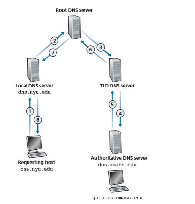
**Figure 2.20**  ♦  Recursive queries in DNS

also cache the IP addresses of TLD servers, thereby allowing the local DNS server to bypass the root DNS servers in a query chain. In fact, because of caching, root servers are bypassed for all but a very small fraction of DNS queries.

### DNS Records and Messages

The DNS servers that together implement the DNS distributed database store **resource records (RRs)**
,including RRs that provide hostname-to-IP address map- pings. Each DNS reply message carries one or more resource records. In this and the following subSection, we provide a brief overview of DNS resource records and messages; more details can be found in [Albitz 1993] or in the DNS RFCs [RFC 1034; RFC 1035].A resource record is a four-tuple that contains the following fields:
```
(Name, Value, Type, TTL)
```
TTL is the time to live of the resource record; it determines when a resource should be removed from a cache. In the example records given below, we ignore the TTL field. The meaning of Name and Value depend on Type:

• If Type=A, then Name is a hostname and Value is the IP address for the host- name. Thus, a Type A record provides the standard hostname-to-IP address map- ping. As an example, (relay1.bar.foo.com, 145.37.93.126, A) is a Type A record.

• If Type=NS, then Name is a domain (such as foo.com) and Value is the host- name of an authoritative DNS server that knows how to obtain the IP addresses for hosts in the domain. This record is used to route DNS queries further along in the query chain. As an example, (foo.com, dns.foo.com, NS) is a Type NS record.

• If Type=CNAME, then Value is a canonical hostname for the alias hostname Name. This record can provide querying hosts the canonical name for a host- name. As an example, (foo.com, relay1.bar.foo.com, CNAME) is a CNAME record.

• If Type=MX, then Value is the canonical name of a mail server that has an alias hostname Name. As an example, (foo.com, mail.bar.foo.com, MX) is an MX record. MX records allow the hostnames of mail servers to have simple aliases. Note that by using the MX record, a company can have the same aliased name for its mail server and for one of its other servers (such as its Web server). To obtain the canonical name for the mail server, a DNS client would query for an MX record; to obtain the canonical name for the other server, the DNS client would query for the CNAME record.

If a DNS server is authoritative for a particular hostname, then the DNS server will contain a Type A record for the hostname. (Even if the DNS server is not author- itative, it may contain a Type A record in its cache.) If a server is not authoritative for a hostname, then the server will contain a Type NS record for the domain that includes the hostname; it will also contain a Type A record that provides the IP address of the DNS server in the Value field of the NS record. As an example, suppose an edu TLD server is not authoritative for the host gaia.cs.umass.edu. Then this server will contain a record for a domain that includes the host gaia.cs.umass .edu, for example, (umass.edu, dns.umass.edu, NS). The edu TLD server would also contain a Type A record, which maps the DNS server dns.umass.edu to an IP address, for example, (dns.umass.edu, 128.119.40.111, A).

**DNS Messages**

Earlier in this Section, we referred to DNS query and reply messages. These are the only two kinds of DNS messages. Furthermore, both query and reply messages have the same format, as shown in Figure 2.21.The semantics of the various fields in a DNS message are as follows:

• The first 12 bytes is the _header Section_, which has a number of fields. The first field is a 16-bit number that identifies the query. This identifier is copied into the reply message to a query, allowing the client to match received replies with sent queries. There are a number of flags in the flag field. A 1-bit query/reply flag indi- cates whether the message is a query (0) or a reply (1). A 1-bit authoritative flag is set in a reply message when a DNS server is an authoritative server for a queried name. A 1-bit recursion-desired flag is set when a client (host or DNS server) desires that the DNS server perform recursion when it doesn’t have the record. A 1-bit recursion-available field is set in a reply if the DNS server supports recur- sion. In the header, there are also four number-of fields. These fields indicate the number of occurrences of the four types of data Sections that follow the header.

• The _question Section_ contains information about the query that is being made. This Section includes (1) a name field that contains the name that is being que- ried, and (2) a type field that indicates the type of question being asked about the name—for example, a host address associated with a name (Type A) or the mail server for a name (Type MX).

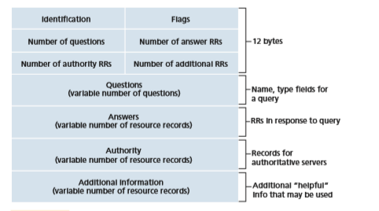
**Figure 2.21**  ♦  DNS message format

• In a reply from a DNS server, the _answer Section_ contains the resource records for the name that was originally queried. Recall that in each resource record there is the Type (for example, A, NS, CNAME, and MX), the Value, and the TTL. A reply can return multiple RRs in the answer, since a hostname can have multiple IP addresses (for example, for replicated Web servers, as discussed earlier in this Section).

• The _authority Section_ contains records of other authoritative servers.

• The _additional Section_ contains other helpful records. For example, the answer field in a reply to an MX query contains a resource record providing the canoni- cal hostname of a mail server. The additional Section contains a Type A record providing the IP address for the canonical hostname of the mail server.

How would you like to send a DNS query message directly from the host you’re working on to some DNS server? This can easily be done with the **nslookup program**, which is available from most Windows and UNIX platforms. For example, from a Win- dows host, open the Command Prompt and invoke the nslookup program by simply typ- ing “nslookup.” After invoking nslookup, you can send a DNS query to any DNS server (root, TLD, or authoritative). After receiving the reply message from the DNS server, nslookup will display the records included in the reply (in a human-readable format). As an alternative to running nslookup from your own host, you can visit one of many Web sites that allow you to remotely employ nslookup. (Just type “nslookup” into a search engine and you’ll be brought to one of these sites.) The DNS Wireshark lab at the end of this chapter will allow you to explore the DNS in much more detail.

**Inserting Records into the DNS Database**

The discussion above focused on how records are retrieved from the DNS database. You might be wondering how records get into the database in the first place. Let’s look at how this is done in the context of a specific example. Suppose you have just created an exciting new startup company called Network Utopia. The first thing you’ll surely want to do is register the domain name networkutopia.com at a registrar. A **reg- istrar** is a commercial entity that verifies the uniqueness of the domain name, enters the domain name into the DNS database (as discussed below), and collects a small fee from you for its services. Prior to 1999, a single registrar, Network Solutions, had a monopoly on domain name registration for com, net, and org domains. But now there are many registrars competing for customers, and the Internet Corporation for Assigned Names and Numbers (ICANN) accredits the various registrars. A complete list of accredited registrars is available at ```http://www.internic.net.```

When you register the domain name ```networkutopia.com``` with some reg- istrar, you also need to provide the registrar with the names and IP addresses of your primary and secondary authoritative DNS servers. Suppose the names and IP addresses are ```dns1.networkutopia.com, dns2.networkutopia.com, 212.2.212.1, and 212.212.212.2.``` For each of these two authoritative DNS


**DNS VULNERABIL IT IES**

We have seen that DNS is a critical component of the Internet infrastructure, with many important services—including the Web and e-mail—simply incapable of func- tioning without it. We therefore naturally ask, how can DNS be attacked? Is DNS a sitting duck, waiting to be knocked out of service, while taking most Internet applica- tions down with it?

The first type of attack that comes to mind is a DDoS bandwidth-flooding attack (see Section 1.6) against DNS servers. For example, an attacker could attempt to send to each DNS root server a deluge of packets, so many that the majority of legitimate DNS queries never get answered. Such a large-scale DDoS attack against DNS root servers actually took place on October 21, 2002. In this attack, the attack- ers leveraged a botnet to send truck loads of ICMP ping messages to each of the 13 DNS root IP addresses. (ICMP messages are discussed in Section 5.6. For now, it suffices to know that ICMP packets are special types of IP datagrams.) Fortunately, this large-scale attack caused minimal damage, having little or no impact on users’ Internet experience. The attackers did succeed at directing a deluge of packets at the root servers. But many of the DNS root servers were protected by packet filters, con- figured to always block all ICMP ping messages directed at the root servers. These protected servers were thus spared and functioned as normal. Furthermore, most local DNS servers cache the IP addresses of top-level-domain servers, allowing the query process to often bypass the DNS root servers.

A potentially more effective DDoS attack against DNS is send a deluge of DNS queries to top-level-domain servers, for example, to top-level-domain servers that handle the .com domain. It is harder to filter DNS queries directed to DNS servers; and top-level-domain servers are not as easily bypassed as are root servers. Such an attack took place against the top-level-domain service provider Dyn on October 21, 2016. This DDoS attack was accomplished through a large number of DNS lookup requests from a botnet consisting of about one hundred thousand IoT devices such as printers, IP cameras, residential gateways and baby monitors that had been infected with Mirai malware. For almost a full day, Amazon, Twitter, Netflix, Github and Spotify were disturbed.

DNS could potentially be attacked in other ways. In a man-in-the-middle attack, the attacker intercepts queries from hosts and returns bogus replies. In the DNS poi- soning attack, the attacker sends bogus replies to a DNS server, tricking the server into accepting bogus records into its cache. Either of these attacks could be used, for example, to redirect an unsuspecting Web user to the attacker’s Web site. The DNS Security Extensions (DNSSEC [Gieben 2004; RFC 4033] have been designed and deployed to protect against such exploits. DNSSEC, a secured version of DNS, addresses many of these possible attacks and is gaining popularity in the Internet.

servers, the registrar would then make sure that a Type NS and a Type A record are entered into the TLD com servers. Specifically, for the primary authoritative server for ```networkutopia.com```, the registrar would insert the following two resource records into the DNS system:
```
(networkutopia.com, dns1.networkutopia.com, NS) (dns1.networkutopia.com, 212.212.212.1, A)
```
You’ll also have to make sure that the Type A resource record for your Web server ```www.networkutopia.com``` and the Type MX resource record for your mail server ```mail.networkutopia.com``` are entered into your authoritative DNS servers. (Until recently, the contents of each DNS server were configured statically, for example, from a configuration file created by a system manager. More recently, an UPDATE option has been added to the DNS protocol to allow data to be dynami- cally added or deleted from the database via DNS messages. [RFC 2136] and [RFC 3007] specify DNS dynamic updates.)

Once all of these steps are completed, people will be able to visit your Web site and send e-mail to the employees at your company. Let’s conclude our discussion of DNS by verifying that this statement is true. This verification also helps to solidify what we have learned about DNS. Suppose Alice in Australia wants to view the Web page www.networkutopia.com. As discussed earlier, her host will first send a DNS query to her local DNS server. The local DNS server will then contact a TLD com server. (The local DNS server will also have to contact a root DNS server if the address of a TLD com server is not cached.) This TLD server contains the Type NS and Type A resource records listed above, because the registrar had these resource records inserted into all of the TLD com servers. The TLD com server sends a reply to Alice’s local DNS server, with the reply containing the two resource records. The local DNS server then sends a DNS query to 212.212.212.1, asking for the Type A record corresponding to www.networkutopia.com. This record provides the IP address of the desired Web server, say, 212.212.71.4, which the local DNS server passes back to Alice’s host. Alice’s browser can now initiate a TCP connec- tion to the host 212.212.71.4 and send an HTTP request over the connection. Whew! There’s a lot more going on than what meets the eye when one surfs the Web!

## Peer-to-Peer File Distribution

The applications described in this chapter thus far—including the Web, e-mail, and DNS—all employ client-server architectures with significant reliance on always-on infrastructure servers. Recall from Section 2.1.1 that with a P2P architecture, there is minimal (or no) reliance on always-on infrastructure servers. Instead, pairs of intermittently connected hosts, called peers, communicate directly with each other. The peers are not owned by a service provider, but are instead PCs, laptops, and smartpones controlled by users.In this Section, we consider a very natural P2P application, namely, distributing a large file from a single server to a large number of hosts (called peers). The file might be a new version of the Linux operating system, a software patch for an existing operating system or an MPEG video file. In client-server file distribution, the server must send a copy of the file to each of the peers—placing an enormous burden on the server and consuming a large amount of server bandwidth. In P2P file distribution, each peer can redistribute any portion of the file it has received to any other peers, thereby assisting the server in the distribution process. As of 2020, the most popular P2P file distribution protocol is BitTorrent. Originally developed by Bram Cohen, there are now many different independent BitTorrent clients conforming to the Bit- Torrent protocol, just as there are a number of Web browser clients that conform to the HTTP protocol. In this subSection, we first examine the self-scalability of P2P architectures in the context of file distribution. We then describe BitTorrent in some detail, highlighting its most important characteristics and features.

**Scalability of P2P Architectures**

To compare client-server architectures with peer-to-peer architectures, and illustrate the inherent self-scalability of P2P, we now consider a simple quantitative model for distributing a file to a fixed set of peers for both architecture types. As shown in Figure 2.22, the server and the peers are connected to the Internet with access

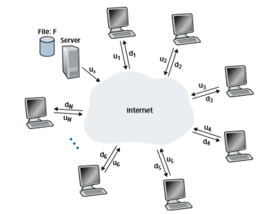
**Figure 2.22**  ♦  An illustrative file distribution problem

links. Denote the upload rate of the server’s access link by _us_, the upload rate of the _i_th peer’s access link by _ui_, and the download rate of the _i_th peer’s access link by _di_. Also denote the size of the file to be distributed (in bits) by _F_ and the number of peers that want to obtain a copy of the file by _N_. The **distribution time** is the time it takes to get a copy of the file to all _N_ peers. In our analysis of the distribution time below, for both client-server and P2P architectures, we make the simplifying and generally accurate Akella 2003 assumption that the Internet core has abundant bandwidth, implying that all of the bottlenecks are in access networks. We also sup- pose that the server and clients are not participating in any other network applica- tions, so that all of their upload and download access bandwidth can be fully devoted to distributing this file.

Let’s first determine the distribution time for the client-server architecture, which we denote by Dc<sub>s</sub>. In the client-server architecture, none of the peers aids in distributing the file. We make the following observations:

• The server must transmit one copy of the file to each of the _N_ peers. Thus, the server must transmit _NF_ bits. Since the server’s upload rate is _us_, the time to dis- tribute the file must be at least NFlu<sub>s</sub>.

• Let d<sub>min</sub> denote the download rate of the peer with the lowest download rate, that is,d<sub>min</sub> = min{d<sub>1</sub>,d<sub>p</sub>,...,d<sub>N</sub>}. The peer with the lowest download rate cannot obtain all _F_ bits of the file in less than _F_/_d_min seconds. Thus, the minimum distri- bution time is at least _F_/_d_min.

Putting these two observations together, we obtain


This provides a lower bound on the minimum distribution time for the client-server architecture. In the homework problems, you will be asked to show that the server can schedule its transmissions so that the lower bound is actually achieved. So let’s take this lower bound provided above as the actual distribution time, that is,


We see from Equation 2.1 that for _N_ large enough, the client-server distribution time is given by NFlu<sub>s</sub>s_. Thus, the distribution time increases linearly with the number of peers _N_. So, for example, if the number of peers from one week to the next increases a thousand-fold from a thousand to a million, the time required to distribute the file to all peers increases by 1,000.Let’s now go through a similar analysis for the P2P architecture, where each peer can assist the server in distributing the file. In particular, when a peer receives some file data, it can use its own upload capacity to redistribute the data to other peers. Cal- culating the distribution time for the P2P architecture is somewhat more complicated than for the client-server architecture, since the distribution time depends on how each peer distributes portions of the file to the other peers. Nevertheless, a simple expression for the minimal distribution time can be obtained [Kumar 2006]. To this end, we first make the following observations:

• At the beginning of the distribution, only the server has the file. To get this file into the community of peers, the server must send each bit of the file at least once into its access link. Thus, the minimum distribution time is at least _F_/_us_. (Unlike the client-server scheme, a bit sent once by the server may not have to be sent by the server again, as the peers may redistribute the bit among themselves.)

• As with the client-server architecture, the peer with the lowest download rate cannot obtain all _F_ bits of the file in less than _F_/_d_min seconds. Thus, the minimum distribution time is at least _F_/_d_min.

• Finally, observe that the total upload capacity of the system as a whole is equal to the upload rate of the server plus the upload rates of each of the individual peers, that is, _u_total = _us_ \+ _u_1 + g+ _uN_. The system must deliver (upload) _F_ bits to each of the _N_ peers, thus delivering a total of _NF_ bits. This cannot be done at a rate faster than _u_total. Thus, the minimum distribution time is also at least _NF_/(_us_ \+ _u_1 + g+ _uN_).

Putting these three observations together, we obtain the minimum distribution time for P2P, denoted by _D_P2P.

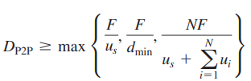
Equation 2.2 provides a lower bound for the minimum distribution time for the P2P architecture. It turns out that if we imagine that each peer can redistribute a bit as soon as it receives the bit, then there is a redistribution scheme that actually achieves this lower bound [Kumar 2006]. (We will prove a special case of this result in the homework.) In reality, where chunks of the file are redistributed rather than indi- vidual bits, Equation 2.2 serves as a good approximation of the actual minimum distribution time. Thus, let’s take the lower bound provided by Equation 2.2 as the actual minimum distribution time, that is,


**Figure 2.23**  ♦  Distribution time for P2P and client-server architectures

Figure 2.23 compares the minimum distribution time for the client-server and P2P architectures assuming that all peers have the same upload rate _u_. In Figure 2.23, we have set Flu= 1 hour, u<sub>s</sub>= 10<sub>u</sub>, and d<sub>min</sub> Ú <sub>>_</sub>us. Thus, a peer can transmit the entire file in one hour, the server transmission rate is 10 times the peer upload rate, and (for simplicity) the peer download rates are set large enough so as not to have an effect. We see from Figure 2.23 that for the client-server architecture, the distri- bution time increases linearly and without bound as the number of peers increases. However, for the P2P architecture, the minimal distribution time is not only always less than the distribution time of the client-server architecture; it is also less than one hour for _any_ number of peers _N_. Thus, applications with the P2P architecture can be self-scaling. This scalability is a direct consequence of peers being redistributors as well as consumers of bits.

**BitTorrent**

BitTorrent is a popular P2P protocol for file distribution [Chao 2011]. In BitTorrent lingo, the collection of all peers participating in the distribution of a particular file is called a _torrent_. Peers in a torrent download equal-size _chunks_ of the file from one another, with a typical chunk size of 256 KBytes. When a peer first joins a torrent, it has no chunks. Over time it accumulates more and more chunks. While it downloads chunks it also uploads chunks to other peers. Once a peer has acquired the entire file, it may (selfishly) leave the torrent, or (altruistically) remain in the torrent and continue to upload chunks to other peers. Also, any peer may leave the torrent at any time with only a subset of chunks, and later rejoin the torrent.

**Figure 2.24**  ♦  File distribution with BitTorrent
Let’s now take a closer look at how BitTorrent operates. Since BitTorrent is a rather complicated protocol and system, we’ll only describe its most important mechanisms, sweeping some of the details under the rug; this will allow us to see the forest through the trees. Each torrent has an infrastructure node called a _tracker_. When a peer joins a torrent, it registers itself with the tracker and periodically informs the tracker that it is still in the torrent. In this manner, the tracker keeps track of the peers that are participating in the torrent. A given torrent may have fewer than ten or more than a thousand peers participating at any instant of time.

As shown in Figure 2.24, when a new peer, Alice, joins the torrent, the tracker randomly selects a subset of peers (for concreteness, say 50) from the set of partici- pating peers, and sends the IP addresses of these 50 peers to Alice. Possessing this list of peers, Alice attempts to establish concurrent TCP connections with all the peers on this list. Let’s call all the peers with which Alice succeeds in establishing a TCP connection “neighboring peers.” (In Figure 2.24, Alice is shown to have only three neighboring peers. Normally, she would have many more.) As time evolves, some of these peers may leave and other peers (outside the initial 50) may attempt to establish TCP connections with Alice. So a peer’s neighboring peers will fluctuate over time.

At any given time, each peer will have a subset of chunks from the file, with dif- ferent peers having different subsets. Periodically, Alice will ask each of her neigh- boring peers (over the TCP connections) for the list of the chunks they have. If Alice has _L_ different neighbors, she will obtain _L_ lists of chunks. With this knowledge, Alice will issue requests (again over the TCP connections) for chunks she currently does not have.

So at any given instant of time, Alice will have a subset of chunks and will know which chunks her neighbors have. With this information, Alice will have two impor- tant decisions to make. First, which chunks should she request first from her neigh- bors? And second, to which of her neighbors should she send requested chunks? In deciding which chunks to request, Alice uses a technique called **rarest first**. The idea is to determine, from among the chunks she does not have, the chunks that are the rarest among her neighbors (that is, the chunks that have the fewest repeated cop- ies among her neighbors) and then request those rarest chunks first. In this manner, the rarest chunks get more quickly redistributed, aiming to (roughly) equalize the numbers of copies of each chunk in the torrent.

To determine which requests she responds to, BitTorrent uses a clever trading algorithm. The basic idea is that Alice gives priority to the neighbors that are cur- rently supplying her data _at the highest rate_. Specifically, for each of her neighbors, Alice continually measures the rate at which she receives bits and determines the four peers that are feeding her bits at the highest rate. She then reciprocates by sending chunks to these same four peers. Every 10 seconds, she recalculates the rates and pos- sibly modifies the set of four peers. In BitTorrent lingo, these four peers are said to be **unchoked**. Importantly, every 30 seconds, she also picks one additional neighbor at random and sends it chunks. Let’s call the randomly chosen peer Bob. In BitTorrent lingo, Bob is said to be **optimistically unchoked**. Because Alice is sending data to Bob, she may become one of Bob’s top four uploaders, in which case Bob would start to send data to Alice. If the rate at which Bob sends data to Alice is high enough, Bob could then, in turn, become one of Alice’s top four uploaders. In other words, every 30 seconds, Alice will randomly choose a new trading partner and initiate trading with that partner. If the two peers are satisfied with the trading, they will put each other in their top four lists and continue trading with each other until one of the peers finds a better partner. The effect is that peers capable of uploading at compatible rates tend to find each other. The random neighbor selection also allows new peers to get chunks, so that they can have something to trade. All other neighboring peers besides these five peers (four “top” peers and one probing peer) are “choked,” that is, they do not receive any chunks from Alice. BitTorrent has a number of interesting mechanisms that are not discussed here, including pieces (mini-chunks), pipelining, random first selection, endgame mode, and anti-snubbing [Cohen 2003].

The incentive mechanism for trading just described is often referred to as tit-for- tat [Cohen 2003]. It has been shown that this incentive scheme can be circumvented [Liogkas 2006; Locher 2006; Piatek 2008]. Nevertheless, the BitTorrent ecosystem is wildly successful, with millions of simultaneous peers actively sharing files inhundreds of thousands of torrents. If BitTorrent had been designed without tit-for-tat (or a variant), but otherwise exactly the same, BitTorrent would likely not even exist now, as the majority of the users would have been freeriders [Saroiu 2002].

We close our discussion on P2P by briefly mentioning another application of P2P, namely, Distributed Hast Table (DHT). A distributed hash table is a simple database, with the database records being distributed over the peers in a P2P system. DHTs have been widely implemented (e.g., in BitTorrent) and have been the subject of extensive research. An overview is provided in a Video Note in the Companion Website.

## Video Streaming and Content Distribution Networks

By many estimates, streaming video—including Netflix, YouTube and Amazon Prime—account for about 80% of Internet traffic in 2020 [Cisco 2020]. This Section we will provide an overview of how popular video streaming services are imple- mented in today’s Internet. We will see they are implemented using application-level protocols and servers that function in some ways like a cache.

### Internet Video
 In streaming stored video applications, the underlying medium is prerecorded video, such as a movie, a television show, a prerecorded sporting event, or a prerecorded user-generated video (such as those commonly seen on YouTube). These prere- corded videos are placed on servers, and users send requests to the servers to view the videos _on demand_. Many Internet companies today provide streaming video, including, Netflix, YouTube (Google), Amazon, and TikTok.

But before launching into a discussion of video streaming, we should first get a quick feel for the video medium itself. A video is a sequence of images, typi- cally being displayed at a constant rate, for example, at 24 or 30 images per second. An uncompressed, digitally encoded image consists of an array of pixels, with each pixel encoded into a number of bits to represent luminance and color. An important characteristic of video is that it can be compressed, thereby trading off video quality with bit rate. Today’s off-the-shelf compression algorithms can compress a video to essentially any bit rate desired. Of course, the higher the bit rate, the better the image quality and the better the overall user viewing experience.

From a networking perspective, perhaps the most salient characteristic of video is its high bit rate. Compressed Internet video typically ranges from 100 kbps for low-quality video to over 4 Mbps for streaming high-definition movies; 4K stream- ing envisions a bitrate of more than 10 Mbps. This can translate to huge amount of traffic and storage, particularly for high-end video. For example, a single 2 Mbps video with a duration of 67 minutes will consume 1 gigabyte of storage and traffic. By far, the most important performance measure for streaming video is average end- to-end throughput. In order to provide continuous playout, the network must provide an average throughput to the streaming application that is at least as large as the bit rate of the compressed video.

We can also use compression to create multiple versions of the same video, each at a different quality level. For example, we can use compression to create, say, three versions of the same video, at rates of 300 kbps, 1 Mbps, and 3 Mbps. Users can then decide which version they want to watch as a function of their current available band- width. Users with high-speed Internet connections might choose the 3 Mbps version; users watching the video over 3G with a smartphone might choose the 300 kbps version.

### HTTP Streaming and DASH
 In HTTP streaming, the video is simply stored at an HTTP server as an ordinary file with a specific URL. When a user wants to see the video, the client establishes a TCP connection with the server and issues an HTTP GET request for that URL. The server then sends the video file, within an HTTP response message, as quickly as the underlying network protocols and traffic conditions will allow. On the client side, the bytes are collected in a client application buffer. Once the number of bytes in this buffer exceeds a predetermined threshold, the client application begins play- back—specifically, the streaming video application periodically grabs video frames from the client application buffer, decompresses the frames, and displays them on the user’s screen. Thus, the video streaming application is displaying video as it is receiving and buffering frames corresponding to latter parts of the video.

Although HTTP streaming, as described in the previous paragraph, has been extensively deployed in practice (for example, by YouTube since its inception), it has a major shortcoming: All clients receive the same encoding of the video, despite the large variations in the amount of bandwidth available to a client, both across different clients and also over time for the same client. This has led to the development of a new type of HTTP-based streaming, often referred to as **Dynamic Adaptive Streaming over HTTP (DASH)**. In DASH, the video is encoded into several different versions, with each version having a different bit rate and, correspondingly, a different quality level. The client dynamically requests chunks of video segments of a few seconds in length. When the amount of available bandwidth is high, the client naturally selects chunks from a high-rate version; and when the available bandwidth is low, it naturally selects from a low-rate version. The client selects different chunks one at a time with HTTP GET request messages [Akhshabi 2011].

DASH allows clients with different Internet access rates to stream in video at different encoding rates. Clients with low-speed 3G connections can receive a low bit-rate (and low-quality) version, and clients with fiber connections can receive a high-quality version. DASH also allows a client to adapt to the available bandwidth if the available end-to-end bandwidth changes during the session. This feature isparticularly important for mobile users, who typically see their bandwidth availabil- ity fluctuate as they move with respect to the base stations.

With DASH, each video version is stored in the HTTP server, each with a differ- ent URL. The HTTP server also has a **manifest file**, which provides a URL for each version along with its bit rate. The client first requests the manifest file and learns about the various versions. The client then selects one chunk at a time by specifying a URL and a byte range in an HTTP GET request message for each chunk. While down- loading chunks, the client also measures the received bandwidth and runs a rate deter- mination algorithm to select the chunk to request next. Naturally, if the client has a lot of video buffered and if the measured receive bandwidth is high, it will choose a chunk from a high-bitrate version. And naturally if the client has little video buffered and the measured received bandwidth is low, it will choose a chunk from a low-bitrate version. DASH therefore allows the client to freely switch among different quality levels.

### Content Distribution Networks
 Today, many Internet video companies are distributing on-demand multi-Mbps streams to millions of users on a daily basis. YouTube, for example, with a library of hundreds of millions of videos, distributes hundreds of millions of video streams to users around the world every day. Streaming all this traffic to locations all over the world while providing continuous playout and high interactivity is clearly a chal- lenging task.

For an Internet video company, perhaps the most straightforward approach to providing streaming video service is to build a single massive data center, store all of its videos in the data center, and stream the videos directly from the data center to clients worldwide. But there are three major problems with this approach. First, if the client is far from the data center, server-to-client packets will cross many com- munication links and likely pass through many ISPs, with some of the ISPs possibly located on different continents. If one of these links provides a throughput that is less than the video consumption rate, the end-to-end throughput will also be below the consumption rate, resulting in annoying freezing delays for the user. (Recall from Chapter 1 that the end-to-end throughput of a stream is governed by the throughput at the bottleneck link.) The likelihood of this happening increases as the number of links in the end-to-end path increases. A second drawback is that a popular video will likely be sent many times over the same communication links. Not only does this waste network bandwidth, but the Internet video company itself will be paying its provider ISP (connected to the data center) for sending the _same_ bytes into the Inter- net over and over again. A third problem with this solution is that a single data center represents a single point of failure—if the data center or its links to the Internet goes down, it would not be able to distribute _any_ video streams.

In order to meet the challenge of distributing massive amounts of video data to users distributed around the world, almost all major video-streaming companies make use of **Content Distribution Networks (CDNs)**. A CDN manages servers inmultiple geographically distributed locations, stores copies of the videos (and other types of Web content, including documents, images, and audio) in its servers, and attempts to direct each user request to a CDN location that will provide the best user experience. The CDN may be a **private CDN**, that is, owned by the content provider itself; for example, Google’s CDN distributes YouTube videos and other types of content. The CDN may alternatively be a **third-party CDN** that distributes content on behalf of multiple content providers; Akamai, Limelight and Level-3 all operate third-party CDNs. A very readable overview of modern CDNs is [Leighton 2009; Nygren 2010].

CDNs typically adopt one of two different server placement philosophies [Huang 2008]:

• **Enter Deep.** One philosophy, pioneered by Akamai, is to _enter deep_ into the access networks of Internet Service Providers, by deploying server clusters in access ISPs all over the world. (Access networks are described in Section 1.3.) Akamai takes this approach with clusters in thousands of locations. The goal is to get close to end users, thereby improving user-perceived delay and throughput by decreasing the number of links and routers between the end user and the CDN server from which it receives content. Because of this highly distributed design, the task of maintaining and managing the clusters becomes challenging.

• **Bring Home.** A second design philosophy, taken by Limelight and many other CDN companies, is to _bring the ISPs home_ by building large clusters at a smaller number (for example, tens) of sites. Instead of getting inside the access ISPs, these CDNs typically place their clusters in Internet Exchange Points (IXPs) (see Section 1.3). Compared with the enter-deep design phi- losophy, the bring-home design typically results in lower maintenance and management overhead, possibly at the expense of higher delay and lower throughput to end users.

Once its clusters are in place, the CDN replicates content across its clusters. The CDN may not want to place a copy of every video in each cluster, since some videos are rarely viewed or are only popular in some countries. In fact, many CDNs do not push videos to their clusters but instead use a simple pull strategy: If a client requests a video from a cluster that is not storing the video, then the cluster retrieves the video (from a central repository or from another cluster) and stores a copy locally while streaming the video to the client at the same time. Similar Web caching (see Section 2.2.5), when a cluster’s storage becomes full, it removes videos that are not frequently requested.

**CDN Operation**

Having identified the two major approaches toward deploying a CDN, let’s now dive down into the nuts and bolts of how a CDN operates. When a browser in a user’shost is instructed to retrieve a specific video (identified by a URL), the CDN must intercept the request so that it can (1) determine a suitable CDN server cluster for that client at that time, and (2) redirect the client’s request to a server in that cluster. We’ll shortly discuss how a CDN can determine a suitable cluster. But first let’s examine the mechanics behind intercepting and redirecting a request.

Most CDNs take advantage of DNS to intercept and redirect requests; an inter- esting discussion of such a use of the DNS is [Vixie 2009]. Let’s consider a simple

**CASE STUDY**

GOOGLE’S NETWORK INFRASTRUCTURE

To support its vast array of services—including search, Gmail, calendar, YouTube video, maps, documents, and social networks—Google has deployed an extensive private network and CDN infrastructure. Google’s CDN infrastructure has three tiers of server clusters:

• Nineteen “mega data centers” in North America, Europe, and Asia [Google Locations 2020], with each data center having on the order of 100,000 servers. These mega data centers are responsible for serving dynamic (and often personal- ized) content, including search results and Gmail messages.

• With about 90 clusters in IXPs scattered throughout the world, with each cluster consisting of hundreds of servers servers [Adhikari 2011a] [Google CDN 2020]. These clusters are responsible for serving static content, including YouTube videos.

• Many hundreds of “enter-deep” clusters located within an access ISP. Here a cluster typically consists of tens of servers within a single rack. These enter-deep servers perform TCP splitting (see Section 3.7) and serve static content [Chen 2011], including the static portions of Web pages that embody search results.

All of these data centers and cluster locations are networked together with Google’s own private network. When a user makes a search query, often the query is first sent over the local ISP to a nearby enter-deep cache, from where the static content is retrieved; while providing the static content to the client, the nearby cache also forwards the query over Google’s private network to one of the mega data cent- ers, from where the personalized search results are retrieved. For a YouTube video, the video itself may come from one of the bring-home caches, whereas portions of the Web page surrounding the video may come from the nearby enter-deep cache, and the advertisements surrounding the video come from the data centers. In sum- mary, except for the local ISPs, the Google cloud services are largely provided by a network infrastructure that is independent of the public Internet.host is instructed to retrieve a specific video (identified by a URL), the CDN must 
intercept the request so that it can (1) determine a suitable CDN server cluster for that client at that time, and (2) redirect the client’s request to a server in that cluster. We’ll shortly discuss how a CDN can determine a suitable cluster. But first let’s examine the mechanics behind intercepting and redirecting a request.

Most CDNs take advantage of DNS to intercept and redirect requests; an interesting discussion of such a use of the DNS is [Vixie 2009]. Let’s consider a simple
example to illustrate how the DNS is typically involved. Suppose a content provider, NetCinema, employs the third-party CDN company, KingCDN, to distribute its vid- eos to its customers. On the NetCinema Web pages, each of its videos is assigned a URL that includes the string “video” and a unique identifier for the video itself; for example, _Transformers 7_ might be assigned http://video.netcinema.com/6Y7B23V. Six steps then occur, as shown in Figure 2.25:

1\. The user visits the Web page at NetCinema. 
2. When the user clicks on the link http://video.netcinema.com/6Y7B23V, the user’s host sends a DNS query for video.netcinema.com. 
3. The user’s Local DNS Server (LDNS) relays the DNS query to an authoritative DNS server for NetCinema, which observes the string “video” in the host- name video.netcinema.com. To “hand over” the DNS query to KingCDN, instead of returning an IP address, the NetCinema authoritative DNS server returns to the LDNS a hostname in the KingCDN’s domain, for example, a1105.kingcdn.com.
4\. From this point on, the DNS query enters into KingCDN’s private DNS infra- structure. The user’s LDNS then sends a second query, now for a1105.kingcdn. com, and KingCDN’s DNS system eventually returns the IP addresses of a KingCDN content server to the LDNS. It is thus here, within the KingCDN’s DNS system, that the CDN server from which the client will receive its content is specified.


**Figure 2.25**  ♦  DNS redirects a user’s request to a CDN server

5\. The LDNS forwards the IP address of the content-serving CDN node to the user’s host.
6\. Once the client receives the IP address for a KingCDN content server, it estab- lishes a direct TCP connection with the server at that IP address and issues an HTTP GET request for the video. If DASH is used, the server will first send to the client a manifest file with a list of URLs, one for each version of the video, and the client will dynamically select chunks from the different versions.

**Cluster Selection Strategies**

At the core of any CDN deployment is a **cluster selection strategy**, that is, a mecha- nism for dynamically directing clients to a server cluster or a data center within the CDN. As we just saw, the CDN learns the IP address of the client’s LDNS server via the client’s DNS lookup. After learning this IP address, the CDN needs to select an appropriate cluster based on this IP address. CDNs generally employ proprietary cluster selection strategies. We now briefly survey a few approaches, each of which has its own advantages and disadvantages.

One simple strategy is to assign the client to the cluster that is **geographically clos- est**. Using commercial geo-location databases (such as Quova [Quova 2020] and Max- Mind [MaxMind 2020]), each LDNS IP address is mapped to a geographic location. When a DNS request is received from a particular LDNS, the CDN chooses the geo- graphically closest cluster, that is, the cluster that is the fewest kilometers from the LDNS “as the bird flies.” Such a solution can work reasonably well for a large fraction of the cli- ents [Agarwal 2009]. However, for some clients, the solution may perform poorly, since the geographically closest cluster may not be the closest cluster in terms of the length or number of hops of the network path. Furthermore, a problem inherent with all DNS- based approaches is that some end-users are configured to use remotely located LDNSs [Shaikh 2001; Mao 2002], in which case the LDNS location may be far from the client’s location. Moreover, this simple strategy ignores the variation in delay and available band- width over time of Internet paths, always assigning the same cluster to a particular client.

In order to determine the best cluster for a client based on the _current_ traffic conditions, CDNs can instead perform periodic **real-time measurements** of delay and loss performance between their clusters and clients. For instance, a CDN can have each of its clusters periodically send probes (for example, ping messages or DNS queries) to all of the LDNSs around the world. One drawback of this approach is that many LDNSs are configured to not respond to such probes.

### Case Studies: Netflix and YouTube
 We conclude our discussion of streaming stored video by taking a look at two highly successful large-scale deployments: Netflix and YouTube. We’ll see that each of these systems take a very different approach, yet employ many of the underlying principles discussed in this Section.
 
 **Netflix**

As of 2020, Netflix is the leading service provider for online movies and TV series in North America. As we discuss below, Netflix video distribution has two major compo- nents: the Amazon cloud and its own private CDN infrastructure.

Netflix has a Web site that handles numerous functions, including user registra- tion and login, billing, movie catalogue for browsing and searching, and a movie recommendation system. As shown in Figure 2.26, this Web site (and its associated backend databases) run entirely on Amazon servers in the Amazon cloud. Addition- ally, the Amazon cloud handles the following critical functions:

• **_Content ingestion._** Before Netflix can distribute a movie to its customers, it must first ingest and process the movie. Netflix receives studio master versions of movies and uploads them to hosts in the Amazon cloud.

• **_Content processing._** The machines in the Amazon cloud create many different formats for each movie, suitable for a diverse array of client video players run- ning on desktop computers, smartphones, and game consoles connected to televi- sions. A different version is created for each of these formats and at multiple bit rates, allowing for adaptive streaming over HTTP using DASH.

• **_Uploading versions to its CDN._** Once all of the versions of a movie have been created, the hosts in the Amazon cloud upload the versions to its CDN.

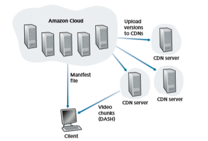
**Figure 2.26**  ♦  Netflix video streaming platform

When Netflix first rolled out its video streaming service in 2007, it employed three third-party CDN companies to distribute its video content. Netflix has since created its own private CDN, from which it now streams all of its videos. To create its own CDN, Netflix has installed server racks both in IXPs and within residen- tial ISPs themselves. Netflix currently has server racks in over 200 IXP locations; see [Bottger 2018] [Netflix Open Connect 2020] for a current list of IXPs housing Netflix racks. There are also hundreds of ISP locations housing Netflix racks; also see [Netflix Open Connect 2020], where Netflix provides to potential ISP partners instructions about installing a (free) Netflix rack for their networks. Each server in the rack has several 10 Gbps Ethernet ports and over 100 terabytes of storage. The number of servers in a rack varies: IXP installations often have tens of servers and contain the entire Netflix streaming video library, including multiple versions of the videos to support DASH. Netflix does not use pull-caching (Section 2.2.5) to popu- late its CDN servers in the IXPs and ISPs. Instead, Netflix distributes by pushing the videos to its CDN servers during off-peak hours. For those locations that cannot hold the entire library, Netflix pushes only the most popular videos, which are determined on a day-to-day basis. The Netflix CDN design is described in some detail in the YouTube videos [Netflix Video 1] and [Netflix Video 2]; see also [Bottger 2018].

Having described the components of the Netflix architecture, let’s take a closer look at the interaction between the client and the various servers that are involved in movie delivery. As indicated earlier, the Web pages for browsing the Netflix video library are served from servers in the Amazon cloud. When a user selects a movie to play, the Netflix software, running in the Amazon cloud, first determines which of its CDN servers have copies of the movie. Among the servers that have the movie, the software then determines the “best” server for that client request. If the client is using a residential ISP that has a Netflix CDN server rack installed in that ISP, and this rack has a copy of the requested movie, then a server in this rack is typically selected. If not, a server at a nearby IXP is typically selected.

Once Netflix determines the CDN server that is to deliver the content, it sends the client the IP address of the specific server as well as a manifest file, which has the URLs for the different versions of the requested movie. The client and that CDN server then directly interact using a proprietary version of DASH. Specifically, as described in Section 2.6.2, the client uses the byte-range header in HTTP GET request messages, to request chunks from the different versions of the movie. Netflix uses chunks that are approximately four-seconds long [Adhikari 2012]. While the chunks are being downloaded, the client measures the received throughput and runs a rate-determination algorithm to determine the quality of the next chunk to request.

Netflix embodies many of the key principles discussed earlier in this Section, including adaptive streaming and CDN distribution. However, because Netflix uses its own private CDN, which distributes only video (and not Web pages), Netflix has been able to simplify and tailor its CDN design. In particular, Netflix does not need to employ DNS redirect, as discussed in Section 2.6.3, to connect a particular client to a CDN server; instead, the Netflix software (running in the Amazon cloud) directly tellsthe client to use a particular CDN server. Furthermore, the Netflix CDN uses push caching rather than pull caching (Section 2.2.5): content is pushed into the servers at scheduled times at off-peak hours, rather than dynamically during cache misses.

**YouTube**

With hundreds of hours of video uploaded to YouTube every minute and several billion video views per day, YouTube is indisputably the world’s largest video- sharing site. YouTube began its service in April 2005 and was acquired by Google in November 2006. Although the Google/YouTube design and protocols are pro- prietary, through several independent measurement efforts we can gain a basic understanding about how YouTube operates [Zink 2009; Torres 2011; Adhikari 2011a]. As with Netflix, YouTube makes extensive use of CDN technology to dis- tribute its videos [Torres 2011]. Similar to Netflix, Google uses its own private CDN to distribute YouTube videos, and has installed server clusters in many hundreds of different IXP and ISP locations. From these locations and directly from its huge data centers, Google distributes YouTube videos [Adhikari 2011a]. Unlike Netflix, however, Google uses pull caching, as described in Section 2.2.5, and DNS redirect, as described in Section 2.6.3. Most of the time, Google’s cluster-selection strategy directs the client to the cluster for which the RTT between client and cluster is the lowest; however, in order to balance the load across clusters, sometimes the client is directed (via DNS) to a more distant cluster [Torres 2011].

YouTube employs HTTP streaming, often making a small number of differ- ent versions available for a video, each with a different bit rate and corresponding quality level. YouTube does not employ adaptive streaming (such as DASH), but instead requires the user to manually select a version. In order to save bandwidth and server resources that would be wasted by repositioning or early termination, YouTube uses the HTTP byte range request to limit the flow of transmitted data after a target amount of video is prefetched.

Several million videos are uploaded to YouTube every day. Not only are You- Tube videos streamed from server to client over HTTP, but YouTube uploaders also upload their videos from client to server over HTTP. YouTube processes each video it receives, converting it to a YouTube video format and creating multiple versions at different bit rates. This processing takes place entirely within Google data centers. (See the case study on Google’s network infrastructure in Section 2.6.3.)

## Socket Programming: Creating Network Applications

Now that we’ve looked at a number of important network applications, let’s explore how network application programs are actually created. Recall from Section 2.1 that a typical network application consists of a pair of programs—a client program anda server program—residing in two different end systems. When these two programs are executed, a client process and a server process are created, and these processes communicate with each other by reading from, and writing to, sockets. When creat- ing a network application, the developer’s main task is therefore to write the code for both the client and server programs.

There are two types of network applications. One type is an implementation whose operation is specified in a protocol standard, such as an RFC or some other standards document; such an application is sometimes referred to as “open,” since the rules specifying its operation are known to all. For such an implementation, the client and server programs must conform to the rules dictated by the RFC. For exam- ple, the client program could be an implementation of the client side of the HTTP protocol, described in Section 2.2 and precisely defined in RFC 2616; similarly, the server program could be an implementation of the HTTP server protocol, also precisely defined in RFC 2616. If one developer writes code for the client program and another developer writes code for the server program, and both developers care- fully follow the rules of the RFC, then the two programs will be able to interoper- ate. Indeed, many of today’s network applications involve communication between client and server programs that have been created by independent developers—for example, a Google Chrome browser communicating with an Apache Web server, or a BitTorrent client communicating with BiTorrent tracker.

The other type of network application is a proprietary network application. In this case, the client and server programs employ an application-layer protocol that has _not_ been openly published in an RFC or elsewhere. A single developer (or develop- ment team) creates both the client and server programs, and the developer has com- plete control over what goes in the code. But because the code does not implement an open protocol, other independent developers will not be able to develop code that interoperates with the application.

In this Section, we’ll examine the key issues in developing a client-server appli- cation, and we’ll “get our hands dirty” by looking at code that implements a very sim- ple client-server application. During the development phase, one of the first decisions the developer must make is whether the application is to run over TCP or over UDP. Recall that TCP is connection oriented and provides a reliable byte-stream channel through which data flows between two end systems. UDP is connectionless and sends independent packets of data from one end system to the other, without any guarantees about delivery. Recall also that when a client or server program implements a proto- col defined by an RFC, it should use the well-known port number associated with the protocol; conversely, when developing a proprietary application, the developer must be careful to avoid using such well-known port numbers. (Port numbers were briefly discussed in Section 2.1. They are covered in more detail in Chapter 3.)

We introduce UDP and TCP socket programming by way of a simple UDP application and a simple TCP application. We present the simple UDP and TCP applications in Python 3. We could have written the code in Java, C, or C++, but we chose Python mostly because Python clearly exposes the key socket concepts. WithPython there are fewer lines of code, and each line can be explained to the novice programmer without difficulty. But there’s no need to be frightened if you are not familiar with Python. You should be able to easily follow the code if you have expe- rience programming in Java, C, or C++.

If you are interested in client-server programming with Java, you are encour- aged to see the Companion Website for this textbook; in fact, you can find there all the examples in this Section (and associated labs) in Java. For readers who are interested in client-server programming in C, there are several good references avail- able [Donahoo 2001; Stevens 1997; Frost 1994]; our Python examples below have a similar look and feel to C.

### Socket Programming with UDP

In this subSection, we’ll write simple client-server programs that use UDP; in the following Section, we’ll write similar programs that use TCP.

Recall from Section 2.1 that processes running on different machines communi- cate with each other by sending messages into sockets. We said that each process is analogous to a house and the process’s socket is analogous to a door. The application resides on one side of the door in the house; the transport-layer protocol resides on the other side of the door in the outside world. The application developer has control of everything on the application-layer side of the socket; however, it has little control of the transport-layer side.

Now let’s take a closer look at the interaction between two communicating pro- cesses that use UDP sockets. Before the sending process can push a packet of data out the socket door, when using UDP, it must first attach a destination address to the packet. After the packet passes through the sender’s socket, the Internet will use this destination address to route the packet through the Internet to the socket in the receiving process. When the packet arrives at the receiving socket, the receiving process will retrieve the packet through the socket, and then inspect the packet’s contents and take appropriate action.

So you may be now wondering, what goes into the destination address that is attached to the packet? As you might expect, the destination host’s IP address is part of the destination address. By including the destination IP address in the packet, the routers in the Internet will be able to route the packet through the Internet to the destination host. But because a host may be running many net- work application processes, each with one or more sockets, it is also necessary to identify the particular socket in the destination host. When a socket is created, an identifier, called a **port number**, is assigned to it. So, as you might expect, the packet’s destination address also includes the socket’s port number. In sum- mary, the sending process attaches to the packet a destination address, which con- sists of the destination host’s IP address and the destination socket’s port number. Moreover, as we shall soon see, the sender’s source address—consisting of theIP address of the source host and the port number of the source socket—are also attached to the packet. However, attaching the source address to the packet is typi- cally _not_ done by the UDP application code; instead it is automatically done by the underlying operating system.

We’ll use the following simple client-server application to demonstrate socket programming for both UDP and TCP:

1\. The client reads a line of characters (data) from its keyboard and sends the data to the server.

2\. The server receives the data and converts the characters to uppercase. 
3. The server sends the modified data to the client. 4. The client receives the modified data and displays the line on its screen.

Figure 2.27 highlights the main socket-related activity of the client and server that communicate over the UDP transport service.

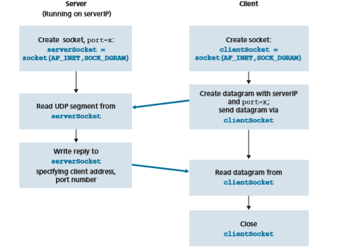
**Figure 2.27**  ♦  The client-server application using UDP 

Now let’s get our hands dirty and take a look at the client-server program pair for a UDP implementation of this simple application. We also provide a detailed, line-by-line analysis after each program. We’ll begin with the UDP client, which will send a simple application-level message to the server. In order for the server to be able to receive and reply to the client’s message, it must be ready and running—that is, it must be running as a process before the client sends its message.

The client program is called UDPClient.py, and the server program is called UDPServer.py. In order to emphasize the key issues, we intentionally provide code that is minimal. “Good code” would certainly have a few more auxiliary lines, in particular for handling error cases. For this application, we have arbitrarily chosen 12000 for the server port number.

**UDPClient.py**

Here is the code for the client side of the application:
```
from socket import * 
serverName = ’hostname’ 
serverPort = 12000 
clientSocket = socket(AF\_INET, SOCK\_DGRAM) 
message = input(’Input lowercase sentence:’) clientSocket.sendto(message.encode(),(serverName, serverPort)) 
modifiedMessage, serverAddress = clientSocket.recvfrom(2048) 
print(modifiedMessage.decode()) 
clientSocket.close()
```
Now let’s take a look at the various lines of code in UDPClient.py.
```
from socket import \*
```
The socket module forms the basis of all network communications in Python. By including this line, we will be able to create sockets within our program.
```
serverName = ’hostname’ 
serverPort = 12000
```
The first line sets the variable serverName to the string ‘hostname’. Here, we pro- vide a string containing either the IP address of the server (e.g., “128.138.32.126”) or the hostname of the server (e.g., “cis.poly.edu”). If we use the hostname, then a DNS lookup will automatically be performed to get the IP address.) The second line sets the integer variable serverPort to 12000.
```
clientSocket = socket(AF\_INET, SOCK\_DGRAM)
```
This line creates the client’s socket, called ```clientSocket.``` The first param- eter indicates the address family; in particular, AF\_INET indicates that the underlying network is using IPv4. (Do not worry about this now—we will dis- cuss IPv4 in Chapter 4.) The second parameter indicates that the socket is of type SOCK\_DGRAM, which means it is a UDP socket (rather than a TCP socket). Note that we are not specifying the port number of the client socket when we create it; we are instead letting the operating system do this for us. Now that the client process’s door has been created, we will want to create a message to send through the door.
```
message = input(’Input lowercase sentence:’)
```
```input()``` is a built-in function in Python. When this command is executed, the user at the client is prompted with the words “Input lowercase sentence:” The user then uses her keyboard to input a line, which is put into the variable message. Now that we have a socket and a message, we will want to send the message through the socket to the destination host.
```
clientSocket.sendto(message.encode(), 
(serverName, serverPort))

```
In the above line, we first convert the message from string type to byte type, as we need to send bytes into a socket; this is done with the encode() method. The method sendto() attaches the destination address (serverName, serverPort) to the message and sends the resulting packet into the process’s socket, clientSocket. (As mentioned earlier, the source address is also attached to the packet, although this is done automatically rather than explicitly by the code.) Sending a client-to-server message via a UDP socket is that simple! After sending the packet, the client waits to receive data from the server.
```
modifiedMessage, serverAddress = clientSocket.recvfrom(2048)
```
With the above line, when a packet arrives from the Internet at the client’s socket, the packet’s data is put into the variable modifiedMessage and the packet’s source address is put into the variable serverAddress. The variable serverAddress contains both the server’s IP address and the server’s port number. The program UDPClient doesn’t actually need this server address information, since it already knows the server address from the outset; but this line of Python provides the server address nevertheless. The method recvfrom also takes the buffer size 2048 as input. (This buffer size works for most purposes.)

print(modifiedMessage.decode())

This line prints out modifiedMessage on the user’s display, after converting the mes- sage from bytes to string. It should be the original line that the user typed, but now capitalized.
```
clientSocket.close()
```
This line closes the socket. The process then terminates.

**UDPServer.py**

Let’s now take a look at the server side of the application:
```
from socket import * 
serverPort = 12000 
serverSocket = socket(AF\_INET, SOCK\_DGRAM) serverSocket.bind((’’, serverPort)) 
print(”The server is ready to receive”) 
while True: 
message, clientAddress = serverSocket.recvfrom(2048) modifiedMessage = message.decode().upper() serverSocket.sendto(modifiedMessage.encode(), clientAddress)
```
Note that the beginning of UDPServer is similar to UDPClient. It also imports the socket module, also sets the integer variable serverPort to 12000, and also creates a socket of type SOCK\_DGRAM (a UDP socket). The first line of code that is significantly different from UDPClient is:
```
serverSocket.bind((’’, serverPort))
```
The above line binds (that is, assigns) the port number 12000 to the server’s socket. Thus, in UDPServer, the code (written by the application developer) is explicitly assigning a port number to the socket. In this manner, when anyone sends a packet to port 12000 at the IP address of the server, that packet will be directed to this socket. UDPServer then enters a while loop; the while loop will allow UDPServer to receive and process packets from clients indefinitely. In the while loop, UDPServer waits for a packet to arrive.
```
message, clientAddress = serverSocket.recvfrom(2048)
```
This line of code is similar to what we saw in UDPClient. When a packet arrives at the server’s socket, the packet’s data is put into the variable message and thepacket’s source address is put into the variable clientAddress. The variable clientAddress contains both the client’s IP address and the client’s port number. Here, UDPServer _will_ make use of this address information, as it provides a return address, similar to the return address with ordinary postal mail. With this source address information, the server now knows to where it should direct its reply.
```
modifiedMessage = message.decode().upper()
```
This line is the heart of our simple application. It takes the line sent by the client and, after converting the message to a string, uses the method upper() to capitalize it.
```
serverSocket.sendto(modifiedMessage.encode(), clientAddress)
```
This last line attaches the client’s address (IP address and port number) to the capital- ized message (after converting the string to bytes), and sends the resulting packet into the server’s socket. (As mentioned earlier, the server address is also attached to the packet, although this is done automatically rather than explicitly by the code.) The Internet will then deliver the packet to this client address. After the server sends the packet, it remains in the while loop, waiting for another UDP packet to arrive (from any client running on any host).

To test the pair of programs, you run UDPClient.py on one host and UDPS- erver.py on another host. Be sure to include the proper hostname or IP address of the server in UDPClient.py. Next, you execute UDPServer.py, the compiled server program, in the server host. This creates a process in the server that idles until it is contacted by some client. Then you execute UDPClient.py, the compiled client program, in the client. This creates a process in the client. Finally, to use the appli- cation at the client, you type a sentence followed by a carriage return.

To develop your own UDP client-server application, you can begin by slightly modifying the client or server programs. For example, instead of convert- ing all the letters to uppercase, the server could count the number of times the letter _s_ appears and return this number. Or you can modify the client so that after receiving a capitalized sentence, the user can continue to send more sentences to the server.

### Socket Programming with TCP

Unlike UDP, TCP is a connection-oriented protocol. This means that before the cli- ent and server can start to send data to each other, they first need to handshake and establish a TCP connection. One end of the TCP connection is attached to the client socket and the other end is attached to a server socket. When creating the TCP con- nection, we associate with it the client socket address (IP address and port number) and the server socket address (IP address and port number). With the TCP connec- tion established, when one side wants to send data to the other side, it just drops thedata into the TCP connection via its socket. This is different from UDP, for which the server must attach a destination address to the packet before dropping it into the socket.

Now let’s take a closer look at the interaction of client and server programs in TCP. The client has the job of initiating contact with the server. In order for the server to be able to react to the client’s initial contact, the server has to be ready. This implies two things. First, as in the case of UDP, the TCP server must be running as a process before the client attempts to initiate contact. Second, the server program must have a special door—more precisely, a special socket—that welcomes some initial contact from a client process running on an arbitrary host. Using our house/ door analogy for a process/socket, we will sometimes refer to the client’s initial con- tact as “knocking on the welcoming door.”

With the server process running, the client process can initiate a TCP connection to the server. This is done in the client program by creating a TCP socket. When the client creates its TCP socket, it specifies the address of the welcoming socket in the server, namely, the IP address of the server host and the port number of the socket. After creating its socket, the client initiates a three-way handshake and establishes a TCP connection with the server. The three-way handshake, which takes place within the transport layer, is completely invisible to the client and server programs.

During the three-way handshake, the client process knocks on the welcom- ing door of the server process. When the server “hears” the knocking, it creates a new door—more precisely, a _new_ socket that is dedicated to that particular client. In our example below, the welcoming door is a TCP socket object that we call serverSocket; the newly created socket dedicated to the client making the con- nection is called connectionSocket. Students who are encountering TCP sock- ets for the first time sometimes confuse the welcoming socket (which is the initial point of contact for all clients wanting to communicate with the server), and each newly created server-side connection socket that is subsequently created for com- municating with each client.

From the application’s perspective, the client’s socket and the server’s con- nection socket are directly connected by a pipe. As shown in Figure 2.28, the cli- ent process can send arbitrary bytes into its socket, and TCP guarantees that the server process will receive (through the connection socket) each byte in the order sent. TCP thus provides a reliable service between the client and server processes. Furthermore, just as people can go in and out the same door, the client process not only sends bytes into but also receives bytes from its socket; similarly, the server process not only receives bytes from but also sends bytes into its connec- tion socket.

We use the same simple client-server application to demonstrate socket pro- gramming with TCP: The client sends one line of data to the server, the server capitalizes the line and sends it back to the client. Figure 2.29 highlights the main socket-related activity of the client and server that communicate over the TCP trans- port service.


Figure 2.28  ♦  The TCPServer process has two sockets

**TCPClient.py**

Here is the code for the client side of the application:
```
from socket import *
serverName = ’servername’ 
serverPort = 12000 clientSocket = socket(AF\_INET, SOCK\_STREAM) 
clientSocket.connect((serverName,serverPort)) 
sentence = input(’Input lowercase sentence:’) clientSocket.send(sentence.encode()) 
modifiedSentence = clientSocket.recv(1024) 
print(’From Server: ’, modifiedSentence.decode()) clientSocket.close()
```
Let’s now take a look at the various lines in the code that differ significantly from the UDP implementation. The first such line is the creation of the client socket.
```
clientSocket = socket(AF\_INET, SOCK\_STREAM)
```
This line creates the client’s socket, called clientSocket. The first parameter again indicates that the underlying network is using IPv4. The second parameter


**Figure 2.29**  ♦  The client-server application using TCP


indicates that the socket is of type SOCK\_STREAM, which means it is a TCP socket (rather than a UDP socket). Note that we are again not specifying the port number of the client socket when we create it; we are instead letting the operating system do this for us. Now the next line of code is very different from what we saw in UDPClient:
```
clientSocket.connect((serverName,serverPort))
```
Recall that before the client can send data to the server (or vice versa) using a TCP socket, a TCP connection must first be established between the client and server. The

above line initiates the TCP connection between the client and server. The parameter of the connect() method is the address of the server side of the connection. After this line of code is executed, the three-way handshake is performed and a TCP con- nection is established between the client and server.
```
sentence = input(’Input lowercase sentence:’)
```
As with UDPClient, the above obtains a sentence from the user. The string sentence continues to gather characters until the user ends the line by typing a carriage return. The next line of code is also very different from UDPClient:
```
clientSocket.send(sentence.encode())
```
The above line sends the sentence through the client’s socket and into the TCP connection. Note that the program does _not_ explicitly create a packet and attach the destination address to the packet, as was the case with UDP sockets. Instead the cli- ent program simply drops the bytes in the string sentence into the TCP connec- tion. The client then waits to receive bytes from the server.
```
modifiedSentence = clientSocket.recv(2048)
```
When characters arrive from the server, they get placed into the string modifiedSentence. Characters continue to accumulate in modifiedSen- tence until the line ends with a carriage return character. After printing the capital- ized sentence, we close the client’s socket:
```
clientSocket.close()
```
This last line closes the socket and, hence, closes the TCP connection between the client and the server. It causes TCP in the client to send a TCP message to TCP in the server (see Section 3.5).

**TCPServer.py**

Now let’s take a look at the server program.
```
from socket import *
serverPort = 12000 
serverSocket = socket(AF\_INET,SOCK\_STREAM) serverSocket.bind((’’,serverPort)) 
serverSocket.listen(1) 
print(’The server is ready to receive’)
while True: 
connectionSocket, addr = serverSocket.accept() sentence = connectionSocket.recv(1024).decode() capitalizedSentence = sentence.upper() connectionSocket.send(capitalizedSentence.encode()) 
connectionSocket.close()
```

Let’s now take a look at the lines that differ significantly from UDPServer and TCP- Client. As with TCPClient, the server creates a TCP socket with:

serverSocket=socket(AF\_INET,SOCK\_STREAM)

Similar to UDPServer, we associate the server port number, serverPort, with this socket:
```
serverSocket.bind((’’,serverPort))
```
But with TCP, serverSocket will be our welcoming socket. After establish- ing this welcoming door, we will wait and listen for some client to knock on the door:
```
serverSocket.listen(1)
```
This line has the server listen for TCP connection requests from the client. The parameter specifies the maximum number of queued connections (at least 1).
```
connectionSocket, addr = serverSocket.accept()
```
When a client knocks on this door, the program invokes the accept() method for serverSocket, which creates a new socket in the server, called connectionSocket, dedicated to this particular client. The client and server then complete the hand- shaking, creating a TCP connection between the client’s clientSocket and the server’s connectionSocket. With the TCP connection established, the client and server can now send bytes to each other over the connection. With TCP, all bytes sent from one side are only guaranteed to arrive at the other side but also guaranteed to arrive in order.
```
connectionSocket.close()
```
In this program, after sending the modified sentence to the client, we close the con- nection socket. But since serverSocket remains open, another client can now knock on the door and send the server a sentence to modify.This completes our discussion of socket programming in TCP. You are encour- aged to run the two programs in two separate hosts, and also to modify them to achieve slightly different goals. You should compare the UDP program pair with the TCP program pair and see how they differ. You should also do many of the socket programming assignments described at the ends of Chapter 2 and 5. Finally, we hope someday, after mastering these and more advanced socket programs, you will write your own popular network application, become very rich and famous, and remember the authors of this textbook!

## Summary

In this chapter, we’ve studied the conceptual and the implementation aspects of network applications. We’ve learned about the ubiquitous client-server architec- ture adopted by many Internet applications and seen its use in the HTTP, SMTP, and DNS protocols. We’ve studied these important application-level protocols, and their corresponding associated applications (the Web, file transfer, e-mail, and DNS) in some detail. We’ve learned about the P2P architecture and contrasted it with the client-server architecture. We’ve also learned about streaming video, and how modern video distribution systems leverage CDNs. We’ve examined how the socket API can be used to build network applications. We’ve walked through the use of sockets for connection-oriented (TCP) and connectionless (UDP) end-to-end transport services. The first step in our journey down the layered network architec- ture is now complete!

At the very beginning of this book, in Section 1.1, we gave a rather vague, bare- bones definition of a protocol: “the format and the order of messages exchanged between two or more communicating entities, as well as the actions taken on the transmission and/or receipt of a message or other event.” The material in this chapter, and in particular our detailed study of the HTTP, SMTP, and DNS protocols, has now added considerable substance to this definition. Protocols are a key concept in networking; our study of application protocols has now given us the opportunity to develop a more intuitive feel for what protocols are all about.

In Section 2.1, we described the service models that TCP and UDP offer to applications that invoke them. We took an even closer look at these service models when we developed simple applications that run over TCP and UDP in Section 2.7. However, we have said little about how TCP and UDP provide these service models. For example, we know that TCP provides a reliable data service, but we haven’t said yet how it does so. In the next chapter, we’ll take a careful look at not only the what, but also the how and why of transport protocols.

Equipped with knowledge about Internet application structure and application- level protocols, we’re now ready to head further down the protocol stack and exam- ine the transport layer in Chapter 3.

**Homework Problems and Questions**

**Chapter 2 Review Questions** 

Section 2.1 

R1. List five nonproprietary Internet applications and the application-layer protocols that they use.

R2. What is the difference between network architecture and application architecture?

R3. For a communication session between a pair of processes, which process is the client and which is the server?

R4. Why are the terms client and server still used in peer-to-peer applications?

R5. What information is used by a process running on one host to identify a pro- cess running on another host?

R6. What is the role of HTTP in a network application? What other components are needed to complete a Web application?

R7. Referring to Figure 2.4, we see that none of the applications listed in Figure 2.4 requires both no data loss and timing. Can you conceive of an application that requires no data loss and that is also highly time-sensitive?

R8. List the four broad classes of services that a transport protocol can provide. For each of the service classes, indicate if either UDP or TCP (or both) pro- vides such a service.

R9. Recall that TCP can be enhanced with TLS to provide process-to-process security services, including encryption. Does TLS operate at the transport layer or the application layer? If the application developer wants TCP to be enhanced with TLS, what does the developer have to do?

Sections 2.2–2.5 R10. What is meant by a handshaking protocol?

R11. What does a stateless protocol mean? Is IMAP stateless? What about SMTP?

R12. How can websites keep track of users? Do they always need to use cookies?

R13. Describe how Web caching can reduce the delay in receiving a requested object. Will Web caching reduce the delay for all objects requested by a user or for only some of the objects? Why?

R14. Telnet into a Web server and send a multiline request message. Include in the request message the If-modified-since: header line to force a response message with the 304 Not Modified status code.

R15. Are there any constraints on the format of the HTTP body? What about the email message body sent with SMTP? How can arbitrary data be transmitted over SMTP?
HOMEwORk PRObLEMs ANd QuEsTIONs 

R16. Suppose Alice, with a Web-based e-mail account (such as Hotmail or Gmail), sends a message to Bob, who accesses his mail from his mail server using IMAP. Discuss how the message gets from Alice’s host to Bob’s host. Be sure to list the series of application-layer protocols that are used to move the message between the two hosts.

R17. Print out the header of an e-mail message you have recently received. How many Received: header lines are there? Analyze each of the header lines in the message.

R18. What is the HOL blocking issue in HTTP/1.1? How does HTTP/2 attempt to solve it?

R19. Why are MX records needed? Would it not be enough to use a CNAME record? (Assume the email client looks up email addresses through a Type A query and that the target host only runs an email server.)

R20. What is the difference between recursive and iterative DNS queries?

Section 2.5 R21. Under what circumstances is file downloading through P2P much faster

than through a centralized client-server approach? Justify your answer using Equation 2.2.

R22. Consider a new peer Alice that joins BitTorrent without possessing any chunks. Without any chunks, she cannot become a top-four uploader for any of the other peers, since she has nothing to upload. How then will Alice get her first chunk?

R23. Assume a BitTorrent tracker suddenly becomes unavailable. What are its consequences? Can files still be downloaded?

Section 2.6 

R24. CDNs typically adopt one of two different server placement philosophies. Name and briefly describe them.

R25. Besides network-related considerations such as delay, loss, and bandwidth performance, there are other important factors that go into designing a CDN server selection strategy. What are they?

Section 2.7 

R26. In Section 2.7, the UDP server described needed only one socket, whereas

the TCP server needed two sockets. Why? If the TCP server were to support _n_ simultaneous connections, each from a different client host, how many sockets would the TCP server need?R27. For the client-server application over TCP described in Section 2.7, why must the server program be executed before the client program? For the client-server application over UDP, why may the client program be executed before the server program?

**Problems**
********************
P1. True or false?

a. A user requests a Web page that consists of some text and three images. For this page, the client will send one request message and receive four response messages.

b. Two distinct Web pages (for example, www.mit.edu/research .html and www.mit.edu/students.html) can be sent over the same persistent connection.

c. With nonpersistent connections between browser and origin server, it is pos- sible for a single TCP segment to carry two distinct HTTP request messages.

d. The Date: header in the HTTP response message indicates when the object in the response was last modified.

e. HTTP response messages never have an empty message body.

P2. SMS, iMessage, Wechat, and WhatsApp are all smartphone real-time mes- saging systems. After doing some research on the Internet, for each of these systems write one paragraph about the protocols they use. Then write a para- graph explaining how they differ.

P3. Assume you open a browser and enter http://yourbusiness.com/ about.html in the address bar. What happens until the webpage is displayed? Provide details about the protocol(s) used and a high-level description of the messages exchanged.

P4. Consider the following string of ASCII characters that were captured by Wireshark when the browser sent an HTTP GET message (i.e., this is the actual content of an HTTP GET message). The characters _<cr><lf>_ are carriage return and line-feed characters (that is, the italized character string _<cr>_ in the text below represents the single carriage-return character that was contained at that point in the HTTP header). Answer the following questions, indicating where in the HTTP GET message below you find the answer.
```
GET /cs453/index.html HTTP/1.1_<cr><lf>_Host: gai a.cs.umass.edu_<cr><lf>_User-Agent: Mozilla/5.0 ( Windows;U; Windows NT 5.1; en-US; rv:1.7.2) Gec ko/20040804 Netscape/7.2 (ax) _<cr><lf>_Accept:ex t/xml, application/xml, application/xhtml+xml, text /html;q=0.9, text/plain;q=0.8,image/png,\*/\*;q=0.5
PRObLEMs 

_<cr><lf>_Accept-Language: en-us,en;q=0.5_<cr><lf>_Accept- Encoding: zip,deflate_<cr><lf>_Accept-Charset: ISO -8859-1,utf-8;q=0.7,\*;q=0.7_<cr><lf>_Keep-Alive: 300_<cr> <lf>_Connection:keep-alive_<cr><lf><cr><lf>_
```
a. What is the URL of the document requested by the browser?

b. What version of HTTP is the browser running?

c. Does the browser request a non-persistent or a persistent connection?

d. What is the IP address of the host on which the browser is running?

e. What type of browser initiates this message? Why is the browser type needed in an HTTP request message?

P5. The text below shows the reply sent from the server in response to the HTTP GET message in the question above. Answer the following questions, indicat- ing where in the message below you find the answer.
```
HTTP/1.1 200 OK_<cr><lf>_Date: Tue, 07 Mar 2008 12:39:45GMT_<cr><lf>_Server: Apache/2.0.52 (Fedora) _<cr><lf>_Last-Modified: Sat, 10 Dec2005 18:27:46 GMT_<cr><lf>_ETag: ”526c3-f22-a88a4c80”_<cr><lf>_Accept- Ranges: bytes_<cr><lf>_Content-Length: 3874_<cr><lf>_ Keep-Alive: timeout=max=100_<cr><lf>_Connection: Keep-Alive_<cr><lf>_Content-Type: text/html; charset= ISO-8859-1_<cr><lf><cr><lf>_<!doctype html public ”- //w3c//dtd html 4.0transitional//en”>_<lf>_<html>_<lf>_ <head>_<lf>_ <meta http-equiv=”Content-Type” content=”text/html; charset=iso-8859-1”>_<lf>_ <meta name=”GENERATOR” content=”Mozilla/4.79 \[en\] (Windows NT 5.0; U) Netscape\”>_<lf>_ <title>CMPSCI 453 / 591 / NTU-ST550ASpring 2005 homepage</title>_<lf>_</head>_<lf>_ _<much more document text following here (not shown)>_
```
a. Was the server able to successfully find the document or not? What time was the document reply provided?

b. When was the document last modified?

c. How many bytes are there in the document being returned?

d. What are the first 5 bytes of the document being returned? Did the server agree to a persistent connection?

P6. Obtain the HTTP/1.1 specification (RFC 2616). Answer the following questions:

a. Explain the mechanism used for signaling between the client and server to indicate that a persistent connection is being closed. Can the client, the server, or both signal the close of a connection?b. What encryption services are provided by HTTP?

c. Can a client open three or more simultaneous connections with a given server?

d. Either a server or a client may close a transport connection between them if either one detects the connection has been idle for some time. Is it possible that one side starts closing a connection while the other side is transmitting data via this connection? Explain.

P7. Suppose within your Web browser, you click on a link to obtain a Web page. The IP address for the associated URL is not cached in your local host, so a DNS lookup is necessary to obtain the IP address. Suppose that _n_ DNS servers are visited before your host receives the IP address from DNS; the successive visits incur an RTT of _RTT_1, . . . , _RTTn_. Further suppose that the Web page associated with the link contains exactly one object, consisting of a large amount of HTML text. Let _RTT_0 denote the RTT between the local host and the server containing the object. Assuming transmission duration of 0.002 \* _RTT_0 of the object, how much time elapses from when the client clicks on the link until the client receives the object?

P8. Consider Problem P7 again and assume _RTT_0 = _RTT_1 = _RTT_2 = . . . _RTTn_ \= _RTT_, Furthermore, assume a new HTML file, small enough to have negligible transmission time, which references nine equally small objects on the same server. How much time elapses with

a. non-persistent HTTP with no parallel TCP connections?

b. non-persistent HTTP with the browser configured for 6 parallel connections?

c. persistent HTTP?

P9. Consider Figure 2.12, for which there is an institutional network connected to the Internet. Moreover, assume the access link has been upgraded to 54 Mbps, and the institutional LAN is upgraded to 10 Gbps. Suppose that the average object size is 1,600,000 bits and that the average request rate from the institu- tion’s browsers to the origin servers is 24 requests per second. Also suppose that the amount of time it takes from when the router on the Internet side of the access link forwards an HTTP request until it receives the response is three seconds on average (see Section 2.2.5). Model the total average response time as the sum of the average access delay (that is, the delay from Internet router to institution router) and the average Internet delay. For the average access delay, use ∆/(1 - ∆b), where ∆ is the average time required to send an object over the access link and b is the arrival rate of objects to the access link.

a. Find the total average response time.

b. Now suppose a cache is installed in the institutional LAN. Suppose the miss rate is 0.3. Find the total response time.

P10. Consider a 30-meter link, over which a sender can transmit at a rate of 300 bits/sec in both directions. Suppose that packets containing data are 100,000 bits long, and packets containing only control (e.g., ACK or
PRObLEMs 

handshaking) are 200 bits long. Assume that _N_ parallel connections each get 1/_N_ of the link bandwidth. Now, consider the HTTP protocol and suppose that each downloaded object is 100 Kbits long, and that the initial down- loaded object contains 10 referenced objects from the same sender. Would parallel downloads via parallel instances of non-persistent HTTP make sense in this case? Now consider persistent HTTP. Do you expect significant gains over the non-persistent case? Justify and explain your answer.

P11. Consider the scenario introduced in the previous problem. Now, suppose that the link is shared by Alice with Bob. Alice does not use parallel instances of non-persistent HTTP while Bob uses non-persistent HTTP with five parallel downloads each.

a. Does Alice have any advantage over Bob? Why or why not?

b. If Alice opens five parallel instances of non-persistent HTTP, then would her parallel connections be beneficial? Why or why not?

P12. Write a simple TCP program for a server that accepts lines of input from a cli- ent and prints the lines onto the server’s standard output. (You can do this by modifying the TCPServer.py program in the text.) Compile and execute your program. On any other machine that contains a Web browser, set the proxy server in the browser to the host that is running your server program; also con- figure the port number appropriately. Your browser should now send its GET request messages to your server, and your server should display the messages on its standard output. Use this platform to determine whether your browser generates conditional GET messages for objects that are locally cached.

P13. Consider sending over HTTP/2 a Web page that consists of one video file and three images. Suppose that the video clip is transported as 5000 frames, and each image captures four frames.

a. If all the video frames are sent first without interleaving, how many “frame times” are needed until all images are sent?

b. If frames are interleaved, how many frame times are needed until all three images are sent?

P14. Consider the Web page in problem 13. Now HTTP/2 prioritization is employed. Suppose all the images are given priority over the video clip, and that the first image is given priority over the second image, the second image over the third image, and so on. How many frame times will be needed until the second image is sent?

P15. What is the difference between MAIL FROM: in SMTP and From: in the mail message itself?

P16. How does SMTP mark the end of a message body? How about HTTP? Can HTTP use the same method as SMTP to mark the end of a message body? Explain.

P17. Read RFC 5321 for SMTP. What does MTA stand for? Consider the follow- ing received spam e-mail (modified from a real spam e-mail). Assuming only the originator of this spam e-mail is malicious and all other hosts are honest, identify the malacious host that has generated this spam e-mail.
```
From - Fri Nov 07 13:41:30 2008 
Return-Path: <tennis5@pp33head.com> Received: from barmail.cs.umass.edu (barmail.cs.umass. edu 
[128.119.240.3]) by cs.umass.edu (8.13.1/8.12.6) for 
<hg@cs.umass.edu>; Fri, 7 Nov 2008 13:27:10 -0500 Received: from asusus-4b96 (localhost [127.0.0.1]) by barmail.cs.umass.edu (Spam Firewall) for <hg@cs.umass. edu>; Fri, 7 Nov 2008 13:27:07 -0500 (EST) Received: from asusus-4b96 ([58.88.21.177]) by barmail. cs.umass.edu for <hg@cs.umass.edu>; Fri, 07 Nov 2008 13:27:07 -0500 (EST) Received: from [58.88.21.177] by inbnd55.exchangeddd. com; Sat, 8 Nov 2008 01:27:07 +0700 From: ”Jonny” <tennis5@pp33head.com> To: <hg@cs.umass.edu> Subject: How to secure your savings
```
P18. 

a. What is a _whois_ database?

b. Use various whois databases on the Internet to obtain the names of two DNS servers. Indicate which whois databases you used.

c. Use nslookup on your local host to send DNS queries to three DNS servers: your local DNS server and the two DNS servers you found in part (b). Try querying for Type A, NS, and MX reports. Summarize your findings.

d. Use nslookup to find a Web server that has multiple IP addresses. Does the Web server of your institution (school or company) have multiple IP addresses?

e. Use the ARIN whois database to determine the IP address range used by your university.

f. Describe how an attacker can use whois databases and the nslookup tool to perform reconnaissance on an institution before launching an attack.

g. Discuss why whois databases should be publicly available.
PRObLEMs 

P19. In this problem, we use the useful _dig_ tool available on Unix and Linux hosts to explore the hierarchy of DNS servers. Recall that in Figure 2.19, a DNS server in the DNS hierarchy delegates a DNS query to a DNS server lower in the hierarchy, by sending back to the DNS client the name of that lower-level DNS server. First read the man page for _dig_, and then answer the following questions.

a. Starting with a root DNS server (from one of the root servers \[a-m\]. root-servers.net), initiate a sequence of queries for the IP address for your department’s Web server by using _dig._ Show the list of the names of DNS servers in the delegation chain in answering your query.

b. Repeat part (a) for several popular Web sites, such as google.com, yahoo .com, or amazon.com.

P20. Consider the scenarios illustrated in Figures 2.12 and 2.13. Assume the rate of the institutional network is _Rl_ and that of the bottleneck link is _Rb_. Suppose there are _N_ clients requesting a file of size _L_ with HTTP at the same time. For what values of _Rl_ would the file transfer takes less time when a proxy is installed at the institutional network? (Assume the RTT between a client and any other host in the institutional network is negligible.)

P21. Suppose that your department has a local DNS server for all computers in the department. You are an ordinary user (i.e., not a network/system administra- tor). Can you determine if an external Web site was likely accessed from a computer in your department a couple of seconds ago? Explain.

P22. Consider distributing a file of _F_ \= 10 Gbits to _N_ peers. The server has an upload rate of _us_ \= 1 Gbps, and each peer has a download rate of _di_ \= 200 Mbps and an upload rate of _u_. For _N_ \= 10, 100, and 1,000 and _u_ \= 2 Mbps, 10 Mbps, and 100 Mbps, prepare a table giving the minimum distribution time in seconds for each of the combinations of _N_ and _u_ for both client-server distribution and P2P distribution.

P23. Consider distributing a file of _F_ bits to _N_ peers using a client-server archi- tecture. Assume a fluid model where the server can simultaneously transmit to multiple peers, transmitting to each peer at different rates, as long as the combined rate does not exceed _us_.

a. Suppose that _us_/_N_ … _d_min. Specify a distribution scheme that has a distri- bution time of _NF_/_us_.

b. Suppose that _us_/_N_ Ú _d_min. Specify a distribution scheme that has a distri- bution time of _F_/_d_min.

c. Conclude that the minimum distribution time is in general given by max5_NF_/_us_, _F_/_d_min6 .

P24. Consider distributing a file of _F_ bits to _N_ peers using a P2P architecture. Assume a fluid model. For simplicity assume that _d_min is very large, so that peer download bandwidth is never a bottleneck.

a. Suppose that _us_ … (_us_ \+ _u_1 + . . . + _uN_)/_N_. Specify a distribution scheme that has a distribution time of _F_/_us_.b. Suppose that _us_ Ú (_us_ \+ _u_1 + . . . + _uN_)/_N_. Specify a distribution scheme that has a distribution time of _NF_/(_us_ \+ _u_1 + . . . + _uN_).

c. Conclude that the minimum distribution time is in general given by max5_F_/_us_, _NF_/(_us_ \+ _u_1 + . . . + _uN_)6 .

P25. Consider an overlay network with _N_ active peers, with each pair of peers hav- ing an active TCP connection. Additionally, suppose that the TCP connec- tions pass through a total of _M_ routers. How many nodes and edges are there in the corresponding overlay network?

P26. Suppose Bob joins a BitTorrent torrent, but he does not want to upload any data to any other peers (he wants to be a so-called free-rider).

a. Alice who has been using BitTorrent tells Bob that he cannot receive a complete copy of the file that is shared by the swarm. Is Alice correct or not? Why?

b. Charlie claims that Alice is wrong and that he has even been using a col- lection of multiple computers (with distinct IP addresses) in the computer lab in his department to make his downloads faster, using some additional coordination scripting. What could his script have done?

P27. Consider a DASH system for which there are _N_ video versions (at _N_ different rates and qualities) and _N_ audio versions (at _N_ different rates and qualities). Suppose we want to allow the player to choose at any time any of the _N_ video versions and any of the _N_ audio versions.

a. If we create files so that the audio is mixed in with the video, so server sends only one media stream at given time, how many files will the server need to store (each a different URL)?

b. If the server instead sends the audio and video streams separately and has the client synchronize the streams, how many files will the server need to store?

P28. Install the Python programs TCPClient and UDPClient on one host and TCPServer and UDPServer on another host.

a. Suppose you run TCPServer and you try to connect using UDPClient. What happens? Why?

b. Suppose you run UDPClient before you run UDPServer. What happens? Why?

c. What happens if you hardwire in the python client and server programs different port numbers for the client and server sides in either a TCP or UDP client-server pair?

P29. Suppose that in UDPClient.py, after we create the socket, we add the line:
```
clientSocket.bind((’’, 5432))
```
Will it become necessary to change UDPServer.py? What are the port num- bers for the sockets in UDPClient and UDPServer? What were they before making this change?
sOCkET PROgRAMMINg AssIgNMENTs 

P30. Can you configure your browser to open multiple simultaneous connections to a Web site? What are the advantages and disadvantages of having a large number of simultaneous TCP connections?

P31. We have seen that Internet TCP sockets treat the data being sent as a byte stream but UDP sockets recognize message boundaries. What are one advantage and one disadvantage of byte-oriented API versus having the API explicitly recognize and preserve application-defined message boundaries?

P32. What is the Apache Web server? How much does it cost? What functional- ity does it currently have? You may want to look at Wikipedia to answer this question.

**Socket Programming Assignments**
*******************************

The Companion Website includes six socket programming assignments. The first four assignments are summarized below. The fifth assignment makes use of the ICMP protocol and is summarized at the end of Chapter 5. It is highly recommended that students complete several, if not all, of these assignments. Students can find full details of these assignments, as well as important snippets of the Python code, at the Web site www.pearsonglobaleditions.com.

**Assignment 1: Web Server** 

In this assignment, you will develop a simple Web server in Python that is capable of processing only one request. Specifically, your Web server will (i) create a connection socket when contacted by a client (browser); (ii) receive the HTTP request from this connection; (iii) parse the request to determine the specific file being requested; (iv) get the requested file from the server’s file system; (v) create an HTTP response message consisting of the requested file preceded by header lines; and (vi) send the response over the TCP connection to the requesting browser. If a browser requests a file that is not present in your server, your server should return a “404 Not Found” error message.

In the Companion Website, we provide the skeleton code for your server. Your job is to complete the code, run your server, and then test your server by sending requests from browsers running on different hosts. If you run your server on a host that already has a Web server running on it, then you should use a different port than port 80 for your Web server.

**Assignment 2: UDP Pinger**

In this programming assignment, you will write a client ping program in Python. Your client will send a simple ping message to a server, receive a corresponding pong message back from the server, and determine the delay between when the clientsent the ping message and received the pong message. This delay is called the Round Trip Time (RTT). The functionality provided by the client and server is similar to the functionality provided by standard ping program available in modern operating sys- tems. However, standard ping programs use the Internet Control Message Protocol (ICMP) (which we will study in Chapter 5). Here we will create a nonstandard (but simple!) UDP-based ping program.

Your ping program is to send 10 ping messages to the target server over UDP. For each message, your client is to determine and print the RTT when the corre- sponding pong message is returned. Because UDP is an unreliable protocol, a packet sent by the client or server may be lost. For this reason, the client cannot wait indefi- nitely for a reply to a ping message. You should have the client wait up to one second for a reply from the server; if no reply is received, the client should assume that the packet was lost and print a message accordingly.

In this assignment, you will be given the complete code for the server (available in the Companion Website). Your job is to write the client code, which will be very similar to the server code. It is recommended that you first study carefully the server code. You can then write your client code, liberally cutting and pasting lines from the server code.

**Assignment 3: Mail Client**

 The goal of this programming assignment is to create a simple mail client that sends e-mail to any recipient. Your client will need to establish a TCP connection with a mail server (e.g., a Google mail server), dialogue with the mail server using the SMTP protocol, send an e-mail message to a recipient (e.g., your friend) via the mail server, and finally close the TCP connection with the mail server.

For this assignment, the Companion Website provides the skeleton code for your client. Your job is to complete the code and test your client by sending e-mail to different user accounts. You may also try sending through different servers (for example, through a Google mail server and through your university mail server).

**Assignment 4: Web Proxy**

In this assignment, you will develop a Web proxy. When your proxy receives an HTTP request for an object from a browser, it generates a new HTTP request for the same object and sends it to the origin server. When the proxy receives the cor- responding HTTP response with the object from the origin server, it creates a new HTTP response, including the object, and sends it to the client.

For this assignment, the Companion Website provides the skeleton code for the proxy server. Your job is to complete the code, and then test it by having different browsers request Web objects via your proxy.
wIREsHARk LAb: dNs 

**Wireshark Lab: HTTP**
********************
Having gotten our feet wet with the Wireshark packet sniffer in Lab 1, we’re now ready to use Wireshark to investigate protocols in operation. In this lab, we’ll explore several aspects of the HTTP protocol: the basic GET/reply interaction, HTTP message formats, retrieving large HTML files, retrieving HTML files with embedded URLs, persistent and non-persistent connections, and HTTP authentication and security.

As is the case with all Wireshark labs, the full description of this lab is available at this book’s Web site, www.pearsonglobaleditions.com.

**Wireshark Lab: DNS**
********************
In this lab, we take a closer look at the client side of the DNS, the protocol that translates Internet hostnames to IP addresses. Recall from Section 2.5 that the cli- ent’s role in the DNS is relatively simple—a client sends a query to its local DNS server and receives a response back. Much can go on under the covers, invisible to the DNS clients, as the hierarchical DNS servers communicate with each other to either recursively or iteratively resolve the client’s DNS query. From the DNS cli- ent’s standpoint, however, the protocol is quite simple—a query is formulated to the local DNS server and a response is received from that server. We observe DNS in action in this lab.

As is the case with all Wireshark labs, the full description of this lab is available at this book’s Web site, www.pearsonglobaleditions.com.

**AN INTERVIEW WITH...**

**Tim Berners-Lee**


Sir Tim Berners-Lee is known as the inventor of the World Wide Web. In 1989, while working as a fellow at CERN, he proposed an Internet-based distributed information management system includ- ing the original version of the HTTP protocol. In the same year he successfully implemented his design on a client and server. He received the 2016 Turing award for “inventing the World Wide Web, the first Web browser, and the fundamental protocols and algorithms allowing the Web to scale.” He is the Co-Founder of the World Wide Web Foundation, and currently is a Professorial Fellow of Computer Science at the University of Oxford and a professor at CSAIL at MIT.

**You originally studied physics. How is networking similar to physics?**

 When you study physics, you imagine what rules of behavior on the very small scale could possibly give rise to the large-scale world as we see it. When you design a global system like the Web, you try to invent rules of behavior of Web pages and links and things that could in the large create a large-scale world as we would like it. One is analysis and the other synthesis, but they are very similar.

**What influenced you to specialize in networking?**

 After my physics degree, the telecommunications research companies seemed to be the most interesting places. The microprocessor had just come out, and telecommunications was switching very fast from hardwired logic to microprocessor-based systems. It was very exciting.

**What is the most challenging part of your job?**

 When two groups disagree strongly about something, but want in the end to achieve a com- mon goal, finding exactly what they each mean and where the misunderstandings are can be very demanding. The chair of any working group knows that. However, this is what it takes to make progress toward consensus on a large scale.

**What people have inspired you professionally?**

 My parents, who were involved in the early days of computing, gave me a fascination with the whole subject. Mike Sendall and Peggie Rimmer, for whom I worked at various times at CERN are among the people who taught me and encouraged me. I later learned to admire the people, including Vanevar Bush, Doug Englebart, and Ted Nelson, who had had similar dreams in their time but had not had the benefit of the existence for PCs and the Internet to be able to realize it.