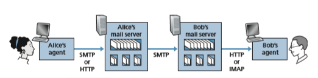

## Electronic Mail in the Internet
Electronic mail has been around since the beginning of the Internet. It was the most popular application when the Internet was in its infancy [Segaller 1998], and has become more elaborate and powerful over the years. It remains one of the Internet’s most important and utilized applications.

As with ordinary postal mail, e-mail is an asynchronous communication medium—people send and read messages when it is convenient for them, without having to coordinate with other people’s schedules. In contrast with postal mail, electronic mail is fast, easy to distribute, and inexpensive. Modern e-mail has many powerful features, including messages with attachments, hyperlinks, HTML- formatted text, and embedded photos.

In this Section, we examine the application-layer protocols that are at the heart of Internet e-mail. But before we jump into an in-depth discussion of these protocols, let’s take a high-level view of the Internet mail system and its key components.

Figure 2.14 presents a high-level view of the Internet mail system. We see from this diagram that it has three major components: **user agents**, **mail servers**, and the **Simple Mail Transfer Protocol (SMTP)**. We now describe each of these compo- nents in the context of a sender, Alice, sending an e-mail message to a recipient, Bob. User agents allow users to read, reply to, forward, save, and compose messages. Examples of user agents for e-mail include Microsoft Outlook, Apple Mail, Web- based Gmail, the Gmail App running in a smartphone, and so on. When Alice is finished composing her message, her user agent sends the message to her mail server, where the message is placed in the mail server’s outgoing message queue. When Bob wants to read a message, his user agent retrieves the message from his mailbox in his mail server.

Mail servers form the core of the e-mail infrastructure. Each recipient, such as Bob, has a **mailbox** located in one of the mail servers. Bob’s mailbox manages and maintains the messages that have been sent to him. A typical message starts its journey in the sender’s user agent, then travels to the sender’s mail server.

**Figure 2.14**  ♦  A high-level view of the Internet e-mail system

travels to the recipient’s mail server, where it is deposited in the recipient’s mailbox. When Bob wants to access the messages in his mailbox, the mail server containing his mailbox authenticates Bob (with his username and password). Alice’s mail server must also deal with failures in Bob’s mail server. If Alice’s server cannot deliver mail to Bob’s server, Alice’s server holds the message in a **message queue** and attempts to transfer the message later. Reattempts are often done every 30 minutes or so; if there is no success after several days, the server removes the message and notifies the sender (Alice) with an e-mail message.

SMTP is the principal application-layer protocol for Internet electronic mail. It uses the reliable data transfer service of TCP to transfer mail from the sender’s mail server to the recipient’s mail server. As with most application-layer protocols, SMTP has two sides: a client side, which executes on the sender’s mail server, and a server side, which executes on the recipient’s mail server. Both the client and server sides of

SMTP run on every mail server. When a mail server sends mail to other mail servers, it acts as an SMTP client. When a mail server receives mail from other mail servers, it acts as an SMTP server.

### SMTP
 SMTP, defined in RFC 5321, is at the heart of Internet electronic mail. As men- tioned above, SMTP transfers messages from senders’ mail servers to the recipients’ mail servers. SMTP is much older than HTTP. (The original SMTP RFC dates back to 1982, and SMTP was around long before that.) Although SMTP has numerous wonderful qualities, as evidenced by its ubiquity in the Internet, it is nevertheless a legacy technology that possesses certain archaic characteristics. For example, it restricts the body (not just the headers) of all mail messages to simple 7-bit ASCII. This restriction made sense in the early 1980s when transmission capacity was scarce and no one was e-mailing large attachments or large image, audio, or video files. But today, in the multimedia era, the 7-bit ASCII restriction is a bit of a pain—it requires binary multimedia data to be encoded to ASCII before being sent over SMTP; and it requires the corresponding ASCII message to be decoded back to binary after SMTP transport. Recall from Section 2.2 that HTTP does not require multimedia data to be ASCII encoded before transfer.

To illustrate the basic operation of SMTP, let’s walk through a common sce- nario. Suppose Alice wants to send Bob a simple ASCII message.

1\. Alice invokes her user agent for e-mail, provides Bob’s e-mail address (for example, bob@someschool.edu), composes a message, and instructs the user agent to send the message.

2\. Alice’s user agent sends the message to her mail server, where it is placed in a message queue.

3\. The client side of SMTP, running on Alice’s mail server, sees the message in the message queue. It opens a TCP connection to an SMTP server, running on Bob’s mail server.

4\. After some initial SMTP handshaking, the SMTP client sends Alice’s message into the TCP connection.

5\. At Bob’s mail server, the server side of SMTP receives the message. Bob’s mail server then places the message in Bob’s mailbox.

6\. Bob invokes his user agent to read the message at his convenience.

The scenario is summarized in Figure 2.15. 

It is important to observe that SMTP does not normally use intermediate mail servers for sending mail, even when the two mail servers are located at opposite ends of the world. If Alice’s server is in Hong Kong and Bob’s server is in St. Louis, the TCP connection is a direct connection between the Hong Kong and St. Louis servers. In


**Figure 2.15**  ♦  Alice sends a message to BobS

particular, if Bob’s mail server is down, the message remains in Alice’s mail server and waits for a new attempt—the message does not get placed in some intermediate mail server.

Let’s now take a closer look at how SMTP transfers a message from a send- ing mail server to a receiving mail server. We will see that the SMTP proto- col has many similarities with protocols that are used for face-to-face human interaction. First, the client SMTP (running on the sending mail server host) has TCP establish a connection to port 25 at the server SMTP (running on the receiv- ing mail server host). If the server is down, the client tries again later. Once this connection is established, the server and client perform some application- layer handshaking—just as humans often introduce themselves before trans- ferring information from one to another, SMTP clients and servers introduce themselves before transferring information. During this SMTP handshaking phase, the SMTP client indicates the e-mail address of the sender (the person who gener- ated the message) and the e-mail address of the recipient. Once the SMTP client and server have introduced themselves to each other, the client sends the message. SMTP can count on the reliable data transfer service of TCP to get the message to the server without errors. The client then repeats this process over the same TCP connection if it has other messages to send to the server; otherwise, it instructs TCP to close the connection.

Let’s next take a look at an example transcript of messages exchanged between an SMTP client (C) and an SMTP server (S). The hostname of the client is crepes.fr and the hostname of the server is hamburger.edu. The ASCII text lines prefaced with C: are exactly the lines the client sends into its TCP socket, and the ASCII text lines prefaced with S: are exactly the lines the server sends into its TCP socket. The following transcript begins as soon as the TCP connection is established.
```
S:  220 hamburger.edu
C:  HELO crepes.fr
S:  250 Hello crepes.fr, pleased to meet you
C:  MAIL FROM: <alice@crepes.fr>
S:  250 alice@crepes.fr ... Sender ok
C:  RCPT TO: <bob@hamburger.edu>
S:  250 bob@hamburger.edu ... Recipient ok
C:  DATA
S:  354 Enter mail, end with ”.” on a line by itself
C:  Do you like ketchup?
C:  How about pickles?
C:  .
S:  250 Message accepted for delivery
C:  QUIT
S:  221 hamburger.edu closing connection
```
In the example above, the client sends a message (“Do you like ketchup? How about pickles?”) from mail server crepes.fr to mail server hamburger.edu. As part of the dialogue, the client issued five commands: HELO (an abbreviation for HELLO), MAIL FROM, RCPT TO, DATA, and QUIT. These commands are self-explanatory. The client also sends a line consisting of a single period, which indicates the end of the message to the server. (In ASCII jar- gon, each message ends with CRLF.CRLF, where CR and LF stand for carriage return and line feed, respectively.) The server issues replies to each command, with each reply having a reply code and some (optional) English-language expla- nation. We mention here that SMTP uses persistent connections: If the sending mail server has several messages to send to the same receiving mail server, it can send all of the messages over the same TCP connection. For each message, the client begins the process with a new MAIL FROM: crepes.fr, designates the end of message with an isolated period, and issues QUIT only after all messages have been sent.

It is highly recommended that you use Telnet to carry out a direct dialogue with an SMTP server. To do this, issue

```
telnet serverName 25

```
where ```serverName``` is the name of a local mail server. When you do this, you are simply establishing a TCP connection between your local host and the mail server. After typing this line, you should immediately receive the ```220``` reply from the server. Then issue the SMTP commands ```HELO, MAIL FROM, RCPT TO, DATA, CRLF.CRLF, and QUIT``` at the appropriate times. It is also highly recommended that you do Programming Assignment 3 at the end of this chapter. In that assign- ment, you’ll build a simple user agent that implements the client side of SMTP. It will allow you to send an e-mail message to an arbitrary recipient via a local mail server.

### Mail Message Formats

 When Alice writes an ordinary snail-mail letter to Bob, she may include all kinds of peripheral header information at the top of the letter, such as Bob’s address, her own return address, and the date. Similarly, when an e-mail message is sent from one person to another, a header containing peripheral information precedes the body of the message itself. This peripheral information is contained in a series of header lines, which are defined in RFC 5322. The header lines and the body of the message are separated by a blank line (that is, by CRLF). RFC 5322 specifies the exact format for mail header lines as well as their semantic interpretations. As with HTTP, each header line contains readable text, consisting of a keyword followed by a colon followed by a value. Some of the keywords are required and others are optional. Every header must have a From: header line and a To: header line; a header may include a Subject: header line as well as other optional header lines. It is important to note that these header lines are _different_ from the SMTP commands we studied in Section 2.3.1 (even though they contain some common words such as “from” and “to”). The commands in that Section were part of the SMTP handshaking protocol; the header lines examined in this Section are part of the mail message itself.

A typical message header looks like this:

```
From: alice@crepes.fr
To: bob@hamburger.edu 
Subject: Searching for the meaning of life.
```


After the message header, a blank line follows; then the message body (in ASCII) follows. You should use Telnet to send a message to a mail server that contains some header lines, including the Subject: header line. To do this, issue telnet serverName 25, as discussed in Section 2.3.1.

### Mail Access Protocols

Once SMTP delivers the message from Alice’s mail server to Bob’s mail server, the message is placed in Bob’s mailbox. Given that Bob (the recipient) executes his user agent on his local host (e.g., smartphone or PC), it is natural to consider placing a mail server on his local host as well. With this approach, Alice’s mail server would dia- logue directly with Bob’s PC. There is a problem with this approach, however. Recall that a mail server manages mailboxes and runs the client and server sides of SMTP. If Bob’s mail server were to reside on his local host, then Bob’s host would have to remain always on, and connected to the Internet, in order to receive new mail, which can arrive at any time. This is impractical for many Internet users. Instead, a typical user runs a user agent on the local host but accesses its mailbox stored on an always- on shared mail server. This mail server is shared with other users.


**Figure 2.16**  ♦  E-mail protocols and their communicating entities

Now let’s consider the path an e-mail message takes when it is sent from Alice to Bob. We just learned that at some point along the path the e-mail message needs to be deposited in Bob’s mail server. This could be done simply by having Alice’s user agent send the message directly to Bob’s mail server. However, typically the send- er’s user agent does not dialogue directly with the recipient’s mail server. Instead, as shown in Figure 2.16, Alice’s user agent uses SMTP or HTTP to deliver the e-mail message into her mail server, then Alice’s mail server uses SMTP (as an SMTP cli- ent) to relay the e-mail message to Bob’s mail server. Why the two-step procedure? Primarily because without relaying through Alice’s mail server, Alice’s user agent doesn’t have any recourse to an unreachable destination mail server. By having Alice first deposit the e-mail in her own mail server, Alice’s mail server can repeatedly try to send the message to Bob’s mail server, say every 30 minutes, until Bob’s mail server becomes operational. (And if Alice’s mail server is down, then she has the recourse of complaining to her system administrator!)

But there is still one missing piece to the puzzle! How does a recipient like Bob, running a user agent on his local host , obtain his messages, which are sitting in a mail server? Note that Bob’s user agent can’t use SMTP to obtain the messages because obtaining the messages is a pull operation, whereas SMTP is a push protocol.

Today, there are two common ways for Bob to retrieve his e-mail from a mail server. If Bob is using Web-based e-mail or a smartphone app (such as Gmail), then the user agent will use HTTP to retrieve Bob’s e-mail. This case requires Bob’s mail server to have an HTTP interface as well as an SMTP interface (to communicate with Alice’s mail server). The alternative method, typically used with mail clients such as Microsoft Outlook, is to use the **Internet Mail Access Protocol (IMAP)** defined in RFC 3501. Both the HTTP and IMAP approaches allow Bob to manage folders, maintained in Bob’s mail server. Bob can move messages into the folders he creates, delete messages, mark messages as important, and so on.
