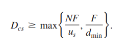
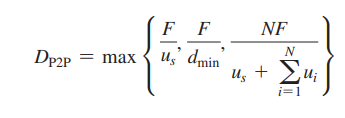
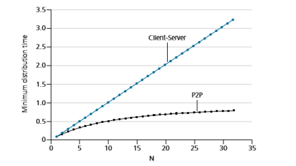
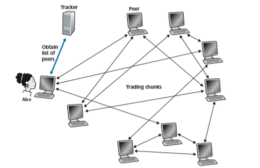

## Peer-to-Peer File Distribution

The applications described in this chapter thus far—including the Web, e-mail, and DNS—all employ client-server architectures with significant reliance on always-on infrastructure servers. Recall from Section 2.1.1 that with a P2P architecture, there is minimal (or no) reliance on always-on infrastructure servers. Instead, pairs of intermittently connected hosts, called peers, communicate directly with each other. The peers are not owned by a service provider, but are instead PCs, laptops, and smartpones controlled by users.In this Section, we consider a very natural P2P application, namely, distributing a large file from a single server to a large number of hosts (called peers). The file might be a new version of the Linux operating system, a software patch for an existing operating system or an MPEG video file. In client-server file distribution, the server must send a copy of the file to each of the peers—placing an enormous burden on the server and consuming a large amount of server bandwidth. In P2P file distribution, each peer can redistribute any portion of the file it has received to any other peers, thereby assisting the server in the distribution process. As of 2020, the most popular P2P file distribution protocol is BitTorrent. Originally developed by Bram Cohen, there are now many different independent BitTorrent clients conforming to the Bit- Torrent protocol, just as there are a number of Web browser clients that conform to the HTTP protocol. In this subSection, we first examine the self-scalability of P2P architectures in the context of file distribution. We then describe BitTorrent in some detail, highlighting its most important characteristics and features.

**Scalability of P2P Architectures**

To compare client-server architectures with peer-to-peer architectures, and illustrate the inherent self-scalability of P2P, we now consider a simple quantitative model for distributing a file to a fixed set of peers for both architecture types. As shown in Figure 2.22, the server and the peers are connected to the Internet with access

**Figure 2.22**  ♦  An illustrative file distribution problem

links. Denote the upload rate of the server’s access link by _us_, the upload rate of the _i_th peer’s access link by _ui_, and the download rate of the _i_th peer’s access link by _di_. Also denote the size of the file to be distributed (in bits) by _F_ and the number of peers that want to obtain a copy of the file by _N_. The **distribution time** is the time it takes to get a copy of the file to all _N_ peers. In our analysis of the distribution time below, for both client-server and P2P architectures, we make the simplifying and generally accurate Akella 2003 assumption that the Internet core has abundant bandwidth, implying that all of the bottlenecks are in access networks. We also sup- pose that the server and clients are not participating in any other network applica- tions, so that all of their upload and download access bandwidth can be fully devoted to distributing this file.

Let’s first determine the distribution time for the client-server architecture, which we denote by Dcs. In the client-server architecture, none of the peers aids in distributing the file. We make the following observations:

• The server must transmit one copy of the file to each of the _N_ peers. Thus, the server must transmit _NF_ bits. Since the server’s upload rate is _us_, the time to dis- tribute the file must be at least NFlus.

• Let dmin denote the download rate of the peer with the lowest download rate, that is,dmin = min{d1,dp,...,dN}. The peer with the lowest download rate cannot obtain all _F_ bits of the file in less than _F_/_d_min seconds. Thus, the minimum distri- bution time is at least _F_/_d_min.

Putting these two observations together, we obtain

This provides a lower bound on the minimum distribution time for the client-server architecture. In the homework problems, you will be asked to show that the server can schedule its transmissions so that the lower bound is actually achieved. So let’s take this lower bound provided above as the actual distribution time, that is,

We see from Equation 2.1 that for _N_ large enough, the client-server distribution time is given by NFluss_. Thus, the distribution time increases linearly with the number of peers _N_. So, for example, if the number of peers from one week to the next increases a thousand-fold from a thousand to a million, the time required to distribute the file to all peers increases by 1,000.Let’s now go through a similar analysis for the P2P architecture, where each peer can assist the server in distributing the file. In particular, when a peer receives some file data, it can use its own upload capacity to redistribute the data to other peers. Cal- culating the distribution time for the P2P architecture is somewhat more complicated than for the client-server architecture, since the distribution time depends on how each peer distributes portions of the file to the other peers. Nevertheless, a simple expression for the minimal distribution time can be obtained [Kumar 2006]. To this end, we first make the following observations:

• At the beginning of the distribution, only the server has the file. To get this file into the community of peers, the server must send each bit of the file at least once into its access link. Thus, the minimum distribution time is at least _F_/_us_. (Unlike the client-server scheme, a bit sent once by the server may not have to be sent by the server again, as the peers may redistribute the bit among themselves.)

• As with the client-server architecture, the peer with the lowest download rate cannot obtain all _F_ bits of the file in less than _F_/_d_min seconds. Thus, the minimum distribution time is at least _F_/_d_min.

• Finally, observe that the total upload capacity of the system as a whole is equal to the upload rate of the server plus the upload rates of each of the individual peers, that is, _u_total = _us_ \+ _u_1 + g+ _uN_. The system must deliver (upload) _F_ bits to each of the _N_ peers, thus delivering a total of _NF_ bits. This cannot be done at a rate faster than _u_total. Thus, the minimum distribution time is also at least _NF_/(_us_ \+ _u_1 + g+ _uN_).

Putting these three observations together, we obtain the minimum distribution time for P2P, denoted by _D_P2P.

Equation 2.2 provides a lower bound for the minimum distribution time for the P2P architecture. It turns out that if we imagine that each peer can redistribute a bit as soon as it receives the bit, then there is a redistribution scheme that actually achieves this lower bound [Kumar 2006]. (We will prove a special case of this result in the homework.) In reality, where chunks of the file are redistributed rather than indi- vidual bits, Equation 2.2 serves as a good approximation of the actual minimum distribution time. Thus, let’s take the lower bound provided by Equation 2.2 as the actual minimum distribution time, that is,

**Figure 2.23**  ♦  Distribution time for P2P and client-server architectures

Figure 2.23 compares the minimum distribution time for the client-server and P2P architectures assuming that all peers have the same upload rate _u_. In Figure 2.23, we have set Flu= 1 hour, us= 10u, and dmin Ú >_us. Thus, a peer can transmit the entire file in one hour, the server transmission rate is 10 times the peer upload rate, and (for simplicity) the peer download rates are set large enough so as not to have an effect. We see from Figure 2.23 that for the client-server architecture, the distri- bution time increases linearly and without bound as the number of peers increases. However, for the P2P architecture, the minimal distribution time is not only always less than the distribution time of the client-server architecture; it is also less than one hour for _any_ number of peers _N_. Thus, applications with the P2P architecture can be self-scaling. This scalability is a direct consequence of peers being redistributors as well as consumers of bits.

**BitTorrent**

BitTorrent is a popular P2P protocol for file distribution [Chao 2011]. In BitTorrent lingo, the collection of all peers participating in the distribution of a particular file is called a _torrent_. Peers in a torrent download equal-size _chunks_ of the file from one another, with a typical chunk size of 256 KBytes. When a peer first joins a torrent, it has no chunks. Over time it accumulates more and more chunks. While it downloads chunks it also uploads chunks to other peers. Once a peer has acquired the entire file, it may (selfishly) leave the torrent, or (altruistically) remain in the torrent and continue to upload chunks to other peers. Also, any peer may leave the torrent at any time with only a subset of chunks, and later rejoin the torrent.

**Figure 2.24**  ♦  File distribution with BitTorrent
Let’s now take a closer look at how BitTorrent operates. Since BitTorrent is a rather complicated protocol and system, we’ll only describe its most important mechanisms, sweeping some of the details under the rug; this will allow us to see the forest through the trees. Each torrent has an infrastructure node called a _tracker_. When a peer joins a torrent, it registers itself with the tracker and periodically informs the tracker that it is still in the torrent. In this manner, the tracker keeps track of the peers that are participating in the torrent. A given torrent may have fewer than ten or more than a thousand peers participating at any instant of time.

As shown in Figure 2.24, when a new peer, Alice, joins the torrent, the tracker randomly selects a subset of peers (for concreteness, say 50) from the set of partici- pating peers, and sends the IP addresses of these 50 peers to Alice. Possessing this list of peers, Alice attempts to establish concurrent TCP connections with all the peers on this list. Let’s call all the peers with which Alice succeeds in establishing a TCP connection “neighboring peers.” (In Figure 2.24, Alice is shown to have only three neighboring peers. Normally, she would have many more.) As time evolves, some of these peers may leave and other peers (outside the initial 50) may attempt to establish TCP connections with Alice. So a peer’s neighboring peers will fluctuate over time.

At any given time, each peer will have a subset of chunks from the file, with dif- ferent peers having different subsets. Periodically, Alice will ask each of her neigh- boring peers (over the TCP connections) for the list of the chunks they have. If Alice has _L_ different neighbors, she will obtain _L_ lists of chunks. With this knowledge, Alice will issue requests (again over the TCP connections) for chunks she currently does not have.

So at any given instant of time, Alice will have a subset of chunks and will know which chunks her neighbors have. With this information, Alice will have two impor- tant decisions to make. First, which chunks should she request first from her neigh- bors? And second, to which of her neighbors should she send requested chunks? In deciding which chunks to request, Alice uses a technique called **rarest first**. The idea is to determine, from among the chunks she does not have, the chunks that are the rarest among her neighbors (that is, the chunks that have the fewest repeated cop- ies among her neighbors) and then request those rarest chunks first. In this manner, the rarest chunks get more quickly redistributed, aiming to (roughly) equalize the numbers of copies of each chunk in the torrent.

To determine which requests she responds to, BitTorrent uses a clever trading algorithm. The basic idea is that Alice gives priority to the neighbors that are cur- rently supplying her data _at the highest rate_. Specifically, for each of her neighbors, Alice continually measures the rate at which she receives bits and determines the four peers that are feeding her bits at the highest rate. She then reciprocates by sending chunks to these same four peers. Every 10 seconds, she recalculates the rates and pos- sibly modifies the set of four peers. In BitTorrent lingo, these four peers are said to be **unchoked**. Importantly, every 30 seconds, she also picks one additional neighbor at random and sends it chunks. Let’s call the randomly chosen peer Bob. In BitTorrent lingo, Bob is said to be **optimistically unchoked**. Because Alice is sending data to Bob, she may become one of Bob’s top four uploaders, in which case Bob would start to send data to Alice. If the rate at which Bob sends data to Alice is high enough, Bob could then, in turn, become one of Alice’s top four uploaders. In other words, every 30 seconds, Alice will randomly choose a new trading partner and initiate trading with that partner. If the two peers are satisfied with the trading, they will put each other in their top four lists and continue trading with each other until one of the peers finds a better partner. The effect is that peers capable of uploading at compatible rates tend to find each other. The random neighbor selection also allows new peers to get chunks, so that they can have something to trade. All other neighboring peers besides these five peers (four “top” peers and one probing peer) are “choked,” that is, they do not receive any chunks from Alice. BitTorrent has a number of interesting mechanisms that are not discussed here, including pieces (mini-chunks), pipelining, random first selection, endgame mode, and anti-snubbing [Cohen 2003].

The incentive mechanism for trading just described is often referred to as tit-for- tat [Cohen 2003]. It has been shown that this incentive scheme can be circumvented [Liogkas 2006; Locher 2006; Piatek 2008]. Nevertheless, the BitTorrent ecosystem is wildly successful, with millions of simultaneous peers actively sharing files inhundreds of thousands of torrents. If BitTorrent had been designed without tit-for-tat (or a variant), but otherwise exactly the same, BitTorrent would likely not even exist now, as the majority of the users would have been freeriders [Saroiu 2002].

We close our discussion on P2P by briefly mentioning another application of P2P, namely, Distributed Hast Table (DHT). A distributed hash table is a simple database, with the database records being distributed over the peers in a P2P system. DHTs have been widely implemented (e.g., in BitTorrent) and have been the subject of extensive research. An overview is provided in a Video Note in the Companion Website.
