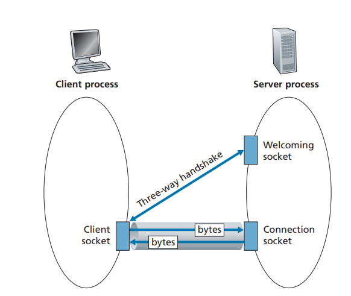
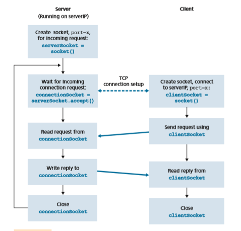

## Socket Programming: Creating Network Applications

Now that we’ve looked at a number of important network applications, let’s explore how network application programs are actually created. Recall from Section 2.1 that a typical network application consists of a pair of programs—a client program anda server program—residing in two different end systems. When these two programs are executed, a client process and a server process are created, and these processes communicate with each other by reading from, and writing to, sockets. When creat- ing a network application, the developer’s main task is therefore to write the code for both the client and server programs.

There are two types of network applications. One type is an implementation whose operation is specified in a protocol standard, such as an RFC or some other standards document; such an application is sometimes referred to as “open,” since the rules specifying its operation are known to all. For such an implementation, the client and server programs must conform to the rules dictated by the RFC. For exam- ple, the client program could be an implementation of the client side of the HTTP protocol, described in Section 2.2 and precisely defined in RFC 2616; similarly, the server program could be an implementation of the HTTP server protocol, also precisely defined in RFC 2616. If one developer writes code for the client program and another developer writes code for the server program, and both developers care- fully follow the rules of the RFC, then the two programs will be able to interoper- ate. Indeed, many of today’s network applications involve communication between client and server programs that have been created by independent developers—for example, a Google Chrome browser communicating with an Apache Web server, or a BitTorrent client communicating with BiTorrent tracker.

The other type of network application is a proprietary network application. In this case, the client and server programs employ an application-layer protocol that has _not_ been openly published in an RFC or elsewhere. A single developer (or develop- ment team) creates both the client and server programs, and the developer has com- plete control over what goes in the code. But because the code does not implement an open protocol, other independent developers will not be able to develop code that interoperates with the application.

In this Section, we’ll examine the key issues in developing a client-server appli- cation, and we’ll “get our hands dirty” by looking at code that implements a very sim- ple client-server application. During the development phase, one of the first decisions the developer must make is whether the application is to run over TCP or over UDP. Recall that TCP is connection oriented and provides a reliable byte-stream channel through which data flows between two end systems. UDP is connectionless and sends independent packets of data from one end system to the other, without any guarantees about delivery. Recall also that when a client or server program implements a proto- col defined by an RFC, it should use the well-known port number associated with the protocol; conversely, when developing a proprietary application, the developer must be careful to avoid using such well-known port numbers. (Port numbers were briefly discussed in Section 2.1. They are covered in more detail in Chapter 3.)

We introduce UDP and TCP socket programming by way of a simple UDP application and a simple TCP application. We present the simple UDP and TCP applications in Python 3. We could have written the code in Java, C, or C++, but we chose Python mostly because Python clearly exposes the key socket concepts. WithPython there are fewer lines of code, and each line can be explained to the novice programmer without difficulty. But there’s no need to be frightened if you are not familiar with Python. You should be able to easily follow the code if you have expe- rience programming in Java, C, or C++.

If you are interested in client-server programming with Java, you are encour- aged to see the Companion Website for this textbook; in fact, you can find there all the examples in this Section (and associated labs) in Java. For readers who are interested in client-server programming in C, there are several good references avail- able [Donahoo 2001; Stevens 1997; Frost 1994]; our Python examples below have a similar look and feel to C.

### Socket Programming with UDP

In this subSection, we’ll write simple client-server programs that use UDP; in the following Section, we’ll write similar programs that use TCP.

Recall from Section 2.1 that processes running on different machines communi- cate with each other by sending messages into sockets. We said that each process is analogous to a house and the process’s socket is analogous to a door. The application resides on one side of the door in the house; the transport-layer protocol resides on the other side of the door in the outside world. The application developer has control of everything on the application-layer side of the socket; however, it has little control of the transport-layer side.

Now let’s take a closer look at the interaction between two communicating pro- cesses that use UDP sockets. Before the sending process can push a packet of data out the socket door, when using UDP, it must first attach a destination address to the packet. After the packet passes through the sender’s socket, the Internet will use this destination address to route the packet through the Internet to the socket in the receiving process. When the packet arrives at the receiving socket, the receiving process will retrieve the packet through the socket, and then inspect the packet’s contents and take appropriate action.

So you may be now wondering, what goes into the destination address that is attached to the packet? As you might expect, the destination host’s IP address is part of the destination address. By including the destination IP address in the packet, the routers in the Internet will be able to route the packet through the Internet to the destination host. But because a host may be running many net- work application processes, each with one or more sockets, it is also necessary to identify the particular socket in the destination host. When a socket is created, an identifier, called a **port number**, is assigned to it. So, as you might expect, the packet’s destination address also includes the socket’s port number. In sum- mary, the sending process attaches to the packet a destination address, which con- sists of the destination host’s IP address and the destination socket’s port number. Moreover, as we shall soon see, the sender’s source address—consisting of theIP address of the source host and the port number of the source socket—are also attached to the packet. However, attaching the source address to the packet is typi- cally _not_ done by the UDP application code; instead it is automatically done by the underlying operating system.

We’ll use the following simple client-server application to demonstrate socket programming for both UDP and TCP:

1\. The client reads a line of characters (data) from its keyboard and sends the data to the server.

2\. The server receives the data and converts the characters to uppercase. 
3. The server sends the modified data to the client. 4. The client receives the modified data and displays the line on its screen.

Figure 2.27 highlights the main socket-related activity of the client and server that communicate over the UDP transport service.


**Figure 2.27**  ♦  The client-server application using UDP 

Now let’s get our hands dirty and take a look at the client-server program pair for a UDP implementation of this simple application. We also provide a detailed, line-by-line analysis after each program. We’ll begin with the UDP client, which will send a simple application-level message to the server. In order for the server to be able to receive and reply to the client’s message, it must be ready and running—that is, it must be running as a process before the client sends its message.

The client program is called UDPClient.py, and the server program is called UDPServer.py. In order to emphasize the key issues, we intentionally provide code that is minimal. “Good code” would certainly have a few more auxiliary lines, in particular for handling error cases. For this application, we have arbitrarily chosen 12000 for the server port number.

**UDPClient.py**

Here is the code for the client side of the application:
```
from socket import * 
serverName = ’hostname’ 
serverPort = 12000 
clientSocket = socket(AF\_INET, SOCK\_DGRAM) 
message = input(’Input lowercase sentence:’) clientSocket.sendto(message.encode(),(serverName, serverPort)) 
modifiedMessage, serverAddress = clientSocket.recvfrom(2048) 
print(modifiedMessage.decode()) 
clientSocket.close()
```
Now let’s take a look at the various lines of code in UDPClient.py.
```
from socket import \*
```
The socket module forms the basis of all network communications in Python. By including this line, we will be able to create sockets within our program.
```
serverName = ’hostname’ 
serverPort = 12000
```
The first line sets the variable serverName to the string ‘hostname’. Here, we pro- vide a string containing either the IP address of the server (e.g., “128.138.32.126”) or the hostname of the server (e.g., “cis.poly.edu”). If we use the hostname, then a DNS lookup will automatically be performed to get the IP address.) The second line sets the integer variable serverPort to 12000.
```
clientSocket = socket(AF\_INET, SOCK\_DGRAM)
```
This line creates the client’s socket, called ```clientSocket.``` The first param- eter indicates the address family; in particular, AF\_INET indicates that the underlying network is using IPv4. (Do not worry about this now—we will dis- cuss IPv4 in Chapter 4.) The second parameter indicates that the socket is of type SOCK\_DGRAM, which means it is a UDP socket (rather than a TCP socket). Note that we are not specifying the port number of the client socket when we create it; we are instead letting the operating system do this for us. Now that the client process’s door has been created, we will want to create a message to send through the door.
```
message = input(’Input lowercase sentence:’)
```
```input()``` is a built-in function in Python. When this command is executed, the user at the client is prompted with the words “Input lowercase sentence:” The user then uses her keyboard to input a line, which is put into the variable message. Now that we have a socket and a message, we will want to send the message through the socket to the destination host.
```
clientSocket.sendto(message.encode(), 
(serverName, serverPort))

```
In the above line, we first convert the message from string type to byte type, as we need to send bytes into a socket; this is done with the encode() method. The method sendto() attaches the destination address (serverName, serverPort) to the message and sends the resulting packet into the process’s socket, clientSocket. (As mentioned earlier, the source address is also attached to the packet, although this is done automatically rather than explicitly by the code.) Sending a client-to-server message via a UDP socket is that simple! After sending the packet, the client waits to receive data from the server.
```
modifiedMessage, serverAddress = clientSocket.recvfrom(2048)
```
With the above line, when a packet arrives from the Internet at the client’s socket, the packet’s data is put into the variable modifiedMessage and the packet’s source address is put into the variable serverAddress. The variable serverAddress contains both the server’s IP address and the server’s port number. The program UDPClient doesn’t actually need this server address information, since it already knows the server address from the outset; but this line of Python provides the server address nevertheless. The method recvfrom also takes the buffer size 2048 as input. (This buffer size works for most purposes.)

print(modifiedMessage.decode())

This line prints out modifiedMessage on the user’s display, after converting the mes- sage from bytes to string. It should be the original line that the user typed, but now capitalized.
```
clientSocket.close()
```
This line closes the socket. The process then terminates.

**UDPServer.py**

Let’s now take a look at the server side of the application:
```
from socket import * 
serverPort = 12000 
serverSocket = socket(AF\_INET, SOCK\_DGRAM) serverSocket.bind((’’, serverPort)) 
print(”The server is ready to receive”) 
while True: 
message, clientAddress = serverSocket.recvfrom(2048) modifiedMessage = message.decode().upper() serverSocket.sendto(modifiedMessage.encode(), clientAddress)
```
Note that the beginning of UDPServer is similar to UDPClient. It also imports the socket module, also sets the integer variable serverPort to 12000, and also creates a socket of type SOCK\_DGRAM (a UDP socket). The first line of code that is significantly different from UDPClient is:
```
serverSocket.bind((’’, serverPort))
```
The above line binds (that is, assigns) the port number 12000 to the server’s socket. Thus, in UDPServer, the code (written by the application developer) is explicitly assigning a port number to the socket. In this manner, when anyone sends a packet to port 12000 at the IP address of the server, that packet will be directed to this socket. UDPServer then enters a while loop; the while loop will allow UDPServer to receive and process packets from clients indefinitely. In the while loop, UDPServer waits for a packet to arrive.
```
message, clientAddress = serverSocket.recvfrom(2048)
```
This line of code is similar to what we saw in UDPClient. When a packet arrives at the server’s socket, the packet’s data is put into the variable message and thepacket’s source address is put into the variable clientAddress. The variable clientAddress contains both the client’s IP address and the client’s port number. Here, UDPServer _will_ make use of this address information, as it provides a return address, similar to the return address with ordinary postal mail. With this source address information, the server now knows to where it should direct its reply.
```
modifiedMessage = message.decode().upper()
```
This line is the heart of our simple application. It takes the line sent by the client and, after converting the message to a string, uses the method upper() to capitalize it.
```
serverSocket.sendto(modifiedMessage.encode(), clientAddress)
```
This last line attaches the client’s address (IP address and port number) to the capital- ized message (after converting the string to bytes), and sends the resulting packet into the server’s socket. (As mentioned earlier, the server address is also attached to the packet, although this is done automatically rather than explicitly by the code.) The Internet will then deliver the packet to this client address. After the server sends the packet, it remains in the while loop, waiting for another UDP packet to arrive (from any client running on any host).

To test the pair of programs, you run UDPClient.py on one host and UDPS- erver.py on another host. Be sure to include the proper hostname or IP address of the server in UDPClient.py. Next, you execute UDPServer.py, the compiled server program, in the server host. This creates a process in the server that idles until it is contacted by some client. Then you execute UDPClient.py, the compiled client program, in the client. This creates a process in the client. Finally, to use the appli- cation at the client, you type a sentence followed by a carriage return.

To develop your own UDP client-server application, you can begin by slightly modifying the client or server programs. For example, instead of convert- ing all the letters to uppercase, the server could count the number of times the letter _s_ appears and return this number. Or you can modify the client so that after receiving a capitalized sentence, the user can continue to send more sentences to the server.

### Socket Programming with TCP

Unlike UDP, TCP is a connection-oriented protocol. This means that before the cli- ent and server can start to send data to each other, they first need to handshake and establish a TCP connection. One end of the TCP connection is attached to the client socket and the other end is attached to a server socket. When creating the TCP con- nection, we associate with it the client socket address (IP address and port number) and the server socket address (IP address and port number). With the TCP connec- tion established, when one side wants to send data to the other side, it just drops thedata into the TCP connection via its socket. This is different from UDP, for which the server must attach a destination address to the packet before dropping it into the socket.

Now let’s take a closer look at the interaction of client and server programs in TCP. The client has the job of initiating contact with the server. In order for the server to be able to react to the client’s initial contact, the server has to be ready. This implies two things. First, as in the case of UDP, the TCP server must be running as a process before the client attempts to initiate contact. Second, the server program must have a special door—more precisely, a special socket—that welcomes some initial contact from a client process running on an arbitrary host. Using our house/ door analogy for a process/socket, we will sometimes refer to the client’s initial con- tact as “knocking on the welcoming door.”

With the server process running, the client process can initiate a TCP connection to the server. This is done in the client program by creating a TCP socket. When the client creates its TCP socket, it specifies the address of the welcoming socket in the server, namely, the IP address of the server host and the port number of the socket. After creating its socket, the client initiates a three-way handshake and establishes a TCP connection with the server. The three-way handshake, which takes place within the transport layer, is completely invisible to the client and server programs.

During the three-way handshake, the client process knocks on the welcom- ing door of the server process. When the server “hears” the knocking, it creates a new door—more precisely, a _new_ socket that is dedicated to that particular client. In our example below, the welcoming door is a TCP socket object that we call serverSocket; the newly created socket dedicated to the client making the con- nection is called connectionSocket. Students who are encountering TCP sock- ets for the first time sometimes confuse the welcoming socket (which is the initial point of contact for all clients wanting to communicate with the server), and each newly created server-side connection socket that is subsequently created for com- municating with each client.

From the application’s perspective, the client’s socket and the server’s con- nection socket are directly connected by a pipe. As shown in Figure 2.28, the cli- ent process can send arbitrary bytes into its socket, and TCP guarantees that the server process will receive (through the connection socket) each byte in the order sent. TCP thus provides a reliable service between the client and server processes. Furthermore, just as people can go in and out the same door, the client process not only sends bytes into but also receives bytes from its socket; similarly, the server process not only receives bytes from but also sends bytes into its connec- tion socket.

We use the same simple client-server application to demonstrate socket pro- gramming with TCP: The client sends one line of data to the server, the server capitalizes the line and sends it back to the client. Figure 2.29 highlights the main socket-related activity of the client and server that communicate over the TCP trans- port service.


Figure 2.28  ♦  The TCPServer process has two sockets

**TCPClient.py**

Here is the code for the client side of the application:
```
from socket import *
serverName = ’servername’ 
serverPort = 12000 clientSocket = socket(AF\_INET, SOCK\_STREAM) 
clientSocket.connect((serverName,serverPort)) 
sentence = input(’Input lowercase sentence:’) clientSocket.send(sentence.encode()) 
modifiedSentence = clientSocket.recv(1024) 
print(’From Server: ’, modifiedSentence.decode()) clientSocket.close()
```
Let’s now take a look at the various lines in the code that differ significantly from the UDP implementation. The first such line is the creation of the client socket.
```
clientSocket = socket(AF\_INET, SOCK\_STREAM)
```
This line creates the client’s socket, called clientSocket. The first parameter again indicates that the underlying network is using IPv4. The second parameter


**Figure 2.29**  ♦  The client-server application using TCP


indicates that the socket is of type SOCK\_STREAM, which means it is a TCP socket (rather than a UDP socket). Note that we are again not specifying the port number of the client socket when we create it; we are instead letting the operating system do this for us. Now the next line of code is very different from what we saw in UDPClient:
```
clientSocket.connect((serverName,serverPort))
```
Recall that before the client can send data to the server (or vice versa) using a TCP socket, a TCP connection must first be established between the client and server. The

above line initiates the TCP connection between the client and server. The parameter of the connect() method is the address of the server side of the connection. After this line of code is executed, the three-way handshake is performed and a TCP con- nection is established between the client and server.
```
sentence = input(’Input lowercase sentence:’)
```
As with UDPClient, the above obtains a sentence from the user. The string sentence continues to gather characters until the user ends the line by typing a carriage return. The next line of code is also very different from UDPClient:
```
clientSocket.send(sentence.encode())
```
The above line sends the sentence through the client’s socket and into the TCP connection. Note that the program does _not_ explicitly create a packet and attach the destination address to the packet, as was the case with UDP sockets. Instead the cli- ent program simply drops the bytes in the string sentence into the TCP connec- tion. The client then waits to receive bytes from the server.
```
modifiedSentence = clientSocket.recv(2048)
```
When characters arrive from the server, they get placed into the string modifiedSentence. Characters continue to accumulate in modifiedSen- tence until the line ends with a carriage return character. After printing the capital- ized sentence, we close the client’s socket:
```
clientSocket.close()
```
This last line closes the socket and, hence, closes the TCP connection between the client and the server. It causes TCP in the client to send a TCP message to TCP in the server (see Section 3.5).

**TCPServer.py**

Now let’s take a look at the server program.
```
from socket import *
serverPort = 12000 
serverSocket = socket(AF\_INET,SOCK\_STREAM) serverSocket.bind((’’,serverPort)) 
serverSocket.listen(1) 
print(’The server is ready to receive’)
while True: 
connectionSocket, addr = serverSocket.accept() sentence = connectionSocket.recv(1024).decode() capitalizedSentence = sentence.upper() connectionSocket.send(capitalizedSentence.encode()) 
connectionSocket.close()
```

Let’s now take a look at the lines that differ significantly from UDPServer and TCP- Client. As with TCPClient, the server creates a TCP socket with:

serverSocket=socket(AF\_INET,SOCK\_STREAM)

Similar to UDPServer, we associate the server port number, serverPort, with this socket:
```
serverSocket.bind((’’,serverPort))
```
But with TCP, serverSocket will be our welcoming socket. After establish- ing this welcoming door, we will wait and listen for some client to knock on the door:
```
serverSocket.listen(1)
```
This line has the server listen for TCP connection requests from the client. The parameter specifies the maximum number of queued connections (at least 1).
```
connectionSocket, addr = serverSocket.accept()
```
When a client knocks on this door, the program invokes the accept() method for serverSocket, which creates a new socket in the server, called connectionSocket, dedicated to this particular client. The client and server then complete the hand- shaking, creating a TCP connection between the client’s clientSocket and the server’s connectionSocket. With the TCP connection established, the client and server can now send bytes to each other over the connection. With TCP, all bytes sent from one side are only guaranteed to arrive at the other side but also guaranteed to arrive in order.
```
connectionSocket.close()
```
In this program, after sending the modified sentence to the client, we close the con- nection socket. But since serverSocket remains open, another client can now knock on the door and send the server a sentence to modify.This completes our discussion of socket programming in TCP. You are encour- aged to run the two programs in two separate hosts, and also to modify them to achieve slightly different goals. You should compare the UDP program pair with the TCP program pair and see how they differ. You should also do many of the socket programming assignments described at the ends of Chapter 2 and 5. Finally, we hope someday, after mastering these and more advanced socket programs, you will write your own popular network application, become very rich and famous, and remember the authors of this textbook!

## Summary

In this chapter, we’ve studied the conceptual and the implementation aspects of network applications. We’ve learned about the ubiquitous client-server architec- ture adopted by many Internet applications and seen its use in the HTTP, SMTP, and DNS protocols. We’ve studied these important application-level protocols, and their corresponding associated applications (the Web, file transfer, e-mail, and DNS) in some detail. We’ve learned about the P2P architecture and contrasted it with the client-server architecture. We’ve also learned about streaming video, and how modern video distribution systems leverage CDNs. We’ve examined how the socket API can be used to build network applications. We’ve walked through the use of sockets for connection-oriented (TCP) and connectionless (UDP) end-to-end transport services. The first step in our journey down the layered network architec- ture is now complete!

At the very beginning of this book, in Section 1.1, we gave a rather vague, bare- bones definition of a protocol: “the format and the order of messages exchanged between two or more communicating entities, as well as the actions taken on the transmission and/or receipt of a message or other event.” The material in this chapter, and in particular our detailed study of the HTTP, SMTP, and DNS protocols, has now added considerable substance to this definition. Protocols are a key concept in networking; our study of application protocols has now given us the opportunity to develop a more intuitive feel for what protocols are all about.

In Section 2.1, we described the service models that TCP and UDP offer to applications that invoke them. We took an even closer look at these service models when we developed simple applications that run over TCP and UDP in Section 2.7. However, we have said little about how TCP and UDP provide these service models. For example, we know that TCP provides a reliable data service, but we haven’t said yet how it does so. In the next chapter, we’ll take a careful look at not only the what, but also the how and why of transport protocols.

Equipped with knowledge about Internet application structure and application- level protocols, we’re now ready to head further down the protocol stack and exam- ine the transport layer in Chapter 3.


