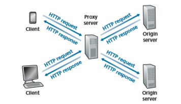
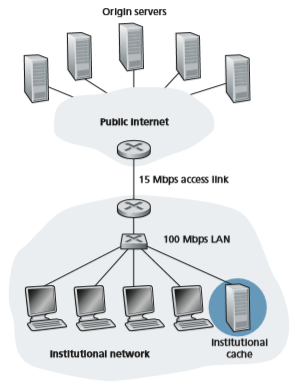

## The Web and HTTP
Until the early 1990s, the Internet was used primarily by researchers, academics, and university students to log in to remote hosts, to transfer files from local hosts to remote hosts and vice versa, to receive and send news, and to receive and send elec- tronic mail. Although these applications were (and continue to be) extremely useful, the Internet was essentially unknown outside of the academic and research commu- nities. Then, in the early 1990s, a major new application arrived on the scene—the World Wide Web [Berners-Lee 1994]. The Web was the first Internet application that caught the general public’s eye. It dramatically changed how people interact inside and outside their work environments. It elevated the Internet from just one of many data networks to essentially the one and only data network.

Perhaps what appeals the most to users is that the Web operates _on demand_. Users receive what they want, when they want it. This is unlike traditional broadcastradio and television, which force users to tune in when the content provider makes the content available. In addition to being available on demand, the Web has many other wonderful features that people love and cherish. It is enormously easy for any individual to make information available over the Web—everyone can become a publisher at extremely low cost. Hyperlinks and search engines help us navigate through an ocean of information. Photos and videos stimulate our senses. Forms, JavaScript, video, and many other devices enable us to interact with pages and sites. And the Web and its protocols serve as a platform for YouTube, Web-based e-mail (such as Gmail), and most mobile Internet applications, including Instagram and Google Maps.

### Overview of HTTP

The **HyperText Transfer Protocol (HTTP)**
,the Web’s application-layer protocol, is at the heart of the Web. It is defined in [RFC 1945], [RFC 7230] and [RFC 7540]. HTTP is implemented in two programs: a client program and a server program. The client program and server program, executing on different end systems, talk to each other by exchanging HTTP messages. HTTP defines the structure of these messages and how the client and server exchange the messages. Before explaining HTTP in detail, we should review some Web terminology.

A **Web page** (also called a document) consists of objects. An **object** is simply a file—such as an HTML file, a JPEG image, a Javascrpt file, a CCS style sheet file, or a video clip—that is addressable by a single URL. Most Web pages consist of a **base HTML file** and several referenced objects. For example, if a Web page contains HTML text and five JPEG images, then the Web page has six objects: the base HTML file plus the five images. The base HTML file refer- ences the other objects in the page with the objects’ URLs. Each URL has two components: the hostname of the server that houses the object and the object’s path name. For example, the URL

http://www.someSchool.edu/someDepartment/picture.gif

has www.someSchool.edu for a hostname and someDepartment picture. gif for a path name. Because **Web browsers** (such as Internet Explorer and Chrome) implement the client side of HTTP, in the context of the Web, we will use the words _browser_ and _client_ interchangeably. **Web servers**, which implement the server side of HTTP, house Web objects, each addressable by a URL. Popular Web servers include Apache and Microsoft Internet Information Server.

HTTP defines how Web clients request Web pages from Web servers and how servers transfer Web pages to clients. We discuss the interaction between client and server in detail later, but the general idea is illustrated in Figure 2.6. When a user requests a Web page (for example, clicks on a hyperlink), the browser sends

**Figure 2.6**  ♦  HTTP request-response behavior

HTTP request messages for the objects in the page to the server. The server receives the requests and responds with HTTP response messages that contain the objects.

HTTP uses TCP as its underlying transport protocol (rather than running on top of UDP). The HTTP client first initiates a TCP connection with the server. Once the connection is established, the browser and the server processes access TCP through their socket interfaces. As described in Section 2.1, on the client side the socket inter- face is the door between the client process and the TCP connection; on the server side it is the door between the server process and the TCP connection. The client sends HTTP request messages into its socket interface and receives HTTP response mes- sages from its socket interface. Similarly, the HTTP server receives request messages from its socket interface and sends response messages into its socket interface. Once the client sends a message into its socket interface, the message is out of the client’s hands and is “in the hands” of TCP. Recall from Section 2.1 that TCP provides a reliable data transfer service to HTTP. This implies that each HTTP request message sent by a client process eventually arrives intact at the server; similarly, each HTTP response message sent by the server process eventually arrives intact at the client. Here we see one of the great advantages of a layered architecture—HTTP need not worry about lost data or the details of how TCP recovers from loss or reordering of data within the network. That is the job of TCP and the protocols in the lower layers of the protocol stack.

It is important to note that the server sends requested files to clients without storing any state information about the client. If a particular client asks for the same object twice in a period of a few seconds, the server does not respond by saying that it just served the object to the client; instead, the server resends the object, as it has completely forgotten what it did earlier. Because an HTTP server maintains

no information about the clients HTTP is said to be a **stateless protocol**. We also remark that the Web uses the client-server application architecture, as described in Section 2.1. A Web server is always on, with a fixed IP address, and it services requests from potentially millions of different browsers.

The original version of HTTP is called HTTP/1.0 and dates back to the early 1990’s [RFC 1945]. As of 2020, the majority of HTTP transactions take place over HTTP/1.1 [RFC 7230]. However, increasingly browsers and Web servers also sup- port a new version of HTTP called HTTP/2 [RFC 7540]. At the end of this Section, we’ll provide an introduction to HTTP/2.

### Non-Persistent and Persistent Connections
In many Internet applications, the client and server communicate for an extended period of time, with the client making a series of requests and the server respond- ing to each of the requests. Depending on the application and on how the application is being used, the series of requests may be made back-to-back, peri- odically at regular intervals, or intermittently. When this client-server interaction is taking place over TCP, the application developer needs to make an important decision—should each request/response pair be sent over a _separate_ TCP connec- tion, or should all of the requests and their corresponding responses be sent over the _same_ TCP connection? In the former approach, the application is said to use **non-persistent connections**; and in the latter approach, **persistent connections
. To gain a deep understanding of this design issue, let’s examine the advantages and dis- advantages of persistent connections in the context of a specific application, namely, HTTP, which can use both non-persistent connections and persistent connections. Although HTTP uses persistent connections in its default mode, HTTP clients and servers can be configured to use non-persistent connections instead.

**HTTP with Non-Persistent Connections**

Let’s walk through the steps of transferring a Web page from server to client for the case of non-persistent connections. Let’s suppose the page consists of a base HTML file and 10 JPEG images, and that all 11 of these objects reside on the same server. Further suppose the URL for the base HTML file is

http://www.someSchool.edu/someDepartment/home.index

Here is what happens:

1\. The HTTP client process initiates a TCP connection to the server www.someSchool.edu on port number 80, which is the default port number for HTTP. Associated with the TCP connection, there will be a socket at the client and a socket at the server.2\. The HTTP client sends an HTTP request message to the server via its socket. The request message includes the path name /someDepartment/home .index. (We will discuss HTTP messages in some detail below.)

3\. The HTTP server process receives the request message via its socket, retrieves the object /someDepartment/home.index from its storage (RAM or disk), encapsulates the object in an HTTP response message, and sends the response message to the client via its socket.

4\. The HTTP server process tells TCP to close the TCP connection. (But TCP doesn’t actually terminate the connection until it knows for sure that the client has received the response message intact.)

5\. The HTTP client receives the response message. The TCP connection termi- nates. The message indicates that the encapsulated object is an HTML file. The client extracts the file from the response message, examines the HTML file, and finds references to the 10 JPEG objects.

6\. The first four steps are then repeated for each of the referenced JPEG objects.

As the browser receives the Web page, it displays the page to the user. Two different browsers may interpret (that is, display to the user) a Web page in some- what different ways. HTTP has nothing to do with how a Web page is interpreted by a client. The HTTP specifications ([RFC 1945] and [RFC 7540]) define only the communication protocol between the client HTTP program and the server HTTP program.

The steps above illustrate the use of non-persistent connections, where each TCP connection is closed after the server sends the object—the connection does not persist for other objects. HTTP/1.0 employes non-persistent TCP connections. Note that each non-persistent TCP connection transports exactly one request message and one response message. Thus, in this example, when a user requests the Web page, 11 TCP connections are generated.

In the steps described above, we were intentionally vague about whether the client obtains the 10 JPEGs over 10 serial TCP connections, or whether some of the JPEGs are obtained over parallel TCP connections. Indeed, users can configure some browsers to control the degree of parallelism. Browsers may open multiple TCP con- nections and request different parts of the Web page over the multiple connections. As we’ll see in the next chapter, the use of parallel connections shortens the response time.

Before continuing, let’s do a back-of-the-envelope calculation to estimate the amount of time that elapses from when a client requests the base HTML file until the entire file is received by the client. To this end, we define the **round-trip time (RTT)**, which is the time it takes for a small packet to travel from client to server and then back to the client. The RTT includes packet-propagation delays, packet- queuing delays in intermediate routers and switches, and packet-processing delays. (These delays were discussed in Section 1.4.) Now consider what happens when a user clicks on a hyperlink. As shown in Figure 2.7, this causes the browser to initiate a TCP connection between the browser and the Web server; this involvesa 

**Figure 2.7**  ♦  Back-of-the-envelope calculation for the time needed 
to request and receive an HTML filE

“three-way handshake”—the client sends a small TCP segment to the server, the server acknowledges and responds with a small TCP segment, and, finally, the cli- ent acknowledges back to the server. The first two parts of the three-way handshake take one RTT. After completing the first two parts of the handshake, the client sends the HTTP request message combined with the third part of the three-way handshake (the acknowledgment) into the TCP connection. Once the request message arrives at the server, the server sends the HTML file into the TCP connection. This HTTP request/response eats up another RTT. Thus, roughly, the total response time is two RTTs plus the transmission time at the server of the HTML file.

**HTTP with Persistent Connections**

Non-persistent connections have some shortcomings. First, a brand-new connection must be established and maintained for _each requested object_. For each of these connections, TCP buffers must be allocated and TCP variables must be kept in both the client and server. This can place a significant burden on the Web server, which may be serving requests from hundreds of different clients simultaneously. Second,
we just described, each object suffers a delivery delay of two RTTs—one RTT to establish the TCP connection and one RTT to request and receive an object.

With HTTP/1.1 persistent connections, the server leaves the TCP connection open after sending a response. Subsequent requests and responses between the same client and server can be sent over the same connection. In particular, an entire Web page (in the example above, the base HTML file and the 10 images) can be sent over a single persistent TCP connection. Moreover, multiple Web pages residing on the same server can be sent from the server to the same client over a single persistent TCP connection. These requests for objects can be made back-to-back, without wait- ing for replies to pending requests (pipelining). Typically, the HTTP server closes a connection when it isn’t used for a certain time (a configurable timeout interval). When the server receives the back-to-back requests, it sends the objects back-to- back. The default mode of HTTP uses persistent connections with pipelining. We’ll quantitatively compare the performance of non-persistent and persistent connections in the homework problems of Chapters 2 and 3. You are also encouraged to see [Heidemann 1997; Nielsen 1997; RFC 7540].

### HTTP Message Format
 The HTTP specifications [RFC 1945; RFC 7230; RFC 7540] include the definitions of the HTTP message formats. There are two types of HTTP messages, request mes- sages and response messages, both of which are discussed below.

**HTTP Request Message**

Below we provide a typical HTTP request message:
```
GET /somedir/page.html HTTP/1.1 
Host: www.someschool.edu 
Connection: close 
User-agent: Mozilla/5.0 
Accept-language: fr
```
We can learn a lot by taking a close look at this simple request message. First of all, we see that the message is written in ordinary ASCII text, so that your ordinary computer-literate human being can read it. Second, we see that the message consists of five lines, each followed by a carriage return and a line feed. The last line is fol- lowed by an additional carriage return and line feed. Although this particular request message has five lines, a request message can have many more lines or as few as one line. The first line of an HTTP request message is called the **request line**; the subsequent lines are called the **header lines**. The request line has three fields: the method field, the URL field, and the HTTP version field. The method field can take on several different values, including GET, POST, HEAD, PUT, and DELETE.The great majority of HTTP request messages use the GET method. The GET method is used when the browser requests an object, with the requested object identified in the URL field. In this example, the browser is requesting the object /somedir/ page.html. The version is self-explanatory; in this example, the browser imple- ments version HTTP/1.1.

Now let’s look at the header lines in the example. The header line Host: www.someschool.edu specifies the host on which the object resides. You might think that this header line is unnecessary, as there is already a TCP connection in place to the host. But, as we’ll see in Section 2.2.5, the information provided by the host header line is required by Web proxy caches. By including the Connection: close header line, the browser is telling the server that it doesn’t want to bother with persistent connections; it wants the server to close the connection after sending the requested object. The User-agent: header line specifies the user agent, that is, the browser type that is making the request to the server. Here the user agent is Mozilla/5.0, a Firefox browser. This header line is useful because the server can actu- ally send different versions of the same object to different types of user agents. (Each of the versions is addressed by the same URL.) Finally, the Accept-language: header indicates that the user prefers to receive a French version of the object, if such an object exists on the server; otherwise, the server should send its default version. The Accept-language: header is just one of many content negotiation headers available in HTTP.

Having looked at an example, let’s now look at the general format of a request message, as shown in Figure 2.8. We see that the general format closely follows our earlier example. You may have noticed, however, that after the header lines (and the additional carriage return and line feed) there is an “entity body.”


**Figure 2.8**  ♦  General format of an HTTP request messageis 

empty with the GET method, but is used with the POST method. An HTTP client often uses the POST method when the user fills out a form—for example, when a user provides search words to a search engine. With a POST message, the user is still requesting a Web page from the server, but the specific contents of the Web page depend on what the user entered into the form fields. If the value of the method field is POST, then the entity body contains what the user entered into the form fields.

We would be remiss if we didn’t mention that a request generated with a form does not necessarily have to use the POST method. Instead, HTML forms often use the GET method and include the inputted data (in the form fields) in the requested URL. For example, if a form uses the GET method, has two fields, and the inputs to the two fields are monkeys and bananas, then the URL will have the structure www.somesite.com/animalsearch?monkeys&bananas. In your day-to- day Web surfing, you have probably noticed extended URLs of this sort.

The HEAD method is similar to the GET method. 
When a server receives a request with the HEAD method, it responds with an HTTP message but it leaves out the requested object. Application developers often use the HEAD method for debug- ging. The PUT method is often used in conjunction with Web publishing tools. It allows a user to upload an object to a specific path (directory) on a specific Web server. The PUT method is also used by applications that need to upload objects to Web servers. The DELETE method allows a user, or an application, to delete an object on a Web server.

**HTTP Response Message**

Below we provide a typical HTTP response message. This response message could be the response to the example request message just discussed.
```
HTTP/1.1 200 OK 
Connection: close 
Date: Tue, 18 Aug 2015 15:44:04 GMT 
Server: Apache/2.2.3 (CentOS) 
Last-Modified: Tue, 18 Aug 2015 15:11:03 GMT Content-Length: 6821 
Content-Type: text/html

(data data data data data...)
```
Let’s take a careful look at this response message. It has three Sections: an initial **status line**, six **header lines**, and then the **entity body**. The entity body is the meat of the message—it contains the requested object itself (represented by data data data data data ...). The status line has three fields: the protocol version field, a status code, and a corresponding status message. In this example, the status line indicates that the server is using HTTP/1.1 and that everything is OK (that is, the server has found, and is sending, the requested object).
Now let’s look at the header lines. The server uses the Connection: close header line to tell the client that it is going to close the TCP connection after sending the message. The Date: header line indicates the time and date when the HTTP response was created and sent by the server. Note that this is not the time when the object was created or last modified; it is the time when the server retrieves the object from its file system, inserts the object into the response message, and sends the response message. The Server: header line indicates that the message was gener- ated by an Apache Web server; it is analogous to the User-agent: header line in the HTTP request message. The Last-Modified: header line indicates the time and date when the object was created or last modified. The Last-Modified: header, which we will soon cover in more detail, is critical for object caching, both in the local client and in network cache servers (also known as proxy servers). The Content-Length: header line indicates the number of bytes in the object being sent. The Content-Type: header line indicates that the object in the entity body is HTML text. (The object type is officially indicated by the Content-Type: header and not by the file extension.)

Having looked at an example, let’s now examine the general format of a response message, which is shown in Figure 2.9. This general format of the response message matches the previous example of a response message. Let’s say a few additional words about status codes and their phrases. The status code and associated phrase indicate the result of the request. Some common status codes and associated phrases include:

• 200 OK: Request succeeded and the information is returned in the response.

• 301 Moved Permanently: Requested object has been permanently moved; the new URL is specified in Location: header of the response message. The client software will automatically retrieve the new URL.


**Figure 2.9**  ♦  General format of an HTTP response message

• 400 Bad Request: This is a generic error code indicating that the request could not be understood by the server.

• 404 Not Found: The requested document does not exist on this server.

• 505 HTTP Version Not Supported: The requested HTTP protocol ver- sion is not supported by the server.

How would you like to see a real HTTP response message? This is highly rec- ommended and very easy to do! First Telnet into your favorite Web server. Then type in a one-line request message for some object that is housed on the server. For example, if you have access to a command prompt, type:
```
telnet gaia.cs.umass.edu 80

GET /kurose\_ross/interactive/index.php HTTP/1.1 Host: gaia.cs.umass.edu
```
(Press the carriage return twice after typing the last line.) This opens a TCP con- nection to port 80 of the host gaia.cs.umass.edu and then sends the HTTP request message. You should see a response message that includes the base HTML file for the interactive homework problems for this textbook. If you’d rather just see the HTTP message lines and not receive the object itself, replace GET with HEAD.

In this Section, we discussed a number of header lines that can be used within HTTP request and response messages. The HTTP specification defines many, many more header lines that can be inserted by browsers, Web servers, and net- work cache servers. We have covered only a small number of the totality of header lines. We’ll cover a few more below and another small number when we discuss network Web caching in Section 2.2.5. A highly readable and comprehensive dis- cussion of the HTTP protocol, including its headers and status codes, is given in [Krishnamurthy 2001].

How does a browser decide which header lines to include in a request message? How does a Web server decide which header lines to include in a response mes- sage? A browser will generate header lines as a function of the browser type and version, the user configuration of the browser and whether the browser currently has a cached, but possibly out-of-date, version of the object. Web servers behave similarly: There are different products, versions, and configurations, all of which influence which header lines are included in response messages.

### User-Server Interaction: Cookies
 We mentioned above that an HTTP server is stateless. This simplifies server design and has permitted engineers to develop high-performance Web servers that can han- dle thousands of simultaneous TCP connections. However, it is often desirable for a Web site to identify users, either because the server wishes to restrict user access or because it wants to serve content as a function of the user identity. For these pur- poses, HTTP uses cookies. Cookies, defined in [RFC 6265], allow sites to keep track of users. Most major commercial Web sites use cookies today.

As shown in Figure 2.10, cookie technology has four components: (1) a cookie header line in the HTTP response message; (2) a cookie header line in the HTTP request message; (3) a cookie file kept on the user’s end system and managed by the user’s browser; and (4) a back-end database at the Web site. Using Figure 2.10, let’s walk through an example of how cookies work. Suppose Susan, who always


**Figure 2.10**  ♦  Keeping user state with cookiesaccesses the Web using Internet Explorer from her home PC, contacts Amazon.com for the first time. Let us suppose that in the past she has already visited the eBay site. When the request comes into the Amazon Web server, the server creates a unique identification number and creates an entry in its back-end database that is indexed by the identification number. The Amazon Web server then responds to Susan’s browser, including in the HTTP response a Set-cookie: header, which contains the identification number. For example, the header line might be:
```
Set-cookie: 1678
```
When Susan’s browser receives the HTTP response message, it sees the Set-cookie: header. The browser then appends a line to the special cookie file that it manages. This line includes the hostname of the server and the identification number in the Set-cookie: header. Note that the cookie file already has an entry for eBay, since Susan has visited that site in the past. As Susan continues to browse the Amazon site, each time she requests a Web page, her browser consults her cookie file, extracts her identification number for this site, and puts a cookie header line that includes the identification number in the HTTP request. Specifically, each of her HTTP requests to the Amazon server includes the header line:
```
Cookie: 1678
```
In this manner, the Amazon server is able to track Susan’s activity at the Amazon site. Although the Amazon Web site does not necessarily know Susan’s name, it knows exactly which pages user 1678 visited, in which order, and at what times! Amazon uses cookies to provide its shopping cart service—Amazon can maintain a list of all of Susan’s intended purchases, so that she can pay for them collectively at the end of the session.

If Susan returns to Amazon’s site, say, one week later, her browser will con- tinue to put the header line Cookie: 1678 in the request messages. Amazon also recommends products to Susan based on Web pages she has visited at Amazon in the past. If Susan also registers herself with Amazon—providing full name, e-mail address, postal address, and credit card information—Amazon can then include this information in its database, thereby associating Susan’s name with her identifica- tion number (and all of the pages she has visited at the site in the past!). This is how Amazon and other e-commerce sites provide “one-click shopping”—when Susan chooses to purchase an item during a subsequent visit, she doesn’t need to re-enter her name, credit card number, or address.

From this discussion, we see that cookies can be used to identify a user. The first time a user visits a site, the user can provide a user identification (possibly his or her name). During the subsequent sessions, the browser passes a cookie header to the server, thereby identifying the user to the server. Cookies can thus be used to create a user session layer on top of stateless HTTP. For example, when a user logs in toa Web-based e-mail application (such as Hotmail), the browser sends cookie infor- mation to the server, permitting the server to identify the user throughout the user’s session with the application.

Although cookies often simplify the Internet shopping experience for the user, they are controversial because they can also be considered as an invasion of privacy. As we just saw, using a combination of cookies and user-supplied account informa- tion, a Web site can learn a lot about a user and potentially sell this information to a third party.

### Web CachingA

**Web cache**—also called a **proxy server**
—is a network entity that satisfies HTTP requests on the behalf of an origin Web server. The Web cache has its own disk storage and keeps copies of recently requested objects in this storage. As shown in Figure 2.11, a user’s browser can be configured so that all of the user’s HTTP requests are first directed to the Web cache [RFC 7234]. Once a browser is configured, each browser request for an object is first directed to the Web cache. As an example, suppose a browser is requesting the object http://www.someschool.edu/ campus.gif. Here is what happens:

1\. The browser establishes a TCP connection to the Web cache and sends an HTTP request for the object to the Web cache.

2\. The Web cache checks to see if it has a copy of the object stored locally. If it does, the Web cache returns the object within an HTTP response message to the client browser.

3\. If the Web cache does not have the object, the Web cache opens a TCP connec- tion to the origin server, that is, to www.someschool.edu. The Web cache


**Figure 2.11**  ♦  Clients requesting objects through a Web cache
then sends an HTTP request for the object into the cache-to-server TCP connec- tion. After receiving this request, the origin server sends the object within an HTTP response to the Web cache.

4\. When the Web cache receives the object, it stores a copy in its local storage and sends a copy, within an HTTP response message, to the client browser (over the existing TCP connection between the client browser and the Web cache).

Note that a cache is both a server and a client at the same time. When it receives requests from and sends responses to a browser, it is a server. When it sends requests to and receives responses from an origin server, it is a client.

Typically a Web cache is purchased and installed by an ISP. For example, a uni- versity might install a cache on its campus network and configure all of the campus browsers to point to the cache. Or a major residential ISP (such as Comcast) might install one or more caches in its network and preconfigure its shipped browsers to point to the installed caches.

Web caching has seen deployment in the Internet for two reasons. First, a Web cache can substantially reduce the response time for a client request, particularly if the bottleneck bandwidth between the client and the origin server is much less than the bottleneck bandwidth between the client and the cache. If there is a high-speed connection between the client and the cache, as there often is, and if the cache has the requested object, then the cache will be able to deliver the object rapidly to the client. Second, as we will soon illustrate with an example, Web caches can sub- stantially reduce traffic on an institution’s access link to the Internet. By reducing traffic, the institution (for example, a company or a university) does not have to upgrade bandwidth as quickly, thereby reducing costs. Furthermore, Web caches can substantially reduce Web traffic in the Internet as a whole, thereby improving performance for all applications.

To gain a deeper understanding of the benefits of caches, let’s consider an exam- ple in the context of Figure 2.12. This figure shows two networks—the institutional network and the rest of the public Internet. The institutional network is a high-speed LAN. A router in the institutional network and a router in the Internet are connected by a 15 Mbps link. The origin servers are attached to the Internet but are located all over the globe. Suppose that the average object size is 1 Mbits and that the average request rate from the institution’s browsers to the origin servers is 15 requests per second. Suppose that the HTTP request messages are negligibly small and thus cre- ate no traffic in the networks or in the access link (from institutional router to Internet router). Also suppose that the amount of time it takes from when the router on the Internet side of the access link in Figure 2.12 forwards an HTTP request (within an IP datagram) until it receives the response (typically within many IP datagrams) is two seconds on average. Informally, we refer to this last delay as the “Internet delay.”

The total response time—that is, the time from the browser’s request of an object until its receipt of the object—is the sum of the LAN delay, the access delay (that is, the delay between the two routers), and the Internet delay. Let’s now do**Public Internet**

**Institutional network**


**Figure 2.12**  ♦  Bottleneck between an institutional network and the Internet

a very crude calculation to estimate this delay. The traffic intensity on the LAN (see Section 1.4.2) is


(15 requests/sec) . (1 Mbits/request)/(100 Mbps) = 0.15

whereas the traffic intensity on the access link (from the Internet router to institution router) is

(15 requests/sec) . (1 Mbits/request)/(15 Mbps) = 1

A traffic intensity of 0.15 on a LAN typically results in, at most, tens of millisec- onds of delay; hence, we can neglect the LAN delay. However, as discussed in Section 1.4.2, as the traffic intensity approaches 1 (as is the case of the access link in Figure 2.12), the delay on a link becomes very large and grows without bound. Thus, the average response time to satisfy requests is going to be on the order of minutes, if not more, which is unacceptable for the institution’s users. Clearly something must be done.

One possible solution is to increase the access rate from 15 Mbps to, say, 100 Mbps. This will lower the traffic intensity on the access link to 0.15, which translates to neg- ligible delays between the two routers. In this case, the total response time will roughly be two seconds, that is, the Internet delay. But this solution also means that the institu- tion must upgrade its access link from 15 Mbps to 100 Mbps, a costly proposition.

Now consider the alternative solution of not upgrading the access link but instead installing a Web cache in the institutional network. This solution is illustrated in Figure 2.13. Hit rates—the fraction of requests that are satisfied by a cache— typically range from 0.2 to 0.7 in practice. For illustrative purposes, let’s suppose that the cache provides a hit rate of 0.4 for this institution. Because the clients and the cache are connected to the same high-speed LAN, 40 percent of the requests will be satisfied almost immediately, say, within 10 milliseconds, by the cache. Neverthe- less, the remaining 60 percent of the requests still need to be satisfied by the origin servers. But with only 60 percent of the requested objects passing through the access link, the traffic intensity on the access link is reduced from 1.0 to 0.6. Typically, a


**Figure 2.13**  ♦  Adding a cache to the institutional network

traffic intensity less than 0.8 corresponds to a small delay, say, tens of milliseconds, on a 15 Mbps link. This delay is negligible compared with the two-second Internet delay. Given these considerations, average delay therefore is

0.4.(0.01 seconds) + 0.6.(2.01 seconds)

which is just slightly greater than 1.2 seconds. Thus, this second solution provides an even lower response time than the first solution, and it doesn’t require the institution to upgrade its link to the Internet. The institution does, of course, have to purchase and install a Web cache. But this cost is low—many caches use public-domain soft- ware that runs on inexpensive PCs.

Through the use of **Content Distribution Networks (CDNs)**, Web caches are increasingly playing an important role in the Internet. A CDN company installs many geographically distributed caches throughout the Internet, thereby localizing much of the traffic. There are shared CDNs (such as Akamai and Limelight) and dedicated CDNs (such as Google and Netflix). We will discuss CDNs in more detail in Section 2.6.

**The Conditional GET**

Although caching can reduce user-perceived response times, it introduces a new problem—the copy of an object residing in the cache may be stale. In other words, the object housed in the Web server may have been modified since the copy was cached at the client. Fortunately, HTTP has a mechanism that allows a cache to verify that its objects are up to date. This mechanism is called the **conditional GET** [RFC 7232]. An HTTP request message is a so-called conditional GET message if (1) the request message uses the GET method and (2) the request message includes an 

```
If-Modified-Since: header line.
```
To illustrate how the conditional GET operates, let’s walk through an example. First, on the behalf of a requesting browser, a proxy cache sends a request message to a Web server:
```
GET /fruit/kiwi.gif HTTP/1.1
Host: www.exotiquecuisine.com
```
Second, the Web server sends a response message with the requested object to the cache:
```
HTTP/1.1 200 OK 
Date: Sat, 3 Oct 2015 15:39:29 
Server: Apache/1.3.0 (Unix) 
Last-Modified: Wed, 9 Sep 2015 09:23:24 
Content-Type: image/gif
(data data data data data ...)
```
The cache forwards the object to the requesting browser but also caches the object locally. Importantly, the cache also stores the last-modified date along with the object. Third, one week later, another browser requests the same object via the cache, and the object is still in the cache. Since this object may have been modified at the Web server in the past week, the cache performs an up-to-date check by issuing a conditional GET. Specifically, the cache sends:
```
GET /fruit/kiwi.gif HTTP/1.1 
Host: www.exotiquecuisine.com 
If-modified-since: Wed, 9 Sep 2015 09:23:24
```
Note that the value of the If-modified-since: header line is exactly equal to the value of the Last-Modified: header line that was sent by the server one week ago. This conditional GET is telling the server to send the object only if the object has been modified since the specified date. Suppose the object has not been modified since 9 Sep 2015 09:23:24. Then, fourth, the Web server sends a response message to the cache:
```
HTTP/1.1 304 Not Modified 
Date: Sat, 10 Oct 2015 15:39:29 
Server: Apache/1.3.0 (Unix)

(empty entity body)
```
We see that in response to the conditional GET, the Web server still sends a response message but does not include the requested object in the response message. Including the requested object would only waste bandwidth and increase user- perceived response time, particularly if the object is large. Note that this last response message has 304 Not Modified in the status line, which tells the cache that it can go ahead and forward its (the proxy cache’s) cached copy of the object to the requesting browser.

### HTTP/2

HTTP/2 [RFC 7540], standardized in 2015, was the first new version of HTTP since HTTP/1.1, which was standardized in 1997. Since standardization, HTTP/2 has taken off, with over 40% of the top 10 million websites supporting HTTP/2 in 2020 [W3Techs]. Most browsers—including Google Chrome, Internet Explorer, Safari, Opera, and Firefox—also support HTTP/2.

The primary goals for HTTP/2 are to reduce perceived latency by enabling request and response multiplexing over a _single_ TCP connection, provide request prioritization and server push, and provide efficient compression of HTTP header fields. HTTP/2 does not change HTTP methods, status codes, URLs, or header fields. Instead, HTTP/2 changes how the data is formatted and transported between the client and server.To motivate the need for HTTP/2, recall that HTTP/1.1 uses persistent TCP connections, allowing a Web page to be sent from server to client over a single TCP connection. By having only one TCP connection per Web page, the number of sockets at the server is reduced and each transported Web page gets a fair share of the network bandwidth (as discussed below). But developers of Web browsers quickly discovered that sending all the objects in a Web page over a single TCP connec- tion has a **Head of Line (HOL) blocking** problem. To understand HOL blocking, consider a Web page that includes an HTML base page, a large video clip near the top of Web page, and many small objects below the video. Further suppose there is a low-to-medium speed bottleneck link (for example, a low-speed wireless link) on the path between server and client. Using a single TCP connection, the video clip will take a long time to pass through the bottleneck link, while the small objects are delayed as they wait behind the video clip; that is, the video clip at the head of the line blocks the small objects behind it. HTTP/1.1 browsers typically work around this problem by opening multiple parallel TCP connections, thereby having objects in the same web page sent in parallel to the browser. This way, the small objects can arrive at and be rendered in the browser much faster, thereby reducing user-perceived delay.

TCP congestion control, discussed in detail in Chapter 3, also provides brows- ers an unintended incentive to use multiple parallel TCP connections rather than a single persistent connection. Very roughly speaking, TCP congestion control aims to give each TCP connection sharing a bottleneck link an equal share of the available bandwidth of that link; so if there are _n_ TCP connections operating over a bottleneck link, then each connection approximately gets _1/n_th of the bandwidth. By opening multiple parallel TCP connections to transport a single Web page, the browser can “cheat” and grab a larger portion of the link bandwidth. Many HTTP/1.1 browsers open up to six parallel TCP connections not only to circumvent HOL blocking but also to obtain more bandwidth.

One of the primary goals of HTTP/2 is to get rid of (or at least reduce the num- ber of) parallel TCP connections for transporting a single Web page. This not only reduces the number of sockets that need to be open and maintained at servers, but also allows TCP congestion control to operate as intended. But with only one TCP connection to transport a Web page, HTTP/2 requires carefully designed mecha- nisms to avoid HOL blocking.

**HTTP/2 Framing**

The HTTP/2 solution for HOL blocking is to break each message into small frames, and interleave the request and response messages on the same TCP connection. To under- stand this, consider again the example of a Web page consisting of one large video clip and, say, 8 smaller objects. Thus the server will receive 9 concurrent requests from any browser wanting to see this Web page. For each of these requests, the server needs to send 9 competing HTTP response messages to the browser. Suppose all frames are offixed length, the video clip consists of 1000 frames, and each of the smaller objects consists of two frames. With frame interleaving, after sending one frame from the video clip, the first frames of each of the small objects are sent. Then after sending the second frame of the video clip, the last frames of each of the small objects are sent. Thus, all of the smaller objects are sent after sending a total of 18 frames. If interleav- ing were not used, the smaller objects would be sent only after sending 1016 frames. Thus the HTTP/2 framing mechanism can significantly decrease user-perceived delay.

The ability to break down an HTTP message into independent frames, inter- leave them, and then reassemble them on the other end is the single most important enhancement of HTTP/2. The framing is done by the framing sub-layer of the HTTP/2 protocol. When a server wants to send an HTTP response, the response is processed by the framing sub-layer, where it is broken down into frames. The header field of the response becomes one frame, and the body of the message is broken down into one for more additional frames. The frames of the response are then interleaved by the framing sub-layer in the server with the frames of other responses and sent over the single persistent TCP connection. As the frames arrive at the client, they are first reassembled into the original response messages at the framing sub-layer and then processed by the browser as usual. Similarly, a client’s HTTP requests are broken into frames and interleaved.

In addition to breaking down each HTTP message into independent frames, the framing sublayer also binary encodes the frames. Binary protocols are more efficient to parse, lead to slightly smaller frames, and are less error-prone.

**Response Message Prioritization and Server Pushing**

Message prioritization allows developers to customize the relative priority of requests to better optimize application performance. As we just learned, the fram- ing sub-layer organizes messages into parallel streams of data destined to the same requestor. When a client sends concurrent requests to a server, it can prioritize the responses it is requesting by assigning a weight between 1 and 256 to each message. The higher number indicates higher priority. Using these weights, the server can send first the frames for the responses with the highest priority. In addition to this, the client also states each message’s dependency on other messages by specifying the ID of the message on which it depends.

Another feature of HTTP/2 is the ability for a server to send multiple responses for a single client request. That is, in addition to the response to the original request, the server can _push_ additional objects to the client, without the client having to request each one. This is possible since the HTML base page indicates the objects that will be needed to fully render the Web page. So instead of waiting for the HTTP requests for these objects, the server can analyze the HTML page, identify the objects that are needed, and send them to the client _before receiving explicit requests for these objects_. Server push eliminates the extra latency due to waiting for the requests.

**HTTP/3**

QUIC, discussed in Chapter 3, is a new “transport” protocol that is implemented in the application layer over the bare-bones UDP protocol. QUIC has several features that are desirable for HTTP, such as message multiplexing (interleaving), per-stream flow control, and low-latency connection establishment. HTTP/3 is yet a new HTTP protocol that is designed to operate over QUIC. As of 2020, HTTP/3 is described in Internet drafts and has not yet been fully standardized. Many of the HTTP/2 fea- tures (such as message interleaving) are subsumed by QUIC, allowing for a simpler, streamlined design for HTTP/3.
