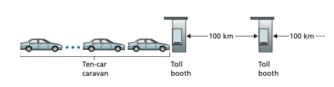

## Delay, Loss, and Throughput in Packet-Switched Networks

Back in Section 1.1 we said that the Internet can be viewed as an infrastructure that provides services to distributed applications running on end systems. Ideally, we would like Internet services to be able to move as much data as we want between any two end systems, instantaneously, without any loss of data. Alas, this is a lofty goal, one that is unachievable in reality. Instead, computer networks necessarily constrain throughput (the amount of data per second that can be transferred) between end sys- tems, introduce delays between end systems, and can actually lose packets. On one hand, it is unfortunate that the physical laws of reality introduce delay and loss as well as constrain throughput. On the other hand, because computer networks have these problems, there are many fascinating issues surrounding how to deal with the problems—more than enough issues to fill a course on computer networking and to motivate thousands of PhD theses! In this section, we’ll begin to examine and quan- tify delay, loss, and throughput in computer networks.

### Overview of Delay in Packet-Switched Networks

Recall that a packet starts in a host (the source), passes through a series of routers, and ends its journey in another host (the destination). As a packet travels from one node (host or router) to the subsequent node (host or router) along this path, the packet suffers from several types of delays at _each_ node along the path. The most important of these delays are the **nodal processing delay**, **queuing delay**, **transmis- sion delay**, and **propagation delay**; together, these delays accumulate to give a **total nodal delay**. The performance of many Internet applications—such as search, Web browsing, e-mail, maps, instant messaging, and voice-over-IP—are greatly affected by network delays. In order to acquire a deep understanding of packet switching and computer networks, we must understand the nature and importance of these delays.

**Types of Delay**

Let’s explore these delays in the context of Figure 1.16. As part of its end-to-end route between source and destination, a packet is sent from the upstream node through router A to router B. Our goal is to characterize the nodal delay at router A. Note that router A has an outbound link leading to router B. This link is preceded by a queue (also known as a buffer). When the packet arrives at router A from the upstream node, router A examines the packet’s header to determine the appropriate outbound link for the packet and then directs the packet to this link. In this exam- ple, the outbound link for the packet is the one that leads to router B. A packet can be transmitted on a link only if there is no other packet currently being transmitted on the link and if there are no other packets preceding it in the queue; if the link is


**Figure 1.16**  ♦  The nodal delay at router A

 currently busy or if there are other packets already queued for the link, the newly arriving packet will then join the queue.

**Processing Delay**

The time required to examine the packet’s header and determine where to direct the packet is part of the **processing delay**. The processing delay can also include other factors, such as the time needed to check for bit-level errors in the packet that occurred in transmitting the packet’s bits from the upstream node to router A. Processing delays in high-speed routers are typically on the order of microseconds or less. After this nodal processing, the router directs the packet to the queue that precedes the link to router B. (In Chapter 4 we’ll study the details of how a router operates.)

**Queuing Delay**

At the queue, the packet experiences a **queuing delay** as it waits to be transmitted onto the link. The length of the queuing delay of a specific packet will depend on the number of earlier-arriving packets that are queued and waiting for transmission onto the link. If the queue is empty and no other packet is currently being transmitted, then our packet’s queuing delay will be zero. On the other hand, if the traffic is heavy and many other packets are also waiting to be transmitted, the queuing delay will be long. We will see shortly that the number of packets that an arriving packet might expect to find is a function of the intensity and nature of the traffic arriving at the queue. Queuing delays can be on the order of microseconds to milliseconds in practice.

**Transmission Delay**

Assuming that packets are transmitted in a first-come-first-served manner, as is com- mon in packet-switched networks, our packet can be transmitted only after all the packets that have arrived before it have been transmitted. Denote the length of the

1.4 • Delay, Loss, and Throughput in Packet-Switched Networks 

packet by _L_ bits, and denote the transmission rate of the link from router A to router B by _R_ bits/sec. For example, for a 10 Mbps Ethernet link, the rate is _R_ = 10 Mbps; for a 100 Mbps Ethernet link, the rate is _R_ = 100 Mbps. The **transmission delay** is _L/R._ This is the amount of time required to push (that is, transmit) all of the packet’s bits into the link. Transmission delays are typically on the order of microseconds to milliseconds in practice.

**Propagation Delay**

Once a bit is pushed into the link, it needs to propagate to router B. The time required to propagate from the beginning of the link to router B is the **propagation delay**. The bit propagates at the propagation speed of the link. The propagation speed depends on the physical medium of the link (that is, fiber optics, twisted-pair copper wire, and so on) and is in the range of
```
       2-10^8 meters/sec to 3-10^8 meters/sec
```
which is equal to, or a little less than, the speed of light. The propagation delay is the distance between two routers divided by the propagation speed. That is, the propaga- tion delay is _d/s,_ where _d_ is the distance between router A and router B and _s_ is the propagation speed of the link. Once the last bit of the packet propagates to node B, it and all the preceding bits of the packet are stored in router B. The whole process then continues with router B now performing the forwarding. In wide-area networks, propagation delays are on the order of milliseconds.

**Comparing Transmission and Propagation Delay**

Newcomers to the field of computer networking sometimes have difficulty under- standing the difference between transmission delay and propagation delay. The dif- ference is subtle but important. The transmission delay is the amount of time required for the router to push out the packet; it is a function of the packet’s length and the transmission rate of the link, but has nothing to do with the distance between the two routers. The propagation delay, on the other hand, is the time it takes a bit to propa- gate from one router to the next; it is a function of the distance between the two rout- ers, but has nothing to do with the packet’s length or the transmission rate of the link.

An analogy might clarify the notions of transmission and propagation delay. Consider a highway that has a tollbooth every 100 kilometers, as shown in Fig- ure 1.17. You can think of the highway segments between tollbooths as links and the tollbooths as routers. Suppose that cars travel (that is, propagate) on the highway at a rate of 100 km/hour (that is, when a car leaves a tollbooth, it instantaneously accelerates to 100 km/hour and maintains that speed between tollbooths). Suppose next that 10 cars, traveling together as a caravan, follow each other in a fixed order. You can think of each car as a bit and the caravan as a packet. Also suppose that each



**Figure 1.17**  ♦  Caravan analogy

tollbooth services (that is, transmits) a car at a rate of one car per 12 seconds, and that it is late at night so that the caravan’s cars are the only cars on the highway. Finally, suppose that whenever the first car of the caravan arrives at a tollbooth, it waits at the entrance until the other nine cars have arrived and lined up behind it. (Thus, the entire caravan must be stored at the tollbooth before it can begin to be forwarded.) The time required for the tollbooth to push the entire caravan onto the highway is (10 cars)/(5 cars/minute) = 2 minutes. This time is analogous to the transmission delay in a router. The time required for a car to travel from the exit of one tollbooth to the next tollbooth is 100 km/(100 km/hour) = 1 hour. This time is analogous to propagation delay. Therefore, the time from when the caravan is stored in front of a tollbooth until the caravan is stored in front of the next tollbooth is the sum of trans- mission delay and propagation delay—in this example, 62 minutes.

Let’s explore this analogy a bit more. What would happen if the tollbooth ser- vice time for a caravan were greater than the time for a car to travel between toll- booths? For example, suppose now that the cars travel at the rate of 1,000 km/hour and the tollbooth services cars at the rate of one car per minute. Then the traveling delay between two tollbooths is 6 minutes and the time to serve a caravan is 10 min- utes. In this case, the first few cars in the caravan will arrive at the second tollbooth before the last cars in the caravan leave the first tollbooth. This situation also arises in packet-switched networks—the first bits in a packet can arrive at a router while many of the remaining bits in the packet are still waiting to be transmitted by the preceding router.

If a picture speaks a thousand words, then an animation must speak a million words. The Web site for this textbook provides an interactive animation that nicely illustrates and contrasts transmission delay and propagation delay. The reader is highly encouraged to visit that animation. [Smith 2009] also provides a very read- able discussion of propagation, queuing, and transmission delays.

If we let _d_proc, _d_queue, _d_trans, and _d_prop denote the processing, queuing, transmis- sion, and propagation delays, then the total nodal delay is given by

dnodal = dproc + dqueue + dtrans + dprop

The contribution of these delay components can vary significantly. For example, _d_prop can be negligible (for example, a couple of microseconds) for a link connecting two routers on the same university campus; however, _d_prop is hundreds of millisec- onds for two routers interconnected by a geostationary satellite link, and can be the

1.4 • Delay, Loss, and Throughput in Packet-Switched Networks 

dominant term in dnodal. Similarly, dtrans can range from negligible to significant. Its 
contribution is typically negligible for transmission rates of 10 Mbps and higher (for 
example, for LANs); however, it can be hundreds of milliseconds for large Internet 
packets sent over low-speed dial-up modem links. The processing delay, dproc, is 
often negligible; however, it strongly influences a router’s maximum throughput, 
which is the maximum rate at which a router can forward packets

### Queuing Delay and Packet Loss

The most complicated and interesting component of nodal delay is the queuing delay, _d_queue. In fact, queuing delay is so important and interesting in computer networking that thousands of papers and numerous books have been written about it [Bertsekas 1991; Kleinrock 1975, Kleinrock 1976]. We give only a high-level, intuitive discus- sion of queuing delay here; the more curious reader may want to browse through some of the books (or even eventually write a PhD thesis on the subject!). Unlike the other three delays (namely, _d_proc, _d_trans, and _d_prop), the queuing delay can vary from packet to packet. For example, if 10 packets arrive at an empty queue at the same time, the first packet transmitted will suffer no queuing delay, while the last packet transmitted will suffer a relatively large queuing delay (while it waits for the other nine packets to be transmitted). Therefore, when characterizing queuing delay, one typically uses statistical measures, such as average queuing delay, variance of queu- ing delay, and the probability that the queuing delay exceeds some specified value.

When is the queuing delay large and when is it insignificant? The answer to this question depends on the rate at which traffic arrives at the queue, the transmission rate of the link, and the nature of the arriving traffic, that is, whether the traffic arrives periodically or arrives in bursts. To gain some insight here, let _a_ denote the average rate at which packets arrive at the queue (_a_ is in units of packets/sec). Recall that _R_ is the transmission rate; that is, it is the rate (in bits/sec) at which bits are pushed out of the queue. Also suppose, for simplicity, that all packets consist of _L_ bits. Then the average rate at which bits arrive at the queue is _La_ bits/sec. Finally, assume that the queue is very big, so that it can hold essentially an infinite number of bits. The ratio _La/R,_ called the **traffic intensity**, often plays an important role in estimating the extent of the queuing delay. If _La/R_ > 1, then the average rate at which bits arrive at the queue exceeds the rate at which the bits can be transmitted from the queue. In this unfortunate situation, the queue will tend to increase without bound and the queuing delay will approach infinity! Therefore, one of the golden rules in traffic engineering is: _Design your system so that the traffic intensity is no greater than 1._

Now consider the case _La/R_ ≤ 1. Here, the nature of the arriving traffic impacts the queuing delay. For example, if packets arrive periodically—that is, one packet arrives every _L/R_ seconds—then every packet will arrive at an empty queue and there will be no queuing delay. On the other hand, if packets arrive in bursts but periodically, there can be a significant average queuing delay. For example, sup- pose _N_ packets arrive simultaneously every _(L/R)N_ seconds. Then the first packet transmitted has no queuing delay; the second packet transmitted has a queuing delayof _L/R_ seconds; and more generally, the _n_th packet transmitted has a queuing delay of (_n_ \- 1)_L/R_ seconds. We leave it as an exercise for you to calculate the average queuing delay in this example.

The two examples of periodic arrivals described above are a bit academic. Typically, the arrival process to a queue is _random;_ that is, the arrivals do not follow any pattern and the packets are spaced apart by random amounts of time. In this more realistic case, the quantity _La/R_ is not usually sufficient to fully characterize the queuing delay statis- tics. Nonetheless, it is useful in gaining an intuitive understanding of the extent of the queuing delay. In particular, if the traffic intensity is close to zero, then packet arrivals are few and far between and it is unlikely that an arriving packet will find another packet in the queue. Hence, the average queuing delay will be close to zero. On the other hand, when the traffic intensity is close to 1, there will be intervals of time when the arrival rate exceeds the transmission capacity (due to variations in packet arrival rate), and a queue will form during these periods of time; when the arrival rate is less than the transmission capacity, the length of the queue will shrink. Nonetheless, as the traffic intensity approaches 1, the average queue length gets larger and larger. The qualitative dependence of average queuing delay on the traffic intensity is shown in Figure 1.18.

One important aspect of Figure 1.18 is the fact that as the traffic intensity approaches 1, the average queuing delay increases rapidly. A small percentage increase in the intensity will result in a much larger percentage-wise increase in delay. Perhaps you have experienced this phenomenon on the highway. If you regu- larly drive on a road that is typically congested, the fact that the road is typically congested means that its traffic intensity is close to 1. If some event causes an even slightly larger-than-usual amount of traffic, the delays you experience can be huge.

To really get a good feel for what queuing delays are about, you are encouraged once again to visit the textbook Web site, which provides an interactive animation for a queue. If you set the packet arrival rate high enough so that the traffic intensity exceeds 1, you will see the queue slowly build up over time.


**Figure 1.18**  ♦  Dependence of average queuing delay on traffic intensity

**Packet Loss**

In our discussions above, we have assumed that the queue is capable of holding an infinite number of packets. In reality a queue preceding a link has finite capacity, although the queuing capacity greatly depends on the router design and cost. Because the queue capacity is finite, packet delays do not really approach infinity as the traf- fic intensity approaches 1. Instead, a packet can arrive to find a full queue. With no place to store such a packet, a router will **drop** that packet; that is, the packet will be **lost**. This overflow at a queue can again be seen in the interactive animation when the traffic intensity is greater than 1.

From an end-system viewpoint, a packet loss will look like a packet having been transmitted into the network core but never emerging from the network at the destination. The fraction of lost packets increases as the traffic intensity increases. Therefore, performance at a node is often measured not only in terms of delay, but also in terms of the probability of packet loss. As we’ll discuss in the subsequent chapters, a lost packet may be retransmitted on an end-to-end basis in order to ensure that all data are eventually transferred from source to destination.

### End-to-End Delay

Our discussion up to this point has focused on the nodal delay, that is, the delay at a single router. Let’s now consider the total delay from source to destination. To get a handle on this concept, suppose there are _N_ \- 1 routers between the source host and the destination host. Let’s also suppose for the moment that the network is uncon- gested (so that queuing delays are negligible), the processing delay at each router and at the source host is _d_proc, the transmission rate out of each router and out of the source host is _R_ bits/sec, and the propagation on each link is _d_prop. The nodal delays accumulate and give an end-to-end delay,
```
      dend-end = N (dproc + dtrans + dprop) 
```
where, once again, _d_trans = _L/R,_ where _L_ is the packet size. Note that Equation 1.2 is a generalization of Equation 1.1, which did not take into account processing and propaga- tion delays. We leave it to you to generalize Equation 1.2 to the case of heterogeneous delays at the nodes and to the presence of an average queuing delay at each node.

**Traceroute**

To get a hands-on feel for end-to-end delay in a computer network, we can make use of the Traceroute program. Traceroute is a simple program that can run in any Inter- net host. When the user specifies a destination hostname, the program in the source host sends multiple, special packets toward that destination. As these packets work their way toward the destination, they pass through a series of routers. When a router receives one of these special packets, it sends back to the source a short message that contains the name and address of the router.

More specifically, suppose there are _N_ \- 1 routers between the source and the destination. Then the source will send _N_ special packets into the network, with each packet addressed to the ultimate destination. These _N_ special packets are marked _1_ through _N,_ with the first packet marked _1_ and the last packet marked _N_. When the _n_th router receives the _n_th packet marked _n,_ the router does not forward the packet toward its destination, but instead sends a message back to the source. When the destination host receives the _N_th packet, it too returns a message back to the source. The source records the time that elapses between when it sends a packet and when it receives the corresponding return message; it also records the name and address of the router (or the destination host) that returns the message. In this manner, the source can reconstruct the route taken by packets flowing from source to destination, and the source can determine the round-trip delays to all the intervening routers. Traceroute actually repeats the experiment just described three times, so the source actually sends _3_ • _N_ packets to the destination. RFC 1393 describes Traceroute in detail.

Here is an example of the output of the Traceroute program, where the route was being traced from the source host gaia.cs.umass.edu (at the University of Massachusetts) to a host in the computer science department at the University of Sorbonne in Paris (formerly the university was known as UPMC). The output has six columns: the first column is the _n_ value described above, that is, the number of the router along the route; the second column is the name of the router; the third column is the address of the router (of the form xxx.xxx.xxx.xxx); the last three columns are the round-trip delays for three experiments. If the source receives fewer than three messages from any given router (due to packet loss in the network), Traceroute places an asterisk just after the router number and reports fewer than three round-trip times for that router.
```
1 gw-vlan-2451.cs.umass.edu (128.119.245.1) 1.899 ms 3.266 ms 3.280 ms 2 j-cs-gw-int-10-240.cs.umass.edu (10.119.240.254) 1.296 ms 1.276 ms

1.245 ms 3 n5-rt-1-1-xe-2-1-0.gw.umass.edu (128.119.3.33) 2.237 ms 2.217 ms

2.187 ms 4 core1-rt-et-5-2-0.gw.umass.edu (128.119.0.9) 0.351 ms 0.392 ms 0.380 ms 5 border1-rt-et-5-0-0.gw.umass.edu (192.80.83.102) 0.345 ms 0.345 ms

0.344 ms 6 nox300gw1-umass-re.nox.org (192.5.89.101) 3.260 ms 0.416 ms 3.127 ms 7 nox300gw1-umass-re.nox.org (192.5.89.101) 3.165 ms 7.326 ms 7.311 ms 8 198.71.45.237 (198.71.45.237) 77.826 ms 77.246 ms 77.744 ms 9 renater-lb1-gw.mx1.par.fr.geant.net (62.40.124.70) 79.357 ms 77.729

79.152 ms 10 193.51.180.109 (193.51.180.109) 78.379 ms 79.936 80.042 ms 11 \* 193.51.180.109 (193.51.180.109) 80.640 ms \* 12 \* 195.221.127.182 (195.221.127.182) 78.408 ms \* 13 195.221.127.182 (195.221.127.182) 80.686 ms 80.796 ms 78.434 ms 14 r-upmc1.reseau.jussieu.fr (134.157.254.10) 78.399 ms \* 81.353 ms 
```
In the trace above, there are 14 routers between the source and the destination. Most of these routers have a name, and all of them have addresses. For example, the name of Router 4 is core1-rt-et-5-2-0.gw.umass.edu and its address is 128.119.0.9. Looking at the data provided for this same router, we see that in the first of the three trials the round-trip delay between the source and the router was 0.351 msec. The round-trip delays for the subsequent two trials were 0.392 and 0.380 msec. These round-trip delays include all of the delays just discussed, including transmission delays, propagation delays, router processing delays, and queuing delay.

Because the queuing delay is varying with time, the round-trip delay of packet _n_ sent to a router _n_ can sometimes be longer than the round-trip delay of packet _n+_1 sent to router _n+_1. Indeed, we observe this phenomenon in the above example: the delay to Router 12 is smaller than the delay to Router 11! Also note the big increase in the round-trip delay when going from router 7 to router 8. This is due to a transatlantic fiber-optic link between routers 7 and 8, giving rise to a relatively large propagation delay. There are a number of free software programs that provide a graphical interface to Traceroute; one of our favorites is PingPlotter [PingPlotter 2020].

**End System, Application, and Other Delays**

In addition to processing, transmission, and propagation delays, there can be addi- tional significant delays in the end systems. For example, an end system wanting to transmit a packet into a shared medium (e.g., as in a WiFi or cable modem sce- nario) may _purposefully_ delay its transmission as part of its protocol for sharing the medium with other end systems; we’ll consider such protocols in detail in Chapter 6. Another important delay is media packetization delay, which is present in Voice- over-IP (VoIP) applications. In VoIP, the sending side must first fill a packet with encoded digitized speech before passing the packet to the Internet. This time to fill a packet—called the packetization delay—can be significant and can impact the user- perceived quality of a VoIP call. This issue will be further explored in a homework problem at the end of this chapter.

### Throughput in Computer Networks

In addition to delay and packet loss, another critical performance measure in com- puter networks is end-to-end throughput. To define throughput, consider transferring a large file from Host A to Host B across a computer network. This transfer might be, for example, a large video clip from one computer to another. The **instantaneous throughput** at any instant of time is the rate (in bits/sec) at which Host B is receiving the file. (Many applications display the instantaneous throughput during downloads in the user interface—perhaps you have observed this before! You might like to try

measuring the end-to-end delay and download throughput between your and servers around the Internet using the speedtest application [Speedtest 2020].) If the file con- sists of _F_ bits and the transfer takes _T_ seconds for Host B to receive all _F_ bits, then the **average throughput** of the file transfer is _F/T_ bits/sec. For some applications, such as Internet telephony, it is desirable to have a low delay and an instantaneous throughput consistently above some threshold (for example, over 24 kbps for some Internet telephony applications and over 256 kbps for some real-time video applica- tions). For other applications, including those involving file transfers, delay is not critical, but it is desirable to have the highest possible throughput.

To gain further insight into the important concept of throughput, let’s consider a few examples. Figure 1.19(a) shows two end systems, a server and a client, con- nected by two communication links and a router. Consider the throughput for a file transfer from the server to the client. Let _Rs_ denote the rate of the link between the server and the router; and _Rc_ denote the rate of the link between the router and the client. Suppose that the only bits being sent in the entire network are those from the server to the client. We now ask, in this ideal scenario, what is the server- to-client throughput? To answer this question, we may think of bits as _fluid_ and com- munication links as _pipes_. Clearly, the server cannot pump bits through its link at a rate faster than _Rs_ bps; and the router cannot forward bits at a rate faster than _Rc_ bps. If _Rs_ 6 _Rc_, then the bits pumped by the server will “flow” right through the router and arrive at the client at a rate of _Rs_ bps, giving a throughput of _Rs_ bps. If, on the other hand, _Rc_ 6 _Rs_, then the router will not be able to forward bits as quickly as it receives them. In this case, bits will only leave the router at rate _Rc_, giving an end- to-end throughput of _Rc_. (Note also that if bits continue to arrive at the router at rate _Rs_, and continue to leave the router at _Rc_, the backlog of bits at the router waiting for transmission to the client will growand grow—a most undesirable situation!)


**Figure 1.19**  ♦ Throughput for a file transfer from server to client

1.4 • Delay, Loss, and Throughput in Packet-Switched Networks 

Thus, for this simple two-link network, the throughput is min{_Rc_, _Rs_}, that is, it is the transmission rate of the **bottleneck link**. Having determined the throughput, we can now approximate the time it takes to transfer a large file of _F_ bits from server to cli- ent as _F_/min{_Rs_, _Rc_}. For a specific example, suppose that you are downloading an MP3 file of _F_ = 32 million bits, the server has a transmission rate of _Rs_ = 2 Mbps, and you have an access link of _Rc_ = 1 Mbps. The time needed to transfer the file is then 32 seconds. Of course, these expressions for throughput and transfer time are only approximations, as they do not account for store-and-forward and processing delays as well as protocol issues.

Figure 1.19(b) now shows a network with _N_ links between the server and the client, with the transmission rates of the _N_ links being _R_1, _R_2, c, _RN_. Applying the same analysis as for the two-link network, we find that the throughput for a file transfer from server to client is min{_R_1, _R_2, c, _RN_}, which is once again the trans- mission rate of the bottleneck link along the path between server and client.

Now consider another example motivated by today’s Internet. Figure 1.20(a) shows two end systems, a server and a client, connected to a computer network. Consider the throughput for a file transfer from the server to the client. The server is connected to the network with an access link of rate _Rs_ and the client is connected to the network with an access link of rate _Rc_. Now suppose that all the links in the core of the communication network have very high transmission rates, much higher than _Rs_ and _Rc_. Indeed, today, the core of the Internet is over-provisioned with high speed links that experience little congestion. Also suppose that the only bits being sent in the entire network are those from the server to the client. Because the core of the computer network is like a wide pipe in this example, the rate at which bits can flow from source to destination is again the minimum of _Rs_ and _Rc_, that is, throughput = min{_Rs_, _Rc_}. Therefore, the constraining factor for throughput in today’s Internet is typically the access network.

For a final example, consider Figure 1.20(b) in which there are 10 servers and 10 clients connected to the core of the computer network. In this example, there are 10 simultaneous downloads taking place, involving 10 client-server pairs. Suppose that these 10 downloads are the only traffic in the network at the current time. As shown in the figure, there is a link in the core that is traversed by all 10 downloads. Denote _R_ for the transmission rate of this link _R_. Let’s suppose that all server access links have the same rate _Rs_, all client access links have the same rate _Rc_, and the transmission rates of all the links in the core—except the one common link of rate _R—_are much larger than _Rs_, _Rc_, and _R_. Now we ask, what are the throughputs of the downloads? Clearly, if the rate of the common link, _R_, is large—say a hundred times larger than both _Rs_ and _Rc_—then the throughput for each download will once again be min{_Rs_, _Rc_}. But what if the rate of the common link is of the same order as _Rs_ and _Rc_? What will the throughput be in this case? Let’s take a look at a spe- cific example. Suppose _Rs_ = 2 Mbps, _Rc_ = 1 Mbps, _R_ = 5 Mbps, and the com- mon link divides its transmission rate equally among the 10 downloads. Then the


**Figure 1.20**  ♦  End-to-end throughput: (a) Client downloads a file from server; (b) 10 clients downloading with 10 servers

bottleneck for each download is no longer in the access network, but is now instead the shared link in the core, which only provides each download with 500 kbps of throughput. Thus, the end-to-end throughput for each download is now reduced to 500 kbps.

The examples in Figure 1.19 and Figure 1.20(a) show that throughput depends on the transmission rates of the links over which the data flows. We saw that when there is no other intervening traffic, the throughput can simply be approximated as the minimum transmission rate along the path between source and destination. The example in Figure 1.20(b) shows that more generally the throughput depends not only on the transmission rates of the links along the path, but also on the interven- ing traffic. In particular, a link with a high transmission rate may nonetheless be the bottleneck link for a file transfer if many other data flows are also passing through that link. We will examine throughput in computer networks more closely in the homework problems and in the subsequent chapters.

