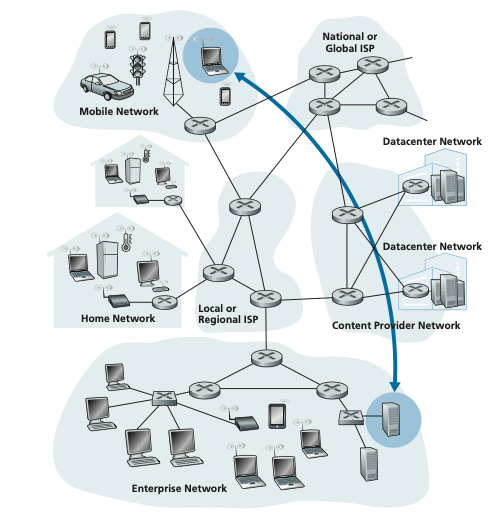
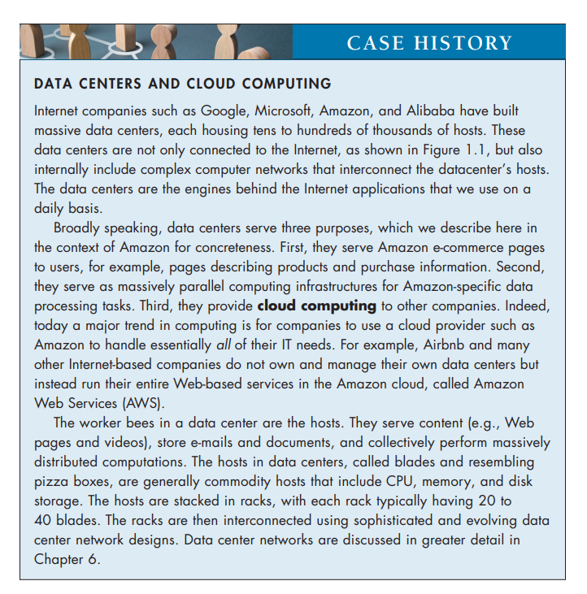
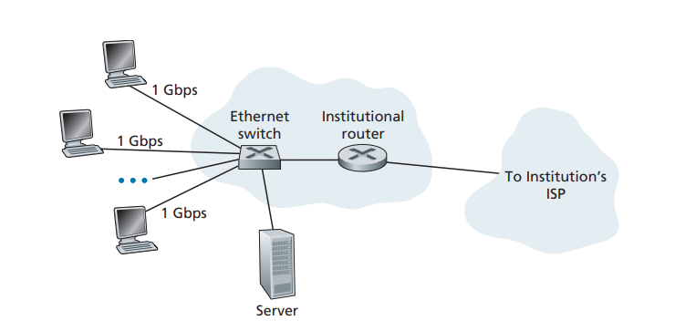

## The Network Edge
In the previous section, we presented a high-level overview of the Internet and networking protocols. We are now going to delve a bit more deeply into the com- ponents of the Internet. We begin in this section at the edge of the network and look at the components with which we are most familiar—namely, the computers, smartphones and other devices that we use on a daily basis. In the next section, we’ll move from the network edge to the network core and examine switching and routing in computer networks.

Recall from the previous section that in computer networking jargon, the com- puters and other devices connected to the Internet are often referred to as end sys- tems. They are referred to as end systems because they sit at the edge of the Internet, as shown in Figure 1.3. The Internet’s end systems include desktop computers

**Figure 1.3**  ♦  End-system interaction

(e.g., desktop PCs, Macs, and Linux boxes), servers (e.g., Web and e-mail servers), and mobile devices (e.g., laptops, smartphones, and tablets). Furthermore, an increasing number of non-traditional “things” are being attached to the Internet as end systems (see the Case History feature).

End systems are also referred to as _hosts_ because they host (that is, run) appli- cation programs such as a Web browser program, a Web server program, an e-mail

client program, or an e-mail server program. Throughout this book we will use the terms hosts and end systems interchangeably; that is, _host = end system_. Hosts are sometimes further divided into two categories: **clients** and **servers**. Infor- mally, clients tend to be desktops, laptops, smartphones, and so on, whereas servers tend to be more powerful machines that store and distribute Web pages, stream video, relay e-mail, and so on. Today, most of the servers from which we receive search results, e-mail, Web pages, videos and mobile app content reside in large **data centers**. For example, as of 2020, Google has 19 data centers on four continents, collectively containing several million servers. Figure 1.3 includes two such data centers, and the Case History sidebar describes data centers in more detail.

### Access Networks

Having considered the applications and end systems at the “edge of the network,” let’s next consider the access network—the network that physically connects an end system to the first router (also known as the “edge router”) on a path from the end system to any other distant end system. Figure 1.4 shows several types of access

**Figure 1.4**  ♦  Access networks

networks with thick, shaded lines and the settings (home, enterprise, and wide-area mobile wireless) in which they are used.

**Home Access: DSL, Cable, FTTH, and 5G Fixed Wireless**

As of 2020, more than 80% of the households in Europe and the USA have Internet access [Statista 2019]. Given this widespread use of home access networks let’s begin our overview of access networks by considering how homes connect to the Internet.

Today, the two most prevalent types of broadband residential access are **digital subscriber line (DSL)** and cable. A residence typically obtains DSL Internet access from the same local telephone company (telco) that provides its wired local phone access. Thus, when DSL is used, a customer’s telco is also its ISP. As shown in Figure 1.5, each customer’s DSL modem uses the existing telephone line exchange data with a digital subscriber line access multiplexer (DSLAM) located in the telco’s local central office (CO). The home’s DSL modem takes digital data and translates it to high- frequency tones for transmis- sion over telephone wires to the CO; the analog signals from many such houses are translated back into digital format at the DSLAM.

The residential telephone line carries both data and traditional telephone signals simultaneously, which are encoded at different frequencies:

• A high-speed downstream channel, in the 50 kHz to 1 MHz band

• A medium-speed upstream channel, in the 4 kHz to 50 kHz band

• An ordinary two-way telephone channel, in the 0 to 4 kHz band

This approach makes the single DSL link appear as if there were three separate links, so that a telephone call and an Internet connection can share the DSL link at

**Figure 1.5**  ♦  DSL Internet access

the same time. (We’ll describe this technique of frequency-division multiplexing in Section 1.3.1.) On the customer side, a splitter separates the data and telephone signals arriving to the home and forwards the data signal to the DSL modem. On the telco side, in the CO, the DSLAM separates the data and phone signals and sends the data into the Internet. Hundreds or even thousands of households connect to a single DSLAM.

The DSL standards define multiple transmission rates, including downstream transmission rates of 24 Mbs and 52 Mbs, and upstream rates of 3.5 Mbps and 16 Mbps; the newest standard provides for aggregate upstream plus downstream rates of 1 Gbps [ITU 2014]. Because the downstream and upstream rates are dif- ferent, the access is said to be asymmetric. The actual downstream and upstream transmission rates achieved may be less than the rates noted above, as the DSL provider may purposefully limit a residential rate when tiered service (different rates, available at different prices) are offered. The maximum rate is also limited by the distance between the home and the CO, the gauge of the twisted-pair line and the degree of electrical interference. Engineers have expressly designed DSL for short distances between the home and the CO; generally, if the residence is not located within 5 to 10 miles of the CO, the residence must resort to an alternative form of Internet access.

While DSL makes use of the telco’s existing local telephone infrastructure, **cable Internet access** makes use of the cable television company’s existing cable television infrastructure. A residence obtains cable Internet access from the same company that provides its cable television. As illustrated in Figure 1.6, fiber optics

**Figure 1.6**  ♦  A hybrid fiber-coaxial access network

connect the cable head end to neighborhood-level junctions, from which tradi- tional coaxial cable is then used to reach individual houses and apartments. Each neighborhood junction typically supports 500 to 5,000 homes. Because both fiber and coaxial cable are employed in this system, it is often referred to as hybrid fiber coax (HFC).

Cable internet access requires special modems, called cable modems. As with a DSL modem, the cable modem is typically an external device and con- nects to the home PC through an Ethernet port. (We will discuss Ethernet in great detail in Chapter 6.) At the cable head end, the cable modem termination system (CMTS) serves a similar function as the DSL network’s DSLAM— turning the analog signal sent from the cable modems in many downstream homes back into digital format. Cable modems divide the HFC network into two channels, a downstream and an upstream channel. As with DSL, access is typi- cally asymmetric, with the downstream channel typically allocated a higher transmission rate than the upstream channel. The DOCSIS 2.0 and 3.0 standards define downstream bitrates of 40 Mbps and 1.2 Gbps, and upstream rates of 30 Mbps and 100 Mbps, respectively. As in the case of DSL networks, the maximum achievable rate may not be realized due to lower contracted data rates or media impairments.

One important characteristic of cable Internet access is that it is a shared broad- cast medium. In particular, every packet sent by the head end travels downstream on every link to every home and every packet sent by a home travels on the upstream channel to the head end. For this reason, if several users are simultaneously down- loading a video file on the downstream channel, the actual rate at which each user receives its video file will be significantly lower than the aggregate cable down- stream rate. On the other hand, if there are only a few active users and they are all Web surfing, then each of the users may actually receive Web pages at the full cable downstream rate, because the users will rarely request a Web page at exactly the same time. Because the upstream channel is also shared, a distributed multiple access protocol is needed to coordinate transmissions and avoid collisions. (We’ll discuss this collision issue in some detail in Chapter 6.)

Although DSL and cable networks currently represent the majority of residential broadband access in the United States, an up-and-coming technology that provides even higher speeds is **fiber to the home (FTTH)** [Fiber Broadband 2020]. As the name suggests, the FTTH concept is simple—provide an optical fiber path from the CO directly to the home. FTTH can potentially provide Internet access rates in the gigabits per second range.

There are several competing technologies for optical distribution from the CO to the homes. The simplest optical distribution network is called direct fiber, with one fiber leaving the CO for each home. More commonly, each fiber leaving the central office is actually shared by many homes; it is not until the fiber gets rela- tively close to the homes that it is split into individual customer-specific fibers. There are two competing optical-distribution network architectures that perform 

Figure 1.7 ♦ FTTH Internet access

this splitting: active optical networks (AONs) and passive optical networks (PONs). AON is essentially switched Ethernet, which is discussed in Chapter 6.

Here, we briefly discuss PON, which is used in Verizon’s FiOS service. Figure 1.7 shows FTTH using the PON distribution architecture. Each home has an optical network terminator (ONT), which is connected by dedicated optical fiber to a neighborhood splitter. The splitter combines a number of homes (typi- cally less than 100) onto a single, shared optical fiber, which connects to an optical line terminator (OLT) in the telco’s CO. The OLT, providing conversion between optical and electrical signals, connects to the Internet via a telco router. At home, users connect a home router (typically a wireless router) to the ONT and access the Internet via this home router. In the PON architecture, all packets sent from OLT to the splitter are replicated at the splitter (similar to a cable head end).

In addition to DSL, Cable, and FTTH, **5G fixed wireless** is beginning to be deployed. 5G fixed wireless not only promises high-speed residential access, but will do so without installing costly and failure-prone cabling from the telco’s CO to the home. With 5G fixed wireless, using beam-forming technology, data is sent wirelessly from a provider’s base station to the a modem in the home. A WiFi wireless router is connected to the modem (possibly bundled together), similar to how a WiFi wireless router is connected to a cable or DSL modem. 5G cellular networks are covered in Chapter 7.

**Access in the Enterprise (and the Home): Ethernet and WiFi**

On corporate and university campuses, and increasingly in home settings, a local area network (LAN) is used to connect an end system to the edge router. Although there are many types of LAN technologies, Ethernet is by far the most preva- lent access technology in corporate, university, and home networks. As shown in

**Figure 1.8** ♦ Ethernet Internet acces

Figure 1.8, Ethernet users use twisted-pair copper wire to connect to an Ethernet switch, a technology discussed in detail in Chapter 6. The Ethernet switch, or a network of such interconnected switches, is then in turn connected into the larger Internet. With Ethernet access, users typically have 100 Mbps to tens of Gbps access to the Ethernet switch, whereas servers may have 1 Gbps 10 Gbps access.

Increasingly, however, people are accessing the Internet wirelessly from lap- tops, smartphones, tablets, and other “things”. In a wireless LAN setting, wireless users transmit/receive packets to/from an access point that is connected into the enterprise’s network (most likely using wired Ethernet), which in turn is connected to the wired Internet. A wireless LAN user must typically be within a few tens of meters of the access point. Wireless LAN access based on IEEE 802.11 technol- ogy, more colloquially known as WiFi, is now just about everywhere—universities, business offices, cafes, airports, homes, and even in airplanes. As discussed in detail in Chapter 7, 802.11 today provides a shared transmission rate of up to more than 100 Mbps.

Even though Ethernet and WiFi access networks were initially deployed in enterprise (corporate, university) settings, they are also common components of home networks. Many homes combine broadband residential access (that is, cable modems or DSL) with these inexpensive wireless LAN technologies to create pow- erful home networks Figure 1.9 shows a typical home network. This home network consists of a roaming laptop, multiple Internet-connected home appliances, as well as a wired PC; a base station (the wireless access point), which communicates with the wireless PC and other wireless devices in the home; and a home router that con- nects the wireless access point, and any other wired home devices, to the Internet. This network allows household members to have broadband access to the Internet with one member roaming from the kitchen to the backyard to the bedrooms.

**Figure 1.9** ♦ A typical home network

**Wide-Area Wireless Access: 3G and LTE 4G and 5G**

Mobile devices such as iPhones and Android devices are being used to message, share photos in social networks, make mobile payments, watch movies, stream music, and much more while on the run. These devices employ the same wireless infrastructure used for cellular telephony to send/receive packets through a base station that is oper- ated by the cellular network provider. Unlike WiFi, a user need only be within a few tens of kilometers (as opposed to a few tens of meters) of the base station.

Telecommunications companies have made enormous investments in so-called fourth-generation (4G) wireless, which provides real-world download speeds of up to 60 Mbps. But even higher-speed wide-area access technologies—a fifth-generation (5G) of wide-area wireless networks—are already being deployed. We’ll cover the basic principles of wireless networks and mobility, as well as WiFi, 4G and 5G tech- nologies (and more!) in Chapter 7.

### Physical Media

In the previous subsection, we gave an overview of some of the most important network access technologies in the Internet. As we described these technologies, we also indicated the physical media used. For example, we said that HFC uses a combination of fiber cable and coaxial cable. We said that DSL and Ethernet use copper wire. And we said that mobile access networks use the radio spectrum. In this subsection, we provide a brief overview of these and other transmission media that are commonly used in the Internet.

In order to define what is meant by a physical medium, let us reflect on the brief life of a bit. Consider a bit traveling from one end system, through a series of links and routers, to another end system. This poor bit gets kicked around and transmitted many, many times! The source end system first transmits the bit, and shortly thereafter the first router in the series receives the bit; the first router then transmits the bit, and shortly thereafter the second router receives the bit; and so on. Thus our bit, when traveling from source to destination, passes through a series of transmitter-receiver pairs. For each transmitter-receiver pair, the bit is sent by propagating electromagnetic waves or optical pulses across a **physical medium**. The physical medium can take many shapes and forms and does not have to be of the same type for each transmitter-receiver pair along the path. Examples of physical media include twisted-pair copper wire, coaxial cable, multimode fiber-optic cable, terrestrial radio spectrum, and satellite radio spectrum. Physical media fall into two categories: **guided media** and **unguided media**. With guided media, the waves are guided along a solid medium, such as a fiber-optic cable, a twisted-pair copper wire, or a coaxial cable. With unguided media, the waves propagate in the atmosphere and in outer space, such as in a wireless LAN or a digital satellite channel.

But before we get into the characteristics of the various media types, let us say a few words about their costs. The actual cost of the physical link (copper wire, fiber- optic cable, and so on) is often relatively minor compared with other networking costs. In particular, the labor cost associated with the installation of the physical link can be orders of magnitude higher than the cost of the material. For this reason, many builders install twisted pair, optical fiber, and coaxial cable in every room in a build- ing. Even if only one medium is initially used, there is a good chance that another medium could be used in the near future, and so money is saved by not having to lay additional wires in the future.

**Twisted-Pair Copper Wire**

The least expensive and most commonly used guided transmission medium is twisted-pair copper wire. For over a hundred years it has been used by telephone networks. In fact, more than 99 percent of the wired connections from the telephone handset to the local telephone switch use twisted-pair copper wire. Most of us have seen twisted pair in our homes (or those of our parents or grandparents!) and work environments. Twisted pair consists of two insulated copper wires, each about 1 mm thick, arranged in a regular spiral pattern. The wires are twisted together to reduce the electrical interference from similar pairs close by. Typically, a number of pairs are bundled together in a cable by wrapping the pairs in a protective shield. A wire pair constitutes a single communication link. **Unshielded twisted pair (UTP)** is com- monly used for computer networks within a building, that is, for LANs. Data rates for LANs using twisted pair today range from 10 Mbps to 10 Gbps. The data rates that can be achieved depend on the thickness of the wire and the distance between transmitter and receiver.

When fiber-optic technology emerged in the 1980s, many people dispar- aged twisted pair because of its relatively low bit rates. Some people even feltthat fiber-optic technology would completely replace twisted pair. But twisted pair did not give up so easily. Modern twisted-pair technology, such as category 6a cable, can achieve data rates of 10 Gbps for distances up to a hundred meters. In the end, twisted pair has emerged as the dominant solution for high-speed LAN networking.

As discussed earlier, twisted pair is also commonly used for residential Inter- net access. We saw that dial-up modem technology enables access at rates of up to 56 kbps over twisted pair. We also saw that DSL (digital subscriber line) technology has enabled residential users to access the Internet at tens of Mbps over twisted pair (when users live close to the ISP’s central office).

**Coaxial Cable**

Like twisted pair, coaxial cable consists of two copper conductors, but the two con- ductors are concentric rather than parallel. With this construction and special insula- tion and shielding, coaxial cable can achieve high data transmission rates. Coaxial cable is quite common in cable television systems. As we saw earlier, cable televi- sion systems have recently been coupled with cable modems to provide residential users with Internet access at rates of hundreds of Mbps. In cable television and cable Internet access, the transmitter shifts the digital signal to a specific frequency band, and the resulting analog signal is sent from the transmitter to one or more receivers. Coaxial cable can be used as a guided **shared medium**. Specifically, a number of end systems can be connected directly to the cable, with each of the end systems receiving whatever is sent by the other end systems.

**Fiber Optics**

An optical fiber is a thin, flexible medium that conducts pulses of light, with each pulse representing a bit. A single optical fiber can support tremendous bit rates, up to tens or even hundreds of gigabits per second. They are immune to electromagnetic interference, have very low signal attenuation up to 100 kilometers, and are very hard to tap. These characteristics have made fiber optics the preferred long-haul guided transmission media, particularly for overseas links. Many of the long-distance tele- phone networks in the United States and elsewhere now use fiber optics exclusively. Fiber optics is also prevalent in the backbone of the Internet. However, the high cost of optical devices—such as transmitters, receivers, and switches—has hindered their deployment for short-haul transport, such as in a LAN or into the home in a resi- dential access network. The Optical Carrier (OC) standard link speeds range from 51.8 Mbps to 39.8 Gbps; these specifications are often referred to as OC-_n_, where the link speed equals _n_ × 51.8 Mbps. Standards in use today include OC-1, OC-3, OC-12, OC-24, OC-48, OC-96, OC-192, OC-768.

**Terrestrial Radio Channels**

Radio channels carry signals in the electromagnetic spectrum. They are an attrac- tive medium because they require no physical wire to be installed, can penetrate walls, provide connectivity to a mobile user, and can potentially carry a signal for long distances. The characteristics of a radio channel depend significantly on the propagation environment and the distance over which a signal is to be carried. Environmental considerations determine path loss and shadow fad- ing (which decrease the signal strength as the signal travels over a distance and around/through obstructing objects), multipath fading (due to signal reflection off of interfering objects), and interference (due to other transmissions and electro- magnetic signals).

Terrestrial radio channels can be broadly classified into three groups: those that operate over very short distance (e.g., with one or two meters); those that operate in local areas, typically spanning from ten to a few hundred meters; and those that oper- ate in the wide area, spanning tens of kilometers. Personal devices such as wireless headsets, keyboards, and medical devices operate over short distances; the wireless LAN technologies described in Section 1.2.1 use local-area radio channels; the cel- lular access technologies use wide-area radio channels. We’ll discuss radio channels in detail in Chapter 7.

**Satellite Radio Channels**

A communication satellite links two or more Earth-based microwave transmitter/ receivers, known as ground stations. The satellite receives transmissions on one frequency band, regenerates the signal using a repeater (discussed below), and transmits the signal on another frequency. Two types of satellites are used in communications: **geostationary satellites** and **low-earth orbiting (LEO) satellites**.

Geostationary satellites permanently remain above the same spot on Earth. This stationary presence is achieved by placing the satellite in orbit at 36,000 kilo- meters above Earth’s surface. This huge distance from ground station through satellite back to ground station introduces a substantial signal propagation delay of 280 milliseconds. Nevertheless, satellite links, which can operate at speeds of hundreds of Mbps, are often used in areas without access to DSL or cable-based Internet access.

LEO satellites are placed much closer to Earth and do not remain permanently above one spot on Earth. They rotate around Earth (just as the Moon does) and may communicate with each other, as well as with ground stations. To provide continuous coverage to an area, many satellites need to be placed in orbit. There are currently many low-altitude communication systems in development. LEO satellite technology may be used for Internet access sometime in the future.
