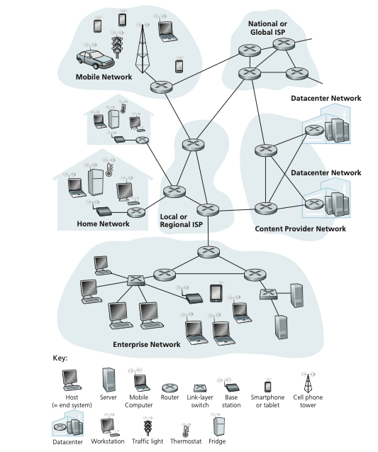

## What Is the Internet?
In this book, we’ll use the public Internet, a specific computer network, as our prin- cipal vehicle for discussing computer networks and their protocols. But what _is_ the Internet? There are a couple of ways to answer this question. First, we can describe the nuts and bolts of the Internet, that is, the basic hardware and software components that make up the Internet. Second, we can describe the Internet in terms of a network- ing infrastructure that provides services to distributed applications. Let’s begin with the nuts-and-bolts description, using 

Figure 1.1 to illustrate our discussion.

### A Nuts-and-Bolts Description

The Internet is a computer network that interconnects billions of computing devices throughout the world. Not too long ago, these computing devices were primarily traditional desktop computers, Linux workstations, and so-called servers that store and transmit information such as Web pages and e-mail messages. Increasingly, however, users connect to the Internet with smartphones and tablets—today, close to half of the world’s population are active mobile Internet users with the percentage expected to increase to 75% by 2025 [Statista 2019]. Furthermore, nontraditional Internet “things” such as TVs, gaming consoles, thermostats, home security systems, home appliances, watches, eye glasses, cars, traffic control systems, and more are being connected to the Internet. Indeed, the term _computer network_ is beginning to sound a bit dated, given the many nontraditional devices that are being hooked up to the Internet. In Internet jargon, all of these devices are called **hosts** or **end systems**. By some estimates, there were about 18 billion devices connected to the Internet in 2017, and the number will reach 28.5 billion by 2022 [Cisco VNI 2020].

**Figure 1.1** ♦ Some pieces of the Internet

End systems are connected together by a network of **communication links** and **packet switches**. We’ll see in Section 1.2 that there are many types of communica- tion links, which are made up of different types of physical media, including coaxial cable, copper wire, optical fiber, and radio spectrum. Different links can transmit data at different rates, with the **transmission rate** of a link measured in bits/second. When one end system has data to send to another end system, the sending end system segments the data and adds header bytes to each segment. The resulting packages of information, known as **packets** in the jargon of computer networks, are then sent through the network to the destination end system, where they are reassembled into the original data.

A packet switch takes a packet arriving on one of its incoming communication links and forwards that packet on one of its outgoing communication links. Packet switches come in many shapes and flavors, but the two most prominent types in today’s Internet are **routers** and **link-layer switches**. Both types of switches forward packets toward their ultimate destinations. Link-layer switches are typically used in access networks, while routers are typically used in the network core. The sequence of communication links and packet switches traversed by a packet from the send- ing end system to the receiving end system is known as a **route** or **path** through the network. Cisco predicts annual global IP traffic will reach nearly five zettabytes (1021 bytes) by 2022 [Cisco VNI 2020].

Packet-switched networks (which transport packets) are in many ways similar to transportation networks of highways, roads, and intersections (which transport vehicles). Consider, for example, a factory that needs to move a large amount of cargo to some destination warehouse located thousands of kilometers away. At the factory, the cargo is segmented and loaded into a fleet of trucks. Each of the trucks then independently travels through the network of highways, roads, and intersections to the destination warehouse. At the destination ware- house, the cargo is unloaded and grouped with the rest of the cargo arriving from the same shipment. Thus, in many ways, packets are analogous to trucks, communication links are analogous to highways and roads, packet switches are analogous to intersections, and end systems are analogous to buildings. Just as a truck takes a path through the transportation network, a packet takes a path through a computer network.

End systems access the Internet through **Internet Service Providers (ISPs)**, including residential ISPs such as local cable or telephone companies; corpo- rate ISPs; university ISPs; ISPs that provide WiFi access in airports, hotels, cof- fee shops, and other public places; and cellular data ISPs, providing mobile access to our smartphones and other devices. Each ISP is in itself a network of packet switches and communication links. ISPs provide a variety of types of network access to the end systems, including residential broadband access such as cable modem or DSL, high-speed local area network access, and mobile wireless access. ISPs also provide Internet access to content providers, connecting servers directly to the Internet. The Internet is all about connecting end systems to each other, so theISPs that provide access to end systems must also be interconnected. These lower- tier ISPs are thus interconnected through national and international upper-tier ISPs and these upper-tier ISPs are connected directly to each other. An upper-tier ISP consists of high-speed routers interconnected with high-speed fiber-optic links. Each ISP network, whether upper-tier or lower-tier, is managed independently, runs the IP protocol (see below), and conforms to certain naming and address conventions. We’ll examine ISPs and their interconnection more closely in Section 1.3.

End systems, packet switches, and other pieces of the Internet run **protocols** that control the sending and receiving of information within the Internet. The **Transmission Control Protocol (TCP)** and the **Internet Protocol (IP)** are two of the most impor- tant protocols in the Internet. The IP protocol specifies the format of the packets that are sent and received among routers and end systems. The Internet’s principal protocols are collectively known as **TCP/IP**. We’ll begin looking into protocols in this introductory chapter. But that’s just a start—much of this book is concerned with networking protocols!

Given the importance of protocols to the Internet, it’s important that everyone agree on what each and every protocol does, so that people can create systems and products that interoperate. This is where standards come into play. **Internet standards** are developed by the Internet Engineering Task Force (IETF) [IETF 2020]. The IETF standards documents are called **requests for comments (RFCs)**. RFCs started out as general requests for comments (hence the name) to resolve network and protocol design problems that faced the precursor to the Internet [Allman 2011]. RFCs tend to be quite technical and detailed. They define protocols such as TCP, IP, HTTP (for the Web), and SMTP (for e-mail). There are currently nearly 9000 RFCs. Other bod- ies also specify standards for network components, most notably for network links. The IEEE 802 LAN Standards Committee [IEEE 802 2020], for example, specifies the Ethernet and wireless WiFi standards.

### A Services Description

Our discussion above has identified many of the pieces that make up the Internet. But we can also describe the Internet from an entirely different angle—namely, as _an infrastructure that provides services to applications_. In addition to traditional applications such as e-mail and Web surfing, Internet applications include mobile smartphone and tablet applications, including Internet messaging, mapping with real-time road-traffic information, music streaming movie and television streaming, online social media, video conferencing, multi-person games, and location-based recommendation systems. The applications are said to be **distributed applications**, since they involve multiple end systems that exchange data with each other. Impor- tantly, Internet applications run on end systems—they do not run in the packet switches in the network core. Although packet switches facilitate the exchange of data among end systems, they are not concerned with the application that is the source or sink of data. 
Let’s explore a little more what we mean by an infrastructure that provides services to applications. To this end, suppose you have an exciting new idea for a dis- tributed Internet application, one that may greatly benefit humanity or one that may simply make you rich and famous. How might you go about transforming this idea into an actual Internet application? Because applications run on end systems, you are going to need to write programs that run on the end systems. You might, for example, write your programs in Java, C, or Python. Now, because you are developing a dis- tributed Internet application, the programs running on the different end systems will need to send data to each other. And here we get to a central issue—one that leads to the alternative way of describing the Internet as a platform for applications. How does one program running on one end system instruct the Internet to deliver data to another program running on another end system?

End systems attached to the Internet provide a **socket interface** that speci- fies how a program running on one end system asks the Internet infrastructure to deliver data to a specific destination program running on another end system. This Internet socket interface is a set of rules that the sending program must follow so that the Internet can deliver the data to the destination program. We’ll discuss the Internet socket interface in detail in Chapter 2. For now, let’s draw upon a simple analogy, one that we will frequently use in this book. Suppose Alice wants to send a letter to Bob using the postal service. Alice, of course, can’t just write the letter (the data) and drop the letter out her window. Instead, the postal service requires that Alice put the letter in an envelope; write Bob’s full name, address, and zip code in the center of the envelope; seal the envelope; put a stamp in the upper- right-hand corner of the envelope; and finally, drop the envelope into an official postal service mailbox. Thus, the postal service has its own “postal service inter- face,” or set of rules, that Alice must follow to have the postal service deliver her letter to Bob. In a similar manner, the Internet has a socket interface that the pro- gram sending data must follow to have the Internet deliver the data to the program that will receive the data.

The postal service, of course, provides more than one service to its custom- ers. It provides express delivery, reception confirmation, ordinary use, and many more services. In a similar manner, the Internet provides multiple services to its applications. When you develop an Internet application, you too must choose one of the Internet’s services for your application. We’ll describe the Internet’s ser- vices in Chapter 2.

We have just given two descriptions of the Internet; one in terms of its hardware and software components, the other in terms of an infrastructure for providing ser- vices to distributed applications. But perhaps you are still confused as to what the Internet is. What are packet switching and TCP/IP? What are routers? What kinds of communication links are present in the Internet? What is a distributed application? How can a thermostat or body scale be attached to the Internet? If you feel a bit over- whelmed by all of this now, don’t worry—the purpose of this book is to introduce you to both the nuts and bolts of the Internet and the principles that govern how andwhy it works. We’ll explain these important terms and questions in the following sections and chapters.

### What Is a Protocol?

Now that we’ve got a bit of a feel for what the Internet is, let’s consider another important buzzword in computer networking: _protocol_. What is a protocol? What does a protocol do_?_

**A Human Analogy**

It is probably easiest to understand the notion of a computer network protocol by first considering some human analogies, since we humans execute protocols all of the time. Consider what you do when you want to ask someone for the time of day. A typical exchange is shown in Figure 1.2. Human protocol (or good manners, at

**Figure 1.2**  ♦  A human protocol and a computer network protocol

least) dictates that one first offer a greeting (the first “Hi” in Figure 1.2) to initiate communication with someone else. The typical response to a “Hi” is a returned “Hi” message. Implicitly, one then takes a cordial “Hi” response as an indication that one can proceed and ask for the time of day. A different response to the initial “Hi” (such as “Don’t bother me!” or “I don’t speak English,” or some unprintable reply) might indicate an unwillingness or inability to communicate. In this case, the human protocol would be not to ask for the time of day. Sometimes one gets no response at all to a question, in which case one typically gives up asking that person for the time. Note that in our human protocol, _there are specific messages we send, and specific actions we take in response to the received reply messages or other events_ (such as no reply within some given amount of time). Clearly, transmitted and received messages, and actions taken when these messages are sent or received or other events occur, play a central role in a human protocol. If people run differ- ent protocols (for example, if one person has manners but the other does not, or if one understands the concept of time and the other does not) the protocols do not interoperate and no useful work can be accomplished. The same is true in network- ing—it takes two (or more) communicating entities running the same protocol in order to accomplish a task.

Let’s consider a second human analogy. Suppose you’re in a college class (a computer networking class, for example!). The teacher is droning on about protocols and you’re confused. The teacher stops to ask, “Are there any questions?” (a message that is transmitted to, and received by, all students who are not sleeping). You raise your hand (transmitting an implicit message to the teacher). Your teacher acknowl- edges you with a smile, saying “Yes . . .” (a transmitted message encouraging you to ask your question—teachers _love_ to be asked questions), and you then ask your question (that is, transmit your message to your teacher). Your teacher hears your question (receives your question message) and answers (transmits a reply to you). Once again, we see that the transmission and receipt of messages, and a set of con- ventional actions taken when these messages are sent and received, are at the heart of this question-and-answer protocol.

**Network Protocols**

A network protocol is similar to a human protocol, except that the entities exchang- ing messages and taking actions are hardware or software components of some device (for example, computer, smartphone, tablet, router, or other network-capable device). All activity in the Internet that involves two or more communicating remote entities is governed by a protocol. For example, hardware-implemented protocols in two physically connected computers control the flow of bits on the “wire” between the two network interface cards; congestion-control protocols in end systems control the rate at which packets are transmitted between sender and receiver; protocols in routers determine a packet’s path from source to destination. Protocols are runningeverywhere in the Internet, and consequently much of this book is about computer network protocols.

As an example of a computer network protocol with which you are probably familiar, consider what happens when you make a request to a Web server, that is, when you type the URL of a Web page into your Web browser. The scenario is illustrated in the right half of Figure 1.2. First, your computer will send a connec- tion request message to the Web server and wait for a reply. The Web server will eventually receive your connection request message and return a connection reply message. Knowing that it is now OK to request the Web document, your computer then sends the name of the Web page it wants to fetch from that Web server in a GET message. Finally, the Web server returns the Web page (file) to your computer.

Given the human and networking examples above, the exchange of messages and the actions taken when these messages are sent and received are the key defining elements of a protocol:

_A **protocol** defines the format and the order of messages exchanged between two or more communicating entities, as well as the actions taken on the transmission and/or receipt of a message or other event._

The Internet, and computer networks in general, make extensive use of pro- tocols. Different protocols are used to accomplish different communication tasks. As you read through this book, you will learn that some protocols are simple and straightforward, while others are complex and intellectually deep. Mastering the field of computer networking is equivalent to understanding the what, why, and how of networking protocols.
