# Security in Computer Networks

Way back in Section 1.6, we described some of the more prevalent and damaging classes of Internet attacks, including malware attacks, denial of service, sniffing, source masquerading, and message modification and deletion. Although we have since learned a tremendous amount about computer networks, we still haven’t exam- ined how to secure networks from those attacks. Equipped with our newly acquired expertise in computer networking and Internet protocols, we’ll now study in-depth secure communication and, in particular, how computer networks can be defended from those nasty bad guys.

Let us introduce Alice and Bob, two people who want to communicate and wish to do so “securely.” This being a networking text, we should remark that Alice and Bob could be two routers that want to exchange routing tables securely, a client and server that want to establish a secure transport connection, or two e-mail applications that want to exchange secure e-mail—all case studies that we will consider later in this chapter. Alice and Bob are well-known fixtures in the security community, per- haps because their names are more fun than a generic entity named “A” that wants to communicate securely with a generic entity named “B.” Love affairs, wartime communication, and business transactions are the commonly cited human needs for secure communications; preferring the first to the latter two, we’re happy to use Alice and Bob as our sender and receiver, and imagine them in this first scenario.

We said that Alice and Bob want to communicate and wish to do so “securely,” but what precisely does this mean? As we will see, security (like love) is a many- splendored thing; that is, there are many facets to security. Certainly, Alice and Bob would like for the contents of their communication to remain secret from an eavesdropper. They probably would also like to make sure that when they are

communicating, they are indeed communicating with each other, and that if their communication is tampered with by an eavesdropper, that this tampering is detected. In the first part of this chapter, we’ll cover the fundamental cryptography techniques that allow for encrypting communication, authenticating the party with whom one is communicating, and ensuring message integrity.

In the second part of this chapter, we’ll examine how the fundamental cryptography principles can be used to create secure networking protocols. Once again taking a top-down approach, we’ll examine secure protocols in each of the (top four) layers, beginning with the application layer. We’ll examine how to secure e-mail, how to secure a TCP connection, how to provide blanket security at the net- work layer, and how to secure a wireless LAN. In the third part of this chapter we’ll consider operational security, which is about protecting organizational networks from attacks. In particular, we’ll take a careful look at how firewalls and intrusion detection systems can enhance the security of an organizational network.

## What Is Network Security?

Let’s begin our study of network security by returning to our lovers, Alice and Bob, who want to communicate “securely.” What precisely does this mean? Certainly, Alice wants only Bob to be able to understand a message that she has sent, even though they _are_ communicating over an insecure medium where an intruder (Trudy, the intruder) may intercept whatever is transmitted from Alice to Bob. Bob also wants to be sure that the message he receives from Alice was indeed sent by Alice, and Alice wants to make sure that the person with whom she is communicating is indeed Bob. Alice and Bob also want to make sure that the contents of their messages have not been altered in transit. They also want to be assured that they can communi- cate in the first place (i.e., that no one denies them access to the resources needed to communicate). Given these considerations, we can identify the following desirable properties of **secure communication**.

• Confidentiality. Only the sender and intended receiver should be able to under- stand the contents of the transmitted message. Because eavesdroppers may intercept the message, this necessarily requires that the message be somehow **encrypted** so that an intercepted message cannot be understood by an interceptor. This aspect of confidentiality is probably the most commonly perceived mean- ing of the term _secure communication_. We’ll study cryptographic techniques for encrypting and decrypting data in Section 8.2.

• _Message integrity._ Alice and Bob want to ensure that the content of their communication is not altered, either maliciously or by accident, in transit. Exten- sions to the checksumming techniques that we encountered in reliable transportand data link protocols can be used to provide such message integrity. We will study message integrity in Section 8.3.

• _End-point authentication._ Both the sender and receiver should be able to confirm the identity of the other party involved in the communication—to confirm that the other party is indeed who or what they claim to be. Face-to-face human commu- nication solves this problem easily by visual recognition. When communicating entities exchange messages over a medium where they cannot see the other party, authentication is not so simple. When a user wants to access an inbox, how does the mail server verify that the user is the person he or she claims to be? We study end-point authentication in Section 8.4.

• _Operational security._ Almost all organizations (companies, universities, and so on) today have networks that are attached to the public Internet. These networks therefore can potentially be compromised. Attackers can attempt to deposit worms into the hosts in the network, obtain corporate secrets, map the internal network configurations, and launch DoS attacks. We’ll see in Section 8.9 that operational devices such as firewalls and intrusion detection systems are used to counter attacks against an organization’s network. A firewall sits between the organiza- tion’s network and the public network, controlling packet access to and from the network. An intrusion detection system performs “deep packet inspection,” alerting the network administrators about suspicious activity.

Having established what we mean by network security, let’s next consider exactly what information an intruder may have access to, and what actions can be taken by the intruder. Figure 8.1 illustrates the scenario. Alice, the sender, wants to send data to Bob, the receiver. In order to exchange data securely, while meeting the requirements of confidentiality, end-point authentication, and message integrity, Alice and Bob will exchange control messages and data messages (in much the same way that TCP senders and receivers exchange control segments and data segments).

**Figure 8.1**  ♦  Sender, receiver, and intruder (Alice, Bob, and Trudy)

All or some of these messages will typically be encrypted. As discussed in Section 1.6, an intruder can potentially perform

• _eavesdropping_—sniffing and recording control and data messages on the channel.

• _modification, insertion_, or _deletion_ of messages or message content.

As we’ll see, unless appropriate countermeasures are taken, these capabilities allow an intruder to mount a wide variety of security attacks: snooping on communi- cation (possibly stealing passwords and data), impersonating another entity, hijack- ing an ongoing session, denying service to legitimate network users by overloading system resources, and so on. A summary of reported attacks is maintained at the CERT Coordination Center [CERT 2020].

Having established that there are indeed real threats loose in the Internet, what are the Internet equivalents of Alice and Bob, our friends who need to communicate securely? Certainly, Bob and Alice might be human users at two end systems, for example, a real Alice and a real Bob who really do want to exchange secure e-mail. They might also be participants in an electronic commerce transaction. For example, a real Bob might want to transfer his credit card number securely to a Web server to purchase an item online. Similarly, a real Alice might want to interact with her bank online. The parties needing secure communication might themselves also be part of the network infrastructure. Recall that the domain name system (DNS, see Section 2.4) or routing daemons that exchange routing information (see Chapter 5) require secure communication between two parties. The same is true for network management applications, a topic we examined in Chapter 5). An intruder that could actively interfere with DNS lookups (as discussed in Section 2.4), routing computa- tions (Sections 5.3 and 5.4), or network management functions (Sections 5.5 and 5.7) could wreak havoc in the Internet.

Having now established the framework, a few of the most important definitions, and the need for network security, let us next delve into cryptography. While the use of cryptography in providing confidentiality is self-evident, we’ll see shortly that it is also central to providing end-point authentication and message integrity—making cryptography a cornerstone of network security.

## Principles of Cryptography
Although cryptography has a long history dating back at least as far as Julius Caesar, modern cryptographic techniques, including many of those used in the Internet, are based on advances made in the past 30 years. Kahn’s book, _The Codebreakers_ [Kahn 1967], and Singh’s book, _The Code Book: The Science of Secrecy from Ancient Egypt to Quantum Cryptography_ [Singh 1999], provide a fascinating look at  

**Figure 8.2** ♦ Cryptographic components

the long history of cryptography. A complete discussion of cryptography itself requires a complete book [Bishop 2003; Kaufman 2002; Schneier 2015] and so we only touch on the essential aspects of cryptography, particularly as they are practiced on the Internet. We also note that while our focus in this section will be on the use of cryptography for confidentiality, we’ll see shortly that cryptographic techniques are inextricably woven into authentication, message integrity, nonrepudiation, and more.

Cryptographic techniques allow a sender to disguise data so that an intruder can gain no information from the intercepted data. The receiver, of course, must be able to recover the original data from the disguised data. Figure 8.2 illustrates some of the important terminology.

Suppose now that Alice wants to send a message to Bob. Alice’s message in its original form (e.g., “Bob, I love you. Alice”) is known as **plaintext**, or **cleartext**. Alice encrypts her plaintext message using an **encryption algorithm** so that the encrypted message, known as **ciphertext**, looks unintelligible to any intruder. Interestingly, in many modern cryptographic systems, including those used in the Internet, the encryption technique itself is _known_—published, standardized, and available to everyone (e.g., \[RFC 1321; RFC 3447; RFC 2420; NIST 2001\]), even a potential intruder! Clearly, if everyone knows the method for encoding data, then there must be some secret information that prevents an intruder from decrypting the transmitted data. This is where keys come in.

In Figure 8.2, Alice provides a **key**, _KA_, a string of numbers or characters, as input to the encryption algorithm. The encryption algorithm takes the key and the plaintext message, _m_, as input and produces ciphertext as output. The notation _KA_(_m_) refers to the ciphertext form (encrypted using the key _KA_) of the plaintext message, _m_. The actual encryption algorithm that uses key _KA_ will be evident from the context. Similarly, Bob will provide a key, _KB_, to the **decryption algorithm** that takes the ciphertext and Bob’s key as input and produces the original plain- text as output. That is, if Bob receives an encrypted message _KA_(_m_), he decrypts it by computing _KB_(_KA_(_m_)) = _m_. In **symmetric key systems**, Alice’s and Bob’s keys are identical and are secret. In **public key systems**, a pair of keys is used. One of the keys is known to both Bob and Alice (indeed, it is known to the whole world). The other key is known only by either Bob or Alice (but not both). In the following two subsections, we consider symmetric key and public key systems in more detail.

### Symmetric Key Cryptography

All cryptographic algorithms involve substituting one thing for another, for exam- ple, taking a piece of plaintext and then computing and substituting the appropriate ciphertext to create the encrypted message. Before studying a modern key-based cryptographic system, let us first get our feet wet by studying a very old, very simple symmetric key algorithm attributed to Julius Caesar, known as the **Caesar cipher
(a cipher is a method for encrypting data).

For English text, the Caesar cipher would work by taking each letter in the plain- text message and substituting the letter that is _k_ letters later (allowing wraparound; that is, having the letter _z_ followed by the letter _a_) in the alphabet. For example, if _k_ \= 3, then the letter _a_ in plaintext becomes _d_ in ciphertext; _b_ in plaintext becomes _e_ in ciphertext, and so on. Here, the value of _k_ serves as the key. As an example, the plaintext message “bob, i love you. Alice” becomes “ere, l oryh brx. dolfh” in ciphertext. While the ciphertext does indeed look like gibberish, it wouldn’t take long to break the code if you knew that the Caesar cipher was being used, as there are only 25 possible key values.

An improvement on the Caesar cipher is the **monoalphabetic cipher**, which also substitutes one letter of the alphabet with another letter of the alphabet. However, rather than substituting according to a regular pattern (e.g., substitution with an offset of _k_ for all letters), any letter can be substituted for any other letter, as long as each letter has a unique substitute letter, and vice versa. The substitution rule in Figure 8.3 shows one possible rule for encoding plaintext.

The plaintext message “bob, i love you. Alice” becomes “nkn, s gktc wky. Mgsbc.” Thus, as in the case of the Caesar cipher, this looks like gibberish. A monoalphabetic cipher would also appear to be better than the Caesar cipher in that there are 26! (on the order of 1026) possible pairings of letters rather than 25 possible pairings. A brute-force approach of trying all 10^26 possible pairings

**Figure 8.3**  ♦  A monoalphabetic cipher

**Plaintext letter:**a b c d e f g h i j k l m n o p q r s t u v w x y z **Ciphertext letter:** m n b v c x z a s d f g h j k l p o i u y t r e w q 

**Figure 8.3** ♦ A monoalphabetic cipher

would require far too much work to be a feasible way of breaking the encryption algorithm and decoding the message. However, by statistical analysis of the plain- text language, for example, knowing that the letters _e_ and _t_ are the most frequently occurring letters in typical English text (accounting for 13 percent and 9 percent of letter occurrences), and knowing that particular two-and three-letter occurrences of letters appear quite often together (for example, “in,” “it,” “the,” “ion,” “ing,” and so forth) make it relatively easy to break this code. If the intruder has some knowledge about the possible contents of the message, then it is even easier to break the code. For example, if Trudy the intruder is Bob’s wife and suspects Bob of having an affair with Alice, then she might suspect that the names “bob” and “alice” appear in the text. If Trudy knew for certain that those two names appeared in the ciphertext and had a copy of the example ciphertext message above, then she could immedi- ately determine seven of the 26 letter pairings, requiring 109 fewer possibilities to be checked by a brute-force method. Indeed, if Trudy suspected Bob of having an affair, she might well expect to find some other choice words in the message as well.

When considering how easy it might be for Trudy to break Bob and Alice’s encryption scheme, one can distinguish three different scenarios, depending on what information the intruder has.

• _Ciphertext-only attack._ In some cases, the intruder may have access only to the intercepted ciphertext, with no certain information about the contents of the plain- text message. We have seen how statistical analysis can help in a **ciphertext-only attack** on an encryption scheme.

• _Known-plaintext attack._ We saw above that if Trudy somehow knew for sure that “bob” and “alice” appeared in the ciphertext message, then she could have determined the (plaintext, ciphertext) pairings for the letters _a, l, i, c, e, b_, and _o_. Trudy might also have been fortunate enough to have recorded all of the cipher- text transmissions and then found Bob’s own decrypted version of one of the transmissions scribbled on a piece of paper. When an intruder knows some of the (plaintext, ciphertext) pairings, we refer to this as a **known-plaintext attack** on the encryption scheme.

• _Chosen-plaintext attack._ In a **chosen-plaintext attack**, the intruder is able to choose the plaintext message and obtain its corresponding ciphertext form. For the simple encryption algorithms we’ve seen so far, if Trudy could get Alice to send the message, “The quick brown fox jumps over the lazy dog,” she could completely break the encryption scheme. We’ll see shortly that for more sophisticated encryption techniques, a chosen-plaintext attack does not necessarily mean that the encryption technique can be broken.

Five hundred years ago, techniques improving on monoalphabetic encryp- tion, known as **polyalphabetic encryption**, were invented. The idea behind polyalphabetic encryption is to use multiple monoalphabetic ciphers, with a specific

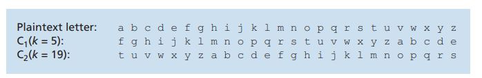
Figure 8.4 ♦ A polyalphabetic cipher using two Caesar ciphers

monoalphabetic cipher to encode a letter in a specific position in the plaintext mes- sage. Thus, the same letter, appearing in different positions in the plaintext message, might be encoded differently. An example of a polyalphabetic encryption scheme is shown in Figure 8.4. It has two Caesar ciphers (with _k_ \= 5 and _k_ \= 19), shown as rows. We might choose to use these two Caesar ciphers, C1 and C2, in the repeating pattern C1, C2, C2, C1, C2. That is, the first letter of plaintext is to be encoded using C1, the second and third using C2, the fourth using C1, and the fifth using C2. The pattern then repeats, with the sixth letter being encoded using C1, the seventh with C2, and so on. The plaintext message “bob, i love you.” is thus encrypted “ghu, n etox dhz.” Note that the first _b_ in the plaintext message is encrypted using C1, while the second _b_ is encrypted using C2. In this example, the encryption and decryption “key” is the knowledge of the two Caesar keys (_k_ \= 5, _k_ \= 19) and the pattern C1, C2, C2, C1, C2.

**Block Ciphers**

Let us now move forward to modern times and examine how symmetric key encryp- tion is done today. We focus on block ciphers, which are used in many secure Internet protocols, including PGP (for secure e-mail), TLS (for securing TCP connections), and IPsec (for securing the network-layer transport).

In a block cipher, the message to be encrypted is processed in blocks of _k_ bits. For example, if _k_ \= 64, then the message is broken into 64-bit blocks, and each block is encrypted independently. To encode a block, the cipher uses a one-to-one map- ping to map the _k_\-bit block of cleartext to a _k_\-bit block of ciphertext. Let’s look at an example. Suppose that _k_ \= 3, so that the block cipher maps 3-bit inputs (cleartext) to 3-bit outputs (ciphertext). One possible mapping is given in Table 8.1. Notice that this is a one-to-one mapping; that is, there is a different output for each input. This block cipher breaks the message up into 3-bit blocks and encrypts each block accord- ing to the above mapping. You should verify that the message 010110001111 gets encrypted into 101000111001.

Continuing with this 3-bit block example, note that the mapping in Table 8.1 is just one mapping of many possible mappings. How many possible mappings are there? To answer this question, observe that a mapping is nothing more than a permu- tation of all the possible inputs. There are 23 (= 8) possible inputs (listed under 
the 

**Table 8.1**  ♦  A specific 3-bit block cipher

input columns). These eight inputs can be permuted in 8! = 40,320 different ways. Since each of these permutations specifies a mapping, there are 40,320 possible map- pings. We can view each of these mappings as a key—if Alice and Bob both know the mapping (the key), they can encrypt and decrypt the messages sent between them.

The brute-force attack for this cipher is to try to decrypt ciphtertext by using all mappings. With only 40,320 mappings (when _k_ \= 3), this can quickly be accom- plished on a desktop PC. To thwart brute-force attacks, block ciphers typically use much larger blocks, consisting of _k_ \= 64 bits or even larger. Note that the number of possible mappings for a general _k_\-block cipher is 2_k_!, which is astronomical for even moderate values of _k_ (such as _k_ \= 64).

Although full-table block ciphers, as just described, with moderate values of _k_ can produce robust symmetric key encryption schemes, they are unfortunately dif- ficult to implement. For _k_ \= 64 and for a given mapping, Alice and Bob would need to maintain a table with 264 input values, which is an infeasible task. Moreover, if Alice and Bob were to change keys, they would have to each regenerate the table. Thus, a full-table block cipher, providing predetermined mappings between all inputs and outputs (as in the example above), is simply out of the question.

Instead, block ciphers typically use functions that simulate randomly permuted tables. An example (adapted from Kaufman 2002) of such a function for _k_ \= 64 bits is shown in Figure 8.5. The function first breaks a 64-bit block into 8 chunks, with each chunk consisting of 8 bits. Each 8-bit chunk is processed by an 8-bit to 8-bit table, which is of manageable size. For example, the first chunk is processed by the table denoted by T1. Next, the 8 output chunks are reassembled into a 64-bit block. The positions of the 64 bits in the block are then scrambled (permuted) to produce a 64-bit output. This output is fed back to the 64-bit input, where another cycle begins. After _n_ such cycles, the function provides a 64-bit block of ciphertext. The purpose of the rounds is to make each input bit affect most (if not all) of the final output bits. (If only one round were used, a given input bit would affect only 8 of the 64 output bits.) The key for this block cipher algorithm would be the eight permutation tables (assuming the scramble function is publicly known).

Today there are a number of popular block ciphers, including DES (standing for Data Encryption Standard), 3DES, and AES (standing for Advanced Encryption

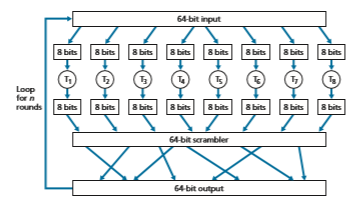
**Figure 8.5**  ♦  An example of a block cipher

Standard). Each of these standards uses functions, rather than predetermined tables, along the lines of Figure 8.5 (albeit more complicated and specific to each cipher). Each of these algorithms also uses a string of bits for a key. For example, DES uses 64-bit blocks with a 56-bit key. AES uses 128-bit blocks and can operate with keys that are 128, 192, and 256 bits long. An algorithm’s key determines the specific “mini-table” mappings and permutations within the algorithm’s internals. The brute- force attack for each of these ciphers is to cycle through all the keys, applying the decryption algorithm with each key. Observe that with a key length of _n_, there are 2_n_ possible keys. NIST NIST 2001 estimates that a machine that could crack 56-bit DES in one second (that is, try all 256 keys in one second) would take approximately 149 trillion years to crack a 128-bit AES key.

**Cipher-Block Chaining**

In computer networking applications, we typically need to encrypt long messages or long streams of data. If we apply a block cipher as described by simply chopping up the message into _k_\-bit blocks and independently encrypting each block, a subtle but important problem occurs. To see this, observe that two or more of the cleartext blocks can be identical. For example, the cleartext in two or more blocks could be “HTTP/1.1”. For these identical blocks, a block cipher would, of course, produce the same ciphertext. An attacker could potentially guess the cleartext when it sees identical ciphertext blocks and may even be able to decrypt the entire message by identifying identical ciphtertext blocks and using knowledge about the underlying protocol structure Kaufman 2002.

To address this problem, we can mix some randomness into the ciphertext so that identical plaintext blocks produce different ciphertext blocks. To explain this idea, let _m_(_i_) denote the _i_th plaintext block, _c_(_i_) denote the _i_th ciphertext block, and _a_ ⊕ _b_ denote the exclusive-or (XOR) of two bit strings, _a_ and _b_. (Recall that the 0 ⊕ 0 = 1 ⊕ 1 = 0 and 0 ⊕ 1 = 1 ⊕ 0 = 1, and the XOR of two bit strings is done on a bit-by-bit basis. So, for example, 10101010 ⊕ 11110000 = 01011010.) Also, denote the block-cipher encryption algorithm with key _S_ as _KS_. The basic idea is as follows. The sender creates a random _k_\-bit number _r_(_i_) for the _i_th block and calculates _c_(_i_) = _KS_(_m_(_i_) ⊕ _r_(_i_ )). Note that a new _k_\-bit random number is chosen for each block. The sender then sends _c_(1), _r_(1), _c_(2), _r_(2), _c_(3), _r_(3), and so on. Since the receiver receives _c(i)_ and _r(i)_, it can recover each block of the plaintext by computing _m_(_i_) = _KS_(_c_(_i_)) ⊕ _r_(_i_ ). It is important to note that, although _r_(_i_) is sent in the clear and thus can be sniffed by Trudy, she cannot obtain the plaintext _m_(_i_), since she does not know the key _KS_. Also note that if two plaintext blocks _m_(_i_) and _m_(_j_) are the same, the corresponding ciphertext blocks _c_(_i_) and _c_(_j_) will be different (as long as the random numbers _r_(_i_) and _r_(_j_) are different, which occurs with very high probability).

As an example, consider the 3-bit block cipher in Table 8.1. Suppose the plain- text is 010010010. If Alice encrypts this directly, without including the randomness, the resulting ciphertext becomes 101101101. If Trudy sniffs this ciphertext, because each of the three cipher blocks is the same, she can correctly surmise that each of the three plaintext blocks are the same. Now suppose instead Alice generates the ran- dom blocks _r_(1) = 001, _r_(2) = 111, and _r_(3) = 100 and uses the above technique to generate the ciphertext _c_(1) = 100, _c_(2) = 010, and _c_(3) = 000. Note that the three ciphertext blocks are different even though the plaintext blocks are the same. Alice then sends _c_(1), _r_(1), _c_(2), and _r_(2). You should verify that Bob can obtain the original plaintext using the shared key _KS_.

The astute reader will note that introducing randomness solves one problem but creates another: namely, Alice must transmit twice as many bits as before. Indeed, for each cipher bit, she must now also send a random bit, doubling the required band- width. In order to have our cake and eat it too, block ciphers typically use a technique called **Cipher Block Chaining (CBC)**. The basic idea is to send only _one random value along with the very first message, and then have the sender and receiver use the computed coded blocks in place of the subsequent random number._ Specifically, CBC operates as follows:

1\. Before encrypting the message (or the stream of data), the sender generates a random _k_\-bit string, called the **Initialization Vector (IV)**. Denote this initial- ization vector by _c_(0). The sender sends the IV to the receiver _in cleartext_.

2\. For the first block, the sender calculates _m_(1) ⊕ _c_(0), that is, calculates the exclu- sive-or of the first block of cleartext with the IV. It then runs the result through the block-cipher algorithm to get the corresponding ciphertext block; that is, _c_(1) = _KS_(_m_(1) ⊕ _c_(0)). The sender sends the encrypted block _c_(1) to the receiver.

3\. For the _i_th block, the sender generates the _i_th ciphertext block from _c_(_i_) = _KS_(_m_(_i_) ⊕ _c_(_i_ \- 1)).

Let’s now examine some of the consequences of this approach. First, the receiver will still be able to recover the original message. Indeed, when the receiver receives _c_(_i_), it decrypts it with _KS_ to obtain _s_(_i_) = _m_(_i_) ⊕ _c_(_i_ \- 1); since the receiver also knows _c_(_i_ \- 1), it then obtains the cleartext block from _m_(_i_) = _s_(_i_) ⊕ _c_(_i_ \- 1). Second, even if two cleartext blocks are identical, the corresponding ciphtertexts (almost always) will be different. Third, although the sender sends the IV in the clear, an intruder will still not be able to decrypt the ciphertext blocks, since the intruder does not know the secret key, _S_. Finally, the sender only sends one overhead block (the IV), thereby negligibly increasing the bandwidth usage for long messages (consisting of hundreds of blocks).

As an example, let’s now determine the ciphertext for the 3-bit block cipher in Table 8.1 with plaintext 010010010 and IV = _c_(0) = 001. The sender first uses the IV to calculate _c_(1) = _KS_(_m_(1) ⊕ _c_(0)) = 100. The sender then calculates _c_(2) = _KS_(_m_(2) ⊕ _c_(1)) = _KS_(010 ⊕ 100) = 000, and _c_(3) = _KS_(_m_(3) ⊕ _c_(2)) = _KS_(010 ⊕ 000) = 101. The reader should verify that the receiver, knowing the IV and _KS_ can recover the original plaintext.

CBC has an important consequence when designing secure network proto- cols: we’ll need to provide a mechanism within the protocol to distribute the IV from sender to receiver. We’ll see how this is done for several protocols later in this chapter.

### Public Key Encryption

For more than 2,000 years (since the time of the Caesar cipher and up to the 1970s), encrypted communication required that the two communicating parties share a com- mon secret—the symmetric key used for encryption and decryption. One difficulty with this approach is that the two parties must somehow agree on the shared key; but to do so in itself requires secure communication. Perhaps the parties could first meet and agree on the key in person (for example, two of Caesar’s centurions might meet at the Roman baths) and thereafter communicate with encryption. In a networked world, however, communicating parties may never meet and may never converse except over the network.

Is it possible for two parties to communicate with encryption without having a shared secret key that is known in advance? In 1976, Diffie and Hellman \[Diffie 1976\] demonstrated an algorithm (known now as Diffie-Hellman Key Exchange) to do just that—a radically different and marvelously elegant approach toward secure communication that has led to the development of today’s public key cryp- tography systems. We’ll see shortly that public key cryptography systems also have several wonderful properties that make them useful not only for encryption, but for authentication and digital signatures as well. Interestingly, it has come to light that ideas similar to those in Diffie 1976 and RSA 1978 had been independently developed in the early 1970s in a series of secret reports by researchers at the Communications-Electronics Security Group in the United Kingdom Ellis 1987.
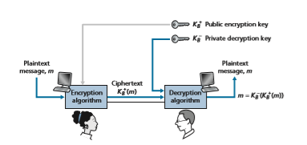
**Figure 8.6**  ♦  Public key cryptography

As is often the case, great ideas can spring up independently in many places; for- tunately, public key advances took place not only in private, but also in the public view, as well.

The use of public key cryptography is conceptually quite simple. Suppose Alice wants to communicate with Bob. As shown in Figure 8.6, rather than Bob and Alice sharing a single secret key (as in the case of symmetric key systems), Bob (the recipi- ent of Alice’s messages) instead has two keys—a **public key** that is available to _everyone_ in the world (including Trudy the intruder) and a **private key** that is known only to Bob. We will use the notation _K_+_B_ and _K_\- _B_ to refer to Bob’s public and private keys, respectively. In order to communicate with Bob, Alice first fetches Bob’s public key. Alice then encrypts her message, _m_, to Bob using Bob’s public key and a known (for example, standardized) encryption algorithm; that is, Alice computes _K_+_B_(_m_). Bob receives Alice’s encrypted message and uses his private key and a known (for example, standardized) decryption algorithm to decrypt Alice’s encrypted mes- sage. That is, Bob computes _K_\-_B_(_K_\+ _B_(_m_)). We will see below that there are encryption/decryption algorithms and techniques for choosing public and private keys such that _K_\-_B_(_K_\+ _B_(_m_)) = _m;_ that is, applying Bob’s public key, _K_+_B_, to a message, _m_ (to get _K_+_B_(_m_)), and then applying Bob’s private key, _K_\- _B_, to the encrypted version of _m_ (that is, computing _K_\- _B_(_K_+_B_(_m_))) gives back _m._ This is a remarkable result! In this manner, Alice can use Bob’s publicly available key to send a secret message to Bob without either of them having to distribute any secret keys! We will see shortly that we can interchange the public key and private key encryption and get the same remarkable result––that is, _K_\-_B_ (_B_ +(_m_)) = _K_\+ _B_ (_K_\-_B_(_m_)) = _m_. Although public-key cryptography is appealing, one concern immediately springs to mind. Since Bob’s encryption key is public, anyone can send an encrypted

message to Bob, including Alice or someone _pretending_ to be Alice. In the case of a single shared secret key, the fact that the sender knows the secret key implicitly identifies the sender to the receiver. In the case of public key cryptography, however, this is no longer the case since anyone can send an encrypted message to Bob using Bob’s publicly available key. A digital signature, a topic we will study in Section 8.3, is needed to bind a sender to a message.

**RSA**

While there may be many algorithms that address these concerns, the **RSA algorithm** (named after its founders, Ron Rivest, Adi Shamir, and Leonard Adleman) has become almost synonymous with public key cryptography. Let’s first see how RSA works and then examine why it works.

RSA makes extensive use of arithmetic operations using modulo-_n_ arithmetic. So let’s briefly review modular arithmetic. Recall that _x_ mod _n_ simply means the remainder of _x_ when divided by _n_; so, for example, 19 mod 5 = 4. In modular arith- metic, one performs the usual operations of addition, multiplication, and exponen- tiation. However, the result of each operation is replaced by the integer remainder that is left when the result is divided by _n_. Adding and multiplying with modular arithmetic is facilitated with the following handy facts:

[(_a_ mod _n_) + (_b_ mod _n_)] mod _n_ = (_a_ + _b_) mod _n_

[(_a_ mod _n_) - (_b_ mod _n_)] mod _n_ = (_a_ - _b_) mod _n_

[(_a_ mod _n_) + (_b_ mod _n_)] mod _n_ = (_a_ . _b_) mod _n_

It follows from the third fact that (_a_ mod _n_)_d_ mod _n_ \= _ad_ mod _n_, which is an identity that we will soon find very useful.

Now suppose that Alice wants to send to Bob an RSA-encrypted message, as shown in Figure 8.6. In our discussion of RSA, let’s always keep in mind that a mes- sage is nothing but a bit pattern, and every bit pattern can be uniquely represented by an integer number (along with the length of the bit pattern). For example, suppose a message is the bit pattern 1001; this message can be represented by the decimal integer 9. Thus, when encrypting a message with RSA, it is equivalent to encrypting the unique integer number that represents the message.

There are two interrelated components of RSA:

• The choice of the public key and the private key

• The encryption and decryption algorithm

To generate the public and private RSA keys, Bob performs the following steps:

1\. Choose two large prime numbers, _p_ and _q_. How large should _p_ and _q_ be? The larger the values, the more difficult it is to break RSA, but the longer it takesto perform the encoding and decoding. RSA Laboratories recommends that the product of _p_ and _q_ be on the order of 1,024 bits. For a discussion of how to find large prime numbers, see \[Caldwell 2020\].

2\. Compute _n_ \= _pq_ and _z_ = (_p_ - 1)(_q_ - 1). 

3\. Choose a number, _e_, less than _n_, that has no common factors (other than 1)

with _z._ (In this case, _e_ and _z_ are said to be relatively prime.) The letter _e_ is used since this value will be used in encryption.

4\. Find a number, _d_, such that _ed_ - 1 is exactly divisible (that is, with no remainder) by _z_. The letter _d_ is used because this value will be used in decryption. Put another way, given _e_, we choose _d_ such that

ed mod z = 1

5\. The public key that Bob makes available to the world, _K_\+ _B_, is the pair of numbers

(_n_, _e_); his private key, _K_\- _B_, is the pair of numbers (_n_, _d_).

The encryption by Alice and the decryption by Bob are done as follows:

• Suppose Alice wants to send Bob a bit pattern represented by the integer number _m_ (with _m_ 6 _n_). To encode, Alice performs the exponentiation _me_, and then computes the integer remainder when _me_ is divided by _n_. In other words, the encrypted value, _c_, of Alice’s plaintext message, _m_, is

c = m^e mod n

The bit pattern corresponding to this ciphertext _c_ is sent to Bob.

• To decrypt the received ciphertext message, _c_, Bob computes

m = cd mod n

which requires the use of his private key (_n_, _d_).

As a simple example of RSA, suppose Bob chooses _p_ = 5 and _q_ = 7. (Admittedly,

these values are far too small to be secure.) Then _n_ = 35 and _z_ = 24. Bob chooses _e_ = 5, since 5 and 24 have no common factors. Finally, Bob chooses _d_ = 29, since 5 # 29 - 1 (that is, _ed_ - 1) is exactly divisible by 24. Bob makes the two values, _n_ = 35 and _e_ = 5, public and keeps the value _d_ = 29 secret. Observing these two public values, suppose Alice now wants to send the letters _l_, _o_, _v_, and _e_ to Bob. Interpreting each letter as a number between 1 and 26 (with _a_ being 1, and _z_ being 26), Alice and Bob perform the encryption and decryption shown in Tables 8.2 and 8.3, respectively. Note that in this example, we consider each of the four letters as a distinct message. A more realistic example would be to convert the four letters into their 8-bit ASCII representations and then encrypt the integer corresponding to the resulting 32-bit bit pattern. (Such a realistic example generates numbers that are much too long to print in a textbook!)

**Table 8.2**  ♦  Alice’s RSA encryption, _e_ = 5, _n_ = 35

Given that the “toy” example in Tables 8.2 and 8.3 has already produced some extremely large numbers, and given that we saw earlier that _p_ and _q_ should each be several hundred bits long, several practical issues regarding RSA come to mind. How does one choose large prime numbers? How does one then choose _e_ and _d_? How does one perform exponentiation with large numbers? A discussion of these important issues is beyond the scope of this book; see \[Kaufman 2002\] and the refer- ences therein for details.

**Session Keys**

We note here that the exponentiation required by RSA is a rather time-consuming process. As a result, RSA is often used in practice in combination with symmet- ric key cryptography. For example, if Alice wants to send Bob a large amount of encrypted data, she could do the following. First Alice chooses a key that will be used to encode the data itself; this key is referred to as a **session key**, and is denoted by _KS_. Alice must inform Bob of the session key, since this is the shared symmetric key they will use with a symmetric key cipher (e.g., with DES or AES). Alice encrypts the session key using Bob’s public key, that is, computes _c_ \= (_KS_)_e_ mod _n_. Bob receives the RSA-encrypted session key, _c_, and decrypts it to obtain

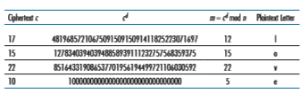
**Table 8.3**  ♦  Bob’s RSA decryption, _d_ = 29, _n_ = 35

the session key, _KS_. Bob now knows the session key that Alice will use for her encrypted data transfer.

**Why Does RSA Work?**

RSA encryption/decryption appears rather magical. Why should it be that by apply- ing the encryption algorithm and then the decryption algorithm, one recovers the original message? In order to understand why RSA works, again denote _n_ = _pq_, where _p_ and _q_ are the large prime numbers used in the RSA algorithm.

Recall that, under RSA encryption, a message (uniquely represented by an integer), _m_, is exponentiated to the power _e_ using modulo-_n_ arithmetic, that is,

c = m^e mod n

Decryption is performed by raising this value to the power _d_, again using modulo-_n_ arithmetic. The result of an encryption step followed by a decryption step is thus (_me_ mod _n_)_d_ mod _n_. Let’s now see what we can say about this quantity. As mentioned earlier, one important property of modulo arithmetic is (_a_ mod _n_)_d_ mod _n_ = _ad_ mod _n_ for any values _a_, _n_, and _d_. Thus, using _a_ = _me_ in this property, we have

(m^e mod n)^d mod n = m^ed mod n

It therefore remains to show that _med_ mod _n_ = _m_. Although we’re trying to remove some of the magic about why RSA works, to establish this, we’ll need to use a rather magical result from number theory here. Specifically, we’ll need the result that says if _p_ and _q_ are prime, _n_ = _pq_, and _z_ = (_p_ - 1)(_q_ - 1), then _xy_ mod _n_ is the same as _x_(_y_ mod _z_) mod _n_ [Kaufman 2002]. Applying this result with _x_ = _m_ and _y_ = _ed_ we have

m^ed mod n = m^(ed mod z) mod n

But remember that we have chosen _e_ and _d_ such that _ed_ mod z = 1. This gives us

m^ed mod n = m^1 mod n = m

which is exactly the result we are looking for! By first exponentiating to the power of _e_ (that is, encrypting) and then exponentiating to the power of _d_ (that is, decrypting), we obtain the original value, _m._ Even _more_ wonderful is the fact that if we first exponentiate to the power of _d_ and then exponentiate to the power of _e_—that is, we reverse the order of encryption and decryption, performing the decryption operation first and then applying the encryption operation—we also obtain the original value, _m_. This wonderful result follows immediately from the modular arithmetic:

(m^d mod n)^e mod n = mde mod n = med mod n = (m^e mod n)^d mod n

The security of RSA relies on the fact that there are no known algorithms for quickly factoring a number, in this case the public value _n_, into the primes _p_ and _q_. If one knew _p_ and _q_, then given the public value _e_, one could easily compute the secret key, _d_. On the other hand, it is not known whether or not there _exist_ fast algorithms for factoring a number, and in this sense, the security of RSA is not guaranteed. With recent advances in quantum computing, and published fast factoring algorithms for quantum computers, there are concerns that RSA may not be secure forever [MIT TR 2019]. But the practical realization of these algorithms still appears to be far in the future.

Another popular public-key encryption algorithm is the Diffie-Hellman algo- rithm, which we will briefly explore in the homework problems. Diffie-Hellman is not as versatile as RSA in that it cannot be used to encrypt messages of arbitrary length; it can be used, however, to establish a symmetric session key, which is in turn used to encrypt messages.

## Message Integrity and Digital Signatures
In the previous section, we saw how encryption can be used to provide confidenti- ality to two communicating entities. In this section, we turn to the equally impor- tant cryptography topic of providing **message integrity** (also known as message authentication). Along with message integrity, we will discuss two related topics in this section: digital signatures and end-point authentication.

We define the message integrity problem using, once again, Alice and Bob. Suppose Bob receives a message (which may be encrypted or may be in plaintext) and he believes this message was sent by Alice. To authenticate this message, Bob needs to verify:

1\. The message indeed originated from Alice. 

2\. The message was not tampered with on its way to Bob.

We’ll see in Sections 8.4 through 8.7 that this problem of message integrity is a criti- cal concern in just about all secure networking protocols.

As a specific example, consider a computer network using a link-state routing algorithm (such as OSPF) for determining routes between each pair of routers in the network (see Chapter 5). In a link-state algorithm, each router needs to broadcast a link-state message to all other routers in the network. A router’s link-state message includes a list of its directly connected neighbors and the direct costs to these neigh- bors. Once a router receives link-state messages from all of the other routers, it can create a complete map of the network, run its least-cost routing algorithm, and con- figure its forwarding table. One relatively easy attack on the routing algorithm is for Trudy to distribute bogus link-state messages with incorrect link-state information. Thus, the need for message integrity—when router B receives a link-state message from router A, router B should verify that router A actually created the message and, further, that no one tampered with the message in transit.In this section, we describe a popular message integrity technique that is used by many secure networking protocols. But before doing so, we need to cover another important topic in cryptography—cryptographic hash functions.

### Cryptographic Hash Functions

As shown in Figure 8.7, a hash function takes an input, _m_, and computes a fixed-size string _H_(_m_) known as a hash. The Internet checksum (Chapter 3) and CRCs (Chapter 6) meet this definition. A **cryptographic hash function
 is required to have the follow- ing additional property:

• It is computationally infeasible to find any two different messages _x_ and _y_ such that _H_(_x_) = _H_(_y_).

Informally, this property means that it is computationally infeasible for an intruder to substitute one message for another message that is protected by the hash function. That is, if (_m_, _H_(_m_)) are the message and the hash of the message created by the sender, then an intruder cannot forge the contents of another message, _y_, that has the same hash value as the original message.

Let’s convince ourselves that a simple checksum, such as the Internet checksum, would make a poor cryptographic hash function. Rather than performing 1s comple- ment arithmetic (as in the Internet checksum), let us compute a checksum by treating each character as a byte and adding the bytes together using 4-byte chunks at a time. Suppose Bob owes Alice $100.99 and sends an IOU to Alice consisting of the text string “IOU100.99BOB.” The ASCII representation (in hexadecimal notation) for these letters is 49,4F,55,31,30,30,2E,39,39,42,4F,42.

Figure 8.8 (top) shows that the 4-byte checksum for this message is B2 C1 D2 AC. A slightly different message (and a much more costly one for Bob)
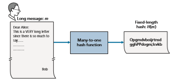
**Figure 8.7**  ♦  Hash functions

 **Figure 8.8** ♦ Initial message and fraudulent message have the same 
checksum!

is shown in the bottom half of Figure 8.8. The messages “IOU100.99BOB” and “IOU900.19BOB” have the _same_ checksum. Thus, this simple checksum algorithm violates the requirement above. Given the original data, it is simple to find another set of data with the same checksum. Clearly, for security purposes, we are going to need a more powerful hash function than a checksum.

The MD5 hash algorithm of Ron Rivest \[RFC 1321\] is in wide use today. It computes a 128-bit hash in a four-step process consisting of a padding step (adding a one followed by enough zeros so that the length of the message satisfies certain conditions), an append step (appending a 64-bit representation of the mes- sage length before padding), an initialization of an accumulator, and a final loop- ing step in which the message’s 16-word blocks are processed (mangled) in four rounds. For a description of MD5 (including a C source code implementation) see \[RFC 1321\].

The second major hash algorithm in use today is the Secure Hash Algorithm (SHA-1) \[FIPS 1995\]. This algorithm is based on principles similar to those used in the design of MD4 \[RFC 1320\], the predecessor to MD5. SHA-1, a US federal standard, is required for use whenever a cryptographic hash algorithm is needed for federal applications. It produces a 160-bit message digest. The longer output length makes SHA-1 more secure.

### Message Authentication Code
Let’s now return to the problem of message integrity. Now that we understand hash functions, let’s take a first stab at how we might perform message integrity:
1\.Alice creates message _m_ and calculates the hash _H_(_m_) (for example, with SHA-1). 
2\. Alice then appends _H_(_m_) to the message _m_, creating an extended message(_m_, _H_(_m_)), and sends the extended message to Bob. 
3\. Bob receives an extended message (_m_, _h_) and calculates _H_(_m_). If _H_(_m_) = _h_,Bob concludes that everything is fine.

This approach is obviously flawed. Trudy can create a bogus message _m_´ in which she says she is Alice, calculate _H_(_m_´), and send Bob (_m_´, _H_(_m_´)). When Bob receives the message, everything checks out in step 3, so Bob doesn’t suspect any funny business.

To perform message integrity, in addition to using cryptographic hash functions, Alice and Bob will need a shared secret _s_. This shared secret, which is nothing more than a string of bits, is called the **authentication key**. Using this shared secret, mes- sage integrity can be performed as follows:

1\. Alice creates message _m_, concatenates _s_ with _m_ to create _m_ + _s_, and calculates the hash _H_(_m_ \+ _s_) (for example, with SHA-1). _H_(_m_ \+ _s_) is called the **message authentication code (MAC)**.

2\. Alice then appends the MAC to the message _m_, creating an extended message (_m, H_(_m_ \+ _s_)), and sends the extended message to Bob.

3\. Bob receives an extended message (_m, h_) and knowing _s_, calculates the MAC _H_(_m_ \+ _s_). If _H_(_m_ + _s_) = _h_, Bob concludes that everything is fine.

A summary of the procedure is shown in Figure 8.9. Readers should note that the MAC here (standing for “message authentication code”) is not the same MAC used in link-layer protocols (standing for “medium access control”)!

One nice feature of a MAC is that it does not require an encryption algorithm. Indeed, in many applications, including the link-state routing algorithm described earlier, communicating entities are only concerned with message integrity and are
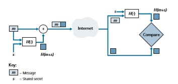
**Figure 8.9**  ♦  Message authentication code (MAC)

not concerned with message confidentiality. Using a MAC, the entities can authen- ticate the messages they send to each other without having to integrate complex encryption algorithms into the integrity process.

As you might expect, a number of different standards for MACs have been pro- posed over the years. The most popular standard today is **HMAC**, which can be used either with MD5 or SHA-1. HMAC actually runs data and the authentication key through the hash function twice [Kaufman 2002; RFC 2104].

There still remains an important issue. How do we distribute the shared authen- tication key to the communicating entities? For example, in the link-state routing algorithm, we would somehow need to distribute the secret authentication key to each of the routers in the autonomous system. (Note that the routers can all use the same authentication key.) A network administrator could actually accomplish this by physically visiting each of the routers. Or, if the network administrator is a lazy guy, and if each router has its own public key, the network administrator could distribute the authentication key to any one of the routers by encrypting it with the router’s public key and then sending the encrypted key over the network to the router.

### Digital Signatures
Think of the number of the times you’ve signed your name to a piece of paper during the last week. You sign checks, credit card receipts, legal documents, and letters. Your signature attests to the fact that you (as opposed to someone else) have acknowledged and/or agreed with the document’s contents. In a digital world, one often wants to indicate the owner or creator of a document, or to signify one’s agree- ment with a document’s content. A **digital signature is a cryptographic technique for achieving these goals in a digital world.

Just as with handwritten signatures, digital signing should be done in a way that is verifiable and nonforgeable. That is, it must be possible to prove that a document signed by an individual was indeed signed by that individual (the signature must be verifiable) and that _only_ that individual could have signed the document (the signa- ture cannot be forged).

Let’s now consider how we might design a digital signature scheme. Observe that when Bob signs a message, Bob must put something on the message that is unique to him. Bob could consider attaching a MAC for the signature, where the MAC is created by appending his key (unique to him) to the message, and then taking the hash. But for Alice to verify the signature, she must also have a copy of the key, in which case the key would not be unique to Bob. Thus, MACs are not going to get the job done here.

Recall that with public-key cryptography, Bob has both a public and private key, with both of these keys being unique to Bob. Thus, public-key cryptography is an excellent candidate for providing digital signatures. Let us now examine how it is done.

Suppose that Bob wants to digitally sign a document, _m_. We can think of the document as a file or a message that Bob is going to sign and send. As shown in Figure 8.10, to sign this document, Bob simply uses his private key, _K_\-_B_, to compute

**Figure 8.10**  ♦  Creating a digital signature for a document

_K_\- _B_(_m_). At first, it might seem odd that Bob is using his private key (which, as we saw in Section 8.2, was used to decrypt a message that had been encrypted with his public key) to sign a document. But recall that encryption and decryption are nothing more than mathematical operations (exponentiation to the power of _e_ or _d_ in RSA; see Sec- tion 8.2) and recall that Bob’s goal is not to scramble or obscure the contents of the document, but rather to sign the document in a manner that is verifiable and nonforge- able. Bob’s digital signature of the document is _K_\-_B_(_m_). Does the digital signature _K_\-_B_(_m_) meet our requirements of being verifiable and nonforgeable? Suppose Alice has _m_ and _K_\-_B_(_m_). She wants to prove in court (being litigious) that Bob had indeed signed the document and was the only person who could have possibly signed the document. Alice takes Bob’s public key, _K_+_B_, and applies it to the digital signature, _K_\-_B_(_m_), associated with the document, _m_. That is, she computes _K_+_B_(_K_\- _B_(_m_)), and voilà, with a dramatic flurry, she produces _m_, which exactly matches the original document! Alice then argues that only Bob could have signed the document, for the following reasons:

• Whoever signed the message must have used the private key, _K_\- _B_, in computing the signature _K_\- _B_(_m_), such that _K_+_B_(_K_\- _B_(_m_)) = _m_.

• The only person who could have known the private key, _K_\- _B_, is Bob. Recall from our discussion of RSA in Section 8.2 that knowing the public key, _K_\+ _B_, is of no help in learning the private key, _K_\- _B_. Therefore, the only person who could know_K_\- _B_ is the person who generated the pair of keys, (_K_+_B_, _K_\- _B_), in the first place, Bob.
(Note that this assumes, though, that Bob has not given _K_\- _B_ to anyone, nor has anyone stolen _K_\- _B_ from Bob.)

It is also important to note that if the original document, m, is ever modified to some alternate form, m´, the signature that Bob created for m will not be valid for m´,

since _K_\+ _B_(_K_\-_B_(_m_)) does not equal _m_´. Thus, we see that digital signatures also provide message integrity, allowing the receiver to verify that the message was unaltered as well as the source of the message.

One concern with signing data by encryption is that encryption and decryption are computationally expensive. Given the overheads of encryption and decryption, signing data via complete encryption/decryption can be overkill. A more efficient approach is to introduce hash functions into the digital signature. Recall from Section 8.3.2 that a hash algorithm takes a message, _m_, of arbitrary length and com- putes a fixed-length “fingerprint” of the message, denoted by _H_(_m_). Using a hash function, Bob signs the hash of a message rather than the message itself, that is, Bob calculates _K_\-_B_(_H_(_m_)). Since _H_(_m_) is generally much smaller than the original message _m_, the computational effort required to create the digital signature is sub- stantially reduced.

In the context of Bob sending a message to Alice, Figure 8.11 provides a sum- mary of the operational procedure of creating a digital signature. Bob puts his origi- nal long message through a hash function. He then digitally signs the resulting hash with his private key. The original message (in cleartext) along with the digitally signed message digest (henceforth referred to as the digital signature) is then sent to Alice. Figure 8.12 provides a summary of the operational procedure of the signature. Alice applies the sender’s public key to the message to obtain a hash result. Alice also

**Figure 8.11**  ♦  Sending a digitally signed message
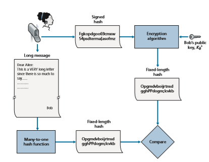

**Figure 8.12**  ♦  Verifying a signed message

applies the hash function to the cleartext message to obtain a second hash result. If the two hashes match, then Alice can be sure about the integrity and author of the message.

Before moving on, let’s briefly compare digital signatures with MACs, since they have parallels, but also have important subtle differences. Both digital signa- tures and MACs start with a message (or a document). To create a MAC out of the message, we append an authentication key to the message, and then take the hash of the result. Note that neither public key nor symmetric key encryption is involved in creating the MAC. To create a digital signature, we first take the hash of the message and then encrypt the message with our private key (using public key cryptography). Thus, a digital signature is a “heavier” technique, since it requires an underlying Public Key Infrastructure (PKI) with certification authorities as described below. We’ll see in Section 8.4 that PGP—a popular secure e-mail system—uses digital signatures for message integrity. We’ve seen already that OSPF uses MACs for mes- sage integrity. We’ll see in Sections 8.5 and 8.6 that MACs are also used for popular transport-layer and network-layer security protocols.

**Public Key Certification**

An important application of digital signatures is **public key certification**, that is, certifying that a public key belongs to a specific entity. Public key certification is used in many popular secure networking protocols, including IPsec and TLS.

To gain insight into this problem, let’s consider an Internet-commerce version of the classic “pizza prank.” Alice is in the pizza delivery business and accepts orders over the Internet. Bob, a pizza lover, sends Alice a plaintext message that includes his home address and the type of pizza he wants. In this message, Bob also includes a digital signature (that is, a signed hash of the original plaintext message) to prove to Alice that he is the true source of the message. To verify the signature, Alice obtains Bob’s public key (perhaps from a public key server or from the e-mail message) and checks the digital signature. In this manner she makes sure that Bob, rather than some adolescent prankster, placed the order.

This all sounds fine until clever Trudy comes along. As shown in Figure 8.13, Trudy is indulging in a prank. She sends a message to Alice in which she says she is Bob, gives Bob’s home address, and orders a pizza. In this message she also includes her (Trudy’s) public key, although Alice naturally assumes it is Bob’s public key. Trudy also attaches a digital signature, which was created with her own (Trudy’s) private key. After receiving the message, Alice applies Trudy’s public key (thinking that it is Bob’s) to the digital signature and concludes that the plaintext message was indeed created by Bob. Bob will be very surprised when the delivery person brings a pizza with pepperoni and anchovies to his home!

We see from this example that for public key cryptography to be useful, you need to be able to verify that you have the actual public key of the entity (person, router, browser, and so on) with whom you want to communicate. For example, when Alice wants to communicate with Bob using public key cryptography, she needs to verify that the public key that is supposed to be Bob’s is indeed Bob’s.

Binding a public key to a particular entity is typically done by a **Certification Authority (CA)**, whose job is to validate identities and issue certificates. A CA has the following roles:

1\. A CA verifies that an entity (a person, a router, and so on) is who it says it is. There are no mandated procedures for how certification is done. When dealing with a CA, one must trust the CA to have performed a suitably rigorous identity verification. For example, if Trudy were able to walk into the Fly-by-Night CA and simply announce “I am Alice” and receive certificates associated with the identity of Alice, then one shouldn’t put much faith in public keys certified by the Fly-by-Night CA. On the other hand, one might (or might not!) be more willing to trust a CA that is part of a federal or state program. You can trust the identity associated with a public key only to the extent to which you can trust a CA and its identity verification techniques. What a tangled web of trust we spin!

2\. Once the CA verifies the identity of the entity, the CA creates a **certificate** that binds the public key of the entity to the identity. The certificate contains

**Figure 8.13**  ♦  Trudy masquerades as Bob using public key cryptography

the public key and globally unique identifying information about the owner of the public key (for example, a human name or an IP address). The certificate is digitally signed by the CA. These steps are shown in 
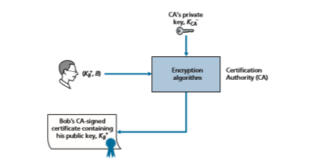
**Figure 8.14**

Let us now see how certificates can be used to combat pizza-ordering prank- sters, like Trudy, and other undesirables. When Bob places his order he also sends his CA-signed certificate. Alice uses the CA’s public key to check the validity of Bob’s certificate and extract Bob’s public key.

Both the International Telecommunication Union (ITU) and the IETF have developed standards for CAs. ITU X.509 \[ITU 2005a\] specifies an authentication service as well as a specific syntax for certificates. \[RFC 1422\] describes CA- based key management for use with secure Internet e-mail. It is compatible with X.509 but goes beyond X.509 by establishing procedures and conventions for a key management architecture. Table 8.4 describes some of the important fields in a certificate.
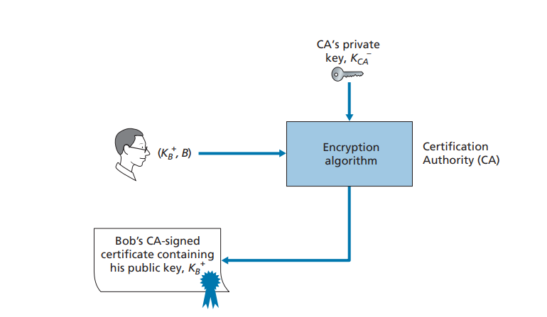
**Figure 8.14** ♦ Bob has his public key certified by the CA

**Table 8.4**  ♦  Selected fields in an X.509 and RFC 1422 public key

## End-Point Authentication

**End-point authentication** is the process of one entity proving its identity to another entity over a computer network, for example, a user proving its identity to an e-mail server. As humans, we authenticate each other in many ways: We recognize each other’s faces when we meet, we recognize each other’s voices on the telephone, we are authenticated by the customs official who checks us against the picture on our passport.

In this section, we consider how one party can authenticate another party when the two are communicating over a network. We focus here on authenticating a “live” party, at the point in time when communication is actually occurring. A concrete example is a user authenticating him or herself to an e-mail server. This is a subtly different problem from proving that a message received at some point in the past did indeed come from that claimed sender, as studied in Section 8.3.

When performing authentication over the network, the communicating parties cannot rely on biometric information, such as a visual appearance or a voiceprint. Indeed, we will see in our later case studies that it is often network elements such as routers and client/server processes that must authenticate each other. Here, authen- tication must be done solely on the basis of messages and data exchanged as part of an **authentication protocol** Typically, an authentication protocol would run _before_ the two communicating parties run some other protocol (for example, a reliable data transfer protocol, a routing information exchange protocol, or an e-mail protocol). The authentication protocol first establishes the identities of the parties to each other’s satisfaction; only after authentication do the parties get down to the work at hand.

As in the case of our development of a reliable data transfer (rdt) protocol in Chapter 3, we will find it instructive here to develop various versions of an authentica- tion protocol, which we will call **ap** (authentication protocol), and poke holes in each version as we proceed. (If you enjoy this stepwise evolution of a design, you might also enjoy \[Bryant 1988\], which recounts a fictitious narrative between designers of an open- network authentication system, and their discovery of the many subtle issues involved.)

Let’s assume that Alice needs to authenticate herself to Bob. Perhaps the simplest authentication protocol we can imagine is one where

Alice simply sends a message to Bob saying she is Alice. This protocol is shown in Figure 8.15. The flaw here is obvious—there is no way for Bob actually to know that the person sending the message “I am Alice” is indeed Alice. For example, Trudy (the intruder) could just as well send such a message.
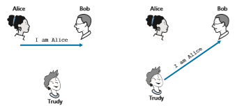
**Figure 8.15**  ♦  Protocol _ap1.0_ and a failure scenario

**Authentication Protocol _ap2.0_**

If Alice has a well-known network address (e.g., an IP address) from which she always communicates, Bob could attempt to authenticate Alice by verifying that the source address on the IP datagram carrying the authentication message matches Alice’s well-known address. In this case, Alice would be authenticated. This might stop a very network-naive intruder from impersonating Alice, but it wouldn’t stop the determined student studying this book, or many others!

From our study of the network and data link layers, we know that it is not that hard (for example, if one had access to the operating system code and could build one’s own operating system kernel, as is the case with Linux and several other freely available operating systems) to create an IP datagram, put whatever IP source address we want (for example, Alice’s well-known IP address) into the IP datagram, and send the datagram over the link-layer protocol to the first-hop router. From then on, the incorrectly source-addressed datagram would be dutifully forwarded to Bob. This approach, shown in Figure 8.16, is a form of IP spoofing. IP spoofing can be avoided if Trudy’s first-hop router is configured to forward only datagrams con- taining Trudy’s IP source address \[RFC 2827\]. However, this capability is not uni- versally deployed or enforced. Bob would thus be foolish to assume that Trudy’s network manager (who might be Trudy herself) had configured Trudy’s first-hop router to forward only appropriately addressed datagrams.

**Authentication Protocol _ap3.0_**

One classic approach to authentication is to use a secret password. The password is a shared secret between the authenticator and the person being authenticated. Gmail, Facebook, telnet, FTP, and many other services use password authentication. In pro- tocol ap3.0, Alice thus sends her secret password to Bob, as shown in Figure 8.17.

**Figure 8.16**  ♦  Protocol _ap2.0_ and a failure scenario

**Figure 8.17** ♦ Protocol ap3.0 and a failure scenario

Since passwords are so widely used, we might suspect that protocol _ap3.0_ is fairly secure. If so, we’d be wrong! The security flaw here is clear. If Trudy eaves- drops on Alice’s communication, then she can learn Alice’s password. Lest you think this is unlikely, consider the fact that when you Telnet to another machine and log in, the login password is sent unencrypted to the Telnet server. Someone connected to the Telnet client or server’s LAN can possibly sniff (read and store) all packets transmitted on the LAN and thus steal the login password. In fact, this is a well- known approach for stealing passwords (see, for example, \[Jimenez 1997\]). Such a threat is obviously very real, so _ap3.0_ clearly won’t do.

**Authentication Protocol ap3.1**

Our next idea for fixing ap3.0 is naturally to encrypt the password. By encrypting the password, we can prevent Trudy from learning Alice’s password. If we assume that Alice and Bob share a symmetric secret key, _KA_\-_B_, then Alice can encrypt the password and send her identification message, “I am Alice,” and her encrypted password to Bob. Bob then decrypts the password and, assuming the password is cor- rect, authenticates Alice. Bob feels comfortable in authenticating Alice since Alice not only knows the password, but also knows the shared secret key value needed to encrypt the password. Let’s call this protocol _ap3.1_.

While it is true that _ap3.1_ prevents Trudy from learning Alice’s password, the use of cryptography here does not solve the authentication problem. Bob is subject

to a **playback attack**: Trudy need only eavesdrop on Alice’s communication, record the encrypted version of the password, and play back the encrypted version of the password to Bob to pretend that she is Alice. The use of an encrypted password in _ap3.1_ doesn’t make the situation manifestly different from that of protocol _ap3.0_ in Figure 8.17.

**Authentication Protocol ap4.0**

The failure scenario in Figure 8.17 resulted from the fact that Bob could not distin- guish between the original authentication of Alice and the later playback of Alice’s original authentication. That is, Bob could not tell if Alice was live (that is, was currently really on the other end of the connection) or whether the messages he was receiving were a recorded playback of a previous authentication of Alice. The very (_very_) observant reader will recall that the three-way TCP handshake protocol needed to address the same problem—the server side of a TCP connection did not want to accept a connection if the received SYN segment was an old copy (retransmission) of a SYN segment from an earlier connection. How did the TCP server side solve the problem of determining whether the client was really live? It chose an initial sequence number that had not been used in a very long time, sent that number to the client, and then waited for the client to respond with an ACK segment containing that number. We can adopt the same idea here for authentication purposes.

A **nonce** is a number that a protocol will use only once in a lifetime. That is, once a protocol uses a nonce, it will never use that number again. Our _ap4.0_ protocol uses a nonce as follows:

1\. Alice sends the message “I am Alice” to Bob. 
2\. Bob chooses a nonce, R, and sends it to Alice. 
3\. Alice encrypts the nonce using Alice and Bob’s symmetric secret key, _KA_\-_B_, and sends the encrypted nonce, _KA_\-_B_ (R), back to Bob. As in protocol _ap3.1_, it is the fact that Alice knows _KA_\-_B_ and uses it to encrypt a value that lets Bob know that the message he receives was generated by Alice. The nonce is used to ensure that Alice is live.

4\. Bob decrypts the received message. If the decrypted nonce equals the nonce he sent Alice, then Alice is authenticated.

Protocol _ap4.0_ is illustrated in Figure 8.18. By using the once-in-a-lifetime value, _R_, and then checking the returned value, _KA_\-_B_ (_R_), Bob can be sure that Alice is both who she says she is (since she knows the secret key value needed to encrypt _R)_ and live (since she has encrypted the nonce, _R_, that Bob just created).

The use of a nonce and symmetric key cryptography forms the basis of _ap4.0_. A natural question is whether we can use a nonce and public key cryptography (rather than symmetric key cryptography) to solve the authentication problem. This issue is explored in the problems at the end of the chapter.

**Figure 8.18**  ♦  Protocol _ap4.0_ and a failure scenario

## Securing E-Mail
In previous sections, we examined fundamental issues in network security, including symmetric key and public key cryptography, end-point authentication, key distribu- tion, message integrity, and digital signatures. We are now going to examine how these tools are being used to provide security in the Internet.

Interestingly, it is possible to provide security services in any of the top four layers of the Internet protocol stack. When security is provided for a specific applica- tion-layer protocol, the application using the protocol will enjoy one or more security services, such as confidentiality, authentication, or integrity. When security is pro- vided for a transport-layer protocol, all applications that use that protocol enjoy the security services of the transport protocol. When security is provided at the network layer on a host-to-host basis, all transport-layer segments (and hence all application- layer data) enjoy the security services of the network layer. When security is pro- vided on a link basis, then the data in all frames traveling over the link receive the security services of the link.

In Sections 8.5 through 8.8, we examine how security tools are being used in the application, transport, network, and link layers. Being consistent with the general structure of this book, we begin at the top of the protocol stack and discuss security at the application layer. Our approach is to use a specific application, e-mail, as a case study for application-layer security. We then move down the protocol stack. We’ll examine the TLS protocol (which provides security at the transport layer), IPsec (which provides security at the network layer), and the security of the IEEE 802.11 wireless LAN protocol.

You might be wondering why security functionality is being provided at more than one layer in the Internet. Wouldn’t it suffice simply to provide the security functionality at the network layer and be done with it? There are two answers to this question. First, although security at the network layer can offer “blanket coverage” by encrypting all the data in the datagrams (that is, all the transport-layer segments)

Boband by authenticating all the source IP addresses, it can’t provide user-level secu- rity. For example, a commerce site cannot rely on IP-layer security to authenticate a customer who is purchasing goods at the commerce site. Thus, there is a need for security functionality at higher layers as well as blanket coverage at lower lay- ers. Second, it is generally easier to deploy new Internet services, including security services, at the higher layers of the protocol stack. While waiting for security to be broadly deployed at the network layer, which is probably still many years in the future, many application developers “just do it” and introduce security functional- ity into their favorite applications. A classic example is Pretty Good Privacy (PGP), which provides secure e-mail (discussed later in this section). Requiring only client and server application code, PGP was one of the first security technologies to be broadly used in the Internet.

### Secure E-Mail
We now use the cryptographic principles of Sections 8.2 through 8.3 to create a secure e-mail system. We create this high-level design in an incremental manner, at each step introducing new security services. When designing a secure e-mail sys- tem, let us keep in mind the racy example introduced in Section 8.1—the love affair between Alice and Bob. Imagine that Alice wants to send an e-mail message to Bob, and Trudy wants to intrude.

Before plowing ahead and designing a secure e-mail system for Alice and Bob, we should consider which security features would be most desirable for them. First and foremost is _confidentiality._ As discussed in Section 8.1, neither Alice nor Bob wants Trudy to read Alice’s e-mail message. The second feature that Alice and Bob would most likely want to see in the secure e-mail system is _sender authentication_. In particular, when Bob receives the message “I don’t love you anymore. I never want to see you again. Formerly yours, Alice,” he would naturally want to be sure that the message came from Alice and not from Trudy. Another feature that the two lovers would appreciate is _message integrity_, that is, assurance that the message Alice sends is not modified while en route to Bob. Finally, the e-mail system should provide _receiver authentication_; that is, Alice wants to make sure that she is indeed sending the letter to Bob and not to someone else (for example, Trudy) who is impersonating Bob.

So let’s begin by addressing the foremost concern, confidentiality. The most straightforward way to provide confidentiality is for Alice to encrypt the message with symmetric key technology (such as DES or AES) and for Bob to decrypt the message on receipt. As discussed in Section 8.2, if the symmetric key is long enough, and if only Alice and Bob have the key, then it is extremely difficult for anyone else (including Trudy) to read the message. Although this approach is straightforward, it has the fundamental difficulty that we discussed in Section 8.2—distributing a sym- metric key so that only Alice and Bob have copies of it. So we naturally consider an alternative approach—public key cryptography (using, for example, RSA). In thepublic key approach, Bob makes his public key publicly available (e.g., in a public key server or on his personal Web page), Alice encrypts her message with Bob’s public key, and she sends the encrypted message to Bob’s e-mail address. When Bob receives the message, he simply decrypts it with his private key. Assuming that Alice knows for sure that the public key is Bob’s public key, this approach is an excellent means to provide the desired confidentiality. One problem, however, is that public key encryption is relatively inefficient, particularly for long messages.

To overcome the efficiency problem, let’s make use of a session key (discussed in Section 8.2.2). In particular, Alice (1) selects a random symmetric session key, _KS_, (2) encrypts her message, _m_, with the symmetric key, (3) encrypts the symmetric key with Bob’s public key, _KB_ +, (4) concatenates the encrypted message and the encrypted symmetric key to form a “package,” and (5) sends the package to Bob’s e-mail address. The steps are illustrated in Figure 8.19. (In this and the subsequent figures, the circled “+” represents concatenation and the circled “-” represents deconcatenation.) When Bob receives the package, he (1) uses his private key, _K_\-_B_, to obtain the symmetric key, _KS_, and (2) uses the symmetric key _KS_ to decrypt the mes- sage _m_.

Having designed a secure e-mail system that provides confidentiality, let’s now design another system that provides both sender authentication and message integ- rity. We’ll suppose, for the moment, that Alice and Bob are no longer concerned with confidentiality (they want to share their feelings with everyone!), and are concerned only about sender authentication and message integrity. To accomplish this task, we use digital signatures and message digests, as described in Section 8.3. Specifically, Alice (1) applies a hash function, _H_ (e.g., MD5), to her message, _m_, to obtain a message digest, (2) signs the result of the hash function with her private key, _K_\-_A_, to create a digital signature, (3) concatenates the original (unencrypted) message with the signature to create a package, and (4) sends the package to Bob’s e-mail address. When Bob receives the package, he (1) applies Alice’s public key, _K_+_A_, to the signed

**Figure 8.19**  ♦   Alice used a symmetric session key, _KS_, to send a secret e-mail to Bob
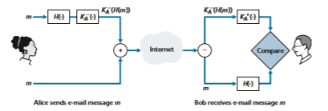
**Figure 8.20**  ♦   Using hash functions and digital signatures to provide sender authentication and message integrity

message digest and (2) compares the result of this operation with his own hash, _H_, of the message. The steps are illustrated in Figure 8.20. As discussed in Section 8.3, if the two results are the same, Bob can be pretty confident that the message came from Alice and is unaltered.

Now let’s consider designing an e-mail system that provides confidentiality, sender authentication, _and_ message integrity. This can be done by combining the procedures in Figures 8.19 and 8.20. Alice first creates a preliminary package, exactly as in Figure 8.20, that consists of her original message along with a digitally signed hash of the message. She then treats this preliminary package as a message in itself and sends this new message through the sender steps in Figure 8.19, creating a new package that is sent to Bob. The steps applied by Alice are shown in Figure 8.21. When Bob receives the package, he first applies his side of Figure 8.19 and then his

**Figure 8.21**  ♦   Alice uses symmetric key cyptography, public key cryptography, a hash function, and a digital signature to provide secrecy, sender authentication, and message integrity 

side of Figure 8.20. It should be clear that this design achieves the goal of provid- ing confidentiality, sender authentication, and message integrity. Note that, in this scheme, Alice uses public key cryptography twice: once with her own private key and once with Bob’s public key. Similarly, Bob also uses public key cryptography twice—once with his private key and once with Alice’s public key.

The secure e-mail design outlined in Figure 8.21 probably provides satisfactory security for most e-mail users for most occasions. However, there is still one important issue that remains to be addressed. The design in Figure 8.21 requires Alice to obtain Bob’s public key, and requires Bob to obtain Alice’s public key. The distribution of these public keys is a nontrivial problem. For example, Trudy might masquerade as Bob and give Alice her own public key while saying that it is Bob’s public key, enabling her to receive the message meant for Bob. As we learned in Section 8.3, a popular approach for securely distributing public keys is to _certify_ the public keys using a CA.

### PGP
Written by Phil Zimmermann in 1991, **Pretty Good Privacy (PGP)**is a nice exam- ple of an e-mail encryption scheme \[PGP 2020\]. The PGP design is, in essence, the same as the design shown in Figure 8.21. Depending on the version, the PGP soft- ware uses MD5 or SHA for calculating the message digest; CAST, triple-DES, or IDEA for symmetric key encryption; and RSA for the public key encryption.

When PGP is installed, the software creates a public key pair for the user. The public key can be posted on the user’s Web site or placed in a public key server. The private key is protected by the use of a password. The password has to be entered every time the user accesses the private key. PGP gives the user the option of dig- itally signing the message, encrypting the message, or both digitally signing and encrypting. Figure 8.22 shows a PGP signed message. This message appears after the MIME header. The encoded data in the message is _K_\-_A_ (_H_(_m_)), that is, the digi- tally signed message digest. As we discussed above, in order for Bob to verify the integrity of the message, he needs to have access to Alice’s public key.

**Figure 8.22**  ♦  A PGP signed message

**Figure 8.23**♦ A secret PGP message 

shows a secret PGP message. This message also appears after the MIME header. Of course, the plaintext message is not included within the secret e-mail message. When a sender (such as Alice) wants both confidentiality and integrity, PGP contains a message like that of Figure 8.23 within the message of Figure 8.22.

PGP also provides a mechanism for public key certification, but the mechanism is quite different from the more conventional CA. PGP public keys are certified by a _web of trust._ Alice herself can certify any key/username pair when she believes the pair really belong together. In addition, PGP permits Alice to say that she trusts another user to vouch for the authenticity of more keys. Some PGP users sign each other’s keys by holding key-signing parties. Users physically gather, exchange public keys, and certify each other’s keys by signing them with their private keys.

## Securing TCP Connections: TLS
In the previous section, we saw how cryptographic techniques can provide confiden- tiality, data integrity, and end-point authentication to a specific application, namely, e-mail. In this section, we’ll drop down a layer in the protocol stack and examine how cryptography can enhance TCP with security services, including confidentiality, data integrity, and end-point authentication. This enhanced version of TCP is commonly known as **Transport Layer Security (TLS)**, which has been standardized by the IETF \[RFC 4346\]. An earlier and similar version of this protocol is SSL version 3.

The SSL protocol was originally designed by Netscape, but the basic ideas behind securing TCP had predated Netscape’s work (for example, see Woo \[Woo 1994\]). Since its inception, SSL and its successor TLS have enjoyed broad deploy- ment. TLS is supported by all popular Web browsers and Web servers, and it is used by Gmail and essentially all Internet commerce sites (including Amazon, eBay, and TaoBao). Hundreds of billions of dollars are spent over TLS every year. In fact, if you have ever purchased anything over the Internet with your credit card, the communica- tion between your browser and the server for this purchase almost certainly went over TLS. (You can identify that TLS is being used by your browser when the URL begins with https: rather than http.)

To understand the need for TLS, let’s walk through a typical Internet commerce scenario. Bob is surfing the Web and arrives at the Alice Incorporated site, which is selling perfume. The Alice Incorporated site displays a form in which Bob is sup- posed to enter the type of perfume and quantity desired, his address, and his pay- ment card number. Bob enters this information, clicks on Submit, and expects to receive (via ordinary postal mail) the purchased perfumes; he also expects to receive a charge for his order in his next payment card statement. This all sounds good, but if no security measures are taken, Bob could be in for a few surprises.

• If no confidentiality (encryption) is used, an intruder could intercept Bob’s order and obtain his payment card information. The intruder could then make purchases at Bob’s expense.

• If no data integrity is used, an intruder could modify Bob’s order, having him purchase ten times more bottles of perfume than desired.

• Finally, if no server authentication is used, a server could display Alice Incor- porated’s famous logo when in actuality the site maintained by Trudy, who is masquerading as Alice Incorporated. After receiving Bob’s order, Trudy could take Bob’s money and run. Or Trudy could carry out an identity theft by collect- ing Bob’s name, address, and credit card number.

TLS addresses these issues by enhancing TCP with confidentiality, data integrity, server authentication, and client authentication.

TLS is often used to provide security to transactions that take place over HTTP. However, because TLS secures TCP, it can be employed by any application that runs over TCP. TLS provides a simple Application Programmer Interface (API) with sockets, which is similar and analogous to TCP’s API. When an application wants to employ TLS, the application includes SSL classes/libraries. As shown in Figure 8.24, although TLS technically resides in the application layer, from the developer’s perspective it is a transport protocol that provides TCP’s services enhanced with security services.

**Figure 8.24**  ♦   Although TLS technically resides in the application layer, from the developer’s perspective it is a transport-layer protocol

### The Big Picture
 We begin by describing a simplified version of TLS, one that will allow us to get a big-picture understanding of the _why_ and _how_ of TLS. We will refer to this simpli- fied version of TLS as “almost-TLS.” After describing almost-TLS, in the next sub- section we’ll then describe the real TLS, filling in the details. Almost-TLS (and TLS) has three phases: _handshake_, _key derivation_, and _data transfer_. We now describe these three phases for a communication session between a client (Bob) and a server (Alice), with Alice having a private/public key pair and a certificate that binds her identity to her public key.

**Handshake**

During the handshake phase, Bob needs to (a) establish a TCP connection with Alice, (b) verify that Alice is _really_ Alice, and (c) send Alice a master secret key, which will be used by both Alice and Bob to generate all the symmetric keys they need for the TLS session. These three steps are shown in Figure 8.25. Note that once the TCP connection is established, Bob sends Alice a hello message. Alice then responds with her certificate, which contains her public key. As discussed in Section 8.3, because the certificate has been certified by a CA, Bob knows for sure that the public key in the certificate belongs to Alice. Bob then generates a Master Secret (MS) (which will only be used for this TLS session), encrypts the MS with Alice’s public key to create

**Figure 8.25**  ♦   The almost-TLS handshake, beginning with a TCP connection
the Encrypted Master Secret (EMS), and sends the EMS to Alice. Alice decrypts the EMS with her private key to get the MS. After this phase, both Bob and Alice (and no one else) know the master secret for this TLS session.

**Key Derivation**

In principle, the MS, now shared by Bob and Alice, could be used as the symmetric session key for all subsequent encryption and data integrity checking. It is, however, generally considered safer for Alice and Bob to each use different cryptographic keys, and also to use different keys for encryption and integrity checking. Thus, both Alice and Bob use the MS to generate four keys:

• EB = session encryption key for data sent from Bob to Alice

• MB = session HMAC key for data sent from Bob to Alice, where HMAC \[RFC 2104\] is a standardized hashed message authentication code (MAC) that we encountered in section 8.3.2

• EA = session encryption key for data sent from Alice to Bob

• MA = session HMAC key for data sent from Alice to Bob

Alice and Bob each generate the four keys from the MS. This could be done by sim- ply slicing the MS into four keys. (But in _reality_ TLS it is a little more complicated, as we’ll see.) At the end of the key derivation phase, both Alice and Bob have all four keys. The two encryption keys will be used to encrypt data; the two HMAC keys will be used to verify the integrity of the data.

**Data Transfer**

Now that Alice and Bob share the same four session keys (EB, MB, EA, and MA), they can start to send secured data to each other over the TCP connection. Since TCP is a byte-stream protocol, a natural approach would be for TLS to encrypt application data on the fly and then pass the encrypted data on the fly to TCP. But if we were to do this, where would we put the HMAC for the integrity check? We certainly do not want to wait until the end of the TCP session to verify the integrity of all of Bob’s data that was sent over the entire session! To address this issue, TLS breaks the data stream into records, appends an HMAC to each record for integrity checking, and then encrypts the record+HMAC. To create the HMAC, Bob inputs the record data along with the key MB into a hash function, as discussed in Section 8.3. To encrypt the package record+HMAC, Bob uses his session encryption key EB. This encrypted package is then passed to TCP for transport over the Internet.

Although this approach goes a long way, it still isn’t bullet-proof when it comes to providing data integrity for the entire message stream. In particular, suppose Trudy is a woman-in-the-middle and has the ability to insert, delete, and replace segments in the stream of TCP segments sent between Alice and Bob. Trudy, forexample, could capture two segments sent by Bob, reverse the order of the seg- ments, adjust the TCP sequence numbers (which are not encrypted), and then send the two reverse-ordered segments to Alice. Assuming that each TCP segment encapsulates exactly one record, let’s now take a look at how Alice would process these segments.

1\. TCP running in Alice would think everything is fine and pass the two records to the TLS sublayer.

2\. TLS in Alice would decrypt the two records. 

3\. TLS in Alice would use the HMAC in each record to verify the data integrity

of the two records. 

4\. TLS would then pass the decrypted byte streams of the two records to the

application layer; but the complete byte stream received by Alice would not be in the correct order due to reversal of the records!

You are encouraged to walk through similar scenarios for when Trudy removes seg- ments or when Trudy replays segments.

The solution to this problem, as you probably guessed, is to use sequence num- bers. TLS does this as follows. Bob maintains a sequence number counter, which begins at zero and is incremented for each TLS record he sends. Bob doesn’t actually include a sequence number in the record itself, but when he calculates the HMAC, he includes the sequence number in the HMAC calculation. Thus, the HMAC is now a hash of the data plus the HMAC key MB _plus the current sequence number_. Alice tracks Bob’s sequence numbers, allowing her to verify the data integrity of a record by including the appropriate sequence number in the HMAC calculation. This use of TLS sequence numbers prevents Trudy from carrying out a woman-in-the-middle attack, such as reordering or replaying segments. (Why?)

**TLS Record**

The TLS record (as well as the almost-TLS record) is shown in Figure 8.26. The record consists of a type field, version field, length field, data field, and HMAC field. Note that the first three fields are not encrypted. The type field indicates whether the record is a handshake message or a message that contains application data. It is also used to close the TLS connection, as discussed below. TLS at the receiving end uses the length field to extract the TLS records out of the incoming TCP byte stream. The version field is self-explanatory.
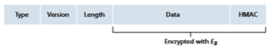
**Figure 8.26**  ♦  Record format for TLS

### A More Complete Picture
The previous subsection covered the almost-TLS protocol; it served to give us a basic understanding of the why and how of TLS. Now that we have a basic under- standing, we can dig a little deeper and examine the essentials of the actual TLS pro- tocol. In parallel to reading this description of the TLS protocol, you are encouraged to complete the Wireshark TLS lab, available at the textbook’s Web site.

**TLS Handshake**

SSL does not mandate that Alice and Bob use a specific symmetric key algorithm or a specific public-key algorithm. Instead, TLS allows Alice and Bob to agree on the cryptographic algorithms at the beginning of the TLS session, during the handshake phase. Additionally, during the handshake phase, Alice and Bob send nonces to each other, which are used in the creation of the session keys (EB, MB, EA, and MA). The steps of the real TLS handshake are as follows:

1\. The client sends a list of cryptographic algorithms it supports, along with a client nonce.

2\. From the list, the server chooses a symmetric algorithm (for example, AES) and a public key algorithm (for example, RSA with a specific key length), and HMAC algorithm (MD5 or SHA-1) along with the HMAC keys. It sends back to the client its choices, as well as a certificate and a server nonce.

3\. The client verifies the certificate, extracts the server’s public key, generates a Pre-Master Secret (PMS), encrypts the PMS with the server’s public key, and sends the encrypted PMS to the server.

4\. Using the same key derivation function (as specified by the TLS standard), the client and server independently compute the Master Secret (MS) from the PMS and nonces. The MS is then sliced up to generate the two encryption and two HMAC keys. Furthermore, when the chosen symmetric cipher employs CBC (such as 3DES or AES), then two Initialization Vectors (IVs)—one for each side of the connection—are also obtained from the MS. Henceforth, all messages sent between client and server are encrypted and authenticated (with the HMAC).

5\. The client sends the HMAC of all the handshake messages. 6. The server sends the HMAC of all the handshake messages.

The last two steps protect the handshake from tampering. To see this, observe that in step 1, the client typically offers a list of algorithms—some strong, some weak. This list of algorithms is sent in cleartext, since the encryption algorithms and keys have not yet been agreed upon. Trudy, as a woman-in-the-middle, could delete the stronger algorithms from the list, forcing the client to select a weak algorithm. Toprevent such a tampering attack, in step 5, the client sends the HMAC of the concat- enation of all the handshake messages it sent and received. The server can compare this HMAC with the HMAC of the handshake messages it received and sent. If there is an inconsistency, the server can terminate the connection. Similarly, the server sends the HMAC of the handshake messages it has seen, allowing the client to check for inconsistencies.

You may be wondering why there are nonces in steps 1 and 2. Don’t sequence numbers suffice for preventing the segment replay attack? The answer is yes, but they don’t alone prevent the “connection replay attack.” Consider the following connection replay attack. Suppose Trudy sniffs all messages between Alice and Bob. The next day, Trudy masquerades as Bob and sends to Alice exactly the same sequence of messages that Bob sent to Alice on the previous day. If Alice doesn’t use nonces, she will respond with exactly the same sequence of messages she sent the previous day. Alice will not suspect any funny business, as each message she receives will pass the integrity check. If Alice is an e-commerce server, she will think that Bob is placing a second order (for exactly the same thing). On the other hand, by including a nonce in the protocol, Alice will send different nonces for each TCP session, causing the encryption keys to be different on the two days. Therefore, when Alice receives played-back TLS records from Trudy, the records will fail the integrity checks, and the bogus e-commerce transaction will not succeed. In sum- mary, in TLS, nonces are used to defend against the “connection replay attack” and sequence numbers are used to defend against replaying individual packets during an ongoing session.

**Connection Closure**

At some point, either Bob or Alice will want to end the TLS session. One approach would be to let Bob end the TLS session by simply terminating the underlying TCP connection—that is, by having Bob send a TCP FIN segment to Alice. But such a naive design sets the stage for the _truncation attack_ whereby Trudy once again gets in the middle of an ongoing TLS session and ends the session early with a TCP FIN. If Trudy were to do this, Alice would think she received all of Bob’s data when actuality she only received a portion of it. The solution to this problem is to indicate in the type field whether the record serves to terminate the TLS session. (Although the TLS type is sent in the clear, it is authenticated at the receiver using the record’s HMAC.) By including such a field, if Alice were to receive a TCP FIN before receiving a closure TLS record, she would know that something funny was going on.

This completes our introduction to TLS. We’ve seen that it uses many of the cryptography principles discussed in Sections 8.2 and 8.3. Readers who want to explore TLS on yet a deeper level can read Rescorla’s highly readable book on SSL/ TLS \[Rescorla 2001\].

## Network-Layer Security: IPsec and Virtual Private Networks

The IP security protocol, more commonly known as **IPsec**, provides security at the network layer. IPsec secures IP datagrams between any two network-layer entities, including hosts and routers. As we will soon describe, many institutions (corpora- tions, government branches, non-profit organizations, and so on) use IPsec to create **virtual private networks (VPNs)** that run over the public Internet.

Before getting into the specifics of IPsec, let’s step back and consider what it means to provide confidentiality at the network layer. With network-layer con- fidentiality between a pair of network entities (for example, between two routers, between two hosts, or between a router and a host), the sending entity encrypts the payloads of all the datagrams it sends to the receiving entity. The encrypted payload could be a TCP segment, a UDP segment, an ICMP message, and so on. If such a network-layer service were in place, all data sent from one entity to the other— including e-mail, Web pages, TCP handshake messages, and management mes- sages (such as ICMP and SNMP)—would be hidden from any third party that might be sniffing the network. For this reason, network-layer security is said to provide “blanket coverage.”

In addition to confidentiality, a network-layer security protocol could potentially provide other security services. For example, it could provide source authentication, so that the receiving entity can verify the source of the secured datagram. A network- layer security protocol could provide data integrity, so that the receiving entity can check for any tampering of the datagram that may have occurred while the datagram was in transit. A network-layer security service could also provide replay-attack pre- vention, meaning that Bob could detect any duplicate datagrams that an attacker might insert. We will soon see that IPsec indeed provides mechanisms for all these security services, that is, for confidentiality, source authentication, data integrity, and replay-attack prevention.

### IPsec and Virtual Private Networks (VPNs)

An institution that extends over multiple geographical regions often desires its own IP network, so that its hosts and servers can send data to each other in a secure and confidential manner. To achieve this goal, the institution could actually deploy a stand-alone physical network—including routers, links, and a DNS infrastructure— that is completely separate from the public Internet. Such a disjoint network, dedi- cated to a particular institution, is called a **private network. Not surprisingly, a private network can be very costly, as the institution needs to purchase, install, and maintain its own physical network infrastructure.

Instead of deploying and maintaining a private network, many institutions today create VPNs over the existing public Internet. With a VPN, the institution’s inter-office traffic is sent over the public Internet rather than over a physically

**Figure 8.27**  ♦  Virtual private network (VPN)

independent network. But to provide confidentiality, the inter-office traffic is encrypted before it enters the public Internet. A simple example of a VPN is shown in Figure 8.27. Here the institution consists of a headquarters, a branch office, and traveling salespersons that typically access the Internet from their hotel rooms. (There is only one salesperson shown in the figure.) In this VPN, whenever two hosts within headquarters send IP datagrams to each other or whenever two hosts within the branch office want to communicate, they use good-old vanilla IPv4 (that is, without IPsec services). However, when two of the institution’s hosts commu- nicate over a path that traverses the public Internet, the traffic is encrypted before it enters the Internet.

To get a feel for how a VPN works, let’s walk through a simple example in the context of Figure 8.27. When a host in headquarters sends an IP datagram to a sales- person in a hotel, the gateway router in headquarters converts the vanilla IPv4 data- gram into an IPsec datagram and then forwards this IPsec datagram into the Internet. This IPsec datagram actually has a traditional IPv4 header, so that the routers in the public Internet process the datagram as if it were an ordinary IPv4 datagram—to them, the datagram is a perfectly ordinary datagram. But, as shown Figure 8.27, the payload of the IPsec datagram includes an IPsec header, which is used for IPsec processing; furthermore, the payload of the IPsec datagram is encrypted. When the

Public Internet IP sec datagram arrives at the salesperson’s laptop, the OS in the laptop decrypts the payload (and provides other security services, such as verifying data integrity) and passes the unencrypted payload to the upper-layer protocol (for example, to TCP or UDP).

We have just given a high-level overview of how an institution can employ IPsec to create a VPN. To see the forest through the trees, we have brushed aside many important details. Let’s now take a closer look.

### The AH and ESP Protocols
 IPsec is a rather complex animal—it is defined in more than a dozen RFCs. Two important RFCs are RFC 4301, which describes the overall IP security architecture, and RFC 6071, which provides an overview of the IPsec protocol suite. Our goal in this textbook, as usual, is not simply to re-hash the dry and arcane RFCs, but instead take a more operational and pedagogic approach to describing the protocols.

In the IPsec protocol suite, there are two principal protocols: the **Authentication Header (AH)** protocol and the **Encapsulation Security Payload (ESP)** protocol. When a source IPsec entity (typically a host or a router) sends secure datagrams to a destination entity (also a host or a router), it does so with either the AH protocol or the ESP protocol. The AH protocol provides source authentication and data integrity but _does not_ provide confidentiality. The ESP protocol provides source authentica- tion, data integrity, _and_ confidentiality. Because confidentiality is often critical for VPNs and other IPsec applications, the ESP protocol is much more widely used than the AH protocol. In order to de-mystify IPsec and avoid much of its complication, we will henceforth focus exclusively on the ESP protocol. Readers wanting to learn also about the AH protocol are encouraged to explore the RFCs and other online resources.

### Security Associations
IPsec datagrams are sent between pairs of network entities, such as between two hosts, between two routers, or between a host and router. Before sending IPsec datagrams from source entity to destination entity, the source and destination entities create a network-layer logical connection. This logical connection is called a **security asso- ciation (SA)
. An SA is a simplex logical connection; that is, it is unidirectional from source to destination. If both entities want to send secure datagrams to each other, then two SAs (that is, two logical connections) need to be established, one in each direction.

For example, consider once again the institutional VPN in Figure 8.27. This institution consists of a headquarters office, a branch office and, say, _n_ traveling salespersons. For the sake of example, let’s suppose that there is bi-directional IPsec traffic between headquarters and the branch office and bi-directional IPsec traffic between headquarters and the salespersons. In this VPN, how many SAs are there? To answer this question, note that there are two SAs between the headquarters gate- way router and the branch-office gateway router (one in each direction); for each

**Figure 8.28**  ♦  Security association (SA) from R1 to R2

salesperson’s laptop, there are two SAs between the headquarters gateway router and the laptop (again, one in each direction). So, in total, there are (2 + 2_n_) SAs. _Keep in mind, however, that not all traffic sent into the Internet by the gateway routers or by the laptops will be IPsec secured._ For example, a host in headquarters may want to access a Web server (such as Amazon or Google) in the public Internet. Thus, the gateway router (and the laptops) will emit into the Internet both vanilla IPv4 datagrams and secured IPsec datagrams.

Let’s now take a look “inside” an SA. To make the discussion tangible and concrete, let’s do this in the context of an SA from router R1 to router R2 in Figure 8.28. (You can think of Router R1 as the headquarters gateway router and Router R2 as the branch office gateway router from Figure 8.27.) Router R1 will maintain state information about this SA, which will include:

• A 32-bit identifier for the SA, called the **Security Parameter Index (SPI)**

• The origin interface of the SA (in this case 200.168.1.100) and the destination interface of the SA (in this case 193.68.2.23)

• The type of encryption to be used (for example, 3DES with CBC)

• The encryption key

• The type of integrity check (for example, HMAC with MD5)

• The authentication key

Whenever router R1 needs to construct an IPsec datagram for forwarding over this SA, it accesses this state information to determine how it should authenticate and encrypt the datagram. Similarly, router R2 will maintain the same state informa- tion for this SA and will use this information to authenticate and decrypt any IPsec datagram that arrives from the SA.

An IPsec entity (router or host) often maintains state information for many SAs. For example, in the VPN example in Figure 8.27 with _n_ salespersons, the headquar- ters gateway router maintains state information for (2 + 2_n_) SAs. An IPsec entity stores the state information for all of its SAs in its **Security Association Database** (**SAD**), which is a data structure in the entity’s OS kernel.

### The IPsec Datagram

Having now described SAs, we can now describe the actual IPsec datagram. IPsec has two different packet forms, one for the so-called **tunnel modeand the other for the so-called **transport mode
. The tunnel mode, being more appropriate for VPNs, is more widely deployed than the transport mode. In order to further de-mystify IPsec and avoid much of its complication, we henceforth focus exclusively on the tunnel mode. Once you have a solid grip on the tunnel mode, you should be able to easily learn about the transport mode on your own.

The packet format of the IPsec datagram is shown in Figure 8.29. You might think that packet formats are boring and insipid, but we will soon see that the IPsec datagram actually looks and tastes like a popular Tex-Mex delicacy! Let’s examine the IPsec fields in the context of Figure 8.28. Suppose router R1 receives an ordinary IPv4 datagram from host 172.16.1.17 (in the headquarters network) which is destined to host 172.16.2.48 (in the branch-office network). Router R1 uses the following recipe to convert this “original IPv4 datagram” into an IPsec datagram:

• Appends to the back of the original IPv4 datagram (which includes the original header fields!) an “ESP trailer” field

• Encrypts the result using the algorithm and key specified by the SA

• Appends to the front of this encrypted quantity a field called “ESP header”; the resulting package is called the “enchilada”

• Creates an authentication MAC over the _whole enchilada_ using the algorithm and key specified in the SA

• Appends the MAC to the back of the enchilada forming the _payload_

• Finally, creates a brand new IP header with all the classic IPv4 header fields (together normally 20 bytes long), which it appends before the payload

Note that the resulting IPsec datagram is a bona fide IPv4 datagram, with the traditional IPv4 header fields followed by a payload. But in this case, the payload
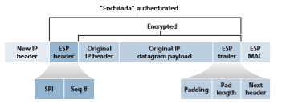
**Figure 8.29**  ♦  IPsec datagram format
contains an ESP header, the original IP datagram, an ESP trailer, and an ESP authen- tication field (with the original datagram and ESP trailer encrypted). The original IP datagram has 172.16.1.17 for the source IP address and 172.16.2.48 for the destina- tion IP address. Because the IPsec datagram includes the original IP datagram, these addresses are included (and encrypted) as part of the payload of the IPsec packet. But what about the source and destination IP addresses that are in the new IP header, that is, in the left-most header of the IPsec datagram? As you might expect, they are set to the source and destination router interfaces at the two ends of the tunnels, namely, 200.168.1.100 and 193.68.2.23. Also, the protocol number in this new IPv4 header field is not set to that of TCP, UDP, or SMTP, but instead to 50, designating that this is an IPsec datagram using the ESP protocol.

After R1 sends the IPsec datagram into the public Internet, it will pass through many routers before reaching R2. Each of these routers will process the datagram as if it were an ordinary datagram—they are completely oblivious to the fact that the datagram is carrying IPsec-encrypted data. For these public Internet routers, because the destina- tion IP address in the outer header is R2, the ultimate destination of the datagram is R2.

Having walked through an example of how an IPsec datagram is constructed, let’s now take a closer look at the ingredients in the enchilada. We see in Figure 8.29 that the ESP trailer consists of three fields: padding; pad length; and next header. Recall that block ciphers require the message to be encrypted to be an integer mul- tiple of the block length. Padding (consisting of meaningless bytes) is used so that when added to the original datagram (along with the pad length and next header fields), the resulting “message” is an integer number of blocks. The pad-length field indicates to the receiving entity how much padding was inserted (and thus needs to be removed). The next header identifies the type (e.g., UDP) of data contained in the payload-data field. The payload data (typically the original IP datagram) and the ESP trailer are concatenated and then encrypted.

Appended to the front of this encrypted unit is the ESP header, which is sent in the clear and consists of two fields: the SPI and the sequence number field. The SPI indicates to the receiving entity the SA to which the datagram belongs; the receiving entity can then index its SAD with the SPI to determine the appropriate authentica- tion/decryption algorithms and keys. The sequence number field is used to defend against replay attacks.

The sending entity also appends an authentication MAC. As stated earlier, the sending entity calculates a MAC over the whole enchilada (consisting of the ESP header, the original IP datagram, and the ESP trailer—with the datagram and trailer being encrypted). Recall that to calculate a MAC, the sender appends a secret MAC key to the enchilada and then calculates a fixed-length hash of the result.

When R2 receives the IPsec datagram, R2 observes that the destination IP address of the datagram is R2 itself. R2 therefore processes the datagram. Because the protocol field (in the left-most IP header) is 50, R2 sees that it should apply IPsec ESP processing to the datagram. First, peering into the enchilada, R2 uses the SPI to determine to which SA the datagram belongs. Second, it calculates the MAC of the enchilada and verifies that the MAC is consistent with the value in the ESPMAC field. If it is, it knows that the enchilada comes from R1 and has not been tam- pered with. Third, it checks the sequence-number field to verify that the datagram is fresh (and not a replayed datagram). Fourth, it decrypts the encrypted unit using the decryption algorithm and key associated with the SA. Fifth, it removes padding and extracts the original, vanilla IP datagram. And finally, sixth, it forwards the original datagram into the branch office network toward its ultimate destination. Whew, what a complicated recipe, huh? Well no one ever said that preparing and unraveling an enchilada was easy!

There is actually another important subtlety that needs to be addressed. It centers on the following question: When R1 receives an (unsecured) datagram from a host in the headquarters network, and that datagram is destined to some destination IP address outside of headquarters, how does R1 know whether it should be converted to an IPsec datagram? And if it is to be processed by IPsec, how does R1 know which SA (of many SAs in its SAD) should be used to construct the IPsec datagram? The prob- lem is solved as follows. Along with a SAD, the IPsec entity also maintains another data structure called the **Security Policy Database (SPD)**. The SPD indicates what types of datagrams (as a function of source IP address, destination IP address, and protocol type) are to be IPsec processed; and for those that are to be IPsec processed, which SA should be used. In a sense, the information in a SPD indicates “what” to do with an arriving datagram; the information in the SAD indicates “how” to do it.

**Summary of IPsec Services**

So what services does IPsec provide, exactly? Let us examine these services from the perspective of an attacker, say Trudy, who is a woman-in-the-middle, sitting somewhere on the path between R1 and R2 in Figure 8.28. Assume throughout this discussion that Trudy does not know the authentication and encryption keys used by the SA. What can and cannot Trudy do? First, Trudy cannot see the original datagram. If fact, not only is the data in the original datagram hidden from Trudy, but so is the protocol number, the source IP address, and the destination IP address. For datagrams sent over the SA, Trudy only knows that the datagram originated from 200.168.1.100 and is destined to 193.68.2.23. She does not know if it is carry- ing TCP, UDP, or ICMP data; she does not know if it is carrying HTTP, SMTP, or some other type of application data. This confidentiality thus goes a lot farther than SSL. Second, suppose Trudy tries to tamper with a datagram in the SA by flipping some of its bits. When this tampered datagram arrives at R2, it will fail the integ- rity check (using the MAC), thwarting Trudy’s vicious attempts once again. Third, suppose Trudy tries to masquerade as R1, creating a IPsec datagram with source 200.168.1.100 and destination 193.68.2.23. Trudy’s attack will be futile, as this datagram will again fail the integrity check at R2. Finally, because IPsec includes sequence numbers, Trudy will not be able create a successful replay attack. In sum- mary, as claimed at the beginning of this section, IPsec provides—between any pair of devices that process packets through the network layer—confidentiality, source authentication, data integrity, and replay-attack prevention.

### IKE: Key Management in IPsec
When a VPN has a small number of end points (for example, just two routers as in Figure 8.28), the network administrator can manually enter the SA information (encryption/authentication algorithms and keys, and the SPIs) into the SADs of the endpoints. Such “manual keying” is clearly impractical for a large VPN, which may consist of hundreds or even thousands of IPsec routers and hosts. Large, geo- graphically distributed deployments require an automated mechanism for creating the SAs. IPsec does this with the Internet Key Exchange (IKE) protocol, specified in RFC 5996.

IKE has some similarities with the handshake in SSL (see Section 8.6). Each IPsec entity has a certificate, which includes the entity’s public key. As with SSL, the IKE protocol has the two entities exchange certificates, negotiate authentication and encryption algorithms, and securely exchange key material for creating session keys in the IPsec SAs. Unlike SSL, IKE employs two phases to carry out these tasks.

Let’s investigate these two phases in the context of two routers, R1 and R2, in Figure 8.28. The first phase consists of two exchanges of message pairs between R1 and R2:

• During the first exchange of messages, the two sides use Diffie-Hellman (see Homework Problems) to create a bi-directional **IKE SA** between the routers. To keep us all confused, this bi-directional IKE SA is entirely different from the IPsec SAs discussed in Sections 8.6.3 and 8.6.4. The IKE SA provides an authen- ticated and encrypted channel between the two routers. During this first message- pair exchange, keys are established for encryption and authentication for the IKE SA. Also established is a master secret that will be used to compute IPSec SA keys later in phase 2. Observe that during this first step, RSA public and private keys are not used. In particular, neither R1 nor R2 reveals its identity by signing a message with its private key.

• During the second exchange of messages, both sides reveal their identity to each other by signing their messages. However, the identities are not revealed to a pas- sive sniffer, since the messages are sent over the secured IKE SA channel. Also during this phase, the two sides negotiate the IPsec encryption and authentication algorithms to be employed by the IPsec SAs.In phase 2 of IKE, the two sides create an SA in each direction. At the end of phase 2, the encryption and authentication session keys are established on both sides for the two SAs. The two sides can then use the SAs to send secured datagrams, as described in Sections 8.7.3 and 8.7.4. The primary motivation for having two phases in IKE is computational cost—since the second phase doesn’t involve any public- key cryptography, IKE can generate a large number of SAs between the two IPsec entities with relatively little computational cost.

## Securing Wireless LANs and 4G/5G Cellular Networks

Security is a particularly important concern in wireless networks, where the attacker can sniff frames by simply positioning a receiving device anywhere within the trans- mission range of the sender. This is true in both 802.11 wireless LANs, as well as in 4G/5G cellular networks. In both settings, we’ll see extensive use of the fundamental security techniques that we studied earlier in this chapter, including the use of nonces for authentication, cryptographic hashing for message integrity, derivation of shared symmetric keys for encrypting user-session data, and the extensive use of the AES encryption standard. We will also see, as is also the case in wired Internet settings, that wireless security protocols have undergone constant evolution, as researchers and hackers discover weaknesses and flaws in existing security protocols.

In this section, we present a brief introduction to wireless security in both 802.11(WiFi) and 4G/5G settings. For a more in-depth treatment, see the highly read- able 802.11 security books \[Edney 2003; Wright 2015\], the excellent coverage of 3G/4G/5G security in \[Sauter 2014\], and recent surveys \[Zou 2016; Kohlios 2018\].

### Authentication and Key Agreement in 802.11 Wireless LANs

Let’s start our discussion of 802.11 security by identifying two (of many \[Zou 2016\]) critical security concerns that we’ll want an 802.11 network to handle:

• _Mutual authentication._ Before a mobile device is allowed to fully attach to an access point and send datagrams to remote hosts, the network will typically want to first authenticate the device—to verify the identity of the mobile device attach- ing to the network, and to check that device’s access privileges. Similarly, the mobile device will want to authenticate the network to which it is attaching—to make sure that the network it is joining is truly the network to which it wants to attach. This two-way authentication is known as **mutual authentication**.

• _Encryption._ Since 802.11 frames will be exchanged over a wireless channel that can be sniffed and manipulated by potential ne’er do-wells, it will be important to encrypt link-level frames carrying user-level data exchanged between the mobile device and the access point (AP). Symmetric key encryption is used in practice, since encryption and decryption must be performed at high speeds. The mobile device and AP will need to derive the symmetric encryption and decryption keys to be used.

Figure 8.30 illustrates the scenario of a mobile device wishing to attach to an 802.11 network. We see the two usual network components that we encountered

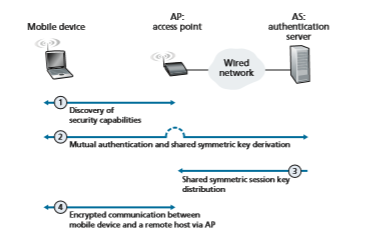
**Figure 8.30**  ♦   Mutual authentication and encryption-key derivation in WPA

in our earlier study of 802.11 networks in Section 7.3—the mobile device and the AP. We also see a new architectural component, the **authentication server** (AS) that will be responsible for authenticating the mobile device. The authentication server might be co-located in the AP, but more typically and as shown in Figure 8.30, it is implemented as a separate server that provides authentication services. For authen- tication, the AP serves as a pass-through device, relaying authentication and key derivation messages between the mobile device and the authentication server. Such an authentication server would typically provide authentication services for all APs within its network.

We can identify four distinct phases to the process of mutual authentication and encryption-key derivation and use in Figure 8.30:

1\. _Discovery._ In the discovery phase, the AP advertises its presence and the forms of authentication and encryption that can be provided to the mobile device. The mobile device then requests the specific forms of authentication and encryption that it desires. Although the device and AP are already exchanging messages, the device has not yet been authenticated nor does it have an encryption key for frame transmission over the wireless link, and so several more steps will be required before the device can communicate securely through the AP.

2\. _Mutual authentication and shared symmetric key derivation._ This is the most critical step in “securing” the 802.11 channel. As we will see, this step is

greatly facilitated by assuming (which is true in practice in both 802.11 and 4G/5G networks) that the authentication server and the mobile device already have a **shared common secret** before starting mutual authentication. In this step, the device and the authentication server will use this shared secret along with nonces (to prevent relay attacks) and cryptographic hashing (to ensure message integrity) in authenticating each other. They will also derive the shared session key to be used by the mobile device and the AP to encrypt frames transmitted over the 802.11 wireless link.

3\. _Shared symmetric session key distribution._ Since the symmetric encryption key is derived at the mobile device and the authentication server, a protocol will be needed for the authentication server to inform the AP of the shared symmetric session key. While this is rather straightforward, it still is a necessary step.

4\. _Encrypted communication between mobile device and a remote host via the AP._ This communication happens as we saw earlier in Section 7.3.2, with the link-layer frames sent between the mobile device and the AP being encrypted using the shared session key created and distributed by Steps 2 and 3. AES symmetric key cryptography, which we covered earlier in Section 8.2.1, is typically used in practice for encrypting/decrypting 802.11 frame data.

**Mutual Authentication and Shared Symmetric Session Key Derivation**

The topics of mutual authentication and shared symmetric session key derivation are the central components of 802.11 security. Since it is here that security flaws in various ear- lier versions of 802.11 security have been discovered, let’s tackle these challenges first.

The issue of 802.11security has attracted considerable attention in both technical circles and in the media. While there has been considerable discussion, there has been little debate—there is universal agreement that the original 802.11security specifica- tion known collectively as Wired Equivalent Privacy (WEP) contained a number of serious security flaws \[Fluhrer 2001; Stubblefield 2002\]. Once these flaws were discovered, public domain software was soon available exploiting these holes, mak- ing users of WEP-secured 802.11 WLANs as open to security attacks as users who used no security features at all. Readers interested in learning about WEP can consult the references, as well as earlier editions of this textbook, which covered WEP. As always, retired material from this book is available on the Companion Website.

WiFi Protected Access (WPA1) was developed in 2003 by the WiFi Alli- ance \[WiFi 2020\] to overcome WEP’s security flaws. The initial version of WPA1 improved on WEP by introducing message integrity checks, and avoiding attacks that allowed a user to infer encryption keys after observing the stream of encrypted messages for a period of time. WPA1 soon gave way to WPA2, which mandated the use of AES symmetric key encryption.

At the heart of WPA is a four-way handshake protocol that performs both mutual authentication and shared symmetric session-key derivation. The handshake protocol is shown in Figure 8.31 in simplified form. Note that both the mobile device (M) and the authentication server (AS) begin knowing a shared secret key _KAS-M_
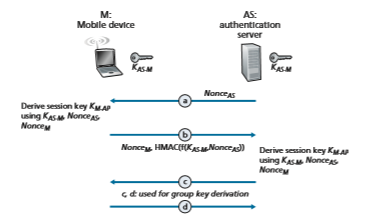
**Figure 8.31**  ♦  The WPA2 four-way handshake

(e.g., a password). One of their tasks will be to derive a shared symmetric session- key, _KM-AP_, which will be used to encrypt/decrypt frames that are later transmitted between the mobile device (M) and the AP.

Mutual authentication and shared symmetric session-key derivation are accomplished in the first two steps, a and b, of the four-way handshake shown in Figure 8.31. Steps c and d are used to derive a second key used for group communi- cation; see \[Kohlios 2018; Zou 2016\] for details.

a. In this first step, the authentication server (AS) generates a nonce, _NonceAS_, and sends it to the mobile device. Recall from Section 8.4 that nonces are used to avoid playback attacks and prove the “liveness” of the other side being authenticated.

b. The mobile device, M, receives the nonce, _NonceAS_, from the AS and gener- ates its own nonce, _NonceM_. The mobile device then generates the symmetric shared session key, _KM-AP_, using _NonceAS_, _NonceM_, the initial shared secret key _KAS-M_, its MAC address, and the MAC address of the AS. It then sends its nonce, _NonceM_, and an HMAC-signed (see Figure 8.9) value that encodes _NonceAS_ and the original shared secret.

The AS receives this message from M. By looking at the HMAC-signed ver- sion of the nonce it had just recently sent, _NonceAS_, the authentication server knows the mobile device is live; because the mobile device was able to encrypt using the shared secret key, _KAS-M_, the AS also knows that the mobile device is indeed who it claims to be (i.e., a device that knows the shared initial secret). The AS has thus authenticated the mobile device! The AS can also now perform the exact same computation as the mobile device to derive the shared symmetric session-key, _KM-AP_, using the _NonceM_ it received, _NonceAS_, the initial shared secret key _KAS-M_, its MAC address and the MAC address of the mobile device. At this point both the mobile device and the authentication server have computed the same shared symmetric key, _KM-AP_, which will be used to encrypt/decrypt frames transmitted between the mobile device and the AP. The AS informs the AP of this key value in Step 3 in Figure 8.30.

WPA3 was released in June 2018 as an update to WPA2. The update addresses an attack on the four-way handshake protocol that could induce the reuse of previously used nonces \[Vanhoef 2017\] but still permits the use of the four-way handshake as a legacy protocol and includes longer key lengths, among other changes \[WiFi 2019\].

**802.11 Security Messaging Protocols**

Figure 8.32 shows the protocols used to implement the 802.11 security framework discussed above. The Extensible Authentication Protocol (EAP) \[RFC 3748\] defines the end-to-end message formats used in a simple request/response mode of interaction between the mobile device and authentication server, and are certified under WPA2. As shown in Figure 8.32, EAP messages are encapsulated using EAPoL (EAP over LAN) and sent over the 802.11 wireless link. These EAP messages are then decap- sulated at the access point, and then re-encapsulated using the RADIUS protocol for

**Figure 8.32**  ♦   EAP is an end-to-end protocol. EAP messages are encapsulated using EAPoL over the wireless link between the mobile device and the access point, and using RADIUS over UDP/IP between the access point and the authentication servertransmission over UDP/IP to the authentication server. While the RADIUS server and protocol \[RFC 2865\] are not required, they are _de facto_ standard components. The recently standardized DIAMETER protocol \[RFC 3588\] is projected to eventu- ally replace RADIUS in the future.

### Authentication and Key Agreement in 4G/5G Cellular Networks

In this section, we describe mutual authentication and key-generation mechanisms in 4G/5G networks. Many of the approaches we’ll encounter here parallel those that we just studied in 802.11 networks, with the notable exception that in 4G/5G networks, mobile devices may be attached to their home network (i.e., the cellular carrier network to which they are subscribed), or may be roaming on a visited net- work. In this latter case, the visited and home networks will need to interact when authenticating a mobile device and generating encryption keys. Before continuing, you may want to re-familiarize yourself with 4G/5G network architecture by re- reading Sections 7.4 and 7.7.1.
The goals of mutual authentication and key generation are the same in the 4G/5G setting as in the 802.11 setting. In order to encrypt the contents of frames being transmitted over the wireless channel, the mobile device and base station will need to derive a shared symmetric encryption key. In addition, the network to which the mobile device is attaching will need to authenticate the device’s identity and check its access privileges. Similarly, the mobile device will also want to authenticate the network to which it is attaching. While the network’s need to authenticate a mobile device may be obvious, the need for authentication in the reverse direction may not be so clear. However, there are documented cases of ne’er-do-wells operating rogue cellular base stations that entice unsuspecting mobile devices to attach to the rogue network, exposing a device to a number of attacks \[Li 2017\]. So, as in the case of 802.11 WLANs, a mobile device should exercise abundant caution when attaching to a cellular network!

Figure 8.33 illustrates the scenario of mobile device attaching to a 4G cellu- lar network. At the top of Figure 8.33, we see many of the 4G components that we encountered earlier in Section 7.4—the mobile device (M), the base station (BS), the mobility management entity (MME) in the network to which the mobile device wants to attach, and the home subscriber service (HSS) in the mobile device’s home net- work. A comparison of Figures 8.30 and 8.33 shows the similarities and differences between the 802.11 and 4G security settings. We again see a mobile device and a base station; the user session-key derived during network attachment, KBS-M, will be used to encrypt/decrypt frames transmitted over their wireless link. The 4G MME and HSS together will play a role similar to that of the authentication server in the 802.11 setting. Note that the HSS and the mobile device also share a common secret, KHSS-M, known to both entities before authentication begins. This key is stored in the mobile device’s SIM card, and in the HSS database in the mobile device’s home network.

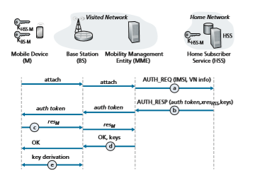
**Figure 8.33**  ♦   Mutual authentication and key agreement in a 4G LTE cellular network

The 4G Authentication and Key Agreement (AKA) protocol consists of the fol- lowing steps:

a. _Authentication request to HSS._ When the mobile device first requests, via a base station, to attach to the network, it sends an attach message containing its international mobile subscriber identity (IMSI) that is relayed to the Mobility Management Entity (MME). The MME will then send the IMSI and informa- tion about the visited network (shown as “VN info” in Figure 8.33) to the Home Subscriber Service (HSS) in the device’s home network. In Section 7.4, we described how the MME is able to communicate with the HSS through the all-IP global network of interconnected cellular networks.

b. _Authentication response from HSS._ The HSS performs cryptographic operations using the shared-in-advance secret key, KHSS-M, to derive an authentication token, _auth\_token_, and an expected authentication response token, _xresHSS_. _auth\_token_ contains information encrypted by the HSS using KHSS-M that will allow the mobile device to know that whoever computed _auth\_token_ knows the secret key. For example, suppose the HSS computes KHSS-M(IMSI), that is, encrypts the device’s IMSI using KHSS-M and sends that value as _auth\_token_. When the mobile device receives that encrypted value and uses its secret key to decrypt this value, that is, to compute

KHSS-M(KHSS-M(IMSI)) 5 IMSI, it knows that the HSS that generated _auth\_ token_ knows its secret key. The mobile device can thus authenticate the HSS.

The expected authentication response token, _xresHSS_, contains a value that the mobile device will need to be able to compute (using KHSS-M) and return to the MME to prove that _it_ (the mobile device) knows the secret key, thus authenti- cating the mobile device to the MME.

Note that the MME only plays a middleman role here, receiving the authenti- cation response message, keeping _xresHSS_ for later use, extracting the authen- tication token and forwarding it to the mobile device. In particular it need not know, and will not learn, the secret key, KHSS-M.

c. _Authentication response from mobile device._ The mobile device receives _auth\_token_ and computes KHSS-M(KHSS-M(IMSI)) 5 IMSI, thus authenticating the HSS. The mobile device then computes a value _resM_—using its secret key to make the exact same cryptographic calculation that the HSS had made to compute _xresHSS_—and sends this value to the MME.

d. _Mobile device authentication._ The MMS compares the mobile-computed value of _resM_ with the HSS-computed value of _xresHSS_. If they match, the mobile device is authenticated, since the mobile has proven to the MME that it and the HSS both know the common secret key. The MMS informs the base station and mobile device that mutual authentication is complete, and sends the base station keys that will be used in step e.

e. _Data plane and control plane key derivation._ The mobile device and the base station will each determine the keys used for encrypting/decrypting their frame transmissions over the wireless channel. Separate keys will be derived for data plane and control plane frame transmissions. The AES encryption algorithm that we saw in use in 802.11 networks is also used in 4G/5G networks.

Our discussion above has focused on authentication and key agreement in 4G networks. Although much of the 4G security is being carried forward into 5G, there are some important changes:

• First, note that in our discussion above that it is the MME in the visited network that makes the authentication decision. A significant change underway in 5G network security is to allow authentication services to be provided by the home network, with the visited network playing an even smaller middleman role. While the visited network may still reject an authentication from a mobile device, it is up to the home network to accept the authentication request in this new 5G scenario.

• 5G networks will support the Authentication and Key Agreement (AKA) proto- col described above, as well as two new additional protocols for authentication and key agreement. One of these, known as AKA¿, is closely related to the 4G AKA protocol. It also uses the shared-in-advance secret key, KHSS-M. However, since it uses the EAP protocol that we encountered earlier in Figure 8.33 in the context of 802.11 authentication, 5G AKA¿ has different message flows than thatof 4G AKA. The second new 5G protocol is meant for an IoT environment, and does not require a shared-in-advance secret key.

• An additional change in 5G is to use public key cryptography techniques to encrypt a device’s permanent identity (i.e., its IMSI) so that it is never transmit- ted in cleartext.

In this section, we have only briefly overviewed mutual authentication and key agreement in 4G /5G networks. As we have seen, they make extensive use of the security techniques that we studied earlier in this chapter. More details on 4G/5G security can be found in \[3GPP SAE 2019; Cable Labs 2019; Cichonski 2017\].

## Operational Security: Firewalls and Intrusion Detection Systems
We’ve seen throughout this chapter that the Internet is not a very safe place—bad guys are out there, wreaking all sorts of havoc. Given the hostile nature of the Inter- net, let’s now consider an organization’s network and the network administrator who administers it. From a network administrator’s point of view, the world divides quite neatly into two camps—the good guys (who belong to the organization’s network, and who should be able to access resources inside the organization’s network in a relatively unconstrained manner) and the bad guys (everyone else, whose access to network resources must be carefully scrutinized). In many organizations, ranging from medieval castles to modern corporate office buildings, there is a single point of entry/exit where both good guys and bad guys entering and leaving the organization are security-checked. In a castle, this was done at a gate at one end of the drawbridge; in a corporate building, this is done at the security desk. In a computer network, when traffic entering/leaving a network is security-checked, logged, dropped, or for- warded, it is done by operational devices known as firewalls, intrusion detection systems (IDSs), and intrusion prevention systems (IPSs).

### FirewallsA **

A firewall is a combination of hardware and software that isolates an organization’s internal network from the Internet at large, allowing some packets to pass and block- ing others. A firewall allows a network administrator to control access between the outside world and resources within the administered network by managing the traffic flow to and from these resources. A firewall has three goals:

• _All traffic from outside to inside, and vice versa, passes through the firewall_. Figure 8.34 shows a firewall, sitting squarely at the boundary between the admin- istered network and the rest of the Internet. While large organizations may use

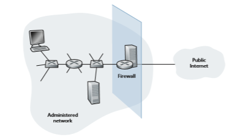
**Figure 8.34**  ♦   Firewall placement between the administered network and the outside world

multiple levels of firewalls or distributed firewalls \[Skoudis 2006\], locating a firewall at a single access point to the network, as shown in Figure 8.34, makes it easier to manage and enforce a security-access policy.

• _Only authorized traffic, as defined by the local security policy, will be allowed to pass_. With all traffic entering and leaving the institutional network passing through the firewall, the firewall can restrict access to authorized traffic.

• _The firewall itself is immune to penetration_. The firewall itself is a device con- nected to the network. If not designed or installed properly, it can be compro- mised, in which case it provides only a false sense of security (which is worse than no firewall at all!).

Cisco and Check Point are two of the leading firewall vendors today. You can also easily create a firewall (packet filter) from a Linux box using iptables (public-domain software that is normally shipped with Linux). Furthermore, as discussed in Chapters 4 and 5, fire- walls are now frequently implemented in routers and controlled remotely using SDNs.

Firewalls can be classified in three categories: **traditional packet filters**, **state- ful filters**, and **application gateways**. We’ll cover each of these in turn in the fol- lowing subsections.

**Traditional Packet Filters**

As shown in Figure 8.34, an organization typically has a gateway router connecting its internal network to its ISP (and hence to the larger public Internet). All traffic leav- ing and entering the internal network passes through this router, and it is at this router where **packet filtering** occurs. A packet filter examines each datagram in isolation, determining whether the datagram should be allowed to pass or should be dropped based on administrator-specific rules. Filtering decisions are typically based on:

• IP source or destination address

• Protocol type in IP datagram field: TCP, UDP, ICMP, OSPF, and so on

• TCP or UDP source and destination port

• TCP flag bits: SYN, ACK, and so on

• ICMP message type

• Different rules for datagrams leaving and entering the network

• Different rules for the different router interfaces

A network administrator configures the firewall based on the policy of the organ- ization. The policy may take user productivity and bandwidth usage into account as well as the security concerns of an organization. Table 8.5 lists a number of possible polices an organization may have, and how they would be addressed with a packet filter. For example, if the organization doesn’t want any incoming TCP connections except those for its public Web server, it can block all incoming TCP SYN segments except TCP SYN segments with destination port 80 and the destination IP address corresponding to the Web server. If the organization doesn’t want its users to monop- olize access bandwidth with Internet radio applications, it can block all not-critical
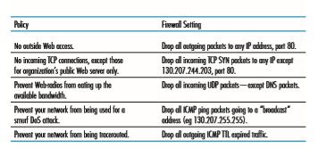
**Table 8.5**  ♦   Policies and corresponding filtering rules for an organization’s network 130.207/16 with Web server at 130.207.244.203

UDP traffic (since Internet radio is often sent over UDP). If the organization doesn’t want its internal network to be mapped (tracerouted) by an outsider, it can block all ICMP TTL expired messages leaving the organization’s network.

A filtering policy can be based on a combination of addresses and port numbers. For example, a filtering router could forward all Telnet datagrams (those with a port number of 23) except those going to and coming from a list of specific IP addresses. This policy permits Telnet connections to and from hosts on the allowed list. Unfor- tunately, basing the policy on external addresses provides no protection against data- grams that have had their source addresses spoofed.

Filtering can also be based on whether or not the TCP ACK bit is set. This trick is quite useful if an organization wants to let its internal clients connect to external servers but wants to prevent external clients from connecting to internal servers. Recall from Section 3.5 that the first segment in every TCP connection has the ACK bit set to 0, whereas all the other segments in the connection have the ACK bit set to 1. Thus, if an organization wants to prevent external clients from initiating connections to internal servers, it simply filters all incoming segments with the ACK bit set to 0. This policy kills all TCP connections originating from the outside, but permits con- nections originating internally.

Firewall rules are implemented in routers with access control lists, with each router interface having its own list. An example of an access control list for an organ- ization 222.22/16 is shown in Table 8.6. This access control list is for an interface that connects the router to the organization’s external ISPs. Rules are applied to each datagram that passes through the interface from top to bottom. The first two rules together allow internal users to surf the Web: The first rule allows any TCP packet with destination port 80 to leave the organization’s network; the second rule allows any TCP packet with source port 80 and the ACK bit set to enter the organization’s network. Note that if an external source attempts to establish a TCP connection with

**Table 8.6**  ♦  An access control list for a router interface

an internal host, the connection will be blocked, even if the source or destination port is 80. The second two rules together allow DNS packets to enter and leave the organization’s network. In summary, this rather restrictive access control list blocks all traffic except Web traffic initiated from within the organization and DNS traffic. \[CERT Filtering 2012\] provides a list of recommended port/protocol packet filterings to avoid a number of well-known security holes in existing network applications.

Readers with sharp memories may recall we encountered access control lists similar to Table 8.6 when we studied generalized forwarding in Section 4.4.3 of Chapter 4. Indeed, we provided an example there of how generalized forwarding rules can be used to build a packet-filtering firewall.

**Stateful Packet Filters**

In a traditional packet filter, filtering decisions are made on each packet in isola- tion. Stateful filters actually track TCP connections, and use this knowledge to make filtering decisions.

To understand stateful filters, let’s reexamine the access control list in Table 8.6. Although rather restrictive, the access control list in Table 8.6 neverthe- less allows any packet arriving from the outside with ACK = 1 and source port 80 to get through the filter. Such packets could be used by attackers in attempts to crash internal systems with malformed packets, carry out denial-of-service attacks, or map the internal network. The naive solution is to block TCP ACK packets as well, but such an approach would prevent the organization’s internal users from surfing the Web.

Stateful filters solve this problem by tracking all ongoing TCP connections in a connection table. This is possible because the firewall can observe the beginning of a new connection by observing a three-way handshake (SYN, SYNACK, and ACK); and it can observe the end of a connection when it sees a FIN packet for the connection. The firewall can also (conservatively) assume that the connection is over when it hasn’t seen any activity over the connection for, say, 60 seconds. An example connection table for a firewall is shown in Table 8.7. This connec- tion table indicates that there are currently three ongoing TCP connections, all of which have been initiated from within the organization. Additionally, the stateful filter includes a new column, “check connection,” in its access control list, as
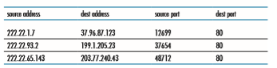
**Table 8.7**  ♦  Connection table for stateful filter

shown in Table 8.8. Note that Table 8.8 is identical to the access control list in Table 8.6, except now it indicates that the connection should be checked for two of the rules.

Let’s walk through some examples to see how the connection table and the extended access control list work hand-in-hand. Suppose an attacker attempts to send a malformed packet into the organization’s network by sending a data- gram with TCP source port 80 and with the ACK flag set. Further suppose that this packet has source port number 12543 and source IP address 150.23.23.155. When this packet reaches the firewall, the firewall checks the access control list in Table 8.7, which indicates that the connection table must also be checked before permitting this packet to enter the organization’s network. The firewall duly checks the connection table, sees that this packet is not part of an ongoing TCP connection, and rejects the packet. As a second example, suppose that an internal user wants to surf an external Web site. Because this user first sends a TCP SYN segment, the user’s TCP connection gets recorded in the connection table. When the Web server sends back packets (with the ACK bit necessarily set), the fire- wall checks the table and sees that a corresponding connection is in progress. The firewall will thus let these packets pass, thereby not interfering with the internal user’s Web surfing activity.

**Application Gateway**

In the examples above, we have seen that packet-level filtering allows an organiza- tion to perform coarse-grain filtering on the basis of the contents of IP and TCP/UDP headers, including IP addresses, port numbers, and acknowledgment bits. But what if an organization wants to provide a Telnet service to a restricted set of internal users(as opposed to IP addresses)? And what if the organization wants such privileged users to authenticate themselves first before being allowed to create Telnet sessions to the outside world? Such tasks are beyond the capabilities of traditional and stateful filters. Indeed, information about the identity of the internal users is application-layer data and is not included in the IP/TCP/UDP headers.

To have finer-level security, firewalls must combine packet filters with appli- cation gateways. Application gateways look beyond the IP/TCP/UDP headers and make policy decisions based on application data. An **application gateway** is an application-specific server through which all application data (inbound and out- bound) must pass. Multiple application gateways can run on the same host, but each gateway is a separate server with its own processes.

To get some insight into application gateways, let’s design a firewall that allows only a restricted set of internal users to Telnet outside and prevents all external clients from Telneting inside. Such a policy can be accomplished by implementing a com- bination of a packet filter (in a router) and a Telnet application gateway, as shown in Figure 8.35. The router’s filter is configured to block all Telnet connections except those that originate from the IP address of the application gateway. Such a filter configuration forces all outbound Telnet connections to pass through the application gateway. Consider now an internal user who wants to Telnet to the outside world. The user must first set up a Telnet session with the application gateway. An applica- tion running in the gateway, which listens for incoming Telnet sessions, prompts the
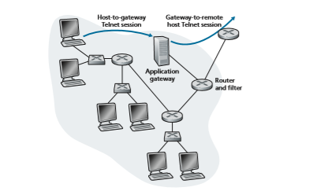
**Figure 8.35**  ♦  Firewall consisting of an application gateway and a filter 

for a user ID and password. When the user supplies this information, the appli- cation gateway checks to see if the user has permission to Telnet to the outside world. If not, the Telnet connection from the internal user to the gateway is terminated by the gateway. If the user has permission, then the gateway (1) prompts the user for the host name of the external host to which the user wants to connect, (2) sets up a Telnet session between the gateway and the external host, and (3) relays to the external host all data arriving from the user, and relays to the user all data arriving from the exter- nal host. Thus, the Telnet application gateway not only performs user authorization but also acts as a Telnet server and a Telnet client, relaying information between the user and the remote Telnet server. Note that the filter will permit step 2 because the gateway initiates the Telnet connection to the outside world.

**CASE HISTORY**
**ANONYMITY AND PRIVACY**

Suppose you want to visit a controversial Web site (for example, a political activist site) and you (1) don’t want to reveal your IP address to the Web site, (2) don’t want your local ISP (which may be your home or office ISP) to know that you are visiting the site, and (3) don’t want your local ISP to see the data you are exchanging with the site. If you use the traditional approach of connecting directly to the Web site without any encryption, you fail on all three counts. Even if you use SSL, you fail on the first two counts: Your source IP address is presented to the Web site in every datagram you send; and the destination address of every packet you send can easily be sniffed by your local ISP.

To obtain privacy and anonymity, you can instead use a combination of a trusted proxy server and SSL, as shown in Figure 8.36. With this approach, you first make an SSL connection to the trusted proxy. You then send, into this SSL connection,

**CASE HISTORY**

**Figure 8.36**  ♦  Providing anonymity and privacy with a proxy

an HTTP request for a page at the desired site. When the proxy receives the SSL- encrypted HTTP request, it decrypts the request and forwards the cleartext HTTP request to the Web site. The Web site then responds to the proxy, which in turn for- wards the response to you over SSL. Because the Web site only sees the IP address of the proxy, and not of your client’s address, you are indeed obtaining anony- mous access to the Web site. And because all traffic between you and the proxy is encrypted, your local ISP cannot invade your privacy by logging the site you visited or recording the data you are exchanging. Many companies today (such as proxify .com) make available such proxy services.

Of course, in this solution, your proxy knows everything: It knows your IP address and the IP address of the site you’re surfing; and it can see all the traffic in cleartext exchanged between you and the Web site. Such a solution, therefore, is only as good as the trustworthiness of the proxy. A more robust approach, taken by the TOR anonymizing and privacy service, is to route your traffic through a series of non- colluding proxy servers \[TOR 2020\]. In particular, TOR allows independent individuals to contribute proxies to its proxy pool. When a user connects to a server using TOR, TOR randomly chooses (from its proxy pool) a chain of three proxies and routes all traffic between client and server over the chain. In this manner, assuming the proxies do not collude, no one knows that communication took place between your IP address and the target Web site. Furthermore, although cleartext is sent between the last proxy and the server, the last proxy doesn’t know what IP address is sending and receiving the cleartext.

Internal networks often have multiple application gateways, for example, gate- ways for Telnet, HTTP, FTP, and e-mail. In fact, an organization’s mail server (see Section 2.3) and Web cache are application gateways.

Application gateways do not come without their disadvantages. First, a different application gateway is needed for each application. Second, there is a performance penalty to be paid, since all data will be relayed via the gateway. This becomes a concern particularly when multiple users or applications are using the same gateway machine. Finally, the client software must know how to contact the gateway when the user makes a request, and must know how to tell the application gateway what external server to connect to.

### Intrusion Detection Systems
We’ve just seen that a packet filter (traditional and stateful) inspects IP, TCP, UDP, and ICMP header fields when deciding which packets to let pass through the firewall. However, to detect many attack types, we need to perform **deep packet inspection**, that is, look beyond the header fields and into the actual application data that the packets carry. As we saw in Section 8.9.1, application gateways often do deep packet inspection. But an application gateway only does this for a specific application.

Clearly, there is a niche for yet another device—a device that not only examines the headers of all packets passing through it (like a packet filter), but also performs deep packet inspection (unlike a packet filter). When such a device observes a suspicious packet, or a suspicious series of packets, it could prevent those packets from entering the organizational network. Or, because the activity is only deemed as suspicious, the device could let the packets pass, but send alerts to a network administrator, who can then take a closer look at the traffic and take appropriate actions. A device that generates alerts when it observes potentially malicious traffic is called an **intrusion detection system (IDS)**. A device that filters out suspicious traffic is called an **intrusion prevention system (IPS)**. In this section we study both systems—IDS and IPS—together, since the most interesting technical aspect of these systems is how they detect suspicious traffic (and not whether they send alerts or drop packets). We will henceforth collectively refer to IDS systems and IPS systems as IDS systems.

An IDS can be used to detect a wide range of attacks, including network map- ping (emanating, for example, from nmap), port scans, TCP stack scans, DoS band- width-flooding attacks, worms and viruses, OS vulnerability attacks, and application vulnerability attacks. (See Section 1.6 for a survey of network attacks.) Today, thousands of organizations employ IDS systems. Many of these deployed systems are proprietary, marketed by Cisco, Check Point, and other security equipment ven- dors. But many of the deployed IDS systems are public-domain systems, such as the immensely popular Snort IDS system (which we’ll discuss shortly).

An organization may deploy one or more IDS sensors in its organizational net- work. Figure 8.37 shows an organization that has three IDS sensors. When multi- ple sensors are deployed, they typically work in concert, sending information about suspicious traffic activity to a central IDS processor, which collects and integrates the information and sends alarms to network administrators when deemed appropri- ate. In Figure 8.37, the organization has partitioned its network into two regions: a high-security region, protected by a packet filter and an application gateway and monitored by IDS sensors; and a lower-security region—referred to as the **demilita- rized zone (DMZ)**—which is protected only by the packet filter, but also monitored by IDS sensors. Note that the DMZ includes the organization’s servers that need to communicate with the outside world, such as its public Web server and its authorita- tive DNS server.

You may be wondering at this stage, why multiple IDS sensors? Why not just place one IDS sensor just behind the packet filter (or even integrated with the packet filter) in Figure 8.37? We will soon see that an IDS not only needs to do deep packet inspection, but must also compare each passing packet with tens of thousands of “signatures”; this can be a significant amount of processing, particularly if the organ- ization receives gigabits/sec of traffic from the Internet. By placing the IDS sensors further downstream, each sensor sees only a fraction of the organization’s traffic, and can more easily keep up. Nevertheless, high-performance IDS and IPS systems are available today, and many organizations can actually get by with just one sensor located near its access router.
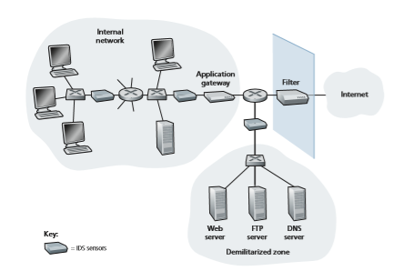
**Figure 8.37**  ♦   An organization deploying a filter, an application gateway, and IDS sensors

IDS systems are broadly classified as either **signature-based systems** or **anomaly- based systems**. A signature-based IDS maintains an extensive database of attack signatures. Each signature is a set of rules pertaining to an intrusion activity. A signature may simply be a list of characteristics about a single packet (e.g., source and destination port numbers, protocol type, and a specific string of bits in the packet payload), or may relate to a series of packets. The signatures are normally created by skilled network security engineers who research known attacks. An organization’s network administrator can customize the signatures or add its own to the database.

Operationally, a signature-based IDS sniffs every packet passing by it, com- paring each sniffed packet with the signatures in its database. If a packet (or series of packets) matches a signature in the database, the IDS generates an alert. The alert could be sent to the network administrator in an e-mail message, could be sent to the network management system, or could simply be logged for future inspection.

IDS sensorsSignature-based IDS systems, although widely deployed, have a number of limi- tations. Most importantly, they require previous knowledge of the attack to generate an accurate signature. In other words, a signature-based IDS is completely blind to new attacks that have yet to be recorded. Another disadvantage is that even if a sig- nature is matched, it may not be the result of an attack, so that a false alarm is gener- ated. Finally, because every packet must be compared with an extensive collection of signatures, the IDS can become overwhelmed with processing and actually fail to detect many malicious packets.

An anomaly-based IDS creates a traffic profile as it observes traffic in normal operation. It then looks for packet streams that are statistically unusual, for exam- ple, an inordinate percentage of ICMP packets or a sudden exponential growth in port scans and ping sweeps. The great thing about anomaly-based IDS systems is that they don’t rely on previous knowledge about existing attacks—that is, they can potentially detect new, undocumented attacks. On the other hand, it is an extremely challenging problem to distinguish between normal traffic and statistically unusual traffic. To date, most IDS deployments are primarily signature-based, although some include some anomaly-based features.

**Snort**

Snort is a public-domain, open source IDS with hundreds of thousands of existing deployments [Snort 2012; Koziol 2003]. It can run on Linux, UNIX, and Windows platforms. It uses the generic sniffing interface libpcap, which is also used by Wire- shark and many other packet sniffers. It can easily handle 100 Mbps of traffic; for installations with gibabit/sec traffic rates, multiple Snort sensors may be needed.

To gain some insight into Snort, let’s take a look at an example of a Snort signature:

alert icmp $EXTERNAL\_NET any -> $HOME\_NET any 
(msg:”ICMP PING NMAP”; dsize: 0; itype: 8;)

This signature is matched by any ICMP packet that enters the organization’s network ($HOME_NET) from the outside ($EXTERNAL_NET), is of type 8 (ICMP ping), and has an empty payload (dsize = 0). Since nmap (see Section 1.6) generates ping pack- ets with these specific characteristics, this signature is designed to detect nmap ping sweeps. When a packet matches this signature, Snort generates an alert that includes the message “ICMP PING NMAP”.

Perhaps what is most impressive about Snort is the vast community of users and security experts that maintain its signature database. Typically within a few hours of a new attack, the Snort community writes and releases an attack signature, which is then downloaded by the hundreds of thousands of Snort deployments distributed around the world. Moreover, using the Snort signature syntax, network administra- tors can tailor the signatures to their own organization’s needs by either modifying existing signatures or creating entirely new ones.

## Summary
In this chapter, we’ve examined the various mechanisms that our secret lovers, Bob and Alice, can use to communicate securely. We’ve seen that Bob and Alice are interested in confidentiality (so they alone are able to understand the contents of a transmitted message), end-point authentication (so they are sure that they are talking with each other), and message integrity (so they are sure that their messages are not altered in transit). Of course, the need for secure communication is not confined to secret lovers. Indeed, we saw in Sections 8.5 through 8.8 that security can be used in various layers in a network architecture to protect against bad guys who have a large arsenal of possible attacks at hand.

The first part of this chapter presented various principles underlying secure communication. In Section 8.2, we covered cryptographic techniques for encrypting and decrypting data, including symmetric key cryptography and public key cryp- tography. DES and RSA were examined as specific case studies of these two major classes of cryptographic techniques in use in today’s networks.

In Section 8.3, we examined two approaches for providing message integ- rity: message authentication codes (MACs) and digital signatures. The two approaches have a number of parallels. Both use cryptographic hash functions and both techniques enable us to verify the source of the message as well as the integrity of the message itself. One important difference is that MACs do not rely on encryption whereas digital signatures require a public key infrastruc- ture. Both techniques are extensively used in practice, as we saw in Sections 8.5 through 8.8. Furthermore, digital signatures are used to create digital certificates, which are important for verifying the validity of public keys. In Section 8.4, we examined endpoint authentication and introduced nonces to defend against the replay attack.

In Sections 8.5 through 8.8 we examined several security networking protocols that enjoy extensive use in practice. We saw that symmetric key cryptography is at the core of PGP, SSL, IPsec, and wireless security. We saw that public key cryptog- raphy is crucial for both PGP and TLS. We saw that PGP uses digital signatures for message integrity, whereas TLS and IPsec use MACs. We also explored security in wireless networks, including WiFi networks and 4G/5G cellular networks. Having now an understanding of the basic principles of cryptography, and having studied how these principles are actually used, you are now in position to design your own secure network protocols!

Armed with the techniques covered in Sections 8.2 through 8.8, Bob and Alice can communicate securely. But confidentiality is only a small part of the network security picture. As we learned in Section 8.9, increasingly, the focus in network security has been on securing the network infrastructure against a poten- tial onslaught by the bad guys. In the latter part of this chapter, we thus covered firewalls and IDS systems which inspect packets entering and leaving an organiza- tion’s network.
**Homework Problems and Questions**
*********************
**Chapter 8 Review Problems** 
SECTION 8.1 
R1. Operational devices such as firewalls and intrusion detection systems are used to counter attacks against an organization’s network. What is the basic difference between a firewall and an intrusion detection system?

R2. Internet entities (routers, switches, DNS servers, Web servers, user end systems, and so on) often need to communicate securely. Give three specific example pairs of Internet entities that may want secure communication.

SECTION 8.2 

R3. The encryption technique itself is known—published, standardized, and available to everyone, even a potential intruder. Then where does the security of an encryption technique come from?

R4. What is the difference between known plaintext attack and chosen plaintext attack?

R5. Consider a 16-block cipher. How many possible input blocks does this cipher have? How many possible mappings are there? If we view each mapping as a key, then how many possible keys does this cipher have?

R6. Suppose _N_ people want to communicate with each of _N_ \- 1 other peo- ple using symmetric key encryption. All communication between any two people, _i_ and _j_, is visible to all other people in this group of _N_, and no other person in this group should be able to decode their communication. How many keys are required in the system as a whole? Now suppose that public key encryption is used. How many keys are required in this case?

R7. Suppose _n_ = 1,000, _a_ = 1,017, and _b_ = 1,006. Use an identity of modular arithmetic to calculate in your head (_a_ # _b_) mod _n_.

R8. Suppose you want to encrypt the message 10010111 by encrypting the decimal number that corresponds to the message. What is the decimal number?

SECTIONS 8.3–8.4 

R9. In what way does a hash provide a better message integrity check than a
checksum (such as the Internet checksum)?

R10. Can you “decrypt” a hash of a message to get the original message? Explain your answer.
R11. Consider a variation of the MAC algorithm (Figure 8.9) where the sender sends (_m_, _H_(_m_) + _s_), where _H_(_m_) + _s_ is the concatenation of _H_(_m_) and _s_. Is this variation flawed? Why or why not?

R12. What does it mean for a signed document to be verifiable and nonforgeable?

R13. In the link-state routing algorithm, we would somehow need to distribute the secret authentication key to each of the routers in the autonomous system. How do we distribute the shared authentication key to the communicating entities?

R14. Name two popular secure networking protocols in which public key certi- fication is used.

R15. Suppose Alice has a message that she is ready to send to anyone who asks. Thousands of people want to obtain Alice’s message, but each wants to be sure of the integrity of the message. In this context, do you think a MAC- based or a digital-signature-based integrity scheme is more suitable? Why?

R16. What is the purpose of a nonce in an end-point authentication protocol?

R17. What does it mean to say that a nonce is a once-in-a-lifetime value? In whose lifetime?

R18. Is the message integrity scheme based on HMAC susceptible to playback attacks? If so, how can a nonce be incorporated into the scheme to remove this susceptibility?

SECTIONS 8.5–8.8 R19. What is the de facto e-mail encryption scheme? What does it use for authenti-

cation and message integrity?

R20. In the TLS record, there is a field for TLS sequence numbers. True or false?

R21. What is the purpose of the random nonces in the TLS handshake?

R22. Suppose an TLS session employs a block cipher with CBC. True or false: The server sends to the client the IV in the clear.

R23. Suppose Bob initiates a TCP connection to Trudy who is pretending to be Alice. During the handshake, Trudy sends Bob Alice’s certificate. In what step of the TLS handshake algorithm will Bob discover that he is not com- municating with Alice?

R24. Consider sending a stream of packets from Host A to Host B using IPsec. Typically, a new SA will be established for each packet sent in the stream. True or false?

R25. Suppose that TCP is being run over IPsec between headquarters and the branch office in Figure 8.28. If TCP retransmits the same packet, then the two corresponding packets sent by R1 packets will have the same sequence number in the ESP header. True or false?

R26. Is there a fixed encryption algorithm in SSL?

R27. Consider WEP for 802.11. Suppose that the data is 10001101 and the key- stream is 01101010. What is the resulting ciphertext?

SECTION 8.9 R28. Stateful packet filters maintain two data structures. Name them and briefly

describe what they do.

R29. Consider a traditional (stateless) packet filter. This packet filter may filter packets based on TCP flag bits as well as other header fields. True or false?

R30. In a traditional packet filter, each interface can have its own access control list. True or false?

R31. Why must an application gateway work in conjunction with a router filter to be effective?

R32. Signature-based IDSs and IPSs inspect into the payloads of TCP and UDP segments. True or false?

**Problems**
****************************
P1. Using the monoalphabetic cipher in Figure 8.3, encode the message “This is a secret message.”

P2. Show that Trudy’s known-plaintext attack, in which she knows the (cipher- text, plaintext) translation pairs for seven letters, reduces the number of possible substitutions to be checked in the example in Section 8.2.1 by approximately 109.

P3. Consider the polyalphabetic system shown in Figure 8.4. Will a chosen- plaintext attack that is able to get the plaintext encoding of the message “The quick brown fox jumps over the lazy dog.” be sufficient to decode all mes- sages? Why or why not?

P4. Consider the block cipher in Figure 8.5. Suppose that each block cipher _Ti_ simply reverses the order of the eight input bits (so that, for example, 11110000 becomes 00001111). Further suppose that the 64-bit scrambler does not modify any bits (so that the output value of the _m_th bit is equal to the input value of the _m_th bit). (a) With _n_ \= 3 and the original 64-bit input equal to 10100000 repeated eight times, what is the value of the output? (b) Repeat part (a) but now change the last bit of the original 64-bit input from a 0 to a 1. (c) Repeat parts (a) and (b) but now suppose that the 64-bit scrambler inverses the order of the 64 bits.

P5. Encode the plaintext 000001011111 with the 3-bit block cipher in Table 8.1 and IV = _c_(0) = 001. Then show that the receiver can decode the ciphertext, knowing IV and _KS_.

P6. The ciphertext for the 3-bit block cipher in Table 8.1 with plaintext 010010010 and IV = _c_102 = 001 becomes:

_c_(1) = _KS_(_m_(1) ⊕ _c_(0)) = _KS_(010 ⊕ 001) = _KS_(011) = 100,

_c_(2) = _KS_(_m_(2) ⊕ _c_(1)) = _KS_(010 ⊕ 100) = _KS_(110) = 000, and

_c_(3) = _KS_(_m_(3) ⊕ _c_(2)) = _KS_(010 ⊕ 000) = _KS_(010) = 101.

Verify that the receiver, knowing IV and _KS_, can recover the original plain- text from the ciphertext 100000101.

P7. a. Using RSA, choose _p_ \= 5 and _q_ \= 7, and encode the numbers 12, 19, and 27 separately. Apply the decryption algorithm to the encrypted ver- sion to recover the original plaintext message.

b. Choose _p_ and _q_ of your own and encrypt 1834 as one message _m_.

P8. Consider RSA with _p_ \= 7 and _q_ \= 13.

a. What are _n_ and _z_?

b. Let _e_ be 17. Why is this an acceptable choice for _e_?

c. Find _d_ such that _de_ = 1 (mod _z_).

d. Encrypt the message _m_ = 9 using the key (_n_, _e_). Let _c_ denote the correspond- ing ciphertext. Show all work.

P9. In this problem, we explore the Diffie-Hellman (DH) public-key encryption algorithm, which allows two entities to agree on a shared key. The DH algo- rithm makes use of a large prime number _p_ and another large number _g_ less than _p_. Both _p_ and _g_ are made public (so that an attacker would know them). In DH, Alice and Bob each independently choose secret keys, _SA_ and _SB_, respectively. Alice then computes her public key, _TA_, by raising _g_ to _SA_ and then taking mod _p_. Bob similarly computes his own public key _TB_ by raising _g_ to _SB_ and then taking mod _p_. Alice and Bob then exchange their public keys over the Internet. Alice then calculates the shared secret key _S_ by raising _TB_ to _SA_ and then taking mod _p_. Similarly, Bob calculates the shared key _S_′ by raising _TA_ to _SB_ and then taking mod _p_.

a. Prove that, in general, Alice and Bob obtain the same symmetric key, that is, prove _S_ \= _S_′.

b. With _p_ = 11 and _g_ = 2, suppose Alice and Bob choose private keys _SA_ \= 5 and _SB_ \= 12, respectively. Calculate Alice’s and Bob’s public keys, _TA_ and _TB_. Show all work.

c. Following up on part (b), now calculate _S_ as the shared symmetric key. Show all work.

d. Provide a timing diagram that shows how Diffie-Hellman can be attacked by a man-in-the-middle. The timing diagram should have three vertical lines, one for Alice, one for Bob, and one for the attacker Trudy.

P10. Suppose Alice wants to communicate with Bob using symmetric key cryp- tography using a session key _KS_. In Section 8.2, we learned how public-key cryptography can be used to distribute the session key from Alice to Bob. In this problem, we explore how the session key can be distributed—without public key cryptography—using a key distribution center (KDC). The KDC is a server that shares a unique secret symmetric key with each registered user. For Alice and Bob, denote these keys by _KA_@_KDC_ and _KB_@_KDC_. Design a scheme that uses the KDC to distribute _KS_ to Alice and Bob. Your scheme should use three messages to distribute the session key: a message from Alice to the KDC; a message from the KDC to Alice; and finally a message from Alice to Bob. The first message is _KA_@_KDC_ (_A_, _B_). Using the notation, _KA_@_KDC_, _KB_@_KDC, S, A,_ and _B_ answer the following questions.

a. What is the second message?

b. What is the third message?

P11. Compute a third message, different from the two messages in Figure 8.8, that has the same checksum as the messages in Figure 8.8.

P12. The sender can mix some randomness into the ciphertext so that identical plaintext blocks produce different ciphertext blocks. But for each cipher bit, the sender must now also send a random bit, doubling the required bandwidth. Is there any way around this?

P13. In the BitTorrent P2P file distribution protocol (see Chapter 2), the seed breaks the file into blocks, and the peers redistribute the blocks to each other. Without any protection, an attacker can easily wreak havoc in a torrent by masquerading as a benevolent peer and sending bogus blocks to a small subset of peers in the torrent. These unsuspecting peers then redistribute the bogus blocks to other peers, which in turn redistribute the bogus blocks to even more peers. Thus, it is critical for BitTorrent to have a mechanism that allows a peer to verify the integrity of a block, so that it doesn’t redistrib- ute bogus blocks. Assume that when a peer joins a torrent, it initially gets a .torrent file from a _fully_ trusted source. Describe a simple scheme that allows peers to verify the integrity of blocks.

P14. Solving factorization in polynomial time implies breaking the RSA cryptosystem. Is the converse true?

P15. Consider our authentication protocol in Figure 8.18 in which Alice authen- ticates herself to Bob, which we saw works well (i.e., we found no flaws in it). Now suppose that while Alice is authenticating herself to Bob, Bob must authenticate himself to Alice. Give a scenario by which Trudy, pretending to be Alice, can now authenticate herself to Bob as Alice. (_Hint_: Consider that the sequence of operations of the protocol, one with Trudy initiating and one with Bob initiating, can be arbitrarily interleaved. Pay particular attention to the fact that both Bob and Alice will use a nonce, and that if care is not taken, the same nonce can be used maliciously.)
PROBlEMS 

P16. A natural question is whether we can use a nonce and public key cryptography to solve the end-point authentication problem in Section 8.4. Consider the following natural protocol: (1) Alice sends the message “I am Alice” to Bob. (2) Bob chooses a nonce, _R_, and sends it to Alice. (3) Alice uses her _private_ key to encrypt the nonce and sends the resulting value to Bob. (4) Bob applies Alice’s public key to the received message. Thus, Bob computes _R_ and authenticates Alice.

a. Diagram this protocol, using the notation for public and private keys employed in the textbook.

b. Suppose that certificates are not used. Describe how Trudy can become a “woman-in-the-middle” by intercepting Alice’s messages and then pretending to be Alice to Bob.

P17. Figure 8.21 shows the operations that Alice must perform with PGP to pro- vide confidentiality, authentication, and integrity. Diagram the corresponding operations that Bob must perform on the package received from Alice.

P18. Suppose Alice wants to send an e-mail to Bob. Bob has a public-private key pair (_K_ B+, _K_ B -), and Alice has Bob’s certificate. But Alice does not have a public,private key pair. Alice and Bob (and the entire world) share the same hash function H( #). 

a. In this situation, is it possible to design a scheme so that Bob can verify that Alice created the message? If so, show how with a block diagram for Alice and Bob.

b. Is it possible to design a scheme that provides confidentiality for sending the message from Alice to Bob? If so, show how with a block diagram for Alice and Bob.

P19. Consider the Wireshark output below for a portion of an SSL session.

a. Is Wireshark packet 112 sent by the client or server?

b. What is the server’s IP address and port number?

c. Assuming no loss and no retransmissions, what will be the sequence num- ber of the next TCP segment sent by the client?

d. How many SSL records does Wireshark packet 112 contain?

e. Does packet 112 contain a Master Secret or an Encrypted Master Secret or neither?

f. Assuming that the handshake type field is 1 byte and each length field is 3 bytes, what are the values of the first and last bytes of the Master Secret (or Encrypted Master Secret)?

g. The client encrypted handshake message takes into account how many SSL records?

h. The server encrypted handshake message takes into account how many SSL records?

P20. In Section 8.6.1, it is shown that without sequence numbers, Trudy (a woman- in-the middle) can wreak havoc in a TLS session by interchanging TCP segments. Can Trudy do something similar by deleting a TCP segment? What does she need to do to succeed at the deletion attack? What effect will it have?

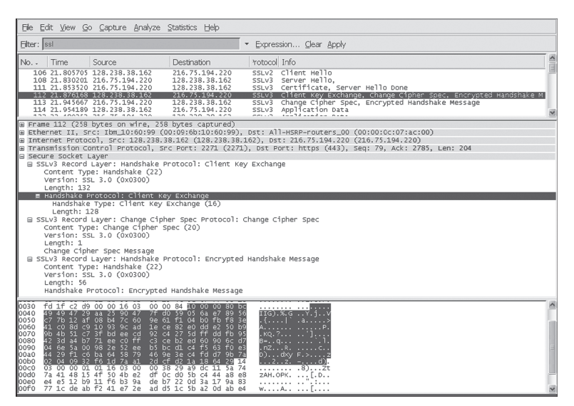

(Wireshark screenshot reprinted by permission of the Wireshark Foundation.)

P21. A router’s link-state message includes a list of its directly connected neighbors and the direct costs to these neighbors. Once a router receives link-state messages from all of the other routers, it can create a complete map of the network, run its least-cost routing algorithm, and configure its forwarding table. One relatively easy attack on the routing algorithm is for the attacker to distribute bogus link- state messages with incorrect link-state information. How can this be prevented?

P22. The following true/false questions pertain to Figure 8.28.

a. When a host in 172.16.1/24 sends a datagram to an Amazon.com server, the router R1 will encrypt the datagram using IPsec.
PROBlEMS 

b. When a host in 172.16.1/24 sends a datagram to a host in 172.16.2/24, the router R1 will change the source and destination address of the IP datagram.

c. Suppose a host in 172.16.1/24 initiates a TCP connection to a Web server in 172.16.2/24. As part of this connection, all datagrams sent by R1 will have protocol number 50 in the left-most IPv4 header field.

d. Consider sending a TCP segment from a host in 172.16.1/24 to a host in 172.16.2/24. Suppose the acknowledgment for this segment gets lost, so that TCP resends the segment. Because IPsec uses sequence numbers, R1 will not resend the TCP segment.

P23. When Bob signs a message, Bob must put something on the message that is unique to him. Bob could consider attaching a MAC for the signature, where the MAC is created by appending his key (unique to him) to the message, and then taking the hash. Will it cause any problem when Alice would try verification?

P24. Provide a filter table and a connection table for a stateful firewall that is as restrictive as possible but accomplishes the following:

a. Allows all internal users to establish Telnet sessions with external hosts.

b. Allows external users to surf the company Web site at 222.22.0.12.

c. But otherwise blocks all inbound and outbound traffic.

The internal network is 222.22/16. In your solution, suppose that the connec- tion table is currently caching three connections, all from inside to outside. You’ll need to invent appropriate IP addresses and port numbers.

P25. Suppose Alice wants to visit the Web site activist.com using a TOR-like service. This service uses two non-colluding proxy servers, Proxy1 and Proxy2. Alice first obtains the certificates (each containing a public key) for Proxy1 and Proxy2 from some central server. Denote _K_1+( ), _K_2 +( ), _K_1\-( ), and _K_2\-( ) for the encryption/decryption with public and private RSA keys.

a. Using a timing diagram, provide a protocol (as simple as possible) that enables Alice to establish a shared session key _S_1 with Proxy1. Denote _S_1(_m_) for encryption/decryption of data _m_ with the shared key _S_1.

b. Using a timing diagram, provide a protocol (as simple as possible) that allows Alice to establish a shared session key _S_2 with Proxy2 _without revealing her IP address to Proxy2_.

c. Assume now that shared keys _S_1 and _S_2 are now established. Using a timing diagram, provide a protocol (as simple as possible and _not using public-key cryptography_) that allows Alice to request an html page from activist.com _without revealing her IP address to Proxy2_ and _without revealing to Proxy1 which site she is visiting_. Your diagram should end with an HTTP request arriving at activist.com.

**Wireshark Lab: SSL**
******************
In this lab (available from the book Web site), we investigate the Secure Sockets Layer (SSL) protocol. Recall from Section 8.6 that SSL is used for securing a TCP connection, and that it is extensively used in practice for secure Internet transactions. In this lab, we will focus on the SSL records sent over the TCP connection. We will attempt to delineate and classify each of the records, with a goal of understanding the why and how for each record. We investigate the various SSL record types as well as the fields in the SSL messages. We do so by analyzing a trace of the SSL records sent between your host and an e-commerce server.

**IPsec Lab**
************************
In this lab (available from the book Web site), we will explore how to create IPsec SAs between linux boxes. You can do the first part of the lab with two ordinary linux boxes, each with one Ethernet adapter. But for the second part of the lab, you will need four linux boxes, two of which having two Ethernet adapters. In the second half of the lab, you will create IPsec SAs using the ESP protocol in the tunnel mode. You will do this by first manually creating the SAs, and then by having IKE create the SAs.

**AN INTERVIEW WITH…**

Steven M. Bellovin

Steven M. Bellovin joined the faculty at Columbia University after many years at the Network Services Research Lab at AT&T Labs Research in Florham Park, New Jersey. His focus is on networks, security, and why the two are incompatible. In 1995, he was awarded the Usenix Lifetime Achievement Award for his work in the creation of Usenet, the first newsgroup exchange network that linked two or more computers and allowed users to share information and join in discussions. Steve is also an elected member of the National Academy of Engineering. He received his BA from Columbia University and his PhD from the University of North Carolina at Chapel Hill.

**What led you to specialize in the networking security area?**

This is going to sound odd, but the answer is simple: It was fun. My background was in 
systems programming and systems administration, which leads fairly naturally to security. 
And I’ve always been interested in communications, ranging back to part-time systems 
programming jobs when I was in college.

My work on security continues to be motivated by two things—a desire to keep computers useful, which means that their function can’t be corrupted by attackers, and a desire 
to protect privacy.

**What was your vision for Usenet at the time that you were developing it? And now?**

We originally viewed it as a way to talk about computer science and computer programming around the country, with a lot of local use for administrative matters, for-sale ads, and 
so on. In fact, my original prediction was one to two messages per day, from 50 to 100 sites 
at the most—ever. However, the real growth was in people-related topics, including—but not 
limited to—human interactions with computers. My favorite newsgroups, over the years, 
have been things like rec.wood working, as well as sci.crypt.

To some extent, netnews has been displaced by the Web. Were I to start designing it 
today, it would look very different. But it still excels as a way to reach a very broad audience that is interested in the topic, without having to rely on particular Web sites.
**Has anyone inspired you professionally? In what ways?**

Professor Fred Brooks—the founder and original chair of the computer science department at the University of North Carolina at Chapel Hill, the manager of the team that developed 
the IBM S/360 and OS/360, and the author of The Mythical Man-Month—was a tremendous influence on my career. More than anything else, he taught outlook and trade-offs—how to 
look at problems in the context of the real world (and how much messier the real world is 
than a theorist would like), and how to balance competing interests in designing a solution. 
Most computer work is engineering—the art of making the right trade-offs to satisfy many 
contradictory objectives.
**What is your vision for the future of networking and security?**
Thus far, much of the security we have has come from isolation. A firewall, for example, 
works by cutting off access to certain machines and services. But we’re in an era of increasing connectivity—it’s gotten harder to isolate things. Worse yet, our production systems 
require far more separate pieces, interconnected by networks. Securing all that is one of our 
biggest challenges.

**What would you say have been the greatest advances in security? How much further do 
we have to go?**

At least scientifically, we know how to do cryptography. That’s been a big help. But most 
security problems are due to buggy code, and that’s a much harder problem. In fact, it’s 
the oldest unsolved problem in computer science, and I think it will remain that way. The 
challenge is figuring out how to secure systems when we have to build them out of insecure 
components. We can already do that for reliability in the face of hardware failures; can we 
do the same for security?

**Do you have any advice for students about the Internet and networking security?**

Learning the mechanisms is the easy part. Learning how to “think paranoid” is harder. You 
have to remember that probability distributions don’t apply—the attackers can and will find 
improbable conditions. And the details matter—a lot .