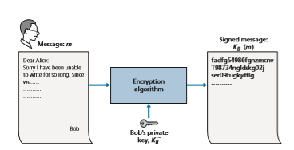
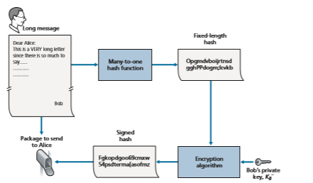
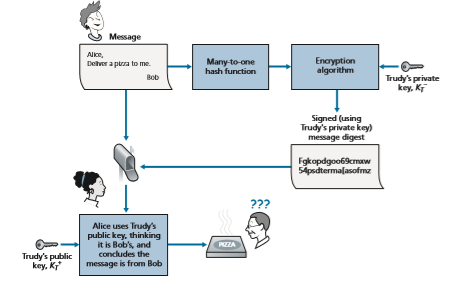
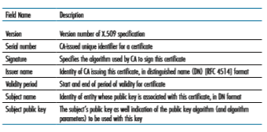

## Message Integrity and Digital Signatures
In the previous section, we saw how encryption can be used to provide confidenti- ality to two communicating entities. In this section, we turn to the equally impor- tant cryptography topic of providing **message integrity** (also known as message authentication). Along with message integrity, we will discuss two related topics in this section: digital signatures and end-point authentication.

We define the message integrity problem using, once again, Alice and Bob. Suppose Bob receives a message (which may be encrypted or may be in plaintext) and he believes this message was sent by Alice. To authenticate this message, Bob needs to verify:

1\. The message indeed originated from Alice. 

2\. The message was not tampered with on its way to Bob.

We’ll see in Sections 8.4 through 8.7 that this problem of message integrity is a criti- cal concern in just about all secure networking protocols.

As a specific example, consider a computer network using a link-state routing algorithm (such as OSPF) for determining routes between each pair of routers in the network (see Chapter 5). In a link-state algorithm, each router needs to broadcast a link-state message to all other routers in the network. A router’s link-state message includes a list of its directly connected neighbors and the direct costs to these neigh- bors. Once a router receives link-state messages from all of the other routers, it can create a complete map of the network, run its least-cost routing algorithm, and con- figure its forwarding table. One relatively easy attack on the routing algorithm is for Trudy to distribute bogus link-state messages with incorrect link-state information. Thus, the need for message integrity—when router B receives a link-state message from router A, router B should verify that router A actually created the message and, further, that no one tampered with the message in transit.In this section, we describe a popular message integrity technique that is used by many secure networking protocols. But before doing so, we need to cover another important topic in cryptography—cryptographic hash functions.

### Cryptographic Hash Functions

As shown in Figure 8.7, a hash function takes an input, _m_, and computes a fixed-size string _H_(_m_) known as a hash. The Internet checksum (Chapter 3) and CRCs (Chapter 6) meet this definition. A **cryptographic hash function
 is required to have the follow- ing additional property:

• It is computationally infeasible to find any two different messages _x_ and _y_ such that _H_(_x_) = _H_(_y_).

Informally, this property means that it is computationally infeasible for an intruder to substitute one message for another message that is protected by the hash function. That is, if (_m_, _H_(_m_)) are the message and the hash of the message created by the sender, then an intruder cannot forge the contents of another message, _y_, that has the same hash value as the original message.

Let’s convince ourselves that a simple checksum, such as the Internet checksum, would make a poor cryptographic hash function. Rather than performing 1s comple- ment arithmetic (as in the Internet checksum), let us compute a checksum by treating each character as a byte and adding the bytes together using 4-byte chunks at a time. Suppose Bob owes Alice $100.99 and sends an IOU to Alice consisting of the text string “IOU100.99BOB.” The ASCII representation (in hexadecimal notation) for these letters is 49,4F,55,31,30,30,2E,39,39,42,4F,42.

Figure 8.8 (top) shows that the 4-byte checksum for this message is B2 C1 D2 AC. A slightly different message (and a much more costly one for Bob)

**Figure 8.7**  ♦  Hash functions

 **Figure 8.8** ♦ Initial message and fraudulent message have the same 
checksum!

is shown in the bottom half of Figure 8.8. The messages “IOU100.99BOB” and “IOU900.19BOB” have the _same_ checksum. Thus, this simple checksum algorithm violates the requirement above. Given the original data, it is simple to find another set of data with the same checksum. Clearly, for security purposes, we are going to need a more powerful hash function than a checksum.

The MD5 hash algorithm of Ron Rivest [RFC 1321] is in wide use today. It computes a 128-bit hash in a four-step process consisting of a padding step (adding a one followed by enough zeros so that the length of the message satisfies certain conditions), an append step (appending a 64-bit representation of the mes- sage length before padding), an initialization of an accumulator, and a final loop- ing step in which the message’s 16-word blocks are processed (mangled) in four rounds. For a description of MD5 (including a C source code implementation) see [RFC 1321].

The second major hash algorithm in use today is the Secure Hash Algorithm (SHA-1) [FIPS 1995]. This algorithm is based on principles similar to those used in the design of MD4 [RFC 1320], the predecessor to MD5. SHA-1, a US federal standard, is required for use whenever a cryptographic hash algorithm is needed for federal applications. It produces a 160-bit message digest. The longer output length makes SHA-1 more secure.

### Message Authentication Code
Let’s now return to the problem of message integrity. Now that we understand hash functions, let’s take a first stab at how we might perform message integrity:
1\.Alice creates message _m_ and calculates the hash _H_(_m_) (for example, with SHA-1). 
2\. Alice then appends _H_(_m_) to the message _m_, creating an extended message(_m_, _H_(_m_)), and sends the extended message to Bob. 
3\. Bob receives an extended message (_m_, _h_) and calculates _H_(_m_). If _H_(_m_) = _h_,Bob concludes that everything is fine.

This approach is obviously flawed. Trudy can create a bogus message _m_´ in which she says she is Alice, calculate _H_(_m_´), and send Bob (_m_´, _H_(_m_´)). When Bob receives the message, everything checks out in step 3, so Bob doesn’t suspect any funny business.

To perform message integrity, in addition to using cryptographic hash functions, Alice and Bob will need a shared secret _s_. This shared secret, which is nothing more than a string of bits, is called the **authentication key**. Using this shared secret, mes- sage integrity can be performed as follows:

1\. Alice creates message _m_, concatenates _s_ with _m_ to create _m_ + _s_, and calculates the hash _H_(_m_ \+ _s_) (for example, with SHA-1). _H_(_m_ \+ _s_) is called the **message authentication code (MAC)**.

2\. Alice then appends the MAC to the message _m_, creating an extended message (_m, H_(_m_ \+ _s_)), and sends the extended message to Bob.

3\. Bob receives an extended message (_m, h_) and knowing _s_, calculates the MAC _H_(_m_ \+ _s_). If _H_(_m_ + _s_) = _h_, Bob concludes that everything is fine.

A summary of the procedure is shown in Figure 8.9. Readers should note that the MAC here (standing for “message authentication code”) is not the same MAC used in link-layer protocols (standing for “medium access control”)!

One nice feature of a MAC is that it does not require an encryption algorithm. Indeed, in many applications, including the link-state routing algorithm described earlier, communicating entities are only concerned with message integrity and are

**Figure 8.9**  ♦  Message authentication code (MAC)

not concerned with message confidentiality. Using a MAC, the entities can authen- ticate the messages they send to each other without having to integrate complex encryption algorithms into the integrity process.

As you might expect, a number of different standards for MACs have been pro- posed over the years. The most popular standard today is **HMAC**, which can be used either with MD5 or SHA-1. HMAC actually runs data and the authentication key through the hash function twice [Kaufman 2002; RFC 2104].

There still remains an important issue. How do we distribute the shared authen- tication key to the communicating entities? For example, in the link-state routing algorithm, we would somehow need to distribute the secret authentication key to each of the routers in the autonomous system. (Note that the routers can all use the same authentication key.) A network administrator could actually accomplish this by physically visiting each of the routers. Or, if the network administrator is a lazy guy, and if each router has its own public key, the network administrator could distribute the authentication key to any one of the routers by encrypting it with the router’s public key and then sending the encrypted key over the network to the router.

### Digital Signatures
Think of the number of the times you’ve signed your name to a piece of paper during the last week. You sign checks, credit card receipts, legal documents, and letters. Your signature attests to the fact that you (as opposed to someone else) have acknowledged and/or agreed with the document’s contents. In a digital world, one often wants to indicate the owner or creator of a document, or to signify one’s agree- ment with a document’s content. A **digital signature is a cryptographic technique for achieving these goals in a digital world.

Just as with handwritten signatures, digital signing should be done in a way that is verifiable and nonforgeable. That is, it must be possible to prove that a document signed by an individual was indeed signed by that individual (the signature must be verifiable) and that _only_ that individual could have signed the document (the signa- ture cannot be forged).

Let’s now consider how we might design a digital signature scheme. Observe that when Bob signs a message, Bob must put something on the message that is unique to him. Bob could consider attaching a MAC for the signature, where the MAC is created by appending his key (unique to him) to the message, and then taking the hash. But for Alice to verify the signature, she must also have a copy of the key, in which case the key would not be unique to Bob. Thus, MACs are not going to get the job done here.

Recall that with public-key cryptography, Bob has both a public and private key, with both of these keys being unique to Bob. Thus, public-key cryptography is an excellent candidate for providing digital signatures. Let us now examine how it is done.

Suppose that Bob wants to digitally sign a document, _m_. We can think of the document as a file or a message that Bob is going to sign and send. As shown in Figure 8.10, to sign this document, Bob simply uses his private key, _K_\-_B_, to compute

**Figure 8.10**  ♦  Creating a digital signature for a document

_K_\- _B_(_m_). At first, it might seem odd that Bob is using his private key (which, as we saw in Section 8.2, was used to decrypt a message that had been encrypted with his public key) to sign a document. But recall that encryption and decryption are nothing more than mathematical operations (exponentiation to the power of _e_ or _d_ in RSA; see Sec- tion 8.2) and recall that Bob’s goal is not to scramble or obscure the contents of the document, but rather to sign the document in a manner that is verifiable and nonforge- able. Bob’s digital signature of the document is _K_\-_B_(_m_). Does the digital signature _K_\-_B_(_m_) meet our requirements of being verifiable and nonforgeable? Suppose Alice has _m_ and _K_\-_B_(_m_). She wants to prove in court (being litigious) that Bob had indeed signed the document and was the only person who could have possibly signed the document. Alice takes Bob’s public key, _K_+_B_, and applies it to the digital signature, _K_\-_B_(_m_), associated with the document, _m_. That is, she computes _K_+_B_(_K_\- _B_(_m_)), and voilà, with a dramatic flurry, she produces _m_, which exactly matches the original document! Alice then argues that only Bob could have signed the document, for the following reasons:

• Whoever signed the message must have used the private key, _K_\- _B_, in computing the signature _K_\- _B_(_m_), such that _K_+_B_(_K_\- _B_(_m_)) = _m_.

• The only person who could have known the private key, _K_\- _B_, is Bob. Recall from our discussion of RSA in Section 8.2 that knowing the public key, _K_\+ _B_, is of no help in learning the private key, _K_\- _B_. Therefore, the only person who could know_K_\- _B_ is the person who generated the pair of keys, (_K_+_B_, _K_\- _B_), in the first place, Bob.
(Note that this assumes, though, that Bob has not given _K_\- _B_ to anyone, nor has anyone stolen _K_\- _B_ from Bob.)

It is also important to note that if the original document, m, is ever modified to some alternate form, m´, the signature that Bob created for m will not be valid for m´,

since _K_\+ _B_(_K_\-_B_(_m_)) does not equal _m_´. Thus, we see that digital signatures also provide message integrity, allowing the receiver to verify that the message was unaltered as well as the source of the message.

One concern with signing data by encryption is that encryption and decryption are computationally expensive. Given the overheads of encryption and decryption, signing data via complete encryption/decryption can be overkill. A more efficient approach is to introduce hash functions into the digital signature. Recall from Section 8.3.2 that a hash algorithm takes a message, _m_, of arbitrary length and com- putes a fixed-length “fingerprint” of the message, denoted by _H_(_m_). Using a hash function, Bob signs the hash of a message rather than the message itself, that is, Bob calculates _K_\-_B_(_H_(_m_)). Since _H_(_m_) is generally much smaller than the original message _m_, the computational effort required to create the digital signature is sub- stantially reduced.

In the context of Bob sending a message to Alice, Figure 8.11 provides a sum- mary of the operational procedure of creating a digital signature. Bob puts his origi- nal long message through a hash function. He then digitally signs the resulting hash with his private key. The original message (in cleartext) along with the digitally signed message digest (henceforth referred to as the digital signature) is then sent to Alice. Figure 8.12 provides a summary of the operational procedure of the signature. Alice applies the sender’s public key to the message to obtain a hash result. Alice also

**Figure 8.11**  ♦  Sending a digitally signed message

**Figure 8.12**  ♦  Verifying a signed message

applies the hash function to the cleartext message to obtain a second hash result. If the two hashes match, then Alice can be sure about the integrity and author of the message.

Before moving on, let’s briefly compare digital signatures with MACs, since they have parallels, but also have important subtle differences. Both digital signa- tures and MACs start with a message (or a document). To create a MAC out of the message, we append an authentication key to the message, and then take the hash of the result. Note that neither public key nor symmetric key encryption is involved in creating the MAC. To create a digital signature, we first take the hash of the message and then encrypt the message with our private key (using public key cryptography). Thus, a digital signature is a “heavier” technique, since it requires an underlying Public Key Infrastructure (PKI) with certification authorities as described below. We’ll see in Section 8.4 that PGP—a popular secure e-mail system—uses digital signatures for message integrity. We’ve seen already that OSPF uses MACs for mes- sage integrity. We’ll see in Sections 8.5 and 8.6 that MACs are also used for popular transport-layer and network-layer security protocols.

**Public Key Certification**

An important application of digital signatures is **public key certification**, that is, certifying that a public key belongs to a specific entity. Public key certification is used in many popular secure networking protocols, including IPsec and TLS.

To gain insight into this problem, let’s consider an Internet-commerce version of the classic “pizza prank.” Alice is in the pizza delivery business and accepts orders over the Internet. Bob, a pizza lover, sends Alice a plaintext message that includes his home address and the type of pizza he wants. In this message, Bob also includes a digital signature (that is, a signed hash of the original plaintext message) to prove to Alice that he is the true source of the message. To verify the signature, Alice obtains Bob’s public key (perhaps from a public key server or from the e-mail message) and checks the digital signature. In this manner she makes sure that Bob, rather than some adolescent prankster, placed the order.

This all sounds fine until clever Trudy comes along. As shown in Figure 8.13, Trudy is indulging in a prank. She sends a message to Alice in which she says she is Bob, gives Bob’s home address, and orders a pizza. In this message she also includes her (Trudy’s) public key, although Alice naturally assumes it is Bob’s public key. Trudy also attaches a digital signature, which was created with her own (Trudy’s) private key. After receiving the message, Alice applies Trudy’s public key (thinking that it is Bob’s) to the digital signature and concludes that the plaintext message was indeed created by Bob. Bob will be very surprised when the delivery person brings a pizza with pepperoni and anchovies to his home!

We see from this example that for public key cryptography to be useful, you need to be able to verify that you have the actual public key of the entity (person, router, browser, and so on) with whom you want to communicate. For example, when Alice wants to communicate with Bob using public key cryptography, she needs to verify that the public key that is supposed to be Bob’s is indeed Bob’s.

Binding a public key to a particular entity is typically done by a **Certification Authority (CA)**, whose job is to validate identities and issue certificates. A CA has the following roles:

1\. A CA verifies that an entity (a person, a router, and so on) is who it says it is. There are no mandated procedures for how certification is done. When dealing with a CA, one must trust the CA to have performed a suitably rigorous identity verification. For example, if Trudy were able to walk into the Fly-by-Night CA and simply announce “I am Alice” and receive certificates associated with the identity of Alice, then one shouldn’t put much faith in public keys certified by the Fly-by-Night CA. On the other hand, one might (or might not!) be more willing to trust a CA that is part of a federal or state program. You can trust the identity associated with a public key only to the extent to which you can trust a CA and its identity verification techniques. What a tangled web of trust we spin!

2\. Once the CA verifies the identity of the entity, the CA creates a **certificate** that binds the public key of the entity to the identity. The certificate contains

**Figure 8.13**  ♦  Trudy masquerades as Bob using public key cryptography

the public key and globally unique identifying information about the owner of the public key (for example, a human name or an IP address). The certificate is digitally signed by the CA. These steps are shown in 

**Figure 8.14**

Let us now see how certificates can be used to combat pizza-ordering prank- sters, like Trudy, and other undesirables. When Bob places his order he also sends his CA-signed certificate. Alice uses the CA’s public key to check the validity of Bob’s certificate and extract Bob’s public key.

Both the International Telecommunication Union (ITU) and the IETF have developed standards for CAs. ITU X.509 \[ITU 2005a\] specifies an authentication service as well as a specific syntax for certificates. \[RFC 1422\] describes CA- based key management for use with secure Internet e-mail. It is compatible with X.509 but goes beyond X.509 by establishing procedures and conventions for a key management architecture. Table 8.4 describes some of the important fields in a certificate.

**Figure 8.14** ♦ Bob has his public key certified by the CA

**Table 8.4**  ♦  Selected fields in an X.509 and RFC 1422 public key
