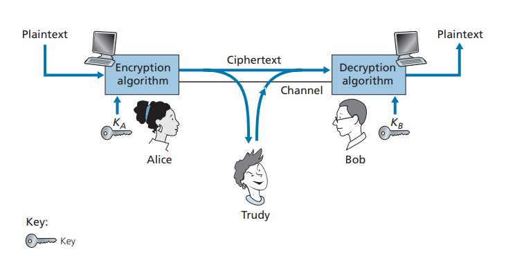
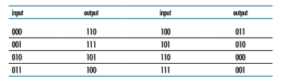
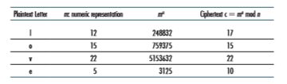

## Principles of Cryptography
Although cryptography has a long history dating back at least as far as Julius Caesar, modern cryptographic techniques, including many of those used in the Internet, are based on advances made in the past 30 years. Kahn’s book, _The Codebreakers_ [Kahn 1967], and Singh’s book, _The Code Book: The Science of Secrecy from Ancient Egypt to Quantum Cryptography_ [Singh 1999], provide a fascinating look at  

**Figure 8.2** ♦ Cryptographic components

the long history of cryptography. A complete discussion of cryptography itself requires a complete book [Bishop 2003; Kaufman 2002; Schneier 2015] and so we only touch on the essential aspects of cryptography, particularly as they are practiced on the Internet. We also note that while our focus in this section will be on the use of cryptography for confidentiality, we’ll see shortly that cryptographic techniques are inextricably woven into authentication, message integrity, nonrepudiation, and more.

Cryptographic techniques allow a sender to disguise data so that an intruder can gain no information from the intercepted data. The receiver, of course, must be able to recover the original data from the disguised data. Figure 8.2 illustrates some of the important terminology.

Suppose now that Alice wants to send a message to Bob. Alice’s message in its original form (e.g., “Bob, I love you. Alice”) is known as **plaintext**, or **cleartext**. Alice encrypts her plaintext message using an **encryption algorithm** so that the encrypted message, known as **ciphertext**, looks unintelligible to any intruder. Interestingly, in many modern cryptographic systems, including those used in the Internet, the encryption technique itself is _known_—published, standardized, and available to everyone (e.g., \[RFC 1321; RFC 3447; RFC 2420; NIST 2001\]), even a potential intruder! Clearly, if everyone knows the method for encoding data, then there must be some secret information that prevents an intruder from decrypting the transmitted data. This is where keys come in.

In Figure 8.2, Alice provides a **key**, _KA_, a string of numbers or characters, as input to the encryption algorithm. The encryption algorithm takes the key and the plaintext message, _m_, as input and produces ciphertext as output. The notation _KA_(_m_) refers to the ciphertext form (encrypted using the key _KA_) of the plaintext message, _m_. The actual encryption algorithm that uses key _KA_ will be evident from the context. Similarly, Bob will provide a key, _KB_, to the **decryption algorithm** that takes the ciphertext and Bob’s key as input and produces the original plain- text as output. That is, if Bob receives an encrypted message _KA_(_m_), he decrypts it by computing _KB_(_KA_(_m_)) = _m_. In **symmetric key systems**, Alice’s and Bob’s keys are identical and are secret. In **public key systems**, a pair of keys is used. One of the keys is known to both Bob and Alice (indeed, it is known to the whole world). The other key is known only by either Bob or Alice (but not both). In the following two subsections, we consider symmetric key and public key systems in more detail.

### Symmetric Key Cryptography

All cryptographic algorithms involve substituting one thing for another, for exam- ple, taking a piece of plaintext and then computing and substituting the appropriate ciphertext to create the encrypted message. Before studying a modern key-based cryptographic system, let us first get our feet wet by studying a very old, very simple symmetric key algorithm attributed to Julius Caesar, known as the **Caesar cipher
(a cipher is a method for encrypting data).

For English text, the Caesar cipher would work by taking each letter in the plain- text message and substituting the letter that is _k_ letters later (allowing wraparound; that is, having the letter _z_ followed by the letter _a_) in the alphabet. For example, if _k_ \= 3, then the letter _a_ in plaintext becomes _d_ in ciphertext; _b_ in plaintext becomes _e_ in ciphertext, and so on. Here, the value of _k_ serves as the key. As an example, the plaintext message “bob, i love you. Alice” becomes “ere, l oryh brx. dolfh” in ciphertext. While the ciphertext does indeed look like gibberish, it wouldn’t take long to break the code if you knew that the Caesar cipher was being used, as there are only 25 possible key values.

An improvement on the Caesar cipher is the **monoalphabetic cipher**, which also substitutes one letter of the alphabet with another letter of the alphabet. However, rather than substituting according to a regular pattern (e.g., substitution with an offset of _k_ for all letters), any letter can be substituted for any other letter, as long as each letter has a unique substitute letter, and vice versa. The substitution rule in Figure 8.3 shows one possible rule for encoding plaintext.

The plaintext message “bob, i love you. Alice” becomes “nkn, s gktc wky. Mgsbc.” Thus, as in the case of the Caesar cipher, this looks like gibberish. A monoalphabetic cipher would also appear to be better than the Caesar cipher in that there are 26! (on the order of 1026) possible pairings of letters rather than 25 possible pairings. A brute-force approach of trying all 10^26 possible pairings

**Figure 8.3**  ♦  A monoalphabetic cipher

**Plaintext letter:**a b c d e f g h i j k l m n o p q r s t u v w x y z **Ciphertext letter:** m n b v c x z a s d f g h j k l p o i u y t r e w q 

**Figure 8.3** ♦ A monoalphabetic cipher

would require far too much work to be a feasible way of breaking the encryption algorithm and decoding the message. However, by statistical analysis of the plain- text language, for example, knowing that the letters _e_ and _t_ are the most frequently occurring letters in typical English text (accounting for 13 percent and 9 percent of letter occurrences), and knowing that particular two-and three-letter occurrences of letters appear quite often together (for example, “in,” “it,” “the,” “ion,” “ing,” and so forth) make it relatively easy to break this code. If the intruder has some knowledge about the possible contents of the message, then it is even easier to break the code. For example, if Trudy the intruder is Bob’s wife and suspects Bob of having an affair with Alice, then she might suspect that the names “bob” and “alice” appear in the text. If Trudy knew for certain that those two names appeared in the ciphertext and had a copy of the example ciphertext message above, then she could immedi- ately determine seven of the 26 letter pairings, requiring 109 fewer possibilities to be checked by a brute-force method. Indeed, if Trudy suspected Bob of having an affair, she might well expect to find some other choice words in the message as well.

When considering how easy it might be for Trudy to break Bob and Alice’s encryption scheme, one can distinguish three different scenarios, depending on what information the intruder has.

• _Ciphertext-only attack._ In some cases, the intruder may have access only to the intercepted ciphertext, with no certain information about the contents of the plain- text message. We have seen how statistical analysis can help in a **ciphertext-only attack** on an encryption scheme.

• _Known-plaintext attack._ We saw above that if Trudy somehow knew for sure that “bob” and “alice” appeared in the ciphertext message, then she could have determined the (plaintext, ciphertext) pairings for the letters _a, l, i, c, e, b_, and _o_. Trudy might also have been fortunate enough to have recorded all of the cipher- text transmissions and then found Bob’s own decrypted version of one of the transmissions scribbled on a piece of paper. When an intruder knows some of the (plaintext, ciphertext) pairings, we refer to this as a **known-plaintext attack** on the encryption scheme.

• _Chosen-plaintext attack._ In a **chosen-plaintext attack**, the intruder is able to choose the plaintext message and obtain its corresponding ciphertext form. For the simple encryption algorithms we’ve seen so far, if Trudy could get Alice to send the message, “The quick brown fox jumps over the lazy dog,” she could completely break the encryption scheme. We’ll see shortly that for more sophisticated encryption techniques, a chosen-plaintext attack does not necessarily mean that the encryption technique can be broken.

Five hundred years ago, techniques improving on monoalphabetic encryp- tion, known as **polyalphabetic encryption**, were invented. The idea behind polyalphabetic encryption is to use multiple monoalphabetic ciphers, with a specific

Figure 8.4 ♦ A polyalphabetic cipher using two Caesar ciphers

monoalphabetic cipher to encode a letter in a specific position in the plaintext mes- sage. Thus, the same letter, appearing in different positions in the plaintext message, might be encoded differently. An example of a polyalphabetic encryption scheme is shown in Figure 8.4. It has two Caesar ciphers (with _k_ \= 5 and _k_ \= 19), shown as rows. We might choose to use these two Caesar ciphers, C1 and C2, in the repeating pattern C1, C2, C2, C1, C2. That is, the first letter of plaintext is to be encoded using C1, the second and third using C2, the fourth using C1, and the fifth using C2. The pattern then repeats, with the sixth letter being encoded using C1, the seventh with C2, and so on. The plaintext message “bob, i love you.” is thus encrypted “ghu, n etox dhz.” Note that the first _b_ in the plaintext message is encrypted using C1, while the second _b_ is encrypted using C2. In this example, the encryption and decryption “key” is the knowledge of the two Caesar keys (_k_ \= 5, _k_ \= 19) and the pattern C1, C2, C2, C1, C2.

**Block Ciphers**

Let us now move forward to modern times and examine how symmetric key encryp- tion is done today. We focus on block ciphers, which are used in many secure Internet protocols, including PGP (for secure e-mail), TLS (for securing TCP connections), and IPsec (for securing the network-layer transport).

In a block cipher, the message to be encrypted is processed in blocks of _k_ bits. For example, if _k_ \= 64, then the message is broken into 64-bit blocks, and each block is encrypted independently. To encode a block, the cipher uses a one-to-one map- ping to map the _k_\-bit block of cleartext to a _k_\-bit block of ciphertext. Let’s look at an example. Suppose that _k_ \= 3, so that the block cipher maps 3-bit inputs (cleartext) to 3-bit outputs (ciphertext). One possible mapping is given in Table 8.1. Notice that this is a one-to-one mapping; that is, there is a different output for each input. This block cipher breaks the message up into 3-bit blocks and encrypts each block accord- ing to the above mapping. You should verify that the message 010110001111 gets encrypted into 101000111001.

Continuing with this 3-bit block example, note that the mapping in Table 8.1 is just one mapping of many possible mappings. How many possible mappings are there? To answer this question, observe that a mapping is nothing more than a permu- tation of all the possible inputs. There are 23 (= 8) possible inputs (listed under 
the 

**Table 8.1**  ♦  A specific 3-bit block cipher

input columns). These eight inputs can be permuted in 8! = 40,320 different ways. Since each of these permutations specifies a mapping, there are 40,320 possible map- pings. We can view each of these mappings as a key—if Alice and Bob both know the mapping (the key), they can encrypt and decrypt the messages sent between them.

The brute-force attack for this cipher is to try to decrypt ciphtertext by using all mappings. With only 40,320 mappings (when _k_ \= 3), this can quickly be accom- plished on a desktop PC. To thwart brute-force attacks, block ciphers typically use much larger blocks, consisting of _k_ \= 64 bits or even larger. Note that the number of possible mappings for a general _k_\-block cipher is 2_k_!, which is astronomical for even moderate values of _k_ (such as _k_ \= 64).

Although full-table block ciphers, as just described, with moderate values of _k_ can produce robust symmetric key encryption schemes, they are unfortunately dif- ficult to implement. For _k_ \= 64 and for a given mapping, Alice and Bob would need to maintain a table with 264 input values, which is an infeasible task. Moreover, if Alice and Bob were to change keys, they would have to each regenerate the table. Thus, a full-table block cipher, providing predetermined mappings between all inputs and outputs (as in the example above), is simply out of the question.

Instead, block ciphers typically use functions that simulate randomly permuted tables. An example (adapted from Kaufman 2002) of such a function for _k_ \= 64 bits is shown in Figure 8.5. The function first breaks a 64-bit block into 8 chunks, with each chunk consisting of 8 bits. Each 8-bit chunk is processed by an 8-bit to 8-bit table, which is of manageable size. For example, the first chunk is processed by the table denoted by T1. Next, the 8 output chunks are reassembled into a 64-bit block. The positions of the 64 bits in the block are then scrambled (permuted) to produce a 64-bit output. This output is fed back to the 64-bit input, where another cycle begins. After _n_ such cycles, the function provides a 64-bit block of ciphertext. The purpose of the rounds is to make each input bit affect most (if not all) of the final output bits. (If only one round were used, a given input bit would affect only 8 of the 64 output bits.) The key for this block cipher algorithm would be the eight permutation tables (assuming the scramble function is publicly known).

Today there are a number of popular block ciphers, including DES (standing for Data Encryption Standard), 3DES, and AES (standing for Advanced Encryption

**Figure 8.5**  ♦  An example of a block cipher

Standard). Each of these standards uses functions, rather than predetermined tables, along the lines of Figure 8.5 (albeit more complicated and specific to each cipher). Each of these algorithms also uses a string of bits for a key. For example, DES uses 64-bit blocks with a 56-bit key. AES uses 128-bit blocks and can operate with keys that are 128, 192, and 256 bits long. An algorithm’s key determines the specific “mini-table” mappings and permutations within the algorithm’s internals. The brute- force attack for each of these ciphers is to cycle through all the keys, applying the decryption algorithm with each key. Observe that with a key length of _n_, there are 2_n_ possible keys. NIST NIST 2001 estimates that a machine that could crack 56-bit DES in one second (that is, try all 256 keys in one second) would take approximately 149 trillion years to crack a 128-bit AES key.

**Cipher-Block Chaining**

In computer networking applications, we typically need to encrypt long messages or long streams of data. If we apply a block cipher as described by simply chopping up the message into _k_\-bit blocks and independently encrypting each block, a subtle but important problem occurs. To see this, observe that two or more of the cleartext blocks can be identical. For example, the cleartext in two or more blocks could be “HTTP/1.1”. For these identical blocks, a block cipher would, of course, produce the same ciphertext. An attacker could potentially guess the cleartext when it sees identical ciphertext blocks and may even be able to decrypt the entire message by identifying identical ciphtertext blocks and using knowledge about the underlying protocol structure Kaufman 2002.

To address this problem, we can mix some randomness into the ciphertext so that identical plaintext blocks produce different ciphertext blocks. To explain this idea, let _m_(_i_) denote the _i_th plaintext block, _c_(_i_) denote the _i_th ciphertext block, and _a_ ⊕ _b_ denote the exclusive-or (XOR) of two bit strings, _a_ and _b_. (Recall that the 0 ⊕ 0 = 1 ⊕ 1 = 0 and 0 ⊕ 1 = 1 ⊕ 0 = 1, and the XOR of two bit strings is done on a bit-by-bit basis. So, for example, 10101010 ⊕ 11110000 = 01011010.) Also, denote the block-cipher encryption algorithm with key _S_ as _KS_. The basic idea is as follows. The sender creates a random _k_\-bit number _r_(_i_) for the _i_th block and calculates _c_(_i_) = _KS_(_m_(_i_) ⊕ _r_(_i_ )). Note that a new _k_\-bit random number is chosen for each block. The sender then sends _c_(1), _r_(1), _c_(2), _r_(2), _c_(3), _r_(3), and so on. Since the receiver receives _c(i)_ and _r(i)_, it can recover each block of the plaintext by computing _m_(_i_) = _KS_(_c_(_i_)) ⊕ _r_(_i_ ). It is important to note that, although _r_(_i_) is sent in the clear and thus can be sniffed by Trudy, she cannot obtain the plaintext _m_(_i_), since she does not know the key _KS_. Also note that if two plaintext blocks _m_(_i_) and _m_(_j_) are the same, the corresponding ciphertext blocks _c_(_i_) and _c_(_j_) will be different (as long as the random numbers _r_(_i_) and _r_(_j_) are different, which occurs with very high probability).

As an example, consider the 3-bit block cipher in Table 8.1. Suppose the plain- text is 010010010. If Alice encrypts this directly, without including the randomness, the resulting ciphertext becomes 101101101. If Trudy sniffs this ciphertext, because each of the three cipher blocks is the same, she can correctly surmise that each of the three plaintext blocks are the same. Now suppose instead Alice generates the ran- dom blocks _r_(1) = 001, _r_(2) = 111, and _r_(3) = 100 and uses the above technique to generate the ciphertext _c_(1) = 100, _c_(2) = 010, and _c_(3) = 000. Note that the three ciphertext blocks are different even though the plaintext blocks are the same. Alice then sends _c_(1), _r_(1), _c_(2), and _r_(2). You should verify that Bob can obtain the original plaintext using the shared key _KS_.

The astute reader will note that introducing randomness solves one problem but creates another: namely, Alice must transmit twice as many bits as before. Indeed, for each cipher bit, she must now also send a random bit, doubling the required band- width. In order to have our cake and eat it too, block ciphers typically use a technique called **Cipher Block Chaining (CBC)**. The basic idea is to send only _one random value along with the very first message, and then have the sender and receiver use the computed coded blocks in place of the subsequent random number._ Specifically, CBC operates as follows:

1\. Before encrypting the message (or the stream of data), the sender generates a random _k_\-bit string, called the **Initialization Vector (IV)**. Denote this initial- ization vector by _c_(0). The sender sends the IV to the receiver _in cleartext_.

2\. For the first block, the sender calculates _m_(1) ⊕ _c_(0), that is, calculates the exclu- sive-or of the first block of cleartext with the IV. It then runs the result through the block-cipher algorithm to get the corresponding ciphertext block; that is, _c_(1) = _KS_(_m_(1) ⊕ _c_(0)). The sender sends the encrypted block _c_(1) to the receiver.

3\. For the _i_th block, the sender generates the _i_th ciphertext block from _c_(_i_) = _KS_(_m_(_i_) ⊕ _c_(_i_ \- 1)).

Let’s now examine some of the consequences of this approach. First, the receiver will still be able to recover the original message. Indeed, when the receiver receives _c_(_i_), it decrypts it with _KS_ to obtain _s_(_i_) = _m_(_i_) ⊕ _c_(_i_ \- 1); since the receiver also knows _c_(_i_ \- 1), it then obtains the cleartext block from _m_(_i_) = _s_(_i_) ⊕ _c_(_i_ \- 1). Second, even if two cleartext blocks are identical, the corresponding ciphtertexts (almost always) will be different. Third, although the sender sends the IV in the clear, an intruder will still not be able to decrypt the ciphertext blocks, since the intruder does not know the secret key, _S_. Finally, the sender only sends one overhead block (the IV), thereby negligibly increasing the bandwidth usage for long messages (consisting of hundreds of blocks).

As an example, let’s now determine the ciphertext for the 3-bit block cipher in Table 8.1 with plaintext 010010010 and IV = _c_(0) = 001. The sender first uses the IV to calculate _c_(1) = _KS_(_m_(1) ⊕ _c_(0)) = 100. The sender then calculates _c_(2) = _KS_(_m_(2) ⊕ _c_(1)) = _KS_(010 ⊕ 100) = 000, and _c_(3) = _KS_(_m_(3) ⊕ _c_(2)) = _KS_(010 ⊕ 000) = 101. The reader should verify that the receiver, knowing the IV and _KS_ can recover the original plaintext.

CBC has an important consequence when designing secure network proto- cols: we’ll need to provide a mechanism within the protocol to distribute the IV from sender to receiver. We’ll see how this is done for several protocols later in this chapter.

### Public Key Encryption

For more than 2,000 years (since the time of the Caesar cipher and up to the 1970s), encrypted communication required that the two communicating parties share a com- mon secret—the symmetric key used for encryption and decryption. One difficulty with this approach is that the two parties must somehow agree on the shared key; but to do so in itself requires secure communication. Perhaps the parties could first meet and agree on the key in person (for example, two of Caesar’s centurions might meet at the Roman baths) and thereafter communicate with encryption. In a networked world, however, communicating parties may never meet and may never converse except over the network.

Is it possible for two parties to communicate with encryption without having a shared secret key that is known in advance? In 1976, Diffie and Hellman [Diffie 1976] demonstrated an algorithm (known now as Diffie-Hellman Key Exchange) to do just that—a radically different and marvelously elegant approach toward secure communication that has led to the development of today’s public key cryp- tography systems. We’ll see shortly that public key cryptography systems also have several wonderful properties that make them useful not only for encryption, but for authentication and digital signatures as well. Interestingly, it has come to light that ideas similar to those in Diffie 1976 and RSA 1978 had been independently developed in the early 1970s in a series of secret reports by researchers at the Communications-Electronics Security Group in the United Kingdom Ellis 1987.

**Figure 8.6**  ♦  Public key cryptography

As is often the case, great ideas can spring up independently in many places; for- tunately, public key advances took place not only in private, but also in the public view, as well.

The use of public key cryptography is conceptually quite simple. Suppose Alice wants to communicate with Bob. As shown in Figure 8.6, rather than Bob and Alice sharing a single secret key (as in the case of symmetric key systems), Bob (the recipi- ent of Alice’s messages) instead has two keys—a **public key** that is available to _everyone_ in the world (including Trudy the intruder) and a **private key** that is known only to Bob. We will use the notation _K_+_B_ and _K_\- _B_ to refer to Bob’s public and private keys, respectively. In order to communicate with Bob, Alice first fetches Bob’s public key. Alice then encrypts her message, _m_, to Bob using Bob’s public key and a known (for example, standardized) encryption algorithm; that is, Alice computes _K_+_B_(_m_). Bob receives Alice’s encrypted message and uses his private key and a known (for example, standardized) decryption algorithm to decrypt Alice’s encrypted mes- sage. That is, Bob computes _K_\-_B_(_K_\+ _B_(_m_)). We will see below that there are encryption/decryption algorithms and techniques for choosing public and private keys such that _K_\-_B_(_K_\+ _B_(_m_)) = _m;_ that is, applying Bob’s public key, _K_+_B_, to a message, _m_ (to get _K_+_B_(_m_)), and then applying Bob’s private key, _K_\- _B_, to the encrypted version of _m_ (that is, computing _K_\- _B_(_K_+_B_(_m_))) gives back _m._ This is a remarkable result! In this manner, Alice can use Bob’s publicly available key to send a secret message to Bob without either of them having to distribute any secret keys! We will see shortly that we can interchange the public key and private key encryption and get the same remarkable result––that is, _K_\-_B_ (_B_ +(_m_)) = _K_\+ _B_ (_K_\-_B_(_m_)) = _m_. Although public-key cryptography is appealing, one concern immediately springs to mind. Since Bob’s encryption key is public, anyone can send an encrypted

message to Bob, including Alice or someone _pretending_ to be Alice. In the case of a single shared secret key, the fact that the sender knows the secret key implicitly identifies the sender to the receiver. In the case of public key cryptography, however, this is no longer the case since anyone can send an encrypted message to Bob using Bob’s publicly available key. A digital signature, a topic we will study in Section 8.3, is needed to bind a sender to a message.

**RSA**

While there may be many algorithms that address these concerns, the **RSA algorithm** (named after its founders, Ron Rivest, Adi Shamir, and Leonard Adleman) has become almost synonymous with public key cryptography. Let’s first see how RSA works and then examine why it works.

RSA makes extensive use of arithmetic operations using modulo-_n_ arithmetic. So let’s briefly review modular arithmetic. Recall that _x_ mod _n_ simply means the remainder of _x_ when divided by _n_; so, for example, 19 mod 5 = 4. In modular arith- metic, one performs the usual operations of addition, multiplication, and exponen- tiation. However, the result of each operation is replaced by the integer remainder that is left when the result is divided by _n_. Adding and multiplying with modular arithmetic is facilitated with the following handy facts:

[(_a_ mod _n_) + (_b_ mod _n_)] mod _n_ = (_a_ + _b_) mod _n_

[(_a_ mod _n_) - (_b_ mod _n_)] mod _n_ = (_a_ - _b_) mod _n_

[(_a_ mod _n_) + (_b_ mod _n_)] mod _n_ = (_a_ . _b_) mod _n_

It follows from the third fact that (_a_ mod _n_)_d_ mod _n_ \= _ad_ mod _n_, which is an identity that we will soon find very useful.

Now suppose that Alice wants to send to Bob an RSA-encrypted message, as shown in Figure 8.6. In our discussion of RSA, let’s always keep in mind that a mes- sage is nothing but a bit pattern, and every bit pattern can be uniquely represented by an integer number (along with the length of the bit pattern). For example, suppose a message is the bit pattern 1001; this message can be represented by the decimal integer 9. Thus, when encrypting a message with RSA, it is equivalent to encrypting the unique integer number that represents the message.

There are two interrelated components of RSA:

• The choice of the public key and the private key

• The encryption and decryption algorithm

To generate the public and private RSA keys, Bob performs the following steps:

1\. Choose two large prime numbers, _p_ and _q_. How large should _p_ and _q_ be? The larger the values, the more difficult it is to break RSA, but the longer it takesto perform the encoding and decoding. RSA Laboratories recommends that the product of _p_ and _q_ be on the order of 1,024 bits. For a discussion of how to find large prime numbers, see [Caldwell 2020].

2\. Compute _n_ \= _pq_ and _z_ = (_p_ - 1)(_q_ - 1). 

3\. Choose a number, _e_, less than _n_, that has no common factors (other than 1)

with _z._ (In this case, _e_ and _z_ are said to be relatively prime.) The letter _e_ is used since this value will be used in encryption.

4\. Find a number, _d_, such that _ed_ - 1 is exactly divisible (that is, with no remainder) by _z_. The letter _d_ is used because this value will be used in decryption. Put another way, given _e_, we choose _d_ such that

ed mod z = 1

5\. The public key that Bob makes available to the world, _K_\+ _B_, is the pair of numbers

(_n_, _e_); his private key, _K_\- _B_, is the pair of numbers (_n_, _d_).

The encryption by Alice and the decryption by Bob are done as follows:

• Suppose Alice wants to send Bob a bit pattern represented by the integer number _m_ (with _m_ 6 _n_). To encode, Alice performs the exponentiation _me_, and then computes the integer remainder when _me_ is divided by _n_. In other words, the encrypted value, _c_, of Alice’s plaintext message, _m_, is

c = m^e mod n

The bit pattern corresponding to this ciphertext _c_ is sent to Bob.

• To decrypt the received ciphertext message, _c_, Bob computes

m = cd mod n

which requires the use of his private key (_n_, _d_).

As a simple example of RSA, suppose Bob chooses _p_ = 5 and _q_ = 7. (Admittedly,

these values are far too small to be secure.) Then _n_ = 35 and _z_ = 24. Bob chooses _e_ = 5, since 5 and 24 have no common factors. Finally, Bob chooses _d_ = 29, since 5 # 29 - 1 (that is, _ed_ - 1) is exactly divisible by 24. Bob makes the two values, _n_ = 35 and _e_ = 5, public and keeps the value _d_ = 29 secret. Observing these two public values, suppose Alice now wants to send the letters _l_, _o_, _v_, and _e_ to Bob. Interpreting each letter as a number between 1 and 26 (with _a_ being 1, and _z_ being 26), Alice and Bob perform the encryption and decryption shown in Tables 8.2 and 8.3, respectively. Note that in this example, we consider each of the four letters as a distinct message. A more realistic example would be to convert the four letters into their 8-bit ASCII representations and then encrypt the integer corresponding to the resulting 32-bit bit pattern. (Such a realistic example generates numbers that are much too long to print in a textbook!)

**Table 8.2**  ♦  Alice’s RSA encryption, _e_ = 5, _n_ = 35

Given that the “toy” example in Tables 8.2 and 8.3 has already produced some extremely large numbers, and given that we saw earlier that _p_ and _q_ should each be several hundred bits long, several practical issues regarding RSA come to mind. How does one choose large prime numbers? How does one then choose _e_ and _d_? How does one perform exponentiation with large numbers? A discussion of these important issues is beyond the scope of this book; see [Kaufman 2002] and the refer- ences therein for details.

**Session Keys**

We note here that the exponentiation required by RSA is a rather time-consuming process. As a result, RSA is often used in practice in combination with symmet- ric key cryptography. For example, if Alice wants to send Bob a large amount of encrypted data, she could do the following. First Alice chooses a key that will be used to encode the data itself; this key is referred to as a **session key**, and is denoted by _KS_. Alice must inform Bob of the session key, since this is the shared symmetric key they will use with a symmetric key cipher (e.g., with DES or AES). Alice encrypts the session key using Bob’s public key, that is, computes _c_ \= (_KS_)_e_ mod _n_. Bob receives the RSA-encrypted session key, _c_, and decrypts it to obtain

**Table 8.3**  ♦  Bob’s RSA decryption, _d_ = 29, _n_ = 35

the session key, _KS_. Bob now knows the session key that Alice will use for her encrypted data transfer.

**Why Does RSA Work?**

RSA encryption/decryption appears rather magical. Why should it be that by apply- ing the encryption algorithm and then the decryption algorithm, one recovers the original message? In order to understand why RSA works, again denote _n_ = _pq_, where _p_ and _q_ are the large prime numbers used in the RSA algorithm.

Recall that, under RSA encryption, a message (uniquely represented by an integer), _m_, is exponentiated to the power _e_ using modulo-_n_ arithmetic, that is,

c = me mod n

Decryption is performed by raising this value to the power _d_, again using modulo-_n_ arithmetic. The result of an encryption step followed by a decryption step is thus (_me_ mod _n_)_d_ mod _n_. Let’s now see what we can say about this quantity. As mentioned earlier, one important property of modulo arithmetic is (_a_ mod _n_)_d_ mod _n_ = _ad_ mod _n_ for any values _a_, _n_, and _d_. Thus, using _a_ = _me_ in this property, we have

(me mod n)d mod n = med mod n

It therefore remains to show that _med_ mod _n_ = _m_. Although we’re trying to remove some of the magic about why RSA works, to establish this, we’ll need to use a rather magical result from number theory here. Specifically, we’ll need the result that says if _p_ and _q_ are prime, _n_ = _pq_, and _z_ = (_p_ - 1)(_q_ - 1), then _xy_ mod _n_ is the same as _x_(_y_ mod _z_) mod _n_ [Kaufman 2002]. Applying this result with _x_ = _m_ and _y_ = _ed_ we have

med mod n = m(ed mod z) mod n

But remember that we have chosen _e_ and _d_ such that _ed_ mod z = 1. This gives us

med mod n = m1 mod n = m

which is exactly the result we are looking for! By first exponentiating to the power of _e_ (that is, encrypting) and then exponentiating to the power of _d_ (that is, decrypting), we obtain the original value, _m._ Even _more_ wonderful is the fact that if we first exponentiate to the power of _d_ and then exponentiate to the power of _e_—that is, we reverse the order of encryption and decryption, performing the decryption operation first and then applying the encryption operation—we also obtain the original value, _m_. This wonderful result follows immediately from the modular arithmetic:

(md mod n)e mod n = mde mod n = med mod n = (me mod n)d mod n

The security of RSA relies on the fact that there are no known algorithms for quickly factoring a number, in this case the public value _n_, into the primes _p_ and _q_. If one knew _p_ and _q_, then given the public value _e_, one could easily compute the secret key, _d_. On the other hand, it is not known whether or not there _exist_ fast algorithms for factoring a number, and in this sense, the security of RSA is not guaranteed. With recent advances in quantum computing, and published fast factoring algorithms for quantum computers, there are concerns that RSA may not be secure forever [MIT TR 2019]. But the practical realization of these algorithms still appears to be far in the future.

Another popular public-key encryption algorithm is the Diffie-Hellman algo- rithm, which we will briefly explore in the homework problems. Diffie-Hellman is not as versatile as RSA in that it cannot be used to encrypt messages of arbitrary length; it can be used, however, to establish a symmetric session key, which is in turn used to encrypt messages.
