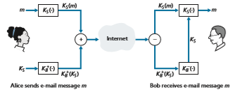
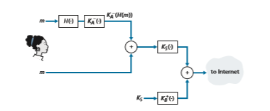
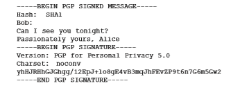
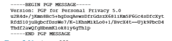

## Securing E-Mail
In previous sections, we examined fundamental issues in network security, including symmetric key and public key cryptography, end-point authentication, key distribu- tion, message integrity, and digital signatures. We are now going to examine how these tools are being used to provide security in the Internet.

Interestingly, it is possible to provide security services in any of the top four layers of the Internet protocol stack. When security is provided for a specific applica- tion-layer protocol, the application using the protocol will enjoy one or more security services, such as confidentiality, authentication, or integrity. When security is pro- vided for a transport-layer protocol, all applications that use that protocol enjoy the security services of the transport protocol. When security is provided at the network layer on a host-to-host basis, all transport-layer segments (and hence all application- layer data) enjoy the security services of the network layer. When security is pro- vided on a link basis, then the data in all frames traveling over the link receive the security services of the link.

In Sections 8.5 through 8.8, we examine how security tools are being used in the application, transport, network, and link layers. Being consistent with the general structure of this book, we begin at the top of the protocol stack and discuss security at the application layer. Our approach is to use a specific application, e-mail, as a case study for application-layer security. We then move down the protocol stack. We’ll examine the TLS protocol (which provides security at the transport layer), IPsec (which provides security at the network layer), and the security of the IEEE 802.11 wireless LAN protocol.

You might be wondering why security functionality is being provided at more than one layer in the Internet. Wouldn’t it suffice simply to provide the security functionality at the network layer and be done with it? There are two answers to this question. First, although security at the network layer can offer “blanket coverage” by encrypting all the data in the datagrams (that is, all the transport-layer segments)

Boband by authenticating all the source IP addresses, it can’t provide user-level secu- rity. For example, a commerce site cannot rely on IP-layer security to authenticate a customer who is purchasing goods at the commerce site. Thus, there is a need for security functionality at higher layers as well as blanket coverage at lower lay- ers. Second, it is generally easier to deploy new Internet services, including security services, at the higher layers of the protocol stack. While waiting for security to be broadly deployed at the network layer, which is probably still many years in the future, many application developers “just do it” and introduce security functional- ity into their favorite applications. A classic example is Pretty Good Privacy (PGP), which provides secure e-mail (discussed later in this section). Requiring only client and server application code, PGP was one of the first security technologies to be broadly used in the Internet.

### Secure E-Mail
We now use the cryptographic principles of Sections 8.2 through 8.3 to create a secure e-mail system. We create this high-level design in an incremental manner, at each step introducing new security services. When designing a secure e-mail sys- tem, let us keep in mind the racy example introduced in Section 8.1—the love affair between Alice and Bob. Imagine that Alice wants to send an e-mail message to Bob, and Trudy wants to intrude.

Before plowing ahead and designing a secure e-mail system for Alice and Bob, we should consider which security features would be most desirable for them. First and foremost is _confidentiality._ As discussed in Section 8.1, neither Alice nor Bob wants Trudy to read Alice’s e-mail message. The second feature that Alice and Bob would most likely want to see in the secure e-mail system is _sender authentication_. In particular, when Bob receives the message “I don’t love you anymore. I never want to see you again. Formerly yours, Alice,” he would naturally want to be sure that the message came from Alice and not from Trudy. Another feature that the two lovers would appreciate is _message integrity_, that is, assurance that the message Alice sends is not modified while en route to Bob. Finally, the e-mail system should provide _receiver authentication_; that is, Alice wants to make sure that she is indeed sending the letter to Bob and not to someone else (for example, Trudy) who is impersonating Bob.

So let’s begin by addressing the foremost concern, confidentiality. The most straightforward way to provide confidentiality is for Alice to encrypt the message with symmetric key technology (such as DES or AES) and for Bob to decrypt the message on receipt. As discussed in Section 8.2, if the symmetric key is long enough, and if only Alice and Bob have the key, then it is extremely difficult for anyone else (including Trudy) to read the message. Although this approach is straightforward, it has the fundamental difficulty that we discussed in Section 8.2—distributing a sym- metric key so that only Alice and Bob have copies of it. So we naturally consider an alternative approach—public key cryptography (using, for example, RSA). In thepublic key approach, Bob makes his public key publicly available (e.g., in a public key server or on his personal Web page), Alice encrypts her message with Bob’s public key, and she sends the encrypted message to Bob’s e-mail address. When Bob receives the message, he simply decrypts it with his private key. Assuming that Alice knows for sure that the public key is Bob’s public key, this approach is an excellent means to provide the desired confidentiality. One problem, however, is that public key encryption is relatively inefficient, particularly for long messages.

To overcome the efficiency problem, let’s make use of a session key (discussed in Section 8.2.2). In particular, Alice (1) selects a random symmetric session key, _KS_, (2) encrypts her message, _m_, with the symmetric key, (3) encrypts the symmetric key with Bob’s public key, _KB_ +, (4) concatenates the encrypted message and the encrypted symmetric key to form a “package,” and (5) sends the package to Bob’s e-mail address. The steps are illustrated in Figure 8.19. (In this and the subsequent figures, the circled “+” represents concatenation and the circled “-” represents deconcatenation.) When Bob receives the package, he (1) uses his private key, _K_\-_B_, to obtain the symmetric key, _KS_, and (2) uses the symmetric key _KS_ to decrypt the mes- sage _m_.

Having designed a secure e-mail system that provides confidentiality, let’s now design another system that provides both sender authentication and message integ- rity. We’ll suppose, for the moment, that Alice and Bob are no longer concerned with confidentiality (they want to share their feelings with everyone!), and are concerned only about sender authentication and message integrity. To accomplish this task, we use digital signatures and message digests, as described in Section 8.3. Specifically, Alice (1) applies a hash function, _H_ (e.g., MD5), to her message, _m_, to obtain a message digest, (2) signs the result of the hash function with her private key, _K_\-_A_, to create a digital signature, (3) concatenates the original (unencrypted) message with the signature to create a package, and (4) sends the package to Bob’s e-mail address. When Bob receives the package, he (1) applies Alice’s public key, _K_+_A_, to the signed

**Figure 8.19**  ♦   Alice used a symmetric session key, _KS_, to send a secret e-mail to Bob

**Figure 8.20**  ♦   Using hash functions and digital signatures to provide sender authentication and message integrity

message digest and (2) compares the result of this operation with his own hash, _H_, of the message. The steps are illustrated in Figure 8.20. As discussed in Section 8.3, if the two results are the same, Bob can be pretty confident that the message came from Alice and is unaltered.

Now let’s consider designing an e-mail system that provides confidentiality, sender authentication, _and_ message integrity. This can be done by combining the procedures in Figures 8.19 and 8.20. Alice first creates a preliminary package, exactly as in Figure 8.20, that consists of her original message along with a digitally signed hash of the message. She then treats this preliminary package as a message in itself and sends this new message through the sender steps in Figure 8.19, creating a new package that is sent to Bob. The steps applied by Alice are shown in Figure 8.21. When Bob receives the package, he first applies his side of Figure 8.19 and then his

**Figure 8.21**  ♦   Alice uses symmetric key cyptography, public key cryptography, a hash function, and a digital signature to provide secrecy, sender authentication, and message integrity 

side of Figure 8.20. It should be clear that this design achieves the goal of provid- ing confidentiality, sender authentication, and message integrity. Note that, in this scheme, Alice uses public key cryptography twice: once with her own private key and once with Bob’s public key. Similarly, Bob also uses public key cryptography twice—once with his private key and once with Alice’s public key.

The secure e-mail design outlined in Figure 8.21 probably provides satisfactory security for most e-mail users for most occasions. However, there is still one important issue that remains to be addressed. The design in Figure 8.21 requires Alice to obtain Bob’s public key, and requires Bob to obtain Alice’s public key. The distribution of these public keys is a nontrivial problem. For example, Trudy might masquerade as Bob and give Alice her own public key while saying that it is Bob’s public key, enabling her to receive the message meant for Bob. As we learned in Section 8.3, a popular approach for securely distributing public keys is to _certify_ the public keys using a CA.

### PGP
Written by Phil Zimmermann in 1991, **Pretty Good Privacy (PGP)**is a nice exam- ple of an e-mail encryption scheme [PGP 2020]. The PGP design is, in essence, the same as the design shown in Figure 8.21. Depending on the version, the PGP soft- ware uses MD5 or SHA for calculating the message digest; CAST, triple-DES, or IDEA for symmetric key encryption; and RSA for the public key encryption.

When PGP is installed, the software creates a public key pair for the user. The public key can be posted on the user’s Web site or placed in a public key server. The private key is protected by the use of a password. The password has to be entered every time the user accesses the private key. PGP gives the user the option of dig- itally signing the message, encrypting the message, or both digitally signing and encrypting. Figure 8.22 shows a PGP signed message. This message appears after the MIME header. The encoded data in the message is _K_\-_A_ (_H_(_m_)), that is, the digi- tally signed message digest. As we discussed above, in order for Bob to verify the integrity of the message, he needs to have access to Alice’s public key.

**Figure 8.22**  ♦  A PGP signed message

**Figure 8.23**♦ A secret PGP message 

shows a secret PGP message. This message also appears after the MIME header. Of course, the plaintext message is not included within the secret e-mail message. When a sender (such as Alice) wants both confidentiality and integrity, PGP contains a message like that of Figure 8.23 within the message of Figure 8.22.

PGP also provides a mechanism for public key certification, but the mechanism is quite different from the more conventional CA. PGP public keys are certified by a _web of trust._ Alice herself can certify any key/username pair when she believes the pair really belong together. In addition, PGP permits Alice to say that she trusts another user to vouch for the authenticity of more keys. Some PGP users sign each other’s keys by holding key-signing parties. Users physically gather, exchange public keys, and certify each other’s keys by signing them with their private keys.
