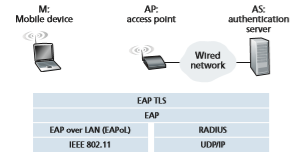

## Securing Wireless LANs and 4G/5G Cellular Networks

Security is a particularly important concern in wireless networks, where the attacker can sniff frames by simply positioning a receiving device anywhere within the trans- mission range of the sender. This is true in both 802.11 wireless LANs, as well as in 4G/5G cellular networks. In both settings, we’ll see extensive use of the fundamental security techniques that we studied earlier in this chapter, including the use of nonces for authentication, cryptographic hashing for message integrity, derivation of shared symmetric keys for encrypting user-session data, and the extensive use of the AES encryption standard. We will also see, as is also the case in wired Internet settings, that wireless security protocols have undergone constant evolution, as researchers and hackers discover weaknesses and flaws in existing security protocols.

In this section, we present a brief introduction to wireless security in both 802.11(WiFi) and 4G/5G settings. For a more in-depth treatment, see the highly read- able 802.11 security books [Edney 2003; Wright 2015], the excellent coverage of 3G/4G/5G security in [Sauter 2014], and recent surveys [Zou 2016; Kohlios 2018].

### Authentication and Key Agreement in 802.11 Wireless LANs

Let’s start our discussion of 802.11 security by identifying two (of many [Zou 2016]) critical security concerns that we’ll want an 802.11 network to handle:

• _Mutual authentication._ Before a mobile device is allowed to fully attach to an access point and send datagrams to remote hosts, the network will typically want to first authenticate the device—to verify the identity of the mobile device attach- ing to the network, and to check that device’s access privileges. Similarly, the mobile device will want to authenticate the network to which it is attaching—to make sure that the network it is joining is truly the network to which it wants to attach. This two-way authentication is known as **mutual authentication**.

• _Encryption._ Since 802.11 frames will be exchanged over a wireless channel that can be sniffed and manipulated by potential ne’er do-wells, it will be important to encrypt link-level frames carrying user-level data exchanged between the mobile device and the access point (AP). Symmetric key encryption is used in practice, since encryption and decryption must be performed at high speeds. The mobile device and AP will need to derive the symmetric encryption and decryption keys to be used.

Figure 8.30 illustrates the scenario of a mobile device wishing to attach to an 802.11 network. We see the two usual network components that we encountered

**Figure 8.30**  ♦   Mutual authentication and encryption-key derivation in WPA

in our earlier study of 802.11 networks in Section 7.3—the mobile device and the AP. We also see a new architectural component, the **authentication server** (AS) that will be responsible for authenticating the mobile device. The authentication server might be co-located in the AP, but more typically and as shown in Figure 8.30, it is implemented as a separate server that provides authentication services. For authen- tication, the AP serves as a pass-through device, relaying authentication and key derivation messages between the mobile device and the authentication server. Such an authentication server would typically provide authentication services for all APs within its network.

We can identify four distinct phases to the process of mutual authentication and encryption-key derivation and use in Figure 8.30:

1\. _Discovery._ In the discovery phase, the AP advertises its presence and the forms of authentication and encryption that can be provided to the mobile device. The mobile device then requests the specific forms of authentication and encryption that it desires. Although the device and AP are already exchanging messages, the device has not yet been authenticated nor does it have an encryption key for frame transmission over the wireless link, and so several more steps will be required before the device can communicate securely through the AP.

2\. _Mutual authentication and shared symmetric key derivation._ This is the most critical step in “securing” the 802.11 channel. As we will see, this step is

greatly facilitated by assuming (which is true in practice in both 802.11 and 4G/5G networks) that the authentication server and the mobile device already have a **shared common secret** before starting mutual authentication. In this step, the device and the authentication server will use this shared secret along with nonces (to prevent relay attacks) and cryptographic hashing (to ensure message integrity) in authenticating each other. They will also derive the shared session key to be used by the mobile device and the AP to encrypt frames transmitted over the 802.11 wireless link.

3\. _Shared symmetric session key distribution._ Since the symmetric encryption key is derived at the mobile device and the authentication server, a protocol will be needed for the authentication server to inform the AP of the shared symmetric session key. While this is rather straightforward, it still is a necessary step.

4\. _Encrypted communication between mobile device and a remote host via the AP._ This communication happens as we saw earlier in Section 7.3.2, with the link-layer frames sent between the mobile device and the AP being encrypted using the shared session key created and distributed by Steps 2 and 3. AES symmetric key cryptography, which we covered earlier in Section 8.2.1, is typically used in practice for encrypting/decrypting 802.11 frame data.

**Mutual Authentication and Shared Symmetric Session Key Derivation**

The topics of mutual authentication and shared symmetric session key derivation are the central components of 802.11 security. Since it is here that security flaws in various ear- lier versions of 802.11 security have been discovered, let’s tackle these challenges first.

The issue of 802.11security has attracted considerable attention in both technical circles and in the media. While there has been considerable discussion, there has been little debate—there is universal agreement that the original 802.11security specifica- tion known collectively as Wired Equivalent Privacy (WEP) contained a number of serious security flaws \[Fluhrer 2001; Stubblefield 2002\]. Once these flaws were discovered, public domain software was soon available exploiting these holes, mak- ing users of WEP-secured 802.11 WLANs as open to security attacks as users who used no security features at all. Readers interested in learning about WEP can consult the references, as well as earlier editions of this textbook, which covered WEP. As always, retired material from this book is available on the Companion Website.

WiFi Protected Access (WPA1) was developed in 2003 by the WiFi Alli- ance [WiFi 2020] to overcome WEP’s security flaws. The initial version of WPA1 improved on WEP by introducing message integrity checks, and avoiding attacks that allowed a user to infer encryption keys after observing the stream of encrypted messages for a period of time. WPA1 soon gave way to WPA2, which mandated the use of AES symmetric key encryption.

At the heart of WPA is a four-way handshake protocol that performs both mutual authentication and shared symmetric session-key derivation. The handshake protocol is shown in Figure 8.31 in simplified form. Note that both the mobile device (M) and the authentication server (AS) begin knowing a shared secret key _KAS-M_

**Figure 8.31**  ♦  The WPA2 four-way handshake

(e.g., a password). One of their tasks will be to derive a shared symmetric session- key, _KM-AP_, which will be used to encrypt/decrypt frames that are later transmitted between the mobile device (M) and the AP.

Mutual authentication and shared symmetric session-key derivation are accomplished in the first two steps, a and b, of the four-way handshake shown in Figure 8.31. Steps c and d are used to derive a second key used for group communi- cation; see [Kohlios 2018; Zou 2016] for details.

a. In this first step, the authentication server (AS) generates a nonce, _NonceAS_, and sends it to the mobile device. Recall from Section 8.4 that nonces are used to avoid playback attacks and prove the “liveness” of the other side being authenticated.

b. The mobile device, M, receives the nonce, _NonceAS_, from the AS and gener- ates its own nonce, _NonceM_. The mobile device then generates the symmetric shared session key, _KM-AP_, using _NonceAS_, _NonceM_, the initial shared secret key _KAS-M_, its MAC address, and the MAC address of the AS. It then sends its nonce, _NonceM_, and an HMAC-signed (see Figure 8.9) value that encodes _NonceAS_ and the original shared secret.

The AS receives this message from M. By looking at the HMAC-signed ver- sion of the nonce it had just recently sent, _NonceAS_, the authentication server knows the mobile device is live; because the mobile device was able to encrypt using the shared secret key, _KAS-M_, the AS also knows that the mobile device is indeed who it claims to be (i.e., a device that knows the shared initial secret). The AS has thus authenticated the mobile device! The AS can also now perform the exact same computation as the mobile device to derive the shared symmetric session-key, _KM-AP_, using the _NonceM_ it received, _NonceAS_, the initial shared secret key _KAS-M_, its MAC address and the MAC address of the mobile device. At this point both the mobile device and the authentication server have computed the same shared symmetric key, _KM-AP_, which will be used to encrypt/decrypt frames transmitted between the mobile device and the AP. The AS informs the AP of this key value in Step 3 in Figure 8.30.

WPA3 was released in June 2018 as an update to WPA2. The update addresses an attack on the four-way handshake protocol that could induce the reuse of previously used nonces [Vanhoef 2017] but still permits the use of the four-way handshake as a legacy protocol and includes longer key lengths, among other changes [WiFi 2019].

**802.11 Security Messaging Protocols**

Figure 8.32 shows the protocols used to implement the 802.11 security framework discussed above. The Extensible Authentication Protocol (EAP) [RFC 3748] defines the end-to-end message formats used in a simple request/response mode of interaction between the mobile device and authentication server, and are certified under WPA2. As shown in Figure 8.32, EAP messages are encapsulated using EAPoL (EAP over LAN) and sent over the 802.11 wireless link. These EAP messages are then decap- sulated at the access point, and then re-encapsulated using the RADIUS protocol for

**Figure 8.32**  ♦   EAP is an end-to-end protocol. EAP messages are encapsulated using EAPoL over the wireless link between the mobile device and the access point, and using RADIUS over UDP/IP between the access point and the authentication servertransmission over UDP/IP to the authentication server. While the RADIUS server and protocol [RFC 2865] are not required, they are _de facto_ standard components. The recently standardized DIAMETER protocol [RFC 3588] is projected to eventu- ally replace RADIUS in the future.

### Authentication and Key Agreement in 4G/5G Cellular Networks

In this section, we describe mutual authentication and key-generation mechanisms in 4G/5G networks. Many of the approaches we’ll encounter here parallel those that we just studied in 802.11 networks, with the notable exception that in 4G/5G networks, mobile devices may be attached to their home network (i.e., the cellular carrier network to which they are subscribed), or may be roaming on a visited net- work. In this latter case, the visited and home networks will need to interact when authenticating a mobile device and generating encryption keys. Before continuing, you may want to re-familiarize yourself with 4G/5G network architecture by re- reading Sections 7.4 and 7.7.1.
The goals of mutual authentication and key generation are the same in the 4G/5G setting as in the 802.11 setting. In order to encrypt the contents of frames being transmitted over the wireless channel, the mobile device and base station will need to derive a shared symmetric encryption key. In addition, the network to which the mobile device is attaching will need to authenticate the device’s identity and check its access privileges. Similarly, the mobile device will also want to authenticate the network to which it is attaching. While the network’s need to authenticate a mobile device may be obvious, the need for authentication in the reverse direction may not be so clear. However, there are documented cases of ne’er-do-wells operating rogue cellular base stations that entice unsuspecting mobile devices to attach to the rogue network, exposing a device to a number of attacks [Li 2017]. So, as in the case of 802.11 WLANs, a mobile device should exercise abundant caution when attaching to a cellular network!

Figure 8.33 illustrates the scenario of mobile device attaching to a 4G cellu- lar network. At the top of Figure 8.33, we see many of the 4G components that we encountered earlier in Section 7.4—the mobile device (M), the base station (BS), the mobility management entity (MME) in the network to which the mobile device wants to attach, and the home subscriber service (HSS) in the mobile device’s home net- work. A comparison of Figures 8.30 and 8.33 shows the similarities and differences between the 802.11 and 4G security settings. We again see a mobile device and a base station; the user session-key derived during network attachment, KBS-M, will be used to encrypt/decrypt frames transmitted over their wireless link. The 4G MME and HSS together will play a role similar to that of the authentication server in the 802.11 setting. Note that the HSS and the mobile device also share a common secret, KHSS-M, known to both entities before authentication begins. This key is stored in the mobile device’s SIM card, and in the HSS database in the mobile device’s home network.

**Figure 8.33**  ♦   Mutual authentication and key agreement in a 4G LTE cellular network

The 4G Authentication and Key Agreement (AKA) protocol consists of the fol- lowing steps:

a. _Authentication request to HSS._ When the mobile device first requests, via a base station, to attach to the network, it sends an attach message containing its international mobile subscriber identity (IMSI) that is relayed to the Mobility Management Entity (MME). The MME will then send the IMSI and informa- tion about the visited network (shown as “VN info” in Figure 8.33) to the Home Subscriber Service (HSS) in the device’s home network. In Section 7.4, we described how the MME is able to communicate with the HSS through the all-IP global network of interconnected cellular networks.

b. _Authentication response from HSS._ The HSS performs cryptographic operations using the shared-in-advance secret key, KHSS-M, to derive an authentication token, _auth\_token_, and an expected authentication response token, _xresHSS_. _auth\_token_ contains information encrypted by the HSS using KHSS-M that will allow the mobile device to know that whoever computed _auth\_token_ knows the secret key. For example, suppose the HSS computes KHSS-M(IMSI), that is, encrypts the device’s IMSI using KHSS-M and sends that value as _auth\_token_. When the mobile device receives that encrypted value and uses its secret key to decrypt this value, that is, to compute

KHSS-M(KHSS-M(IMSI)) 5 IMSI, it knows that the HSS that generated _auth\_ token_ knows its secret key. The mobile device can thus authenticate the HSS.

The expected authentication response token, _xresHSS_, contains a value that the mobile device will need to be able to compute (using KHSS-M) and return to the MME to prove that _it_ (the mobile device) knows the secret key, thus authenti- cating the mobile device to the MME.

Note that the MME only plays a middleman role here, receiving the authenti- cation response message, keeping _xresHSS_ for later use, extracting the authen- tication token and forwarding it to the mobile device. In particular it need not know, and will not learn, the secret key, KHSS-M.

c. _Authentication response from mobile device._ The mobile device receives _auth\_token_ and computes KHSS-M(KHSS-M(IMSI)) 5 IMSI, thus authenticating the HSS. The mobile device then computes a value _resM_—using its secret key to make the exact same cryptographic calculation that the HSS had made to compute _xresHSS_—and sends this value to the MME.

d. _Mobile device authentication._ The MMS compares the mobile-computed value of _resM_ with the HSS-computed value of _xresHSS_. If they match, the mobile device is authenticated, since the mobile has proven to the MME that it and the HSS both know the common secret key. The MMS informs the base station and mobile device that mutual authentication is complete, and sends the base station keys that will be used in step e.

e. _Data plane and control plane key derivation._ The mobile device and the base station will each determine the keys used for encrypting/decrypting their frame transmissions over the wireless channel. Separate keys will be derived for data plane and control plane frame transmissions. The AES encryption algorithm that we saw in use in 802.11 networks is also used in 4G/5G networks.

Our discussion above has focused on authentication and key agreement in 4G networks. Although much of the 4G security is being carried forward into 5G, there are some important changes:

• First, note that in our discussion above that it is the MME in the visited network that makes the authentication decision. A significant change underway in 5G network security is to allow authentication services to be provided by the home network, with the visited network playing an even smaller middleman role. While the visited network may still reject an authentication from a mobile device, it is up to the home network to accept the authentication request in this new 5G scenario.

• 5G networks will support the Authentication and Key Agreement (AKA) proto- col described above, as well as two new additional protocols for authentication and key agreement. One of these, known as AKA¿, is closely related to the 4G AKA protocol. It also uses the shared-in-advance secret key, KHSS-M. However, since it uses the EAP protocol that we encountered earlier in Figure 8.33 in the context of 802.11 authentication, 5G AKA¿ has different message flows than thatof 4G AKA. The second new 5G protocol is meant for an IoT environment, and does not require a shared-in-advance secret key.

• An additional change in 5G is to use public key cryptography techniques to encrypt a device’s permanent identity (i.e., its IMSI) so that it is never transmit- ted in cleartext.

In this section, we have only briefly overviewed mutual authentication and key agreement in 4G /5G networks. As we have seen, they make extensive use of the security techniques that we studied earlier in this chapter. More details on 4G/5G security can be found in [3GPP SAE 2019; Cable Labs 2019; Cichonski 2017].
