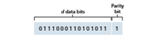
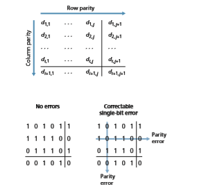
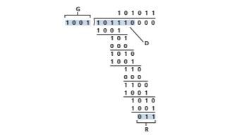

## Error-Detection and Correction Techniques

In the previous section, we noted that **bit-level error detection and correction**— detecting and correcting the corruption of bits in a link-layer frame sent from one node to another physically connected neighboring node—are two services often provided by the link layer. We saw in Chapter 3 that error-detection and -correction services are also often offered at the transport layer as well. In this section, we’ll examine a few of the simplest techniques that can be used to detect and, in some

cases, correct such bit errors. A full treatment of the theory and implementation of this topic is itself the topic of many textbooks (e.g., [Schwartz 1980] or [Bertsekas 1991]), and our treatment here is necessarily brief. Our goal here is to develop an intuitive feel for the capabilities that error-detection and -correction techniques pro- vide and to see how a few simple techniques work and are used in practice in the link layer.

Figure 6.3 illustrates the setting for our study. At the sending node, data, _D_, to be protected against bit errors is augmented with error-detection and -correction bits (_EDC_). Typically, the data to be protected includes not only the datagram passed down from the network layer for transmission across the link, but also link-level addressing information, sequence numbers, and other fields in the link frame header. Both _D_ and _EDC_ are sent to the receiving node in a link-level frame. At the receiv- ing node, a sequence of bits, _D_′ and _EDC_′ is received. Note that _D_′ and _EDC_′ may differ from the original _D_ and _EDC_ as a result of in-transit bit flips.

The receiver’s challenge is to determine whether or not _D_′ is the same as the original _D_, given that it has only received _D_′ and _EDC_′. The exact wording of the receiver’s decision in Figure 6.3 (we ask whether an error is detected, not whether an error has occurred!) is important. Error-detection and -correction techniques allow the receiver to sometimes, _but not always_, detect that bit errors have occurred. Even with the use of error-detection bits there still may be **undetected bit errors**; that is, the receiver may be unaware that the received information contains bit errors. As a

**Figure 6.3**  ♦  Error-detection and -correction scenario

consequence, the receiver might deliver a corrupted datagram to the network layer, or be unaware that the contents of a field in the frame’s header has been corrupted. We thus want to choose an error-detection scheme that keeps the probability of such occurrences small. Generally, more sophisticated error-detection and -correction techniques (that is, those that have a smaller probability of allowing undetected bit errors) incur a larger overhead—more computation is needed to compute and trans- mit a larger number of error-detection and -correction bits.

Let’s now examine three techniques for detecting errors in the transmitted data— parity checks (to illustrate the basic ideas behind error detection and correction), check- summing methods (which are more typically used in the transport layer), and cyclic redundancy checks (which are more typically used in the link layer in an adapter).

### Parity Checks
Perhaps the simplest form of error detection is the use of a single **parity bit**
. Suppose that the information to be sent, _D_ in Figure 6.4, has _d_ bits. In an even parity scheme, the sender simply includes one additional bit and chooses its value such that the total number of 1s in the _d_ + 1 bits (the original information plus a parity bit) is even. For odd parity schemes, the parity bit value is chosen such that there is an odd number of 1s. Figure 6.4 illustrates an even parity scheme, with the single parity bit being stored in a separate field.

Receiver operation is also simple with a single parity bit. The receiver need only count the number of 1s in the received _d_ + 1 bits. If an odd number of 1-valued bits are found with an even parity scheme, the receiver knows that at least one bit error has occurred. More precisely, it knows that some _odd_ number of bit errors have occurred.

But what happens if an even number of bit errors occur? You should convince yourself that this would result in an undetected error. If the probability of bit errors is small and errors can be assumed to occur independently from one bit to the next, the probability of multiple bit errors in a packet would be extremely small. In this case, a single parity bit might suffice. However, measurements have shown that, rather than occurring independently, errors are often clustered together in “bursts.” Under burst error conditions, the probability of undetected errors in a frame protected by single-bit parity can approach 50 percent \[Spragins 1991\]. Clearly, a more robust error-detection scheme is needed (and, fortunately, is used in practice!). But before examining error-detection schemes that are used in practice, let’s consider a simple

**Figure 6.4**  ♦  One-bit even parity

 generalization of one-bit parity that will provide us with insight into error-correction techniques.

Figure 6.5 shows a two-dimensional generalization of the single-bit parity scheme. Here, the _d_ bits in _D_ are divided into _i_ rows and _j_ columns. A parity value is computed for each row and for each column. The resulting _i_ + _j_ + 1 parity bits comprise the link-layer frame’s error-detection bits.

Suppose now that a single bit error occurs in the original _d_ bits of information. With this **two-dimensional parity** scheme, the parity of both the column and the row containing the flipped bit will be in error. The receiver can thus not only _detect_ the fact that a single bit error has occurred, but can use the column and row indices of the column and row with parity errors to actually identify the bit that was corrupted and _correct_ that error! Figure 6.5 shows an example in which the 1-valued bit in position (2,2) is corrupted and switched to a 0—an error that is both detectable and correctable at the receiver. Although our discussion has focused on the original _d_ bits of information, a single error in the parity bits themselves is also detectable and cor- rectable. Two-dimensional parity can also detect (but not correct!) any combination of two errors in a packet. Other properties of the two-dimensional parity scheme are explored in the problems at the end of the chapter.

**Figure 6.5**  ♦  Two-dimensional even parity

The ability of the receiver to both detect and correct errors is known as **forward error correction (FEC)**. These techniques are commonly used in audio storage and playback devices such as audio CDs. In a network setting, FEC techniques can be used by themselves, or in conjunction with link-layer ARQ techniques similar to those we examined in Chapter 3. FEC techniques are valuable because they can decrease the number of sender retransmissions required. Perhaps more important, they allow for immediate correction of errors at the receiver. This avoids having to wait for the round-trip propagation delay needed for the sender to receive a NAK packet and for the retransmitted packet to propagate back to the receiver—a poten- tially important advantage for real-time network applications [Rubenstein 1998] or links (such as deep-space links) with long propagation delays. Research examining the use of FEC in error-control protocols includes [Biersack 1992; Nonnenmacher 1998; Byers 1998; Shacham 1990].

### Checksumming Methods
In checksumming techniques, the _d_ bits of data in Figure 6.4 are treated as a sequence of _k_\-bit integers. One simple checksumming method is to simply sum these _k_\-bit inte- gers and use the resulting sum as the error-detection bits. The **Internet checksum** is based on this approach—bytes of data are treated as 16-bit integers and summed. The 1s complement of this sum then forms the Internet checksum that is carried in the segment header. As discussed in Section 3.3, the receiver checks the checksum by taking the 1s complement of the sum of the received data (including the checksum) and checking whether the result is all 0 bits. If any of the bits are 1, an error is indi- cated. RFC 1071 discusses the Internet checksum algorithm and its implementation in detail. In the TCP and UDP protocols, the Internet checksum is computed over all fields (header and data fields included). In IP, the checksum is computed over the IP header (since the UDP or TCP segment has its own checksum). In other protocols, for example, XTP \[Strayer 1992\], one checksum is computed over the header and another checksum is computed over the entire packet.

Checksumming methods require relatively little packet overhead. For example, the checksums in TCP and UDP use only 16 bits. However, they provide relatively weak protection against errors as compared with cyclic redundancy check, which is discussed below and which is often used in the link layer. A natural question at this point is, Why is checksumming used at the transport layer and cyclic redundancy check used at the link layer? Recall that the transport layer is typically implemented in software in a host as part of the host’s operating system. Because transport-layer error detection is implemented in software, it is important to have a simple and fast error-detection scheme such as checksumming. On the other hand, error detection at the link layer is implemented in dedicated hardware in adapters, which can rapidly perform the more complex CRC operations. Feldmeier [Feldmeier 1995] presents fast software implementation techniques for not only weighted checksum codes, but CRC (see below) and other codes as well.

### Cyclic Redundancy Check (CRC)

An error-detection technique used widely in today’s computer networks is based on **cyclic redundancy check (CRC) codes**. CRC codes are also known as **polynomial** codes, since it is possible to view the bit string to be sent as a polynomial whose coefficients are the 0 and 1 values in the bit string, with operations on the bit string interpreted as polynomial arithmetic.

CRC codes operate as follows. Consider the _d_\-bit piece of data, _D_, that the send- ing node wants to send to the receiving node. The sender and receiver must first agree on an _r_ + 1 bit pattern, known as a **generator**, which we will denote as _G_. We will require that the most significant (leftmost) bit of _G_ be a 1. The key idea behind CRC codes is shown in Figure 6.6. For a given piece of data, _D_, the sender will choose _r_ additional bits, _R_, and append them to _D_ such that the resulting _d_ + _r_ bit pattern (interpreted as a binary number) is exactly divisible by _G_ (i.e., has no remainder) using modulo-2 arithmetic. The process of error checking with CRCs is thus simple: The receiver divides the _d_ + _r_ received bits by _G_. If the remainder is nonzero, the receiver knows that an error has occurred; otherwise the data is accepted as being correct.

All CRC calculations are done in modulo-2 arithmetic without carries in addi- tion or borrows in subtraction. This means that addition and subtraction are identical, and both are equivalent to the bitwise exclusive-or (XOR) of the operands. Thus, for example,

1011 XOR 0101 = 1110

1001 XOR 1101 = 0100

Also, we similarly have

1011 - 0101 = 1110

1001 - 1101 = 0100

Multiplication and division are the same as in base-2 arithmetic, except that any required addition or subtraction is done without carries or borrows. As in regular

**Figure 6.6**  ♦  CRC

binary arithmetic, multiplication by 2_k_ left shifts a bit pattern by _k_ places. Thus, given _D_ and _R_, the quantity _D_ # 2_r_ XOR _R_ yields the _d_ + _r_ bit pattern shown in Figure 6.6. We’ll use this algebraic characterization of the _d_ + _r_ bit pattern from Figure 6.6 in our discussion below.

Let us now turn to the crucial question of how the sender computes _R_. Recall that we want to find _R_ such that there is an _n_ such that

_D_ . 2^_r_ XOR _R_ \= _nG_

That is, we want to choose _R_ such that _G_ divides into _D_ # 2_r_ XOR _R_ without remainder. If we XOR (that is, add modulo-2, without carry) _R_ to both sides of the above equation, we get

_D_ . 2^r \= _nG_ XOR _R_

This equation tells us that if we divide _D_ # 2_r_ by _G_, the value of the remainder is precisely _R_. In other words, we can calculate _R_ as

_R_ \= remainder _D_ \. 2^_r_/_G_

Figure 6.7 illustrates this calculation for the case of _D_ \= 101110, _d_ \= 6, _G_ \= 1001, and _r_ \= 3. The 9 bits transmitted in this case are 101 110 011. You should check these calculations for yourself and also check that indeed _D_ # 2_r_ \= 101011 # _G_ XOR _R_.

**Figure 6.7**  ♦  A sample CRC calculation

International standards have been defined for 8-, 12-, 16-, and 32-bit generators, _G_. The CRC-32 32-bit standard, which has been adopted in a number of link-level IEEE protocols, uses a generator of

_G_CRC@32 = 100000100110000010001110110110111

Each of the CRC standards can detect burst errors of fewer than _r_ + 1 bits. (This means that all consecutive bit errors of _r_ bits or fewer will be detected.) Furthermore, under appropriate assumptions, a burst of length greater than _r_ + 1 bits is detected with probability 1 - 0.5_r_. Also, each of the CRC standards can detect any odd num- ber of bit errors. See [Williams 1993] for a discussion of implementing CRC checks. The theory behind CRC codes and even more powerful codes is beyond the scope of this text. The text [Schwartz 1980] provides an excellent introduction to this topic.
