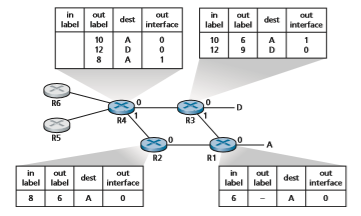

## Link Virtualization: A Network as a Link Layer
Because this chapter concerns link-layer protocols, and given that we’re now nearing the chapter’s end, let’s reflect on how our understanding of the term _link_ has evolved. We began this chapter by viewing the link as a physical wire connecting two com- municating hosts. In studying multiple access protocols, we saw that multiple hosts could be connected by a shared wire and that the “wire” connecting the hosts could be radio spectra or other media. This led us to consider the link a bit more abstractly as a channel, rather than as a wire. In our study of Ethernet LANs (Figure 6.15), we saw that the interconnecting media could actually be a rather complex switched infrastructure. Throughout this evolution, however, the hosts themselves maintained the view that the interconnecting medium was simply a link-layer channel connect- ing two or more hosts. We saw, for example, that an Ethernet host can be blissfully unaware of whether it is connected to other LAN hosts by a single short LAN seg- ment (Figure 6.17) or by a geographically dispersed switched LAN (Figure 6.15) or by a VLAN (Figure 6.26).

In the case of a dialup modem connection between two hosts, the link connect- ing the two hosts is actually the telephone network—a logically separate, global telecommunications network with its own switches, links, and protocol stacks for data transfer and signaling. From the Internet link-layer point of view, however, the dial-up connection through the telephone network is viewed as a simple “wire.” In this sense, the Internet virtualizes the telephone network, viewing the telephone network as a link-layer technology providing link-layer connectivity between two Internet hosts. You may recall from our discussion of overlay networks in Chapter 2 that an overlay network similarly views the Internet as a means for providing con- nectivity between overlay nodes, seeking to overlay the Internet in the same way that the Internet overlays the telephone network.

In this section, we’ll consider Multiprotocol Label Switching (MPLS) net- works. Unlike the circuit-switched telephone network, MPLS is a packet-switched,virtual-circuit network in its own right. It has its own packet formats and forwarding behaviors. Thus, from a pedagogical viewpoint, a discussion of MPLS fits well into a study of either the network layer or the link layer. From an Internet viewpoint, how- ever, we can consider MPLS, like the telephone network and switched- Ethernets, as a link-layer technology that serves to interconnect IP devices. Thus, we’ll con- sider MPLS in our discussion of the link layer. Frame-relay and ATM networks can also be used to interconnect IP devices, though they represent a slightly older (but still deployed) technology and will not be covered here; see the very readable book [Goralski 1999] for details. Our treatment of MPLS will be necessarily brief, as entire books could be (and have been) written on these networks. We recommend [Davie 2000] for details on MPLS. We’ll focus here primarily on how MPLS servers interconnect to IP devices, although we’ll dive a bit deeper into the underlying tech- nologies as well.

### Multiprotocol Label Switching (MPLS)
 Multiprotocol Label Switching (MPLS) evolved from a number of industry efforts in the mid-to-late 1990s to improve the forwarding speed of IP routers by adopting a key concept from the world of virtual-circuit networks: a fixed-length label. The goal was not to abandon the destination-based IP datagram-forwarding infrastructure for one based on fixed-length labels and virtual circuits, but to augment it by selectively labeling datagrams and allowing routers to forward datagrams based on fixed-length labels (rather than destination IP addresses) when possible. Importantly, these tech- niques work hand-in-hand with IP, using IP addressing and routing. The IETF uni- fied these efforts in the MPLS protocol [RFC 3031, RFC 3032], effectively blending VC techniques into a routed datagram network.

Let’s begin our study of MPLS by considering the format of a link-layer frame that is handled by an MPLS-capable router. Figure 6.28 shows that a link-layer frame transmitted between MPLS-capable devices has a small MPLS header added between the layer-2 (e.g., Ethernet) header and layer-3 (i.e., IP) header. RFC 3032 defines the format of the MPLS header for such links; headers are defined for ATM and frame-relayed networks as well in other RFCs. Among the fields in the MPLS

**Figure 6.28**  ♦   MPLS header: Located between link- and network-layer headersheader are the label, 3 bits reserved for experimental use, a single S bit, which is used to indicate the end of a series of “stacked” MPLS headers (an advanced topic that we’ll not cover here), and a time-to-live field.

It’s immediately evident from Figure 6.28 that an MPLS-enhanced frame can only be sent between routers that are both MPLS capable (since a non-MPLS-capable router would be quite confused when it found an MPLS header where it had expected to find the IP header!). An MPLS-capable router is often referred to as a **label- switched router**, since it forwards an MPLS frame by looking up the MPLS label in its forwarding table and then immediately passing the datagram to the appropriate output interface. Thus, the MPLS-capable router need _not_ extract the destination IP address and perform a lookup of the longest prefix match in the forwarding table. But how does a router know if its neighbor is indeed MPLS capable, and how does a router know what label to associate with the given IP destination? To answer these questions, we’ll need to take a look at the interaction among a group of MPLS-capable routers.

In the example in Figure 6.29, routers R1 through R4 are MPLS capable. R5 and R6 are standard IP routers. R1 has advertised to R2 and R3 that it (R1) can route to destination A, and that a received frame with MPLS label 6 will be forwarded to destina- tion A. Router R3 has advertised to router R4 that it can route to destinations A and D, and that incoming frames with MPLS labels 10 and 12, respectively, will be switched toward those destinations. Router R2 has also advertised to router R4 that it (R2) can reach destination A, and that a received frame with MPLS label 8 will be switched toward A. Note that router R4 is now in the interesting position of having two MPLS

**Figure 6.29**  ♦  MPLS-enhanced forwarding

paths to reach A: via interface 0 with outbound MPLS label 10, and via interface 1 with an MPLS label of 8. The broad picture painted in Figure 6.29 is that IP devices R5, R6, A, and D are connected together via an MPLS infrastructure (MPLS-capable routers R1, R2, R3, and R4) in much the same way that a switched LAN or an ATM network can connect together IP devices. And like a switched LAN or ATM network, the MPLS- capable routers R1 through R4 do so _without ever touching the IP header of a packet_.

In our discussion above, we’ve not specified the specific protocol used to distribute labels among the MPLS-capable routers, as the details of this signaling are well beyond the scope of this book. We note, however, that the IETF working group on MPLS has speci- fied in [RFC 3468] that an extension of the RSVP protocol, known as RSVP-TE [RFC 3209], will be the focus of its efforts for MPLS signaling. We’ve also not discussed how MPLS actually computes the paths for packets among MPLS capable routers, nor how it gathers link-state information (e.g., amount of link bandwidth unreserved by MPLS) to use in these path computations. Existing link-state routing algorithms (e.g., OSPF) have been extended to flood this information to MPLS-capable routers. Interestingly, the actual path computation algorithms are not standardized, and are currently vendor-specific.

Thus far, the emphasis of our discussion of MPLS has been on the fact that MPLS performs switching based on labels, without needing to consider the IP address of a packet. The true advantages of MPLS and the reason for current interest in MPLS, however, lie not in the potential increases in switching speeds, but rather in the new traffic management capabilities that MPLS enables. As noted above, R4 has _two_ MPLS paths to A. If forwarding were performed up at the IP layer on the basis of IP address, the IP routing protocols we studied in Chapter 5 would specify only a single, least-cost path to A. Thus, MPLS provides the ability to forward packets along routes that would not be possible using standard IP routing protocols. This is one simple form of **traffic engineering** using MPLS [RFC 3346; RFC 3272; RFC 2702; Xiao 2000], in which a network operator can override normal IP routing and force some of the traffic headed toward a given destination along one path, and other traffic destined toward the same destination along another path (whether for policy, performance, or some other reason).

It is also possible to use MPLS for many other purposes as well. It can be used to perform fast restoration of MPLS forwarding paths, e.g., to reroute traffic over a precomputed failover path in response to link failure [Kar 2000; Huang 2002; RFC 3469]. Finally, we note that MPLS can, and has, been used to implement so-called **virtual private networks** (VPNs). In implementing a VPN for a customer, an ISP uses its MPLS-enabled network to connect together the customer’s various networks. MPLS can be used to isolate both the resources and addressing used by the customer’s VPN from that of other users crossing the ISP’s network; see [DeClercq 2002] for details.

Our discussion of MPLS has been brief, and we encourage you to consult the ref- erences we’ve mentioned. We note that MPLS rose to prominence before the devel- opment of software-defined networking, which we studied in Chapter 5, and that many of MPLS’ traffic engineering capabilities can also be achieved via SDN and the generalized forwarding paradigm we studied in Chapter 4. Only the future will tell whether MPLS and SDN will continue to co-exist, or whether newer technologies (such as SDN) will eventually replace MPLS.
