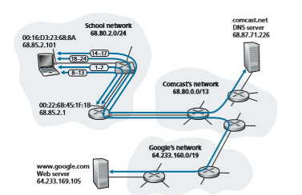

## Retrospective: A Day in the Life of a Web Page Request
Now that we’ve covered the link layer in this chapter, and the network, transport and application layers in earlier chapters, our journey down the protocol stack is com- plete! In the very beginning of this book (Section 1.1), we wrote “much of this book is concerned with computer network protocols,” and in the first five chapters, we’ve certainly seen that this is indeed the case! Before heading into the topical chapters in second part of this book, we’d like to wrap up our journey down the protocol stack by taking an integrated, holistic view of the protocols we’ve learned about so far. One way then to take this “big picture” view is to identify the many (many!) protocols that are involved in satisfying even the simplest request: downloading a Web page. Figure 6.32 illustrates our setting: a student, Bob, connects a laptop to his school’s Ethernet switch and downloads a Web page (say the home page of www.google.com). As we now know, there’s a _lot_ going on “under the hood” to satisfy this seemingly simple request. A Wireshark lab at the end of this chapter examines trace files con- taining a number of the packets involved in similar scenarios in more detail.

### Getting Started: DHCP, UDP, IP, and Ethernet
 Let’s suppose that Bob boots up his laptop and then connects it to an Ethernet cable connected to the school’s Ethernet switch, which in turn is connected to the school’s router, as shown in Figure 6.32. The school’s router is connected to an ISP, in this example, comcast.net. In this example, comcast.net is providing the DNS service for the school; thus, the DNS server resides in the Comcast network rather than the school network. We’ll assume that the DHCP server is running within the router, as is often the case.

When Bob first connects his laptop to the network, he can’t do anything (e.g., download a Web page) without an IP address. Thus, the first network-related

**Figure 6.32**  ♦   A day in the life of a Web page request: Network setting and actions

action taken by Bob’s laptop is to run the DHCP protocol to obtain an IP address, as well as other information, from the local DHCP server:

1\. The operating system on Bob’s laptop creates a **DHCP request message** (Section 4.3.3) and puts this message within a **UDP segment** (Section 3.3) with destination port 67 (DHCP server) and source port 68 (DHCP client). The UDP segment is then placed within an **IP datagram** (Section 4.3.1) with a broadcast IP destination address (255.255.255.255) and a source IP address of 0.0.0.0, since Bob’s laptop doesn’t yet have an IP address.

2\. The IP datagram containing the DHCP request message is then placed within an **Ethernet frame** (Section 6.4.2). The Ethernet frame has a destina- tion MAC addresses of FF:FF:FF:FF:FF:FF so that the frame will be broadcast to all devices connected to the switch (hopefully including a DHCP server); the frame’s source MAC address is that of Bob’s laptop, 00:16:D3:23:68:8A.

3\. The broadcast Ethernet frame containing the DHCP request is the first frame sent by Bob’s laptop to the Ethernet switch. The switch broadcasts the incoming frame on all outgoing ports, including the port connected to the router.

4\. The router receives the broadcast Ethernet frame containing the DHCP request on its interface with MAC address 00:22:6B:45:1F:1B and the IP datagram is extracted from the Ethernet frame. The datagram’s broadcast IP destina- tion address indicates that this IP datagram should be processed by upper layer protocols at this node, so the datagram’s payload (a UDP segment) is thus **demultiplexed** (Section 3.2) up to UDP, and the DHCP request message is extracted from the UDP segment. The DHCP server now has the DHCP request message.

5\. Let’s suppose that the DHCP server running within the router can allocate IP addresses in the **CIDR** (Section 4.3.3) block 68.85.2.0/24. In this example, all IP addresses used within the school are thus within Comcast’s address block. Let’s suppose the DHCP server allocates address 68.85.2.101 to Bob’s laptop. The DHCP server creates a **DHCP ACK message** (Section 4.3.3) containing this IP address, as well as the IP address of the DNS server (68.87.71.226), the IP address for the default gateway router (68.85.2.1), and the subnet block (68.85.2.0/24) (equivalently, the “network mask”). The DHCP message is put inside a UDP segment, which is put inside an IP datagram, which is put inside an Ethernet frame. The Ethernet frame has a source MAC address of the router’s interface to the home network (00:22:6B:45:1F:1B) and a destination MAC address of Bob’s laptop (00:16:D3:23:68:8A).

6\. The Ethernet frame containing the DHCP ACK is sent (unicast) by the router to the switch. Because the switch is **self-learning** (Section 6.4.3) and previ- ously received an Ethernet frame (containing the DHCP request) from Bob’s laptop, the switch knows to forward a frame addressed to 00:16:D3:23:68:8A only to the output port leading to Bob’s laptop.

7\. Bob’s laptop receives the Ethernet frame containing the DHCP ACK, extracts the IP datagram from the Ethernet frame, extracts the UDP segment from the IP datagram, and extracts the DHCP ACK message from the UDP segment. Bob’s DHCP client then records its IP address and the IP address of its DNS server. It also installs the address of the default gateway into its **IP forward- ing table** (Section 4.1). Bob’s laptop will send all datagrams with destination address outside of its subnet 68.85.2.0/24 to the default gateway. At this point, Bob’s laptop has initialized its networking components and is ready to begin processing the Web page fetch. (Note that only the last two DHCP steps of the four presented in Chapter 4 are actually necessary.)

### Still Getting Started: DNS and ARP
 When Bob types the URL for www.google.com into his Web browser, he begins the long chain of events that will eventually result in Google’s home page being displayed by his Web browser. Bob’s Web browser begins the process by creating a **TCP socket(Section 2.7) that will be used to send the **HTTP request
 (Section 2.2) to www.google.com. In order to create the socket, Bob’s laptop will need to knowthe IP address of www.google.com. We learned in Section 2.5, that the **DNS protocol** is used to provide this name-to-IP-address translation service.

8\. The operating system on Bob’s laptop thus creates a **DNS query message** (Section 2.5.3), putting the string “www.google.com” in the question section of the DNS message. This DNS message is then placed within a UDP segment with a destination port of 53 (DNS server). The UDP segment is then placed within an IP datagram with an IP destination address of 68.87.71.226 (the address of the DNS server returned in the DHCP ACK in step 5) and a source IP address of 68.85.2.101.

9\. Bob’s laptop then places the datagram containing the DNS query message in an Ethernet frame. This frame will be sent (addressed, at the link layer) to the gateway router in Bob’s school’s network. However, even though Bob’s laptop knows the IP address of the school’s gateway router (68.85.2.1) via the DHCP ACK message in step 5 above, it doesn’t know the gateway router’s MAC address. In order to obtain the MAC address of the gateway router, Bob’s laptop will need to use the **ARP protocol** (Section 6.4.1).

10\. Bob’s laptop creates an **ARP query** message with a target IP address of 68.85.2.1 (the default gateway), places the ARP message within an Ethernet frame with a broadcast destination address (FF:FF:FF:FF:FF:FF) and sends the Ethernet frame to the switch, which delivers the frame to all connected devices, including the gateway router.

11\. The gateway router receives the frame containing the ARP query message on the interface to the school network, and finds that the target IP address of 68.85.2.1 in the ARP message matches the IP address of its interface. The gateway router thus prepares an **ARP reply**, indicating that its MAC address of 00:22:6B:45:1F:1B corresponds to IP address 68.85.2.1. It places the ARP reply message in an Eth- ernet frame, with a destination address of 00:16:D3:23:68:8A (Bob’s laptop) and sends the frame to the switch, which delivers the frame to Bob’s laptop.

12\. Bob’s laptop receives the frame containing the ARP reply message and extracts the MAC address of the gateway router (00:22:6B:45:1F:1B) from the ARP reply message.

13\. Bob’s laptop can now (_finally!_) address the Ethernet frame containing the DNS query to the gateway router’s MAC address. Note that the IP datagram in this frame has an IP destination address of 68.87.71.226 (the DNS server), while the frame has a destination address of 00:22:6B:45:1F:1B (the gateway router). Bob’s laptop sends this frame to the switch, which delivers the frame to the gateway router.

### Still Getting Started: Intra-Domain Routing to the DNS Server
14\. The gateway router receives the frame and extracts the IP datagram containing the DNS query. The router looks up the destination address of this datagram(68.87.71.226) and determines from its forwarding table that the datagram should be sent to the leftmost router in the Comcast network in Figure 6.32. The IP datagram is placed inside a link-layer frame appropriate for the link connecting the school’s router to the leftmost Comcast router and the frame is sent over this link.

15\. The leftmost router in the Comcast network receives the frame, extracts the IP datagram, examines the datagram’s destination address (68.87.71.226) and determines the outgoing interface on which to forward the datagram toward the DNS server from its forwarding table, which has been filled in by Comcast’s intra-domain protocol (such as **RIP**, **OSPF** or **IS-IS**, Section 5.3) as well as the **Internet’s inter-domain protocol**, **BGP** (Section 5.4).

16\. Eventually the IP datagram containing the DNS query arrives at the DNS server. The DNS server extracts the DNS query message, looks up the name www.google.com in its DNS database (Section 2.5), and finds the **DNS resource record** that contains the IP address (64.233.169.105) for www.google.com. (assuming that it is currently cached in the DNS server). Recall that this cached data originated in the **authoritative DNS server** (Section 2.5.2) for google.com. The DNS server forms a **DNS reply message** containing this hostname-to-IP- address mapping, and places the DNS reply message in a UDP segment, and the segment within an IP datagram addressed to Bob’s laptop (68.85.2.101). This datagram will be forwarded back through the Comcast network to the school’s router and from there, via the Ethernet switch to Bob’s laptop.

17\. Bob’s laptop extracts the IP address of the server www.google.com from the DNS message. _Finally_, after a _lot_ of work, Bob’s laptop is now ready to con- tact the www.google.com server!

### Web Client-Server Interaction: TCP and HTTP
 18\. Now that Bob’s laptop has the IP address of www.google.com, it can create the **TCP socket** (Section 2.7) that will be used to send the **HTTP GET** message (Section 2.2.3) to www.google.com. When Bob creates the TCP socket, the TCP in Bob’s laptop must first perform a **three-way handshake** (Section 3.5.6) with the TCP in www.google.com. Bob’s laptop thus first creates a **TCP SYN** segment with destination port 80 (for HTTP), places the TCP segment inside an IP datagram with a destination IP address of 64.233.169.105 (www.google.com), places the datagram inside a frame with a destination MAC address of 00:22:6B:45:1F:1B (the gateway router) and sends the frame to the switch.

19\. The routers in the school network, Comcast’s network, and Google’s network forward the datagram containing the TCP SYN toward www.google.com, using the forwarding table in each router, as in steps 14–16 above. Recall that the router forwarding table entries governing forwarding of packets over the inter-domain link between the Comcast and Google networks are determined by the **BGP** protocol (Chapter 5).20\. Eventually, the datagram containing the TCP SYN arrives at www.google.com. The TCP SYN message is extracted from the datagram and demultiplexed to the welcome socket associated with port 80. A connection socket (Section 2.7) is created for the TCP connection between the Google HTTP server and Bob’s laptop. A TCP SYNACK (Section 3.5.6) segment is generated, placed inside a datagram addressed to Bob’s laptop, and finally placed inside a link-layer frame appropriate for the link connecting www.google.com to its first-hop router.

21\. The datagram containing the TCP SYNACK segment is forwarded through the Google, Comcast, and school networks, eventually arriving at the Ethernet controller in Bob’s laptop. The datagram is demultiplexed within the operating system to the TCP socket created in step 18, which enters the connected state.

22\. With the socket on Bob’s laptop now (_finally!_) ready to send bytes to www.google.com, Bob’s browser creates the HTTP GET message (Section 2.2.3) containing the URL to be fetched. The HTTP GET message is then written into the socket, with the GET message becoming the payload of a TCP segment. The TCP segment is placed in a datagram and sent and delivered to www.google.com as in steps 18–20 above.

23\. The HTTP server at www.google.com reads the HTTP GET message from the TCP socket, creates an **HTTP response** message (Section 2.2), places the requested Web page content in the body of the HTTP response message, and sends the message into the TCP socket.

24\. The datagram containing the HTTP reply message is forwarded through the Google, Comcast, and school networks, and arrives at Bob’s laptop. Bob’s Web browser program reads the HTTP response from the socket, extracts the html for the Web page from the body of the HTTP response, and finally (_finally!_) displays the Web page!

Our scenario above has covered a lot of networking ground! If you’ve understood most or all of the above example, then you’ve also covered a lot of ground since you first read Section 1.1, where we wrote “much of this book is concerned with computer network protocols” and you may have wondered what a protocol actually was! As detailed as the above example might seem, we’ve omitted a number of possible addi- tional protocols (e.g., NAT running in the school’s gateway router, wireless access to the school’s network, security protocols for accessing the school network or encrypt- ing segments or datagrams, network management protocols), and considerations (Web caching, the DNS hierarchy) that one would encounter in the public Internet. We’ll cover a number of these topics and more in the second part of this book.

Lastly, we note that our example above was an integrated and holistic, but also very “nuts and bolts,” view of many of the protocols that we’ve studied in the first part of this book. The example focused more on the “how” than the “why.” For a broader, more reflective view on the design of network protocols in general, you might want to re-read the “Architectural Principles of the Internet” in Section 4.5, and the references therein.

## Summary
In this chapter, we’ve examined the link layer—its services, the principles underly- ing its operation, and a number of important specific protocols that use these princi- ples in implementing link-layer services.

We saw that the basic service of the link layer is to move a network-layer data- gram from one node (host, switch, router, WiFi access point) to an adjacent node. We saw that all link-layer protocols operate by encapsulating a network-layer datagram within a link-layer frame before transmitting the frame over the link to the adjacent node. Beyond this common framing function, however, we learned that different link-layer protocols provide very different link access, delivery, and transmission services. These differences are due in part to the wide variety of link types over which link-layer protocols must operate. A simple point-to-point link has a single sender and receiver communicating over a single “wire.” A multiple access link is shared among many senders and receivers; consequently, the link-layer protocol for a multiple access channel has a protocol (its multiple access protocol) for coordinat- ing link access. In the case of MPLS, the “link” connecting two adjacent nodes (for example, two IP routers that are adjacent in an IP sense—that they are next-hop IP routers toward some destination) may actually be a _network_ in and of itself. In one sense, the idea of a network being considered as a link should not seem odd. A telephone link connecting a home modem/computer to a remote modem/router, for example, is actually a path through a sophisticated and complex telephone _network._

Among the principles underlying link-layer communication, we examined error- detection and -correction techniques, multiple access protocols, link-layer address- ing, virtualization (VLANs), and the construction of extended switched LANs and data center networks. Much of the focus today at the link layer is on these switched networks. In the case of error detection/correction, we examined how it is possible to add additional bits to a frame’s header in order to detect, and in some cases cor- rect, bit-flip errors that might occur when the frame is transmitted over the link. We covered simple parity and checksumming schemes, as well as the more robust cyclic redundancy check. We then moved on to the topic of multiple access protocols. We identified and studied three broad approaches for coordinating access to a broadcast channel: channel partitioning approaches (TDM, FDM), random access approaches (the ALOHA protocols and CSMA protocols), and taking-turns approaches (poll- ing and token passing). We studied the cable access network and found that it uses many of these multiple access methods. We saw that a consequence of hav- ing multiple nodes share a single broadcast channel was the need to provide node addresses at the link layer. We learned that link-layer addresses were quite different from network-layer addresses and that, in the case of the Internet, a special proto- col (ARP—the Address Resolution Protocol) is used to translate between these two forms of addressing and studied the hugely successful Ethernet protocol in detail. We then examined how nodes sharing a broadcast channel form a LAN and how multiple LANs can be connected together to form larger LANs—all _without_ the intervention
HoMEwoRK PRobLEMS AND quESTIoNS 

of network-layer routing to interconnect these local nodes. We also learned how multiple virtual LANs can be created on a single physical LAN infrastructure.

We ended our study of the link layer by focusing on how MPLS networks pro- vide link-layer services when they interconnect IP routers and an overview of the network designs for today’s massive data centers. We wrapped up this chapter (and indeed the first five chapters) by identifying the many protocols that are needed to fetch a simple Web page. Having covered the link layer, _our journey down the pro- tocol stack is now ove_r! Certainly, the physical layer lies below the link layer, but the details of the physical layer are probably best left for another course (e.g., in com- munication theory, rather than computer networking). We have, however, touched upon several aspects of the physical layer in this chapter and in Chapter 1 (our dis- cussion of physical media in Section 1.2). We’ll consider the physical layer again when we study wireless link characteristics in the next chapter.

Although our journey down the protocol stack is over, our study of computer networking is not yet at an end. In the following three chapters, we cover wireless networking, network security, and multimedia networking. These four topics do not fit conveniently into any one layer; indeed, each topic crosscuts many layers. Understanding these topics (billed as advanced topics in some networking texts) thus requires a firm foundation in all layers of the protocol stack—a foundation that our study of the link layer has now completed!
