  # The Network Layer: Control Plane

In this chapter, we’ll complete our journey through the network layer by covering the **control-plane** component of the network layer—the _network-wide_ logic that con- trols not only how a datagram is routed along an end-to-end path from the source host to the destination host, but also how network-layer components and services are configured and managed. In Section 5.2, we’ll cover traditional routing algorithms for computing least cost paths in a graph; these algorithms are the basis for two widely deployed Internet routing protocols: OSPF and BGP, that we’ll cover in Sec- tions 5.3 and 5.4, respectively. As we’ll see, OSPF is a routing protocol that operates within a single ISP’s network. BGP is a routing protocol that serves to interconnect all of the networks in the Internet; BGP is thus often referred to as the “glue” that holds the Internet together. Traditionally, control-plane routing protocols have been implemented together with data-plane forwarding functions, monolithically, within a router. As we learned in the introduction to Chapter 4, software-defined networking (SDN) makes a clear separation between the data and control planes, implementing control-plane functions in a separate “controller” service that is distinct, and remote, from the forwarding components of the routers it controls. We’ll cover SDN control- lers in Section 5.5.

In Sections 5.6 and 5.7, we’ll cover some of the nuts and bolts of managing an IP network: ICMP (the Internet Control Message Protocol) and SNMP (the Simple Network Management Protocol).

## Introduction
Let’s quickly set the context for our study of the network control plane by recall- ing Figures 4.2 and 4.3. There, we saw that the forwarding table (in the case of destination-based forwarding) and the flow table (in the case of generalized forward- ing) were the principal elements that linked the network layer’s data and control planes. We learned that these tables specify the local data-plane forwarding behavior of a router. We saw that in the case of generalized forwarding, the actions taken could include not only forwarding a packet to a router’s output port, but also drop- ping a packet, replicating a packet, and/or rewriting layer 2, 3 or 4 packet-header fields.

In this chapter, we’ll study how those forwarding and flow tables are computed, maintained and installed. In our introduction to the network layer in Section 4.1, we learned that there are two possible approaches for doing so.

• _Per-router control_. Figure 5.1 illustrates the case where a routing algorithm runs in each and every router; both a forwarding and a routing function are contained


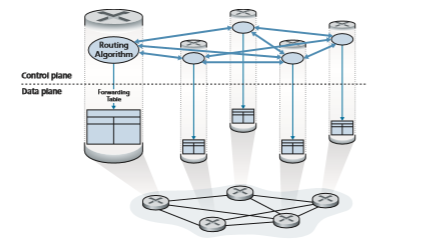
**Figure 5.1**  ♦   Per-router control: Individual routing algorithm components interact in the control plane


within each router. Each router has a routing component that communicates with the routing components in other routers to compute the values for its forwarding table. This per-router control approach has been used in the Internet for decades. The OSPF and BGP protocols that we’ll study in Sections 5.3 and 5.4 are based on this per-router approach to control.

• _Logically centralized control_. Figure 5.2 illustrates the case in which a logically centralized controller computes and distributes the forwarding tables to be used by each and every router. As we saw in Sections 4.4 and 4.5, the generalized match-plus-action abstraction allows the router to perform traditional IP forward- ing as well as a rich set of other functions (load sharing, firewalling, and NAT) that had been previously implemented in separate middleboxes.

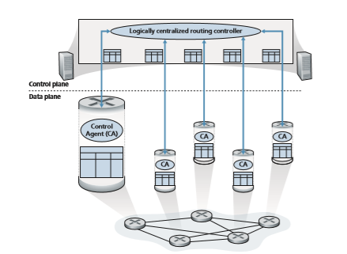
**Figure 5.2**  ♦   Logically centralized control: A distinct, typically remote, controller interacts with local control agents (CAs)

The controller interacts with a control agent (CA) in each of the routers via a well-defined protocol to configure and manage that router’s flow table. Typically, the CA has minimum functionality; its job is to communicate with the controller, and to do as the controller commands. Unlike the routing algorithms in Figure 5.1, the CAs do not directly interact with each other nor do they actively take part in computing the forwarding table. This is a key distinction between per-router control and logically centralized control.

By “logically centralized” control [Levin 2012] we mean that the routing control service is accessed as if it were a single central service point, even though the service is likely to be implemented via multiple servers for fault-tolerance, and performance scalability reasons. As we will see in Section 5.5, SDN adopts this notion of a logically centralized controller—an approach that is finding increased use in production deployments. Google uses SDN to control the rout- ers in its internal B4 global wide-area network that interconnects its data centers [Jain 2013]. SWAN [Hong 2013], from Microsoft Research, uses a logically centralized controller to manage routing and forwarding between a wide area network and a data center network. Major ISP deployments, including COM- CAST’s ActiveCore and Deutsche Telecom’s Access 4.0 are actively integrating SDN into their networks. And as we’ll see in Chapter 8, SDN control is central to 4G/5G cellular networking as well. [AT&T 2019] notes, “ … SDN, isn’t a vision, a goal, or a promise. It’s a reality. By the end of next year, 75% of our network functions will be fully virtualized and software-controlled.” China Telecom and China Unicom are using SDN both within data centers and between data centers [Li 2015].

## Routing Algorithms
In this Section, we’ll study **routing algorithms**, whose goal is to determine good paths (equivalently, routes), from senders to receivers, through the network of routers. Typically, a “good” path is one that has the least cost. We’ll see that in practice, however, real-world concerns such as policy issues (for example, a rule such as “router _x_, belonging to organization _Y_, should not forward any packets originating from the network owned by organization _Z_ ”) also come into play. We note that whether the network control plane adopts a per-router control approach or a logically centralized approach, there must always be a well-defined sequence of routers that a packet will cross in traveling from sending to receiving host. Thus, the routing algorithms that compute these paths are of fundamental importance, and another candidate for our top-10 list of fundamentally important networking concepts.

A graph is used to formulate routing problems. Recall that a **graph** _G_ \= (_N_, _E_) is a set _N_ of nodes and a collection _E_ of edges, where each edge is a pair of nodes from _N_. In the context of network-layer routing, the nodes in the graph represent


**Figure 5.3**  ♦  Abstract graph model of a computer network

routers—the points at which packet-forwarding decisions are made—and the edges connecting these nodes represent the physical links between these routers. Such a graph abstraction of a computer network is shown in Figure 5.3. When we study the BGP inter-domain routing protocol, we’ll see that nodes represent networks, and the edge connecting two such nodes represents direction connectivity (know as peering) between the two networks. To view some graphs representing real network maps, see [CAIDA 2020]; for a discussion of how well different graph-based models model the Internet, see [Zegura 1997, Faloutsos 1999, Li 2004].

As shown in Figure 5.3, an edge also has a value representing its cost. Typically, an edge’s cost may reflect the physical length of the corresponding link (for example, a transoceanic link might have a higher cost than a short-haul terrestrial link), the link speed, or the monetary cost associated with a link. For our purposes, we’ll simply take the edge costs as a given and won’t worry about how they are determined. For any edge (_x_, _y_) in _E_, we denote _c_(_x_, _y_) as the cost of the edge between nodes _x_ and _y._ If the pair (_x_, _y_) does not belong to _E_, we set _c_(_x_, _y_) = ∞ . Also, we’ll only consider undirected graphs (i.e., graphs whose edges do not have a direction) in our discussion here, so that edge (_x_, _y_) is the same as edge (_y_, _x_) and that _c_(_x_, _y_) = _c_(_y_, _x_); however, the algorithms we’ll study can be easily extended to the case of directed links with a different cost in each direction. Also, a node _y_ is said to be a **neighbor** of node _x_ if (_x_, _y_) belongs to _E_.

Given that costs are assigned to the various edges in the graph abstraction, a natural goal of a routing algorithm is to identify the least costly paths between sources and destinations. To make this problem more precise, recall that a **path** in a graph _G_ \= (_N_, _E_) is a sequence of nodes (_x_1, _x_2, g, _xp_) such that each of the pairs (_x_1, _x_2), (_x_2, _x_3), g, (_xp_\-1, _xp_) are edges in _E_. The cost of a path (_x_1, _x_2, g, _xp_) is simply the sum of all the edge costs along the path, that is,
_c_(_x_1, _x_2) + _c_(_x_2, _x_3) + g+ _c_(_xp_\-1, _xp_). Given any two nodes _x_ and _y_, there are typi- cally many paths between the two nodes, with each path having a cost. One or more of these paths is a **least-cost path**. The least-cost problem is therefore clear: Find a path between the source and destination that has least cost. In Figure 5.3, for exam- ple, the least-cost path between source node _u_ and destination node _w_ is (_u_, _x_, _y_, _w_) with a path cost of 3. Note that if all edges in the graph have the same cost, the least- cost path is also the **shortest path** (that is, the path with the smallest number of links between the source and the destination).

As a simple exercise, try finding the least-cost path from node _u_ to _z_ in Figure 5.3 and reflect for a moment on how you calculated that path. If you are like most people, you found the path from _u_ to _z_ by examining Figure 5.3, tracing a few routes from _u_ to _z_, and somehow convincing yourself that the path you had chosen had the least cost among all possible paths. (Did you check all of the 17 pos- sible paths between _u_ and _z_? Probably not!) Such a calculation is an example of a centralized routing algorithm—the routing algorithm was run in one location, your brain, with complete information about the network. Broadly, one way in which we can classify routing algorithms is according to whether they are centralized or decentralized.

• A **centralized routing algorithm** computes the least-cost path between a source and destination using complete, global knowledge about the network. That is, the algorithm takes the connectivity between all nodes and all link costs as inputs. This then requires that the algorithm somehow obtain this information before actually performing the calculation. The calculation itself can be run at one site (e.g., a logically centralized controller as in Figure 5.2) or could be replicated in the routing component of each and every router (e.g., as in Figure 5.1). The key distinguishing feature here, however, is that the algorithm has complete informa- tion about connectivity and link costs. Algorithms with global state information are often referred to as **link-state (LS) algorithms**, since the algorithm must be aware of the cost of each link in the network. We’ll study LS algorithms in Section 5.2.1.

• In a **decentralized routing algorithm**, the calculation of the least-cost path is carried out in an iterative, distributed manner by the routers. No node has com- plete information about the costs of all network links. Instead, each node begins with only the knowledge of the costs of its own directly attached links. Then, through an iterative process of calculation and exchange of information with its neighboring nodes, a node gradually calculates the least-cost path to a destination or set of destinations. The decentralized routing algorithm we’ll study below in Section 5.2.2 is called a distance-vector (DV) algorithm, because each node main- tains a vector of estimates of the costs (distances) to all other nodes in the net- work. Such decentralized algorithms, with interactive message exchange betweenneighboring routers is perhaps more naturally suited to control planes where the routers interact directly with each other, as in Figure 5.1.

A second broad way to classify routing algorithms is according to whether they are static or dynamic. In **static routing algorithms**, routes change very slowly over time, often as a result of human intervention (for example, a human manually editing a link costs). **Dynamic routing algorithms** change the routing paths as the network traffic loads or topology change. A dynamic algorithm can be run either periodically or in direct response to topology or link cost changes. While dynamic algorithms are more responsive to network changes, they are also more susceptible to problems such as routing loops and route oscillation.

A third way to classify routing algorithms is according to whether they are load- sensitive or load-insensitive. In a **load-sensitive algorithm**, link costs vary dynami- cally to reflect the current level of congestion in the underlying link. If a high cost is associated with a link that is currently congested, a routing algorithm will tend to choose routes around such a congested link. While early ARPAnet routing algo- rithms were load-sensitive [McQuillan 1980], a number of difficulties were encoun- tered [Huitema 1998]. Today’s Internet routing algorithms (such as RIP, OSPF, and BGP) are **load-insensitive**, as a link’s cost does not explicitly reflect its current (or recent past) level of congestion.

### The Link-State (LS) Routing Algorithm
Recall that in a link-state algorithm, the network topology and all link costs are known, that is, available as input to the LS algorithm. In practice, this is accom- plished by having each node broadcast link-state packets to _all_ other nodes in the network, with each link-state packet containing the identities and costs of its attached links. In practice (for example, with the Internet’s OSPF routing protocol, discussed in Section 5.3), this is often accomplished by a **link-state broadcast algorithm [Perlman 1999]. The result of the nodes’ broadcast is that all nodes have an identical and complete view of the network. Each node can then run the LS algorithm and compute the same set of least-cost paths as every other node.

The link-state routing algorithm we present below is known as _Dijkstra’s algorithm_, named after its inventor. A closely related algorithm is Prim’s algo- rithm; see [Cormen 2001] for a general discussion of graph algorithms. Dijkstra’s algorithm computes the least-cost path from one node (the source, which we will refer to as _u_) to all other nodes in the network. Dijkstra’s algorithm is iterative and has the property that after the _k_th iteration of the algorithm, the least-cost paths are known to _k_ destination nodes, and among the least-cost paths to all destinationnodes, these _k_ paths will have the _k_ smallest costs. Let us define the following notation:

• _D_(_v_): cost of the least-cost path from the source node to destination _v_ as of this iteration of the algorithm.

• _p_(_v_): previous node (neighbor of _v_) along the current least-cost path from the source to _v._

• _N_′: subset of nodes; _v_ is in _N_′ if the least-cost path from the source to _v_ is defini- tively known.

The centralized routing algorithm consists of an initialization step followed by a loop. The number of times the loop is executed is equal to the number of nodes in the network. Upon termination, the algorithm will have calculated the shortest paths from the source node _u_ to every other node in the network.

**Link-State (LS) Algorithm for Source Node** _u_

1 **Initialization:** 
2 N’ = {u} 
3 for all nodes v 
4 if v is a neighbor of u 
5 then D(v) = c(u,v) 
6 else D(v) = ∞  
7
8**Loop** 
9 find w not in N’ such that D(w) is a minimum 
10 add w to N’ 
11 update D(v) for each neighbor v of w and not in N’: 
12 D(v) = min(D(v), D(w)+ c(w,v) ) 
13 /\* new cost to v is either old cost to v or known 
14 least path cost to w plus cost from w to v \*/ 
15 **until

 N’= N

As an example, let’s consider the network in Figure 5.3 and compute the least- cost paths from _u_ to all possible destinations. A tabular summary of the algorithm’s computation is shown in Table 5.1, where each line in the table gives the values of the algorithm’s variables at the end of the iteration. Let’s consider the few first steps in detail.

• In the initialization step, the currently known least-cost paths from _u_ to its directly attached neighbors, _v, x_, and _w_, are initialized to 2, 1, and 5, respectively. Note in

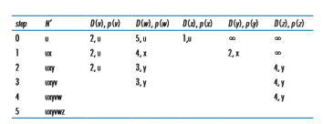
**Table 5.1**  ♦  Running the link-state algorithm on the network in Figure 5.3

particular that the cost to _w_ is set to 5 (even though we will soon see that a lesser-cost path does indeed exist) since this is the cost of the direct (one hop) link from _u_ to _w._ The costs to _y_ and _z_ are set to infinity because they are not directly connected to _u._

• In the first iteration, we look among those nodes not yet added to the set _N_′ and find that node with the least cost as of the end of the previous iteration. That node is _x_, with a cost of 1, and thus _x_ is added to the set _N_′. Line 12 of the LS algorithm is then performed to update _D_(_v_) for all nodes _v_, yielding the results shown in the second line (Step 1) in Table 5.1. The cost of the path to _v_ is unchanged. The cost of the path to _w_ (which was 5 at the end of the initialization) through node _x_ is found to have a cost of 4. Hence this lower-cost path is selected and _w_’s predeces- sor along the shortest path from _u_ is set to _x_. Similarly, the cost to _y_ (through _x_) is computed to be 2, and the table is updated accordingly.

• In the second iteration, nodes _v_ and _y_ are found to have the least-cost paths (2), and we break the tie arbitrarily and add _y_ to the set _N_′ so that _N_′ now contains _u, x_, and _y._ The cost to the remaining nodes not yet in _N_′, that is, nodes _v, w_, and _z_, are updated via line 12 of the LS algorithm, yielding the results shown in the third row in Table 5.1.

• And so on . . .

When the LS algorithm terminates, we have, for each node, its predecessor along the least-cost path from the source node. For each predecessor, we also have _its_ predecessor, and so in this manner we can construct the entire path from the source to all destinations. The forwarding table in a node, say node _u_, can then be constructed from this information by storing, for each destination, the next-hop node on the least- cost path from _u_ to the destination. Figure 5.4 shows the resulting least-cost paths and forwarding table in _u_ for the network in Figure 5.3.


**Figure 5.4**  ♦  Least cost path and forwarding table for node u

What is the computational complexity of this algorithm? That is, given _n_ nodes (not counting the source), how much computation must be done in the worst case to find the least-cost paths from the source to all destinations? In the first iteration, we need to search through all _n_ nodes to determine the node, _w_, not in _N_′ that has the minimum cost. In the second iteration, we need to check _n_ \- 1 nodes to determine the minimum cost; in the third iteration _n_ \- 2 nodes, and so on. Overall, the total number of nodes we need to search through over all the iterations is _n_(_n_ \+ 1)/2, and thus we say that the preceding implementation of the LS algorithm has worst-case complexity of order _n_ squared: _O_(_n_2). (A more sophisticated implementation of this algorithm, using a data structure known as a heap, can find the minimum in line 9 in logarithmic rather than linear time, thus reducing the complexity.)

Before completing our discussion of the LS algorithm, let us consider a pathol- ogy that can arise. Figure 5.5 shows a simple network topology where link costs are equal to the load carried on the link, for example, reflecting the delay that would be experienced. In this example, link costs are not symmetric; that is, _c_(_u,v_) equals _c_(_v,u_) only if the load carried on both directions on the link (_u,v_) is the same. In this example, node _z_ originates a unit of traffic destined for _w_, node _x_ also originates a unit of traffic destined for _w_, and node _y_ injects an amount of traffic equal to _e_, also destined for _w_. The initial routing is shown in Figure 5.5(a) with the link costs cor- responding to the amount of traffic carried.

When the LS algorithm is next run, node _y_ determines (based on the link costs shown in Figure 5.5(a)) that the clockwise path to _w_ has a cost of 1, while the coun- terclockwise path to _w_ (which it had been using) has a cost of 1 + _e_. Hence _y’_s least- cost path to _w_ is now clockwise. Similarly, _x_ determines that its new least-cost path to _w_ is also clockwise, resulting in costs shown in Figure 5.5(b). When the LS algorithm is run next, nodes _x, y_, and _z_ all detect a zero-cost path to _w_ in the counterclockwise direction, and all route their traffic to the counterclockwise routes. The next time the LS algorithm is run, _x, y_, and _z_ all then route their traffic to the clockwise routes.

What can be done to prevent such oscillations (which can occur in any algo- rithm, not just an LS algorithm, that uses a congestion or delay-based link metric)? One solution would be to mandate that link costs not depend on the amount of traffic 


**Figure 5.5**  ♦  Oscillations with congestion-sensitive routing

carried—an unacceptable solution since one goal of routing is to avoid highly con- gested (for example, high-delay) links. Another solution is to ensure that not all rout- ers run the LS algorithm at the same time. This seems a more reasonable solution, since we would hope that even if routers ran the LS algorithm with the same perio- dicity, the execution instance of the algorithm would not be the same at each node. Interestingly, researchers have found that routers in the Internet can self-synchronize among themselves [Floyd Synchronization 1994]. That is, even though they initially execute the algorithm with the same period but at different instants of time, the algo- rithm execution instance can eventually become, and remain, synchronized at the routers. One way to avoid such self-synchronization is for each router to randomize the time it sends out a link advertisement.

Having studied the LS algorithm, let’s consider the other major routing algo- rithm that is used in practice today—the distance-vector routing algorithm.

### The Distance-Vector (DV) Routing Algorithm

Whereas the LS algorithm is an algorithm using global information, the **distance- vector (DV)
 algorithm is iterative, asynchronous, and distributed. It is _distributed_ in that each node receives some information from one or more of its _directly attached_ neighbors, performs a calculation, and then distributes the results of its calculation back to its neighbors. It is _iterative_ in that this process continues on until no more information is exchanged between neighbors. (Interestingly, the algorithm is also self-terminating—there is no signal that the computation should stop; it just stops.) The algorithm is _asynchronous_ in that it does not require all of the nodes to operate in lockstep with each other. We’ll see that an asynchronous, iterative, self-terminating, distributed algorithm is much more interesting and fun than a centralized algorithm!

Before we present the DV algorithm, it will prove beneficial to discuss an impor- tant relationship that exists among the costs of the least-cost paths. Let _dx_(_y_) be the cost of the least-cost path from node _x_ to node _y_. Then the least costs are related by the celebrated Bellman-Ford equation, namely,

        dx(y) = minv5c(x, v) + dv( y)6,

where the _minv_ in the equation is taken over all of _x_’s neighbors. The Bellman- Ford equation is rather intuitive. Indeed, after traveling from _x_ to _v_, if we then take the least-cost path from _v_ to _y_, the path cost will be _c_(_x_, _v_) + _dv_(_y_). Since we must begin by traveling to some neighbor _v_, the least cost from _x_ to _y_ is the minimum of _c_(_x_, _v_) + _dv_(_y_) taken over all neighbors _v_.

But for those who might be skeptical about the validity of the equation, let’s check it for source node _u_ and destination node _z_ in Figure 5.3. The source node _u_ has three neighbors: nodes _v_, _x_, and _w_. By walking along various paths in the graph, it is easy to see that _dv_(_z_) = 5, _dx_(_z_) = 3, and _dw_(_z_) = 3. Plugging these values into Equation 5.1, along with the costs _c_(_u_, _v_) = 2, _c_(_u_, _x_) = 1, and _c_(_u_, _w_) = 5, gives _du_(_z_) = min52 + 5, 5 + 3, 1 + 36 = 4, which is obviously true and which is exactly what the Dijskstra algorithm gave us for the same network. This quick veri- fication should help relieve any skepticism you may have.

The Bellman-Ford equation is not just an intellectual curiosity. It actually has signif- icant practical importance: the solution to the Bellman-Ford equation provides the entries in node _x_’s forwarding table. To see this, let _v\*_ be any neighboring node that achieves the minimum in Equation 5.1. Then, if node _x_ wants to send a packet to node _y_ along a least-cost path, it should first forward the packet to node _v\*_. Thus, node _x_’s forwarding table would specify node _v\*_ as the next-hop router for the ultimate destination _y_. Another important practical contribution of the Bellman-Ford equation is that it suggests the form of the neighbor-to-neighbor communication that will take place in the DV algorithm.

The basic idea is as follows. Each node _x_ begins with _Dx_(_y_), an estimate of the cost of the least-cost path from itself to node _y_, for all nodes, _y_, in _N_. Let **_D_**_x_ \= [_Dx_(_y_): _y_ in _N_] be node _x_’s distance vector, which is the vector of cost estimates from _x_ to all other nodes, _y_, in _N._ With the DV algorithm, each node _x_ maintains the following routing information:

• For each neighbor _v_, the cost _c_(_x,v_) from _x_ to directly attached neighbor, _v_

• Node _x_’s distance vector, that is, **_D_**_x_ \= [_Dx_(_y_): _y_ in _N_], containing _x_’s estimate of its cost to all destinations, _y_, in _N_

• The distance vectors of each of its neighbors, that is, **_D_**_v_ \= [_Dv_(_y_): _y_ in _N_] for each neighbor _v_ of _x_

In the distributed, asynchronous algorithm, from time to time, each node sends a copy of its distance vector to each of its neighbors. When a node _x_ receives a new distance vector from any of its neighbors _w_, it saves _w_’s distance vector, and then uses the Bellman-Ford equation to update its own distance vector as follows:

_Dx_(_y_) = min_v_5_c_(_x_, _v_) + _Dv_(_y_)6 for each node _y_ in _N_

If node _x_’s distance vector has changed as a result of this update step, node _x_ will then send its updated distance vector to each of its neighbors, which can in turn update their own distance vectors. Miraculously enough, as long as all the nodes continue to exchange their distance vectors in an asynchronous fashion, each cost estimate _Dx_(_y_) converges to _dx_(_y_), the actual cost of the least-cost path from node _x_ to node _y_ [Bertsekas 1991]!

**Distance-Vector (DV) Algorithm**

At each node, _x_:

1 **Initialization:** 
2 for all destinations y in N: 
3 Dx(y)= c(x,y)/\* if y is not a neighbor then c(x,y)= ∞ \*/ 
4 for each neighbor w 
5 Dw(y) = ? for all destinations y in N 
6 for each neighbor w 
7 send distance vector **D**x = [Dx(y): y in 
N] to w # loop** 

10 **wait** (until I see a link cost change to some neighbor w or 
11 until I receive a distance vector from some neighbor w) 
12 
13 for each y in N: 
14 Dx(y) = minv{c(x,v) + Dv(y)} 
15 
16 **if** Dx(y) changed for any destination y 
17 send distance vector **D**x = [Dx(y): y in N] to all neighbors 
18 
19 **forever

In the DV algorithm, a node _x_ updates its distance-vector estimate when it either sees a cost change in one of its directly attached links or receives a distance-vector update from some neighbor. But to update its own forwarding table for a given des- tination _y_, what node _x_ really needs to know is not the shortest-path distance to _y_ but instead the neighboring node _v\*_(_y_) that is the next-hop router along the shortest path to _y_. As you might expect, the next-hop router _v\*_(_y_) is the neighbor _v_ that achieves the minimum in Line 14 of the DV algorithm. (If there are multiple neighbors _v_ that achieve the minimum, then _v\*_(_y_) can be any of the minimizing neighbors.) Thus, in Lines 13–14, for each destination _y_, node _x_ also determines _v\*_(_y_) and updates its forwarding table for destination _y_.

Recall that the LS algorithm is a centralized algorithm in the sense that it requires each node to first obtain a complete map of the network before running the Dijkstra algorithm. The DV algorithm is _decentralized_ and does not use such global information. Indeed, the only information a node will have is the costs of the links to its directly attached neighbors and information it receives from these neighbors. Each node waits for an update from any neighbor (Lines 10–11), calculates its new distance vector when receiving an update (Line 14), and distributes its new distance vector to its neighbors (Lines 16–17). DV-like algorithms are used in many routing protocols in practice, including the Internet’s RIP and BGP, ISO IDRP, Novell IPX, and the original ARPAnet.

Figure 5.6 illustrates the operation of the DV algorithm for the simple three- node network shown at the top of the figure. The operation of the algorithm is illus- trated in a synchronous manner, where all nodes simultaneously receive distance vectors from their neighbors, compute their new distance vectors, and inform their neighbors if their distance vectors have changed. After studying this example, you should convince yourself that the algorithm operates correctly in an asynchronous manner as well, with node computations and update generation/reception occurring at any time.

The leftmost column of the figure displays three initial **routing tables** for each of the three nodes. For example, the table in the upper-left corner is node _x_’s ini- tial routing table. Within a specific routing table, each row is a distance vector— specifically, each node’s routing table includes its own distance vector and that of each of its neighbors. Thus, the first row in node _x_’s initial routing table is **_D_**_x_ \= [_Dx_(_x_), _Dx_(_y_), _Dx_(_z_)] = [0, 2, 7]. The second and third rows in this table are the most recently received distance vectors from nodes _y_ and _z_, respectively. Because at initialization node _x_ has not received anything from node _y_ or _z_, the entries in the second and third rows are initialized to infinity.

After initialization, each node sends its distance vector to each of its two neigh- bors. This is illustrated in Figure 5.6 by the arrows from the first column of tables to the second column of tables. For example, node _x_ sends its distance vector **_D_**_x_ \= [0, 2, 7] to both nodes _y_ and _z_. After receiving the updates, each node recomputes its own distance vector. For example, node _x_ computes_Dx_(_x_) = 0

_Dx_(_y_) = min5_c_(_x_,_y_) + _Dy_(_y_), _c_(_x_,_z_) + _Dz_(_y_)6 = min52 + 0, 7 + 16 = 2

_Dx_(_z_) = min5_c_(_x_,_y_) + _Dy_(_z_), _c_(_x_,_z_) + _Dz_(_z_)6 = min52 + 1, 7 + 06 = 3

The second column therefore displays, for each node, the node’s new distance vector along with distance vectors just received from its neighbors. Note, for example, that

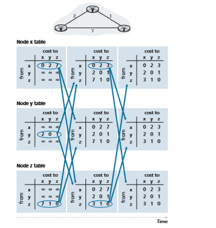
**Figure 5.6**  ♦  Distance-vector (DV) algorithm in operation

node _x_’s estimate for the least cost to node _z_, _Dx_(_z_), has changed from 7 to 3. Also note that for node _x_, neighboring node _y_ achieves the minimum in line 14 of the DV algorithm; thus, at this stage of the algorithm, we have at node _x_ that _v_\*(_y_) = _y_ and _v_\*(_z_) = _y_.

After the nodes recompute their distance vectors, they again send their updated distance vectors to their neighbors (if there has been a change). This is illustrated in Figure 5.6 by the arrows from the second column of tables to the third column of tables. Note that only nodes _x_ and _z_ send updates: node _y_’s distance vector didn’t change so node _y_ doesn’t send an update. After receiving the updates, the nodes then recompute their distance vectors and update their routing tables, which are shown in the third column.

The process of receiving updated distance vectors from neighbors, recomputing routing table entries, and informing neighbors of changed costs of the least-cost path to a destination continues until no update messages are sent. At this point, since no update messages are sent, no further routing table calculations will occur and the algorithm will enter a quiescent state; that is, all nodes will be performing the wait in Lines 10–11 of the DV algorithm. The algorithm remains in the quiescent state until a link cost changes, as discussed next.

**Distance-Vector Algorithm: Link-Cost Changes and Link Failure**

When a node running the DV algorithm detects a change in the link cost from itself to a neighbor (Lines 10–11), it updates its distance vector (Lines 13–14) and, if there’s a change in the cost of the least-cost path, informs its neighbors (Lines 16–17) of its new distance vector. Figure 5.7(a) illustrates a scenario where the link cost from _y_ to _x_ changes from 4 to 1. We focus here only on _y_’ and _z_’s distance table entries to destination _x_. The DV algorithm causes the following sequence of events to occur:

• At time _t_0, _y_ detects the link-cost change (the cost has changed from 4 to 1), updates its distance vector, and informs its neighbors of this change since its dis- tance vector has changed.

• At time _t_1, _z_ receives the update from _y_ and updates its table. It computes a new least cost to _x_ (it has decreased from a cost of 5 to a cost of 2) and sends its new distance vector to its neighbors.

• At time _t_2, _y_ receives _z_’s update and updates its distance table. _y_’s least costs do not change and hence _y_ does not send any message to _z_. The algorithm comes to a quiescent state.

Thus, only two iterations are required for the DV algorithm to reach a quiescent state. The good news about the decreased cost between _x_ and _y_ has propagated quickly through the network.


**Figure 5.7**  ♦  Changes in link cost

Let’s now consider what can happen when a link cost _increases._ Suppose that the link cost between _x_ and _y_ increases from 4 to 60, as shown in Figure 5.7(b).

1\. Before the link cost changes, _Dy_(_x_) = 4, _Dy_(_z_) = 1, _Dz_(_y_) = 1, and _Dz_(_x_) = 5. At time _t_0, _y_ detects the link-cost change (the cost has changed from 4 to 60). _y_ computes its new minimum-cost path to _x_ to have a cost of

_Dy_(_x_) = min5_c_(_y_,_x_) + _Dx_(_x_), _c_(_y_,_z_) + _Dz_(_x_)6 = min560 + 0, 1 + 56 = 6

Of course, with our global view of the network, we can see that this new cost via _z_ is _wrong._ But the only information node _y_ has is that its direct cost to _x_ is 60 and that _z_ has last told _y_ that _z_ could get to _x_ with a cost of 5. So in order to get to _x, y_ would now route through _z_, fully expecting that _z_ will be able to get to _x_ with a cost of 5. As of _t_1 we have a **routing loop**—in order to get to _x, y_ routes through _z_, and _z_ routes through _y_. A routing loop is like a black hole—a packet destined for _x_ arriving at _y_ or _z_ as of _t_1 will bounce back and forth between these two nodes forever (or until the forwarding tables are changed).

2\. Since node _y_ has computed a new minimum cost to _x_, it informs _z_ of its new distance vector at time _t_1.

3\. Sometime after _t_1, _z_ receives _y_’s new distance vector, which indicates that _y_’s minimum cost to _x_ is 6. _z_ knows it can get to _y_ with a cost of 1 and hence com- putes a new least cost to _x_ of _Dz_(_x_) = min550 + 0,1 + 66 = 7. Since _z_’s least cost to _x_ has increased, it then informs _y_ of its new distance vector at _t_2.

4\. In a similar manner, after receiving _z_’s new distance vector, _y_ determines _Dy_(_x_) = 8 and sends _z_ its distance vector. _z_ then determines _Dz_(_x_) = 9 and sends _y_ its distance vector, and so on.

How long will the process continue? You should convince yourself that the loop will persist for 44 iterations (message exchanges between _y_ and _z_)—until _z_ eventually computes the cost of its path via _y_ to be greater than 50. At this point, _z_ will (finally!) determine that its least-cost path to _x_ is via its direct connection to _x_. _y_ will then
route to _x_ via _z_. The result of the bad news about the increase in link cost has indeed traveled slowly! What would have happened if the link cost _c_(_y, x_) had changed from 4 to 10,000 and the cost _c_(_z, x_) had been 9,999? Because of such scenarios, the prob- lem we have seen is sometimes referred to as the count-to-infinity problem.

**Distance-Vector Algorithm: Adding Poisoned Reverse**

The specific looping scenario just described can be avoided using a technique known as _poisoned reverse._ The idea is simple—if _z_ routes through _y_ to get to destination _x_, then _z_ will advertise to _y_ that its distance to _x_ is infinity, that is, _z_ will advertise to _y_ that _Dz_(_x_) = ∞ (even though _z_ knows _Dz_(_x_) = 5 in truth). _z_ will continue telling this little white lie to _y_ as long as it routes to _x_ via _y_. Since _y_ believes that _z_ has no path to _x, y_ will never attempt to route to _x_ via _z_, as long as _z_ continues to route to _x_ via _y_ (and lies about doing so).

Let’s now see how poisoned reverse solves the particular looping problem we encountered before in Figure 5.5(b). As a result of the poisoned reverse, _y_’s distance table indicates _Dz_(_x_) = ∞. When the cost of the (_x_, _y_) link changes from 4 to 60 at time _t_0, _y_ updates its table and continues to route directly to _x_, albeit at a higher cost of 60, and informs _z_ of its new cost to _x_, that is, _Dy_(_x_) = 60. After receiving the update at _t_1, _z_ immediately shifts its route to _x_ to be via the direct (_z, x_) link at a cost of 50. Since this is a new least-cost path to _x_, and since the path no longer passes through _y, z_ now informs _y_ that _Dz_(_x_) = 50 at _t_2\. After receiving the update from _z, y_ updates its distance table with _Dy_(_x_) = 51. Also, since _z_ is now on _y_’s least- cost path to _x_, _y_ poisons the reverse path from _z_ to _x_ by informing _z_ at time _t_3 that _Dy_(_x_) = ∞ (even though _y_ knows that _Dy_(_x_) = 51 in truth).

Does poisoned reverse solve the general count-to-infinity problem? It does not. You should convince yourself that loops involving three or more nodes (rather than simply two immediately neighboring nodes) will not be detected by the poisoned reverse technique.

**A Comparison of LS and DV Routing Algorithms**

The DV and LS algorithms take complementary approaches toward computing rout- ing. In the DV algorithm, each node talks to _only_ its directly connected neighbors, but it provides its neighbors with least-cost estimates from itself to _all_ the nodes (that it knows about) in the network. The LS algorithm requires global information. Con- sequently, when implemented in each and every router, for example, as in Figures 4.2 and 5.1, each node would need to communicate with _all_ other nodes (via broadcast), but it tells them _only_ the costs of its directly connected links. Let’s conclude our study of LS and DV algorithms with a quick comparison of some of their attributes. Recall that _N_ is the set of nodes (routers) and _E_ is the set of edges (links).

• _Message complexity._ We have seen that LS requires each node to know the cost of each link in the network. This requires O(|N| |E|) messages to be sent.Also, whenever a link cost changes, the new link cost must be sent to all nodes. The DV algorithm requires message exchanges between directly connected neighbors at each iteration. We have seen that the time needed for the algo- rithm to converge can depend on many factors. When link costs change, the DV algorithm will propagate the results of the changed link cost only if the new link cost results in a changed least-cost path for one of the nodes attached to that link.

• _Speed of convergence._ We have seen that our implementation of LS is an O(|N|2) algorithm requiring O(|N| |E|)) messages. The DV algorithm can converge slowly and can have routing loops while the algorithm is converging. DV also suffers from the count-to-infinity problem.

• _Robustness._ What can happen if a router fails, misbehaves, or is sabotaged? Under LS, a router could broadcast an incorrect cost for one of its attached links (but no others). A node could also corrupt or drop any packets it received as part of an LS broadcast. But an LS node is computing only its own forwarding tables; other nodes are performing similar calculations for themselves. This means route calculations are somewhat separated under LS, providing a degree of robustness. Under DV, a node can advertise incorrect least-cost paths to any or all destina- tions. (Indeed, in 1997, a malfunctioning router in a small ISP provided national backbone routers with erroneous routing information. This caused other routers to flood the malfunctioning router with traffic and caused large portions of the Internet to become disconnected for up to several hours [Neumann 1997].) More generally, we note that, at each iteration, a node’s calculation in DV is passed on to its neighbor and then indirectly to its neighbor’s neighbor on the next iteration. In this sense, an incorrect node calculation can be diffused through the entire network under DV.

In the end, neither algorithm is an obvious winner over the other; indeed, both algo- rithms are used in the Internet.

## Intra-AS Routing in the Internet: OSPF
In our study of routing algorithms so far, we’ve viewed the network simply as a collection of interconnected routers. One router was indistinguishable from another in the sense that all routers executed the same routing algorithm to compute routing paths through the entire network. In practice, this model and its view of a homog- enous set of routers all executing the same routing algorithm is simplistic for two important reasons:

• _Scale._ As the number of routers becomes large, the overhead involved in communi- cating, computing, and storing routing information becomes prohibitive. Today’sInternet consists of hundreds of millions of routers. Storing routing information for possible destinations at each of these routers would clearly require enormous amounts of memory. The overhead required to broadcast connectivity and link cost updates among all of the routers would be huge! A distance-vector algorithm that iterated among such a large number of routers would surely never converge. Clearly, something must be done to reduce the complexity of route computation in a network as large as the Internet.

• _Administrative autonomy._ As described in Section 1.3, the Internet is a network of ISPs, with each ISP consisting of its own network of routers. An ISP generally desires to operate its network as it pleases (for example, to run whatever rout- ing algorithm it chooses within its network) or to hide aspects of its network’s internal organization from the outside. Ideally, an organization should be able to operate and administer its network as it wishes, while still being able to connect its network to other outside networks.

Both of these problems can be solved by organizing routers into **autonomous systems (ASs)**, with each AS consisting of a group of routers that are under the same administrative control. Often the routers in an ISP, and the links that interconnect them, constitute a single AS. Some ISPs, however, partition their network into multi- ple ASs. In particular, some tier-1 ISPs use one gigantic AS for their entire network, whereas others break up their ISP into tens of interconnected ASs. An autonomous system is identified by its globally unique autonomous system number (ASN) [RFC 1930]. AS numbers, like IP addresses, are assigned by ICANN regional registries [ICANN 2020].

Routers within the same AS all run the same routing algorithm and have infor- mation about each other. The routing algorithm running within an autonomous sys- tem is called an **intra-autonomous system routing protocol**.

**Open Shortest Path First (OSPF)**

OSPF routing and its closely related cousin, IS-IS, are widely used for intra-AS routing in the Internet. The Open in OSPF indicates that the routing protocol speci- fication is publicly available (for example, as opposed to Cisco’s EIGRP protocol, which was only recently became open [Savage 2015], after roughly 20 years as a Cisco-proprietary protocol). The most recent version of OSPF, version 2, is defined in [RFC 2328], a public document.

OSPF is a link-state protocol that uses flooding of link-state information and a Dijkstra’s least-cost path algorithm. With OSPF, each router constructs a complete topological map (that is, a graph) of the entire autonomous system. Each router then locally runs Dijkstra’s shortest-path algorithm to determine a shortest-path tree to all _subnets_, with itself as the root node. Individual link costs are configured by the network administrator (see sidebar, Principles and Practice:

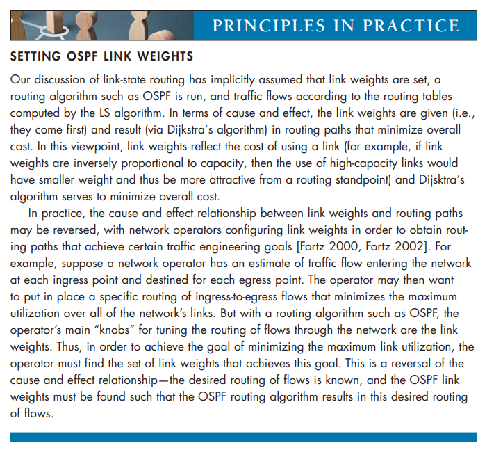

Setting OSPF Weights). The administrator might choose to set all link costs to 1, thus achieving minimum-hop routing, or might choose to set the link weights to be inversely proportional to link capacity in order to discourage traffic from using low-bandwidth links. OSPF does not mandate a policy for how link weights are set (that is the job of the network administrator), but instead provides the mecha- nisms (protocol) for determining least-cost path routing for the given set of link weights.

With OSPF, a router broadcasts routing information to _all_ other routers in the autonomous system, not just to its neighboring routers. A router broadcasts link-state information whenever there is a change in a link’s state (for example, a change in cost or a change in up/down status). It also broadcasts a link’s state periodically (at least once every 30 minutes), even if the link’s state has not changed. RFC 2328 notes that “this periodic updating of link state advertisements adds robustness to the link state algorithm.” OSPF advertisements are contained in OSPF messages that are

carried directly by IP, with an upper-layer protocol of 89 for OSPF. Thus, the OSPF protocol must itself implement functionality such as reliable message transfer and link-state broadcast. The OSPF protocol also checks that links are operational (via a HELLO message that is sent to an attached neighbor) and allows an OSPF router to obtain a neighboring router’s database of network-wide link state.

Some of the advances embodied in OSPF include the following:

• _Security._ Exchanges between OSPF routers (for example, link-state updates) can be authenticated. With authentication, only trusted routers can participate in the OSPF protocol within an AS, thus preventing malicious intruders (or networking students taking their newfound knowledge out for a joyride) from injecting incor- rect information into router tables. By default, OSPF packets between routers are not authenticated and could be forged. Two types of authentication can be configured—simple and MD5 (see Chapter 8 for a discussion on MD5 and authentication in general). With simple authentication, the same password is con- figured on each router. When a router sends an OSPF packet, it includes the password in plaintext. Clearly, simple authentication is not very secure. MD5 authentication is based on shared secret keys that are configured in all the routers. For each OSPF packet that it sends, the router computes the MD5 hash of the content of the OSPF packet appended with the secret key. (See the discussion of message authentication codes in Chapter 8.) Then the router includes the resulting hash value in the OSPF packet. The receiving router, using the preconfigured secret key, will compute an MD5 hash of the packet and compare it with the hash value that the packet carries, thus verifying the packet’s authenticity. Sequence numbers are also used with MD5 authentication to protect against replay attacks.

• _Multiple same-cost paths._ When multiple paths to a destination have the same cost, OSPF allows multiple paths to be used (that is, a single path need not be chosen for carrying all traffic when multiple equal-cost paths exist).

• _Integrated support for unicast and multicast routing._ Multicast OSPF (MOSPF) [RFC 1584] provides simple extensions to OSPF to provide for multicast routing. MOSPF uses the existing OSPF link database and adds a new type of link-state advertisement to the existing OSPF link-state broadcast mechanism.

• _Support for hierarchy within a single AS._ An OSPF autonomous system can be configured hierarchically into areas. Each area runs its own OSPF link-state routing algorithm, with each router in an area broadcasting its link state to all other routers in that area. Within each area, one or more area border routers are responsible for routing packets outside the area. Lastly, exactly one OSPF area in the AS is configured to be the backbone area. The primary role of the back- bone area is to route traffic between the other areas in the AS. The backbone always contains all area border routers in the AS and may contain non-border routers as well. Inter-area routing within the AS requires that the packet be firstrouted to an area border router (intra-area routing), then routed through the back- bone to the area border router that is in the destination area, and then routed to the final destination.

OSPF is a relatively complex protocol, and our coverage here has been necessar- ily brief; [Huitema 1998; Moy 1998; RFC 2328] provide additional details.

## Routing Among the ISPs: BGP
We just learned that OSPF is an example of an intra-AS routing protocol. When routing a packet between a source and destination within the same AS, the route the packet follows is entirely determined by the intra-AS routing protocol. How- ever, to route a packet across multiple ASs, say from a smartphone in Timbuktu to a server in a datacenter in Silicon Valley, we need an **inter-autonomous system routing protocol**. Since an inter-AS routing protocol involves coordination among multiple ASs, communicating ASs must run the same inter-AS routing protocol. In fact, in the Internet, all ASs run the same inter-AS routing protocol, called the Border Gateway Protocol, more commonly known as **BGP** [RFC 4271; Stewart 1999].

BGP is arguably the most important of all the Internet protocols (the only other contender would be the IP protocol that we studied in Section 4.3), as it is the pro- tocol that glues the thousands of ISPs in the Internet together. As we will soon see, BGP is a decentralized and asynchronous protocol in the vein of distance-vector routing described in Section 5.2.2. Although BGP is a complex and challenging pro- tocol, to understand the Internet on a deep level, we need to become familiar with its underpinnings and operation. The time we devote to learning BGP will be well worth the effort.

### The Role of BGP
 To understand the responsibilities of BGP, consider an AS and an arbitrary router in that AS. Recall that every router has a forwarding table, which plays the central role in the process of forwarding arriving packets to outbound router links. As we have learned, for destinations that are within the same AS, the entries in the router’s forwarding table are determined by the AS’s intra-AS routing protocol. But what about destinations that are outside of the AS? This is precisely where BGP comes to the rescue.

In BGP, packets are not routed to a specific destination address, but instead to CIDRized prefixes, with each prefix representing a subnet or a collection of subnets.

In the world of BGP, a destination may take the form 138.16.68/22, which for this example includes 1,024 IP addresses. Thus, a router’s forwarding table will have entries of the form (_x_, _I_), where _x_ is a prefix (such as 138.16.68/22) and _I_ is an inter- face number for one of the router’s interfaces.

As an inter-AS routing protocol, BGP provides each router a means to:

1\. _Obtain prefix reachability information from neighboring ASs._ In particular, BGP allows each subnet to advertise its existence to the rest of the Internet. A subnet screams, “I exist and I am here,” and BGP makes sure that all the rout- ers in the Internet know about this subnet. If it weren’t for BGP, each subnet would be an isolated island—alone, unknown and unreachable by the rest of the Internet.

2\. _Determine the “best” routes to the prefixes._ A router may learn about two or more different routes to a specific prefix. To determine the best route, the router will locally run a BGP route-selection procedure (using the prefix reachability information it obtained via neighboring routers). The best route will be deter- mined based on policy as well as the reachability information.

Let us now delve into how BGP carries out these two tasks.

### Advertising BGP Route Information
 Consider the network shown in Figure 5.8. As we can see, this simple network has three autonomous systems: AS1, AS2, and AS3. As shown, AS3 includes a subnet with prefix x. For each AS, each router is either a **gateway routeror an internal router**. A gateway router is a router on the edge of an AS that directly connects to one or more routers in other ASs. An **internal router
 connects only to hosts and routers within its own AS. In AS1, for example, router 1c is a gateway router; routers 1a, 1b, and 1d are internal routers.

Let’s consider the task of advertising reachability information for prefix x to all of the routers shown in Figure 5.8. At a high level, this is straightforward. First, AS3 sends a BGP message to AS2, saying that x exists and is in AS3; let’s denote this message as “AS3 x”. Then AS2 sends a BGP message to AS1, saying that x exists and that you can get to x by first passing through AS2 and then going to AS3; let’s denote that message as “AS2 AS3 x”. In this manner, each of the autonomous systems will not only learn about the existence of x, but also learn about a path of autonomous systems that leads to x.

Although the discussion in the above paragraph about advertising BGP reacha- bility information should get the general idea across, it is not precise in the sense that autonomous systems do not actually send messages to each other, but instead routers do. To understand this, let’s now re-examine the example in Figure 5.8. In BGP,

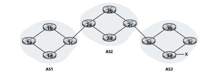
**Figure 5.8**  ♦   Network with three autonomous systems. AS3 includes a subnet with prefix x

pairs of routers exchange routing information over semi-permanent TCP connections using port 179. Each such TCP connection, along with all the BGP messages sent over the connection, is called a **BGP connection**. Furthermore, a BGP connection that spans two ASs is called an **external BGP (eBGP)** connection, and a BGP ses- sion between routers in the same AS is called an **internal BGP (iBGP)** connection. Examples of BGP connections for the network in Figure 5.8 are shown in Figure 5.9. There is typically one eBGP connection for each link that directly connects gateway routers in different ASs; thus, in Figure 5.9, there is an eBGP connection between gateway routers 1c and 2a and an eBGP connection between gateway routers 2c and 3a.

There are also iBGP connections between routers within each of the ASs. In particular, Figure 5.9 displays a common configuration of one BGP connection for each pair of routers internal to an AS, creating a mesh of TCP connections within each AS. In Figure 5.9, the eBGP connections are shown with the long dashes; the iBGP connections are shown with the short dashes. Note that iBGP connections do not always correspond to physical links.

In order to propagate the reachability information, both iBGP and eBGP sessions are used. Consider again advertising the reachability information for prefix x to all routers in AS1 and AS2. In this process, gateway router 3a first sends an eBGP message “AS3 x” to gateway router 2c. Gateway router 2c then sends the iBGP message “AS3 x” to all of the other routers in AS2, including to gateway router 2a. Gateway router 2a then sends the eBGP message “AS2 AS3 x” to gateway router 1c. Finally, gateway router 1c uses iBGP to send the


**Figure 5.9**  ♦  eBGP and iBGP connections

message “AS2 AS3 x” to all the routers in AS1. After this process is complete, each router in AS1 and AS2 is aware of the existence of x and is also aware of an AS path that leads to x.

Of course, in a real network, from a given router there may be many different paths to a given destination, each through a different sequence of ASs. For example, consider the network in Figure 5.10, which is the original network in Figure 5.8, with an additional physical link from router 1d to router 3d. In this case, there are two paths from AS1 to x: the path “AS2 AS3 x” via router 1c; and the new path “AS3 x” via the router 1d.

### Determining the Best Routes
 As we have just learned, there may be many paths from a given router to a destina- tion subnet. In fact, in the Internet, routers often receive reachability information about dozens of different possible paths. How does a router choose among these paths (and then configure its forwarding table accordingly)?

Before addressing this critical question, we need to introduce a little more BGP terminology. When a router advertises a prefix across a BGP connection, it includes with the prefix several **BGP attributes**. In BGP jargon, a prefix along with its attributes is called a **route**. Two of the more important attributes are AS-PATH and NEXT-HOP. The AS-PATH attribute contains the list of ASs through which the

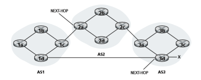
**Figure 5.10**  ♦   Network augmented with peering link between AS1 and AS3

advertisement has passed, as we’ve seen in our examples above. To generate the AS- PATH value, when a prefix is passed to an AS, the AS adds its ASN to the existing list in the AS-PATH. For example, in Figure 5.10, there are two routes from AS1 to subnet x: one which uses the AS-PATH “AS2 AS3”; and another that uses the AS-PATH “A3”. BGP routers also use the AS-PATH attribute to detect and prevent looping advertisements; specifically, if a router sees that its own AS is contained in the path list, it will reject the advertisement.

Providing the critical link between the inter-AS and intra-AS routing protocols, the NEXT-HOP attribute has a subtle but important use. The NEXT-HOP is the _IP address of the router interface that begins the AS-PATH_. To gain insight into this attribute, let’s again refer to Figure 5.10. As indicated in Figure 5.10, the NEXT- HOP attribute for the route “AS2 AS3 x” from AS1 to x that passes through AS2 is the IP address of the left interface on router 2a. The NEXT-HOP attribute for the route “AS3 x” from AS1 to x that bypasses AS2 is the IP address of the leftmost interface of router 3d. In summary, in this toy example, each router in AS1 becomes aware of two BGP routes to prefix x:

IP address of leftmost interface for router 2a; AS2 AS3; x 
IP address of leftmost interface of router 3d; AS3; x

Here, each BGP route is written as a list with three components: NEXT-HOP; AS- PATH; destination prefix. In practice, a BGP route includes additional attributes, which we will ignore for the time being. Note that the NEXT-HOP attribute is an IP address of a router that does _not_ belong to AS1; however, the subnet that contains this IP address directly attaches to AS1.

**Hot Potato Routing**

We are now _finally_ in position to talk about BGP routing algorithms in a precise manner. We will begin with one of the simplest routing algorithms, namely, **hot potato routing**.

Consider router 1b in the network in Figure 5.10. As just described, this router will learn about two possible BGP routes to prefix x. In hot potato routing, the route chosen (from among all possible routes) is that route with the least cost to the NEXT- HOP router beginning that route. In this example, router 1b will consult its intra-AS routing information to find the least-cost intra-AS path to NEXT-HOP router 2a and the least-cost intra-AS path to NEXT-HOP router 3d, and then select the route with the smallest of these least-cost paths. For example, suppose that cost is defined as the number of links traversed. Then the least cost from router 1b to router 2a is 2, the least cost from router 1b to router 2d is 3, and router 2a would therefore be selected. Router 1b would then consult its forwarding table (configured by its intra-AS algorithm) and find the interface _I_ that is on the least-cost path to router 2a. It then adds (_x_, _I_) to its forwarding table.

The steps for adding an outside-AS prefix in a router’s forwarding table for hot potato routing are summarized in Figure 5.11. It is important to note that when add- ing an outside-AS prefix into a forwarding table, both the inter-AS routing protocol (BGP) and the intra-AS routing protocol (e.g., OSPF) are used.

The idea behind hot-potato routing is for router 1b to get packets out of its AS as quickly as possible (more specifically, with the least cost possible) without worrying about the cost of the remaining portions of the path outside of its AS to the destination. In the name “hot potato routing,” a packet is analogous to a hot potato that is burning in your hands. Because it is burning hot, you want to pass it off to another person (another AS) as quickly as possible. Hot potato routing is thus


**Figure 5.11**  ♦   Steps in adding outside-AS destination in a router’s forwarding table

a selfish algorithm—it tries to reduce the cost in its own AS while ignoring the other components of the end-to-end costs outside its AS. Note that with hot potato routing, two routers in the same AS may choose two different AS paths to the same prefix. For example, we just saw that router 1b would send packets through AS2 to reach x. However, router 1d would bypass AS2 and send packets directly to AS3 to reach x.

**Route-Selection Algorithm**

In practice, BGP uses an algorithm that is more complicated than hot potato routing, but nevertheless incorporates hot potato routing. For any given destination prefix, the input into BGP’s route-selection algorithm is the set of all routes to that prefix that have been learned and accepted by the router. If there is only one such route, then BGP obvi- ously selects that route. If there are two or more routes to the same prefix, then BGP sequentially invokes the following elimination rules until one route remains:

1\. A route is assigned a **local preference** value as one of its attributes (in addition to the AS-PATH and NEXT-HOP attributes). The local preference of a route could have been set by the router or could have been learned from another router in the same AS. The value of the local preference attribute is a policy decision that is left entirely up to the AS’s network administrator. (We will shortly dis- cuss BGP policy issues in some detail.) The routes with the highest local prefer- ence values are selected.

2\. From the remaining routes (all with the same highest local preference value), the route with the shortest AS-PATH is selected. If this rule were the only rule for route selection, then BGP would be using a DV algorithm for path determi- nation, where the distance metric uses the number of AS hops rather than the number of router hops.

3\. From the remaining routes (all with the same highest local preference value and the same AS-PATH length), hot potato routing is used, that is, the route with the closest NEXT-HOP router is selected.

4\. If more than one route still remains, the router uses BGP identifiers to select the route; see [Stewart 1999].

As an example, let’s again consider router 1b in Figure 5.10. Recall that there are exactly two BGP routes to prefix x, one that passes through AS2 and one that bypasses AS2. Also recall that if hot potato routing on its own were used, then BGP would route packets through AS2 to prefix x. But in the above route-selection algo- rithm, rule 2 is applied before rule 3, causing BGP to select the route that bypasses AS2, since that route has a shorter AS PATH. So we see that with the above route- selection algorithm, BGP is no longer a selfish algorithm—it first looks for routes with short AS paths (thereby likely reducing end-to-end delay).

As noted above, BGP is the _de facto_ standard for inter-AS routing for the Internet. To see the contents of various BGP routing tables (large!) extracted fromrouters in tier-1 ISPs, see http://www.routeviews.org. BGP routing tables often contain over half a million routes (that is, prefixes and corresponding attributes). Statistics about the size and characteristics of BGP routing tables are presented in [Huston 2019b].

### IP-Anycast
 In addition to being the Internet’s inter-AS routing protocol, BGP is often used to implement the IP-anycast service [RFC 1546, RFC 7094], which is commonly used in DNS. To motivate IP-anycast, consider that in many applications, we are interested in (1) replicating the same content on different servers in many different dispersed geographical locations, and (2) having each user access the content from the server that is closest. For example, a CDN may replicate videos and other objects on servers in different countries. Similarly, the DNS system can replicate DNS records on DNS servers throughout the world. When a user wants to access this replicated content, it is desirable to point the user to the “nearest” server with the replicated content. BGP’s route-selection algorithm provides an easy and natural mechanism for doing so.

To make our discussion concrete, let’s describe how a CDN might use IP- anycast. As shown in Figure 5.12, during the IP-anycast configuration stage, the CDN company assigns the _same_ IP address to each of its servers, and uses stand- ard BGP to advertise this IP address from each of the servers. When a BGP router receives multiple route advertisements for this IP address, it treats these advertise- ments as providing different paths to the same physical location (when, in fact, the advertisements are for different paths to different physical locations). When configuring its routing table, each router will locally use the BGP route-selec- tion algorithm to pick the “best” (for example, closest, as determined by AS-hop counts) route to that IP address. For example, if one BGP route (corresponding to one location) is only one AS hop away from the router, and all other BGP routes (corresponding to other locations) are two or more AS hops away, then the BGP router would choose to route packets to the location that is one hop away. After this initial BGP address-advertisement phase, the CDN can do its main job of dis- tributing content. When a client requests the video, the CDN returns to the client the common IP address used by the geographically dispersed servers, no matter where the client is located. When the client sends a request to that IP address, Internet routers then forward the request packet to the “closest” server, as defined by the BGP route-selection algorithm.

Although the above CDN example nicely illustrates how IP-anycast can be used, in practice, CDNs generally choose not to use IP-anycast because BGP routing changes can result in different packets of the same TCP connection arriving at differ- ent instances of the Web server. But IP-anycast is extensively used by the DNS system to direct DNS queries to the closest root DNS server. Recall from Section 2.4, there are currently 13 IP addresses for root DNS servers. But corresponding to each of these addresses, there are multiple DNS root servers, with some of these addresses having


**Figure 5.12**  ♦  Using IP-anycast to bring users to the closest CDN server

over 100 DNS root servers scattered over all corners of the world. When a DNS query is sent to one of these 13 IP addresses, IP anycast is used to route the query to the nearest of the DNS root servers that is responsible for that address. [Li 2018] presents recent measurements illustrating Internet anycast, use, performance, and challenges.

### Routing Policy
 When a router selects a route to a destination, the AS routing policy can trump all other considerations, such as shortest AS path or hot potato routing. Indeed, in the route-selection algorithm, routes are first selected according to the local-preference attribute, whose value is fixed by the policy of the local AS.

Let’s illustrate some of the basic concepts of BGP routing policy with a simple example. Figure 5.13 shows six interconnected autonomous systems: A, B, C, W, X, and Y. It is important to note that A, B, C, W, X, and Y are ASs, not routers. Let’s

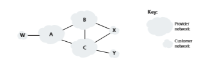
**Figure 5.13**  ♦  A simple BGP policy scenario

assume that autonomous systems W, X, and Y are access ISPs and that A, B, and C are backbone provider networks. We’ll also assume that A, B, and C, directly send traffic to each other, and provide full BGP information to their customer networks. All traffic entering an ISP access network must be destined for that network, and all traffic leaving an ISP access network must have originated in that network. W and Y are clearly access ISPs. X is a **multi-homed access ISP**, since it is con- nected to the rest of the network via two different providers (a scenario that is becom- ing increasingly common in practice). However, like W and Y, X itself must be the source/destination of all traffic leaving/entering X. But how will this stub network behavior be implemented and enforced? How will X be prevented from forwarding traffic between B and C? This can easily be accomplished by controlling the manner in which BGP routes are advertised. In particular, X will function as an access ISP network if it advertises (to its neighbors B and C) that it has no paths to any other destinations except itself. That is, even though X may know of a path, say XCY, that reaches network Y, it will not advertise this path to B. Since B is unaware that X has a path to Y, B would never forward traffic destined to Y (or C) via X. This simple example illustrates how a selective route advertisement policy can be used to imple- ment customer/provider routing relationships.

Let’s next focus on a provider network, say AS B. Suppose that B has learned (from A) that A has a path AW to W. B can thus install the route AW into its routing information base. Clearly, B also wants to advertise the path BAW to its customer, X, so that X knows that it can route to W via B. But should B advertise the path BAW to C? If it does so, then C could route traffic to W via BAW. If A, B, and C are all backbone providers, than B might rightly feel that it should not have to shoulder the burden (and cost!) of carrying transit traffic between A and C. B might rightly feel that it is A’s and C’s job (and cost!) to make sure that C can route to/from A’s customers via a direct connection between A and C. There are currently no official standards that govern how backbone ISPs route among themselves. However, a rule of thumb followed by commercial ISPs is that any traffic flowing across an ISP’s backbone network must have either a source or a destination (or both) in a network that is a customer of that ISP; otherwise the traffic would be getting a free ride on the ISP’s network. Individual peering agreements (that would govern questions such


as those raised above) are typically negotiated between pairs of ISPs and are often confidential; [Huston 1999a; Huston 2012] provide an interesting discussion of peer- ing agreements. For a detailed description of how routing policy reflects commercial relationships among ISPs, see [Gao 2001; Dmitiropoulos 2007]. For a discussion of BGP routing polices from an ISP standpoint, see [Caesar 2005b].

This completes our brief introduction to BGP. Understanding BGP is important because it plays a central role in the Internet. We encourage you to see the references [Stewart 1999; Huston 2019a; Labovitz 1997; Halabi 2000; Huitema 1998; Gao 2001; Feamster 2004; Caesar 2005b; Li 2007] to learn more about BGP.

### Putting the Pieces Together: Obtaining Internet Presence
Although this subSection is not about BGP _per se_, it brings together many of the protocols and concepts we’ve seen thus far, including IP addressing, DNS, and BGP.

Suppose you have just created a small company that has a number of servers, including a public Web server that describes your company’s products and services, a mail server from which your employees obtain their e-mail messages, and a DNS server. Naturally, you would like the entire world to be able to visit your Web site in order to learn about your exciting products and services. Moreover, you would like your employees to be able to send and receive e-mail to potential customers throughout the world.

To meet these goals, you first need to obtain Internet connectivity, which is done by contracting with, and connecting to, a local ISP. Your company will have a gateway router, which will be connected to a router in your local ISP. This con- nection might be a DSL connection through the existing telephone infrastructure, a leased line to the ISP’s router, or one of the many other access solutions described in Chapter 1. Your local ISP will also provide you with an IP address range, for example, a /24 address range consisting of 256 addresses. Once you have your physi- cal connectivity and your IP address range, you will assign one of the IP addresses (in your address range) to your Web server, one to your mail server, one to your DNS server, one to your gateway router, and other IP addresses to other servers and networking devices in your company’s network.

In addition to contracting with an ISP, you will also need to contract with an Internet registrar to obtain a domain name for your company, as described in Chapter 2. For example, if your company’s name is, say, Xanadu Inc., you will naturally try to obtain the domain name xanadu.com. Your company must also obtain presence in the DNS system. Specifically, because outsiders will want to contact your DNS server to obtain the IP addresses of your servers, you will also need to provide your registrar with the IP address of your DNS server. Your registrar will then put an entry for your DNS server (domain name and corresponding IP address) in the .com top-level-domain servers, as described in Chapter 2. After this step is completed, any user who knows your domain name (e.g., xanadu.com) will be able to obtain the IP address of your DNS server via the DNS system.

So that people can discover the IP addresses of your Web server, in your DNS server you will need to include entries that map the host name of your Web server (e.g., www.xanadu.com) to its IP address. You will want to have similar entries forother publicly available servers in your company, including your mail server. In this manner, if Alice wants to browse your Web server, the DNS system will contact your DNS server, find the IP address of your Web server, and give it to Alice. Alice can then establish a TCP connection directly with your Web server.

However, there still remains one other necessary and crucial step to allow out- siders from around the world to access your Web server. Consider what happens when Alice, who knows the IP address of your Web server, sends an IP datagram (e.g., a TCP SYN segment) to that IP address. This datagram will be routed through the Internet, visiting a series of routers in many different ASs, and eventually reach your Web server. When any one of the routers receives the datagram, it is going to look for an entry in its forwarding table to determine on which outgoing port it should forward the datagram. Therefore, each of the routers needs to know about the existence of your company’s /24 prefix (or some aggregate entry). How does a router become aware of your company’s prefix? As we have just seen, it becomes aware of it from BGP! Specifically, when your company contracts with a local ISP and gets assigned a prefix (i.e., an address range), your local ISP will use BGP to advertise your prefix to the ISPs to which it connects. Those ISPs will then, in turn, use BGP to propagate the advertisement. Eventually, all Internet routers will know about your prefix (or about some aggregate that includes your prefix) and thus be able to appro- priately forward datagrams destined to your Web and mail servers.

## The SDN Control Plane
In this Section, we’ll dive into the SDN control plane—the network-wide logic that controls packet forwarding among a network’s SDN-enabled devices, as well as the configuration and management of these devices and their services. Our study here builds on our earlier discussion of generalized SDN forwarding in Section 4.4, so you might want to first review that Section, as well as Section 5.1 of this chapter, before continuing on. As in Section 4.4, we’ll again adopt the terminology used in the SDN literature and refer to the network’s forwarding devices as “packet switches” (or just switches, with “packet” being understood), since forwarding decisions can be made on the basis of network-layer source/destination addresses, link-layer source/destina- tion addresses, as well as many other values in transport-, network-, and link-layer packet-header fields.

Four key characteristics of an SDN architecture can be identified [Kreutz 2015]:

• _Flow-based forwarding._ Packet forwarding by SDN-controlled switches can be based on any number of header field values in the transport-layer, network-layer, or link-layer header. We saw in Section 4.4 that the OpenFlow1.0 abstraction allows forwarding based on eleven different header field values. This contrastssharply with the traditional approach to router-based forwarding that we studied in Sections 5.2–5.4, where forwarding of IP datagrams was based solely on a datagram’s destination IP address. Recall from Figure 5.2 that packet forwarding rules are specified in a switch’s flow table; it is the job of the SDN control plane to compute, manage and install flow table entries in all of the network’s switches.

• _Separation of data plane and control plane._ This separation is shown clearly in Figures 5.2 and 5.14. The data plane consists of the network’s switches— relatively simple (but fast) devices that execute the “match plus action” rules in their flow tables. The control plane consists of servers and software that deter- mine and manage the switches’ flow tables.

• _Network control functions: external to data-plane switches._ Given that the “S” in SDN is for “software,” it’s perhaps not surprising that the SDN control plane is implemented in software. Unlike traditional routers, however, this software exe- cutes on servers that are both distinct and remote from the network’s switches. As shown in Figure 5.14, the control plane itself consists of two components—an SDN controller (or network operating system [Gude 2008]) and a set of network-control applications. The controller maintains accurate network state information (e.g., the state of remote links, switches, and hosts); provides this information to the network- control applications running in the control plane; and provides the means through which these applications can monitor, program, and control the underlying network devices. Although the controller in Figure 5.14 is shown as a single central server, in practice the controller is only logically centralized; it is typically implemented on several servers that provide coordinated, scalable performance and high availability.

• _A programmable network._ The network is programmable through the network- control applications running in the control plane. These applications represent the “brains” of the SDN control plane, using the APIs provided by the SDN controller to specify and control the data plane in the network devices. For example, a routing network-control application might determine the end-end paths between sources and destinations (for example, by executing Dijkstra’s algorithm using the node- state and link-state information maintained by the SDN controller). Another net- work application might perform access control, that is, determine which packets are to be blocked at a switch, as in our third example in Section 4.4.3. Yet another application might have switches forward packets in a manner that performs server load balancing (the second example we considered in Section 4.4.3).

From this discussion, we can see that SDN represents a significant “unbundling” of network functionality—data plane switches, SDN controllers, and network-control applications are separate entities that may each be provided by different vendors and organizations. This contrasts with the pre-SDN model in which a switch/router (together with its embedded control plane software and protocol implementations) was monolithic, vertically integrated, and sold by a single vendor. This unbundling


**Figure 5.14**  ♦   Components of the SDN architecture: SDN-controlled switches, the SDN controller, network-control applications

of network functionality in SDN has been likened to the earlier evolution from main- frame computers (where hardware, system software, and applications were provided by a single vendor) to personal computers (with their separate hardware, operating systems, and applications). The unbundling of computing hardware, system soft- ware, and applications has led to a rich, open ecosystem driven by innovation in all three of these areas; one hope for SDN is that it will continue to drive and enable such rich innovation.

Given our understanding of the SDN architecture of Figure 5.14, many questions naturally arise. How and where are the flow tables actually computed? How are these tables updated in response to events at SDN-controlled devices (e.g., an attached link going up/down)? And how are the flow table entries at multiple switches coordinated in such a way as to result in orchestrated and consistent network-wide functionality (e.g., end-to-end paths for forwarding packets from sources to destinations, or coor- dinated distributed firewalls)? It is the role of the SDN control plane to provide these, and many other, capabilities.

### The SDN Control Plane: SDN Controller and SDN Network-control Applications

Let’s begin our discussion of the SDN control plane in the abstract, by consider- ing the generic capabilities that the control plane must provide. As we’ll see, this abstract, “first principles” approach will lead us to an overall architecture that reflects how SDN control planes have been implemented in practice.

As noted above, the SDN control plane divides broadly into two components— the SDN controller and the SDN network-control applications. Let’s explore the controller first. Many SDN controllers have been developed since the earliest SDN controller [Gude 2008]; see [Kreutz 2015] for an extremely thorough survey. Figure 5.15 provides a more detailed view of a generic SDN controller. A controller’s function- ality can be broadly organized into three layers. Let’s consider these layers in an uncharacteristically bottom-up fashion:

• _A communication layer: communicating between the SDN controller and con- trolled network devices._ Clearly, if an SDN controller is going to control the operation of a remote SDN-enabled switch, host, or other device, a protocol is needed to transfer information between the controller and that device. In addition, a device must be able to communicate locally-observed events to the controller (for example, a message indicating that an attached link has gone up or down, that a device has just joined the network, or a heartbeat indicating that a device is up and operational). These events provide the SDN controller with an up-to- date view of the network’s state. This protocol constitutes the lowest layer of the controller architecture, as shown in Figure 5.15. The communication between the controller and the controlled devices cross what has come to be known as the controller’s “southbound” interface. In Section 5.5.2, we’ll study OpenFlow—a specific protocol that provides this communication functionality. OpenFlow is implemented in most, if not all, SDN controllers.

• _A network-wide state-management layer._ The ultimate control decisions made by the SDN control plane—for example, configuring flow tables in all switches to achieve the desired end-end forwarding, to implement load balancing, or to imple- ment a particular firewalling capability—will require that the controller have up- to-date information about state of the networks’ hosts, links, switches, and other SDN-controlled devices. A switch’s flow table contains counters whose values might also be profitably used by network-control applications; these values should thus be available to the applications. Since the ultimate aim of the control plane is to determine flow tables for the various controlled devices, a controller might also maintain a copy of these tables. These pieces of information all constitute exam- ples of the network-wide “state” maintained by the SDN controller.

• _The interface to the network-control application layer._ The controller interacts with network-control applications through its “northbound” interface. This API


**Figure 5.15**  ♦  Components of an SDN controller

allows network-control applications to read/write network state and flow tables within the state-management layer. Applications can register to be notified when state-change events occur, so that they can take actions in response to network event notifications sent from SDN-controlled devices. Different types of APIs may be provided; we’ll see that two popular SDN controllers communicate with their applications using a REST [Fielding 2000] request-response interface.

We have noted several times that an SDN controller can be considered to be “logically centralized,” that is, that the controller may be viewed externally (for exam- ple, from the point of view of SDN-controlled devices and external network-control
applications) as a single, monolithic service. However, these services and the data- bases used to hold state information are implemented in practice by a _distributed_ set of servers for fault tolerance, high availability, or for performance reasons. With controller functions being implemented by a _set_ of servers, the semantics of the con- troller’s internal operations (e.g., maintaining logical time ordering of events, con- sistency, consensus, and more) must be considered [Panda 2013]. Such concerns are common across many different distributed systems; see [Lamport 1989, Lampson 1996] for elegant solutions to these challenges. Modern controllers such as Open- Daylight [OpenDaylight 2020] and ONOS [ONOS 2020] (see sidebar) have placed considerable emphasis on architecting a logically centralized but physically distrib- uted controller platform that provides scalable services and high availability to the controlled devices and network-control applications alike.

The architecture depicted in Figure 5.15 closely resembles the architecture of the originally proposed NOX controller in 2008 [Gude 2008], as well as that of today’s OpenDaylight [OpenDaylight 2020] and ONOS [ONOS 2020] SDN controllers (see sidebar). We’ll cover an example of controller operation in Section 5.5.3. First, how- ever, let’s examine the OpenFlow protocol, the earliest and now one of several pro- tocols that can be used for communication between an SDN controller and a controlled device, which lies in the controller’s communication layer.

### OpenFlow Protocol
 The OpenFlow protocol [OpenFlow 2009, ONF 2020] operates between an SDN controller and an SDN-controlled switch or other device implementing the Open- Flow API that we studied earlier in Section 4.4. The OpenFlow protocol operates over TCP, with a default port number of 6653.

Among the important messages flowing from the controller to the controlled switch are the following:

• _Configuration._ This message allows the controller to query and set a switch’s configuration parameters.

• _Modify-State._ This message is used by a controller to add/delete or modify entries in the switch’s flow table, and to set switch port properties.

• _Read-State._ This message is used by a controller to collect statistics and counter values from the switch’s flow table and ports.

• _Send-Packet._ This message is used by the controller to send a specific packet out of a specified port at the controlled switch. The message itself contains the packet to be sent in its payload.

Among the messages flowing from the SDN-controlled switch to the controller are the following:

• _Flow-Removed._ This message informs the controller that a flow table entry has been removed, for example by a timeout or as the result of a received _modify-state_ message.• _Port-status._ This message is used by a switch to inform the controller of a change in port status.

• _Packet-in._ Recall from Section 4.4 that a packet arriving at a switch port and not matching any flow table entry is sent to the controller for additional processing. Matched packets may also be sent to the controller, as an action to be taken on a match. The _packet-in_ message is used to send such packets to the controller.

Additional OpenFlow messages are defined in [OpenFlow 2009, ONF 2020].

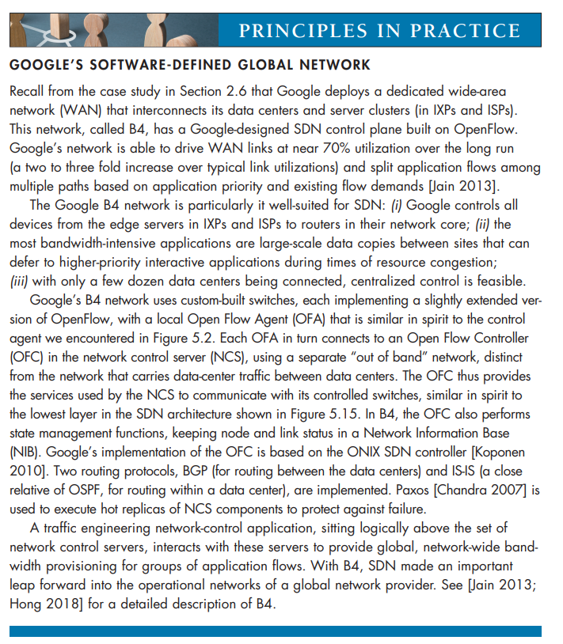


### Data and Control Plane Interaction: An Example
 In order to solidify our understanding of the interaction between SDN-controlled switches and the SDN controller, let’s consider the example shown in Figure 5.16, in which Dijkstra’s algorithm (which we studied in Section 5.2) is used to determine shortest path routes. The SDN scenario in Figure 5.16 has two important differ- ences from the earlier per-router-control scenario of Sections 5.2.1 and 5.3, where Dijkstra’s algorithm was implemented in each and every router and link-state updates were flooded among all network routers:

• Dijkstra’s algorithm is executed as a separate application, outside of the packet switches.

• Packet switches send link updates to the SDN controller and not to each other.

In this example, let’s assume that the link between switch s1 and s2 goes down; that shortest path routing is implemented, and consequently and that incom- ing and outgoing flow forwarding rules at s1, s3, and s4 are affected, but that s2’s

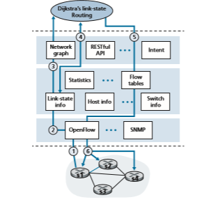
**Figure 5.16**  ♦  SDN controller scenario: Link-state change

infooperation is unchanged. Let’s also assume that OpenFlow is used as the communi- cation layer protocol, and that the control plane performs no other function other than link-state routing.

1\. Switch s1, experiencing a link failure between itself and s2, notifies the SDN controller of the link-state change using the OpenFlow _port-status_ message.

2\. The SDN controller receives the OpenFlow message indicating the link-state change, and notifies the link-state manager, which updates a link-state database.

3\. The network-control application that implements Dijkstra’s link-state routing has previously registered to be notified when link state changes. That applica- tion receives the notification of the link-state change.

4\. The link-state routing application interacts with the link-state manager to get updated link state; it might also consult other components in the state- management layer. It then computes the new least-cost paths.

5\. The link-state routing application then interacts with the flow table manager, which determines the flow tables to be updated.

6\. The flow table manager then uses the OpenFlow protocol to update flow table entries at affected switches—s1 (which will now route packets destined to s2 via s4), s2 (which will now begin receiving packets from s1 via intermediate switch s4), and s4 (which must now forward packets from s1 destined to s2).

This example is simple but illustrates how the SDN control plane provides control- plane services (in this case, network-layer routing) that had been previously imple- mented with per-router control exercised in each and every network router. One can now easily appreciate how an SDN-enabled ISP could easily switch from least-cost path routing to a more hand-tailored approach to routing. Indeed, since the controller can tailor the flow tables as it pleases, it can implement _any_ form of forwarding that it pleases—simply by changing its application-control software. This ease of change should be contrasted to the case of a traditional per-router control plane, where soft- ware in all routers (which might be provided to the ISP by multiple independent vendors) must be changed.

### SDN: Past and Future
 Although the intense interest in SDN is a relatively recent phenomenon, the techni- cal roots of SDN, and the separation of the data and control planes in particular, go back considerably further. In 2004, [Feamster 2004, Lakshman 2004, RFC 3746] all argued for the separation of the network’s data and control planes. [van der Merwe 1998] describes a control framework for ATM networks [Black 1995] with multiple controllers, each controlling a number of ATM switches. The Ethane project [Casado 2007] pioneered the notion of a network of simple flow-based Ethernet switches with match-plus-action flow tables, a centralized controller that managed flowadmission and routing, and the forwarding of unmatched packets from the switch to the controller. A network of more than 300 Ethane switches was operational in 2007. Ethane quickly evolved into the OpenFlow project, and the rest (as the saying goes) is history!

Numerous research efforts are aimed at developing future SDN architectures and capabilities. As we have seen, the SDN revolution is leading to the disruptive replacement of dedicated monolithic switches and routers (with both data and control planes) by simple commodity switching hardware and a sophisticated software con- trol plane. A generalization of SDN known as network functions virtualization (NFV) (which we discussed earlier in Section 4.5) similarly aims at disruptive replacement of sophisticated middleboxes (such as middleboxes with dedicated hardware and proprietary software for media caching/service) with simple commodity servers, switching, and storage. A second area of important research seeks to extend SDN concepts from the intra-AS setting to the inter-AS setting [Gupta 2014].

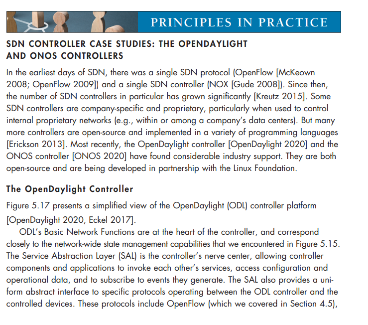

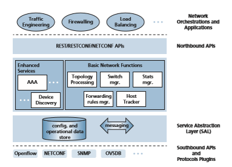
**Figure 5.17**  ♦  A simplified view of the OpenDaylight controller

and the Simple Network Management Protocol (SNMP) and the Network Configuration (NETCONF) protocol, both of which we’ll cover in Section 5.7. The Open vSwitch Database Management Protocol (OVSDB) is used to manage data center switching, an important application area for SDN technology. We’ll introduce data center networking in Chapter 6.

Network Orchestrations and Applications determine how data-plane forwarding and other services, such as firewalling and load balancing, are accomplished in the controlled devices. ODL provides two ways in which applications can interoperate with native controller services (and hence devices) and with each other. In the API-Driven (AD-SAL) approach, shown in Figure 5.17, applications communicate with controller modules using a REST request-response API running over HTTP. Initial releases of the OpenDaylight controller provided only the AD-SAL. As ODL became increasingly used for network configuration and management, later ODL releases introduced a Model- Driven (MD-SAL) approach. Here, the YANG data modeling language [RFC 6020] defines models of device, protocol, and network configuration and operational state data. Devices are then configured and managed by manipulating this data using the NETCONF protocol.

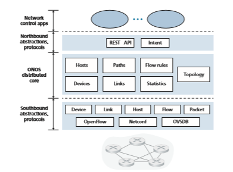
**Figure 5.18**  ♦  ONOS controller architecture

**The ONOS Controller**
Figure 5.18 presents a simplified view of the ONOS controller ONOS 2020]. Similar to the canonical controller in Figure 5.15, three layers can be identified in the ONOS controller:

• _Northbound abstractions and protocols._ A unique feature of ONOS is its intent framework, which allows an application to request a high-level service (e.g., to setup a connection between host A and Host B, or conversely to not allow Host A and host B to communicate) without having to know the details of how this service is performed. State information is provided to network-control applications across the northbound API either synchronously (via query) or asynchronously (via listener callbacks, e.g., when network state changes).

• _Distributed core._ The state of the network’s links, hosts, and devices is maintained in ONOS’s distributed core. ONOS is deployed as a service on a set of intercon- nected servers, with each server running an identical copy of the ONOS software; an increased number of servers offers an increased service capacity. The ONOS core
provides the mechanisms for service replication and coordination among instances, 
providing the applications above and the network devices below with the abstraction 
of logically centralized core services.
• Southbound abstractions and protocols. The southbound abstractions mask the hetero geneity of the underlying hosts, links, switches, and protocols, allowing the distributed 
core to be both device and protocol agnostic. Because of this abstraction, the south bound interface below the distributed core is logically higher than in our canonical 
controller in Figure 5.14 or the ODL controller in Figure 5.17.

## ICMP: The Internet Control Message Protocol
The Internet Control Message Protocol (ICMP), specified in [RFC 792], is used by hosts and routers to communicate network-layer information to each other. The most typical use of ICMP is for error reporting. For example, when running an HTTP session, you may have encountered an error message such as “Destination network unreachable.” This message had its origins in ICMP. At some point, an IP router was unable to find a path to the host specified in your HTTP request. That router created and sent an ICMP message to your host indicating the error.

ICMP is often considered part of IP, but architecturally it lies just above IP, as ICMP messages are carried inside IP datagrams. That is, ICMP messages are carried as IP payload, just as TCP or UDP segments are carried as IP payload. Similarly, when a host receives an IP datagram with ICMP specified as the upper-layer protocol (an upper-layer protocol number of 1), it demultiplexes the datagram’s contents to ICMP, just as it would demultiplex a datagram’s content to TCP or UDP.

ICMP messages have a type and a code field, and contain the header and the first 8 bytes of the IP datagram that caused the ICMP message to be generated in the first place (so that the sender can determine the datagram that caused the error). Selected ICMP message types are shown in Figure 5.19. Note that ICMP messages are used not only for signaling error conditions.

The well-known ping program sends an ICMP type 8 code 0 message to the specified host. The destination host, seeing the echo request, sends back a type 0 code 0 ICMP echo reply. Most TCP/IP implementations support the ping server directly in the operating system; that is, the server is not a process. Chapter 11 of [Stevens 1990] provides the source code for the ping client program. Note that the client program needs to be able to instruct the operating system to generate an ICMP message of type 8 code 0.

Another interesting ICMP message is the source quench message. This message is seldom used in practice. Its original purpose was to perform congestion control—to allow a congested router to send an ICMP source quench message to a host to force


**Figure 5.19**  ♦  ICMP message types

that host to reduce its transmission rate. We have seen in Chapter 3 that TCP has its 
own congestion-control mechanism that operates at the transport layer, and that Explicit 
Congestion Notification bits can be used by network-later devices to signal congestion.
In Chapter 1, we introduced the Traceroute program, which allows us to trace a 
route from a host to any other host in the world. Interestingly, Traceroute is imple mented with ICMP messages. To determine the names and addresses of the routers 
between source and destination, Traceroute in the source sends a series of ordinary IP 
datagrams to the destination. Each of these datagrams carries a UDP segment with an 
unlikely UDP port number. The first of these datagrams has a TTL of 1, the second of 2, 
the third of 3, and so on. The source also starts timers for each of the datagrams. When 
the nth datagram arrives at the nth router, the nth router observes that the TTL of the 
datagram has just expired. According to the rules of the IP protocol, the router discards 
the datagram and sends an ICMP warning message to the source (type 11 code 0). This 
warning message includes the name of the router and its IP address. When this ICMP 
message arrives back at the source, the source obtains the round-trip time from the 
timer and the name and IP address of the nth router from the ICMP message.
How does a Traceroute source know when to stop sending UDP segments? 
Recall that the source increments the TTL field for each datagram it sends. Thus, one 
of the datagrams will eventually make it all the way to the destination host. Because 
this datagram contains a UDP segment with an unlikely port number, the destination 
host sends a port unreachable ICMP message (type 3 code 3) back to the source. 
When the source host receives this particular ICMP message, it knows it does not 
need to send additional probe packets. (The standard Traceroute program actually 
sends sets of three packets with the same TTL; thus, the Traceroute output provides 
three results for each TTL.)
In this manner, the source host learns the number and the identities of routers 
that lie between it and the destination host and the round-trip time between the two 
hosts. Note that the Traceroute client program must be able to instruct the operating 
system to generate UDP datagrams with specific TTL values and must also be able to 
be notified by its operating system when ICMP messages arrive. Now that you understand how Traceroute works, you may want to go back and play with it some more.
A new version of ICMP has been defined for IPv6 in RFC 4443. In addition to 
reorganizing the existing ICMP type and code definitions, ICMPv6 also added new 
types and codes required by the new IPv6 functionality. These include the “Packet 
Too Big” type and an “unrecognized IPv6 options” error code.

## Network Management and SNMP, NETCONF/YANG
Having now made our way to the end of our study of the network layer, with only the link-layer before us, we’re well aware that a network consists of many complex, interact- ing pieces of hardware and software—from the links, switches, routers, hosts, and other devices that comprise the physical components of the network to the many protocols that control and coordinate these devices. When hundreds or thousands of such components are brought together by an organization to form a network, the job of the network admin- istrator to keep the network “up and running” is surely a challenge. We saw in Section 5.5 that the logically centralized controller can help with this process in an SDN context. But the challenge of network management has been around long before SDN, with a rich set of network management tools and approaches that help the network administrator monitor, manage, and control the network. We’ll study these tools and techniques in this Section, as well as new tools and techniques that have co-evolved along with SDN.

An often-asked question is “What is network management?” A well-conceived, single-sentence (albeit a rather long run-on sentence) definition of network manage- ment from [Saydam 1996] is:

_Network management includes the deployment, integration, and coordination of the hardware, software, and human elements to monitor, test, poll, configure, ana- lyze, evaluate, and control the network and element resources to meet the real-time, operational performance, and Quality of Service requirements at a reasonable cost._

Given this broad definition, we’ll cover only the rudiments of network man- agement in this Section—the architecture, protocols, and data used by a networkadministrator in performing their task. We’ll not cover the administrator’s decision- making processes, where topics such as fault identification [Labovitz 1997; Steinder 2002; Feamster 2005; Wu 2005; Teixeira 2006], anomaly detection [Lakhina 2005; Barford 2009], network design/engineering to meet contracted Service Level Agree- ments (SLA’s) [Huston 1999a], and more come into consideration. Our focus is thus purposefully narrow; the interested reader should consult these references, the excel- lent overviews in [Subramanian 2000; Schonwalder 2010; Claise 2019], and the more detailed treatment of network management available on the Web site for this text.

### The Network Management Framework
 Figure 5.20 shows the key components of network management:

• _Managing server._ The managing server is an application, typically with **network managers** (humans) in the loop, running in a centralized network management station in the network operations center (NOC). The managing server is the locus of activity for network management: it controls the collection, processing, analy- sis, and dispatching of network management information and commands. It is here that actions are initiated to configure, monitor, and control the network’s managed devices. In practice, a network may have several such managing servers.

• _Managed device._ A managed device is a piece of network equipment (including its software) that resides on a managed network. A managed device might be a host, router, switch, middlebox, modem, thermometer, or other network-con- nected device. The device itself will have many manageable components (e.g., a network interface is but one component of a host or router), and configuration parameters for these hardware and software components (e.g., an intra-AS rout- ing protocol, such as OSPF).

• _Data._ Each managed device will have data, also known as “state,” associated with it. There are several different types of data. **Configuration data** is device information explicitly configured by the network manager, for example, a manager-assigned/ configured IP address or interface speed for a device interface. **Operational data** is information that the device acquires as it operates, for example, the list of immedi- ate neighbors in OSPF protocol. **Device statistics** are status indicators and counts that are updated as the device operators (e.g., the number of dropped packets on an interface, or the device’s cooling fan speed). The network manager can query remote device data, and in some cases, control the remote device by writing device data values, as discussed below. As shown in Figure 5.17, the managing server also maintains its own copy of configuration, operational and statistics data from its managed devices as well as network-wide data (e.g., the network’s topology).

• _Network management agent._ The network management agent is a software pro- cess running in the managed device that communicates with the managing server, taking local actions at the managed device under the command and control of the managing server. The network management agent is similar to the routing agent that we saw in Figure 5.2.

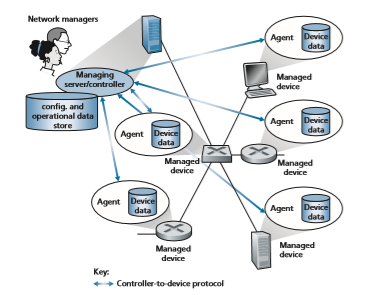
**Figure 5.20**  ♦   Elements of network management

• _Network management protocol._ The final component of a network management framework is the network management protocol. This protocol runs between the managing server and the managed devices, allowing the managing server to query the status of managed devices and take actions at these devices via its agents. Agents can use the network management protocol to inform the managing server of exceptional events (e.g., component failures or violation of performance thresholds). It’s important to note that the network management protocol does not itself manage the network. Instead, it provides capabilities that network managers can use to manage (“monitor, test, poll, configure, analyze, evaluate, and con- trol”) the network. This is a subtle, but important, distinction.

In practice, there are three commonly used ways in a network operator can man- age the network, using the components described above:

• _CLI._ A network operator may issue direct **Command Line Interface (CLI)** commands to the device. These commands can be typed directly on a managed device’s console (if the operator is physically present at the device), or over a Telnet or secure shell (SSH) connection, possibly via scripting, between the


managing server/controller and the managed device. CLI commands are vendor- and device-specific and can be rather arcane. While seasoned network wizards may be able to use CLI to flawlessly configure network devices, CLI use is prone to errors, and it is difficult to automate or efficiently scale for large networks. Con- sumer-oriented network devices, such as your wireless home router, may export a management menu that you (the network manager!) can access via HTTP to con- figure that device. While this approach may work well for single, simple devices and is less error-prone than CLI, it also doesn’t scale to larger-sized networks.

• _SNMP/MIB._ In this approach, the network operator can query/set the data con- tained in a device’s **Management Information Base (MIB)** objects using the **Simple Network Management Protocol (SNMP)**. Some MIBs are device- and vendor-specific, while other MIBs (e.g., the number of IP datagrams discarded at a router due to errors in an IP datagram header, or the number of UDP segments received at a host) are device-agnostic, providing abstraction and generality. A net- work operator would most typically use this approach to query and monitor opera- tional state and device statistics, and then use CLI to actively control/configure the device. We note, importantly, that both approaches manage devices _individually_. We’ll cover the SNMP and MIBs, which have been in use since the late 1980s, in Section 5.7.2 below. A network-management workshop convened by the Internet Architecture Board in 2002 [RFC 3535] noted not only the value of the SNMP/ MIB approach for device monitoring but also noted its shortcomings, particularly for device configuration and network management at scale. This gave rise to the most recent approach for network management, using NETCONF and YANG.

• _NETCONF/YANG._ The NETCONF/YANG approach takes a more abstract, net- work-wide, and holistic view toward network management, with a much stronger emphasis on configuration management, including specifying correctness con- straints and providing atomic management operations over multiple controlled devices. **YANG** [RFC 6020] is a data modeling language used to model configu- ration and operational data. The **NETCONF** protocol [RFC 6241] is used to com- municate YANG-compatible actions and data to/from/among remote devices. We briefly encountered NETCONF and YANG in our case study of OpenDaylight Controller in Figure 5.17 and will study them in Section 5.7.3 below.

### The Simple Network Management Protocol (SNMP) and the Management Information Base (MIB)
The **Simple Network Management Protocol** version 3 (SNMPv3) [RFC 3410] is an application-layer protocol used to convey network-management control and information messages between a managing server and an agent executing on behalf of that managing server. The most common usage of SNMP is in a request-response mode in which an SNMP managing server sends a request to an SNMP agent, whoreceives the request, performs some action, and sends a reply to the request. Typi- cally, a request will be used to query (retrieve) or modify (set) MIB object values associated with a managed device. A second common usage of SNMP is for an agent to send an unsolicited message, known as a trap message, to a managing server. Trap messages are used to notify a managing server of an exceptional situation (e.g., a link interface going up or down) that has resulted in changes to MIB object values.

MIB objects are specified in a data description language known as SMI (Structure of Management Information) [RFC 2578; RFC 2579; RFC 2580], a rather oddly named component of the network management framework whose name gives no hint of its functionality. A formal definition language is used to ensure that the syntax and seman- tics of the network management data are well defined and unambiguous. Related MIB objects are gathered into MIB modules. As of late 2019, there are more than 400 MIB- related RFCs and a much larger number of vendor-specific (private) MIB modules.

SNMPv3 defines seven types of messages, known generically as protocol data units—PDUs—as shown in Table 5.2 and described below. The format of the PDU is shown in Figure 5.21.

• The GetRequest, GetNextRequest, and GetBulkRequest PDUs are all sent from a managing server to an agent to request the value of one or more
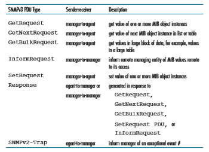
**Table 5.2**  ♦  SNMPv3 PDU types

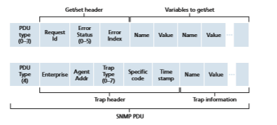
**Figure 5.21**  ♦  SNMP PDU format

MIB objects at the agent’s managed device. The MIB objects whose values are being requested are specified in the variable binding portion of the PDU. GetRequest, GetNextRequest, and GetBulkRequest differ in the granularity of their data requests. GetRequest can request an arbitrary set of MIB values; multiple GetNextRequests can be used to sequence through a list or table of MIB objects; GetBulkRequest allows a large block of data to be returned, avoiding the overhead incurred if multiple GetRequest or GetNextRequest messages were to be sent. In all three cases, the agent responds with a Response PDU containing the object identifiers and their associated values.

• The SetRequest PDU is used by a managing server to set the value of one or more MIB objects in a managed device. An agent replies with a Response PDU with the “noError” error status to confirm that the value has indeed been set.

• The InformRequest PDU is used by a managing server to notify another managing server of MIB information that is remote to the receiving server.

• The Response PDU is typically sent from a managed device to the managing server in response to a request message from that server, returning the requested information.

• The final type of SNMPv3 PDU is the trap message. Trap messages are gener- ated asynchronously; that is, they are not generated in response to a received request but rather in response to an event for which the managing server requires notification. RFC 3418 defines well-known trap types that include a cold or warm start by a device, a link going up or down, the loss of a neighbor, or an authentication failure event. A received trap request has no required response from a managing server.

Given the request-response nature of SNMP, it is worth noting here that although SNMP PDUs can be carried via many different transport protocols, the SNMP PDU is typically carried in the payload of a UDP datagram. Indeed, RFC 3417 states that UDP is “the preferred transport mapping.” However, since UDP is an unreli- able transport protocol, there is no guarantee that a request, or its response, will be received at the intended destination. The request ID field of the PDU (see Figure 5.21) is used by the managing server to number its requests to an agent; the agent’s response takes its request ID from that of the received request. Thus, the request ID field can be used by the managing server to detect lost requests or replies. It is up to the man- aging server to decide whether to retransmit a request if no corresponding response is received after a given amount of time. In particular, the SNMP standard does not mandate any particular procedure for retransmission, or even if retransmission is to be done in the first place. It only requires that the managing server “needs to act responsibly in respect to the frequency and duration of retransmissions.” This, of course, leads one to wonder how a “responsible” protocol should act!

SNMP has evolved through three versions. The designers of SNMPv3 have said that “SNMPv3 can be thought of as SNMPv2 with additional security and admin- istration capabilities” [RFC 3410]. Certainly, there are changes in SNMPv3 over SNMPv2, but nowhere are those changes more evident than in the area of administra- tion and security. The central role of security in SNMPv3 was particularly important, since the lack of adequate security resulted in SNMP being used primarily for moni- toring rather than control (for example, SetRequest is rarely used in SNMPv1). Once again, we see that security—a topic we’ll cover in detail in Chapter 8 — is of critical concern, but once again a concern whose importance had been realized per- haps a bit late and only then “added on.”

**The Management Information Base (MIB)**

We learned earlier that a managed device’s operational state data (and to some extent its configuration data) in the SNMP/MIB approach to network management are rep- resented as objects that are gathered together into an MIB for that device. An MIB object might be a counter, such as the number of IP datagrams discarded at a router due to errors in an IP datagram header; or the number of carrier sense errors in an Ethernet interface card; descriptive information such as the version of the software running on a DNS server; status information such as whether a particular device is functioning correctly; or protocol-specific information such as a routing path to a destination. Related MIB objects are gathered into MIB modules. There are over 400 MIB modules defined in various IETC RFC’s; there are many more device- and vendor-specific MIBs. [RFC 4293] specifies the MIB module that defines managed objects (including ipSystemStatsInDelivers) for managing implementations of the Internet Protocol (IP) and its associated Internet Control Message Protocol (ICMP). [RFC 4022] specifies the MIB module for TCP, and [RFC 4113] specifies the MIB module for UDP.While MIB-related RFCs make for rather tedious and dry reading, it is nonethe- less instructive (i.e., like eating vegetables, it is “good for you”) to consider an exam- ple of a MIB object, The ipSystem-StatsInDelivers object-type definition from [RFC 4293] defines a 32-bit read-only counter that keeps track of the number of IP datagrams that were received at the managed device and were successfully delivered to an upper-layer protocol. In the example below, Counter32 is one of the basic data types defined in the SMI.

ipSystemStatsInDelivers OBJECT-TYPE 
SYNTAX Counter32 
MAX-ACCESS read-only 
STATUS current 
DESCRIPTION
“The total number of datagrams successfully de- livered to IPuser-protocols (including ICMP).

When tracking interface statistics, the coun- ter of the interface to which these datagrams were addressed is incremented. This interface might not be the same as the input interface for some of the datagrams.

Discontinuities in the value of this counter can occur at re-initialization of the management system, and at other times as indicated by the value of ipSystemStatsDiscontinuityTime.”

::= { ipSystemStatsEntry 18 }

### The Network Configuration Protocol (NETCONF) and YANG
The NETCONF protocol operates between the managing server and the man- aged network devices, providing messaging to _(i)_ retrieve, set, and modify con- figuration data at managed devices; _(ii)_ to query operational data and statistics at managed devices; and _(iii)_ to subscribe to notifications generated by managed devices. The managing server actively controls a managed device by sending it configurations, which are specified in a structured XML document, and activat- ing a configuration at the managed device. NETCONF uses a remote procedure call (RPC) paradigm, where protocol messages are also encoded in XML and exchanged between the managing server and a managed device over a secure, connection-oriented session such as the TLS (Transport Layer Security) protocol (discussed in Chapter 8) over TCP.

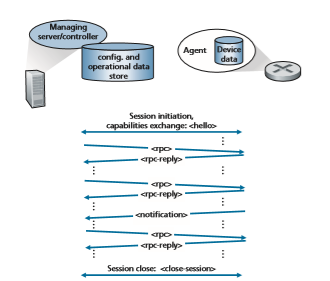
**Figure 5.22**  ♦   NETCONF session between managing server/controller and managed device

Figure 5.22 shows an example NETCONF session. First, the managing server establishes a secure connection to the managed device. (In NETCONF parlance, the managing server is actually referred to as the “client” and the managed device as the “server,” since the managing server establishes the connection to the managed device. But we’ll ignore that here for consistency with the longer-standing network- management server/client terminology shown in Figure 5.20.) Once a secure con- nection has been established, the managing server and the managed device exchange <hello> messages, declaring their “capabilities”—NETCONF functionality that sup- plements the base NETCONF specification in [RFC 6241]. Interactions between the managing server and managed device take the form of a remote procedure call, using the <rpc> and <rpc-response> messages. These messages are used to retrieve, set, query and modify device configurations, operational data and statistics, and to sub- scribe to device notifications. Device notifications themselves are proactively sent from managed device to the managing server using NETCONF <notification> mes- sages. A session is closed with the <session-close message>.

Table 5.3 shows a number of the important NETCONF operations that a man- aging server can perform at a managed device. As in the case of SNMP, we see operations for retrieving operational state data (<get>), and for event notification. However, the <get-config>, <edit-config>, <lock> and <unlock> operation demon- strate NETCONF’s particular emphasis on device configuration. Using the basic operations shown in Table 5.3, it is also possible to create a _set_ of more sophisticated network management transactions that either complete atomically (i.e., as a group) and successfully on a _set_ of devices, or are fully reversed and leave the devices in their pre-transaction state. Such multi-device transactions—“enabl[ing] operators to concentrate on the _configuration_ of the network as a whole rather than individual devices” was an important operator requirement put forth in [RFC 3535].

A full description of NETCONF is beyond our scope here; [RFC 6241, RFC 5277, Claise 2019; Schonwalder 2010] provide more in-depth coverage.

But since this is the first time we’ve seen protocol messages formatted as an XML document (rather than the traditional message with header fields and message body, e.g., as shown in Figure 5.21 for the SNMP PDU), let’s conclude our brief study of NETCONF with two examples.

In the first example, the XML document sent from the managing server to the managed device is a NETCONF <get> command requesting all device configuration

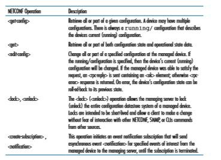
**Table 5.3**  ♦   Selected NETCONF operations

and operational data. With this command, the server can learn about the device’s configuration.

01 <?xml version=”1.0” encoding=”UTF-8”?> 02 <rpc message-id=”101” 03 xmlns=”urn:ietf:params:xml:ns:netconf:base:1.0”> 04 <get/> 05 </rpc>

Although few people can completely parse XML directly, we see that the NET- CONF command is relatively human-readable, and is much more reminiscent of HTTP and HTML than the protocol message formats that we saw for SNMP PDU format in Figure 5.21. The RPC message itself spans lines 02–05 (we have added line numbers here for pedagogical purposes). The RPC has a message ID value of 101, declared in line 02, and contains a single NETCONF <get> command. The reply from the device contains a matching ID number (101), and all of the device’s configuration data (in XML format, of course), starting in line 04, ultimately with a closing </rpc-reply>.
```
01 <?xml version=”1.0” encoding=”UTF-8”?> 
02 <rpc-reply message-id=”101” 
03 xmlns=”urn:ietf:params:xml:ns:netconf:base:1.0”>
04 <!-- . . . all configuration data returned... --> . . . </rpc-reply>
```
In the second example below, adapted from [RFC 6241], the XML document sent from the managing server to the managed device sets the Maximum Transmis- sion Unit (MTU) of an interface named “Ethernet0/0” to 1500 bytes:
```
01 <?xml version=”1.0” encoding=”UTF-8”?> 
02 <rpc message-id=”101” 
03 xmlns=”urn:ietf:params:xml:ns:netconf:base:1.0”> 
04 <edit-config> 
05 <target> 
06 <running/> 
07 </target> 
08 <config> 
09 <top xmlns=”http://example.com/schema/1.2/config”> 
10 <interface> 
11 <name>Ethernet0/0</name> 
12 <mtu>1500</mtu> 
13 </interface> 
14 </top> 
15 </config> 
16 </edit-config> 
17 </rpc>
```
The RPC message itself spans lines 02–17, has a message ID value of 101, and contains a single NETCONF <edit-config> command, spanning lines 04–15. Line 06 indicates that the running device configuration at the managed device will be changed. Lines 11 and 12 specify the MTU size to be set of the Ethernet0/0 interface.

Once the managed device has changed the interface’s MTU size in the configu- ration, it responds back to the managing server with an OK reply (line 04 below), again within an XML document:
```
01 <?xml version=”1.0” encoding=”UTF-8”?> 
02 <rpc-reply message-id=”101” 
03 xmlns=”urn:ietf:params:xml:ns:netconf:base:1.0”> 
04 <ok/> 
05 </rpc-reply>
```
**YANG**

YANG is the data modeling language used to precisely specify the structure, syntax, and semantics of network management data used by NETCONF, in much the same way that the SMI is used to specify MIBs in SNMP. All YANG definitions are con- tained in modules, and an XML document describing a device and its capabilities can be generated from a YANG module.

YANG features a small set of built-in data types (as in the case of SMI) and also allows data modelers to express constraints that must be satisfied by a valid NET- CONF configuration—a powerful aid in helping ensure that NETCONF configura- tions satisfy specified correctness and consistency constraints. YANG is also used to specify NETCONF notifications.

A fuller discussion of YANG is beyond our scope here. For more information, we refer the interested reader to the excellent book [Claise 2019].

## Summary
We have now completed our two-chapter journey into the network core—a journey that began with our study of the network layer’s data plane in Chapter 4 and finished here with our study of the network layer’s control plane. We learned that the control plane is the network-wide logic that controls not only how a datagram is forwarded among routers along an end-to-end path from the source host to the destination host, but also how network-layer components and services are configured and managed.

We learned that there are two broad approaches towards building a control plane: traditional _per-router control_ (where a routing algorithm runs in each and every router and the routing component in the router communicates with the routing components in other routers) and _software-defined networking_ (SDN) control (where a logically cen- tralized controller computes and distributes the forwarding tables to be used by each and every router). We studied two fundamental routing algorithms for computing least cost paths in a graph—link-state routing and distance-vector routing—in Section 5.2;
HOmEWORK PROBLEms ANd QuEsTIONs 

these algorithms find application in both per-router control and in SDN control. These algorithms are the basis for two widely deployed Internet routing protocols, OSPF and BGP, that we covered in Sections 5.3 and 5.4. We covered the SDN approach to the network-layer control plane in Section 5.5, investigating SDN network-control appli- cations, the SDN controller, and the OpenFlow protocol for communicating between the controller and SDN-controlled devices. In Sections 5.6 and 5.7, we covered some of the nuts and bolts of managing an IP network: ICMP (the Internet Control Message Protocol) and network management using SNMP and NETCONF/YANG.

Having completed our study of the network layer, our journey now takes us one step further down the protocol stack, namely, to the link layer. Like the network layer, the link layer is part of each and every network-connected device. But we will see in the next chapter that the link layer has the much more localized task of moving packets between nodes on the same link or LAN. Although this task may appear on the surface to be rather simple compared with that of the network layer’s tasks, we will see that the link layer involves a number of important and fascinating issues that can keep us busy for a long time.

**Homework Problems and Questions**

**Chapter 5 Review Questions**
 Section 5.1 
 R1. What is meant by a control plane that is based on per-router control? In such cases, when we say the network control and data planes are implemented “monolithically,” what do we mean?

R2. What is meant by a control plane that is based on logically centralized control? In such cases, are the data plane and the control plane implemented within the same device or in separate devices? Explain. 

Section 5.2 

R3. Compare and contrast the properties of a centralized and a distributed routing
algorithm. Give an example of a routing protocol that takes a centralized and a decentralized approach.

R4. Compare and contrast static and dynamic routing algorithms.

R5. What is the “count to infinity” problem in distance vector routing?

R6. How is a least cost path calculated in a decentralized routing algorithm?

Sections 5.3–5.4 

R7. Why are different inter-AS and intra-AS protocols used in the Internet?

R8. True or false: When an OSPF route sends its link state information, it is sent only to those nodes directly attached neighbors. Explain.

R9. What is meant by an _area_ in an OSPF autonomous system? Why was the concept of an area introduced?

R10. Define and contrast the following terms: _subnet, prefix_, and _BGP route_.

R11. How does BGP use the NEXT-HOP attribute? How does it use the AS-PATH attribute?

R12. Describe how a network administrator of an upper-tier ISP can implement policy when configuring BGP.

R13. True or false: When a BGP router receives an advertised path from its neigh- bor, it must add its own identity to the received path and then send that new path on to all of its neighbors. Explain.

Section 5.5 

R14. Describe the main role of the communication layer, the network-wide state-management layer, and the network-control application layer in an SDN controller.

R15. Suppose you wanted to implement a new routing protocol in the SDN control plane. At which layer would you implement that protocol? Explain.

R16. What types of messages flow across an SDN controller’s northbound and southbound APIs? Who is the recipient of these messages sent from the controller across the southbound interface, and who sends messages to the controller across the northbound interface?

R17. Describe the purpose of two types of OpenFlow messages (of your choosing) that are sent from a controlled device to the controller. Describe the purpose of two types of Openflow messages (of your choosing) that are send from the controller to a controlled device.

R18. What is the purpose of the service abstraction layer in the OpenDaylight SDN controller?

Sections 5.6–5.7 

R19. Names four different types of ICMP messages

R20. What two types of ICMP messages are received at the sending host executing the _Traceroute_ program?

R21. Define the following terms in the context of SNMP: _managing server, managed device, network management agent and MIB._

R22. What are the purposes of the SNMP _GetRequest_ and _SetRequest_ messages?

R23. What is the purpose of the SNMP trap message?
PROBLEms 

**Problems**

P1. Consider the figure below.
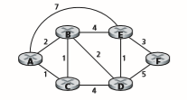
Enumerate all paths from _A_ to _D_ that do not contain any loops

P2. Repeat Problem P1 for paths from _C_ to _D_, _B_ to _F_, and _C_ to _F_.

P3. Consider the following network. With the indicated link costs, use Dijkstra’s shortest-path algorithm to compute the shortest path from _x_ to all network nodes. Show how the algorithm works by computing a table similar to Table 5.1.
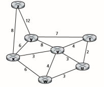
 p4. Consider the network shown in Problem P3. Using Dijkstra’s algorithm, and showing your work using a table similar to Table 5.1, do the following:

a. Compute the shortest path from _t_ to all network nodes.

b. Compute the shortest path from _u_ to all network nodes.

c. Compute the shortest path from _v_ to all network nodes.

d. Compute the shortest path from _w_ to all network nodes.

e. Compute the shortest path from _y_ to all network nodes.

f. Compute the shortest path from _z_ to all network nodes.

P5. Consider the network shown below. Assume that each node initially knows the costs to each of its neighbors. Consider the distance-vector algorithm and show the distance table entries at node _z_.
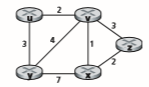
P6. Consider a general topology (that is, not the specific network shown above) and a synchronous version of the distance-vector algorithm. Suppose that at each itera- tion, a node exchanges its distance vectors with its neighbors and receives their distance vectors. Assuming that the algorithm begins with each node knowing only the costs to its immediate neighbors, what is the maximum number of itera- tions required before the distributed algorithm converges? Justify your answer.

P7. Consider the network fragment shown below. _x_ has only two attached neighbors, _w_ and _y_. _w_ has a minimum-cost path to destination _u_ (illustrated with the dotted line through the remaining network) of 9, and _y_ has a mini- mum-cost path to _u_ of 11. The complete paths from _w_ and _y_ to _u_ (and between _w_ and _y_) are pictured with dotted lines, as they are irrelevant to the solution.
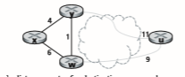
a. Give _x_’s distance vector for destinations _w_, _y_, and _u_.

b. Give a link-cost change for either _c_(_x_,_w_) or _c_(_x_,_y_) such that _x_ will inform its neighbors of a new minimum-cost path to _u_ as a result of executing the distance-vector algorithm.

c. Give a link-cost change for either _c_(_x_,w) or _c_(_x_,_y_) such that _x_ will _not_ inform its neighbors of a new minimum-cost path to _u_ as a result of executing the distance-vector algorithm.

P8. Consider the three-node topology shown in Figure 5.6. Rather than having the link costs shown in Figure 5.6, the link costs are _c_(_x,y_) = 3, _c_(_y,z_) = 6, _c_(_z,x_) = 4. Compute the distance tables after the initialization step and after each iteration of a synchronous version of the distance-vector algorithm (as we did in our earlier discussion of Figure 5.6).

P9. Can the _poisoned reverse_ solve the general count-to-infinity problem? Justify your answer.
PROBLEms 

P10. Argue that for the distance-vector algorithm in Figure 5.6, each value in the distance vector _D_(_x_) is non-increasing and will eventually stabilize in a finite number of steps.

P11. Consider Figure 5.7. Suppose there is another router _w_, connected to router _y_ and _z_. The costs of all links are given as follows: _c_(_x,y_) = 4, _c_(_x,z_) = 50, _c_(_y,w_) = 1, _c_(_z,w_) = 1, _c_(_y,z_) = 3. Suppose that poisoned reverse is used in the distance-vector routing algorithm.

a. When the distance vector routing is stabilized, router _w_, _y_, and _z_ inform their distances to _x_ to each other. What distance values do they tell each other?

b. Now suppose that the link cost between _x_ and _y_ increases to 60. Will there be a count-to-infinity problem even if poisoned reverse is used? Why or why not? If there is a count-to-infinity problem, then how many iterations are needed for the distance-vector routing to reach a stable state again? Justify your answer.

c. How do you modify _c_(_y,z_) such that there is no count-to-infinity problem at all if _c_(_y,x_) changes from 4 to 60?

P12. What is the message complexity of LS routing algorithm?

P13. Will a BGP router always choose the loop-free route with the shortest ASpath length? Justify your answer.

P14. Consider the network shown below. Suppose AS3 and AS2 are running OSPF for their intra-AS routing protocol. Suppose AS1 and AS4 are running RIP for their intra-AS routing protocol. Suppose eBGP and iBGP are used for the inter-AS routing protocol. Initially suppose there is _no_ physical link between AS2 and AS4.

a. Router 3c learns about prefix _x_ from which routing protocol: OSPF, RIP, eBGP, or iBGP?

b. Router 3a learns about _x_ from which routing protocol?

c. Router 1c learns about _x_ from which routing protocol?

d. Router 1d learns about _x_ from which routing protocol?
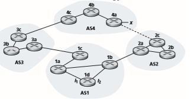
P15. Referring to the previous problem, once router 1d learns about _x_ it will put an entry (_x_, _I_) in its forwarding table.

a. Will _I_ be equal to _I_1 or _I_2 for this entry? Explain why in one sentence.

b. Now suppose that there is a physical link between AS2 and AS4, shown by the dotted line. Suppose router 1d learns that _x_ is accessible via AS2 as well as via AS3. Will _I_ be set to _I_1 or _I_2? Explain why in one sentence.

c. Now suppose there is another AS, called AS5, which lies on the path between AS2 and AS4 (not shown in diagram). Suppose router 1d learns that _x_ is accessible via AS2 AS5 AS4 as well as via AS3 AS4. Will _I_ be set to _I_1 or _I_2? Explain why in one sentence.

P16. Consider the following network. ISP B provides national backbone service to regional ISP A. ISP C provides national backbone service to regional ISP D. Each ISP consists of one AS. B and C peer with each other in two places using BGP. Consider traffic going from A to D. B would prefer to hand that traffic over to C on the West Coast (so that C would have to absorb the cost of carrying the traffic cross-country), while C would prefer to get the traffic via its East Coast peering point with B (so that B would have carried the traffic across the country). What BGP mechanism might C use, so that B would hand over A-to-D traffic at its East Coast peering point? To answer this question, you will need to dig into the BGP specification.
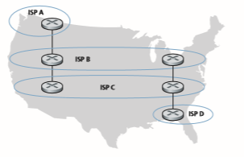

P17. In Figure 5.13, consider the path information that reaches stub networks W, X, and Y. Based on the information available at W and X, what are their respective views of the network topology? Justify your answer. The topology view at Y is shown below.
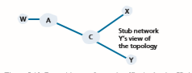
P18. Consider Figure 5.13. B would never forward traffic destined to Y via X based on BGP routing. But there are some very popular applications for which data packets go to X first and then flow to Y. Identify one such application, and describe how data packets follow a path not given by BGP routing.

P19. In Figure 5.13, suppose that there is another stub network V that is a cus- tomer of ISP A. Suppose that B and C have a peering relationship, and A is a customer of both B and C. Suppose that A would like to have the traffic destined to W to come from B only, and the traffic destined to V from either B or C. How should A advertise its routes to B and C? What AS routes does C receive?

P20. Suppose ASs X and Z are not directly connected but instead are connected by AS Y. Further suppose that X has a peering agreement with Y, and that Y has a peering agreement with Z. Finally, suppose that Z wants to transit all of Y’s traffic but does not want to transit X’s traffic. Does BGP allow Z to implement this policy?

P21. Consider the two ways in which communication occurs between a managing entity and a managed device: request-response mode and trapping. What are the pros and cons of these two approaches, in terms of (1) overhead, (2) noti- fication time when exceptional events occur, and (3) robustness with respect to lost messages between the managing entity and the device?

P22. In Section 5.7, we saw that it was preferable to transport SNMP messages in unreliable UDP datagrams. Why do you think the designers of SNMP chose UDP rather than TCP as the transport protocol of choice for SNMP?

**Socket Programming Assignment 5: ICMP Ping**

At the end of Chapter 2, there are four socket programming assignments. Here you will find a fifth assignment which employs ICMP, a protocol discussed in this chapter.Ping is a popular networking application used to test from a remote location whether a particular host is up and reachable. It is also often used to measure latency between the client host and the target host. It works by sending ICMP “echo request” packets (i.e., ping packets) to the target host and listening for ICMP “echo response” replies (i.e., pong packets). Ping measures the RRT, records packet loss, and calcu- lates a statistical summary of multiple ping-pong exchanges (the minimum, mean, max, and standard deviation of the round-trip times).

In this lab, you will write your own Ping application in Python. Your appli- cation will use ICMP. But in order to keep your program simple, you will not exactly follow the official specification in RFC 1739. Note that you will only need to write the client side of the program, as the functionality needed on the server side is built into almost all operating systems. You can find full details of this assignment, as well as important snippets of the Python code, at the Web site http://www.pearsonglobaleditions.com.

**Programming Assignment: Routing**

In this programming assignment, you will be writing a “distributed” set of proce- dures that implements a distributed asynchronous distance-vector routing for the network shown below.

You are to write the following routines that will “execute” asynchronously within the emulated environment provided for this assignment. For node 0, you will write the routines:

• _rtinit0()_. This routine will be called once at the beginning of the emulation. _rtinit0()_ has no arguments. It should initialize your distance table in node 0 to reflect the direct costs of 1, 3, and 7 to nodes 1, 2, and 3, respectively. In the figure above, all links are bidirectional and the costs in both directions are identi- cal. After initializing the distance table and any other data structures needed by your node 0 routines, it should then send its directly connected neighbors (in this case, 1, 2, and 3) the cost of its minimum-cost paths to all other network nodes.
WIREsHARK LAB: ICmP 

This minimum-cost information is sent to neighboring nodes in a routing update packet by calling the routine _tolayer2(),_ as described in the full assignment. The format of the routing update packet is also described in the full assignment.

• _rtupdate0(struct rtpkt \*rcvdpkt)_. This routine will be called when node 0 receives a routing packet that was sent to it by one of its directly connected neighbors. The parameter _\*rcvdpkt_ is a pointer to the packet that was received. _rtupdate0()_ is the “heart” of the distance-vector algorithm. The values it receives in a routing update packet from some other node _i_ contain _i’_s current shortest-path costs to all other network nodes. _rtupdate0()_ uses these received values to update its own distance table (as specified by the distance-vector algorithm). If its own minimum cost to another node changes as a result of the update, node 0 informs its directly connected neighbors of this change in minimum cost by sending them a rout- ing packet. Recall that in the distance-vector algorithm, only directly connected nodes will exchange routing packets. Thus, nodes 1 and 2 will communicate with each other, but nodes 1 and 3 will not communicate with each other.

Similar routines are defined for nodes 1, 2, and 3. Thus, you will write eight pro- cedures in all: _rtinit0(), rtinit1(), rtinit2(), rtinit3(), rtupdate0(), rtupdate1(), rtup- date2(),_ and _rtupdate3()._ These routines will together implement a distributed, asynchronous computation of the distance tables for the topology and costs shown in the figure on the preceding page.

You can find the full details of the programming assignment, as well as C code that you will need to create the simulated hardware/software environment, at http:// www.pearsonglobaleditions.com. A Java version of the assignment is also available.

**Wireshark Lab: ICMP**

In the Web site for this textbook, www.pearsonglobaleditions.com, you’ll find a Wireshark lab assignment that examines the use of the ICMP protocol in the ping and traceroute commands.Please describe one or two of the most exciting projects you have worked on during your career. What were the biggest challenges? When I was a researcher at AT&T, a group of us designed a new way to manage rout- ing in Internet Service Provider backbone networks. Traditionally, network operators configure each router individually, and these routers run distributed protocols to compute paths through the network. We believed that network management would be simpler and more flexible if network operators could exercise direct control over how routers forward traffic based on a network-wide view of the topology and traffic. The Routing Control Platform (RCP) we designed and built could compute the routes for all of AT&T’s

Jennifer Rexford is a Professor in the Computer Science department at Princeton University. Her research has the broad goal of making computer networks easier to design and manage, with particular emphasis on programmable neworks. From 1996–2004, she was a member of the Network Management and Performance department at AT&T Labs–Research. While at AT&T, she designed techniques and tools for network measurement, traffic engineering, and router configuration that were deployed in AT&T’s backbone network. Jennifer is co-author of the book “Web Protocols and Practice: Networking Protocols, Caching, and Traffic Measurement,” published by Addison-Wesley in May 2001. She served as the chair of ACM SIGCOMM from 2003 to 2007. She received her BSE degree in electrical engineering from Princeton University in 1991, and her PhD degree in electrical engineering and computer science from the University of Michigan in 1996. Jennifer was the 2004 winner of ACM’s Grace Murray Hopper Award for outstand- ing young computer professional, the ACM Athena Lecturer Award (2016), the NCWIT Harrold and Notkin Research and Graduate Mentoring Award (2017), the ACM SIGCOMM award for lifetime contributions (2018), and the IEEE Internet Award (2019). She is an ACM Fellow (2008), an IEEE Fellow (2018), and the National Academy of Engineering (2014).

Jennifer Rexford

**AN INTERVIEW WITH…**


rdbackbone on a single commodity computer, and could control legacy routers without modification. To me, this project was exciting because we had a provocative idea, a working system, and ultimately a real deployment in an operational network. Fast forward a few years, and software-defined networking (SDN) has become a mainstream technology, and standard protocols like standard protocols (like OpenFlow) and languages (like P4) have made it much easier to tell the underlying switches what to do.

How do you think software-defined networking should evolve in the future? In a major break from the past, the software controlling network devices can be created by many different programmers, not just at companies selling network equipment. Yet, unlike the applications running on a server or a smart phone, SDN applications must work together to handle the same traffic. Network operators do not want to perform load balancing on some traffic and routing on other traffic; instead, they want to perform load balancing and routing, together, on the same traffic. Future SDN platforms should offer good program- ming abstractions for composing independently written multiple applications together. More broadly, good programming abstractions can make it easier to create applications, without having to worry about low-level details like flow table entries, traffic counters, bit patterns in packet headers, and so on. Also, while an SDN controller is logically centralized, the network still consists of a distributed collection of devices. Future programmable networks should offer good abstractions for updating a distributed set of devices, so network admin- istrators can reason about what happens to packets in flight while the devices are updated. Programming abstractions for programmable network is an exciting area for interdisciplinary research between computer networking, distributed systems, and programming languages, with a real chance for practical impact in the years ahead.

Where do you see the future of networking and the Internet? Networking is an exciting field because the applications and the underlying technologies change all the time. We are always reinventing ourselves! Who would have predicted even ten years ago the dominance of smart phones, allowing mobile users to access existing applications as well as new location-based services? The emergence of cloud computing is fundamentally changing the relationship between users and the applications they run, and networked sensors and actuators (the “Internet of Things”) are enabling a wealth of new applications (and security vulnerabilities!). The pace of innovation is truly inspiring.

The underlying network is a crucial component in all of these innovations. Yet, the network is notoriously “in the way”—limiting performance, compromising reliability, con- straining applications, and complicating the deployment and management of services. We should strive to make the network of the future as invisible as the air we breathe, so it never stands in the way of new ideas and valuable services. To do this, we need to raise the level of abstraction above individual network devices and protocols (and their attendant acro- nyms!), so we can reason about the network and the user’s high-level goals as a whole.What people inspired you professionally? I’ve long been inspired by Sally Floyd who worked for many years at the International Computer Science Institute. Her research was always purposeful, focusing on the important challenges facing the Internet. She dug deeply into hard questions until she understood the problem and the space of solutions completely, and she devoted serious energy into “mak- ing things happen,” such as pushing her ideas into protocol standards and network equip- ment. Also, she gave back to the community, through professional service in numerous standards and research organizations and by creating tools (such as the widely used ns-2 and ns-3 simulators) that enable other researchers to succeed. She retired in 2009, and passed away in 2019, but her influence on the field will be felt for years to come.

What are your recommendations for students who want careers in computer science and networking? Networking is an inherently interdisciplinary field. Applying techniques from other disci- pline’s breakthroughs in networking come from such diverse areas as queuing theory, game theory, control theory, distributed systems, network optimization, programming languages, machine learning, algorithms, data structures, and so on. I think that becoming conversant in a related field, or collaborating closely with experts in those fields, is a wonderful way to put networking on a stronger foundation, so we can learn how to build networks that are worthy of society’s trust. Beyond the theoretical disciplines, networking is exciting because we create real artifacts that real people use. Mastering how to design and build systems—by gaining experience in operating systems, computer architecture, and so on—is another fan- tastic way to amplify your knowledge of networking to help make the world a better place.

