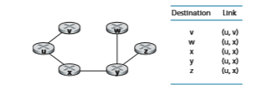
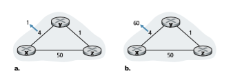

## Routing Algorithms
In this Section, we’ll study **routing algorithms**, whose goal is to determine good paths (equivalently, routes), from senders to receivers, through the network of routers. Typically, a “good” path is one that has the least cost. We’ll see that in practice, however, real-world concerns such as policy issues (for example, a rule such as “router _x_, belonging to organization _Y_, should not forward any packets originating from the network owned by organization _Z_ ”) also come into play. We note that whether the network control plane adopts a per-router control approach or a logically centralized approach, there must always be a well-defined sequence of routers that a packet will cross in traveling from sending to receiving host. Thus, the routing algorithms that compute these paths are of fundamental importance, and another candidate for our top-10 list of fundamentally important networking concepts.

A graph is used to formulate routing problems. Recall that a **graph** _G_ \= (_N_, _E_) is a set _N_ of nodes and a collection _E_ of edges, where each edge is a pair of nodes from _N_. In the context of network-layer routing, the nodes in the graph represent

**Figure 5.3**  ♦  Abstract graph model of a computer network

routers—the points at which packet-forwarding decisions are made—and the edges connecting these nodes represent the physical links between these routers. Such a graph abstraction of a computer network is shown in Figure 5.3. When we study the BGP inter-domain routing protocol, we’ll see that nodes represent networks, and the edge connecting two such nodes represents direction connectivity (know as peering) between the two networks. To view some graphs representing real network maps, see [CAIDA 2020]; for a discussion of how well different graph-based models model the Internet, see [Zegura 1997, Faloutsos 1999, Li 2004].

As shown in Figure 5.3, an edge also has a value representing its cost. Typically, an edge’s cost may reflect the physical length of the corresponding link (for example, a transoceanic link might have a higher cost than a short-haul terrestrial link), the link speed, or the monetary cost associated with a link. For our purposes, we’ll simply take the edge costs as a given and won’t worry about how they are determined. For any edge (_x_, _y_) in _E_, we denote _c_(_x_, _y_) as the cost of the edge between nodes _x_ and _y._ If the pair (_x_, _y_) does not belong to _E_, we set _c_(_x_, _y_) = ∞ . Also, we’ll only consider undirected graphs (i.e., graphs whose edges do not have a direction) in our discussion here, so that edge (_x_, _y_) is the same as edge (_y_, _x_) and that _c_(_x_, _y_) = _c_(_y_, _x_); however, the algorithms we’ll study can be easily extended to the case of directed links with a different cost in each direction. Also, a node _y_ is said to be a **neighbor** of node _x_ if (_x_, _y_) belongs to _E_.

Given that costs are assigned to the various edges in the graph abstraction, a natural goal of a routing algorithm is to identify the least costly paths between sources and destinations. To make this problem more precise, recall that a **path** in a graph _G_ \= (_N_, _E_) is a sequence of nodes (_x_1, _x_2, g, _xp_) such that each of the pairs (_x_1, _x_2), (_x_2, _x_3), g, (_xp_\-1, _xp_) are edges in _E_. The cost of a path (_x_1, _x_2, g, _xp_) is simply the sum of all the edge costs along the path, that is,
_c_(_x_1, _x_2) + _c_(_x_2, _x_3) + g+ _c_(_xp_\-1, _xp_). Given any two nodes _x_ and _y_, there are typi- cally many paths between the two nodes, with each path having a cost. One or more of these paths is a **least-cost path**. The least-cost problem is therefore clear: Find a path between the source and destination that has least cost. In Figure 5.3, for exam- ple, the least-cost path between source node _u_ and destination node _w_ is (_u_, _x_, _y_, _w_) with a path cost of 3. Note that if all edges in the graph have the same cost, the least- cost path is also the **shortest path** (that is, the path with the smallest number of links between the source and the destination).

As a simple exercise, try finding the least-cost path from node _u_ to _z_ in Figure 5.3 and reflect for a moment on how you calculated that path. If you are like most people, you found the path from _u_ to _z_ by examining Figure 5.3, tracing a few routes from _u_ to _z_, and somehow convincing yourself that the path you had chosen had the least cost among all possible paths. (Did you check all of the 17 pos- sible paths between _u_ and _z_? Probably not!) Such a calculation is an example of a centralized routing algorithm—the routing algorithm was run in one location, your brain, with complete information about the network. Broadly, one way in which we can classify routing algorithms is according to whether they are centralized or decentralized.

• A **centralized routing algorithm** computes the least-cost path between a source and destination using complete, global knowledge about the network. That is, the algorithm takes the connectivity between all nodes and all link costs as inputs. This then requires that the algorithm somehow obtain this information before actually performing the calculation. The calculation itself can be run at one site (e.g., a logically centralized controller as in Figure 5.2) or could be replicated in the routing component of each and every router (e.g., as in Figure 5.1). The key distinguishing feature here, however, is that the algorithm has complete informa- tion about connectivity and link costs. Algorithms with global state information are often referred to as **link-state (LS) algorithms**, since the algorithm must be aware of the cost of each link in the network. We’ll study LS algorithms in Section 5.2.1.

• In a **decentralized routing algorithm**, the calculation of the least-cost path is carried out in an iterative, distributed manner by the routers. No node has com- plete information about the costs of all network links. Instead, each node begins with only the knowledge of the costs of its own directly attached links. Then, through an iterative process of calculation and exchange of information with its neighboring nodes, a node gradually calculates the least-cost path to a destination or set of destinations. The decentralized routing algorithm we’ll study below in Section 5.2.2 is called a distance-vector (DV) algorithm, because each node main- tains a vector of estimates of the costs (distances) to all other nodes in the net- work. Such decentralized algorithms, with interactive message exchange betweenneighboring routers is perhaps more naturally suited to control planes where the routers interact directly with each other, as in Figure 5.1.

A second broad way to classify routing algorithms is according to whether they are static or dynamic. In **static routing algorithms**, routes change very slowly over time, often as a result of human intervention (for example, a human manually editing a link costs). **Dynamic routing algorithms** change the routing paths as the network traffic loads or topology change. A dynamic algorithm can be run either periodically or in direct response to topology or link cost changes. While dynamic algorithms are more responsive to network changes, they are also more susceptible to problems such as routing loops and route oscillation.

A third way to classify routing algorithms is according to whether they are load- sensitive or load-insensitive. In a **load-sensitive algorithm**, link costs vary dynami- cally to reflect the current level of congestion in the underlying link. If a high cost is associated with a link that is currently congested, a routing algorithm will tend to choose routes around such a congested link. While early ARPAnet routing algo- rithms were load-sensitive [McQuillan 1980], a number of difficulties were encoun- tered [Huitema 1998]. Today’s Internet routing algorithms (such as RIP, OSPF, and BGP) are **load-insensitive**, as a link’s cost does not explicitly reflect its current (or recent past) level of congestion.

### The Link-State (LS) Routing Algorithm
Recall that in a link-state algorithm, the network topology and all link costs are known, that is, available as input to the LS algorithm. In practice, this is accom- plished by having each node broadcast link-state packets to _all_ other nodes in the network, with each link-state packet containing the identities and costs of its attached links. In practice (for example, with the Internet’s OSPF routing protocol, discussed in Section 5.3), this is often accomplished by a **link-state broadcast algorithm [Perlman 1999]. The result of the nodes’ broadcast is that all nodes have an identical and complete view of the network. Each node can then run the LS algorithm and compute the same set of least-cost paths as every other node.

The link-state routing algorithm we present below is known as _Dijkstra’s algorithm_, named after its inventor. A closely related algorithm is Prim’s algo- rithm; see [Cormen 2001] for a general discussion of graph algorithms. Dijkstra’s algorithm computes the least-cost path from one node (the source, which we will refer to as _u_) to all other nodes in the network. Dijkstra’s algorithm is iterative and has the property that after the _k_th iteration of the algorithm, the least-cost paths are known to _k_ destination nodes, and among the least-cost paths to all destinationnodes, these _k_ paths will have the _k_ smallest costs. Let us define the following notation:

• _D_(_v_): cost of the least-cost path from the source node to destination _v_ as of this iteration of the algorithm.

• _p_(_v_): previous node (neighbor of _v_) along the current least-cost path from the source to _v._

• _N_′: subset of nodes; _v_ is in _N_′ if the least-cost path from the source to _v_ is defini- tively known.

The centralized routing algorithm consists of an initialization step followed by a loop. The number of times the loop is executed is equal to the number of nodes in the network. Upon termination, the algorithm will have calculated the shortest paths from the source node _u_ to every other node in the network.

**Link-State (LS) Algorithm for Source Node** _u_

1 **Initialization:** 
2 N’ = {u} 
3 for all nodes v 
4 if v is a neighbor of u 
5 then D(v) = c(u,v) 
6 else D(v) = ∞  
7
8**Loop** 
9 find w not in N’ such that D(w) is a minimum 
10 add w to N’ 
11 update D(v) for each neighbor v of w and not in N’: 
12 D(v) = min(D(v), D(w)+ c(w,v) ) 
13 /\* new cost to v is either old cost to v or known 
14 least path cost to w plus cost from w to v \*/ 
15 **until

 N’= N

As an example, let’s consider the network in Figure 5.3 and compute the least- cost paths from _u_ to all possible destinations. A tabular summary of the algorithm’s computation is shown in Table 5.1, where each line in the table gives the values of the algorithm’s variables at the end of the iteration. Let’s consider the few first steps in detail.

• In the initialization step, the currently known least-cost paths from _u_ to its directly attached neighbors, _v, x_, and _w_, are initialized to 2, 1, and 5, respectively. Note in

**Table 5.1**  ♦  Running the link-state algorithm on the network in Figure 5.3

particular that the cost to _w_ is set to 5 (even though we will soon see that a lesser-cost path does indeed exist) since this is the cost of the direct (one hop) link from _u_ to _w._ The costs to _y_ and _z_ are set to infinity because they are not directly connected to _u._

• In the first iteration, we look among those nodes not yet added to the set _N_′ and find that node with the least cost as of the end of the previous iteration. That node is _x_, with a cost of 1, and thus _x_ is added to the set _N_′. Line 12 of the LS algorithm is then performed to update _D_(_v_) for all nodes _v_, yielding the results shown in the second line (Step 1) in Table 5.1. The cost of the path to _v_ is unchanged. The cost of the path to _w_ (which was 5 at the end of the initialization) through node _x_ is found to have a cost of 4. Hence this lower-cost path is selected and _w_’s predeces- sor along the shortest path from _u_ is set to _x_. Similarly, the cost to _y_ (through _x_) is computed to be 2, and the table is updated accordingly.

• In the second iteration, nodes _v_ and _y_ are found to have the least-cost paths (2), and we break the tie arbitrarily and add _y_ to the set _N_′ so that _N_′ now contains _u, x_, and _y._ The cost to the remaining nodes not yet in _N_′, that is, nodes _v, w_, and _z_, are updated via line 12 of the LS algorithm, yielding the results shown in the third row in Table 5.1.

• And so on . . .

When the LS algorithm terminates, we have, for each node, its predecessor along the least-cost path from the source node. For each predecessor, we also have _its_ predecessor, and so in this manner we can construct the entire path from the source to all destinations. The forwarding table in a node, say node _u_, can then be constructed from this information by storing, for each destination, the next-hop node on the least- cost path from _u_ to the destination. Figure 5.4 shows the resulting least-cost paths and forwarding table in _u_ for the network in Figure 5.3.

**Figure 5.4**  ♦  Least cost path and forwarding table for node u

What is the computational complexity of this algorithm? That is, given _n_ nodes (not counting the source), how much computation must be done in the worst case to find the least-cost paths from the source to all destinations? In the first iteration, we need to search through all _n_ nodes to determine the node, _w_, not in _N_′ that has the minimum cost. In the second iteration, we need to check _n_ \- 1 nodes to determine the minimum cost; in the third iteration _n_ \- 2 nodes, and so on. Overall, the total number of nodes we need to search through over all the iterations is _n_(_n_ \+ 1)/2, and thus we say that the preceding implementation of the LS algorithm has worst-case complexity of order _n_ squared: _O_(_n_2). (A more sophisticated implementation of this algorithm, using a data structure known as a heap, can find the minimum in line 9 in logarithmic rather than linear time, thus reducing the complexity.)

Before completing our discussion of the LS algorithm, let us consider a pathol- ogy that can arise. Figure 5.5 shows a simple network topology where link costs are equal to the load carried on the link, for example, reflecting the delay that would be experienced. In this example, link costs are not symmetric; that is, _c_(_u,v_) equals _c_(_v,u_) only if the load carried on both directions on the link (_u,v_) is the same. In this example, node _z_ originates a unit of traffic destined for _w_, node _x_ also originates a unit of traffic destined for _w_, and node _y_ injects an amount of traffic equal to _e_, also destined for _w_. The initial routing is shown in Figure 5.5(a) with the link costs cor- responding to the amount of traffic carried.

When the LS algorithm is next run, node _y_ determines (based on the link costs shown in Figure 5.5(a)) that the clockwise path to _w_ has a cost of 1, while the coun- terclockwise path to _w_ (which it had been using) has a cost of 1 + _e_. Hence _y’_s least- cost path to _w_ is now clockwise. Similarly, _x_ determines that its new least-cost path to _w_ is also clockwise, resulting in costs shown in Figure 5.5(b). When the LS algorithm is run next, nodes _x, y_, and _z_ all detect a zero-cost path to _w_ in the counterclockwise direction, and all route their traffic to the counterclockwise routes. The next time the LS algorithm is run, _x, y_, and _z_ all then route their traffic to the clockwise routes.

What can be done to prevent such oscillations (which can occur in any algo- rithm, not just an LS algorithm, that uses a congestion or delay-based link metric)? One solution would be to mandate that link costs not depend on the amount of traffic 

**Figure 5.5**  ♦  Oscillations with congestion-sensitive routing

carried—an unacceptable solution since one goal of routing is to avoid highly con- gested (for example, high-delay) links. Another solution is to ensure that not all rout- ers run the LS algorithm at the same time. This seems a more reasonable solution, since we would hope that even if routers ran the LS algorithm with the same perio- dicity, the execution instance of the algorithm would not be the same at each node. Interestingly, researchers have found that routers in the Internet can self-synchronize among themselves [Floyd Synchronization 1994]. That is, even though they initially execute the algorithm with the same period but at different instants of time, the algo- rithm execution instance can eventually become, and remain, synchronized at the routers. One way to avoid such self-synchronization is for each router to randomize the time it sends out a link advertisement.

Having studied the LS algorithm, let’s consider the other major routing algo- rithm that is used in practice today—the distance-vector routing algorithm.

### The Distance-Vector (DV) Routing Algorithm

Whereas the LS algorithm is an algorithm using global information, the **distance- vector (DV)
 algorithm is iterative, asynchronous, and distributed. It is _distributed_ in that each node receives some information from one or more of its _directly attached_ neighbors, performs a calculation, and then distributes the results of its calculation back to its neighbors. It is _iterative_ in that this process continues on until no more information is exchanged between neighbors. (Interestingly, the algorithm is also self-terminating—there is no signal that the computation should stop; it just stops.) The algorithm is _asynchronous_ in that it does not require all of the nodes to operate in lockstep with each other. We’ll see that an asynchronous, iterative, self-terminating, distributed algorithm is much more interesting and fun than a centralized algorithm!

Before we present the DV algorithm, it will prove beneficial to discuss an impor- tant relationship that exists among the costs of the least-cost paths. Let _dx_(_y_) be the cost of the least-cost path from node _x_ to node _y_. Then the least costs are related by the celebrated Bellman-Ford equation, namely,

        dx(y) = minv5c(x, v) + dv( y)6,

where the _minv_ in the equation is taken over all of _x_’s neighbors. The Bellman- Ford equation is rather intuitive. Indeed, after traveling from _x_ to _v_, if we then take the least-cost path from _v_ to _y_, the path cost will be _c_(_x_, _v_) + _dv_(_y_). Since we must begin by traveling to some neighbor _v_, the least cost from _x_ to _y_ is the minimum of _c_(_x_, _v_) + _dv_(_y_) taken over all neighbors _v_.

But for those who might be skeptical about the validity of the equation, let’s check it for source node _u_ and destination node _z_ in Figure 5.3. The source node _u_ has three neighbors: nodes _v_, _x_, and _w_. By walking along various paths in the graph, it is easy to see that _dv_(_z_) = 5, _dx_(_z_) = 3, and _dw_(_z_) = 3. Plugging these values into Equation 5.1, along with the costs _c_(_u_, _v_) = 2, _c_(_u_, _x_) = 1, and _c_(_u_, _w_) = 5, gives _du_(_z_) = min52 + 5, 5 + 3, 1 + 36 = 4, which is obviously true and which is exactly what the Dijskstra algorithm gave us for the same network. This quick veri- fication should help relieve any skepticism you may have.

The Bellman-Ford equation is not just an intellectual curiosity. It actually has signif- icant practical importance: the solution to the Bellman-Ford equation provides the entries in node _x_’s forwarding table. To see this, let _v\*_ be any neighboring node that achieves the minimum in Equation 5.1. Then, if node _x_ wants to send a packet to node _y_ along a least-cost path, it should first forward the packet to node _v\*_. Thus, node _x_’s forwarding table would specify node _v\*_ as the next-hop router for the ultimate destination _y_. Another important practical contribution of the Bellman-Ford equation is that it suggests the form of the neighbor-to-neighbor communication that will take place in the DV algorithm.

The basic idea is as follows. Each node _x_ begins with _Dx_(_y_), an estimate of the cost of the least-cost path from itself to node _y_, for all nodes, _y_, in _N_. Let **_D_**_x_ \= [_Dx_(_y_): _y_ in _N_] be node _x_’s distance vector, which is the vector of cost estimates from _x_ to all other nodes, _y_, in _N._ With the DV algorithm, each node _x_ maintains the following routing information:

• For each neighbor _v_, the cost _c_(_x,v_) from _x_ to directly attached neighbor, _v_

• Node _x_’s distance vector, that is, **_D_**_x_ \= [_Dx_(_y_): _y_ in _N_], containing _x_’s estimate of its cost to all destinations, _y_, in _N_

• The distance vectors of each of its neighbors, that is, **_D_**_v_ \= [_Dv_(_y_): _y_ in _N_] for each neighbor _v_ of _x_

In the distributed, asynchronous algorithm, from time to time, each node sends a copy of its distance vector to each of its neighbors. When a node _x_ receives a new distance vector from any of its neighbors _w_, it saves _w_’s distance vector, and then uses the Bellman-Ford equation to update its own distance vector as follows:

_Dx_(_y_) = min_v_5_c_(_x_, _v_) + _Dv_(_y_)6 for each node _y_ in _N_

If node _x_’s distance vector has changed as a result of this update step, node _x_ will then send its updated distance vector to each of its neighbors, which can in turn update their own distance vectors. Miraculously enough, as long as all the nodes continue to exchange their distance vectors in an asynchronous fashion, each cost estimate _Dx_(_y_) converges to _dx_(_y_), the actual cost of the least-cost path from node _x_ to node _y_ [Bertsekas 1991]!

**Distance-Vector (DV) Algorithm**

At each node, _x_:

1 **Initialization:** 
2 for all destinations y in N: 
3 Dx(y)= c(x,y)/\* if y is not a neighbor then c(x,y)= ∞ \*/ 
4 for each neighbor w 
5 Dw(y) = ? for all destinations y in N 
6 for each neighbor w 
7 send distance vector **D**x = [Dx(y): y in 
N] to w # loop** 

10 **wait** (until I see a link cost change to some neighbor w or 
11 until I receive a distance vector from some neighbor w) 
12 
13 for each y in N: 
14 Dx(y) = minv{c(x,v) + Dv(y)} 
15 
16 **if** Dx(y) changed for any destination y 
17 send distance vector **D**x = [Dx(y): y in N] to all neighbors 
18 
19 **forever

In the DV algorithm, a node _x_ updates its distance-vector estimate when it either sees a cost change in one of its directly attached links or receives a distance-vector update from some neighbor. But to update its own forwarding table for a given des- tination _y_, what node _x_ really needs to know is not the shortest-path distance to _y_ but instead the neighboring node _v\*_(_y_) that is the next-hop router along the shortest path to _y_. As you might expect, the next-hop router _v\*_(_y_) is the neighbor _v_ that achieves the minimum in Line 14 of the DV algorithm. (If there are multiple neighbors _v_ that achieve the minimum, then _v\*_(_y_) can be any of the minimizing neighbors.) Thus, in Lines 13–14, for each destination _y_, node _x_ also determines _v\*_(_y_) and updates its forwarding table for destination _y_.

Recall that the LS algorithm is a centralized algorithm in the sense that it requires each node to first obtain a complete map of the network before running the Dijkstra algorithm. The DV algorithm is _decentralized_ and does not use such global information. Indeed, the only information a node will have is the costs of the links to its directly attached neighbors and information it receives from these neighbors. Each node waits for an update from any neighbor (Lines 10–11), calculates its new distance vector when receiving an update (Line 14), and distributes its new distance vector to its neighbors (Lines 16–17). DV-like algorithms are used in many routing protocols in practice, including the Internet’s RIP and BGP, ISO IDRP, Novell IPX, and the original ARPAnet.

Figure 5.6 illustrates the operation of the DV algorithm for the simple three- node network shown at the top of the figure. The operation of the algorithm is illus- trated in a synchronous manner, where all nodes simultaneously receive distance vectors from their neighbors, compute their new distance vectors, and inform their neighbors if their distance vectors have changed. After studying this example, you should convince yourself that the algorithm operates correctly in an asynchronous manner as well, with node computations and update generation/reception occurring at any time.

The leftmost column of the figure displays three initial **routing tables** for each of the three nodes. For example, the table in the upper-left corner is node _x_’s ini- tial routing table. Within a specific routing table, each row is a distance vector— specifically, each node’s routing table includes its own distance vector and that of each of its neighbors. Thus, the first row in node _x_’s initial routing table is **_D_**_x_ \= [_Dx_(_x_), _Dx_(_y_), _Dx_(_z_)] = [0, 2, 7]. The second and third rows in this table are the most recently received distance vectors from nodes _y_ and _z_, respectively. Because at initialization node _x_ has not received anything from node _y_ or _z_, the entries in the second and third rows are initialized to infinity.

After initialization, each node sends its distance vector to each of its two neigh- bors. This is illustrated in Figure 5.6 by the arrows from the first column of tables to the second column of tables. For example, node _x_ sends its distance vector **_D_**_x_ \= [0, 2, 7] to both nodes _y_ and _z_. After receiving the updates, each node recomputes its own distance vector. For example, node _x_ computes_Dx_(_x_) = 0

_Dx_(_y_) = min5_c_(_x_,_y_) + _Dy_(_y_), _c_(_x_,_z_) + _Dz_(_y_)6 = min52 + 0, 7 + 16 = 2

_Dx_(_z_) = min5_c_(_x_,_y_) + _Dy_(_z_), _c_(_x_,_z_) + _Dz_(_z_)6 = min52 + 1, 7 + 06 = 3

The second column therefore displays, for each node, the node’s new distance vector along with distance vectors just received from its neighbors. Note, for example, that

**Figure 5.6**  ♦  Distance-vector (DV) algorithm in operation

node _x_’s estimate for the least cost to node _z_, _Dx_(_z_), has changed from 7 to 3. Also note that for node _x_, neighboring node _y_ achieves the minimum in line 14 of the DV algorithm; thus, at this stage of the algorithm, we have at node _x_ that _v_\*(_y_) = _y_ and _v_\*(_z_) = _y_.

After the nodes recompute their distance vectors, they again send their updated distance vectors to their neighbors (if there has been a change). This is illustrated in Figure 5.6 by the arrows from the second column of tables to the third column of tables. Note that only nodes _x_ and _z_ send updates: node _y_’s distance vector didn’t change so node _y_ doesn’t send an update. After receiving the updates, the nodes then recompute their distance vectors and update their routing tables, which are shown in the third column.

The process of receiving updated distance vectors from neighbors, recomputing routing table entries, and informing neighbors of changed costs of the least-cost path to a destination continues until no update messages are sent. At this point, since no update messages are sent, no further routing table calculations will occur and the algorithm will enter a quiescent state; that is, all nodes will be performing the wait in Lines 10–11 of the DV algorithm. The algorithm remains in the quiescent state until a link cost changes, as discussed next.

**Distance-Vector Algorithm: Link-Cost Changes and Link Failure**

When a node running the DV algorithm detects a change in the link cost from itself to a neighbor (Lines 10–11), it updates its distance vector (Lines 13–14) and, if there’s a change in the cost of the least-cost path, informs its neighbors (Lines 16–17) of its new distance vector. Figure 5.7(a) illustrates a scenario where the link cost from _y_ to _x_ changes from 4 to 1. We focus here only on _y_’ and _z_’s distance table entries to destination _x_. The DV algorithm causes the following sequence of events to occur:

• At time _t_0, _y_ detects the link-cost change (the cost has changed from 4 to 1), updates its distance vector, and informs its neighbors of this change since its dis- tance vector has changed.

• At time _t_1, _z_ receives the update from _y_ and updates its table. It computes a new least cost to _x_ (it has decreased from a cost of 5 to a cost of 2) and sends its new distance vector to its neighbors.

• At time _t_2, _y_ receives _z_’s update and updates its distance table. _y_’s least costs do not change and hence _y_ does not send any message to _z_. The algorithm comes to a quiescent state.

Thus, only two iterations are required for the DV algorithm to reach a quiescent state. The good news about the decreased cost between _x_ and _y_ has propagated quickly through the network.

**Figure 5.7**  ♦  Changes in link cost

Let’s now consider what can happen when a link cost _increases._ Suppose that the link cost between _x_ and _y_ increases from 4 to 60, as shown in Figure 5.7(b).

1\. Before the link cost changes, _Dy_(_x_) = 4, _Dy_(_z_) = 1, _Dz_(_y_) = 1, and _Dz_(_x_) = 5. At time _t_0, _y_ detects the link-cost change (the cost has changed from 4 to 60). _y_ computes its new minimum-cost path to _x_ to have a cost of

_Dy_(_x_) = min5_c_(_y_,_x_) + _Dx_(_x_), _c_(_y_,_z_) + _Dz_(_x_)6 = min560 + 0, 1 + 56 = 6

Of course, with our global view of the network, we can see that this new cost via _z_ is _wrong._ But the only information node _y_ has is that its direct cost to _x_ is 60 and that _z_ has last told _y_ that _z_ could get to _x_ with a cost of 5. So in order to get to _x, y_ would now route through _z_, fully expecting that _z_ will be able to get to _x_ with a cost of 5. As of _t_1 we have a **routing loop**—in order to get to _x, y_ routes through _z_, and _z_ routes through _y_. A routing loop is like a black hole—a packet destined for _x_ arriving at _y_ or _z_ as of _t_1 will bounce back and forth between these two nodes forever (or until the forwarding tables are changed).

2\. Since node _y_ has computed a new minimum cost to _x_, it informs _z_ of its new distance vector at time _t_1.

3\. Sometime after _t_1, _z_ receives _y_’s new distance vector, which indicates that _y_’s minimum cost to _x_ is 6. _z_ knows it can get to _y_ with a cost of 1 and hence com- putes a new least cost to _x_ of _Dz_(_x_) = min550 + 0,1 + 66 = 7. Since _z_’s least cost to _x_ has increased, it then informs _y_ of its new distance vector at _t_2.

4\. In a similar manner, after receiving _z_’s new distance vector, _y_ determines _Dy_(_x_) = 8 and sends _z_ its distance vector. _z_ then determines _Dz_(_x_) = 9 and sends _y_ its distance vector, and so on.

How long will the process continue? You should convince yourself that the loop will persist for 44 iterations (message exchanges between _y_ and _z_)—until _z_ eventually computes the cost of its path via _y_ to be greater than 50. At this point, _z_ will (finally!) determine that its least-cost path to _x_ is via its direct connection to _x_. _y_ will then
route to _x_ via _z_. The result of the bad news about the increase in link cost has indeed traveled slowly! What would have happened if the link cost _c_(_y, x_) had changed from 4 to 10,000 and the cost _c_(_z, x_) had been 9,999? Because of such scenarios, the prob- lem we have seen is sometimes referred to as the count-to-infinity problem.

**Distance-Vector Algorithm: Adding Poisoned Reverse**

The specific looping scenario just described can be avoided using a technique known as _poisoned reverse._ The idea is simple—if _z_ routes through _y_ to get to destination _x_, then _z_ will advertise to _y_ that its distance to _x_ is infinity, that is, _z_ will advertise to _y_ that _Dz_(_x_) = ∞ (even though _z_ knows _Dz_(_x_) = 5 in truth). _z_ will continue telling this little white lie to _y_ as long as it routes to _x_ via _y_. Since _y_ believes that _z_ has no path to _x, y_ will never attempt to route to _x_ via _z_, as long as _z_ continues to route to _x_ via _y_ (and lies about doing so).

Let’s now see how poisoned reverse solves the particular looping problem we encountered before in Figure 5.5(b). As a result of the poisoned reverse, _y_’s distance table indicates _Dz_(_x_) = ∞. When the cost of the (_x_, _y_) link changes from 4 to 60 at time _t_0, _y_ updates its table and continues to route directly to _x_, albeit at a higher cost of 60, and informs _z_ of its new cost to _x_, that is, _Dy_(_x_) = 60. After receiving the update at _t_1, _z_ immediately shifts its route to _x_ to be via the direct (_z, x_) link at a cost of 50. Since this is a new least-cost path to _x_, and since the path no longer passes through _y, z_ now informs _y_ that _Dz_(_x_) = 50 at _t_2\. After receiving the update from _z, y_ updates its distance table with _Dy_(_x_) = 51. Also, since _z_ is now on _y_’s least- cost path to _x_, _y_ poisons the reverse path from _z_ to _x_ by informing _z_ at time _t_3 that _Dy_(_x_) = ∞ (even though _y_ knows that _Dy_(_x_) = 51 in truth).

Does poisoned reverse solve the general count-to-infinity problem? It does not. You should convince yourself that loops involving three or more nodes (rather than simply two immediately neighboring nodes) will not be detected by the poisoned reverse technique.

**A Comparison of LS and DV Routing Algorithms**

The DV and LS algorithms take complementary approaches toward computing rout- ing. In the DV algorithm, each node talks to _only_ its directly connected neighbors, but it provides its neighbors with least-cost estimates from itself to _all_ the nodes (that it knows about) in the network. The LS algorithm requires global information. Con- sequently, when implemented in each and every router, for example, as in Figures 4.2 and 5.1, each node would need to communicate with _all_ other nodes (via broadcast), but it tells them _only_ the costs of its directly connected links. Let’s conclude our study of LS and DV algorithms with a quick comparison of some of their attributes. Recall that _N_ is the set of nodes (routers) and _E_ is the set of edges (links).

• _Message complexity._ We have seen that LS requires each node to know the cost of each link in the network. This requires O(|N| |E|) messages to be sent.Also, whenever a link cost changes, the new link cost must be sent to all nodes. The DV algorithm requires message exchanges between directly connected neighbors at each iteration. We have seen that the time needed for the algo- rithm to converge can depend on many factors. When link costs change, the DV algorithm will propagate the results of the changed link cost only if the new link cost results in a changed least-cost path for one of the nodes attached to that link.

• _Speed of convergence._ We have seen that our implementation of LS is an O(|N|2) algorithm requiring O(|N| |E|)) messages. The DV algorithm can converge slowly and can have routing loops while the algorithm is converging. DV also suffers from the count-to-infinity problem.

• _Robustness._ What can happen if a router fails, misbehaves, or is sabotaged? Under LS, a router could broadcast an incorrect cost for one of its attached links (but no others). A node could also corrupt or drop any packets it received as part of an LS broadcast. But an LS node is computing only its own forwarding tables; other nodes are performing similar calculations for themselves. This means route calculations are somewhat separated under LS, providing a degree of robustness. Under DV, a node can advertise incorrect least-cost paths to any or all destina- tions. (Indeed, in 1997, a malfunctioning router in a small ISP provided national backbone routers with erroneous routing information. This caused other routers to flood the malfunctioning router with traffic and caused large portions of the Internet to become disconnected for up to several hours [Neumann 1997].) More generally, we note that, at each iteration, a node’s calculation in DV is passed on to its neighbor and then indirectly to its neighbor’s neighbor on the next iteration. In this sense, an incorrect node calculation can be diffused through the entire network under DV.

In the end, neither algorithm is an obvious winner over the other; indeed, both algo- rithms are used in the Internet.
