# The Network Layer: Data Plane

We learned in the previous chapter that the transport layer provides various forms of process-to-process communication by relying on the network layer’s host-to-host communication service. We also learned that the transport layer does so without any knowledge about how the network layer actually implements this service. So perhaps you’re now wondering, what’s under the hood of the host-to-host communication service, what makes it tick?

In this chapter and the next, we’ll learn exactly how the network layer can pro- vide its host-to-host communication service. We’ll see that unlike the transport and application layers, _there is a piece of the network layer in each and every host and router in the network._ Because of this, network-layer protocols are among the most challenging (and therefore among the most interesting!) in the protocol stack.

Since the network layer is arguably the most complex layer in the protocol stack, we’ll have a lot of ground to cover here. Indeed, there is so much to cover that we cover the network layer in two chapters. We’ll see that the network layer can be decomposed into two interacting parts, the **data plane** and the **control plane**. In Chapter 4, we’ll first cover the data plane functions of the network layer—the _per-router_ functions in the network layer that determine how a datagram (that is, a network-layer packet) arriving on one of a router’s input links is forwarded to one of that router’s output links. We’ll cover both traditional IP forwarding (where for- warding is based on a datagram’s destination address) and generalized forwarding (where forwarding and other functions may be performed using values in several different fields in the datagram’s header). We’ll study the IPv4 and IPv6 protocols and addressing in detail. In Chapter 5, we’ll cover the control plane functions of the network layer—the _network-wide_ logic that controls how a datagram is routed

among routers along an end-to-end path from the source host to the destination host. We’ll cover routing algorithms, as well as routing protocols, such as OSPF and BGP, that are in widespread use in today’s Internet. Traditionally, these control-plane rout- ing protocols and data-plane forwarding functions have been implemented together, monolithically, within a router. Software-defined networking (SDN) explicitly sepa- rates the data plane and control plane by implementing these control plane functions as a separate service, typically in a remote “controller.” We’ll also cover SDN con- trollers in Chapter 5.

This distinction between data-plane and control-plane functions in the network layer is an important concept to keep in mind as you learn about the network layer — it will help structure your thinking about the network layer and reflects a modern view of the network layer’s role in computer networking.

## Overview of Network Layer
Figure 4.1 shows a simple network with two hosts, H1 and H2, and several routers on the path between H1 and H2. Let’s suppose that H1 is sending information to H2, and consider the role of the network layer in these hosts and in the intervening routers. The network layer in H1 takes segments from the transport layer in H1, encapsulates each segment into a datagram, and then sends the datagrams to its nearby router, R1. At the receiving host, H2, the network layer receives the datagrams from its nearby router R2, extracts the transport-layer segments, and delivers the segments up to the transport layer at H2. The primary data-plane role of each router is to forward datagrams from its input links to its output links; the primary role of the network control plane is to coordinate these local, per-router forwarding actions so that datagrams are ultimately transferred end-to-end, along paths of routers between source and destination hosts. Note that the routers in Figure 4.1 are shown with a truncated protocol stack, that is, with no upper layers above the network layer, because routers do not run application- and transport-layer protocols such as those we examined in Chapters 2 and 3.

### Forwarding and Routing: The Data and Control Planes
The primary role of the network layer is deceptively simple—to move packets from a sending host to a receiving host. To do so, two important network-layer functions can be identified:

• _Forwarding._ When a packet arrives at a router’s input link, the router must move the packet to the appropriate output link. For example, a packet arriving from Host H1 to Router R1 in Figure 4.1 must be forwarded to the next router on a path to H2. As we will see, forwarding is but one function (albeit the most

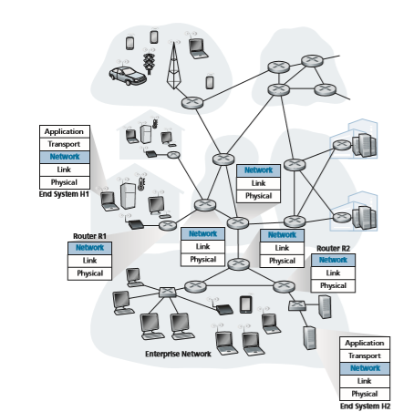
**Figure 4.1**  ♦  The network layer

common and important one!) implemented in the data plane. In the more general case, which we’ll cover in Section 4.4, a packet might also be blocked from exit- ing a router (for example, if the packet originated at a known malicious sending host, or if the packet were destined to a forbidden destination host), or might be duplicated and sent over multiple outgoing links.

• _Routing._ The network layer must determine the route or path taken by packets as they flow from a sender to a receiver. The algorithms that calculate these paths are referred to as **routing algorithms**. A routing algorithm would determine, for example, the path along which packets flow from H1 to H2 in Figure 4.1. Routing is implemented in the control plane of the network layer.

The terms _forwarding_ and _routing_ are often used interchangeably by authors dis- cussing the network layer. We’ll use these terms much more precisely in this book. **Forwarding** refers to the router-local action of transferring a packet from an input link interface to the appropriate output link interface. Forwarding takes place at very short timescales (typically a few nanoseconds), and thus is typically implemented in hardware. **Routing** refers to the network-wide process that determines the end-to-end paths that packets take from source to destination. Routing takes place on much longer timescales (typically seconds), and as we will see is often implemented in software. Using our driving analogy, consider the trip from Pennsylvania to Florida undertaken by our traveler back in Section 1.3.1. During this trip, our driver passes through many interchanges en route to Florida. We can think of forwarding as the process of getting through a single interchange: A car enters the interchange from one road and deter- mines which road it should take to leave the interchange. We can think of routing as the process of planning the trip from Pennsylvania to Florida: Before embarking on the trip, the driver has consulted a map and chosen one of many paths possible, with each path consisting of a series of road segments connected at interchanges.

A key element in every network router is its **forwarding table**. A router forwards a packet by examining the value of one or more fields in the arriving packet’s header, and then using these header values to index into its forwarding table. The value stored in the forwarding table entry for those values indicates the outgoing link interface at that router to which that packet is to be forwarded. For example, in Figure 4.2, a packet with header field value of 0110 arrives to a router. The router indexes into its forward- ing table and determines that the output link interface for this packet is interface 2. The router then internally forwards the packet to interface 2. In Section 4.2, we’ll look inside a router and examine the forwarding function in much greater detail. Forward- ing is the key function performed by the data-plane functionality of the network layer.

**Control Plane: The Traditional Approach** 

But now you are undoubtedly wondering how a router’s forwarding tables are con- figured in the first place. This is a crucial issue, one that exposes the important inter- play between forwarding (in data plane) and routing (in control plane). As shown


**Figure 4.2**  ♦  Routing algorithms determine values in forward tables


in Figure 4.2, the routing algorithm determines the contents of the routers’ forward- ing tables. In this example, a routing algorithm runs in each and every router and both forwarding and routing functions are contained within a router. As we’ll see in Sections 5.3 and 5.4, the routing algorithm function in one router communicates with the routing algorithm function in other routers to compute the values for its forward- ing table. How is this communication performed? By exchanging routing messages containing routing information according to a routing protocol! We’ll cover routing algorithms and protocols in Sections 5.2 through 5.4.

The distinct and different purposes of the forwarding and routing functions can be further illustrated by considering the hypothetical (and unrealistic, but technically feasible) case of a network in which all forwarding tables are configured directly by human network operators physically present at the routers. In this case, _no_ routing protocols would be required! Of course, the human operators would need to interact with each other to ensure that the forwarding tables were configured in such a way that packets reached their intended destinations. It’s also likely that human configu- ration would be more error-prone and much slower to respond to changes in the net- work topology than a routing protocol. We’re thus fortunate that all networks have both a forwarding _and_ a routing function!Local forwarding table

**Control Plane: The SDN Approach** The approach to implementing routing functionality shown in Figure 4.2—with each router having a routing component that communicates with the routing component of other routers—has been the traditional approach adopted by routing vendors in their products, at least until recently. Our observation that humans could manually configure forwarding tables does suggest, however, that there may be other ways for control- plane functionality to determine the contents of the data-plane forwarding tables.

Figure 4.3 shows an alternative approach in which a physically separate, remote controller computes and distributes the forwarding tables to be used by each and every router. Note that the data plane components of Figures 4.2 and 4.3 are identi- cal. In Figure 4.3; however, control-plane routing functionality is separated from theLocal forwarding table

**Figure 4.3**  ♦   A remote controller determines and distributes values in forwarding tables

physical router—the routing device performs forwarding only, while the remote con- troller computes and distributes forwarding tables. The remote controller might be implemented in a remote data center with high reliability and redundancy, and might be managed by the ISP or some third party. How might the routers and the remote controller communicate? By exchanging messages containing forwarding tables and other pieces of routing information. The control-plane approach shown in Figure 4.3 is at the heart of **software-defined networking (SDN)**, where the network is “soft- ware-defined” because the controller that computes forwarding tables and interacts with routers is implemented in software. Increasingly, these software implementa- tions are also open, that is, similar to Linux OS code, the code is publically available, allowing ISPs (and networking researchers and students!) to innovate and propose changes to the software that controls network-layer functionality. We will cover the SDN control plane in Section 5.5.

### Network Service Model

Before delving into the network layer’s data plane, let’s wrap up our introduction by taking the broader view and consider the different types of service that might be offered by the network layer. When the transport layer at a sending host transmits a packet into the network (that is, passes it down to the network layer at the sending host), can the transport layer rely on the network layer to deliver the packet to the destination? When multiple packets are sent, will they be delivered to the transport layer in the receiving host in the order in which they were sent? Will the amount of time between the sending of two sequential packet transmissions be the same as the amount of time between their reception? Will the network provide any feed- back about congestion in the network? The answers to these questions and others are determined by the service model provided by the network layer. The **network service model**
defines the characteristics of end-to-end delivery of packets between sending and receiving hosts.

Let’s now consider some possible services that the network layer could provide. These services could include:

• _Guaranteed delivery_. This service guarantees that a packet sent by a source host will eventually arrive at the destination host.

• _Guaranteed delivery with bounded delay_. This service not only guarantees delivery of the packet, but delivery within a specified host-to-host delay bound (for example, within 100 msec).

• _In-order packet delivery_. This service guarantees that packets arrive at the desti- nation in the order that they were sent.

• _Guaranteed minimal bandwidth_. This network-layer service emulates the behav- ior of a transmission link of a specified bit rate (for example, 1 Mbps) between sending and receiving hosts. As long as the sending host transmits bits (as partof packets) at a rate below the specified bit rate, then all packets are eventually delivered to the destination host.

• _Security_. The network layer could encrypt all datagrams at the source and decrypt them at the destination, thereby providing confidentiality to all transport-layer segments.

This is only a partial list of services that a network layer could provide—there are countless variations possible.

The Internet’s network layer provides a single service, known as **best-effort service**. With best-effort service, packets are neither guaranteed to be received in the order in which they were sent, nor is their eventual delivery even guaranteed. There is no guarantee on the end-to-end delay nor is there a minimal bandwidth guaran- tee. It might appear that _best-effort service_ is a euphemism for _no service at all_—a network that delivered _no_ packets to the destination would satisfy the definition of best-effort delivery service! Other network architectures have defined and imple- mented service models that go beyond the Internet’s best-effort service. For example, the ATM network architecture \[Black 1995\] provides for guaranteed in-order delay, bounded delay, and guaranteed minimal bandwidth. There have also been proposed service model extensions to the Internet architecture; for example, the Intserv archi- tecture \[RFC 1633\] aims to provide end-end delay guarantees and congestion-free communication. Interestingly, in spite of these well-developed alternatives, the Internet’s basic best-effort service model combined with adequate bandwidth provi- sioning and bandwidth-adaptive application-level protocols such as the DASH pro- tocol we encountered in Section 2.6.2 have arguably proven to be more than “good enough” to enable an amazing range of applications, including streaming video ser- vices such as Netflix and video-over-IP, real-time conferencing applications such as Skype and Facetime.

**An Overview of Chapter 4** Having now provided an overview of the network layer, we’ll cover the data-plane component of the network layer in the following Sections in this chapter. In Section 4.2, we’ll dive down into the internal hardware operations of a router, including input and output packet processing, the router’s internal switching mechanism, and packet queuing and scheduling. In Section 4.3, we’ll take a look at traditional IP forwarding, in which packets are forwarded to output ports based on their destination IP addresses. We’ll encounter IP addressing, the celebrated IPv4 and IPv6 protocols and more. In Section 4.4, we’ll cover more generalized forwarding, where packets may be for- warded to output ports based on a large number of header values (i.e., not only based on destination IP address). Packets may be blocked or duplicated at the router, or may have certain header field values rewritten—all under software control. This more generalized form of packet forwarding is a key component of a modern network data plane, including the data plane in software-defined networks (SDN). In Section 4.5, we’ll learn about “middleboxes” that can perform functions in addition to forwarding.We mention here in passing that the terms _forwarding_ and _switching_ are often used interchangeably by computer-networking researchers and practitioners; we’ll use both terms interchangeably in this textbook as well. While we’re on the topic of terminology, it’s also worth mentioning two other terms that are often used inter- changeably, but that we will use more carefully. We’ll reserve the term _packet switch_ to mean a general packet-switching device that transfers a packet from input link interface to output link interface, according to values in a packet’s header fields. Some packet switches, called **link-layer switches** (examined in Chapter 6), base their forwarding decision on values in the fields of the link-layer frame; switches are thus referred to as link-layer (layer 2) devices. Other packet switches, called **routers**, base their forwarding decision on header field values in the network-layer datagram. Routers are thus network-layer (layer 3) devices. (To fully appreciate this important distinction, you might want to review Section 1.5.2, where we discuss network-layer datagrams and link-layer frames and their relationship.) Since our focus in this chap- ter is on the network layer, we’ll mostly use the term _router_ in place of _packet switch_.

## What’s Inside a Router?

Now that we’ve overviewed the data and control planes within the network layer, the important distinction between forwarding and routing, and the services and functions of the network layer, let’s turn our attention to its forwarding function—the actual transfer of packets from a router’s incoming links to the appropriate outgoing links at that router.

A high-level view of a generic router architecture is shown in Figure 4.4. Four router components can be identified:

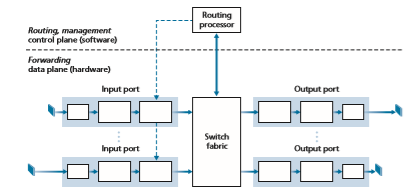
**Figure 4.4**  ♦  Router architecture

• _Input ports._ An **input port** performs several key functions. It performs the physi- cal layer function of terminating an incoming physical link at a router; this is shown in the leftmost box of an input port and the rightmost box of an output port in Figure 4.4. An input port also performs link-layer functions needed to interoperate with the link layer at the other side of the incoming link; this is represented by the middle boxes in the input and output ports. Perhaps most cru- cially, a lookup function is also performed at the input port; this will occur in the rightmost box of the input port. It is here that the forwarding table is consulted to determine the router output port to which an arriving packet will be forwarded via the switching fabric. Control packets (for example, packets carrying routing protocol information) are forwarded from an input port to the routing processor. Note that the term “port” here—referring to the physical input and output router interfaces—is distinctly different from the software ports associated with network applications and sockets discussed in Chapters 2 and 3. In practice, the number of ports supported by a router can range from a relatively small number in enterprise routers, to hundreds of 10 Gbps ports in a router at an ISP’s edge, where the num- ber of incoming lines tends to be the greatest. The Juniper MX2020, edge router, for example, supports up to 800 100 Gbps Ethernet ports, with an overall router system capacity of 800 Tbps \[Juniper MX 2020 2020\].

• _Switching fabric._ The switching fabric connects the router’s input ports to its output ports. This switching fabric is completely contained within the router—a network inside of a network router!

• _Output ports._ An **output port** stores packets received from the switching fabric and transmits these packets on the outgoing link by performing the necessary link-layer and physical-layer functions. When a link is bidirectional (that is, car- ries traffic in both directions), an output port will typically be paired with the input port for that link on the same line card.

• _Routing processor._ The routing processor performs control-plane functions. In tra- ditional routers, it executes the routing protocols (which we’ll study in Sections 5.3 and 5.4), maintains routing tables and attached link state information, and com- putes the forwarding table for the router. In SDN routers, the routing processor is responsible for communicating with the remote controller in order to (among other activities) receive forwarding table entries computed by the remote controller, and install these entries in the router’s input ports. The routing processor also performs the network management functions that we’ll study in Section 5.7.

A router’s input ports, output ports, and switching fabric are almost always implemented in hardware, as shown in Figure 4.4. To appreciate why a hardware implementation is needed, consider that with a 100 Gbps input link and a 64-byte IP datagram, the input port has only 5.12 ns to process the datagram before another datagram may arrive. If _N_ ports are combined on a line card (as is often done in practice), the datagram-processing pipeline must operate _N_ times faster—far toofast for software implementation. Forwarding hardware can be implemented either using a router vendor’s own hardware designs, or constructed using purchased merchant-silicon chips (for example, as sold by companies such as Intel and Broadcom).

While the data plane operates at the nanosecond time scale, a router’s control functions—executing the routing protocols, responding to attached links that go up or down, communicating with the remote controller (in the SDN case) and perform- ing management functions—operate at the millisecond or second timescale. These **control plane** functions are thus usually implemented in software and execute on the routing processor (typically a traditional CPU).

Before delving into the details of router internals, let’s return to our analogy from the beginning of this chapter, where packet forwarding was compared to cars entering and leaving an interchange. Let’s suppose that the interchange is a rounda- bout, and that as a car enters the roundabout, a bit of processing is required. Let’s consider what information is required for this processing:

• _Destination-based forwarding_. Suppose the car stops at an entry station and indi- cates its final destination (not at the local roundabout, but the ultimate destination of its journey). An attendant at the entry station looks up the final destination, determines the roundabout exit that leads to that final destination, and tells the driver which roundabout exit to take.

• _Generalized forwarding_. The attendant could also determine the car’s exit ramp on the basis of many other factors besides the destination. For example, the selected exit ramp might depend on the car’s origin, for example the state that issued the car’s license plate. Cars from a certain set of states might be directed to use one exit ramp (that leads to the destination via a slow road), while cars from other states might be directed to use a different exit ramp (that leads to the destination via super- highway). The same decision might be made based on the model, make and year of the car. Or a car not deemed roadworthy might be blocked and not be allowed to pass through the roundabout. In the case of generalized forwarding, any number of factors may contribute to the attendant’s choice of the exit ramp for a given car.

Once the car enters the roundabout (which may be filled with other cars entering from other input roads and heading to other roundabout exits), it eventually leaves at the prescribed roundabout exit ramp, where it may encounter other cars leaving the roundabout at that exit.

We can easily recognize the principal router components in Figure 4.4 in this analogy—the entry road and entry station correspond to the input port (with a lookup function to determine to local outgoing port); the roundabout corresponds to the switch fabric; and the roundabout exit road corresponds to the output port. With this analogy, it’s instructive to consider where bottlenecks might occur. What happens if cars arrive blazingly fast (for example, the roundabout is in Germany or Italy!) but the station attendant is slow? How fast must the attendant work to ensure there’s no backup on an entry road? Even with a blazingly fast attendant, what happens if carstraverse the roundabout slowly—can backups still occur? And what happens if most of the cars entering at all of the roundabout’s entrance ramps all want to leave the roundabout at the same exit ramp—can backups occur at the exit ramp or elsewhere? How should the roundabout operate if we want to assign priorities to different cars, or block certain cars from entering the roundabout in the first place? These are all analogous to critical questions faced by router and switch designers.

In the following subSections, we’ll look at router functions in more detail.Turner 1988; McKeown 1997a; Partridge 1998; Iyer 2008; Serpanos 2011; Zilberman 2019 provide a discussion of specific router architectures. For concreteness and simplicity, we’ll initially assume in this Section that forwarding decisions are based only on the packet’s destination address, rather than on a generalized set of packet header fields. We will cover the case of more generalized packet forwarding in Section 4.4.

### Input Port Processing and Destination-Based Forwarding

A more detailed view of input processing is shown in Figure 4.5. As just discussed, the input port’s line-termination function and link-layer processing implement the physical and link layers for that individual input link. The lookup performed in the input port is central to the router’s operation—it is here that the router uses the for- warding table to look up the output port to which an arriving packet will be forwarded via the switching fabric. The forwarding table is either computed and updated by the routing processor (using a routing protocol to interact with the routing processors in other network routers) or is received from a remote SDN controller. The forwarding table is copied from the routing processor to the line cards over a separate bus (e.g., a PCI bus) indicated by the dashed line from the routing processor to the input line cards in Figure 4.4. With such a shadow copy at each line card, forwarding decisions can be made locally, at each input port, without invoking the centralized routing pro- cessor on a per-packet basis and thus avoiding a centralized processing bottleneck.

Let’s now consider the “simplest” case that the output port to which an incoming packet is to be switched is based on the packet’s destination address. In the case of 32-bit IP addresses, a brute-force implementation of the forwarding table would have one entry for every possible destination address. Since there are more than 4 billion possible addresses, this option is totally out of the question.


**Figure 4.5**  ♦  Input port processing

As an example of how this issue of scale can be handled, let’s suppose that our router has four links, numbered 0 through 3, and that packets are to be forwarded to the link interfaces as follows:


With this style of forwarding table, the router matches a **prefix** of the packet’s des- tination address with the entries in the table; if there’s a match, the router forwards the packet to a link associated with the match. For example, suppose the packet’s destination address is 11001000 00010111 00010110 10100001; because the 21-bit prefix of this address matches the first entry in the table, the router forwards the packet to link interface 0. If a prefix doesn’t match any of the first three entries, then the router forwards the packet to the default interface 3. Although this sounds simple enough, there’s a very important subtlety here. You may have noticed that it is possible for a destination address to match more than one entry. For example, the first 24 bits of the address 11001000 00010111 00011000 10101010 match the second entry in the table, and the first 21 bits of the address match the third entry in the table. When there are multiple matches, the router uses the **longest prefix matching rule**; that is, it finds the longest matching entry in the table and forwards the packet to the link interface associated with the longest prefix match. We’ll see exactly _why_ this longest prefix-matching rule is used when we study Internet addressing in more detail in Section 4.3.

Given the existence of a forwarding table, lookup is conceptually simple— hardware logic just searches through the forwarding table looking for the longest prefix match. But at Gigabit transmission rates, this lookup must be performed in nanoseconds (recall our earlier example of a 10 Gbps link and a 64-byte IP data- gram). Thus, not only must lookup be performed in hardware, but techniques beyond a simple linear search through a large table are needed; surveys of fast lookup algo- rithms can be found in \[Gupta 2001, Ruiz-Sanchez 2001\]. Special attention must also be paid to memory access times, resulting in designs with embedded on-chip DRAM and faster SRAM (used as a DRAM cache) memories. In practice, Ternary Content Addressable Memories (TCAMs) are also often used for lookup \[Yu 2004\]. With a TCAM, a 32-bit IP address is presented to the memory, which returns the content of the forwarding table entry for that address in essentially constant time. The Cisco Catalyst 6500 and 7600 Series routers and switches can hold upwards of a million TCAM forwarding table entries \[Cisco TCAM 2014\].

Once a packet’s output port has been determined via the lookup, the packet can be sent into the switching fabric. In some designs, a packet may be temporarily blocked from entering the switching fabric if packets from other input ports are cur- rently using the fabric. A blocked packet will be queued at the input port and then scheduled to cross the fabric at a later point in time. We’ll take a closer look at the blocking, queuing, and scheduling of packets (at both input ports and output ports) shortly. Although “lookup” is arguably the most important action in input port pro- cessing, many other actions must be taken: (1) physical- and link-layer processing must occur, as discussed previously; (2) the packet’s version number, checksum and time-to-live field—all of which we’ll study in Section 4.3—must be checked and the latter two fields rewritten; and (3) counters used for network management (such as the number of IP datagrams received) must be updated.

Let’s close our discussion of input port processing by noting that the input port steps of looking up a destination IP address (“match”) and then sending the packet into the switching fabric to the specified output port (“action”) is a specific case of a more general “match plus action” abstraction that is performed in many networked devices, not just routers. In link-layer switches (covered in Chapter 6), link-layer destination addresses are looked up and several actions may be taken in addition to sending the frame into the switching fabric towards the output port. In firewalls (cov- ered in Chapter 8)—devices that filter out selected incoming packets—an incoming packet whose header matches a given criteria (e.g., a combination of source/destina- tion IP addresses and transport-layer port numbers) may be dropped (action). In a network address translator (NAT, covered in Section 4.3), an incoming packet whose transport-layer port number matches a given value will have its port number rewrit- ten before forwarding (action). Indeed, the “match plus action” abstraction \[Bosshart 2013\] is both powerful and prevalent in network devices today, and is central to the notion of generalized forwarding that we’ll study in Section 4.4.

### Switching
 The switching fabric is at the very heart of a router, as it is through this fabric that the packets are actually switched (that is, forwarded) from an input port to an output port. Switching can be accomplished in a number of ways, as shown in Figure 4.6:

• _Switching via memory._ The simplest, earliest routers were traditional computers, with switching between input and output ports being done under direct control of the CPU (routing processor). Input and output ports functioned as traditional I/O devices in a traditional operating system. An input port with an arriving packet first signaled the routing processor via an interrupt. The packet was then copied from the input port into processor memory. The routing processor then extracted the destination address from the header, looked up the appropriate output port in the forwarding table, and copied the packet to the output port’s buffers. In this scenario, if the memory bandwidth is such that a maximum of _B_ packets per second can be written into, or read from, memory, then the overall forwarding throughput (the total rate at which packets are transferred from input ports to out- put ports) must be less than _B_/2. Note also that two packets cannot be forwarded


**Figure 4.6**  ♦  Three switching techniques

at the same time, even if they have different destination ports, since only one memory read/write can be done at a time over the shared system bus.

Some modern routers switch via memory. A major difference from early routers, however, is that the lookup of the destination address and the storing of the packet into the appropriate memory location are performed by processing on the input line cards. In some ways, routers that switch via memory look very much like shared- memory multiprocessors, with the processing on a line card switching (writing) packets into the memory of the appropriate output port. Cisco’s Catalyst 8500 series switches \[Cisco 8500 2020\] internally switches packets via a shared memory.

• _Switching via a bus._ In this approach, an input port transfers a packet directly to the output port over a shared bus, without intervention by the routing processor. This is typically done by having the input port pre-pend a switch-internal label (header) to the packet indicating the local output port to which this packet is being transferred and transmitting the packet onto the bus. All output ports receive the packet, but only the port that matches the label will keep the packet. The label is then removed at the output port, as this label is only used within the switch to cross the bus. If mul- tiple packets arrive to the router at the same time, each at a different input port, all but one must wait since only one packet can cross the bus at a time. Because every packet must cross the single bus, the switching speed of the router is limited to the bus speed; in our roundabout analogy, this is as if the roundabout could only contain one car at a time. Nonetheless, switching via a bus is often sufficient for routers that operate in small local area and enterprise networks. The Cisco 6500 router \[Cisco 6500 2020\] internally switches packets over a 32-Gbps-backplane bus.

• _Switching via an interconnection network._ One way to overcome the bandwidth limitation of a single, shared bus is to use a more sophisticated interconnection net- work, such as those that have been used in the past to interconnect processors in a multiprocessor computer architecture. A crossbar switch is an interconnection net- work consisting of 2_N_ buses that connect _N_ input ports to _N_ output ports, as shown in Figure 4.6. Each vertical bus intersects each horizontal bus at a crosspoint, which can be opened or closed at any time by the switch fabric controller (whose logic is part of the switching fabric itself). When a packet arrives from port A and needs to be forwarded to port Y, the switch controller closes the crosspoint at the interSection of busses A and Y, and port A then sends the packet onto its bus, which is picked up (only) by bus Y. Note that a packet from port B can be forwarded to port X at the same time, since the A-to-Y and B-to-X packets use different input and output busses. Thus, unlike the previous two switching approaches, cross- bar switches are capable of forwarding multiple packets in parallel. A crossbar switch is **non-blocking**—a packet being forwarded to an output port will not be blocked from reaching that output port as long as no other packet is currently being forwarded to that output port. However, if two packets from two different input ports are destined to that same output port, then one will have to wait at the input, since only one packet can be sent over any given bus at a time. Cisco 12000 seriesswitches \[Cisco 12000 2020\] use a crossbar switching network; the Cisco 7600 series can be configured to use either a bus or crossbar switch \[Cisco 7600 2020\].

More sophisticated interconnection networks use multiple stages of switching elements to allow packets from different input ports to proceed towards the same output port at the same time through the multi-stage switching fabric. See \[Tobagi 1990\] for a survey of switch architectures. The Cisco CRS employs a three-stage non-blocking switching strategy. A router’s switching capacity can also be scaled by running multiple switching fabrics in parallel. In this approach, input ports and output ports are connected to _N_ switching fabrics that operate in parallel. An input port breaks a packet into _K_ smaller chunks, and sends (“sprays”) the chunks through _K_ of these _N_ switching fabrics to the selected output port, which reas- sembles the _K_ chunks back into the original packet.

### Output Port Processing
 Output port processing, shown in Figure 4.7, takes packets that have been stored in the output port’s memory and transmits them over the output link. This includes selecting (i.e., scheduling) and de-queuing packets for transmission, and performing the needed link-layer and physical-layer transmission functions.

### Where Does Queuing Occur?

If we consider input and output port functionality and the configurations shown in Figure 4.6, it’s clear that packet queues may form at both the input ports _and_ the output ports, just as we identified cases where cars may wait at the inputs and out- puts of the traffic interSection in our roundabout analogy. The location and extent of queuing (either at the input port queues or the output port queues) will depend on the traffic load, the relative speed of the switching fabric, and the line speed. Let’s now consider these queues in a bit more detail, since as these queues grow large, the router’s memory can eventually be exhausted and **packet loss**
will occur when no memory is available to store arriving packets. Recall that in our earlier discussions, we said that packets were “lost within the network” or “dropped at a router.” _It is here, at these queues within a router, where such packets are actually dropped and lost._

**Figure 4.7**  ♦  Output port processing

Suppose that the input and output line speeds (transmission rates) all have an identical transmission rate of _R_line packets per second, and that there are _N_ input ports and _N_ output ports. To further simplify the discussion, let’s assume that all packets have the same fixed length, and that packets arrive to input ports in a synchronous manner. That is, the time to send a packet on any link is equal to the time to receive a packet on any link, and during such an interval of time, either zero or one packets can arrive on an input link. Define the switching fabric transfer rate _R_switch as the rate at which packets can be moved from input port to output port. If _R_switch is _N_ times faster than _R_line, then only negligible queuing will occur at the input ports. This is because even in the worst case, where all _N_ input lines are receiving packets, and all packets are to be forwarded to the same output port, each batch of _N_ packets (one packet per input port) can be cleared through the switch fabric before the next batch arrives.

**Input Queuing**

But what happens if the switch fabric is not fast enough (relative to the input line speeds) to transfer _all_ arriving packets through the fabric without delay? In this case, packet queuing can also occur at the input ports, as packets must join input port queues to wait their turn to be transferred through the switching fabric to the output port. To illustrate an important consequence of this queuing, consider a crossbar switching fabric and suppose that (1) all link speeds are identical, (2) that one packet can be transferred from any one input port to a given output port in the same amount of time it takes for a packet to be received on an input link, and (3) packets are moved from a given input queue to their desired output queue in an FCFS manner. Multiple packets can be transferred in parallel, as long as their output ports are different. How- ever, if two packets at the front of two input queues are destined for the same output queue, then one of the packets will be blocked and must wait at the input queue—the switching fabric can transfer only one packet to a given output port at a time.

Figure 4.8 shows an example in which two packets (darkly shaded) at the front of their input queues are destined for the same upper-right output port. Suppose that the switch fabric chooses to transfer the packet from the front of the upper-left queue. In this case, the darkly shaded packet in the lower-left queue must wait. But not only must this darkly shaded packet wait, so too must the lightly shaded packet that is queued behind that packet in the lower-left queue, even though there is _no_ conten- tion for the middle-right output port (the destination for the lightly shaded packet). This phenomenon is known as **head-of-the-line (HOL) blocking** in an input-queued switch—a queued packet in an input queue must wait for transfer through the fabric (even though its output port is free) because it is blocked by another packet at the head of the line. \[Karol 1987\] shows that due to HOL blocking, the input queue will grow to unbounded length (informally, this is equivalent to saying that significant packet loss will occur) under certain assumptions as soon as the packet arrival rate on the input links reaches only 58 percent of their capacity. A number of solutions to HOL blocking are discussed in \[McKeown 1997\].
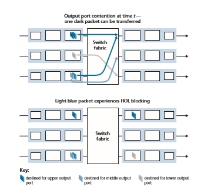
**Figure 4.8**  ♦  HOL blocking at and input-queued switch

**Output Queuing**

Let’s next consider whether queuing can occur at a switch’s output ports. Suppose that _R_switch is again _N_ times faster than _R_line and that packets arriving at each of the _N_ input ports are destined to the same output port. In this case, in the time it takes to send a single packet onto the outgoing link, _N_ new packets will arrive at this output port (one from each of the _N_ input ports). Since the output port can transmit only a single packet in a unit of time (the packet transmission time), the _N_ arriving packets will have to queue (wait) for transmission over the outgoing link. Then _N_ more packets can possibly arrive in the time it takes to transmit just one of the _N_ packets that had just previously been queued. And so on. Thus, packet queues can form at the output ports even when the switching fabric is _N_ times faster than the port line speeds. Eventually, the number of queued packets can grow large enough to exhaust avail- able memory at the output port.

**Figure 4.9**  ♦  Output port queuing

When there is not enough memory to buffer an incoming packet, a decision must be made to either drop the arriving packet (a policy known as **drop-tail**) or remove one or more already-queued packets to make room for the newly arrived packet. In some cases, it may be advantageous to drop (or mark the header of) a packet _before_ the buffer is full in order to provide a congestion signal to the sender. This mark- ing could be done using the Explicit Congestion Notification bits that we studied in Section 3.7.2. A number of proactive packet-dropping and -marking policies (which collectively have become known as **active queue management (AQM)** algorithms) have been proposed and analyzed \[Labrador 1999, Hollot 2002\]. One of the most widely studied and implemented AQM algorithms is the **Random Early Detection (RED)** algorithm \[Christiansen 2001\]. More recent AQM policies include PIE (the Proportional Integral controller Enhanced \[RFC 8033\] and CoDel \[Nichols 2012\].

Output port queuing is illustrated in Figure 4.9. At time _t,_ a packet has arrived at each of the incoming input ports, each destined for the uppermost outgoing port. Assuming identical line speeds and a switch operating at three times the line speed, one time unit later (that is, in the time needed to receive or send a packet), all three original packets have been transferred to the outgoing port and are queued awaiting transmis- sion. In the next time unit, one of these three packets will have been transmitted over the outgoing link. In our example, two _new_ packets have arrived at the incoming side of the

switch; one of these packets is destined for this uppermost output port. A consequence of such queuing is that a **packet scheduler** at the output port must choose one packet, among those queued, for transmission—a topic we’ll cover in the following Section.

**How Much Buffering Is “Enough?”**

Our study above has shown how a packet queue forms when bursts of packets arrive at a router’s input or (more likely) output port, and the packet arrival rate temporarily exceeds the rate at which packets can be forwarded. The longer the amount of time that this mismatch persists, the longer the queue will grow, until eventually a port’s buffers become full and packets are dropped. One natural question is how _much_ buffering should be provisioned at a port. It turns out the answer to this question is much more complicated than one might imagine and can teach us quite a bit about the subtle interaction among congestion-aware senders at the network’s edge and the network core!

For many years, the rule of thumb \[RFC 3439\] for buffer sizing was that the amount of buffering **(B)** should be equal to an average round-trip time (**RTT**, say 250 msec) times the link capacity **(C)**. Thus, a 10-Gbps link with an RTT of 250 msec would need an amount of buffering equal to **B** \= **RTT** \# **C** \= 2.5 Gbits of buff- ers. This result was based on an analysis of the queuing dynamics of a relatively small number of TCP flows \[Villamizar 1994\]. More recent theoretical and experi- mental efforts \[Appenzeller 2004\], however, suggest that when a large number of _independent_ TCP flows (**N**) pass through a link, the amount of buffering needed is **B** \= **RTT** \# **C**\>2**N**. In core networks, where a large number of TCP flows typi- cally pass through large backbone router links, the value of **N** can be large, with the decrease in needed buffer size becoming quite significant. \[Appenzeller 2004; Wischik 2005; Beheshti 2008\] provide very readable discussions of the buffer-sizing problem from a theoretical, implementation, and operational standpoint.

It’s temping to think that more buffering _must_ be better—larger buffers would allow a router to absorb larger fluctuations in the packet arrival rate, thereby decreas- ing the router’s packet loss rate. But larger buffers also mean potentially longer queuing delays. For gamers and for interactive teleconferencing users, tens of mil- liseconds count. Increasing the amount of per-hop buffer by a factor of 10 to decrease packet loss could increase the end-end delay by a factor of 10! Increased RTTs also make TCP senders less responsive and slower to respond to incipient congestion and/ or packet loss. These delay-based considerations show that buffering is a double- edged sword—buffering can be used to absorb short-term statistical fluctuations in traffic but can also lead to increased delay and the attendant concerns. Buffering is a bit like salt—just the right amount of salt makes food better, but too much makes it inedible!

In the discussion above, we’ve implicitly assumed that many independent send- ers are competing for bandwidth and buffers at a congested link. While this is prob- ably an excellent assumption for routers within the network core, at the network edge

**Figure 4.10**  ♦  Bufferbloat: persistent queues

this may not hold. Figure 4.10(a) shows a home router sending TCP segments to a remote game server. Following \[Nichols 2012\], suppose that it takes 20 ms to trans- mit a packet (containing a gamer’s TCP segment), that there are negligible queuing delays elsewhere on the path to the game server, and that the RTT is 200 ms. As shown in Figure 4.10(b), suppose that at time _t_ \= 0, a burst of 25 packets arrives to the queue. One of these queued packets is then transmitted once every 20 ms, so that at _t_ \= 200 msec, the first ACK arrives, just as the 21st packet is being transmitted. This ACK arrival causes the TCP sender to send another packet, which is queued at the outgoing link of the home router. At _t_ \= 220, the next ACK arrives, and another TCP segment is released by the gamer and is queued, as the 22nd packet is being transmitted, and so on. You should convince yourself that in this scenario, ACK clocking results in a new packet arriving at the queue every time a queued packet is sent, resulting in queue size at the home router’s outgoing link that is _always_ five packets! That is, the end-end-pipe is full (delivering packets to the destination at the path bottleneck rate of one packet every 20 ms), but the amount of queuing delay is constant and _persistent_. As a result, the gamer is unhappy with the delay, and the par- ent (who even knows wireshark!) is confused because he or she doesn’t understand why delays are persistent and excessively long, even when there is no other traffic on the home network.

This scenario above of long delay due to persistent buffering is known as **buff- erbloat** and illustrates that not only is throughput important, but also minimal delay is important as well \[Kleinrock 2018\], and that the interaction among senders at the network edge and queues within the network can indeed be complex and subtle. The DOCSIS 3.1 standard for cable networks that we will study in Chapter 6, recently added a specific AQM mechanism \[RFC 8033, RFC 8034\] to combat bufferbloat, while preserving bulk throughput performance.

### Packet Scheduling
 Let’s now return to the question of determining the order in which queued packets are transmitted over an outgoing link. Since you yourself have undoubtedly had to wait in long lines on many occasions and observed how waiting customers are served, you’re no doubt familiar with many of the queuing disciplines commonly used in routers. There is first-come-first-served (FCFS, also known as first-in-first-out, FIFO). The British are famous for patient and orderly FCFS queuing at bus stops and in the mar- ketplace (“Oh, are you queuing?”). Other countries operate on a priority basis, with one class of waiting customers given priority service over other waiting customers. There is also round-robin queuing, where customers are again divided into classes (as in priority queuing) but each class of customer is given service in turn.

**First-in-First-Out (FIFO)**

Figure 4.11 shows the queuing model abstraction for the FIFO link-scheduling dis- cipline. Packets arriving at the link output queue wait for transmission if the link is currently busy transmitting another packet. If there is not sufficient buffering space to hold the arriving packet, the queue’s packet-discarding policy then determines whether the packet will be dropped (lost) or whether other packets will be removed from the queue to make space for the arriving packet, as discussed above. In our discussion below, we’ll ignore packet discard. When a packet is completely transmit- ted over the outgoing link (that is, receives service) it is removed from the queue.

The FIFO (also known as first-come-first-served, or FCFS) scheduling discipline selects packets for link transmission in the same order in which they arrived at the output link queue. We’re all familiar with FIFO queuing from service centers, where arriving customers join the back of the single waiting line, remain in order, and are then served when they reach the front of the line. Figure 4.12 shows the FIFO queue in operation. Packet arrivals are indicated by numbered arrows above the upper time- line, with the number indicating the order in which the packet arrived. Individual packet departures are shown below the lower timeline. The time that a packet spends in service (being transmitted) is indicated by the shaded rectangle between the two timelines. 

**Figure 4.11**  ♦ In FIFO queuing abstractionour

**Figure 4.12**  ♦  The FIFO queue in operation

 examples here, let’s assume that each packet takes three units of time to be transmit- ted. Under the FIFO discipline, packets leave in the same order in which they arrived. Note that after the departure of packet 4, the link remains idle (since packets 1 through 4 have been transmitted and removed from the queue) until the arrival of packet 5.

**Priority Queuing**

Under priority queuing, packets arriving at the output link are classified into prior- ity classes upon arrival at the queue, as shown in Figure 4.13. In practice, a network operator may configure a queue so that packets carrying network management infor- mation (for example, as indicated by the source or destination TCP/UDP port num- ber) receive priority over user traffic; additionally, real-time voice-over-IP packets might receive priority over non-real-time traffic such e-mail packets. Each priority class typically has its own queue. When choosing a packet to transmit, the priority
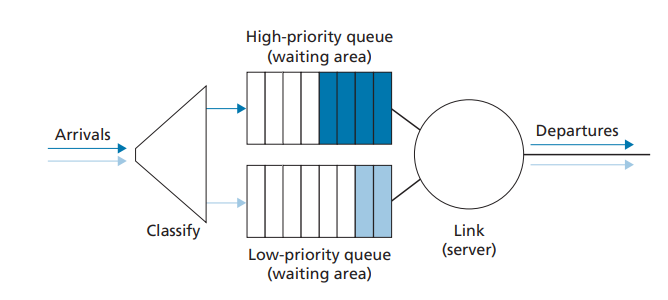
**Figure 4.13**  ♦  The priority queuing model

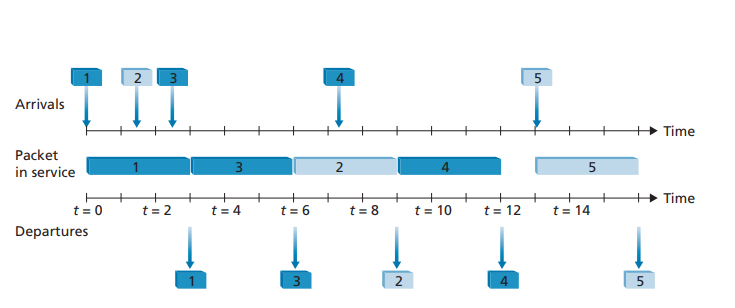
Figure 4.14  ♦  The priority queue in operation

queuing discipline will transmit a packet from the highest priority class that has a nonempty queue (that is, has packets waiting for transmission). The choice among packets in the same priority class is typically done in a FIFO manner.

Figure 4.14 illustrates the operation of a priority queue with two priority classes. Packets 1, 3, and 4 belong to the high-priority class, and packets 2 and 5 belong to the low-priority class. Packet 1 arrives and, finding the link idle, begins transmission. During the transmission of packet 1, packets 2 and 3 arrive and are queued in the low- and high-priority queues, respectively. After the transmission of packet 1, packet 3 (a high-priority packet) is selected for transmission over packet 2 (which, even though it arrived earlier, is a low-priority packet). At the end of the transmission of packet 3, packet 2 then begins transmission. Packet 4 (a high-priority packet) arrives during the transmission of packet 2 (a low-priority packet). Under a **non-preemptive priority queuing** discipline, the transmission of a packet is not interrupted once it

**PRINCIPLES IN PRACTICE**

NET NEUTRALITY

We’ve seen that packet scheduling mechanisms (e.g., priority traffic scheduling disciplines 
such a strict priority, and WFQ) can be used to provide different levels of service to different “classes” of traffic. The definition of what precisely constitutes a “class” of traffic is up 
to an ISP to decide, but could be potentially based on any set of fields in the IP datagram 
header. For example, the port field in the IP datagram header could be used to classify 
datagrams according to the “well-know service” associated with that port: SNMP network 
management datagram (port 161) might be assigned to a higher priority class than an 
IMAP e-mail protocol (ports 143, or 993) datagram and therefore receive better service. 
An ISP could also potentially use a datagram’s source IP address to provide priority to 
datagrams being sent by certain companies (who have presumably paid the ISP for this 
privilege) over datagrams being sent from other companies (who have not paid); an ISP 

could even block traffic with a source IP address in a given company, or country. There are many _mechanisms_ that would allow an ISP to provide different levels of service to dif- ferent classes of traffic. The real question is what _policies_ and _laws_ determine what an ISP can actually do. Of course, these laws will vary by country; see \[Smithsonian 2017\] for a brief survey. Here, we’ll briefly consider US policy on what has come to be known as “net neutrality.”

The term “net neutrality” doesn’t have a precise decision, but the March 2015 _Order on Protecting and Promoting an Open Internet_ \[FCC 2015\] by the US Federal Communications Commission provides three “clear, bright line” rules that are now often associated with net neutrality:

• “**No Blocking.** . . . A person engaged in the provision of broadband Internet access service, . . . shall not block lawful content, applications, services, or non-harmful devices, subject to reasonable network management.”

• “**No Throttling.** . . . A person engaged in the provision of broadband Internet access service, . . . shall not impair or degrade lawful Internet traffic on the basis of Internet content, application, or service, or use of a non-harmful device, subject to rea- sonable network management.”

• “**No Paid Prioritization.** . . . A person engaged in the provision of broadband Internet access service, . . . shall not engage in paid prioritization. “Paid prioritization” refers to the management of a broadband provider’s network to directly or indirectly favor some traffic over other traffic, including through use of techniques such as traffic shaping, prioritization, resource reservation, or other forms of preferential traffic man- agement, . . .”

Quite interestingly, before the Order, ISP behaviors violating the first two of these rules had been observed \[Faulhaber 2012\]. In 2005, an ISP in North Carolina agreed to stop its practice of blocking its customers from using Vonage, a voice-over-IP service that com- peted with its own telephone service. In 2007, Comcast was judged to be interfering with BitTorrent P2P traffic by internally creating and sending TCP RST packets to BitTorrent send- ers and receivers, which caused them to close their BitTorrent connection \[FCC 2008\].

Both sides of the net neutrality debate have been argued strenuously, mostly focused on the extent to which net neutrality provides benefits to customers, while at the same time promoting innovation. See \[Peha 2006, Faulhaber 2012, Economides 2017, Madhyastha 2017\].

The 2015 FCC _Order on Protecting and Promoting an Open Internet,_ which banned ISPs from blocking, throttling, or providing paid prioritizing, was superseded by the 2017 FCC _Restoring Internet Freedom Order,_ \[FCC 2017\] which rolled back these prohibitions and focused instead on ISP transparency. With so much interest and so many changes, it’s probably safe to say we aren’t close to having seen the final chapter written on net neutrality in the United States, or elsewhere.has begun. In this case, packet 4 queues for transmission and begins being transmit- ted after the transmission of packet 2 is completed.

**Round Robin and Weighted Fair Queuing (WFQ)**

Under the round robin queuing discipline, packets are sorted into classes as with priority queuing. However, rather than there being a strict service priority among classes, a round robin scheduler alternates service among the classes. In the simplest form of round robin scheduling, a class 1 packet is transmitted, followed by a class 2 packet, followed by a class 1 packet, followed by a class 2 packet, and so on. A so-called **work-conserving queuing** discipline will never allow the link to remain idle whenever there are packets (of any class) queued for transmission. A work- conserving round robin discipline that looks for a packet of a given class but finds none will immediately check the next class in the round robin sequence.

Figure 4.15 illustrates the operation of a two-class round robin queue. In this example, packets 1, 2, and 4 belong to class 1, and packets 3 and 5 belong to the second class. Packet 1 begins transmission immediately upon arrival at the output queue. Packets 2 and 3 arrive during the transmission of packet 1 and thus queue for transmission. After the transmission of packet 1, the link scheduler looks for a class 2 packet and thus transmits packet 3. After the transmission of packet 3, the scheduler looks for a class 1 packet and thus transmits packet 2. After the transmission of packet 2, packet 4 is the only queued packet; it is thus transmitted immediately after packet 2.

A generalized form of round robin queuing that has been widely implemented in routers is the so-called **weighted fair queuing (WFQ) discipline** \Demers 1990; Parekh 1993. WFQ is illustrated in Figure 4.16. Here, arriving packets are classified and queued in the appropriate per-class waiting area. As in round robin scheduling, a WFQ scheduler will serve classes in a circular manner—first serving class 1, then serving class 2, then serving class 3, and then (assuming there are three classes) repeating the service pattern. WFQ is also a work-conserving queuing discipline and

**Figure 4.15**  ♦  The two-class robin queue in operation

**Figure 4.16**  ♦  Weighted fair queuing

thus will immediately move on to the next class in the service sequence when it finds an empty class queue.

WFQ differs from round robin in that each class may receive a differential amount of service in any interval of time. Specifically, each class, _i_, is assigned a weight, _wi_. Under WFQ, during any interval of time during which there are class _i_ packets to send, class _i_ will then be guaranteed to receive a fraction of service equal to _wi_\>(g_wj_), where the sum in the denominator is taken over all classes that also have packets queued for transmission. In the worst case, even if all classes have queued packets, class _i_ will still be guaranteed to receive a fraction _wi_ >(g_wj_) of the bandwidth, where in this worst case the sum in the denominator is over _all_ classes. Thus, for a link with transmission rate _R_, class _i_ will always achieve a throughput of at least _R_ \# _wi_ >(g_wj_). Our descrip- tion of WFQ has been idealized, as we have not considered the fact that packets are discrete and a packet’s transmission will not be interrupted to begin transmission of another packet; \[Demers 1990; Parekh 1993\] discuss this packetization issue.

## The Internet Protocol (IP): IPv4, Addressing, IPv6, and More

Our study of the network layer thus far in Chapter 4—the notion of the data and con- trol plane component of the network layer, our distinction between forwarding and routing, the identification of various network service models, and our look inside a router—have often been without reference to any specific computer network archi- tecture or protocol. In this Section, we’ll focus on key aspects of the network layer on today’s Internet and the celebrated Internet Protocol (IP).

There are two versions of IP in use today. We’ll first examine the widely deployed IP protocol version 4, which is usually referred to simply as IPv4 \[RFC 791\] in Section 4.3.1. We’ll examine IP version 6 \[RFC 2460; RFC 4291\], which has been proposed to replace IPv4, in Section 4.3.4. In between, we’ll primarily cover Internet addressing—a topic that might seem rather dry and detail-oriented but we’ll see is crucial to understanding how the Internet’s network layer works. To master IP addressing is to master the Internet’s network layer itself!

### IPv4 Datagram Format

 Recall that the Internet’s network-layer packet is referred to as a _datagram_. We begin our study of IP with an overview of the syntax and semantics of the IPv4 datagram. You might be thinking that nothing could be drier than the syntax and semantics of a packet’s bits. Nevertheless, the datagram plays a central role in the Internet—every networking student and professional needs to see it, absorb it, and master it. (And just to see that protocol headers can indeed be fun to study, check out \[Pomeranz 2010\]). The IPv4 datagram format is shown in Figure 4.17. The key fields in the IPv4 datagram are the following:

• _Version number._ These 4 bits specify the IP protocol version of the datagram. By looking at the version number, the router can determine how to interpret the remainder of the IP datagram. Different versions of IP use different datagram formats. The datagram format for IPv4 is shown in Figure 4.17. The datagram format for the new version of IP (IPv6) is discussed in Section 4.3.4.

• _Header length._ Because an IPv4 datagram can contain a variable number of options (which are included in the IPv4 datagram header), these 4 bits are needed

**Figure 4.17**  ♦  IPv4 datagram format

to determine where in the IP datagram the payload (for example, the transport- layer segment being encapsulated in this datagram) actually begins. Most IP data- grams do not contain options, so the typical IP datagram has a 20-byte header.

• _Type of service._ The type of service (TOS) bits were included in the IPv4 header to allow different types of IP datagrams to be distinguished from each other. For example, it might be useful to distinguish real-time datagrams (such as those used by an IP telephony application) from non-real-time traffic (e.g., FTP). The specific level of service to be provided is a policy issue determined and config- ured by the network administrator for that router. We also learned in Section 3.7.2 that two of the TOS bits are used for Explicit Congestion Notification.

• _Datagram length._ This is the total length of the IP datagram (header plus data), meas- ured in bytes. Since this field is 16 bits long, the theoretical maximum size of the IP datagram is 65,535 bytes. However, datagrams are rarely larger than 1,500 bytes, which allows an IP datagram to fit in the payload field of a maximally sized Ethernet frame.

• _Identifier, flags, fragmentation offset._ These three fields have to do with so-called IP fragmentation, when a large IP datagram is broken into several smaller IP data- grams which are then forwarded independently to the destination, where they are reassembled before their payload data (see below) is passed up to the transport layer at the destination host. Interestingly, the new version of IP, IPv6, does not allow for fragmentation. We’ll not cover fragmentation here; but readers can find a detailed discussion online, among the “retired” material from earlier versions of this book.

• _Time-to-live._ The time-to-live (TTL) field is included to ensure that datagrams do not circulate forever (due to, for example, a long-lived routing loop) in the network. This field is decremented by one each time the datagram is processed by a router. If the TTL field reaches 0, a router must drop that datagram.

• _Protocol._ This field is typically used only when an IP datagram reaches its final destination. The value of this field indicates the specific transport-layer protocol to which the data portion of this IP datagram should be passed. For example, a value of 6 indicates that the data portion is passed to TCP, while a value of 17 indi- cates that the data is passed to UDP. For a list of all possible values, see \[IANA Protocol Numbers 2016\]. Note that the protocol number in the IP datagram has a role that is analogous to the role of the port number field in the transport-layer segment. The protocol number is the glue that binds the network and transport layers together, whereas the port number is the glue that binds the transport and application layers together. We’ll see in Chapter 6 that the link-layer frame also has a special field that binds the link layer to the network layer.

• _Header checksum._ The header checksum aids a router in detecting bit errors in a received IP datagram. The header checksum is computed by treating each 2 bytes in the header as a number and summing these numbers using 1s complement arith- metic. As discussed in Section 3.3, the 1s complement of this sum, known as the Internet checksum, is stored in the checksum field. A router computes the header checksum for each received IP datagram and detects an error condition ifthe checksum carried in the datagram header does not equal the computed check- sum. Routers typically discard datagrams for which an error has been detected. Note that the checksum must be recomputed and stored again at each router, since the TTL field, and possibly the options field as well, will change. An interesting discussion of fast algorithms for computing the Internet checksum is \[RFC 1071\]. A question often asked at this point is, why does TCP/IP perform error checking at both the transport and network layers? There are several reasons for this repetition. First, note that only the IP header is checksummed at the IP layer, while the TCP/ UDP checksum is computed over the entire TCP/UDP segment. Second, TCP/ UDP and IP do not necessarily both have to belong to the same protocol stack. TCP can, in principle, run over a different network-layer protocol (for example, ATM) \[Black 1995\]) and IP can carry data that will not be passed to TCP/UDP.

• _Source and destination IP addresses._ When a source creates a datagram, it inserts its IP address into the source IP address field and inserts the address of the ulti- mate destination into the destination IP address field. Often the source host deter- mines the destination address via a DNS lookup, as discussed in Chapter 2. We’ll discuss IP addressing in detail in Section 4.3.2.

• _Options._ The options fields allow an IP header to be extended. Header options were meant to be used rarely—hence the decision to save overhead by not includ- ing the information in options fields in every datagram header. However, the mere existence of options does complicate matters—since datagram headers can be of variable length, one cannot determine a priori where the data field will start. Also, since some datagrams may require options processing and others may not, the amount of time needed to process an IP datagram at a router can vary greatly. These considerations become particularly important for IP processing in high- performance routers and hosts. For these reasons and others, IP options were not included in the IPv6 header, as discussed in Section 4.3.4.

• _Data (payload)._ Finally, we come to the last and most important field—the _raison d’etre_ for the datagram in the first place! In most circumstances, the data field of the IP datagram contains the transport-layer segment (TCP or UDP) to be deliv- ered to the destination. However, the data field can carry other types of data, such as ICMP messages (discussed in Section 5.6).

Note that an IP datagram has a total of 20 bytes of header (assuming no options). If the datagram carries a TCP segment, then each datagram carries a total of 40 bytes of header (20 bytes of IP header plus 20 bytes of TCP header) along with the application-layer message.

### IPv4 Addressing

We now turn our attention to IPv4 addressing. Although you may be thinking that addressing must be a straightforward topic, hopefully by the end of this Section you’ll be convinced that Internet addressing is not only a juicy, subtle, and interesting topicbut also one that is of central importance to the Internet. An excellent treatment of IPv4 addressing can be found in the first chapter in \[Stewart 1999\].

Before discussing IP addressing, however, we’ll need to say a few words about how hosts and routers are connected into the Internet. A host typically has only a single link into the network; when IP in the host wants to send a datagram, it does so over this link. The boundary between the host and the physical link is called an **interface**. Now consider a router and its interfaces. Because a router’s job is to receive a datagram on one link and forward the datagram on some other link, a router necessarily has two or more links to which it is connected. The boundary between the router and any one of its links is also called an interface. A router thus has multiple interfaces, one for each of its links. Because every host and router is capable of send- ing and receiving IP datagrams, IP requires each host and router interface to have its own IP address. _Thus, an IP address is technically associated with an interface, rather than with the host or router containing that interface._

Each IP address is 32 bits long (equivalently, 4 bytes), and there are thus a total of 232 (or approximately 4 billion) possible IP addresses. These addresses are typi- cally written in so-called **dotted-decimal notation**, in which each byte of the address is written in its decimal form and is separated by a period (dot) from other bytes in the address. For example, consider the IP address 193.32.216.9. The 193 is the deci- mal equivalent of the first 8 bits of the address; the 32 is the decimal equivalent of the second 8 bits of the address, and so on. Thus, the address 193.32.216.9 in binary notation is
```
11000001 00100000 11011000 00001001
```
Each interface on every host and router in the global Internet must have an IP address that is globally unique (except for interfaces behind NATs, as discussed in Section 4.3.3). These addresses cannot be chosen in a willy-nilly manner, however. A portion of an interface’s IP address will be determined by the subnet to which it is connected.

Figure 4.18 provides an example of IP addressing and interfaces. In this figure, one router (with three interfaces) is used to interconnect seven hosts. Take a close look at the IP addresses assigned to the host and router interfaces, as there are sev- eral things to notice. The three hosts in the upper-left portion of Figure 4.18, and the router interface to which they are connected, all have an IP address of the form 223.1.1.xxx. That is, they all have the same leftmost 24 bits in their IP address. These four interfaces are also interconnected to each other by a network _that contains no routers_. This network could be interconnected by an Ethernet LAN, in which case the interfaces would be interconnected by an Ethernet switch (as we’ll discuss in Chapter 6), or by a wireless access point (as we’ll discuss in Chapter 7). We’ll repre- sent this routerless network connecting these hosts as a cloud for now, and dive into the internals of such networks in Chapters 6 and 7.

In IP terms, this network interconnecting three host interfaces and one router interface forms a **subnet** \[RFC 950\]. (A subnet is also called an _IP network_ or simply

**Figure 4.18**  ♦  Interface addresses and subnets

a _network_ in the Internet literature.) IP addressing assigns an address to this subnet: 223.1.1.0/24, where the /24 (“slash-24”) notation, sometimes known as a **subnet mask**, indicates that the leftmost 24 bits of the 32-bit quantity define the subnet address. The 223.1.1.0/24 subnet thus consists of the three host interfaces (223.1.1.1, 223.1.1.2, and 223.1.1.3) and one router interface (223.1.1.4). Any additional hosts attached to the 223.1.1.0/24 subnet would be _required_ to have an address of the form 223.1.1.xxx. There are two additional subnets shown in Figure 4.18: the 223.1.2.0/24 network and the 223.1.3.0/24 subnet. Figure 4.19 illustrates the three IP subnets pre- sent in Figure 4.18.

The IP definition of a subnet is not restricted to Ethernet segments that connect multiple hosts to a router interface. To get some insight here, consider Figure 4.20, which shows three routers that are interconnected with each other by point-to-point links. Each router has three interfaces, one for each point-to-point link and one for the broadcast link that directly connects the router to a pair of hosts. What subnets are present here? Three subnets, 223.1.1.0/24, 223.1.2.0/24, and 223.1.3.0/24, are similar to the subnets we encountered in Figure 4.18. But note that there are three additional subnets in this example as well: one subnet, 223.1.9.0/24, for the inter- faces that connect routers R1 and R2; another subnet, 223.1.8.0/24, for the interfaces that connect routers R2 and R3; and a third subnet, 223.1.7.0/24, for the interfaces that connect routers R3 and R1. For a general interconnected system of routers and hosts, we can use the following recipe to define the subnets in the system:
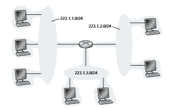
**Figure 4.19**  ♦  Subnet addresses

To determine the subnets, detach each interface from its host or router, creating islands of isolated networks, with interfaces terminating the end points of the isolated networks. Each of these isolated networks is called a **subnet**.

If we apply this procedure to the interconnected system in Figure 4.20, we get six islands or subnets.

From the discussion above, it’s clear that an organization (such as a company or academic institution) with multiple Ethernet segments and point-to-point links will have multiple subnets, with all of the devices on a given subnet having the same subnet address. In principle, the different subnets could have quite different subnet addresses. In practice, however, their subnet addresses often have much in common. To understand why, let’s next turn our attention to how addressing is handled in the global Internet.

The Internet’s address assignment strategy is known as **Classless Interdomain Routing (CIDR**—pronounced _cider_) \[RFC 4632\]. CIDR generalizes the notion of subnet addressing. As with subnet addressing, the 32-bit IP address is divided into two parts and again has the dotted-decimal form _a.b.c.d/x_, where _x_ indicates the number of bits in the first part of the address.

The _x_ most significant bits of an address of the form _a.b.c.d/x_ constitute the network portion of the IP address, and are often referred to as the **prefix** (or _network prefix_) of the address. An organization is typically assigned a block of contiguous addresses, that is, a range of addresses with a common prefix (see the Principles in Practice feature). In this case, the IP addresses of devices within the organization will share the common prefix. When we cover the Internet’s BGP routing protocol in
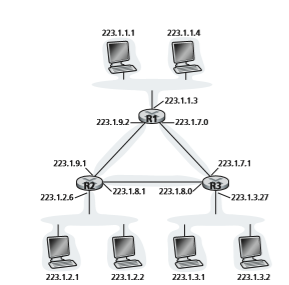
**Figure 4.20**  ♦  Three routers interconnecting six subnet

Section 5.4, we’ll see that only these _x_ leading prefix bits are considered by routers outside the organization’s network. That is, when a router outside the organization forwards a datagram whose destination address is inside the organization, only the leading _x_ bits of the address need be considered. This considerably reduces the size of the forwarding table in these routers, since a _single_ entry of the form _a.b.c.d/x_ will be sufficient to forward packets to _any_ destination within the organization.

The remaining 32-_x_ bits of an address can be thought of as distinguishing among the devices _within_ the organization, all of which have the same network prefix. These are the bits that will be considered when forwarding packets at routers _within_ the organiza- tion. These lower-order bits may (or may not) have an additional subnetting structure, such as that discussed above. For example, suppose the first 21 bits of the CIDRized address a.b.c.d/21 specify the organization’s network prefix and are common to the IP addresses of all devices in that organization. The remaining 11 bits then identify the specific hosts in the organization. The organization’s internal structure might be such that these 11 rightmost bits are used for subnetting within the organization, as discussed above. For example, a.b.c.d/24 might refer to a specific subnet within the organization.

Before CIDR was adopted, the network portions of an IP address were constrained to be 8, 16, or 24 bits in length, an addressing scheme known as **classful addressing**,
ssince subnets with 8-, 16-, and 24-bit subnet addresses were known as class A, B, and C networks, respectively. The requirement that the subnet portion of an IP address be exactly 1, 2, or 3 bytes long turned out to be problematic for supporting the rapidly growing number of organizations with small and medium-sized subnets. A class C (/24) subnet could accommodate only up to 28 2 2 5 254 hosts (two of the 28 5 256 addresses are reserved for special use)—too small for many organizations. However, a class B (/16) subnet, which supports up to 65,634 hosts, was too large. Under classful addressing, an organization with, say, 2,000 hosts was typically allocated a class B (/16) subnet address. This led to a rapid depletion of the class B address space and poor utilization of the assigned address space. For example, the organization that used a class B address for its 2,000 hosts was allocated enough of the address space for up to 65,534 interfaces—leaving more than 63,000 addresses that could not be used by other organizations.

**PRINCIPLES IN PRACTICE**
This example of an ISP that connects eight organizations to the Internet nicely illustrates how carefully allocated CIDRized addresses facilitate routing. Suppose, as shown in Figure 4.21, that the ISP (which we’ll call Fly-By-Night-ISP) advertises to the outside world that it should be sent any datagrams whose first 20 address bits match 200.23.16.0/20. The rest of the world need not know that within the address block 200.23.16.0/20 there are in fact eight other organizations, each with its own subnets. This ability to use a single prefix to advertise multiple networks is often referred to as **address aggregation** (also **route aggregation** or **route summarization**).

Address aggregation works extremely well when addresses are allocated in blocks to ISPs and then from ISPs to client organizations. But what happens when addresses are not allocated in such a hierarchical manner? What would happen, for example, if Fly-By-Night-ISP acquires ISPs-R-Us and then has Organization 1 connect to the Internet through its subsidiary ISPs-R-Us? As shown in Figure 4.21, the subsidiary ISPs-R-Us owns the address block 199.31.0.0/16, but Organization 1’s IP addresses are unfortunately outside of this address block. What should be done here? Certainly, Organization 1 could renumber all of its routers and hosts to have addresses within the ISPs-R-Us address block. But this is a costly solution, and Organization 1 might well be reassigned to another subsidiary in the future. The solution typically adopted is for Organization 1 to keep its IP addresses in 200.23.18.0/23. In this case, as shown in Figure 4.22, Fly-By-Night-ISP continues to advertise the address block 200.23.16.0/20 and ISPs-R-Us continues to advertise 199.31.0.0/16. However, ISPs-R-Us now _also_ advertises the block of addresses for Organization 1, 200.23.18.0/23. When other routers in the larger Internet see the address blocks 200.23.16.0/20 (from Fly-By-Night-ISP) and 200.23.18.0/23 (from ISPs- R-Us) and want to route to an address in the block 200.23.18.0/23, they will use _longest prefix matching_ (see Section 4.2.1), and route toward ISPs-R-Us, as it advertises the long- est (i.e., most-specific) address prefix that matches the destination address.


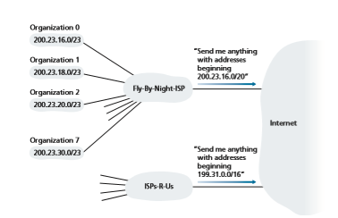
**Figure 4.21**  ♦  Hierarchical addressing and route aggregation
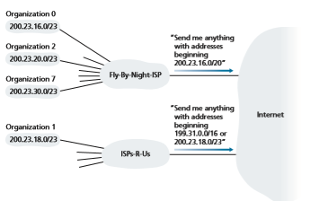
**Figure 4.22**  ♦  ISPs-R-Us has a more specific route to Organization 1
*********************************
We would be remiss if we did not mention yet another type of IP address, the IP broadcast address 255.255.255.255. When a host sends a datagram with destination address 255.255.255.255, the message is delivered to all hosts on the same subnet. Routers optionally forward the message into neighboring subnets as well (although they usually don’t).

Having now studied IP addressing in detail, we need to know how hosts and subnets get their addresses in the first place. Let’s begin by looking at how an organization gets a block of addresses for its devices, and then look at how a device (such as a host) is assigned an address from within the organization’s block of addresses.

**Obtaining a Block of Addresses**

In order to obtain a block of IP addresses for use within an organization’s subnet, a network administrator might first contact its ISP, which would provide addresses from a larger block of addresses that had already been allocated to the ISP. For example, the ISP may itself have been allocated the address block 200.23.16.0/20. The ISP, in turn, could divide its address block into eight equal-sized contiguous address blocks and give one of these address blocks out to each of up to eight organi- zations that are supported by this ISP, as shown below. (We have underlined the subnet part of these addresses for your convenience.)
```
ISP’s block: 200.23.16.0/20 11001000 00010111 00010000 00000000

Organization 0 200.23.16.0/23 11001000 00010111 00010000 00000000

Organization 1 200.23.18.0/23 11001000 00010111 00010010 00000000

Organization 2 200.23.20.0/23 11001000 00010111 00010100 00000000

 … … …

Organization 7 200.23.30.0/23 11001000 00010111 00011110 00000000
```
While obtaining a set of addresses from an ISP is one way to get a block of addresses, it is not the only way. Clearly, there must also be a way for the ISP itself to get a block of addresses. Is there a global authority that has ultimate responsibility for managing the IP address space and allocating address blocks to ISPs and other organizations? Indeed there is! IP addresses are managed under the authority of the Internet Corporation for Assigned Names and Numbers (ICANN) \[ICANN 2020\], based on guidelines set forth in \[RFC 7020\]. The role of the nonprofit ICANN organ- ization is not only to allocate IP addresses, but also to manage the DNS root servers. It also has the very contentious job of assigning domain names and resolving domain name disputes. The ICANN allocates addresses to regional Internet registries (for example, ARIN, RIPE, APNIC, and LACNIC, which together form the AddressSupporting Organization of ICANN \[ASO-ICANN 2020\]), and handle the alloca- tion/management of addresses within their regions.

**Obtaining a Host Address: The Dynamic Host Configuration Protocol**

Once an organization has obtained a block of addresses, it can assign individual IP addresses to the host and router interfaces in its organization. A system admin- istrator will typically manually configure the IP addresses into the router (often remotely, with a network management tool). Host addresses can also be config- ured manually, but typically this is done using the **Dynamic Host Configuration Protocol (DHCP)** \[RFC 2131\]. DHCP allows a host to obtain (be allocated) an IP address automatically. A network administrator can configure DHCP so that a given host receives the same IP address each time it connects to the network, or a host may be assigned a **temporary IP address** that will be different each time the host connects to the network. In addition to host IP address assignment, DHCP also allows a host to learn additional information, such as its subnet mask, the address of its first-hop router (often called the default gateway), and the address of its local DNS server.

Because of DHCP’s ability to automate the network-related aspects of connect- ing a host into a network, it is often referred to as a **plug-and-play** or **zeroconf** (zero-configuration) protocol. This capability makes it _very_ attractive to the network administrator who would otherwise have to perform these tasks manually! DHCP is also enjoying widespread use in residential Internet access networks, enterprise networks, and in wireless LANs, where hosts join and leave the network frequently. Consider, for example, the student who carries a laptop from a dormitory room to a library to a classroom. It is likely that in each location, the student will be con- necting into a new subnet and hence will need a new IP address at each location. DHCP is ideally suited to this situation, as there are many users coming and going, and addresses are needed for only a limited amount of time. The value of DHCP’s plug-and-play capability is clear, since it’s unimaginable that a system administrator would be able to reconfigure laptops at each location, and few students (except those taking a computer networking class!) would have the expertise to configure their laptops manually.

DHCP is a client-server protocol. A client is typically a newly arriving host wanting to obtain network configuration information, including an IP address for itself. In the simplest case, each subnet (in the addressing sense of Figure 4.20) will have a DHCP server. If no server is present on the subnet, a DHCP relay agent (typi- cally a router) that knows the address of a DHCP server for that network is needed. Figure 4.23 shows a DHCP server attached to subnet 223.1.2/24, with the router serving as the relay agent for arriving clients attached to subnets 223.1.1/24 and 223.1.3/24. In our discussion below, we’ll assume that a DHCP server is available on the subnet.

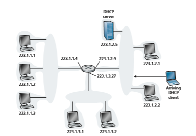
**Figure 4.23**  ♦  DHCP client and server


For a newly arriving host, the DHCP protocol is a four-step process, as shown in Figure 4.24 for the network setting shown in Figure 4.23. In this figure, yiaddr (as in “your Internet address”) indicates the address being allocated to the newly arriving client. The four steps are:

• _DHCP server discovery._ The first task of a newly arriving host is to find a DHCP server with which to interact. This is done using a **DHCP discover message**, which a client sends within a UDP packet to port 67. The UDP packet is encap- sulated in an IP datagram. But to whom should this datagram be sent? The host doesn’t even know the IP address of the network to which it is attaching, much less the address of a DHCP server for this network. Given this, the DHCP client creates an IP datagram containing its DHCP discover message along with the broadcast destination IP address of 255.255.255.255 and a “this host” source IP address of 0.0.0.0. The DHCP client passes the IP datagram to the link layer, which then broadcasts this frame to all nodes attached to the subnet (we will cover the details of link-layer broadcasting in Section 6.4).

• _DHCP server offer(s)._ A DHCP server receiving a DHCP discover message responds to the client with a **DHCP offer message** that is broadcast to all

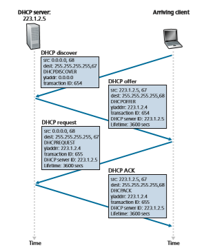
**Figure 4.24**  ♦  DHCP client-server interaction

nodes on the subnet, again using the IP broadcast address of 255.255.255.255. (You might want to think about why this server reply must also be broadcast). Since several DHCP servers can be present on the subnet, the client may find itself in the enviable position of being able to choose from among several offers. Each server offer message contains the transaction ID of the received discover message, the proposed IP address for the client, the network mask, and an IP **address lease time**—the amount of time for which the IP address will be valid. It is common for the server to set the lease time to several hours or days \[Droms 2002\].• _DHCP request._ The newly arriving client will choose from among one or more server offers and respond to its selected offer with a **DHCP request message**, echoing back the configuration parameters.

• _DHCP ACK._ The server responds to the DHCP request message with a **DHCP ACK message**, confirming the requested parameters.

Once the client receives the DHCP ACK, the interaction is complete and the client can use the DHCP-allocated IP address for the lease duration. Since a client may want to use its address beyond the lease’s expiration, DHCP also provides a mechanism that allows a client to renew its lease on an IP address.

From a mobility aspect, DHCP does have one very significant shortcoming. Since a new IP address is obtained from DHCP each time a node connects to a new subnet, a TCP connection to a remote application cannot be maintained as a mobile node moves between subnets. In Chapter 7, we will learn how mobile cel- lular networks allow a host to retain its IP address and ongoing TCP connections as it moves between base stations in a provider’s cellular network. Additional details about DHCP can be found in \[Droms 2002\] and \[dhc 2020\]. An open source refer- ence implementation of DHCP is available from the Internet Systems Consortium \[ISC 2020\].

### Network Address Translation (NAT)
Given our discussion about Internet addresses and the IPv4 datagram format, we’re now well aware that every IP-capable device needs an IP address. With the proliferation of small office, home office (SOHO) subnets, this would seem to imply that whenever a SOHO wants to install a LAN to connect multiple machines, a range of addresses would need to be allocated by the ISP to cover all of the SOHO’s IP devices (including phones, tablets, gaming devices, IP TVs, printers and more). If the subnet grew bigger, a larger block of addresses would have to be allocated. But what if the ISP had already allocated the contiguous portions of the SOHO network’s current address range? And what typical homeowner wants (or should need) to know how to manage IP addresses in the first place? Fortunately, there is a simpler approach to address allocation that has found increasingly widespread use in such scenarios: **network address translation (NAT)
 \[RFC 2663; RFC 3022; Huston 2004, Zhang 2007; Huston 2017\].

Figure 4.25 shows the operation of a NAT-enabled router. The NAT-enabled router, residing in the home, has an interface that is part of the home network on the right of Figure 4.25. Addressing within the home network is exactly as we have seen above—all four interfaces in the home network have the same subnet address of 10.0.0.0/24. The address space 10.0.0.0/8 is one of three portions of the IP address space that is reserved in \[RFC 1918\] for a **private network** or a **realm with private addresses**, such as the home network in Figure 4.25. A realm with private addresses refers to a network whose addresses only have meaning to

**Figure 4.25**  ♦  Network address translation

devices within that network. To see why this is important, consider the fact that there are hundreds of thousands of home networks, many using the same address space, 10.0.0.0/24. Devices within a given home network can send packets to each other using 10.0.0.0/24 addressing. However, packets forwarded _beyond_ the home network into the larger global Internet clearly cannot use these addresses (as either a source or a destination address) because there are hundreds of thousands of net- works using this block of addresses. That is, the 10.0.0.0/24 addresses can only have meaning within the given home network. But if private addresses only have meaning within a given network, how is addressing handled when packets are sent to or received from the global Internet, where addresses are necessarily unique? The answer lies in understanding NAT.

The NAT-enabled router does not _look_ like a router to the outside world. Instead the NAT router behaves to the outside world as a _single_ device with a _single_ IP address. In Figure 4.25, all traffic leaving the home router for the larger Internet has a source IP address of 138.76.29.7, and all traffic entering the home router must have a destination address of 138.76.29.7. In essence, the NAT-enabled router is hiding the details of the home network from the outside world. (As an aside, you might wonder where the home network computers get their addresses and where the router gets its single IP address. Often, the answer is the same—DHCP! The router gets its address from the ISP’s DHCP server, and the router runs a DHCP server to provide addresses to computers within the NAT-DHCP-router-controlled home network’s address space.)2

If all datagrams arriving at the NAT router from the WAN have the same desti- nation IP address (specifically, that of the WAN-side interface of the NAT router), then how does the router know the internal host to which it should forward a given datagram? The trick is to use a **NAT translation table** at the NAT router, and to include port numbers as well as IP addresses in the table entries.

Consider the example in Figure 4.25. Suppose a user sitting in a home net- work behind host 10.0.0.1 requests a Web page on some Web server (port 80) with IP address 128.119.40.186. The host 10.0.0.1 assigns the (arbitrary) source port number 3345 and sends the datagram into the LAN. The NAT router receives the datagram, generates a new source port number 5001 for the datagram, replaces the source IP address with its WAN-side IP address 138.76.29.7, and replaces the original source port number 3345 with the new source port number 5001. When generating a new source port number, the NAT router can select any source port number that is not currently in the NAT translation table. (Note that because a port number field is 16 bits long, the NAT protocol can support over 60,000 simul- taneous connections with a single WAN-side IP address for the router!) NAT in the router also adds an entry to its NAT translation table. The Web server, blissfully unaware that the arriving datagram containing the HTTP request has been manipulated by the NAT router, responds with a datagram whose destination address is the IP address of the NAT router, and whose destination port number is 5001. When this datagram arrives at the NAT router, the router indexes the NAT translation table using the destination IP address and destination port number to obtain the appropriate IP address (10.0.0.1) and destination port number (3345) for the browser in the home network. The router then rewrites the datagram’s destination address and destination port number, and forwards the datagram into the home network.

NAT has enjoyed widespread deployment in recent years. But NAT is not without detractors. First, one might argue that, port numbers are meant to be used for addressing processes, not for addressing hosts. This violation can indeed cause problems for servers running on the home network, since, as we have seen in Chapter 2, server processes wait for incoming requests at well- known port numbers and peers in a P2P protocol need to accept incoming con- nections when acting as servers. How can one peer connect to another peer that is behind a NAT server, and has a DHCP-provided NAT address? Technical solutions to these problems include **NAT traversal** tools \[RFC 5389\] \[RFC 5389, RFC 5128, Ford 2005\].

More “philosophical” arguments have also been raised against NAT by architectural purists. Here, the concern is that routers are meant to be layer 3 (i.e., network-layer) devices, and should process packets only up to the net- work layer. NAT violates this principle that hosts should be talking directly with each other, without interfering nodes modifying IP addresses, much less port numbers. We’ll return to this debate later in Section 4.5, when we cover middleboxes.## IPv6
 In the early 1990s, the Internet Engineering Task Force began an effort to develop a successor to the IPv4 protocol. A prime motivation for this effort was the realization that the 32-bit IPv4 address space was beginning to be used up, with new subnets
**FOCUS ON SECURITY**

**INSPECTING DATAGRAMS: FIREWALLS AND INTRUSION DETECTION SYSTEMS**

Suppose you are assigned the task of administering a home, departmental, university, or corporate network. Attackers, knowing the IP address range of your network, can easily send IP datagrams to addresses in your range. These datagrams can do all kinds of devious things, including mapping your network with ping sweeps and port scans, crashing vulnerable hosts with malformed packets, scanning for open TCP/UDP ports on servers in your network, and infecting hosts by including malware in the packets. As the network administrator, what are you going to do about all those bad guys out there, each capable of sending malicious packets into your network? Two popular defense mechanisms to malicious packet attacks are firewalls and intrusion detection systems (IDSs).

As a network administrator, you may first try installing a firewall between your network and the Internet. (Most access routers today have firewall capability.) Firewalls inspect the datagram and segment header fields, denying suspicious data- grams entry into the internal network. For example, a firewall may be configured to block all ICMP echo request packets (see Section 5.6), thereby preventing an attack- er from doing a traditional port scan across your IP address range. Firewalls can also block packets based on source and destination IP addresses and port numbers. Additionally, firewalls can be configured to track TCP connections, granting entry only to datagrams that belong to approved connections.

Additional protection can be provided with an IDS. An IDS, typically situated at the network boundary, performs “deep packet inspection,” examining not only head- er fields but also the payloads in the datagram (including application-layer data). An IDS has a database of packet signatures that are known to be part of attacks. This database is automatically updated as new attacks are discovered. As packets pass through the IDS, the IDS attempts to match header fields and payloads to the signatures in its signature database. If such a match is found, an alert is created. An intrusion prevention system (IPS) is similar to an IDS, except that it actually blocks packets in addition to creating alerts. We’ll explore firewalls and IDSs in more detail in Section 4.5 and in again Chapter 8.

Can firewalls and IDSs fully shield your network from all attacks? The answer is clearly no, as attackers continually find new attacks for which signatures are not yet available. But firewalls and traditional signature-based IDSs are useful in protecting your network from known attacks.
****************

**IPv6**

In the early 1990s, the Internet Engineering Task Force began an effort to develop a 
successor to the IPv4 protocol. A prime motivation for this effort was the realization 
that the 32-bit IPv4 address space was beginning to be used up, with new subnets
and IP nodes being attached to the Internet (and being allocated unique IP addresses) at a breathtaking rate. To respond to this need for a large IP address space, a new IP protocol, IPv6, was developed. The designers of IPv6 also took this opportunity to tweak and augment other aspects of IPv4, based on the accumulated operational experience with IPv4.

The point in time when IPv4 addresses would be completely allocated (and hence no new networks could attach to the Internet) was the subject of considerable debate. The estimates of the two leaders of the IETF’s Address Lifetime Expec- tations working group were that addresses would become exhausted in 2008 and 2018, respectively \[Solensky 1996\]. In February 2011, IANA allocated out the last remaining pool of unassigned IPv4 addresses to a regional registry. While these reg- istries still have available IPv4 addresses within their pool, once these addresses are exhausted, there are no more available address blocks that can be allocated from a central pool \[Huston 2011a\]. A recent survey of IPv4 address-space exhaustion, and the steps taken to prolong the life of the address space is \[Richter 2015\]; a recent analysis of IPv4 address use is \[Huston 2019\].

Although the mid-1990s estimates of IPv4 address depletion suggested that a considerable amount of time might be left until the IPv4 address space was exhausted, it was realized that considerable time would be needed to deploy a new technology on such an extensive scale, and so the process to develop IP version 6 (IPv6) \[RFC 2460\] was begun \[RFC 1752\]. (An often-asked question is what happened to IPv5? It was initially envisioned that the ST-2 protocol would become IPv5, but ST-2 was later dropped.) An excellent source of information about IPv6 is \[Huitema 1998\].

**IPv6 Datagram Format**

The format of the IPv6 datagram is shown in Figure 4.26. The most important changes introduced in IPv6 are evident in the datagram format:

• _Expanded addressing capabilities._ IPv6 increases the size of the IP address from 32 to 128 bits. This ensures that the world won’t run out of IP addresses. Now, every grain of sand on the planet can be IP-addressable. In addition to unicast and multicast addresses, IPv6 has introduced a new type of address, called an **anycast address**, that allows a datagram to be delivered to any one of a group of hosts. (This feature could be used, for example, to send an HTTP GET to the nearest of a number of mirror sites that contain a given document.)

• _A streamlined 40-byte header._ As discussed below, a number of IPv4 fields have been dropped or made optional. The resulting 40-byte fixed-length header allows for faster processing of the IP datagram by a router. A new encoding of options allows for more flexible options processing.

• _Flow labeling._ IPv6 has an elusive definition of a **flow**. RFC 2460 states that this allows “labeling of packets belonging to particular flows for which the sender 

**Figure 4.26**  ♦  IPv6 datagram format

requests special handling, such as a non-default quality of service or real-time service.” For example, audio and video transmission might likely be treated as a flow. On the other hand, the more traditional applications, such as file transfer and e-mail, might not be treated as flows. It is possible that the traffic carried by a high-priority user (for example, someone paying for better service for their traffic) might also be treated as a flow. What is clear, however, is that the designers of IPv6 foresaw the eventual need to be able to differentiate among the flows, even if the exact meaning of a flow had yet to be determined.

As noted above, a comparison of Figure 4.26 with Figure 4.17 reveals the sim- pler, more streamlined structure of the IPv6 datagram. The following fields are defined in IPv6:

• _Version._ This 4-bit field identifies the IP version number. Not surprisingly, IPv6 carries a value of 6 in this field. Note that putting a 4 in this field does not create a valid IPv4 datagram. (If it did, life would be a lot simpler—see the discussion below regarding the transition from IPv4 to IPv6.)

• _Traffic class._ The 8-bit traffic class field, like the TOS field in IPv4, can be used to give priority to certain datagrams within a flow, or it can be used to give pri- ority to datagrams from certain applications (for example, voice-over-IP) over datagrams from other applications (for example, SMTP e-mail).

• _Flow label._ As discussed above, this 20-bit field is used to identify a flow of datagrams.

• _Payload length._ This 16-bit value is treated as an unsigned integer giving the number of bytes in the IPv6 datagram following the fixed-length, 40-byte data- gram header.
• _Next header._ This field identifies the protocol to which the contents (data field) of this datagram will be delivered (for example, to TCP or UDP). The field uses the same values as the protocol field in the IPv4 header.

• _Hop limit._ The contents of this field are decremented by one by each router that forwards the datagram. If the hop limit count reaches zero, a router must discard that datagram.

• _Source and destination addresses._ The various formats of the IPv6 128-bit address are described in RFC 4291.

• _Data._ This is the payload portion of the IPv6 datagram. When the datagram reaches its destination, the payload will be removed from the IP datagram and passed on to the protocol specified in the next header field.

The discussion above identified the purpose of the fields that are included in the IPv6 datagram. Comparing the IPv6 datagram format in Figure 4.26 with the IPv4 datagram format that we saw in Figure 4.17, we notice that several fields appearing in the IPv4 datagram are no longer present in the IPv6 datagram:

• _Fragmentation/reassembly._ IPv6 does not allow for fragmentation and reassem- bly at intermediate routers; these operations can be performed only by the source and destination. If an IPv6 datagram received by a router is too large to be for- warded over the outgoing link, the router simply drops the datagram and sends a “Packet Too Big” ICMP error message (see Section 5.6) back to the sender. The sender can then resend the data, using a smaller IP datagram size. Fragmentation and reassembly is a time-consuming operation; removing this functionality from the routers and placing it squarely in the end systems considerably speeds up IP forwarding within the network.

• _Header checksum._ Because the transport-layer (for example, TCP and UDP) and link-layer (for example, Ethernet) protocols in the Internet layers perform check- summing, the designers of IP probably felt that this functionality was sufficiently redundant in the network layer that it could be removed. Once again, fast pro- cessing of IP packets was a central concern. Recall from our discussion of IPv4 in Section 4.3.1 that since the IPv4 header contains a TTL field (similar to the hop limit field in IPv6), the IPv4 header checksum needed to be recomputed at every router. As with fragmentation and reassembly, this too was a costly opera- tion in IPv4.

• _Options._ An options field is no longer a part of the standard IP header. How- ever, it has not gone away. Instead, the options field is one of the possible next headers pointed to from within the IPv6 header. That is, just as TCP or UDP protocol headers can be the next header within an IP packet, so too can an options field. The removal of the options field results in a fixed-length, 40-byte IP header.

**Transitioning from IPv4 to IPv6**

Now that we have seen the technical details of IPv6, let us consider a very practi- cal matter: How will the public Internet, which is based on IPv4, be transitioned to IPv6? The problem is that while new IPv6-capable systems can be made backward- compatible, that is, can send, route, and receive IPv4 datagrams, already deployed IPv4-capable systems are not capable of handling IPv6 datagrams. Several options are possible \[Huston 2011b, RFC 4213\].

One option would be to declare a flag day—a given time and date when all Internet machines would be turned off and upgraded from IPv4 to IPv6. The last major technology transition (from using NCP to using TCP for reliable transport service) occurred almost 40 years ago. Even back then \[RFC 801\], when the Internet was tiny and still being administered by a small number of “wizards,” it was real- ized that such a flag day was not possible. A flag day involving billions of devices is even more unthinkable today.

The approach to IPv4-to-IPv6 transition that has been most widely adopted in practice involves **tunneling** \[RFC 4213\]. The basic idea behind tunneling—a key concept with applications in many other scenarios beyond IPv4-to-IPv6 transition, including wide use in the all-IP cellular networks that we’ll cover in Chapter 7—is the following. Suppose two IPv6 nodes (in this example, B and E in Figure 4.27) want to interoperate using IPv6 datagrams but are connected to each other by inter- vening IPv4 routers. We refer to the intervening set of IPv4 routers between two IPv6 routers as a **tunnel**, as illustrated in Figure 4.27. With tunneling, the IPv6 node on the sending side of the tunnel (in this example, B) takes the _entire_ IPv6 datagram and puts it in the data (payload) field of an IPv4 datagram. This IPv4 datagram is then addressed to the IPv6 node on the receiving side of the tunnel (in this example, E) and sent to the first node in the tunnel (in this example, C). The intervening IPv4 routers in the tunnel route this IPv4 datagram among themselves, just as they would any other datagram, blissfully unaware that the IPv4 datagram itself contains a com- plete IPv6 datagram. The IPv6 node on the receiving side of the tunnel eventually receives the IPv4 datagram (it is the destination of the IPv4 datagram!), determines that the IPv4 datagram contains an IPv6 datagram (by observing that the protocol number field in the IPv4 datagram is 41 \[RFC 4213\], indicating that the IPv4 payload is a IPv6 datagram), extracts the IPv6 datagram, and then routes the IPv6 datagram exactly as it would if it had received the IPv6 datagram from a directly connected IPv6 neighbor.

We end this Section by noting that while the adoption of IPv6 was initially slow to take off \[Lawton 2001; Huston 2008b\], momentum has been building. NIST \[NIST IPv6 2020\] reports that more than a third of US government second-level domains are IPv6-enabled. On the client side, Google reports that about 25 percent of the clients accessing Google services do so via IPv6 \[Google IPv6 2020\]. Other recent measurements \[Czyz 2014\] indicate that IPv6 adoption has been accelerating. The proliferation of devices such as IP-enabled phones and other portable devices

**Figure 4.27**  ♦  Tunneling

provides an additional push for more widespread deployment of IPv6. Europe’s Third Generation Partnership Program \[3GPP 2020\] has specified IPv6 as the stand- ard addressing scheme for mobile multimedia.

One important lesson that we can learn from the IPv6 experience is that it is enor- mously difficult to change network-layer protocols. Since the early 1990s, numerous new network-layer protocols have been trumpeted as the next major revolution for the Internet, but most of these protocols have had limited penetration to date. These protocols include IPv6, multicast protocols, and resource reservation protocols; a dis- cussion of these latter two classes of protocols can be found in the online supplement to this text. Indeed, introducing new protocols into the network layer is like replac- ing the foundation of a house—it is difficult to do without tearing the whole house down or at least temporarily relocating the house’s residents. On the other hand, the Internet has witnessed rapid deployment of new protocols at the application layer. The classic examples, of course, are the Web, instant messaging, streaming media, distributed games, and various forms of social media. Introducing new application- layer protocols is like adding a new layer of paint to a house—it is relatively easy to do, and if you choose an attractive color, others in the neighborhood will copy you.

In summary, in the future, we can certainly expect to see changes in the Internet’s network layer, but these changes will likely occur on a time scale that is much slower than the changes that will occur at the application layer.

### Generalized Forwarding and SDN
Recall that Section 4.2.1 characterized destination-based forwarding as the two steps of looking up a destination IP address (“match”), then sending the packet into the switching fabric to the specified output port (“action”). Let’s now consider a signifi- cantly more general “match-plus-action” paradigm, where the “match” can be made over multiple header fields associated with different protocols at different layers in the protocol stack. The “action” can include forwarding the packet to one or more output ports (as in destination-based forwarding), load balancing packets across multiple outgoing interfaces that lead to a service (as in load balancing), rewriting header values (as in NAT), purposefully blocking/dropping a packet (as in a fire- wall), sending a packet to a special server for further processing and action (as in DPI), and more.

In generalized forwarding, a match-plus-action table generalizes the notion of the destination-based forwarding table that we encountered in Section 4.2.1. Because forwarding decisions may be made using network-layer and/or link-layer source and destination addresses, the forwarding devices shown in Figure 4.28 are more accurately described as “packet switches” rather than layer 3 “routers” or layer 2 “switches.” Thus, in the remainder of this Section, and in Section 5.5, we’ll refer to these devices as packet switches, adopting the terminology that is gaining wide- spread adoption in SDN literature.

Figure 4.28 shows a match-plus-action table in each packet switch, with the table being computed, installed, and updated by a remote controller. We note that while it is possible for the control components at the individual packet switches to interact with each other (e.g., in a manner similar to that in Figure 4.2), in practice, generalized match-plus-action capabilities are implemented via a remote controller that computes, installs, and updates these tables. You might take a minute to compare Figures 4.2, 4.3, and 4.28—what similarities and differences do you notice between destination-based forwarding shown in Figures 4.2 and 4.3, and generalized forward- ing shown in Figure 4.28?

Our following discussion of generalized forwarding will be based on Open- Flow \[McKeown 2008, ONF 2020, Casado 2014, Tourrilhes 2014\]—a highly visible standard that has pioneered the notion of the match-plus-action forwarding abstrac- tion and controllers, as well as the SDN revolution more generally \[Feamster 2013\]. We’ll primarily consider OpenFlow 1.0, which introduced key SDN abstractions and functionality in a particularly clear and concise manner. Later versions of OpenFlow introduced additional capabilities as a result of experience gained through
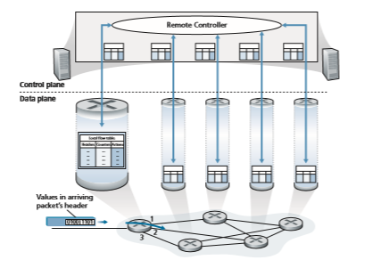
**Figure 4.28**  ♦   Generalized forwarding: Each packet switch contains a match-plus-action table that is computed and distributed by a remote controller

implementation and use; current and earlier versions of the OpenFlow standard can be found at \[ONF 2020\].

Each entry in the match-plus-action forwarding table, known as a **flow table** in OpenFlow, includes:

• _A set of header field values_ to which an incoming packet will be matched. As in the case of destination-based forwarding, hardware-based matching is most rap- idly performed in TCAM memory, with more than a million destination address entries being possible \[Bosshart 2013\]. A packet that matches no flow table entry can be dropped or sent to the remote controller for more processing. In practice, a flow table may be implemented by multiple flow tables for performance or cost reasons \[Bosshart 2013\], but we’ll focus here on the abstraction of a single flow table.Remote Controller

• _A set of counters_ that are updated as packets are matched to flow table entries. These counters might include the number of packets that have been matched by that table entry, and the time since the table entry was last updated.

• _A set of actions to be taken_ when a packet matches a flow table entry. These actions might be to forward the packet to a given output port, to drop the packet, makes copies of the packet and sent them to multiple output ports, and/or to rewrite selected header fields.

We’ll explore matching and actions in more detail in Sections 4.4.1 and 4.4.2, respectively. We’ll then study how the network-wide collection of per-packet switch matching rules can be used to implement a wide range of functions including routing, layer-2 switching, firewalling, load-balancing, virtual networks, and more in Sec- tion 4.4.3. In closing, we note that the flow table is essentially an API, the abstrac- tion through which an individual packet switch’s behavior can be programmed; we’ll see in Section 4.4.3 that network-wide behaviors can similarly be programmed by appropriately programming/configuring these tables in a _collection_ of network packet switches \[Casado 2014\].

### Match
 Figure 4.29 shows the 11 packet-header fields and the incoming port ID that can be matched in an OpenFlow 1.0 match-plus-action rule. Recall from Section 1.5.2 that a link-layer (layer 2) frame arriving to a packet switch will contain a net- work-layer (layer 3) datagram as its payload, which in turn will typically con- tain a transport-layer (layer 4) segment. The first observation we make is that OpenFlow’s match abstraction allows for a match to be made on selected fields from _three_ layers of protocol headers (thus rather brazenly defying the layer- ing principle we studied in Section 1.5). Since we’ve not yet covered the link layer, suffice it to say that the source and destination MAC addresses shown in Figure 4.29 are the link-layer addresses associated with the frame’s sending and receiving interfaces; by forwarding on the basis of Ethernet addresses rather than IP addresses, we can see that an OpenFlow-enabled device can equally perform

**Figure 4.29**  ♦  Packet matching fields, OpenFlow 1.0 flow table

as a router (layer-3 device) forwarding datagrams as well as a switch (layer-2 device) forwarding frames. The Ethernet type field corresponds to the upper layer protocol (e.g., IP) to which the frame’s payload will be de-multiplexed, and the VLAN fields are concerned with so-called virtual local area networks that we’ll study in Chapter 6. The set of 12 values that can be matched in the OpenFlow 1.0 specification has grown to 41 values in more recent OpenFlow specifications \[Bosshart 2014\].

The ingress port refers to the input port at the packet switch on which a packet is received. The packet’s IP source address, IP destination address, IP protocol field, and IP type of service fields were discussed earlier in Section 4.3.1. The transport-layer source and destination port number fields can also be matched.

Flow table entries may also have wildcards. For example, an IP address of 128.119.\*.\* in a flow table will match the corresponding address field of any data- gram that has 128.119 as the first 16 bits of its address. Each flow table entry also has an associated priority. If a packet matches multiple flow table entries, the selected match and corresponding action will be that of the highest priority entry with which the packet matches.

Lastly, we observe that not all fields in an IP header can be matched. For exam- ple OpenFlow does _not_ allow matching on the basis of TTL field or datagram length field. Why are some fields allowed for matching, while others are not? Undoubtedly, the answer has to do with the tradeoff between functionality and complexity. The “art” in choosing an abstraction is to provide for enough functionality to accomplish a task (in this case to implement, configure, and manage a wide range of network- layer functions that had previously been implemented through an assortment of network-layer devices), without over-burdening the abstraction with so much detail and generality that it becomes bloated and unusable. Butler Lampson has famously noted \[Lampson 1983\]:

_Do one thing at a time, and do it well. An interface should capture the minimum essentials of an abstraction. Don’t generalize; generalizations are generally wrong._

Given OpenFlow’s success, one can surmise that its designers indeed chose their abstraction well. Additional details of OpenFlow matching can be found in \[ONF 2020\].

### Action
 As shown in Figure 4.28, each flow table entry has a list of zero or more actions that determine the processing that is to be applied to a packet that matches a flow table entry. If there are multiple actions, they are performed in the order specified in the list.Among the most important possible actions are:

• _Forwarding._ An incoming packet may be forwarded to a particular physical output port, broadcast over all ports (except the port on which it arrived) or multicast over a selected set of ports. The packet may be encapsulated and sent to the remote controller for this device. That controller then may (or may not) take some action on that packet, including installing new flow table entries, and may return the packet to the device for forwarding under the updated set of flow table rules.

• _Dropping._ A flow table entry with no action indicates that a matched packet should be dropped.

• _Modify-field._ The values in 10 packet-header fields (all layer 2, 3, and 4 fields shown in Figure 4.29 except the IP Protocol field) may be re-written before the packet is forwarded to the chosen output port.

### OpenFlow Examples of Match-plus-action in Action
 Having now considered both the match and action components of generalized forwarding, let’s put these ideas together in the context of the sample network shown in Figure 4.30. The network has 6 hosts (h1, h2, h3, h4, h5 and h6) and three packet switches (s1, s2 and s3), each with four local interfaces (numbered 1 through 4). We’ll consider a number of network-wide behaviors that we’d like to implement, and the flow table entries in s1, s2 and s3 needed to implement this behavior.

**Figure 4.30**  ♦   OpenFlow match-plus-action network with three packet switches, 6 hosts, and an OpenFlow controller

**A First Example: Simple Forwarding**

As a very simple example, suppose that the desired forwarding behavior is that packets from h5 or h6 destined to h3 or h4 are to be forwarded from s3 to s1, and then from s1 to s2 (thus completely avoiding the use of the link between s3 and s2). The flow table entry in s1 would be:
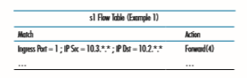
Of course, we’ll also need a flow table entry in s3 so that datagrams sent from h5 or h6 are forwarded to s1 over outgoing interface 3:
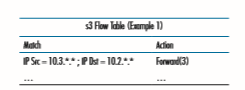
Lastly, we’ll also need a flow table entry in s2 to complete this first example, so that datagrams arriving from s1 are forwarded to their destination, either host h3 or h4:


**A Second Example: Load Balancing**

As a second example, let’s consider a load-balancing scenario, where datagrams from h3 destined to 10.1.\*.\* are to be forwarded over the direct link between s2 and s1, while datagrams from h4 destined to 10.1.\*.\* are to be forwarded over the link between s2 and s3 (and then from s3 to s1). Note that this behavior couldn’t be achieved with IP’s destination-based forwarding. In this case, the flow table in s2 would be:s2 Flow Table (Example 2)


Flow table entries are also needed at s1 to forward the datagrams received from s2 to either h1 or h2; and flow table entries are needed at s3 to forward datagrams received on interface 4 from s2 over interface 3 toward s1. See if you can figure out these flow table entries at s1 and s3.

**A Third Example: Firewalling**

As a third example, let’s consider a firewall scenario in which s2 wants only to receive (on any of its interfaces) traffic sent from hosts attached to s3.
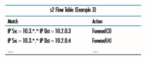

If there were no other entries in s2’s flow table, then only traffic from 10.3.\*.\* would be forwarded to the hosts attached to s2.

Although we’ve only considered a few basic scenarios here, the versatility and advantages of generalized forwarding are hopefully apparent. In homework prob- lems, we’ll explore how flow tables can be used to create many different logical behaviors, including virtual networks—two or more logically separate networks (each with their own independent and distinct forwarding behavior)—that use the _same_ physical set of packet switches and links. In Section 5.5, we’ll return to flow tables when we study the SDN controllers that compute and distribute the flow tables, and the protocol used for communicating between a packet switch and its controller.

The match-plus-action flow tables that we’ve seen in this Section are actually a limited form of _programmability_, specifying how a router should forward and manipulate (e.g., change a header field) a datagram, based on the match between the datagram’s header values and the matching conditions. One could imagine an even richer form of programmability—a programming language with higher-level constructs such as variables, general purpose arithmetic and Boolean operations, variables, functions, and conditional statements, as well as constructs specificallydesigned for datagram processing at line rate. P4 (Programming Protocol-independent Packet Processors) \[P4 2020\] is such a language, and has gained considerable inter- est and traction since its introduction five years ago \[Bosshart 2014\].

## Middleboxes

Routers are the workhorses of the network layer, and in this chapter, we’ve learned how they accomplish their “bread and butter” job of forwarding IP datagrams toward their destination. But in this chapter, and in earlier chapters, we’ve also encoun- tered other network equipment (“boxes”) within the network that sit on the data path and perform functions other than forwarding. We encountered Web caches in Sec- tion 2.2.5; TCP connection splitters in Section 3.7; and network address translation (NAT), firewalls, and intrusion detection systems in Section 4.3.4. We learned in Section 4.4 that generalized forwarding allows a modern router to easily and natu- rally perform firewalling and load balancing with generalized “match plus action” operations.

In the past 20 years, we’ve seen tremendous growth in such **middleboxes**, which RFC 3234 defines as:

_“any intermediary box performing functions apart from normal, standard func- tions of an IP router on the data path between a source host and destination host”_

We can broadly identify three types of services performed by middleboxes:

• _NAT Translation._ As we saw in Section 4.3.4, NAT boxes implement private network addressing, rewriting datagram header IP addresses and port numbers.

• _Security Services._ Firewalls block traffic based on header-field values or redirect packets for additional processing, such as deep packet inspection (DPI). Intru- sion Detection Systems (IDS) are able to detect predetermined patterns and filter packets accordingly. Application-level e-mail filters block e-mails considered to be junk, phishing or otherwise posing a security threat.

• _Performance Enhancement._ These middleboxes perform services such as com- pression, content caching, and load balancing of service requests (e.g., an HTTP request, or a search engine query) to one of a set of servers that can provide the desired service.

Many other middleboxes \[RFC 3234\] provide capabilities belonging to these three types of services, in both wired and wireless cellular \[Wang 2011\] networks.

With the proliferation of middleboxes comes the attendant need to operate, manage, and upgrade this equipment. Separate specialized hardware boxes, separatesoftware stacks, and separate management/operation skills translate to significant operational and capital costs. It is perhaps not surprising then that researchers are exploring the use of commodity hardware (networking, computing, and storage) with specialized software built on top of a common software stack—_exactly_ the approach taken in SDN a decade earlier—to implement these services. This approach has become known as **network function virtualization (NFV)** \[Mijumbi 2016\]. An alternate approach that has also been explored is to outsource middlebox functional- ity to the cloud \[Sherry 2012\].

For many years, the Internet architecture had a clear separation between the network layer and the transport/application layers. In these “good old days,” the network layer consisted of routers, operating within the network _core_, to forward datagrams toward their destinations using fields only in the IP datagram header. The transport and application layers were implemented in hosts operating at the network _edge_. Hosts exchanged packets among themselves in transport-layer segments and application-layer messages. Today’s middleboxes clearly violate this separation: a NAT box, sitting between a router and host, rewrites network-layer IP addresses and transport-layer port numbers; an in-network firewall blocks suspect datagrams using application-layer (e.g., HTTP), transport-layer, and network-layer header fields; e-mail security gateways are injected between the e-mail sender (whether malicious or not) and the intended e-mail receiver, filtering application-layer e-mail messages based on whitelisted/blacklisted IP addresses as well as e-mail message content. While there are those who have considered such middleboxes as a bit of an archi- tectural abomination \[Garfinkel 2003\], others have adopted the philosophy that such middleboxes “exist for important and permanent reasons”—that they fill an important need—and that we’ll have more, not fewer, middleboxes in the future \[Walfish 2004\]. See the Section in attached sidebar on “The end-to-end argument” for a slightly differ- ent lens on the question of where to place service functionality in a network.

**PRINCIPLES IN PRACTICE**

**ARCHITECTURAL PRINCIPLES OF THE INTERNET**

Given the phenomenal success of the Internet, one might naturally wonder about the architectural principles that have guided the development of what is arguably the larg- est and most complex engineered system ever built by humankind. RFC 1958, entitled “Architectural Principles of the Internet,” suggests that these principles, if indeed they exist, are truly minimal:

“Many members of the Internet community would argue that there is no architecture, but only a tradition, which was not written down for the first 25 years (or at least not by the IAB). However, in very general terms, the community believes that the goal is connectivity, the tool is the Internet Protocol, and the intelligence is end to end rather than hidden in the network.” \[RFC 1958\]

So there we have it! The goal was to provide connectivity, there would be just one net- work-layer protocol (the celebrated IP protocol we have studied in this chapter), and “intelli- gence” (one might say the “complexity”) would be placed at the network edge, rather than in the network core. Let’s look these last two considerations in a bit more detail.

**THE IP HOURGLASS**

By now, we’re well acquainted with the five-layer Internet protocol stack that we first encountered in Figure 1.23. Another visualization of this stack, shown in Figure 4.31 and sometimes known as the “**IP hourglass**,” illustrates the “**narrow waist**” of the layered Internet architecture. While the Internet has many protocols in the physical, link, transport, and application layers, there is only _one_ network layer protocol—the IP protocol. This is the one protocol that _must_ be implemented by each and every of the billions of Internet- connected devices. This narrow waist has played a critical role in the phenomenal growth of the Internet. The relative simplicity of the IP protocol, and the fact that it is the _only_ universal requirement for Internet connectivity has allowed a rich variety of networks—with very different underlying link-layer technologies, from Ethernet to WiFi to cellular to optical networks to become part of the Internet. \[Clark 1997\] notes that role of the narrow waist, which he refers to as a “spanning layer,” is to “… hide the detailed differences among these various \[underlying\] technologies and present a uniform service interface to the appli- cations above.” For the IP layer in particular: “How does the IP spanning layer achieve its purpose? It defines a basic set of services, which were carefully designed so that they could be constructed from a wide range of underlying network technologies. Software, as a part of the Internet \[i.e., network\] layer, translates what each of these lower-layer tech- nologies offers into the common service of the Internet layer.”

For a discussion the narrow waist, including examples beyond the Internet, see \[Beck 2019; Akhshabi 2011\]. We note here that as the Internet architecture enters mid-life (certainly,


**Figure 4.31** ♦ The narrow-waisted Internet hourglass

the Internet’s age of 40 to 50 years qualifies it for middle age!), one might observe that its “narrow waist” may indeed be widening a bit (as often happens in middle age!) via the rise of middleboxes.

**THE END-TO-END ARGUMENT**

The third principle in RFC 1958—that “intelligence is end to end rather than hidden in the network”—speaks to the placement of functionality within the network. Here, we’ve seen that until the recent rise of middleboxes, most Internet functionality was indeed placed at the network’s edge. It’s worth noting that, in direct contrast with the 20th century telephone network—which had “dumb” (non-programmable) endpoints and smart switches—the Internet has always had smart endpoints (programmable computers), enabling complex functionality to be placed at those endpoints. But a more principled argument for actually placing functionality at the endpoints was made in an extremely influential paper \[Saltzer 1984\] that articulated the “end-to-end argument.” It stated:

“ . . . there is a list of functions each of which might be implemented in any of several ways: by the communication subsystem, by its client, as a joint venture, or perhaps redundantly, each doing its own version. In reasoning about this choice, the require- ments of the application provide the basis for a class of arguments, which go as follows:

The function in question can completely and correctly be implemented only with the knowledge and help of the application standing at the end points of the com- munication system. Therefore, providing that questioned function as a feature of the communication system itself is not possible. (Sometimes an incomplete version of the function provided by the communication system may be useful as a performance enhancement.)

We call this line of reasoning against low-level function implementation the “end-to-end argument.”

An example illustrating the end-to-end argument is that of reliable data transfer. Since packets can be lost within the network (e.g., even without buffer overflows, a router hold- ing a queued packet could crash, or a portion of the network in which a packet is queued becomes detached due to link failures), the endpoints (in this case via the TCP protocol) _must_ perform error control. As we will see in Chapter 6, some link-layer protocols do indeed perform local error control, but this local error control alone is “incomplete” and not sufficient to provide end-to-end reliable data transfer. And so reliable data transfer must be implemented end to end.

RFC 1958 deliberately includes only two references, both of which are “fundamental papers on the Internet architecture.” One of these is the end-to-end paper itself \[Saltzer 1984\]; the second paper \[Clark 1988\] discusses the design philosophy of the DARPA Internet Protocols. Both are interesting “must reads” for anyone interested in Internet architecture. Follow-ons to \[Clark 1988\] are \[Blumenthal 2001; Clark 2005\] which reconsider Internet architecture in light of the much more complex environment in which today’s Internet must now operate.
******************************

## Summary

In this chapter, we’ve covered the **data plane** functions of the network layer—the _per- router_ functions that determine how packets arriving on one of a router’s input links are forwarded to one of that router’s output links. We began by taking a detailed look at the internal operations of a router, studying input and output port functionality and destination- based forwarding, a router’s internal switching mechanism, packet queue management and more. We covered both traditional IP forwarding (where forwarding is based on a data- gram’s destination address) and generalized forwarding (where forwarding and other func- tions may be performed using values in several different fields in the datagram’s header) and seen the versatility of the latter approach. We also studied the IPv4 and IPv6 protocols in detail, and Internet addressing, which we found to be much deeper, subtler, and more interesting than we might have expected. We completed our study of the network-layer data plane with a study of middleboxes, and a broad discussion of Internet architecture.

With our newfound understanding of the network-layer’s data plane, we’re now ready to dive into the network layer’s control plane in Chapter 5!

**Homework Problems and Questions**
***************************
**Chapter 4 Review Questions** 

Section 4.1 

R1. Let’s review some of the terminology used in this textbook. Recall that the name of a transport-layer packet is _segment_ and that the name of a link-layer packet is _frame_. What is the name of a network-layer packet? Recall that both routers and link-layer switches are called _packet switches_. What is the funda- mental difference between a router and link-layer switch?

R2. We noted that network layer functionality can be broadly divided into data plane functionality and control plane functionality. What are the main functions of the data plane? Of the control plane?

R3. We made a distinction between the forwarding function and the routing func- tion performed in the network layer. What are the key differences between routing and forwarding?

R4. What is the role of the forwarding table within a router?

R5. We said that a network layer’s service model “defines the characteristics of end-to-end transport of packets between sending and receiving hosts.” What is the service model of the Internet’s network layer? What guarantees are made by the Internet’s service model regarding the host-to-host delivery of datagrams?

Section 4.2 

R6. In Section 4.2, we saw that a router typically consists of input ports, output ports,

a switching fabric and a routing processor. Which of these are implemented in
HOMEWORK PROBLEMs AND QuEsTiONs 

hardware and which are implemented in software? Why? Returning to the notion of the network layer’s data plane and control plane, which are imple- mented in hardware and which are implemented in software? Why?

R7. How can the input ports of a high-speed router facilitate fast forwarding decisions?

R8. What is meant by destination-based forwarding? How does this differ from generalized forwarding (assuming you’ve read Section 4.4, which of the two approaches are adopted by Software-Defined Networking)?

R9. Suppose that an arriving packet matches two or more entries in a router’s forwarding table. With traditional destination-based forwarding, what rule does a router apply to determine which of these rules should be applied to determine the output port to which the arriving packet should be switched?

R10. Switching in a router forwards data from an input port to an output port. What is the advantage of switching via an interconnection network over switching via memory and switching via bus?

R11. What is the role of a _packet scheduler_ at the output port of a router?

R12. a. What is a drop-tail policy?

b. What are AQM algorithms?

c. Name one of the most widely studied and implemented AQM algorithms and explain how it works.

R13. What is HOL blocking? Does it occur in input ports or output ports?

R14. In Section 4.2, we studied FIFO, Priority, Round Robin (RR), and Weighted Fair Queuing (WFQ) packet scheduling disciplines? Which of these queuing disciplines ensure that all packets depart in the order in which they arrived?

R15. Give an example showing why a network operator might want one class of packets to be given priority over another class of packets.

R16. What is an essential different between RR and WFQ packet scheduling? Is there a case (_Hint:_ Consider the WFQ weights) where RR and WFQ will behave exactly the same?

Section 4.3 R17. Suppose Host A sends Host B a TCP segment encapsulated in an IP data-

gram. When Host B receives the datagram, how does the network layer in Host B know it should pass the segment (that is, the payload of the datagram) to TCP rather than to UDP or to some other upper-layer protocol?

R18. What field in the IP header can be used to ensure that a packet is forwarded through no more than _N_ routers?

R19. Recall that we saw the Internet checksum being used in both transport-layer segment (in UDP and TCP headers, Figures 3.7 and 3.29 respectively) and in network-layer datagrams (IP header, Figure 4.17). Now consider a transportlayer segment encapsulated in an IP datagram. Are the checksums in the seg- ment header and datagram header computed over any common bytes in the IP datagram? Explain your answer.

R20. When a large datagram is fragmented into multiple smaller datagrams, where are these smaller datagrams reassembled into a single larger datagram?

R21. How many IP addresses does a router have?

R22. What is the 32-bit binary equivalent of the IP address 202.3.14.25?

R23. Visit a host that uses DHCP to obtain its IP address, network mask, default router, and IP address of its local DNS server. List these values.

R24. Suppose there are four routers between a source host and a destination host. Ignoring fragmentation, an IP datagram sent from the source host to the destination host will travel over how many interfaces? How many forwarding tables will be indexed to move the datagram from the source to the destination?

R25. Suppose an application generates chunks of 40 bytes of data every 20 msec, and each chunk gets encapsulated in a TCP segment and then an IP datagram. What percentage of each datagram will be overhead, and what percentage will be application data?

R26. Suppose you purchase a wireless router and connect it to your cable modem. Also suppose that your ISP dynamically assigns your connected device (that is, your wireless router) one IP address. Also suppose that you have five PCs at home that use 802.11 to wirelessly connect to your wireless router. How are IP addresses assigned to the five PCs? Does the wireless router use NAT? Why or why not?

R27. What is meant by the term “route aggregation”? Why is it useful for a router to perform route aggregation?

R28. What is meant by a “plug-and-play” or “zeroconf” protocol?

R29. What is a private network address? Should a datagram with a private network address ever be present in the larger public Internet? Explain.

R30. Compare and contrast the IPv4 and the IPv6 header fields. Do they have any fields in common?

R31. It has been said that when IPv6 tunnels through IPv4 routers, IPv6 treats the IPv4 tunnels as link-layer protocols. Do you agree with this statement? Why or why not?

Section 4.4 R32. How does generalized forwarding differ from destination-based forwarding?

R33. What is the difference between a forwarding table that we encountered in destination-based forwarding in Section 4.1 and OpenFlow’s flow table that we encountered in Section 4.4?
PROBLEMs 

R34. What is meant by the “match plus action” operation of a router or switch? In the case of destination-based forwarding packet switch, what is matched and what is the action taken? In the case of an SDN, name three fields that can be matched, and three actions that can be taken.

R35. Name three header fields in an IP datagram that can be “matched” in Open- Flow 1.0 generalized forwarding. What are three IP datagram header fields that _cannot_ be “matched” in OpenFlow?

**Problems**
********************************
P1. Consider the network below.

a. Show the forwarding table in router A, such that all traffic destined to host H3 is forwarded through interface 3.

b. Can you write down a forwarding table in router A, such that all traffic from H1 destined to host H3 is forwarded through interface 3, while all traffic from H2 destined to host H3 is forwarded through interface 4? (_Hint:_ This is a trick question.)

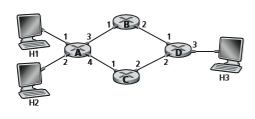

P2. Suppose two packets arrive to two different input ports of a router at exactly the same time. Also suppose there are no other packets anywhere in the router.

a. Suppose the two packets are to be forwarded to two different output ports. Is it possible to forward the two packets through the switch fabric at the same time when the fabric uses a shared bus?

b. Suppose the two packets are to be forwarded to two different output ports. Is it possible to forward the two packets through the switch fabric at the same time when the fabric uses switching via memory?

c. Suppose the two packets are to be forwarded to the same output port. Is it possible to forward the two packets through the switch fabric at the same time when the fabric uses a crossbar?P3. In Section 4.2.4, it was said that if _R\_switch_ is _N_ times faster than _R\_line_, then only negligible queuing will occur at the input ports, even if all the packets are to be forwarded to the same output port. Now suppose that _R\_switch = R\_line_, but all packets are to be forwarded to different output ports. Let _D_ be the time to transmit a packet. As a function of _D_, what is the maximum input queuing delay for a packet for the (a) memory, (b) bus, and (c) crossbar switching fabrics?

P4. Consider the switch shown below. Suppose that all datagrams have the same fixed length, that the switch operates in a slotted, synchronous manner, and that in one time slot a datagram can be transferred from an input port to an output port. The switch fabric is a crossbar so that at most one datagram can be transferred to a given output port in a time slot, but different output ports can receive datagrams from different input ports in a single time slot. What is the minimal number of time slots needed to transfer the packets shown from input ports to their output ports, assuming any input queue scheduling order you want (i.e., it need not have HOL blocking)? What is the largest number of slots needed, assuming the worst-case scheduling order you can devise, assuming that a non-empty input queue is never idle?
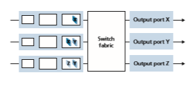
P5. Suppose that the WEQ scheduling policy is applied to a buffer that supports three classes, and suppose the weights are 0.5, 0.25, and 0.25 for the three classes.

a. Suppose that each class has a large number of packets in the buffer. In what sequence might the three classes be served in order to achieve the WFQ weights? (For round robin scheduling, a natural sequence is 123123123 . . .).

b. Suppose that classes 1 and 2 have a large number of packets in the buffer, and there are no class 3 packets in the buffer. In what sequence might the three classes be served in to achieve the WFQ weights?
PROBLEMs 

P6. Consider the figure below. Answer the following questions:
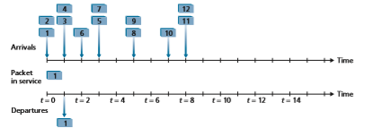
a. Assuming FIFO service, indicate the time at which packets 2 through 12 each leave the queue. For each packet, what is the delay between its arrival and the beginning of the slot in which it is transmitted? What is the average of this delay over all 12 packets?

b. Now assume a priority service, and assume that odd-numbered packets are high priority, and even-numbered packets are low priority. Indicate the time at which packets 2 through 12 each leave the queue. For each packet, what is the delay between its arrival and the beginning of the slot in which it is transmitted? What is the average of this delay over all 12 packets?

c. Now assume round robin service. Assume that packets 1, 2, 3, 6, 11, and 12 are from class 1, and packets 4, 5, 7, 8, 9, and 10 are from class 2. Indicate the time at which packets 2 through 12 each leave the queue. For each packet, what is the delay between its arrival and its departure? What is the average delay over all 12 packets?

d. Now assume weighted fair queuing (WFQ) service. Assume that odd- numbered packets are from class 1, and even-numbered packets are from class 2. Class 1 has a WFQ weight of 2, while class 2 has a WFQ weight of 1. Note that it may not be possible to achieve an idealized WFQ sched- ule as described in the text, so indicate why you have chosen the particu- lar packet to go into service at each time slot. For each packet what is the delay between its arrival and its departure? What is the average delay over all 12 packets?

e. What do you notice about the average delay in all four cases (FIFO, RR, priority, and WFQ)?


P7. Consider again the figure for P6.

a. Assume a priority service, with packets 1, 4, 5, 6, and 11 being high- priority packets. The remaining packets are low priority. Indicate the slots in which packets 2 through 12 each leave the queue.

b. Now suppose that round robin service is used, with packets 1, 4, 5, 6, and 11 belonging to one class of traffic, and the remaining packets belonging to the second class of traffic. Indicate the slots in which packets 2 through 12 each leave the queue.

c. Now suppose that WFQ service is used, with packets 1, 4, 5, 6, and 11 belonging to one class of traffic, and the remaining packets belonging to the second class of traffic. Class 1 has a WFQ weight of 1, while class 2 has a WFQ weight of 2 (note that these weights are different than in the previous question). Indicate the slots in which packets 2 through 12 each leave the queue. See also the caveat in the question above regarding WFQ service.

P8. Consider a datagram network using 32-bit host addresses. Suppose a router has four links, numbered 0 through 3, and packets are to be forwarded to the link interfaces as follows:

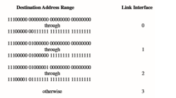
a. Provide a forwarding table that has five entries, uses longest prefix match- ing, and forwards packets to the correct link interfaces.

b. Describe how your forwarding table determines the appropriate link inter- face for datagrams with destination addresses:

11001000 10010001 01010001 01010101 
11100001 01000000 11000011 00111100 
11100001 10000000 00010001 01110111


P9. Consider a datagram network using 8-bit host addresses. Suppose a router uses longest prefix matching and has the following forwarding table:

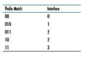
For each of the four interfaces, give the associated range of destination host addresses and the number of addresses in the range.

P10. Consider a datagram network using 8-bit host addresses. Suppose a router uses longest prefix matching and has the following forwarding table:
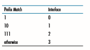
For each of the four interfaces, give the associated range of destination host addresses and the number of addresses in the range.

P11. Consider a router that interconnects three subnets: Subnet 1, Subnet 2, and Subnet 3. Suppose all of the interfaces in each of these three subnets are required to have the prefix 223.1.17/24. Also suppose that Subnet 1 is required to support at least 60 interfaces, Subnet 2 is to support at least 90 interfaces, and Subnet 3 is to support at least 12 interfaces. Provide three network addresses (of the form a.b.c.d/x) that satisfy these constraints.

P12. In Section 4.2.2, an example forwarding table (using longest prefix matching) is given. Rewrite this forwarding table using the a.b.c.d/x notation instead of the binary string notation.

P13. In Problem P8, you are asked to provide a forwarding table (using longest prefix matching). Rewrite this forwarding table using the a.b.c.d/x notation instead of the binary string notation.

P14. Consider a subnet with prefix 128.119.40.128/26. Give an example of one IP address (of form xxx.xxx.xxx.xxx) that can be assigned to this network.Suppose an ISP owns the block of addresses of the form 128.119.40.64/26. Suppose it wants to create four subnets from this block, with each block having the same number of IP addresses. What are the prefixes (of form a.b.c.d/x) for the four subnets?

P15. Consider the topology shown in Figure 4.20. Denote the three subnets with hosts (starting clockwise at 12:00) as Networks A, B, and C. Denote the subnets without hosts as Networks D, E, and F. 

a. Assign network addresses to each of these six subnets, with the following constraints: All addresses must be allocated from 214.97.254/23; Subnet A should have enough addresses to support 250 interfaces; Subnet B should have enough addresses to support 120 interfaces; and Subnet C should have enough addresses to support 120 interfaces. Of course, subnets D, E and F should each be able to support two interfaces. For each subnet, the assignment should take the form a.b.c.d/x or a.b.c.d/x – e.f.g.h/y.

b. Using your answer to part (a), provide the forwarding tables (using long- est prefix matching) for each of the three routers.

P16. Use the whois service at the American Registry for Internet Numbers (http://www.arin.net/whois) to determine the IP address blocks for three universities. Can the whois services be used to determine with certainty the geographical location of a specific IP address? Use www.maxmind.com to determine the locations of the Web servers at each of these universities.

P17. Suppose datagrams are limited to 1,500 bytes (including header) between source Host A and destination Host B. Assuming a 20-byte IP header, how many datagrams would be required to send an MP3 consisting of 5 million bytes? Explain how you computed your answer.

P18. Consider the network setup in Figure 4.25. Suppose that the ISP instead assigns the router the address 24.34.101.225 and that the network address of the home network is 192.168.0/24.

a. Assign addresses to all interfaces in the home network.

b. Suppose each host has two ongoing TCP connections, all to port 80 at host 128.119.40.86. Provide the six corresponding entries in the NAT translation table.

P19. Suppose you are interested in detecting the number of hosts behind a NAT. You observe that the IP layer stamps an identification number sequentially on each IP packet. The identification number of the first IP packet generated by a host is a random number, and the identification numbers of the subsequent IP packets are sequentially assigned. Assume all IP packets generated by hosts behind the NAT are sent to the outside world.

a. Based on this observation, and assuming you can sniff all packets sent by the NAT to the outside, can you outline a simple technique that detects the number of unique hosts behind a NAT? Justify your answer.


b. If the identification numbers are not sequentially assigned but randomly assigned, would your technique work? Justify your answer.

P20. In this problem, we’ll explore the impact of NATs on P2P applications. Suppose a peer with username Arnold discovers through querying that a peer with username Bernard has a file it wants to download. Also suppose that Bernard and Arnold are both behind a NAT. Try to devise a technique that will allow Arnold to establish a TCP connection with Bernard without application-specific NAT configuration. If you have difficulty devising such a technique, discuss why.

P21. Consider the SDN OpenFlow network shown in Figure 4.30. Suppose that the desired forwarding behavior for datagrams arriving at s2 is as follows:

• any datagrams arriving on input port 1 from hosts h5 or h6 that are des- tined to hosts h1 or h2 should be forwarded over output port 2;

• any datagrams arriving on input port 2 from hosts h1 or h2 that are des- tined to hosts h5 or h6 should be forwarded over output port 1;

• any arriving datagrams on input ports 1 or 2 and destined to hosts h3 or h4 should be delivered to the host specified;

• hosts h3 and h4 should be able to send datagrams to each other.

Specify the flow table entries in s2 that implement this forwarding behavior.

P22. Consider again the SDN OpenFlow network shown in Figure 4.30. Suppose that the desired forwarding behavior for datagrams arriving from hosts h3 or h4 at s2 is as follows:

• any datagrams arriving from host h3 and destined for h1, h2, h5 or h6 should be forwarded in a clockwise direction in the network;

• any datagrams arriving from host h4 and destined for h1, h2, h5 or h6 should be forwarded in a counter-clockwise direction in the network.

Specify the flow table entries in s2 that implement this forwarding behavior.

P23. Consider again the scenario from P21 above. Give the flow tables entries at packet switches s1 and s3, such that any arriving datagrams with a source address of h3 or h4 are routed to the destination hosts specified in the desti- nation address field in the IP datagram. (_Hint:_ Your forwarding table rules should include the cases that an arriving datagram is destined for a directly attached host or should be forwarded to a neighboring router for eventual host delivery there.)

P24. Consider again the SDN OpenFlow network shown in Figure 4.30. Suppose we want switch s2 to function as a firewall. Specify the flow table in s2 that implements the following firewall behaviors (specify a different flow table for each of the four firewalling behaviors below) for delivery of datagramsdestined to h3 and h4. You do not need to specify the forwarding behavior in s2 that forwards traffic to other routers.

• Only traffic arriving from hosts h1 and h6 should be delivered to hosts h3 or h4 (i.e., that arriving traffic from hosts h2 and h5 is blocked).

• Only TCP traffic is allowed to be delivered to hosts h3 or h4 (i.e., that UDP traffic is blocked).

• Only traffic destined to h3 is to be delivered (i.e., all traffic to h4 is blocked).

• Only UDP traffic from h1 and destined to h3 is to be delivered. All other traffic is blocked.

P25. Consider the Internet protocol stack in Figures 1.23 and 4.31. Would you consider the ICMP protocol to be a network-layer protocol or a transport- layer protocol? Justify your answer.

**Wireshark Lab: IP**
***********************************
In the Web site for this textbook, www.pearsonglobaleditions.com, you’ll find a Wireshark lab assignment that examines the operation of the IP protocol, and the IP datagram format in particular.

**AN INTERVIEW WITH…**


**Vinton G. Cerf**

Vinton G. Cerf has served as Vice President and Chief Internet Evangelist for Google since 2005. He served for over 15 years at MCI in various positions, ending up his tenure there as Senior Vice President for Technology Strategy. He is widely known as the co-designer of the TCP/IP protocols and the architecture of the Internet. During his time from 1976 to 1982 at the US Department of Defense Advanced Research Projects Agency (DARPA), he played a key role leading the development of Internet and Internet-related packet communication and security techniques. He received the US Presidential Medal of Freedom in 2005 and the US National Medal of Technology in 1997. He holds a BS in Mathematics from Stanford University and an MS and PhD in computer science from UCLA.


**What brought you to specialize in networking?** 

I was working as a programmer at UCLA in the late 1960s. My job was supported by the US Defense Advanced Research Projects Agency (called ARPA then and DARPA now). I was working in the laboratory of Professor Leonard Kleinrock in the Network Measurement Center of the newly created ARPANet. The first node of the ARPANet was installed at UCLA on September 1, 1969. I was responsible for programming a computer that was used to capture performance information about the ARPANet and to report this information back for comparison with mathematical models and predictions of the performance of the network.

Several of the other graduate students and I were made responsible for working on the so-called host-level protocols of the ARPAnet—the procedures and formats that would allow many different kinds of computers on the network to interact with each other. It was a fascinating exploration into a new world (for me) of distributed computing and communication.

**Did you imagine that IP would become as pervasive as it is today when you first designed the protocol?**

 When Bob Kahn and I first worked on this in 1973, I think we were mostly very focused on the central question: How can we make heterogeneous packet networks interoperate with one another, assuming we cannot actually change the networks themselves? We hoped that we could find a way to permit an arbitrary collection of packet-switched networks to be interconnected in a transparent fashion, so that host computers could communicate end-to- end without having to do any translations in between. I think we knew that we were dealing

**What do you now envision for the future of networking and the Internet? What major challenges/obstacles do you think lie ahead in their development?**

 I believe the Internet itself and networks in general will continue to proliferate. There are already billions of Internet-enabled devices on the Internet, including appliances like cell phones, refrigerators, personal digital assistants, home servers, televisions, as well as the usual array of laptops, servers, and so on. Big challenges include support for mobility, bat- tery life, capacity of the access links to the network, and ability to scale the optical core of the network in an unlimited fashion. The interplanetary extension of the Internet is a project that is well underway at NASA and other space agencies. We still need to add IPv6 \[128- bit\] addressing to the original IPv4 \[32-bit addresses\] packet format. The list is long!

**Who has inspired you professionally?**

My colleague Bob Kahn; my thesis advisor, Gerald Estrin; my best friend, Steve Crocker (we met in high school and he introduced me to computers in 1960!); and the thousands of engineers who continue to evolve the Internet today.

**Do you have any advice for students entering the networking/Internet field?**

Think outside the limitations of existing systems—imagine what might be possible; but then do the hard work of figuring out how to get there from the current state of affairs. Dare to dream. The “Internet of Things” is the next big phase of Internet expansion. Safety, security, privacy, reliability, and autonomy all need attention. The interplanetary extension of the terrestrial Internet started as a speculative design but is becoming a reality. It may take decades to implement this, mission by mission, but to paraphrase: “A man’s reach should exceed his grasp, or what are the heavens for?”
