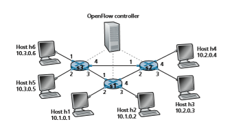
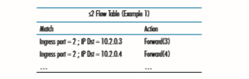
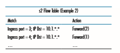

### Generalized Forwarding and SDN
Recall that Section 4.2.1 characterized destination-based forwarding as the two steps of looking up a destination IP address (“match”), then sending the packet into the switching fabric to the specified output port (“action”). Let’s now consider a signifi- cantly more general “match-plus-action” paradigm, where the “match” can be made over multiple header fields associated with different protocols at different layers in the protocol stack. The “action” can include forwarding the packet to one or more output ports (as in destination-based forwarding), load balancing packets across multiple outgoing interfaces that lead to a service (as in load balancing), rewriting header values (as in NAT), purposefully blocking/dropping a packet (as in a fire- wall), sending a packet to a special server for further processing and action (as in DPI), and more.

In generalized forwarding, a match-plus-action table generalizes the notion of the destination-based forwarding table that we encountered in Section 4.2.1. Because forwarding decisions may be made using network-layer and/or link-layer source and destination addresses, the forwarding devices shown in Figure 4.28 are more accurately described as “packet switches” rather than layer 3 “routers” or layer 2 “switches.” Thus, in the remainder of this Section, and in Section 5.5, we’ll refer to these devices as packet switches, adopting the terminology that is gaining wide- spread adoption in SDN literature.

Figure 4.28 shows a match-plus-action table in each packet switch, with the table being computed, installed, and updated by a remote controller. We note that while it is possible for the control components at the individual packet switches to interact with each other (e.g., in a manner similar to that in Figure 4.2), in practice, generalized match-plus-action capabilities are implemented via a remote controller that computes, installs, and updates these tables. You might take a minute to compare Figures 4.2, 4.3, and 4.28—what similarities and differences do you notice between destination-based forwarding shown in Figures 4.2 and 4.3, and generalized forward- ing shown in Figure 4.28?

Our following discussion of generalized forwarding will be based on Open- Flow \[McKeown 2008, ONF 2020, Casado 2014, Tourrilhes 2014\]—a highly visible standard that has pioneered the notion of the match-plus-action forwarding abstrac- tion and controllers, as well as the SDN revolution more generally \[Feamster 2013\]. We’ll primarily consider OpenFlow 1.0, which introduced key SDN abstractions and functionality in a particularly clear and concise manner. Later versions of OpenFlow introduced additional capabilities as a result of experience gained through

**Figure 4.28**  ♦   Generalized forwarding: Each packet switch contains a match-plus-action table that is computed and distributed by a remote controller

implementation and use; current and earlier versions of the OpenFlow standard can be found at \[ONF 2020\].

Each entry in the match-plus-action forwarding table, known as a **flow table** in OpenFlow, includes:

• _A set of header field values_ to which an incoming packet will be matched. As in the case of destination-based forwarding, hardware-based matching is most rap- idly performed in TCAM memory, with more than a million destination address entries being possible \[Bosshart 2013\]. A packet that matches no flow table entry can be dropped or sent to the remote controller for more processing. In practice, a flow table may be implemented by multiple flow tables for performance or cost reasons \[Bosshart 2013\], but we’ll focus here on the abstraction of a single flow table.Remote Controller

• _A set of counters_ that are updated as packets are matched to flow table entries. These counters might include the number of packets that have been matched by that table entry, and the time since the table entry was last updated.

• _A set of actions to be taken_ when a packet matches a flow table entry. These actions might be to forward the packet to a given output port, to drop the packet, makes copies of the packet and sent them to multiple output ports, and/or to rewrite selected header fields.

We’ll explore matching and actions in more detail in Sections 4.4.1 and 4.4.2, respectively. We’ll then study how the network-wide collection of per-packet switch matching rules can be used to implement a wide range of functions including routing, layer-2 switching, firewalling, load-balancing, virtual networks, and more in Sec- tion 4.4.3. In closing, we note that the flow table is essentially an API, the abstrac- tion through which an individual packet switch’s behavior can be programmed; we’ll see in Section 4.4.3 that network-wide behaviors can similarly be programmed by appropriately programming/configuring these tables in a _collection_ of network packet switches \[Casado 2014\].

### Match
 Figure 4.29 shows the 11 packet-header fields and the incoming port ID that can be matched in an OpenFlow 1.0 match-plus-action rule. Recall from Section 1.5.2 that a link-layer (layer 2) frame arriving to a packet switch will contain a net- work-layer (layer 3) datagram as its payload, which in turn will typically con- tain a transport-layer (layer 4) segment. The first observation we make is that OpenFlow’s match abstraction allows for a match to be made on selected fields from _three_ layers of protocol headers (thus rather brazenly defying the layer- ing principle we studied in Section 1.5). Since we’ve not yet covered the link layer, suffice it to say that the source and destination MAC addresses shown in Figure 4.29 are the link-layer addresses associated with the frame’s sending and receiving interfaces; by forwarding on the basis of Ethernet addresses rather than IP addresses, we can see that an OpenFlow-enabled device can equally perform

**Figure 4.29**  ♦  Packet matching fields, OpenFlow 1.0 flow table

as a router (layer-3 device) forwarding datagrams as well as a switch (layer-2 device) forwarding frames. The Ethernet type field corresponds to the upper layer protocol (e.g., IP) to which the frame’s payload will be de-multiplexed, and the VLAN fields are concerned with so-called virtual local area networks that we’ll study in Chapter 6. The set of 12 values that can be matched in the OpenFlow 1.0 specification has grown to 41 values in more recent OpenFlow specifications \[Bosshart 2014\].

The ingress port refers to the input port at the packet switch on which a packet is received. The packet’s IP source address, IP destination address, IP protocol field, and IP type of service fields were discussed earlier in Section 4.3.1. The transport-layer source and destination port number fields can also be matched.

Flow table entries may also have wildcards. For example, an IP address of 128.119.\*.\* in a flow table will match the corresponding address field of any data- gram that has 128.119 as the first 16 bits of its address. Each flow table entry also has an associated priority. If a packet matches multiple flow table entries, the selected match and corresponding action will be that of the highest priority entry with which the packet matches.

Lastly, we observe that not all fields in an IP header can be matched. For exam- ple OpenFlow does _not_ allow matching on the basis of TTL field or datagram length field. Why are some fields allowed for matching, while others are not? Undoubtedly, the answer has to do with the tradeoff between functionality and complexity. The “art” in choosing an abstraction is to provide for enough functionality to accomplish a task (in this case to implement, configure, and manage a wide range of network- layer functions that had previously been implemented through an assortment of network-layer devices), without over-burdening the abstraction with so much detail and generality that it becomes bloated and unusable. Butler Lampson has famously noted \[Lampson 1983\]:

_Do one thing at a time, and do it well. An interface should capture the minimum essentials of an abstraction. Don’t generalize; generalizations are generally wrong._

Given OpenFlow’s success, one can surmise that its designers indeed chose their abstraction well. Additional details of OpenFlow matching can be found in \[ONF 2020\].

### Action
 As shown in Figure 4.28, each flow table entry has a list of zero or more actions that determine the processing that is to be applied to a packet that matches a flow table entry. If there are multiple actions, they are performed in the order specified in the list.Among the most important possible actions are:

• _Forwarding._ An incoming packet may be forwarded to a particular physical output port, broadcast over all ports (except the port on which it arrived) or multicast over a selected set of ports. The packet may be encapsulated and sent to the remote controller for this device. That controller then may (or may not) take some action on that packet, including installing new flow table entries, and may return the packet to the device for forwarding under the updated set of flow table rules.

• _Dropping._ A flow table entry with no action indicates that a matched packet should be dropped.

• _Modify-field._ The values in 10 packet-header fields (all layer 2, 3, and 4 fields shown in Figure 4.29 except the IP Protocol field) may be re-written before the packet is forwarded to the chosen output port.

### OpenFlow Examples of Match-plus-action in Action
 Having now considered both the match and action components of generalized forwarding, let’s put these ideas together in the context of the sample network shown in Figure 4.30. The network has 6 hosts (h1, h2, h3, h4, h5 and h6) and three packet switches (s1, s2 and s3), each with four local interfaces (numbered 1 through 4). We’ll consider a number of network-wide behaviors that we’d like to implement, and the flow table entries in s1, s2 and s3 needed to implement this behavior.

**Figure 4.30**  ♦   OpenFlow match-plus-action network with three packet switches, 6 hosts, and an OpenFlow controller

**A First Example: Simple Forwarding**

As a very simple example, suppose that the desired forwarding behavior is that packets from h5 or h6 destined to h3 or h4 are to be forwarded from s3 to s1, and then from s1 to s2 (thus completely avoiding the use of the link between s3 and s2). The flow table entry in s1 would be:

Of course, we’ll also need a flow table entry in s3 so that datagrams sent from h5 or h6 are forwarded to s1 over outgoing interface 3:

Lastly, we’ll also need a flow table entry in s2 to complete this first example, so that datagrams arriving from s1 are forwarded to their destination, either host h3 or h4:

**A Second Example: Load Balancing**

As a second example, let’s consider a load-balancing scenario, where datagrams from h3 destined to 10.1.\*.\* are to be forwarded over the direct link between s2 and s1, while datagrams from h4 destined to 10.1.\*.\* are to be forwarded over the link between s2 and s3 (and then from s3 to s1). Note that this behavior couldn’t be achieved with IP’s destination-based forwarding. In this case, the flow table in s2 would be:s2 Flow Table (Example 2)

Flow table entries are also needed at s1 to forward the datagrams received from s2 to either h1 or h2; and flow table entries are needed at s3 to forward datagrams received on interface 4 from s2 over interface 3 toward s1. See if you can figure out these flow table entries at s1 and s3.

**A Third Example: Firewalling**

As a third example, let’s consider a firewall scenario in which s2 wants only to receive (on any of its interfaces) traffic sent from hosts attached to s3.

If there were no other entries in s2’s flow table, then only traffic from 10.3.\*.\* would be forwarded to the hosts attached to s2.

Although we’ve only considered a few basic scenarios here, the versatility and advantages of generalized forwarding are hopefully apparent. In homework prob- lems, we’ll explore how flow tables can be used to create many different logical behaviors, including virtual networks—two or more logically separate networks (each with their own independent and distinct forwarding behavior)—that use the _same_ physical set of packet switches and links. In Section 5.5, we’ll return to flow tables when we study the SDN controllers that compute and distribute the flow tables, and the protocol used for communicating between a packet switch and its controller.

The match-plus-action flow tables that we’ve seen in this Section are actually a limited form of _programmability_, specifying how a router should forward and manipulate (e.g., change a header field) a datagram, based on the match between the datagram’s header values and the matching conditions. One could imagine an even richer form of programmability—a programming language with higher-level constructs such as variables, general purpose arithmetic and Boolean operations, variables, functions, and conditional statements, as well as constructs specificallydesigned for datagram processing at line rate. P4 (Programming Protocol-independent Packet Processors) \[P4 2020\] is such a language, and has gained considerable inter- est and traction since its introduction five years ago \[Bosshart 2014\].
