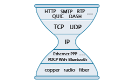

## Middleboxes

Routers are the workhorses of the network layer, and in this chapter, we’ve learned how they accomplish their “bread and butter” job of forwarding IP datagrams toward their destination. But in this chapter, and in earlier chapters, we’ve also encoun- tered other network equipment (“boxes”) within the network that sit on the data path and perform functions other than forwarding. We encountered Web caches in Sec- tion 2.2.5; TCP connection splitters in Section 3.7; and network address translation (NAT), firewalls, and intrusion detection systems in Section 4.3.4. We learned in Section 4.4 that generalized forwarding allows a modern router to easily and natu- rally perform firewalling and load balancing with generalized “match plus action” operations.

In the past 20 years, we’ve seen tremendous growth in such **middleboxes**, which RFC 3234 defines as:

_“any intermediary box performing functions apart from normal, standard func- tions of an IP router on the data path between a source host and destination host”_

We can broadly identify three types of services performed by middleboxes:

• _NAT Translation._ As we saw in Section 4.3.4, NAT boxes implement private network addressing, rewriting datagram header IP addresses and port numbers.

• _Security Services._ Firewalls block traffic based on header-field values or redirect packets for additional processing, such as deep packet inspection (DPI). Intru- sion Detection Systems (IDS) are able to detect predetermined patterns and filter packets accordingly. Application-level e-mail filters block e-mails considered to be junk, phishing or otherwise posing a security threat.

• _Performance Enhancement._ These middleboxes perform services such as com- pression, content caching, and load balancing of service requests (e.g., an HTTP request, or a search engine query) to one of a set of servers that can provide the desired service.

Many other middleboxes \[RFC 3234\] provide capabilities belonging to these three types of services, in both wired and wireless cellular \[Wang 2011\] networks.

With the proliferation of middleboxes comes the attendant need to operate, manage, and upgrade this equipment. Separate specialized hardware boxes, separatesoftware stacks, and separate management/operation skills translate to significant operational and capital costs. It is perhaps not surprising then that researchers are exploring the use of commodity hardware (networking, computing, and storage) with specialized software built on top of a common software stack—_exactly_ the approach taken in SDN a decade earlier—to implement these services. This approach has become known as **network function virtualization (NFV)** \[Mijumbi 2016\]. An alternate approach that has also been explored is to outsource middlebox functional- ity to the cloud \[Sherry 2012\].

For many years, the Internet architecture had a clear separation between the network layer and the transport/application layers. In these “good old days,” the network layer consisted of routers, operating within the network _core_, to forward datagrams toward their destinations using fields only in the IP datagram header. The transport and application layers were implemented in hosts operating at the network _edge_. Hosts exchanged packets among themselves in transport-layer segments and application-layer messages. Today’s middleboxes clearly violate this separation: a NAT box, sitting between a router and host, rewrites network-layer IP addresses and transport-layer port numbers; an in-network firewall blocks suspect datagrams using application-layer (e.g., HTTP), transport-layer, and network-layer header fields; e-mail security gateways are injected between the e-mail sender (whether malicious or not) and the intended e-mail receiver, filtering application-layer e-mail messages based on whitelisted/blacklisted IP addresses as well as e-mail message content. While there are those who have considered such middleboxes as a bit of an archi- tectural abomination \[Garfinkel 2003\], others have adopted the philosophy that such middleboxes “exist for important and permanent reasons”—that they fill an important need—and that we’ll have more, not fewer, middleboxes in the future \[Walfish 2004\]. See the Section in attached sidebar on “The end-to-end argument” for a slightly differ- ent lens on the question of where to place service functionality in a network.

**PRINCIPLES IN PRACTICE**

**ARCHITECTURAL PRINCIPLES OF THE INTERNET**

Given the phenomenal success of the Internet, one might naturally wonder about the architectural principles that have guided the development of what is arguably the larg- est and most complex engineered system ever built by humankind. RFC 1958, entitled “Architectural Principles of the Internet,” suggests that these principles, if indeed they exist, are truly minimal:

“Many members of the Internet community would argue that there is no architecture, but only a tradition, which was not written down for the first 25 years (or at least not by the IAB). However, in very general terms, the community believes that the goal is connectivity, the tool is the Internet Protocol, and the intelligence is end to end rather than hidden in the network.” \[RFC 1958\]

So there we have it! The goal was to provide connectivity, there would be just one net- work-layer protocol (the celebrated IP protocol we have studied in this chapter), and “intelli- gence” (one might say the “complexity”) would be placed at the network edge, rather than in the network core. Let’s look these last two considerations in a bit more detail.

**THE IP HOURGLASS**

By now, we’re well acquainted with the five-layer Internet protocol stack that we first encountered in Figure 1.23. Another visualization of this stack, shown in Figure 4.31 and sometimes known as the “**IP hourglass**,” illustrates the “**narrow waist**” of the layered Internet architecture. While the Internet has many protocols in the physical, link, transport, and application layers, there is only _one_ network layer protocol—the IP protocol. This is the one protocol that _must_ be implemented by each and every of the billions of Internet- connected devices. This narrow waist has played a critical role in the phenomenal growth of the Internet. The relative simplicity of the IP protocol, and the fact that it is the _only_ universal requirement for Internet connectivity has allowed a rich variety of networks—with very different underlying link-layer technologies, from Ethernet to WiFi to cellular to optical networks to become part of the Internet. \[Clark 1997\] notes that role of the narrow waist, which he refers to as a “spanning layer,” is to “… hide the detailed differences among these various \[underlying\] technologies and present a uniform service interface to the appli- cations above.” For the IP layer in particular: “How does the IP spanning layer achieve its purpose? It defines a basic set of services, which were carefully designed so that they could be constructed from a wide range of underlying network technologies. Software, as a part of the Internet \[i.e., network\] layer, translates what each of these lower-layer tech- nologies offers into the common service of the Internet layer.”

For a discussion the narrow waist, including examples beyond the Internet, see \[Beck 2019; Akhshabi 2011\]. We note here that as the Internet architecture enters mid-life (certainly,

**Figure 4.31** ♦ The narrow-waisted Internet hourglass

the Internet’s age of 40 to 50 years qualifies it for middle age!), one might observe that its “narrow waist” may indeed be widening a bit (as often happens in middle age!) via the rise of middleboxes.

**THE END-TO-END ARGUMENT**

The third principle in RFC 1958—that “intelligence is end to end rather than hidden in the network”—speaks to the placement of functionality within the network. Here, we’ve seen that until the recent rise of middleboxes, most Internet functionality was indeed placed at the network’s edge. It’s worth noting that, in direct contrast with the 20th century telephone network—which had “dumb” (non-programmable) endpoints and smart switches—the Internet has always had smart endpoints (programmable computers), enabling complex functionality to be placed at those endpoints. But a more principled argument for actually placing functionality at the endpoints was made in an extremely influential paper \[Saltzer 1984\] that articulated the “end-to-end argument.” It stated:

“ . . . there is a list of functions each of which might be implemented in any of several ways: by the communication subsystem, by its client, as a joint venture, or perhaps redundantly, each doing its own version. In reasoning about this choice, the require- ments of the application provide the basis for a class of arguments, which go as follows:

The function in question can completely and correctly be implemented only with the knowledge and help of the application standing at the end points of the com- munication system. Therefore, providing that questioned function as a feature of the communication system itself is not possible. (Sometimes an incomplete version of the function provided by the communication system may be useful as a performance enhancement.)

We call this line of reasoning against low-level function implementation the “end-to-end argument.”

An example illustrating the end-to-end argument is that of reliable data transfer. Since packets can be lost within the network (e.g., even without buffer overflows, a router hold- ing a queued packet could crash, or a portion of the network in which a packet is queued becomes detached due to link failures), the endpoints (in this case via the TCP protocol) _must_ perform error control. As we will see in Chapter 6, some link-layer protocols do indeed perform local error control, but this local error control alone is “incomplete” and not sufficient to provide end-to-end reliable data transfer. And so reliable data transfer must be implemented end to end.

RFC 1958 deliberately includes only two references, both of which are “fundamental papers on the Internet architecture.” One of these is the end-to-end paper itself \[Saltzer 1984\]; the second paper \[Clark 1988\] discusses the design philosophy of the DARPA Internet Protocols. Both are interesting “must reads” for anyone interested in Internet architecture. Follow-ons to \[Clark 1988\] are \[Blumenthal 2001; Clark 2005\] which reconsider Internet architecture in light of the much more complex environment in which today’s Internet must now operate.
******************************

## Summary

In this chapter, we’ve covered the **data plane** functions of the network layer—the _per- router_ functions that determine how packets arriving on one of a router’s input links are forwarded to one of that router’s output links. We began by taking a detailed look at the internal operations of a router, studying input and output port functionality and destination- based forwarding, a router’s internal switching mechanism, packet queue management and more. We covered both traditional IP forwarding (where forwarding is based on a data- gram’s destination address) and generalized forwarding (where forwarding and other func- tions may be performed using values in several different fields in the datagram’s header) and seen the versatility of the latter approach. We also studied the IPv4 and IPv6 protocols in detail, and Internet addressing, which we found to be much deeper, subtler, and more interesting than we might have expected. We completed our study of the network-layer data plane with a study of middleboxes, and a broad discussion of Internet architecture.

With our newfound understanding of the network-layer’s data plane, we’re now ready to dive into the network layer’s control plane in Chapter 5!
