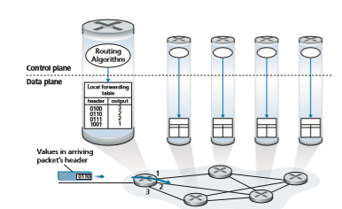

## Overview of Network Layer
Figure 4.1 shows a simple network with two hosts, H1 and H2, and several routers on the path between H1 and H2. Let’s suppose that H1 is sending information to H2, and consider the role of the network layer in these hosts and in the intervening routers. The network layer in H1 takes segments from the transport layer in H1, encapsulates each segment into a datagram, and then sends the datagrams to its nearby router, R1. At the receiving host, H2, the network layer receives the datagrams from its nearby router R2, extracts the transport-layer segments, and delivers the segments up to the transport layer at H2. The primary data-plane role of each router is to forward datagrams from its input links to its output links; the primary role of the network control plane is to coordinate these local, per-router forwarding actions so that datagrams are ultimately transferred end-to-end, along paths of routers between source and destination hosts. Note that the routers in Figure 4.1 are shown with a truncated protocol stack, that is, with no upper layers above the network layer, because routers do not run application- and transport-layer protocols such as those we examined in Chapters 2 and 3.

### Forwarding and Routing: The Data and Control Planes
The primary role of the network layer is deceptively simple—to move packets from a sending host to a receiving host. To do so, two important network-layer functions can be identified:

• _Forwarding._ When a packet arrives at a router’s input link, the router must move the packet to the appropriate output link. For example, a packet arriving from Host H1 to Router R1 in Figure 4.1 must be forwarded to the next router on a path to H2. As we will see, forwarding is but one function (albeit the most

**Figure 4.1**  ♦  The network layer

common and important one!) implemented in the data plane. In the more general case, which we’ll cover in Section 4.4, a packet might also be blocked from exit- ing a router (for example, if the packet originated at a known malicious sending host, or if the packet were destined to a forbidden destination host), or might be duplicated and sent over multiple outgoing links.

• _Routing._ The network layer must determine the route or path taken by packets as they flow from a sender to a receiver. The algorithms that calculate these paths are referred to as **routing algorithms**. A routing algorithm would determine, for example, the path along which packets flow from H1 to H2 in Figure 4.1. Routing is implemented in the control plane of the network layer.

The terms _forwarding_ and _routing_ are often used interchangeably by authors dis- cussing the network layer. We’ll use these terms much more precisely in this book. **Forwarding** refers to the router-local action of transferring a packet from an input link interface to the appropriate output link interface. Forwarding takes place at very short timescales (typically a few nanoseconds), and thus is typically implemented in hardware. **Routing** refers to the network-wide process that determines the end-to-end paths that packets take from source to destination. Routing takes place on much longer timescales (typically seconds), and as we will see is often implemented in software. Using our driving analogy, consider the trip from Pennsylvania to Florida undertaken by our traveler back in Section 1.3.1. During this trip, our driver passes through many interchanges en route to Florida. We can think of forwarding as the process of getting through a single interchange: A car enters the interchange from one road and deter- mines which road it should take to leave the interchange. We can think of routing as the process of planning the trip from Pennsylvania to Florida: Before embarking on the trip, the driver has consulted a map and chosen one of many paths possible, with each path consisting of a series of road segments connected at interchanges.

A key element in every network router is its **forwarding table**. A router forwards a packet by examining the value of one or more fields in the arriving packet’s header, and then using these header values to index into its forwarding table. The value stored in the forwarding table entry for those values indicates the outgoing link interface at that router to which that packet is to be forwarded. For example, in Figure 4.2, a packet with header field value of 0110 arrives to a router. The router indexes into its forward- ing table and determines that the output link interface for this packet is interface 2. The router then internally forwards the packet to interface 2. In Section 4.2, we’ll look inside a router and examine the forwarding function in much greater detail. Forward- ing is the key function performed by the data-plane functionality of the network layer.

**Control Plane: The Traditional Approach** 

But now you are undoubtedly wondering how a router’s forwarding tables are con- figured in the first place. This is a crucial issue, one that exposes the important inter- play between forwarding (in data plane) and routing (in control plane). As shown

**Figure 4.2**  ♦  Routing algorithms determine values in forward tables

in Figure 4.2, the routing algorithm determines the contents of the routers’ forward- ing tables. In this example, a routing algorithm runs in each and every router and both forwarding and routing functions are contained within a router. As we’ll see in Sections 5.3 and 5.4, the routing algorithm function in one router communicates with the routing algorithm function in other routers to compute the values for its forward- ing table. How is this communication performed? By exchanging routing messages containing routing information according to a routing protocol! We’ll cover routing algorithms and protocols in Sections 5.2 through 5.4.

The distinct and different purposes of the forwarding and routing functions can be further illustrated by considering the hypothetical (and unrealistic, but technically feasible) case of a network in which all forwarding tables are configured directly by human network operators physically present at the routers. In this case, _no_ routing protocols would be required! Of course, the human operators would need to interact with each other to ensure that the forwarding tables were configured in such a way that packets reached their intended destinations. It’s also likely that human configu- ration would be more error-prone and much slower to respond to changes in the net- work topology than a routing protocol. We’re thus fortunate that all networks have both a forwarding _and_ a routing function!Local forwarding table

**Control Plane: The SDN Approach** The approach to implementing routing functionality shown in Figure 4.2—with each router having a routing component that communicates with the routing component of other routers—has been the traditional approach adopted by routing vendors in their products, at least until recently. Our observation that humans could manually configure forwarding tables does suggest, however, that there may be other ways for control- plane functionality to determine the contents of the data-plane forwarding tables.

Figure 4.3 shows an alternative approach in which a physically separate, remote controller computes and distributes the forwarding tables to be used by each and every router. Note that the data plane components of Figures 4.2 and 4.3 are identi- cal. In Figure 4.3; however, control-plane routing functionality is separated from theLocal forwarding table

**Figure 4.3**  ♦   A remote controller determines and distributes values in forwarding tables

physical router—the routing device performs forwarding only, while the remote con- troller computes and distributes forwarding tables. The remote controller might be implemented in a remote data center with high reliability and redundancy, and might be managed by the ISP or some third party. How might the routers and the remote controller communicate? By exchanging messages containing forwarding tables and other pieces of routing information. The control-plane approach shown in Figure 4.3 is at the heart of **software-defined networking (SDN)**, where the network is “soft- ware-defined” because the controller that computes forwarding tables and interacts with routers is implemented in software. Increasingly, these software implementa- tions are also open, that is, similar to Linux OS code, the code is publically available, allowing ISPs (and networking researchers and students!) to innovate and propose changes to the software that controls network-layer functionality. We will cover the SDN control plane in Section 5.5.

### Network Service Model

Before delving into the network layer’s data plane, let’s wrap up our introduction by taking the broader view and consider the different types of service that might be offered by the network layer. When the transport layer at a sending host transmits a packet into the network (that is, passes it down to the network layer at the sending host), can the transport layer rely on the network layer to deliver the packet to the destination? When multiple packets are sent, will they be delivered to the transport layer in the receiving host in the order in which they were sent? Will the amount of time between the sending of two sequential packet transmissions be the same as the amount of time between their reception? Will the network provide any feed- back about congestion in the network? The answers to these questions and others are determined by the service model provided by the network layer. The **network service model**
defines the characteristics of end-to-end delivery of packets between sending and receiving hosts.

Let’s now consider some possible services that the network layer could provide. These services could include:

• _Guaranteed delivery_. This service guarantees that a packet sent by a source host will eventually arrive at the destination host.

• _Guaranteed delivery with bounded delay_. This service not only guarantees delivery of the packet, but delivery within a specified host-to-host delay bound (for example, within 100 msec).

• _In-order packet delivery_. This service guarantees that packets arrive at the desti- nation in the order that they were sent.

• _Guaranteed minimal bandwidth_. This network-layer service emulates the behav- ior of a transmission link of a specified bit rate (for example, 1 Mbps) between sending and receiving hosts. As long as the sending host transmits bits (as partof packets) at a rate below the specified bit rate, then all packets are eventually delivered to the destination host.

• _Security_. The network layer could encrypt all datagrams at the source and decrypt them at the destination, thereby providing confidentiality to all transport-layer segments.

This is only a partial list of services that a network layer could provide—there are countless variations possible.

The Internet’s network layer provides a single service, known as **best-effort service**. With best-effort service, packets are neither guaranteed to be received in the order in which they were sent, nor is their eventual delivery even guaranteed. There is no guarantee on the end-to-end delay nor is there a minimal bandwidth guaran- tee. It might appear that _best-effort service_ is a euphemism for _no service at all_—a network that delivered _no_ packets to the destination would satisfy the definition of best-effort delivery service! Other network architectures have defined and imple- mented service models that go beyond the Internet’s best-effort service. For example, the ATM network architecture \[Black 1995\] provides for guaranteed in-order delay, bounded delay, and guaranteed minimal bandwidth. There have also been proposed service model extensions to the Internet architecture; for example, the Intserv archi- tecture \[RFC 1633\] aims to provide end-end delay guarantees and congestion-free communication. Interestingly, in spite of these well-developed alternatives, the Internet’s basic best-effort service model combined with adequate bandwidth provi- sioning and bandwidth-adaptive application-level protocols such as the DASH pro- tocol we encountered in Section 2.6.2 have arguably proven to be more than “good enough” to enable an amazing range of applications, including streaming video ser- vices such as Netflix and video-over-IP, real-time conferencing applications such as Skype and Facetime.

**An Overview of Chapter 4** Having now provided an overview of the network layer, we’ll cover the data-plane component of the network layer in the following Sections in this chapter. In Section 4.2, we’ll dive down into the internal hardware operations of a router, including input and output packet processing, the router’s internal switching mechanism, and packet queuing and scheduling. In Section 4.3, we’ll take a look at traditional IP forwarding, in which packets are forwarded to output ports based on their destination IP addresses. We’ll encounter IP addressing, the celebrated IPv4 and IPv6 protocols and more. In Section 4.4, we’ll cover more generalized forwarding, where packets may be for- warded to output ports based on a large number of header values (i.e., not only based on destination IP address). Packets may be blocked or duplicated at the router, or may have certain header field values rewritten—all under software control. This more generalized form of packet forwarding is a key component of a modern network data plane, including the data plane in software-defined networks (SDN). In Section 4.5, we’ll learn about “middleboxes” that can perform functions in addition to forwarding.We mention here in passing that the terms _forwarding_ and _switching_ are often used interchangeably by computer-networking researchers and practitioners; we’ll use both terms interchangeably in this textbook as well. While we’re on the topic of terminology, it’s also worth mentioning two other terms that are often used inter- changeably, but that we will use more carefully. We’ll reserve the term _packet switch_ to mean a general packet-switching device that transfers a packet from input link interface to output link interface, according to values in a packet’s header fields. Some packet switches, called **link-layer switches** (examined in Chapter 6), base their forwarding decision on values in the fields of the link-layer frame; switches are thus referred to as link-layer (layer 2) devices. Other packet switches, called **routers**, base their forwarding decision on header field values in the network-layer datagram. Routers are thus network-layer (layer 3) devices. (To fully appreciate this important distinction, you might want to review Section 1.5.2, where we discuss network-layer datagrams and link-layer frames and their relationship.) Since our focus in this chap- ter is on the network layer, we’ll mostly use the term _router_ in place of _packet switch_.
