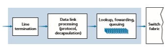
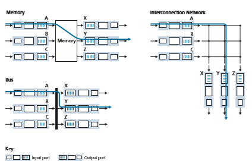
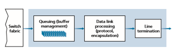
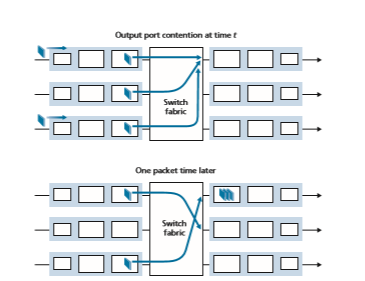

## What’s Inside a Router

Now that we’ve overviewed the data and control planes within the network layer, the important distinction between forwarding and routing, and the services and functions of the network layer, let’s turn our attention to its forwarding function—the actual transfer of packets from a router’s incoming links to the appropriate outgoing links at that router.

A high-level view of a generic router architecture is shown in Figure 4.4. Four router components can be identified:

**Figure 4.4**  ♦  Router architecture

• _Input ports._ An **input port** performs several key functions. It performs the physi- cal layer function of terminating an incoming physical link at a router; this is shown in the leftmost box of an input port and the rightmost box of an output port in Figure 4.4. An input port also performs link-layer functions needed to interoperate with the link layer at the other side of the incoming link; this is represented by the middle boxes in the input and output ports. Perhaps most cru- cially, a lookup function is also performed at the input port; this will occur in the rightmost box of the input port. It is here that the forwarding table is consulted to determine the router output port to which an arriving packet will be forwarded via the switching fabric. Control packets (for example, packets carrying routing protocol information) are forwarded from an input port to the routing processor. Note that the term “port” here—referring to the physical input and output router interfaces—is distinctly different from the software ports associated with network applications and sockets discussed in Chapters 2 and 3. In practice, the number of ports supported by a router can range from a relatively small number in enterprise routers, to hundreds of 10 Gbps ports in a router at an ISP’s edge, where the num- ber of incoming lines tends to be the greatest. The Juniper MX2020, edge router, for example, supports up to 800 100 Gbps Ethernet ports, with an overall router system capacity of 800 Tbps \[Juniper MX 2020 2020\].

• _Switching fabric._ The switching fabric connects the router’s input ports to its output ports. This switching fabric is completely contained within the router—a network inside of a network router!

• _Output ports._ An **output port** stores packets received from the switching fabric and transmits these packets on the outgoing link by performing the necessary link-layer and physical-layer functions. When a link is bidirectional (that is, car- ries traffic in both directions), an output port will typically be paired with the input port for that link on the same line card.

• _Routing processor._ The routing processor performs control-plane functions. In tra- ditional routers, it executes the routing protocols (which we’ll study in Sections 5.3 and 5.4), maintains routing tables and attached link state information, and com- putes the forwarding table for the router. In SDN routers, the routing processor is responsible for communicating with the remote controller in order to (among other activities) receive forwarding table entries computed by the remote controller, and install these entries in the router’s input ports. The routing processor also performs the network management functions that we’ll study in Section 5.7.

A router’s input ports, output ports, and switching fabric are almost always implemented in hardware, as shown in Figure 4.4. To appreciate why a hardware implementation is needed, consider that with a 100 Gbps input link and a 64-byte IP datagram, the input port has only 5.12 ns to process the datagram before another datagram may arrive. If _N_ ports are combined on a line card (as is often done in practice), the datagram-processing pipeline must operate _N_ times faster—far toofast for software implementation. Forwarding hardware can be implemented either using a router vendor’s own hardware designs, or constructed using purchased merchant-silicon chips (for example, as sold by companies such as Intel and Broadcom).

While the data plane operates at the nanosecond time scale, a router’s control functions—executing the routing protocols, responding to attached links that go up or down, communicating with the remote controller (in the SDN case) and perform- ing management functions—operate at the millisecond or second timescale. These **control plane** functions are thus usually implemented in software and execute on the routing processor (typically a traditional CPU).

Before delving into the details of router internals, let’s return to our analogy from the beginning of this chapter, where packet forwarding was compared to cars entering and leaving an interchange. Let’s suppose that the interchange is a rounda- bout, and that as a car enters the roundabout, a bit of processing is required. Let’s consider what information is required for this processing:

• _Destination-based forwarding_. Suppose the car stops at an entry station and indi- cates its final destination (not at the local roundabout, but the ultimate destination of its journey). An attendant at the entry station looks up the final destination, determines the roundabout exit that leads to that final destination, and tells the driver which roundabout exit to take.

• _Generalized forwarding_. The attendant could also determine the car’s exit ramp on the basis of many other factors besides the destination. For example, the selected exit ramp might depend on the car’s origin, for example the state that issued the car’s license plate. Cars from a certain set of states might be directed to use one exit ramp (that leads to the destination via a slow road), while cars from other states might be directed to use a different exit ramp (that leads to the destination via super- highway). The same decision might be made based on the model, make and year of the car. Or a car not deemed roadworthy might be blocked and not be allowed to pass through the roundabout. In the case of generalized forwarding, any number of factors may contribute to the attendant’s choice of the exit ramp for a given car.

Once the car enters the roundabout (which may be filled with other cars entering from other input roads and heading to other roundabout exits), it eventually leaves at the prescribed roundabout exit ramp, where it may encounter other cars leaving the roundabout at that exit.

We can easily recognize the principal router components in Figure 4.4 in this analogy—the entry road and entry station correspond to the input port (with a lookup function to determine to local outgoing port); the roundabout corresponds to the switch fabric; and the roundabout exit road corresponds to the output port. With this analogy, it’s instructive to consider where bottlenecks might occur. What happens if cars arrive blazingly fast (for example, the roundabout is in Germany or Italy!) but the station attendant is slow? How fast must the attendant work to ensure there’s no backup on an entry road? Even with a blazingly fast attendant, what happens if carstraverse the roundabout slowly—can backups still occur? And what happens if most of the cars entering at all of the roundabout’s entrance ramps all want to leave the roundabout at the same exit ramp—can backups occur at the exit ramp or elsewhere? How should the roundabout operate if we want to assign priorities to different cars, or block certain cars from entering the roundabout in the first place? These are all analogous to critical questions faced by router and switch designers.

In the following subSections, we’ll look at router functions in more detail.Turner 1988; McKeown 1997a; Partridge 1998; Iyer 2008; Serpanos 2011; Zilberman 2019 provide a discussion of specific router architectures. For concreteness and simplicity, we’ll initially assume in this Section that forwarding decisions are based only on the packet’s destination address, rather than on a generalized set of packet header fields. We will cover the case of more generalized packet forwarding in Section 4.4.

### Input Port Processing and Destination-Based Forwarding

A more detailed view of input processing is shown in Figure 4.5. As just discussed, the input port’s line-termination function and link-layer processing implement the physical and link layers for that individual input link. The lookup performed in the input port is central to the router’s operation—it is here that the router uses the for- warding table to look up the output port to which an arriving packet will be forwarded via the switching fabric. The forwarding table is either computed and updated by the routing processor (using a routing protocol to interact with the routing processors in other network routers) or is received from a remote SDN controller. The forwarding table is copied from the routing processor to the line cards over a separate bus (e.g., a PCI bus) indicated by the dashed line from the routing processor to the input line cards in Figure 4.4. With such a shadow copy at each line card, forwarding decisions can be made locally, at each input port, without invoking the centralized routing pro- cessor on a per-packet basis and thus avoiding a centralized processing bottleneck.

Let’s now consider the “simplest” case that the output port to which an incoming packet is to be switched is based on the packet’s destination address. In the case of 32-bit IP addresses, a brute-force implementation of the forwarding table would have one entry for every possible destination address. Since there are more than 4 billion possible addresses, this option is totally out of the question.

**Figure 4.5**  ♦  Input port processing

As an example of how this issue of scale can be handled, let’s suppose that our router has four links, numbered 0 through 3, and that packets are to be forwarded to the link interfaces as follows:

With this style of forwarding table, the router matches a **prefix** of the packet’s des- tination address with the entries in the table; if there’s a match, the router forwards the packet to a link associated with the match. For example, suppose the packet’s destination address is 11001000 00010111 00010110 10100001; because the 21-bit prefix of this address matches the first entry in the table, the router forwards the packet to link interface 0. If a prefix doesn’t match any of the first three entries, then the router forwards the packet to the default interface 3. Although this sounds simple enough, there’s a very important subtlety here. You may have noticed that it is possible for a destination address to match more than one entry. For example, the first 24 bits of the address 11001000 00010111 00011000 10101010 match the second entry in the table, and the first 21 bits of the address match the third entry in the table. When there are multiple matches, the router uses the **longest prefix matching rule**; that is, it finds the longest matching entry in the table and forwards the packet to the link interface associated with the longest prefix match. We’ll see exactly _why_ this longest prefix-matching rule is used when we study Internet addressing in more detail in Section 4.3.

Given the existence of a forwarding table, lookup is conceptually simple— hardware logic just searches through the forwarding table looking for the longest prefix match. But at Gigabit transmission rates, this lookup must be performed in nanoseconds (recall our earlier example of a 10 Gbps link and a 64-byte IP data- gram). Thus, not only must lookup be performed in hardware, but techniques beyond a simple linear search through a large table are needed; surveys of fast lookup algo- rithms can be found in \[Gupta 2001, Ruiz-Sanchez 2001\]. Special attention must also be paid to memory access times, resulting in designs with embedded on-chip DRAM and faster SRAM (used as a DRAM cache) memories. In practice, Ternary Content Addressable Memories (TCAMs) are also often used for lookup \[Yu 2004\]. With a TCAM, a 32-bit IP address is presented to the memory, which returns the content of the forwarding table entry for that address in essentially constant time. The Cisco Catalyst 6500 and 7600 Series routers and switches can hold upwards of a million TCAM forwarding table entries \[Cisco TCAM 2014\].

Once a packet’s output port has been determined via the lookup, the packet can be sent into the switching fabric. In some designs, a packet may be temporarily blocked from entering the switching fabric if packets from other input ports are cur- rently using the fabric. A blocked packet will be queued at the input port and then scheduled to cross the fabric at a later point in time. We’ll take a closer look at the blocking, queuing, and scheduling of packets (at both input ports and output ports) shortly. Although “lookup” is arguably the most important action in input port pro- cessing, many other actions must be taken: (1) physical- and link-layer processing must occur, as discussed previously; (2) the packet’s version number, checksum and time-to-live field—all of which we’ll study in Section 4.3—must be checked and the latter two fields rewritten; and (3) counters used for network management (such as the number of IP datagrams received) must be updated.

Let’s close our discussion of input port processing by noting that the input port steps of looking up a destination IP address (“match”) and then sending the packet into the switching fabric to the specified output port (“action”) is a specific case of a more general “match plus action” abstraction that is performed in many networked devices, not just routers. In link-layer switches (covered in Chapter 6), link-layer destination addresses are looked up and several actions may be taken in addition to sending the frame into the switching fabric towards the output port. In firewalls (cov- ered in Chapter 8)—devices that filter out selected incoming packets—an incoming packet whose header matches a given criteria (e.g., a combination of source/destina- tion IP addresses and transport-layer port numbers) may be dropped (action). In a network address translator (NAT, covered in Section 4.3), an incoming packet whose transport-layer port number matches a given value will have its port number rewrit- ten before forwarding (action). Indeed, the “match plus action” abstraction \[Bosshart 2013\] is both powerful and prevalent in network devices today, and is central to the notion of generalized forwarding that we’ll study in Section 4.4.

### Switching
 The switching fabric is at the very heart of a router, as it is through this fabric that the packets are actually switched (that is, forwarded) from an input port to an output port. Switching can be accomplished in a number of ways, as shown in Figure 4.6:

• _Switching via memory._ The simplest, earliest routers were traditional computers, with switching between input and output ports being done under direct control of the CPU (routing processor). Input and output ports functioned as traditional I/O devices in a traditional operating system. An input port with an arriving packet first signaled the routing processor via an interrupt. The packet was then copied from the input port into processor memory. The routing processor then extracted the destination address from the header, looked up the appropriate output port in the forwarding table, and copied the packet to the output port’s buffers. In this scenario, if the memory bandwidth is such that a maximum of _B_ packets per second can be written into, or read from, memory, then the overall forwarding throughput (the total rate at which packets are transferred from input ports to out- put ports) must be less than _B_/2. Note also that two packets cannot be forwarded

**Figure 4.6**  ♦  Three switching techniques

at the same time, even if they have different destination ports, since only one memory read/write can be done at a time over the shared system bus.

Some modern routers switch via memory. A major difference from early routers, however, is that the lookup of the destination address and the storing of the packet into the appropriate memory location are performed by processing on the input line cards. In some ways, routers that switch via memory look very much like shared- memory multiprocessors, with the processing on a line card switching (writing) packets into the memory of the appropriate output port. Cisco’s Catalyst 8500 series switches \[Cisco 8500 2020\] internally switches packets via a shared memory.

• _Switching via a bus._ In this approach, an input port transfers a packet directly to the output port over a shared bus, without intervention by the routing processor. This is typically done by having the input port pre-pend a switch-internal label (header) to the packet indicating the local output port to which this packet is being transferred and transmitting the packet onto the bus. All output ports receive the packet, but only the port that matches the label will keep the packet. The label is then removed at the output port, as this label is only used within the switch to cross the bus. If mul- tiple packets arrive to the router at the same time, each at a different input port, all but one must wait since only one packet can cross the bus at a time. Because every packet must cross the single bus, the switching speed of the router is limited to the bus speed; in our roundabout analogy, this is as if the roundabout could only contain one car at a time. Nonetheless, switching via a bus is often sufficient for routers that operate in small local area and enterprise networks. The Cisco 6500 router \[Cisco 6500 2020\] internally switches packets over a 32-Gbps-backplane bus.

• _Switching via an interconnection network._ One way to overcome the bandwidth limitation of a single, shared bus is to use a more sophisticated interconnection net- work, such as those that have been used in the past to interconnect processors in a multiprocessor computer architecture. A crossbar switch is an interconnection net- work consisting of 2_N_ buses that connect _N_ input ports to _N_ output ports, as shown in Figure 4.6. Each vertical bus intersects each horizontal bus at a crosspoint, which can be opened or closed at any time by the switch fabric controller (whose logic is part of the switching fabric itself). When a packet arrives from port A and needs to be forwarded to port Y, the switch controller closes the crosspoint at the interSection of busses A and Y, and port A then sends the packet onto its bus, which is picked up (only) by bus Y. Note that a packet from port B can be forwarded to port X at the same time, since the A-to-Y and B-to-X packets use different input and output busses. Thus, unlike the previous two switching approaches, cross- bar switches are capable of forwarding multiple packets in parallel. A crossbar switch is **non-blocking**—a packet being forwarded to an output port will not be blocked from reaching that output port as long as no other packet is currently being forwarded to that output port. However, if two packets from two different input ports are destined to that same output port, then one will have to wait at the input, since only one packet can be sent over any given bus at a time. Cisco 12000 seriesswitches \[Cisco 12000 2020\] use a crossbar switching network; the Cisco 7600 series can be configured to use either a bus or crossbar switch \[Cisco 7600 2020\].

More sophisticated interconnection networks use multiple stages of switching elements to allow packets from different input ports to proceed towards the same output port at the same time through the multi-stage switching fabric. See \[Tobagi 1990\] for a survey of switch architectures. The Cisco CRS employs a three-stage non-blocking switching strategy. A router’s switching capacity can also be scaled by running multiple switching fabrics in parallel. In this approach, input ports and output ports are connected to _N_ switching fabrics that operate in parallel. An input port breaks a packet into _K_ smaller chunks, and sends (“sprays”) the chunks through _K_ of these _N_ switching fabrics to the selected output port, which reas- sembles the _K_ chunks back into the original packet.

### Output Port Processing
 Output port processing, shown in Figure 4.7, takes packets that have been stored in the output port’s memory and transmits them over the output link. This includes selecting (i.e., scheduling) and de-queuing packets for transmission, and performing the needed link-layer and physical-layer transmission functions.

### Where Does Queuing Occur?

If we consider input and output port functionality and the configurations shown in Figure 4.6, it’s clear that packet queues may form at both the input ports _and_ the output ports, just as we identified cases where cars may wait at the inputs and out- puts of the traffic interSection in our roundabout analogy. The location and extent of queuing (either at the input port queues or the output port queues) will depend on the traffic load, the relative speed of the switching fabric, and the line speed. Let’s now consider these queues in a bit more detail, since as these queues grow large, the router’s memory can eventually be exhausted and **packet loss**
will occur when no memory is available to store arriving packets. Recall that in our earlier discussions, we said that packets were “lost within the network” or “dropped at a router.” _It is here, at these queues within a router, where such packets are actually dropped and lost._

**Figure 4.7**  ♦  Output port processing

Suppose that the input and output line speeds (transmission rates) all have an identical transmission rate of _R_line packets per second, and that there are _N_ input ports and _N_ output ports. To further simplify the discussion, let’s assume that all packets have the same fixed length, and that packets arrive to input ports in a synchronous manner. That is, the time to send a packet on any link is equal to the time to receive a packet on any link, and during such an interval of time, either zero or one packets can arrive on an input link. Define the switching fabric transfer rate _R_switch as the rate at which packets can be moved from input port to output port. If _R_switch is _N_ times faster than _R_line, then only negligible queuing will occur at the input ports. This is because even in the worst case, where all _N_ input lines are receiving packets, and all packets are to be forwarded to the same output port, each batch of _N_ packets (one packet per input port) can be cleared through the switch fabric before the next batch arrives.

**Input Queuing**

But what happens if the switch fabric is not fast enough (relative to the input line speeds) to transfer _all_ arriving packets through the fabric without delay? In this case, packet queuing can also occur at the input ports, as packets must join input port queues to wait their turn to be transferred through the switching fabric to the output port. To illustrate an important consequence of this queuing, consider a crossbar switching fabric and suppose that (1) all link speeds are identical, (2) that one packet can be transferred from any one input port to a given output port in the same amount of time it takes for a packet to be received on an input link, and (3) packets are moved from a given input queue to their desired output queue in an FCFS manner. Multiple packets can be transferred in parallel, as long as their output ports are different. How- ever, if two packets at the front of two input queues are destined for the same output queue, then one of the packets will be blocked and must wait at the input queue—the switching fabric can transfer only one packet to a given output port at a time.

Figure 4.8 shows an example in which two packets (darkly shaded) at the front of their input queues are destined for the same upper-right output port. Suppose that the switch fabric chooses to transfer the packet from the front of the upper-left queue. In this case, the darkly shaded packet in the lower-left queue must wait. But not only must this darkly shaded packet wait, so too must the lightly shaded packet that is queued behind that packet in the lower-left queue, even though there is _no_ conten- tion for the middle-right output port (the destination for the lightly shaded packet). This phenomenon is known as **head-of-the-line (HOL) blocking** in an input-queued switch—a queued packet in an input queue must wait for transfer through the fabric (even though its output port is free) because it is blocked by another packet at the head of the line. \[Karol 1987\] shows that due to HOL blocking, the input queue will grow to unbounded length (informally, this is equivalent to saying that significant packet loss will occur) under certain assumptions as soon as the packet arrival rate on the input links reaches only 58 percent of their capacity. A number of solutions to HOL blocking are discussed in \[McKeown 1997\].

**Figure 4.8**  ♦  HOL blocking at and input-queued switch

**Output Queuing**

Let’s next consider whether queuing can occur at a switch’s output ports. Suppose that _R_switch is again _N_ times faster than _R_line and that packets arriving at each of the _N_ input ports are destined to the same output port. In this case, in the time it takes to send a single packet onto the outgoing link, _N_ new packets will arrive at this output port (one from each of the _N_ input ports). Since the output port can transmit only a single packet in a unit of time (the packet transmission time), the _N_ arriving packets will have to queue (wait) for transmission over the outgoing link. Then _N_ more packets can possibly arrive in the time it takes to transmit just one of the _N_ packets that had just previously been queued. And so on. Thus, packet queues can form at the output ports even when the switching fabric is _N_ times faster than the port line speeds. Eventually, the number of queued packets can grow large enough to exhaust avail- able memory at the output port.

**Figure 4.9**  ♦  Output port queuing

When there is not enough memory to buffer an incoming packet, a decision must be made to either drop the arriving packet (a policy known as **drop-tail**) or remove one or more already-queued packets to make room for the newly arrived packet. In some cases, it may be advantageous to drop (or mark the header of) a packet _before_ the buffer is full in order to provide a congestion signal to the sender. This mark- ing could be done using the Explicit Congestion Notification bits that we studied in Section 3.7.2. A number of proactive packet-dropping and -marking policies (which collectively have become known as **active queue management (AQM)** algorithms) have been proposed and analyzed \[Labrador 1999, Hollot 2002\]. One of the most widely studied and implemented AQM algorithms is the **Random Early Detection (RED)** algorithm \[Christiansen 2001\]. More recent AQM policies include PIE (the Proportional Integral controller Enhanced \[RFC 8033\] and CoDel \[Nichols 2012\].

Output port queuing is illustrated in Figure 4.9. At time _t,_ a packet has arrived at each of the incoming input ports, each destined for the uppermost outgoing port. Assuming identical line speeds and a switch operating at three times the line speed, one time unit later (that is, in the time needed to receive or send a packet), all three original packets have been transferred to the outgoing port and are queued awaiting transmis- sion. In the next time unit, one of these three packets will have been transmitted over the outgoing link. In our example, two _new_ packets have arrived at the incoming side of the

switch; one of these packets is destined for this uppermost output port. A consequence of such queuing is that a **packet scheduler** at the output port must choose one packet, among those queued, for transmission—a topic we’ll cover in the following Section.

**How Much Buffering Is “Enough?”**

Our study above has shown how a packet queue forms when bursts of packets arrive at a router’s input or (more likely) output port, and the packet arrival rate temporarily exceeds the rate at which packets can be forwarded. The longer the amount of time that this mismatch persists, the longer the queue will grow, until eventually a port’s buffers become full and packets are dropped. One natural question is how _much_ buffering should be provisioned at a port. It turns out the answer to this question is much more complicated than one might imagine and can teach us quite a bit about the subtle interaction among congestion-aware senders at the network’s edge and the network core!

For many years, the rule of thumb \[RFC 3439\] for buffer sizing was that the amount of buffering **(B)** should be equal to an average round-trip time (**RTT**, say 250 msec) times the link capacity **(C)**. Thus, a 10-Gbps link with an RTT of 250 msec would need an amount of buffering equal to **B** \= **RTT** \# **C** \= 2.5 Gbits of buff- ers. This result was based on an analysis of the queuing dynamics of a relatively small number of TCP flows \[Villamizar 1994\]. More recent theoretical and experi- mental efforts \[Appenzeller 2004\], however, suggest that when a large number of _independent_ TCP flows (**N**) pass through a link, the amount of buffering needed is **B** \= **RTT** \# **C**\>2**N**. In core networks, where a large number of TCP flows typi- cally pass through large backbone router links, the value of **N** can be large, with the decrease in needed buffer size becoming quite significant. \[Appenzeller 2004; Wischik 2005; Beheshti 2008\] provide very readable discussions of the buffer-sizing problem from a theoretical, implementation, and operational standpoint.

It’s temping to think that more buffering _must_ be better—larger buffers would allow a router to absorb larger fluctuations in the packet arrival rate, thereby decreas- ing the router’s packet loss rate. But larger buffers also mean potentially longer queuing delays. For gamers and for interactive teleconferencing users, tens of mil- liseconds count. Increasing the amount of per-hop buffer by a factor of 10 to decrease packet loss could increase the end-end delay by a factor of 10! Increased RTTs also make TCP senders less responsive and slower to respond to incipient congestion and/ or packet loss. These delay-based considerations show that buffering is a double- edged sword—buffering can be used to absorb short-term statistical fluctuations in traffic but can also lead to increased delay and the attendant concerns. Buffering is a bit like salt—just the right amount of salt makes food better, but too much makes it inedible!

In the discussion above, we’ve implicitly assumed that many independent send- ers are competing for bandwidth and buffers at a congested link. While this is prob- ably an excellent assumption for routers within the network core, at the network edge

**Figure 4.10**  ♦  Bufferbloat: persistent queues

this may not hold. Figure 4.10(a) shows a home router sending TCP segments to a remote game server. Following \[Nichols 2012\], suppose that it takes 20 ms to trans- mit a packet (containing a gamer’s TCP segment), that there are negligible queuing delays elsewhere on the path to the game server, and that the RTT is 200 ms. As shown in Figure 4.10(b), suppose that at time _t_ \= 0, a burst of 25 packets arrives to the queue. One of these queued packets is then transmitted once every 20 ms, so that at _t_ \= 200 msec, the first ACK arrives, just as the 21st packet is being transmitted. This ACK arrival causes the TCP sender to send another packet, which is queued at the outgoing link of the home router. At _t_ \= 220, the next ACK arrives, and another TCP segment is released by the gamer and is queued, as the 22nd packet is being transmitted, and so on. You should convince yourself that in this scenario, ACK clocking results in a new packet arriving at the queue every time a queued packet is sent, resulting in queue size at the home router’s outgoing link that is _always_ five packets! That is, the end-end-pipe is full (delivering packets to the destination at the path bottleneck rate of one packet every 20 ms), but the amount of queuing delay is constant and _persistent_. As a result, the gamer is unhappy with the delay, and the par- ent (who even knows wireshark!) is confused because he or she doesn’t understand why delays are persistent and excessively long, even when there is no other traffic on the home network.

This scenario above of long delay due to persistent buffering is known as **buff- erbloat** and illustrates that not only is throughput important, but also minimal delay is important as well \[Kleinrock 2018\], and that the interaction among senders at the network edge and queues within the network can indeed be complex and subtle. The DOCSIS 3.1 standard for cable networks that we will study in Chapter 6, recently added a specific AQM mechanism \[RFC 8033, RFC 8034\] to combat bufferbloat, while preserving bulk throughput performance.

### Packet Scheduling
 Let’s now return to the question of determining the order in which queued packets are transmitted over an outgoing link. Since you yourself have undoubtedly had to wait in long lines on many occasions and observed how waiting customers are served, you’re no doubt familiar with many of the queuing disciplines commonly used in routers. There is first-come-first-served (FCFS, also known as first-in-first-out, FIFO). The British are famous for patient and orderly FCFS queuing at bus stops and in the mar- ketplace (“Oh, are you queuing?”). Other countries operate on a priority basis, with one class of waiting customers given priority service over other waiting customers. There is also round-robin queuing, where customers are again divided into classes (as in priority queuing) but each class of customer is given service in turn.

**First-in-First-Out (FIFO)**

Figure 4.11 shows the queuing model abstraction for the FIFO link-scheduling dis- cipline. Packets arriving at the link output queue wait for transmission if the link is currently busy transmitting another packet. If there is not sufficient buffering space to hold the arriving packet, the queue’s packet-discarding policy then determines whether the packet will be dropped (lost) or whether other packets will be removed from the queue to make space for the arriving packet, as discussed above. In our discussion below, we’ll ignore packet discard. When a packet is completely transmit- ted over the outgoing link (that is, receives service) it is removed from the queue.

The FIFO (also known as first-come-first-served, or FCFS) scheduling discipline selects packets for link transmission in the same order in which they arrived at the output link queue. We’re all familiar with FIFO queuing from service centers, where arriving customers join the back of the single waiting line, remain in order, and are then served when they reach the front of the line. Figure 4.12 shows the FIFO queue in operation. Packet arrivals are indicated by numbered arrows above the upper time- line, with the number indicating the order in which the packet arrived. Individual packet departures are shown below the lower timeline. The time that a packet spends in service (being transmitted) is indicated by the shaded rectangle between the two timelines. 

**Figure 4.11**  ♦ In FIFO queuing abstractionour

**Figure 4.12**  ♦  The FIFO queue in operation

 examples here, let’s assume that each packet takes three units of time to be transmit- ted. Under the FIFO discipline, packets leave in the same order in which they arrived. Note that after the departure of packet 4, the link remains idle (since packets 1 through 4 have been transmitted and removed from the queue) until the arrival of packet 5.

**Priority Queuing**

Under priority queuing, packets arriving at the output link are classified into prior- ity classes upon arrival at the queue, as shown in Figure 4.13. In practice, a network operator may configure a queue so that packets carrying network management infor- mation (for example, as indicated by the source or destination TCP/UDP port num- ber) receive priority over user traffic; additionally, real-time voice-over-IP packets might receive priority over non-real-time traffic such e-mail packets. Each priority class typically has its own queue. When choosing a packet to transmit, the priority
**Figure 4.13**  ♦  The priority queuing model

Figure 4.14  ♦  The priority queue in operation

queuing discipline will transmit a packet from the highest priority class that has a nonempty queue (that is, has packets waiting for transmission). The choice among packets in the same priority class is typically done in a FIFO manner.

Figure 4.14 illustrates the operation of a priority queue with two priority classes. Packets 1, 3, and 4 belong to the high-priority class, and packets 2 and 5 belong to the low-priority class. Packet 1 arrives and, finding the link idle, begins transmission. During the transmission of packet 1, packets 2 and 3 arrive and are queued in the low- and high-priority queues, respectively. After the transmission of packet 1, packet 3 (a high-priority packet) is selected for transmission over packet 2 (which, even though it arrived earlier, is a low-priority packet). At the end of the transmission of packet 3, packet 2 then begins transmission. Packet 4 (a high-priority packet) arrives during the transmission of packet 2 (a low-priority packet). Under a **non-preemptive priority queuing** discipline, the transmission of a packet is not interrupted once it

**PRINCIPLES IN PRACTICE**

NET NEUTRALITY

We’ve seen that packet scheduling mechanisms (e.g., priority traffic scheduling disciplines 
such a strict priority, and WFQ) can be used to provide different levels of service to different “classes” of traffic. The definition of what precisely constitutes a “class” of traffic is up 
to an ISP to decide, but could be potentially based on any set of fields in the IP datagram 
header. For example, the port field in the IP datagram header could be used to classify 
datagrams according to the “well-know service” associated with that port: SNMP network 
management datagram (port 161) might be assigned to a higher priority class than an 
IMAP e-mail protocol (ports 143, or 993) datagram and therefore receive better service. 
An ISP could also potentially use a datagram’s source IP address to provide priority to 
datagrams being sent by certain companies (who have presumably paid the ISP for this 
privilege) over datagrams being sent from other companies (who have not paid); an ISP 

could even block traffic with a source IP address in a given company, or country. There are many _mechanisms_ that would allow an ISP to provide different levels of service to dif- ferent classes of traffic. The real question is what _policies_ and _laws_ determine what an ISP can actually do. Of course, these laws will vary by country; see \[Smithsonian 2017\] for a brief survey. Here, we’ll briefly consider US policy on what has come to be known as “net neutrality.”

The term “net neutrality” doesn’t have a precise decision, but the March 2015 _Order on Protecting and Promoting an Open Internet_ \[FCC 2015\] by the US Federal Communications Commission provides three “clear, bright line” rules that are now often associated with net neutrality:

• “**No Blocking.** . . . A person engaged in the provision of broadband Internet access service, . . . shall not block lawful content, applications, services, or non-harmful devices, subject to reasonable network management.”

• “**No Throttling.** . . . A person engaged in the provision of broadband Internet access service, . . . shall not impair or degrade lawful Internet traffic on the basis of Internet content, application, or service, or use of a non-harmful device, subject to rea- sonable network management.”

• “**No Paid Prioritization.** . . . A person engaged in the provision of broadband Internet access service, . . . shall not engage in paid prioritization. “Paid prioritization” refers to the management of a broadband provider’s network to directly or indirectly favor some traffic over other traffic, including through use of techniques such as traffic shaping, prioritization, resource reservation, or other forms of preferential traffic man- agement, . . .”

Quite interestingly, before the Order, ISP behaviors violating the first two of these rules had been observed \[Faulhaber 2012\]. In 2005, an ISP in North Carolina agreed to stop its practice of blocking its customers from using Vonage, a voice-over-IP service that com- peted with its own telephone service. In 2007, Comcast was judged to be interfering with BitTorrent P2P traffic by internally creating and sending TCP RST packets to BitTorrent send- ers and receivers, which caused them to close their BitTorrent connection \[FCC 2008\].

Both sides of the net neutrality debate have been argued strenuously, mostly focused on the extent to which net neutrality provides benefits to customers, while at the same time promoting innovation. See \[Peha 2006, Faulhaber 2012, Economides 2017, Madhyastha 2017\].

The 2015 FCC _Order on Protecting and Promoting an Open Internet,_ which banned ISPs from blocking, throttling, or providing paid prioritizing, was superseded by the 2017 FCC _Restoring Internet Freedom Order,_ \[FCC 2017\] which rolled back these prohibitions and focused instead on ISP transparency. With so much interest and so many changes, it’s probably safe to say we aren’t close to having seen the final chapter written on net neutrality in the United States, or elsewhere.has begun. In this case, packet 4 queues for transmission and begins being transmit- ted after the transmission of packet 2 is completed.

**Round Robin and Weighted Fair Queuing (WFQ)**

Under the round robin queuing discipline, packets are sorted into classes as with priority queuing. However, rather than there being a strict service priority among classes, a round robin scheduler alternates service among the classes. In the simplest form of round robin scheduling, a class 1 packet is transmitted, followed by a class 2 packet, followed by a class 1 packet, followed by a class 2 packet, and so on. A so-called **work-conserving queuing** discipline will never allow the link to remain idle whenever there are packets (of any class) queued for transmission. A work- conserving round robin discipline that looks for a packet of a given class but finds none will immediately check the next class in the round robin sequence.

Figure 4.15 illustrates the operation of a two-class round robin queue. In this example, packets 1, 2, and 4 belong to class 1, and packets 3 and 5 belong to the second class. Packet 1 begins transmission immediately upon arrival at the output queue. Packets 2 and 3 arrive during the transmission of packet 1 and thus queue for transmission. After the transmission of packet 1, the link scheduler looks for a class 2 packet and thus transmits packet 3. After the transmission of packet 3, the scheduler looks for a class 1 packet and thus transmits packet 2. After the transmission of packet 2, packet 4 is the only queued packet; it is thus transmitted immediately after packet 2.

A generalized form of round robin queuing that has been widely implemented in routers is the so-called **weighted fair queuing (WFQ) discipline** \Demers 1990; Parekh 1993. WFQ is illustrated in Figure 4.16. Here, arriving packets are classified and queued in the appropriate per-class waiting area. As in round robin scheduling, a WFQ scheduler will serve classes in a circular manner—first serving class 1, then serving class 2, then serving class 3, and then (assuming there are three classes) repeating the service pattern. WFQ is also a work-conserving queuing discipline and

**Figure 4.15**  ♦  The two-class robin queue in operation

**Figure 4.16**  ♦  Weighted fair queuing

thus will immediately move on to the next class in the service sequence when it finds an empty class queue.

WFQ differs from round robin in that each class may receive a differential amount of service in any interval of time. Specifically, each class, _i_, is assigned a weight, _wi_. Under WFQ, during any interval of time during which there are class _i_ packets to send, class _i_ will then be guaranteed to receive a fraction of service equal to _wi_\>(g_wj_), where the sum in the denominator is taken over all classes that also have packets queued for transmission. In the worst case, even if all classes have queued packets, class _i_ will still be guaranteed to receive a fraction _wi_ >(g_wj_) of the bandwidth, where in this worst case the sum in the denominator is over _all_ classes. Thus, for a link with transmission rate _R_, class _i_ will always achieve a throughput of at least _R_ \# _wi_ >(g_wj_). Our descrip- tion of WFQ has been idealized, as we have not considered the fact that packets are discrete and a packet’s transmission will not be interrupted to begin transmission of another packet; \[Demers 1990; Parekh 1993\] discuss this packetization issue.

