# Transport Layer
Residing between the application and network layers, the transport layer is a central piece of the layered network architecture. It has the critical role of providing com- munication services directly to the application processes running on different hosts. The pedagogic approach we take in this chapter is to alternate between discussions of transport-layer principles and discussions of how these principles are implemented in existing protocols; as usual, particular emphasis will be given to Internet proto- cols, in particular the TCP and UDP transport-layer protocols.

We’ll begin by discussing the relationship between the transport and network layers. This sets the stage for examining the first critical function of the transport layer—extending the network layer’s delivery service between two end systems to a delivery service between two application-layer processes running on the end sys- tems. We’ll illustrate this function in our coverage of the Internet’s connectionless transport protocol, UDP.

We’ll then return to principles and confront one of the most fundamental prob- lems in computer networking—how two entities can communicate reliably over a medium that may lose and corrupt data. Through a series of increasingly complicated (and realistic!) scenarios, we’ll build up an array of techniques that transport proto- cols use to solve this problem. We’ll then show how these principles are embodied in TCP, the Internet’s connection-oriented transport protocol.

We’ll next move on to a second fundamentally important problem in networking—controlling the transmission rate of transport-layer entities in order to avoid, or recover from, congestion within the network. We’ll consider the causes and consequences of congestion, as well as commonly used congestion-control

techniques. After obtaining a solid understanding of the issues behind congestion control, we’ll study TCP’s approach to congestion control.

## Introduction and Transport-Layer Services

In the previous two chapters, we touched on the role of the transport layer and the services that it provides. Let’s quickly review what we have already learned about the transport layer.

A transport-layer protocol provides for **logical communication** between application processes running on different hosts. By _logical communication_, we mean that from an application’s perspective, it is as if the hosts running the pro- cesses were directly connected; in reality, the hosts may be on opposite sides of the planet, connected via numerous routers and a wide range of link types. Application processes use the logical communication provided by the transport layer to send messages to each other, free from the worry of the details of the physical infra- structure used to carry these messages. Figure 3.1 illustrates the notion of logical communication.

As shown in Figure 3.1, transport-layer protocols are implemented in the end systems but not in network routers. On the sending side, the transport layer converts the application-layer messages it receives from a sending application process into transport-layer packets, known as transport-layer **segments** in Internet terminology. This is done by (possibly) breaking the application messages into smaller chunks and adding a transport-layer header to each chunk to create the transport-layer seg- ment. The transport layer then passes the segment to the network layer at the send- ing end system, where the segment is encapsulated within a network-layer packet (a datagram) and sent to the destination. It’s important to note that network routers act only on the network-layer fields of the datagram; that is, they do not examine the fields of the transport-layer segment encapsulated with the datagram. On the receiv- ing side, the network layer extracts the transport-layer segment from the datagram and passes the segment up to the transport layer. The transport layer then processes the received segment, making the data in the segment available to the receiving application.

More than one transport-layer protocol may be available to network applications. For example, the Internet has two protocols—TCP and UDP. Each of these protocols provides a different set of transport-layer services to the invoking application.

### Relationship Between Transport and Network Layers
 Recall that the transport layer lies just above the network layer in the protocol stack. Whereas a transport-layer protocol provides logical communication betweenNetwork

**Figure 3.1**  ♦   The transport layer provides logical rather than physical communication between application processes

processes running on different hosts, a network-layer protocol provides logical- communication between _hosts_. This distinction is subtle but important. Let’s exam- ine this distinction with the aid of a household analogy.

Consider two houses, one on the East Coast and the other on the West Coast, with each house being home to a dozen kids. The kids in the East Coast household are cousins of the kids in the West Coast household. The kids in the two households love to write to each other—each kid writes each cousin every week, with each letter delivered by the traditional postal service in a separate envelope. Thus, each house- hold sends 144 letters to the other household every week. (These kids would save a lot of money if they had e-mail!) In each of the households, there is one kid—Ann in the West Coast house and Bill in the East Coast house—responsible for mail collection and mail distribution. Each week Ann visits all her brothers and sisters, collects the mail, and gives the mail to a postal-service mail carrier, who makes daily visits to the house. When letters arrive at the West Coast house, Ann also has the job of dis- tributing the mail to her brothers and sisters. Bill has a similar job on the East Coast.

In this example, the postal service provides logical communication between the two houses—the postal service moves mail from house to house, not from person to person. On the other hand, Ann and Bill provide logical communication among the cousins—Ann and Bill pick up mail from, and deliver mail to, their brothers and sis- ters. Note that from the cousins’ perspective, Ann and Bill _are_ the mail service, even though Ann and Bill are only a part (the end-system part) of the end-to-end delivery process. This household example serves as a nice analogy for explaining how the transport layer relates to the network layer:

application messages = letters in envelopes 
processes = cousins 
hosts (also called end systems) = houses 
transport-layer protocol = Ann and Bill 
network-layer protocol = postal service (including mail carriers)

Continuing with this analogy, note that Ann and Bill do all their work within their respective homes; they are not involved, for example, in sorting mail in any intermediate mail center or in moving mail from one mail center to another. Similarly, transport-layer protocols live in the end systems. Within an end system, a transport protocol moves messages from application processes to the network edge (that is, the network layer) and vice versa, but it doesn’t have any say about how the messages are moved within the network core. In fact, as illustrated in Figure 3.1, intermediate routers neither act on, nor recognize, any information that the transport layer may have added to the application messages.

Continuing with our family saga, suppose now that when Ann and Bill go on vacation, another cousin pair—say, Susan and Harvey—substitute for them and pro- vide the household-internal collection and delivery of mail. Unfortunately for the two families, Susan and Harvey do not do the collection and delivery in exactlythe same way as Ann and Bill. Being younger kids, Susan and Harvey pick up and drop off the mail less frequently and occasionally lose letters (which are sometimes chewed up by the family dog). Thus, the cousin-pair Susan and Harvey do not pro- vide the same set of services (that is, the same service model) as Ann and Bill. In an analogous manner, a computer network may make available multiple transport protocols, with each protocol offering a different service model to applications.

The possible services that Ann and Bill can provide are clearly constrained by the possible services that the postal service provides. For example, if the postal ser- vice doesn’t provide a maximum bound on how long it can take to deliver mail between the two houses (for example, three days), then there is no way that Ann and Bill can guarantee a maximum delay for mail delivery between any of the cousin pairs. In a similar manner, the services that a transport protocol can provide are often constrained by the service model of the underlying network-layer protocol. If the network-layer protocol cannot provide delay or bandwidth guarantees for transport- layer segments sent between hosts, then the transport-layer protocol cannot provide delay or bandwidth guarantees for application messages sent between processes.

Nevertheless, certain services _can_ be offered by a transport protocol even when the underlying network protocol doesn’t offer the corresponding service at the net- work layer. For example, as we’ll see in this chapter, a transport protocol can offer reliable data transfer service to an application even when the underlying network protocol is unreliable, that is, even when the network protocol loses, garbles, or duplicates packets. As another example (which we’ll explore in Chapter 8 when we discuss network security), a transport protocol can use encryption to guarantee that application messages are not read by intruders, even when the network layer cannot guarantee the confidentiality of transport-layer segments.

### Overview of the Transport Layer in the Internet
 Recall that the Internet makes two distinct transport-layer protocols available to the application layer. One of these protocols is **UDP(User Datagram Protocol), which provides an unreliable, connectionless service to the invoking application. The sec- ond of these protocols is **TCP
 (Transmission Control Protocol), which provides a reliable, connection-oriented service to the invoking application. When designing a network application, the application developer must specify one of these two trans- port protocols. As we saw in Section 2.7, the application developer selects between UDP and TCP when creating sockets.

To simplify terminology, we refer to the transport-layer packet as a _segment_. We mention, however, that the Internet literature (for example, the RFCs) also refers to the transport-layer packet for TCP as a segment but often refers to the packet for UDP as a datagram. However, this same Internet literature also uses the term _datagram_ for the network-layer packet! For an introductory book on computer networking such as this, we believe that it is less confusing to refer to both TCP and UDP packets as segments, and reserve the term _datagram_ for the network-layer packet.Before proceeding with our brief introduction of UDP and TCP, it will be useful to say a few words about the Internet’s network layer. (We’ll learn about the network layer in detail in Chapters 4 and 5.) The Internet’s network-layer protocol has a name—IP, for Internet Protocol. IP provides logical communication between hosts. The IP service model is a **best-effort delivery service**. This means that IP makes its “best effort” to deliver segments between communicating hosts, _but it makes no guarantees._ In particular, it does not guarantee segment delivery, it does not guaran- tee orderly delivery of segments, and it does not guarantee the integrity of the data in the segments. For these reasons, IP is said to be an **unreliable service**. We also mention here that every host has at least one network-layer address, a so-called IP address. We’ll examine IP addressing in detail in Chapter 4; for this chapter we need only keep in mind that _each host has an IP address_.

Having taken a glimpse at the IP service model, let’s now summarize the service models provided by UDP and TCP. The most fundamental responsibility of UDP and TCP is to extend IP’s delivery service between two end systems to a delivery service between two processes running on the end systems. Extending host-to-host delivery to process-to-process delivery is called **transport-layer multiplexing** and **demultiplexing**. We’ll discuss transport-layer multiplexing and demultiplexing in the next section. UDP and TCP also provide integrity checking by including error- detection fields in their segments’ headers. These two minimal transport-layer services—process-to-process data delivery and error checking—are the only two services that UDP provides! In particular, like IP, UDP is an unreliable service—it does not guarantee that data sent by one process will arrive intact (or at all!) to the destination process. UDP is discussed in detail in Section 3.3.

TCP, on the other hand, offers several additional services to applications. First and foremost, it provides **reliable data transfer**. Using flow control, sequence numbers, acknowledgments, and timers (techniques we’ll explore in detail in this chapter), TCP ensures that data is delivered from sending process to receiving pro- cess, correctly and in order. TCP thus converts IP’s unreliable service between end systems into a reliable data transport service between processes. TCP also provides **congestion control**. Congestion control is not so much a service provided to the invoking application as it is a service for the Internet as a whole, a service for the general good. Loosely speaking, TCP congestion control prevents any one TCP con- nection from swamping the links and routers between communicating hosts with an excessive amount of traffic. TCP strives to give each connection traversing a congested link an equal share of the link bandwidth. This is done by regulating the rate at which the sending sides of TCP connections can send traffic into the network. UDP traffic, on the other hand, is unregulated. An application using UDP transport can send at any rate it pleases, for as long as it pleases.

A protocol that provides reliable data transfer and congestion control is neces- sarily complex. We’ll need several sections to cover the principles of reliable data transfer and congestion control, and additional sections to cover the TCP protocol itself. These topics are investigated in Sections 3.4 through 3.7. The approach takenin this chapter is to alternate between basic principles and the TCP protocol. For example, we’ll first discuss reliable data transfer in a general setting and then discuss how TCP specifically provides reliable data transfer. Similarly, we’ll first discuss congestion control in a general setting and then discuss how TCP performs conges- tion control. But before getting into all this good stuff, let’s first look at transport- layer multiplexing and demultiplexing.

## Multiplexing and Demultiplexing
In this section, we discuss transport-layer multiplexing and demultiplexing, that is, extending the host-to-host delivery service provided by the network layer to a process-to-process delivery service for applications running on the hosts. In order to keep the discussion concrete, we’ll discuss this basic transport-layer service in the context of the Internet. We emphasize, however, that a multiplexing/demultiplexing service is needed for all computer networks.

At the destination host, the transport layer receives segments from the network layer just below. The transport layer has the responsibility of delivering the data in these segments to the appropriate application process running in the host. Let’s take a look at an example. Suppose you are sitting in front of your computer, and you are downloading Web pages while running one FTP session and two Telnet sessions. You therefore have four network application processes running—two Telnet pro- cesses, one FTP process, and one HTTP process. When the transport layer in your computer receives data from the network layer below, it needs to direct the received data to one of these four processes. Let’s now examine how this is done.

First recall from Section 2.7 that a process (as part of a network application) can have one or more **sockets**, doors through which data passes from the network to the process and through which data passes from the process to the network. Thus, as shown in Figure 3.2, the transport layer in the receiving host does not actually deliver data directly to a process, but instead to an intermediary socket. Because at any given time there can be more than one socket in the receiving host, each socket has a unique identifier. The format of the identifier depends on whether the socket is a UDP or a TCP socket, as we’ll discuss shortly.

Now let’s consider how a receiving host directs an incoming transport-layer segment to the appropriate socket. Each transport-layer segment has a set of fields in the segment for this purpose. At the receiving end, the transport layer examines these fields to identify the receiving socket and then directs the segment to that socket. This job of delivering the data in a transport-layer segment to the correct socket is called **demultiplexing**. The job of gathering data chunks at the source host from different sockets, encapsulating each data chunk with header information (that will later be used in demultiplexing) to create segments, and passing the segments to the network layer is called **multiplexing**. Note that the transport layer in the middle host

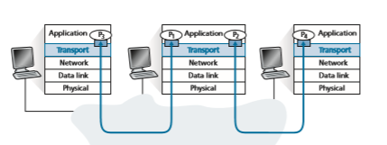
**Figure 3.2**  ♦  Transport-layer multiplexing and demultiplexing

in Figure 3.2 must demultiplex segments arriving from the network layer below to either process P1 or P2 above; this is done by directing the arriving segment’s data to the corresponding process’s socket. The transport layer in the middle host must also gather outgoing data from these sockets, form transport-layer segments, and pass these segments down to the network layer. Although we have introduced mul- tiplexing and demultiplexing in the context of the Internet transport protocols, it’s important to realize that they are concerns whenever a single protocol at one layer (at the transport layer or elsewhere) is used by multiple protocols at the next higher layer.

To illustrate the demultiplexing job, recall the household analogy in the previous section. Each of the kids is identified by his or her name. When Bill receives a batch of mail from the mail carrier, he performs a demultiplexing operation by observing to whom the letters are addressed and then hand delivering the mail to his brothers and sisters. Ann performs a multiplexing operation when she collects letters from her brothers and sisters and gives the collected mail to the mail person.

Now that we understand the roles of transport-layer multiplexing and demulti- plexing, let us examine how it is actually done in a host. From the discussion above, we know that transport-layer multiplexing requires (1) that sockets have unique identifiers, and (2) that each segment have special fields that indicate the socket to which the segment is to be delivered. These special fields, illustrated in Figure 3.3, are the **source port number field** and the **destination port number field**. (The UDP and TCP segments have other fields as well, as discussed in the subsequent sections of this chapter.) Each port number is a 16-bit number, ranging from 0 to 65535. The port numbers ranging from 0 to 1023 are called **well-known port numbers** and are restricted, which means that they are reserved for use by well-known


**Figure 3.3**  ♦   Source and destination port-number fields in a transport-layer segmen

application protocols such as HTTP (which uses port number 80) and FTP (which uses port number 21). The list of well-known port numbers is given in RFC 1700 and is updated at http://www.iana.org [RFC 3232]. When we develop a new appli- cation (such as the simple application developed in Section 2.7), we must assign the application a port number.

It should now be clear how the transport layer _could_ implement the demultiplex- ing service: Each socket in the host could be assigned a port number, and when a segment arrives at the host, the transport layer examines the destination port number in the segment and directs the segment to the corresponding socket. The segment’s data then passes through the socket into the attached process. As we’ll see, this is basically how UDP does it. However, we’ll also see that multiplexing/ demultiplexing in TCP is yet more subtle.

**Connectionless Multiplexing and Demultiplexing**

Recall from Section 2.7.1 that the Python program running in a host can create a UDP socket with the line

clientSocket = socket(AF\_INET, SOCK\_DGRAM)

When a UDP socket is created in this manner, the transport layer automatically assigns a port number to the socket. In particular, the transport layer assigns a port number in the range 1024 to 65535 that is currently not being used by any other UDP port in the host. Alternatively, we can add a line into our Python program after we create the socket to associate a specific port number (say, 19157) to this UDP socket via the socket **bind()** method:

clientSocket.bind((’’, 19157))

If the application developer writing the code were implementing the server side of a “well-known protocol,” then the developer would have to assign the correspond- ing well-known port number. Typically, the client side of the application lets the transport layer automatically (and transparently) assign the port number, whereas the server side of the application assigns a specific port number.

With port numbers assigned to UDP sockets, we can now precisely describe UDP multiplexing/demultiplexing. Suppose a process in Host A, with UDP port 19157, wants to send a chunk of application data to a process with UDP port 46428 in Host B. The transport layer in Host A creates a transport-layer segment that includes the application data, the source port number (19157), the destination port number (46428), and two other values (which will be discussed later, but are unimportant for the current discussion). The transport layer then passes the resulting segment to the network layer. The network layer encapsulates the segment in an IP datagram and makes a best-effort attempt to deliver the segment to the receiving host. If the seg- ment arrives at the receiving Host B, the transport layer at the receiving host exam- ines the destination port number in the segment (46428) and delivers the segment to its socket identified by port 46428. Note that Host B could be running multiple processes, each with its own UDP socket and associated port number. As UDP seg- ments arrive from the network, Host B directs (demultiplexes) each segment to the appropriate socket by examining the segment’s destination port number.

It is important to note that a UDP socket is fully identified by a two-tuple consist- ing of a destination IP address and a destination port number. As a consequence, if two UDP segments have different source IP addresses and/or source port numbers, but have the same _destination_ IP address and _destination_ port number, then the two seg- ments will be directed to the same destination process via the same destination socket.

You may be wondering now, what is the purpose of the source port number? As shown in Figure 3.4, in the A-to-B segment the source port number serves as part of a “return address”—when B wants to send a segment back to A, the destina- tion port in the B-to-A segment will take its value from the source port value of the A-to-B segment. (The complete return address is A’s IP address and the source port number.) As an example, recall the UDP server program studied in Section 2.7. In UDPServer.py, the server uses the recvfrom() method to extract the client- side (source) port number from the segment it receives from the client; it then sends a new segment to the client, with the extracted source port number serving as the destination port number in this new segment.

**Connection-Oriented Multiplexing and Demultiplexing**

In order to understand TCP demultiplexing, we have to take a close look at TCP sockets and TCP connection establishment. One subtle difference between a TCP socket and a UDP socket is that a TCP socket is identified by a four-tuple: (source IP address, source port number, destination IP address, destination port number). Thus, when a TCP segment arrives from the network to a host, the host uses all four values to direct (demultiplex) the segment to the appropriate socket.

**Figure 3.4**  ♦  The inversion of source and destination port numbers

In particular, and in contrast with UDP, two arriving TCP segments with differ- ent source IP addresses or source port numbers will (with the exception of a TCP segment carrying the original connection-establishment request) be directed to two different sockets. To gain further insight, let’s reconsider the TCP client-server pro- gramming example in Section 2.7.2:

• The TCP server application has a “welcoming socket,” that waits for connection- establishment requests from TCP clients (see Figure 2.29) on port number 12000.

• The TCP client creates a socket and sends a connection establishment request segment with the lines:

clientSocket = socket(AF\_INET, SOCK\_STREAM) 
clientSocket.connect((serverName,12000))

• A connection-establishment request is nothing more than a TCP segment with destination port number 12000 and a special connection-establishment bit set in the TCP header (discussed in Section 3.5). The segment also includes a source port number that was chosen by the client.

• When the host operating system of the computer running the server process receives the incoming connection-request segment with destination port 12000, it locates the server process that is waiting to accept a connection on port number 12000. The server process then creates a new socket:

connectionSocket, addr = serverSocket.accept()

• Also, the transport layer at the server notes the following four values in the con- nection-request segment: (1) the source port number in the segment, (2) the IP address of the source host, (3) the destination port number in the segment, and (4) its own IP address. The newly created connection socket is identified by these four values; all subsequently arriving segments whose source port, source IP address, destination port, and destination IP address match these four values will be demultiplexed to this socket. With the TCP connection now in place, the client and server can now send data to each other.

The server host may support many simultaneous TCP connection sockets, with each socket attached to a process, and with each socket identified by its own four- tuple. When a TCP segment arrives at the host, all four fields (source IP address, source port, destination IP address, destination port) are used to direct (demultiplex) the segment to the appropriate socket.

**PORT SCANNING**

We’ve seen that a server process waits patiently on an open port for contact by a remote client. Some ports are reserved for well-known applications (e.g., Web, FTP, DNS, and SMTP servers); other ports are used by convention by popular applications (e.g., the Microsoft Windows SQL server listens for requests on UDP port 1434). Thus, if we determine that a port is open on a host, we may be able to map that port to a specific application running on the host. This is very useful for system administrators, who are often interested in knowing which network applications are running on the hosts in their networks. But attackers, in order to “case the joint,” also want to know which ports are open on target hosts. If a host is found to be running an application with a known security flaw (e.g., a SQL server listening on port 1434 was subject to a buffer overflow, allowing a remote user to execute arbitrary code on the vulnerable host, a flaw exploited by the Slammer worm [CERT 2003–04]), then that host is ripe for attack.

Determining which applications are listening on which ports is a relatively easy task. Indeed there are a number of public domain programs, called port scanners, that do just that. Perhaps the most widely used of these is nmap, freely available at http://nmap.org and included in most Linux distributions. For TCP, nmap sequentially scans ports, looking for ports that are accepting TCP connections. For UDP, nmap again sequentially scans ports, looking for UDP ports that respond to transmitted UDP segments. In both cases, nmap returns a list of open, closed, or unreachable ports. A host running nmap can attempt to scan any target host _anywhere_ in the Internet. We’ll revisit nmap in Section 3.5.6, when we discuss TCP connection management.


**Figure 3.5**  ♦   Two clients, using the same destination port number (80) to communicate with the same Web server application

The situation is illustrated in Figure 3.5, in which Host C initiates two HTTP sessions to server B, and Host A initiates one HTTP session to B. Hosts A and C and server B each have their own unique IP address—A, C, and B, respectively. Host C assigns two different source port numbers (26145 and 7532) to its two HTTP connections. Because Host A is choosing source port numbers independently of C, it might also assign a source port of 26145 to its HTTP connection. But this is not a problem—server B will still be able to correctly demultiplex the two connections having the same source port number, since the two connections have different source IP addresses.

**Web Servers and TCP**

Before closing this discussion, it’s instructive to say a few additional words about Web servers and how they use port numbers. Consider a host running a Web server, such as an Apache Web server, on port 80. When clients (for example, browsers) send segments to the server, _all_ segments will have destination port 80. In particular, both the initial connection-establishment segments and the segments carrying HTTP

request messages will have destination port 80. As we have just described, the server distinguishes the segments from the different clients using source IP addresses and source port numbers.

Figure 3.5 shows a Web server that spawns a new process for each connec- tion. As shown in Figure 3.5, each of these processes has its own connection socket through which HTTP requests arrive and HTTP responses are sent. We mention, however, that there is not always a one-to-one correspondence between connection sockets and processes. In fact, today’s high-performing Web servers often use only one process, and create a new thread with a new connection socket for each new client connection. (A thread can be viewed as a lightweight subprocess.) If you did the first programming assignment in Chapter 2, you built a Web server that does just this. For such a server, at any given time there may be many connection sockets (with different identifiers) attached to the same process.

If the client and server are using persistent HTTP, then throughout the duration of the persistent connection the client and server exchange HTTP messages via the same server socket. However, if the client and server use non-persistent HTTP, then a new TCP connection is created and closed for every request/response, and hence a new socket is created and later closed for every request/response. This frequent creating and closing of sockets can severely impact the performance of a busy Web server (although a number of operating system tricks can be used to mitigate the problem). Readers interested in the operating system issues surrounding persistent and non-persistent HTTP are encouraged to see [Nielsen 1997; Nahum 2002].

Now that we’ve discussed transport-layer multiplexing and demultiplexing, let’s move on and discuss one of the Internet’s transport protocols, UDP. In the next sec- tion, we’ll see that UDP adds little more to the network-layer protocol than a multi- plexing/demultiplexing service.

## Connectionless Transport: UDP

In this section, we’ll take a close look at UDP, how it works, and what it does. We encourage you to refer back to Section 2.1, which includes an overview of the UDP service model, and to Section 2.7.1, which discusses socket programming using UDP.

To motivate our discussion about UDP, suppose you were interested in design- ing a no-frills, bare-bones transport protocol. How might you go about doing this? You might first consider using a vacuous transport protocol. In particular, on the sending side, you might consider taking the messages from the application process and passing them directly to the network layer; and on the receiving side, you might consider taking the messages arriving from the network layer and passing them directly to the application process. But as we learned in the previous section, we haveto do a little more than nothing! At the very least, the transport layer has to provide a multiplexing/demultiplexing service in order to pass data between the network layer and the correct application-level process.

UDP, defined in [RFC 768], does just about as little as a transport protocol can do. Aside from the multiplexing/demultiplexing function and some light error checking, it adds nothing to IP. In fact, if the application developer chooses UDP instead of TCP, then the application is almost directly talking with IP. UDP takes messages from the application process, attaches source and destination port number fields for the multi- plexing/demultiplexing service, adds two other small fields, and passes the resulting segment to the network layer. The network layer encapsulates the transport-layer seg- ment into an IP datagram and then makes a best-effort attempt to deliver the segment to the receiving host. If the segment arrives at the receiving host, UDP uses the destina- tion port number to deliver the segment’s data to the correct application process. Note that with UDP there is no handshaking between sending and receiving transport-layer entities before sending a segment. For this reason, UDP is said to be _connectionless._

DNS is an example of an application-layer protocol that typically uses UDP. When the DNS application in a host wants to make a query, it constructs a DNS query message and passes the message to UDP. Without performing any handshaking with the UDP entity running on the destination end system, the host-side UDP adds header fields to the message and passes the resulting segment to the network layer. The net- work layer encapsulates the UDP segment into a datagram and sends the datagram to a name server. The DNS application at the querying host then waits for a reply to its query. If it doesn’t receive a reply (possibly because the underlying network lost the query or the reply), it might try resending the query, try sending the query to another name server, or inform the invoking application that it can’t get a reply.

Now you might be wondering why an application developer would ever choose to build an application over UDP rather than over TCP. Isn’t TCP always preferable, since TCP provides a reliable data transfer service, while UDP does not? The answer is no, as some applications are better suited for UDP for the following reasons:

• _Finer application-level control over what data is sent, and when._ Under UDP, as soon as an application process passes data to UDP, UDP will package the data inside a UDP segment and immediately pass the segment to the network layer. TCP, on the other hand, has a congestion-control mechanism that throttles the transport-layer TCP sender when one or more links between the source and des- tination hosts become excessively congested. TCP will also continue to resend a segment until the receipt of the segment has been acknowledged by the destina- tion, regardless of how long reliable delivery takes. Since real-time applications often require a minimum sending rate, do not want to overly delay segment trans- mission, and can tolerate some data loss, TCP’s service model is not particularly well matched to these applications’ needs. As discussed below, these applications can use UDP and implement, as part of the application, any additional functional- ity that is needed beyond UDP’s no-frills segment-delivery service.• _No connection establishment._ As we’ll discuss later, TCP uses a three-way hand- shake before it starts to transfer data. UDP just blasts away without any formal preliminaries. Thus UDP does not introduce any delay to establish a connection. This is probably the principal reason why DNS runs over UDP rather than TCP— DNS would be much slower if it ran over TCP. HTTP uses TCP rather than UDP, since reliability is critical for Web pages with text. But, as we briefly discussed in Section 2.2, the TCP connection-establishment delay in HTTP is an important contributor to the delays associated with downloading Web documents. Indeed, the QUIC protocol (Quick UDP Internet Connection, [IETF QUIC 2020]), used in Google’s Chrome browser, uses UDP as its underlying transport protocol and implements reliability in an application-layer protocol on top of UDP. We’ll take a closer look at QUIC in Section 3.8.

• _No connection state._ TCP maintains connection state in the end systems. This connection state includes receive and send buffers, congestion-control param- eters, and sequence and acknowledgment number parameters. We will see in Section 3.5 that this state information is needed to implement TCP’s reliable data transfer service and to provide congestion control. UDP, on the other hand, does not maintain connection state and does not track any of these parameters. For this reason, a server devoted to a particular application can typically support many more active clients when the application runs over UDP rather than TCP.

• _Small packet header overhead._ The TCP segment has 20 bytes of header over- head in every segment, whereas UDP has only 8 bytes of overhead.

Figure 3.6 lists popular Internet applications and the transport protocols that they use. As we expect, e-mail, remote terminal access, and file transfer run over TCP—all these applications need the reliable data transfer service of TCP. We learned in Chapter 2 that early versions of HTTP ran over TCP but that more recent versions of HTTP run over UDP, providing their own error control and congestion control (among other services) at the application layer. Nevertheless, many important applications run over UDP rather than TCP. For example, UDP is used to carry network management (SNMP; see Section 5.7) data. UDP is preferred to TCP in this case, since network management applications must often run when the network is in a stressed state—precisely when reliable, congestion-controlled data transfer is diffi- cult to achieve. Also, as we mentioned earlier, DNS runs over UDP, thereby avoiding TCP’s connection-establishment delays.

As shown in Figure 3.6, both UDP and TCP are sometimes used today with multimedia applications, such as Internet phone, real-time video conferencing, and streaming of stored audio and video. We just mention now that all of these applica- tions can tolerate a small amount of packet loss, so that reliable data transfer is not absolutely critical for the application’s success. Furthermore, real-time applications, like Internet phone and video conferencing, react very poorly to TCP’s congestion control. For these reasons, developers of multimedia applications may choose to run their applications over UDP instead of TCP. When packet loss rates are low, and

**Figure 3.6**  ♦   Popular Internet applications and their underlying transport protocol

with some organizations blocking UDP traffic for security reasons (see Chapter 8), TCP becomes an increasingly attractive protocol for streaming media transport.

Although commonly done today, running multimedia applications over UDP needs to be done with care. As we mentioned above, UDP has no congestion control. But congestion control is needed to prevent the network from entering a congested state in which very little useful work is done. If everyone were to start streaming high-bit-rate video without using any congestion control, there would be so much packet overflow at routers that very few UDP packets would successfully traverse the source-to-destination path. Moreover, the high loss rates induced by the uncontrolled UDP senders would cause the TCP senders (which, as we’ll see, _do_ decrease their sending rates in the face of congestion) to dramatically decrease their rates. Thus, the lack of congestion control in UDP can result in high loss rates between a UDP sender and receiver, and the crowding out of TCP sessions. Many researchers have proposed new mechanisms to force all sources, including UDP sources, to perform adaptive congestion control [Mahdavi 1997; Floyd 2000; Kohler 2006: RFC 4340].

Before discussing the UDP segment structure, we mention that it _is_ possible for an application to have reliable data transfer when using UDP. This can be done if reliability is built into the application itself (for example, by adding acknowl- edgment and retransmission mechanisms, such as those we’ll study in the next section). We mentioned earlier that the QUIC protocol implements reliability in an application-layer protocol on top of UDP. But this is a nontrivial task that would keep an application developer busy debugging for a long time. Neverthe- less, building reliability directly into the application allows the application to “have sits cake and eat it too.” That is, application processes can communicate reliably without being subjected to the transmission-rate constraints imposed by TCP’s congestion-control mechanism.

### UDP Segment Structure
 The UDP segment structure, shown in Figure 3.7, is defined in RFC 768. The applica- tion data occupies the data field of the UDP segment. For example, for DNS, the data field contains either a query message or a response message. For a streaming audio application, audio samples fill the data field. The UDP header has only four fields, each consisting of two bytes. As discussed in the previous section, the port numbers allow the destination host to pass the application data to the correct process run- ning on the destination end system (that is, to perform the demultiplexing function). The length field specifies the number of bytes in the UDP segment (header plus data). An explicit length value is needed since the size of the data field may differ from one UDP segment to the next. The checksum is used by the receiving host to check whether errors have been introduced into the segment. In truth, the check- sum is also calculated over a few of the fields in the IP header in addition to the UDP segment. But we ignore this detail in order to see the forest through the trees. We’ll discuss the checksum calculation below. Basic principles of error detection are described in Section 6.2. The length field specifies the length of the UDP segment, including the header, in bytes.

### UDP Checksum
 The UDP checksum provides for error detection. That is, the checksum is used to determine whether bits within the UDP segment have been altered (for example, by noise in the links or while stored in a router) as it moved from source to destination.
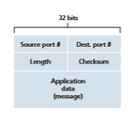

**Figure 3.7**  ♦  UDP segment structure

UDP at the sender side performs the 1s complement of the sum of all the 16-bit words in the segment, with any overflow encountered during the sum being wrapped around. This result is put in the checksum field of the UDP segment. Here we give a simple example of the checksum calculation. You can find details about efficient implementation of the calculation in RFC 1071 and performance over real data in \[Stone 1998; Stone 2000\]. As an example, suppose that we have the following three 16-bit words:

0110011001100000 
0101010101010101 
1000111100001100

The sum of first two of these 16-bit words is

0110011001100000 
0101010101010101 
1011101110110101

Adding the third word to the above sum gives

1011101110110101 
1000111100001100 
0100101011000010

Note that this last addition had overflow, which was wrapped around. The 1s complement is obtained by converting all the 0s to 1s and converting all the 1s to 0s. Thus, the 1s complement of the sum 0100101011000010 is 1011010100111101, which becomes the checksum. At the receiver, all four 16-bit words are added, including the checksum. If no errors are introduced into the packet, then clearly the sum at the receiver will be 1111111111111111. If one of the bits is a 0, then we know that errors have been introduced into the packet.

You may wonder why UDP provides a checksum in the first place, as many link-layer protocols (including the popular Ethernet protocol) also provide error checking. The reason is that there is no guarantee that all the links between source and destination provide error checking; that is, one of the links may use a link-layer protocol that does not provide error checking. Furthermore, even if segments are correctly transferred across a link, it’s possible that bit errors could be introduced when a segment is stored in a router’s memory. Given that neither link-by-link reli- ability nor in-memory error detection is guaranteed, UDP must provide error detec- tion at the transport layer, _on an end-end basis_, if the end-end data transfer service is to provide error detection. This is an example of the celebrated **end-end principle** in system design [Saltzer 1984], which states that since certain functionality (error detection, in this case) must be implemented on an end-end basis: “functions placedat the lower levels may be redundant or of little value when compared to the cost of providing them at the higher level.”

Because IP is supposed to run over just about any layer-2 protocol, it is useful for the transport layer to provide error checking as a safety measure. Although UDP provides error checking, it does not do anything to recover from an error. Some implementations of UDP simply discard the damaged segment; others pass the dam- aged segment to the application with a warning.

That wraps up our discussion of UDP. We will soon see that TCP offers reli- able data transfer to its applications as well as other services that UDP doesn’t offer. Naturally, TCP is also more complex than UDP. Before discussing TCP, however, it will be useful to step back and first discuss the underlying principles of reliable data transfer.

## Principles of Reliable Data Transfer

In this section, we consider the problem of reliable data transfer in a general context. This is appropriate since the problem of implementing reliable data transfer occurs not only at the transport layer, but also at the link layer and the application layer as well. The general problem is thus of central importance to networking. Indeed, if one had to identify a “top-ten” list of fundamentally important problems in all of networking, this would be a candidate to lead the list. In the next section, we’ll examine TCP and show, in particular, that TCP exploits many of the principles that we are about to describe.

Figure 3.8 illustrates the framework for our study of reliable data transfer. The service abstraction provided to the upper-layer entities is that of a reliable channel through which data can be transferred. With a reliable channel, no transferred data bits are corrupted (flipped from 0 to 1, or vice versa) or lost, and all are delivered in the order in which they were sent. This is precisely the service model offered by TCP to the Internet applications that invoke it.

It is the responsibility of a **reliable data transfer protocol** to implement this service abstraction. This task is made difficult by the fact that the layer _below_ the reliable data transfer protocol may be unreliable. For example, TCP is a reliable data transfer protocol that is implemented on top of an unreliable (IP) end-to-end network layer. More generally, the layer beneath the two reliably communicating end points might consist of a single physical link (as in the case of a link-level data transfer protocol) or a global internetwork (as in the case of a transport-level protocol). For our purposes, however, we can view this lower layer simply as an unreliable point- to-point channel.

In this section, we will incrementally develop the sender and receiver sides of a reliable data transfer protocol, considering increasingly complex models of the underlying channel. For example, we’ll consider what protocol mechanisms are

**Figure 3.8**  ♦   Reliable data transfer: Service model and service implementation

needed when the underlying channel can corrupt bits or lose entire packets. One assumption we’ll adopt throughout our discussion here is that packets will be deliv- ered in the order in which they were sent, with some packets possibly being lost; that is, the underlying channel will not reorder packets. Figure 3.8(b) illustrates the interfaces for our data transfer protocol. The sending side of the data transfer proto- col will be invoked from above by a call to rdt\_send(). It will pass the data to be delivered to the upper layer at the receiving side. (Here rdt stands for _reliable data transfer_ protocol and \_send indicates that the sending side of rdt is being called. The first step in developing any protocol is to choose a good name!) On the receiving side, rdt\_rcv() will be called when a packet arrives from the receiving side of the channel. When the rdt protocol wants to deliver data to the upper layer, it will do so by calling deliver\_data(). In the following, we use the terminology “packet” rather than transport-layer “segment.” Because the theory developed in this section
applies to computer networks in general and not just to the Internet transport layer, the generic term “packet” is perhaps more appropriate here.

In this section, we consider only the case of **unidirectional data transfer**, that is, data transfer from the sending to the receiving side. The case of reliable **bidirectional** (that is, full-duplex) **data transfer** is conceptually no more difficult but considerably more tedious to explain. Although we consider only unidirectional data transfer, it is important to note that the sending and receiving sides of our protocol will nonetheless need to transmit packets in _both_ directions, as indicated in Figure 3.8. We will see shortly that, in addition to exchanging packets containing the data to be transferred, the sending and receiving sides of rdt will also need to exchange control packets back and forth. Both the send and receive sides of rdt send packets to the other side by a call to udt\_send() (where udt stands for _unreliable data transfer_).

### Building a Reliable Data Transfer Protocol

 We now step through a series of protocols, each one becoming more complex, arriv- ing at a flawless, reliable data transfer protocol.

**Reliable Data Transfer over a Perfectly Reliable Channel: rdt1.0**

We first consider the simplest case, in which the underlying channel is completely reliable. The protocol itself, which we’ll call rdt1.0, is trivial. The **finite-state machine (FSM)** definitions for the rdt1.0 sender and receiver are shown in Figure 3.9. The FSM in Figure 3.9(a) defines the operation of the sender, while the FSM in Figure 3.9(b) defines the operation of the receiver. It is important to note that there are _separate_ FSMs for the sender and for the receiver. The sender and receiver FSMs in Figure 3.9 each have just one state. The arrows in the FSM description indicate the transition of the protocol from one state to another. (Since each FSM in Figure 3.9 has just one state, a transition is necessarily from the one state back to itself; we’ll see more complicated state diagrams shortly.) The event causing the transition is shown above the horizontal line labeling the transition, and the actions taken when the event occurs are shown below the horizontal line. When no action is taken on an event, or no event occurs and an action is taken, we’ll use the symbol Λ below or above the horizontal, respectively, to explicitly denote the lack of an action or event. The initial state of the FSM is indicated by the dashed arrow. Although the FSMs in Figure 3.9 have but one state, the FSMs we will see shortly have multiple states, so it will be important to identify the initial state of each FSM.

The sending side of rdt simply accepts data from the upper layer via the rdt\_send(data) event, creates a packet containing the data (via the action make\_pkt(data)) and sends the packet into the channel. In practice, the rdt\_send(data) event would result from a procedure call (for example, to rdt\_send()) by the upper-layer application.


**Figure 3.9**  ♦ rdt1.0—A protocol for a completely reliable channel

On the receiving side, rdt receives a packet from the underlying channel via the rdt\_rcv(packet) event, removes the data from the packet (via the action extract (packet, data)) and passes the data up to the upper layer (via the action deliver\_data(data)). In practice, the rdt\_rcv(packet) event would result from a procedure call (for example, to rdt\_rcv()) from the lower- layer protocol.

In this simple protocol, there is no difference between a unit of data and a packet. Also, all packet flow is from the sender to receiver; with a perfectly reliable chan- nel there is no need for the receiver side to provide any feedback to the sender since nothing can go wrong! Note that we have also assumed that the receiver is able to receive data as fast as the sender happens to send data. Thus, there is no need for the receiver to ask the sender to slow down!

**Reliable Data Transfer over a Channel with Bit Errors: rdt2.0**

A more realistic model of the underlying channel is one in which bits in a packet may be corrupted. Such bit errors typically occur in the physical components of a network as a packet is transmitted, propagates, or is buffered. We’ll continue to assume for the moment that all transmitted packets are received (although their bits may be cor- rupted) in the order in which they were sent.

Before developing a protocol for reliably communicating over such a channel, first consider how people might deal with such a situation. Consider how you yourself
might dictate a long message over the phone. In a typical scenario, the message taker might say “OK” after each sentence has been heard, understood, and recorded. If the message taker hears a garbled sentence, you’re asked to repeat the garbled sentence. This message-dictation protocol uses both **positive acknowledgments** (“OK”) and **negative acknowledgments** (“Please repeat that.”). These control messages allow the receiver to let the sender know what has been received correctly, and what has been received in error and thus requires repeating. In a computer network setting, reliable data transfer protocols based on such retransmission are known as **ARQ (Automatic Repeat reQuest) protocols**.

Fundamentally, three additional protocol capabilities are required in ARQ pro- tocols to handle the presence of bit errors:

• _Error detection._ First, a mechanism is needed to allow the receiver to detect when bit errors have occurred. Recall from the previous section that UDP uses the Inter- net checksum field for exactly this purpose. In Chapter 6, we’ll examine error- detection and -correction techniques in greater detail; these techniques allow the receiver to detect and possibly correct packet bit errors. For now, we need only know that these techniques require that extra bits (beyond the bits of original data to be transferred) be sent from the sender to the receiver; these bits will be gath- ered into the packet checksum field of the rdt2.0 data packet.

• _Receiver feedback._ Since the sender and receiver are typically executing on dif- ferent end systems, possibly separated by thousands of miles, the only way for the sender to learn of the receiver’s view of the world (in this case, whether or not a packet was received correctly) is for the receiver to provide explicit feedback to the sender. The positive (ACK) and negative (NAK) acknowledgment replies in the message-dictation scenario are examples of such feedback. Our rdt2.0 protocol will similarly send ACK and NAK packets back from the receiver to the sender. In principle, these packets need only be one bit long; for example, a 0 value could indicate a NAK and a value of 1 could indicate an ACK.

• _Retransmission._ A packet that is received in error at the receiver will be retrans- mitted by the sender.

Figure 3.10 shows the FSM representation of rdt2.0, a data transfer protocol employing error detection, positive acknowledgments, and negative acknowledgments.

The send side of rdt2.0 has two states. In the leftmost state, the send-side protocol is waiting for data to be passed down from the upper layer. When the rdt\_send(data) event occurs, the sender will create a packet (sndpkt) con- taining the data to be sent, along with a packet checksum (for example, as discussed in Section 3.3.2 for the case of a UDP segment), and then send the packet via the udt\_send(sndpkt) operation. In the rightmost state, the sender protocol is wait- ing for an ACK or a NAK packet from the receiver.

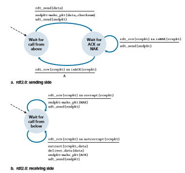

**Figure 3.10**  ♦ rdt2.0—A protocol for a channel with bit errors

(the notation rdt\_rcv(rcvpkt) && isACK(rcvpkt) in Figure 3.10 cor- responds to this event), the sender knows that the most recently transmitted packet has been received correctly and thus the protocol returns to the state of waiting for data from the upper layer. If a NAK is received, the protocol retransmits the last packet and waits for an ACK or NAK to be returned by the receiver in response to the retransmitted data packet. It is important to note that when the sender is in the wait-for-ACK-or-NAK state, it _cannot_ get more data from the upper layer; that is, the rdt\_send() event can not occur; that will happen only after the sender receives an ACK and leaves this state. Thus, the sender will not send a new piece of data until it is sure that the receiver has correctly received the current packet. Because of this behavior, protocols such as rdt2.0 are known as **stop-and-wait** protocols.

The receiver-side FSM for rdt2.0 still has a single state. On packet arrival, the receiver replies with either an ACK or a NAK, depending on whether or not the received packet is corrupted. In Figure 3.10, the notation rdt\_rcv(rcvpkt) && corrupt(rcvpkt) corresponds to the event in which a packet is received and is found to be in error.

Protocol rdt2.0 may look as if it works but, unfortunately, it has a fatal flaw. In particular, we haven’t accounted for the possibility that the ACK or NAK packet could be corrupted! (Before proceeding on, you should think about how this prob- lem may be fixed.) Unfortunately, our slight oversight is not as innocuous as it may seem. Minimally, we will need to add checksum bits to ACK/NAK packets in order to detect such errors. The more difficult question is how the protocol should recover from errors in ACK or NAK packets. The difficulty here is that if an ACK or NAK is corrupted, the sender has no way of knowing whether or not the receiver has cor- rectly received the last piece of transmitted data.

Consider three possibilities for handling corrupted ACKs or NAKs:

• For the first possibility, consider what a human might do in the message-dictation scenario. If the speaker didn’t understand the “OK” or “Please repeat that” reply from the receiver, the speaker would probably ask, “What did you say?” (thus introducing a new type of sender-to-receiver packet to our protocol). The receiver would then repeat the reply. But what if the speaker’s “What did you say?” is cor- rupted? The receiver, having no idea whether the garbled sentence was part of the dictation or a request to repeat the last reply, would probably then respond with “What did _you_ say?” And then, of course, that response might be garbled. Clearly, we’re heading down a difficult path.

• A second alternative is to add enough checksum bits to allow the sender not only to detect, but also to recover from, bit errors. This solves the immediate problem for a channel that can corrupt packets but not lose them.

• A third approach is for the sender simply to resend the current data packet when it receives a garbled ACK or NAK packet. This approach, however, introduces **duplicate packets** into the sender-to-receiver channel. The fundamental diffi- culty with duplicate packets is that the receiver doesn’t know whether the ACK or NAK _it_ last sent was received correctly at the sender. Thus, it cannot know _a priori_ whether an arriving packet contains new data or is a retransmission!

A simple solution to this new problem (and one adopted in almost all exist- ing data transfer protocols, including TCP) is to add a new field to the data packet and have the sender number its data packets by putting a **sequence number** into this field. The receiver then need only check this sequence number to determine whether or not the received packet is a retransmission. For this simple case of a stop-and-wait protocol, a 1-bit sequence number will suffice, since it will allow the receiver to know whether the sender is resending the previously transmitted packet(the sequence number of the received packet has the same sequence number as the most recently received packet) or a new packet (the sequence number changes, mov- ing “forward” in modulo-2 arithmetic). Since we are currently assuming a channel that does not lose packets, ACK and NAK packets do not themselves need to indicate the sequence number of the packet they are acknowledging. The sender knows that a received ACK or NAK packet (whether garbled or not) was generated in response to its most recently transmitted data packet.

Figures 3.11 and 3.12 show the FSM description for rdt2.1, our fixed version of rdt2.0. The rdt2.1 sender and receiver FSMs each now have twice as many states as before. This is because the protocol state must now reflect whether the packet currently being sent (by the sender) or expected (at the receiver) should have a sequence number of 0 or 1. Note that the actions in those states where a 0-numbered packet is being sent or expected are mirror images of those where a 1-numbered packet is being sent or expected; the only differences have to do with the handling of the sequence number.

Protocol rdt2.1 uses both positive and negative acknowledgments from the receiver to the sender. When an out-of-order packet is received, the receiver sends a positive acknowledgment for the packet it has received. When a corrupted packet
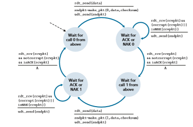
**Figure 3.11**  ♦ rdt2.1 sender

**Figure 3.12**  ♦ rdt2.1 receiver

is received, the receiver sends a negative acknowledgment. We can accomplish the same effect as a NAK if, instead of sending a NAK, we send an ACK for the last correctly received packet. A sender that receives two ACKs for the same packet (that is, receives **duplicate ACKs**) knows that the receiver did not correctly receive the packet following the packet that is being ACKed twice. Our NAK-free reliable data transfer protocol for a channel with bit errors is rdt2.2, shown in Figures 3.13 and 3.14. One subtle change between rtdt2.1 and rdt2.2 is that the receiver must now include the sequence number of the packet being acknowledged by an ACK message (this is done by including the ACK, 0 or ACK, 1 argument in make\_pkt() in the receiver FSM), and the sender must now check the sequence number of the packet being acknowledged by a received ACK message (this is done by including the 0 or 1 argument in isACK() in the sender FSM).

**Reliable Data Transfer over a Lossy Channel with Bit Errors: rdt3.0**

Suppose now that in addition to corrupting bits, the underlying channel can _lose_ packets as well, a not-uncommon event in today’s computer networks (including the Internet). Two additional concerns must now be addressed by the protocol: how to detect packet loss and what to do when packet loss occurs. The use of check- summing, sequence numbers, ACK packets, and retransmissions—the techniques

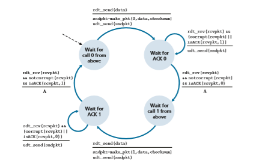
**Figure 3.13**  ♦ rdt2.2 sender

already developed in rdt2.2—will allow us to answer the latter concern. Handling the first concern will require adding a new protocol mechanism.

There are many possible approaches toward dealing with packet loss (several more of which are explored in the exercises at the end of the chapter). Here, we’ll put the burden of detecting and recovering from lost packets on the sender. Suppose that the sender transmits a data packet and either that packet, or the receiver’s ACK of that packet, gets lost. In either case, no reply is forthcoming at the sender from the receiver. If the sender is willing to wait long enough so that it is _certain_ that a packet has been lost, it can simply retransmit the data packet. You should convince yourself that this protocol does indeed work.

But how long must the sender wait to be certain that something has been lost? The sender must clearly wait at least as long as a round-trip delay between the sender and receiver (which may include buffering at intermediate routers) plus whatever amount of time is needed to process a packet at the receiver. In many networks, this worst-case maximum delay is very difficult even to estimate, much less know with certainty. Moreover, the protocol should ideally recover from packet loss as soon as possible; waiting for a worst-case delay could mean a long wait until error recovery

**Figure 3.14**  ♦ rdt2.2 receiver

is initiated. The approach thus adopted in practice is for the sender to judiciously choose a time value such that packet loss is likely, although not guaranteed, to have happened. If an ACK is not received within this time, the packet is retransmitted. Note that if a packet experiences a particularly large delay, the sender may retrans- mit the packet even though neither the data packet nor its ACK have been lost. This introduces the possibility of **duplicate data packets** in the sender-to-receiver chan- nel. Happily, protocol rdt2.2 already has enough functionality (that is, sequence numbers) to handle the case of duplicate packets.

From the sender’s viewpoint, retransmission is a panacea. The sender does not know whether a data packet was lost, an ACK was lost, or if the packet or ACK was simply overly delayed. In all cases, the action is the same: retransmit. Implement- ing a time-based retransmission mechanism requires a **countdown timer** that can interrupt the sender after a given amount of time has expired. The sender will thus need to be able to (1) start the timer each time a packet (either a first-time packet or a retransmission) is sent, (2) respond to a timer interrupt (taking appropriate actions), and (3) stop the timer.

Figure 3.15 shows the sender FSM for rdt3.0, a protocol that reliably transfers data over a channel that can corrupt or lose packets; in the homework problems, you’ll be asked to provide the receiver FSM for rdt3.0. Figure 3.16 shows how the pro- tocol operates with no lost or delayed packets and how it handles lost data packets. In Figure 3.16, time moves forward from the top of the diagram toward the bottom of the

diagram; note that a receive time for a packet is necessarily later than the send time for a packet as a result of transmission and propagation delays. In Figures 3.16(b)–(d), the send-side brackets indicate the times at which a timer is set and later times out. Sev- eral of the more subtle aspects of this protocol are explored in the exercises at the end of this chapter. Because packet sequence numbers alternate between 0 and 1, protocol rdt3.0 is sometimes known as the **alternating-bit protocol**.

**Figure 3.15**  ♦ rdt3.0 sender
We have now assembled the key elements of a data transfer protocol. Check- sums, sequence numbers, timers, and positive and negative acknowledgment packets each play a crucial and necessary role in the operation of the protocol. We now have a working reliable data transfer protocol!

### Pipelined Reliable Data Transfer Protocols

Protocol rdt3.0 is a functionally correct protocol, but it is unlikely that anyone would be happy with its performance, particularly in today’s high-speed networks. At the heart of rdt3.0’s performance problem is the fact that it is a stop-and-wait protocol.


**Figure 3.16**  ♦  Operation of rdt3.0, the alternating-bit protocol

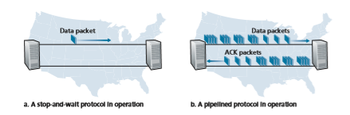
**Figure 3.17**  ♦  Stop-and-wait versus pipelined protocol

To appreciate the performance impact of this stop-and-wait behavior, consider an idealized case of two hosts, one located on the West Coast of the United States and the other located on the East Coast, as shown in Figure 3.17. The speed-of-light round-trip propagation delay between these two end systems, RTT, is approximately 30 milliseconds. Suppose that they are connected by a channel with a transmission rate, _R_, of 1 Gbps (109 bits per second). With a packet size, _L,_ of 1,000 bytes (8,000 bits) per packet, including both header fields and data, the time needed to actually transmit the packet into the 1 Gbps link is

_d_trans = _L R_\= 8000 bits
109 bits/sec = 8 microseconds

Figure 3.18(a) shows that with our stop-and-wait protocol, if the sender begins sending the packet at _t_ \= 0, then at _t_ \= _L_/_R_ \= 8 microseconds, the last bit enters the channel at the sender side. The packet then makes its 15-msec cross-country jour- ney, with the last bit of the packet emerging at the receiver at _t_ \= RTT/2 + _L_/_R_ = 15.008 msec. Assuming for simplicity that ACK packets are extremely small (so that we can ignore their transmission time) and that the receiver can send an ACK as soon as the last bit of a data packet is received, the ACK emerges back at the sender at _t_ \= RTT + _L_/_R_ \= 30.008 msec. At this point, the sender can now transmit the next message. Thus, in 30.008 msec, the sender was sending for only 0.008 msec. If we define the **utilization** of the sender (or the channel) as the fraction of time the sender is actually busy sending bits into the channel, the analysis in Figure 3.18(a) shows that the stop-and-wait protocol has a rather dismal sender utilization, _U_sender, of

_U_sender = _L_\>_R_

_RTT_ \+ _L_\>_R_ \= .008

30.008 = 0.00027

Data packetsData packet

ACK packets

**a. A stop-and-wait protocol in operation b. A pipelined protocol in operation**

First bit of first packet transmitted, t = 0 Last bit of first packet transmitted, t = _L/R_

**Figure 3.18**  ♦  Stop-and-wait and pipelined sending

That is, the sender was busy only 2.7 hundredths of one percent of the time! Viewed another way, the sender was able to send only 1,000 bytes in 30.008 mil- liseconds, an effective throughput of only 267 kbps—even though a 1 Gbps link was available! Imagine the unhappy network manager who just paid a fortune for a gigabit capacity link but manages to get a throughput of only 267 kilobits per second! This is a graphic example of how network protocols can limit the capabili- ties provided by the underlying network hardware. Also, we have neglected lower- layer protocol-processing times at the sender and receiver, as well as the process- ing and queuing delays that would occur at any intermediate routers between the sender and receiver. Including these effects would serve only to further increase the delay and further accentuate the poor performance.

The solution to this particular performance problem is simple: Rather than oper- ate in a stop-and-wait manner, the sender is allowed to send multiple packets with- out waiting for acknowledgments, as illustrated in Figure 3.17(b). Figure 3.18(b) shows that if the sender is allowed to transmit three packets before having to wait for acknowledgments, the utilization of the sender is essentially tripled. Since the many in-transit sender-to-receiver packets can be visualized as filling a pipeline, this tech- nique is known as **pipelining**. Pipelining has the following consequences for reliable data transfer protocols:

• The range of sequence numbers must be increased, since each in-transit packet (not counting retransmissions) must have a unique sequence number and there may be multiple, in-transit, unacknowledged packets.

• The sender and receiver sides of the protocols may have to buffer more than one packet. Minimally, the sender will have to buffer packets that have been transmit- ted but not yet acknowledged. Buffering of correctly received packets may also be needed at the receiver, as discussed below.

• The range of sequence numbers needed and the buffering requirements will depend on the manner in which a data transfer protocol responds to lost, cor- rupted, and overly delayed packets. Two basic approaches toward pipelined error recovery can be identified: **Go-Back-N** and **selective repeat**.

### Go-Back-N (GBN)
In a **Go-Back-N** (GBN) protocol, the sender is allowed to transmit multiple packets (when available) without waiting for an acknowledgment, but is constrained to have no more than some maximum allowable number, _N,_ of unacknowledged packets in the pipeline. We describe the GBN protocol in some detail in this section. But before reading on, you are encouraged to play with the GBN animation (an awesome inter- active animation) at the Companion Website.

Figure 3.19 shows the sender’s view of the range of sequence numbers in a GBN protocol. If we define base to be the sequence number of the oldest unacknowledged


**Figure 3.19**  ♦  Sender’s view of sequence numbers in Go-Back-Nrdt\_send(data)

packet and nextseqnum to be the smallest unused sequence number (that is, the sequence number of the next packet to be sent), then four intervals in the range of sequence numbers can be identified. Sequence numbers in the interval [0,base-1] correspond to packets that have already been transmitted and acknowledged. The inter- val [base,nextseqnum-1] corresponds to packets that have been sent but not yet acknowledged. Sequence numbers in the interval [nextseqnum,base+N-1] can be used for packets that can be sent immediately, should data arrive from the upper layer. Finally, sequence numbers greater than or equal to base+N cannot be used until an unacknowledged packet currently in the pipeline (specifically, the packet with sequence number base) has been acknowledged.

As suggested by Figure 3.19, the range of permissible sequence numbers for transmitted but not yet acknowledged packets can be viewed as a window of size _N_ over the range of sequence numbers. As the protocol operates, this window slides forward over the sequence number space. For this reason, _N_ is often referred to as the **window size** and the GBN protocol itself as a **sliding-window protocol**. You might be wondering why we would even limit the number of outstanding, unacknowledged packets to a value of _N_ in the first place. Why not allow an unlimited number of such packets? We’ll see in Section 3.5 that flow control is one reason to impose a limit on the sender. We’ll examine another reason to do so in Section 3.7, when we study TCP congestion control.

In practice, a packet’s sequence number is carried in a fixed-length field in the packet header. If _k_ is the number of bits in the packet sequence number field, the range of sequence numbers is thus [0,2_k_ \- 1]. With a finite range of sequence num- bers, all arithmetic involving sequence numbers must then be done using modulo 2_k_ arithmetic. (That is, the sequence number space can be thought of as a ring of size 2_k_, where sequence number 2_k_ \- 1 is immediately followed by sequence number 0.) Recall that rdt3.0 had a 1-bit sequence number and a range of sequence numbers of [0,1]. Several of the problems at the end of this chapter explore the consequences of a finite range of sequence numbers. We will see in Section 3.5 that TCP has a 32-bit sequence number field, where TCP sequence numbers count bytes in the byte stream rather than packets.

Figures 3.20 and 3.21 give an extended FSM description of the sender and receiver sides of an ACK-based, NAK-free, GBN protocol. We refer to this FSM

```
if(nextseqnum<base+N){ 
sndpkt\[nextseqnum\]=make\_pkt(nextseqnum,data,checksum) udt\_send(sndpkt\[nextseqnum\]) 
if(base==nextseqnum) s
tart\_timer 
nextseqnum++ 
} 
else refuse\_data(data)
```

**Figure 3.20**  ♦  Extended FSM description of the GBN sender
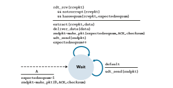
**Figure 3.21**  ♦  Extended FSM description of the GBN receiver
description as an _extended FSM_ because we have added variables (similar to programming-language variables) for base and nextseqnum, and added opera- tions on these variables and conditional actions involving these variables. Note that the extended FSM specification is now beginning to look somewhat like a program- ming-language specification. \[Bochman 1984\] provides an excellent survey of addi- tional extensions to FSM techniques as well as other programming-language-based techniques for specifying protocols.

The GBN sender must respond to three types of events:

• _Invocation from above._ When rdt\_send() is called from above, the sender first checks to see if the window is full, that is, whether there are _N_ outstand- ing, unacknowledged packets. If the window is not full, a packet is created and sent, and variables are appropriately updated. If the window is full, the sender simply returns the data back to the upper layer, an implicit indication that the window is full. The upper layer would presumably then have to try again later. In a real implementation, the sender would more likely have either buffered (but not immediately sent) this data, or would have a synchronization mechanism (for example, a semaphore or a flag) that would allow the upper layer to call rdt\_send() only when the window is not full.

• _Receipt of an ACK._ In our GBN protocol, an acknowledgment for a packet with sequence number _n_ will be taken to be a **cumulative acknowledgment**, indicat- ing that all packets with a sequence number up to and including _n_ have been correctly received at the receiver. We’ll come back to this issue shortly when we examine the receiver side of GBN.

• _A timeout event._ The protocol’s name, “Go-Back-N,” is derived from the sender’s behavior in the presence of lost or overly delayed packets. As in the stop-and-wait protocol, a timer will again be used to recover from lost data or acknowledgment packets. If a timeout occurs, the sender resends _all_ packets that have been previ- ously sent but that have not yet been acknowledged. Our sender in Figure 3.20 uses only a single timer, which can be thought of as a timer for the oldest trans- mitted but not yet acknowledged packet. If an ACK is received but there are still additional transmitted but not yet acknowledged packets, the timer is restarted. If there are no outstanding, unacknowledged packets, the timer is stopped.

The receiver’s actions in GBN are also simple. If a packet with sequence number _n_ is received correctly and is in order (that is, the data last delivered to the upper layer came from a packet with sequence number _n_ \- 1), the receiver sends an ACK for packet _n_ and delivers the data portion of the packet to the upper layer. In all other cases, the receiver discards the packet and resends an ACK for the most recently received in-order packet. Note that since packets are delivered one at a time to the upper layer, if packet _k_ has been received and delivered, then all packets with asequence number lower than _k_ have also been delivered. Thus, the use of cumulative acknowledgments is a natural choice for GBN.

In our GBN protocol, the receiver discards out-of-order packets. Although it may seem silly and wasteful to discard a correctly received (but out-of-order) packet, there is some justification for doing so. Recall that the receiver must deliver data in order to the upper layer. Suppose now that packet _n_ is expected, but packet _n_ \+ 1 arrives. Because data must be delivered in order, the receiver _could_ buffer (save) packet _n_ \+ 1 and then deliver this packet to the upper layer after it had later received and delivered packet _n_. However, if packet _n_ is lost, both it and packet _n_ \+ 1 will eventually be retransmitted as a result of the GBN retransmis- sion rule at the sender. Thus, the receiver can simply discard packet _n_ \+ 1. The advantage of this approach is the simplicity of receiver buffering—the receiver need not buffer _any_ out-of-order packets. Thus, while the sender must maintain the upper and lower bounds of its window and the position of nextseqnum within this window, the only piece of information the receiver need maintain is the sequence number of the next in-order packet. This value is held in the variable expectedseqnum, shown in the receiver FSM in Figure 3.21. Of course, the disadvantage of throwing away a correctly received packet is that the subsequent retransmission of that packet might be lost or garbled and thus even more retrans- missions would be required.

Figure 3.22 shows the operation of the GBN protocol for the case of a window size of four packets. Because of this window size limitation, the sender sends pack- ets 0 through 3 but then must wait for one or more of these packets to be acknowl- edged before proceeding. As each successive ACK (for example, ACK0 and ACK1) is received, the window slides forward and the sender can transmit one new packet (pkt4 and pkt5, respectively). On the receiver side, packet 2 is lost and thus packets 3, 4, and 5 are found to be out of order and are discarded.

Before closing our discussion of GBN, it is worth noting that an implementa- tion of this protocol in a protocol stack would likely have a structure similar to that of the extended FSM in Figure 3.20. The implementation would also likely be in the form of various procedures that implement the actions to be taken in response to the various events that can occur. In such **event-based programming**, the various procedures are called (invoked) either by other procedures in the protocol stack, or as the result of an interrupt. In the sender, these events would be (1) a call from the upper-layer entity to invoke rdt\_send(), (2) a timer interrupt, and (3) a call from the lower layer to invoke rdt\_rcv() when a packet arrives. The programming exercises at the end of this chapter will give you a chance to actually implement these routines in a simulated, but realistic, network setting.

We note here that the GBN protocol incorporates almost all of the techniques that we will encounter when we study the reliable data transfer components of TCP in Section 3.5. These techniques include the use of sequence numbers, cumulative acknowledgments, checksums, and a timeout/retransmit operation.
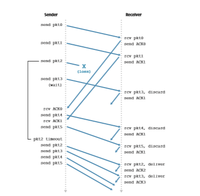
**Figure 3.22**  ♦  Go-Back-N in operation

### Selective Repeat (SR)
 The GBN protocol allows the sender to potentially “fill the pipeline” in Figure 3.17 with packets, thus avoiding the channel utilization problems we noted with stop- and-wait protocols. There are, however, scenarios in which GBN itself suffers from performance problems. In particular, when the window size and bandwidth-delay product are both large, many packets can be in the pipeline. A single packet error can thus cause GBN to retransmit a large number of packets, many unnecessarily. As the probability of channel errors increases, the pipeline can become filled with these unnecessary retransmissions. Imagine, in our message-dictation scenario, that if every time a word was garbled, the surrounding 1,000 words (for example, a win- dow size of 1,000 words) had to be repeated. The dictation would be slowed by all of the reiterated words.

As the name suggests, selective-repeat protocols avoid unnecessary retrans- missions by having the sender retransmit only those packets that it suspects were received in error (that is, were lost or corrupted) at the receiver. This individual, as-needed, retransmission will require that the receiver _individually_ acknowledge correctly received packets. A window size of _N_ will again be used to limit the num- ber of outstanding, unacknowledged packets in the pipeline. However, unlike GBN, the sender will have already received ACKs for some of the packets in the window. Figure 3.23 shows the SR sender’s view of the sequence number space. Figure 3.24 details the various actions taken by the SR sender.

The SR receiver will acknowledge a correctly received packet whether or not it is in order. Out-of-order packets are buffered until any missing packets (that is, packets with lower sequence numbers) are received, at which point a batch of packets can be delivered in order to the upper layer. Figure 3.25 itemizes the various actions taken by the SR receiver. Figure 3.26 shows an example of SR operation in the presence of lost packets. Note that in Figure 3.26, the receiver initially buffers packets 3, 4, and 5, and delivers them together with packet 2 to the upper layer when packet 2 is finally received.
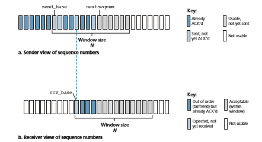
**Figure 3.23**  ♦   Selective-repeat (SR) sender and receiver views of sequence-number space

1\. _Data received from above._ When data is received from above, the SR sender checks the next available sequence number for the packet. If the sequence number is within the sender’s window, the data is packetized and sent; other- wise it is either buered or returned to the upper layer for later transmission, as in GBN.

2\. _Timeout_. Timers are again used to protect against lost packets. However, each packet must now have its own logical timer, since only a single packet will be transmitted on timeout. A single hardware timer can be used to mimic the operation of multiple logical timers [Varghese 1997].

3\. _ACK received_. If an ACK is received, the SR sender marks that packet as having been received, provided it is in the window. If the packet’s sequence number is equal to send\_base, the window base is moved forward to the unacknowledged packet with the smallest sequence number. If the window moves and there are untransmitted packets with sequence numbers that now fall within the window, these packets are transmitted.

**Figure 3.24**  ♦  SR sender events and actions

1\. _Packet with sequence number in_ [rcv\_base, rcv\_base+N-1]_is cor- rectly received._ In this case, the received packet falls within the receiver’s win- dow and a selective ACK packet is returned to the sender. If the packet was not previously received, it is buered. If this packet has a sequence number equal to the base of the receive window (rcv\_base in Figure 3.22), then this packet, and any previously buered and consecutively numbered (beginning with rcv\_base) packets are delivered to the upper layer. The recive window is then moved forward by the number of packets delivered to the upper layer. As an example, consider Figure 3.26. When a packet with a sequence number of rcv\_base=2 is received, it and packets 3, 4, and 5 can be delivered to the upper layer.

2\. _Packet with sequence number in_ \[rcv\_base-N, rcv\_base-1\]_is cor- rectly received._ In this case, an ACK must be generated, even though this is a packet that the receiver has previously acknowledged.

3\. _Otherwise._ Ignore the packet.

**Figure 3.25**  ♦  SR receiver events and actions
It is important to note that in Step 2 in Figure 3.25, the receiver reacknowledges (rather than ignores) already received packets with certain sequence numbers _below_ the current window base. You should convince yourself that this reacknowledgment is indeed needed. Given the sender and receiver sequence number spaces in Fig- ure 3.23, for example, if there is no ACK for packet send\_base propagating from
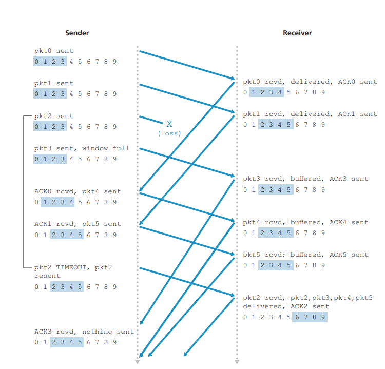
**Figure 3.26** ♦ SR operation

the receiver to the sender, the sender will eventually retransmit packet send\_base, even though it is clear (to us, not the sender!) that the receiver has already received that packet. If the receiver were not to acknowledge this packet, the sender’s win- dow would never move forward! This example illustrates an important aspect of SR protocols (and many other protocols as well). The sender and receiver will not always have an identical view of what has been received correctly and what has not. For SR protocols, this means that the sender and receiver windows will not always coincide.

The lack of synchronization between sender and receiver windows has impor- tant consequences when we are faced with the reality of a finite range of sequence numbers. Consider what could happen, for example, with a finite range of four packet sequence numbers, 0, 1, 2, 3, and a window size of three. Suppose packets 0 through 2 are transmitted and correctly received and acknowledged at the receiver. At this point, the receiver’s window is over the fourth, fifth, and sixth packets, which have sequence numbers 3, 0, and 1, respectively. Now consider two scenarios. In the first scenario, shown in Figure 3.27(a), the ACKs for the first three packets are lost and the sender retransmits these packets. The receiver thus next receives a packet with sequence number 0—a copy of the first packet sent.

In the second scenario, shown in Figure 3.27(b), the ACKs for the first three packets are all delivered correctly. The sender thus moves its window forward and sends the fourth, fifth, and sixth packets, with sequence numbers 3, 0, and 1, respec- tively. The packet with sequence number 3 is lost, but the packet with sequence number 0 arrives—a packet containing _new_ data.

Now consider the receiver’s viewpoint in Figure 3.27, which has a figurative curtain between the sender and the receiver, since the receiver cannot “see” the actions taken by the sender. All the receiver observes is the sequence of messages it receives from the channel and sends into the channel. As far as it is concerned, the two scenarios in Figure 3.27 are _identical._ There is no way of distinguishing the retransmission of the first packet from an original transmission of the fifth packet. Clearly, a window size that is 1 less than the size of the sequence number space won’t work. But how small must the window size be? A problem at the end of the chapter asks you to show that the window size must be less than or equal to half the size of the sequence number space for SR protocols.

At the Companion Website, you will find an animation that illustrates the opera- tion of the SR protocol. Try performing the same experiments that you did with the GBN animation. Do the results agree with what you expect?

This completes our discussion of reliable data transfer protocols. We’ve covered a _lot_ of ground and introduced numerous mechanisms that together provide for reli- able data transfer. Table 3.1 summarizes these mechanisms. Now that we have seen all of these mechanisms in operation and can see the “big picture,” we encourage you to review this section again to see how these mechanisms were incrementally added to cover increasingly complex (and realistic) models of the channel connecting the sender and receiver, or to improve the performance of the protocols.

Let’s conclude our discussion of reliable data transfer protocols by consider- ing one remaining assumption in our underlying channel model. Recall that we have assumed that packets cannot be reordered within the channel between the sender and receiver. This is generally a reasonable assumption when the sender and receiver are connected by a single physical wire. However, when the “channel” connecting the two is a network, packet reordering can occur. One manifestation of packet reordering is that old copies of a packet with a sequence or acknowledgmentpkt0
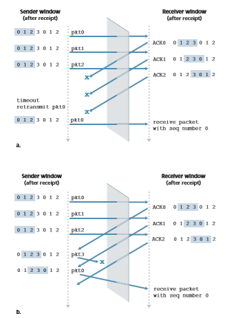
**Figure 3.27**  ♦   SR receiver dilemma with too-large windows: A new packet or a retransmission?


**Table 3.1**  ♦  Summary of reliable data transfer mechanisms and their use

number of _x_ can appear, even though neither the sender’s nor the receiver’s win- dow contains _x_. With packet reordering, the channel can be thought of as essen- tially buffering packets and spontaneously emitting these packets at _any_ point in the future. Because sequence numbers may be reused, some care must be taken to guard against such duplicate packets. The approach taken in practice is to ensure that a sequence number is not reused until the sender is “sure” that any previously sent packets with sequence number _x_ are no longer in the network. This is done by assuming that a packet cannot “live” in the network for longer than some fixed maximum amount of time. A maximum packet lifetime of approximately three minutes is assumed in the TCP extensions for high-speed networks [RFC 7323]. [Sunshine 1978] describes a method for using sequence numbers such that reorder- ing problems can be completely avoided.

## Connection-Oriented Transport: TCP
Now that we have covered the underlying principles of reliable data transfer, let’s turn to TCP—the Internet’s transport-layer, connection-oriented, reliable transport protocol. In this section, we’ll see that in order to provide reliable data transfer, TCP relies on many of the underlying principles discussed in the previous section, including error detection, retransmissions, cumulative acknowledgments, timers, and header fields for sequence and acknowledgment numbers. TCP is defined in RFC 793, RFC 1122, RFC 2018, RFC 5681, and RFC 7323.

### The TCP Connection 

TCP is said to be **connection-oriented** because before one application process can begin to send data to another, the two processes must first “handshake” with each other—that is, they must send some preliminary segments to each other to establish the parameters of the ensuing data transfer. As part of TCP connection establish- ment, both sides of the connection will initialize many TCP state variables (many of which will be discussed in this section and in Section 3.7) associated with the TCP connection.

The TCP “connection” is not an end-to-end TDM or FDM circuit as in a circuit- switched network. Instead, the “connection” is a logical one, with common state residing only in the TCPs in the two communicating end systems. Recall that because the TCP protocol runs only in the end systems and not in the intermediate network elements (routers and link-layer switches), the intermediate network elements do not maintain TCP connection state. In fact, the intermediate routers are completely oblivious to TCP connections; they see datagrams, not connections.

A TCP connection provides a **full-duplex service**: If there is a TCP con- nection between Process A on one host and Process B on another host, then application-layer data can flow from Process A to Process B at the same time as application-layer data flows from Process B to Process A. A TCP connec- tion is also always **point-to-point**, that is, between a single sender and a single receiver. So-called “multicasting” (see the online supplementary materials for this text)—the transfer of data from one sender to many receivers in a single send operation—is not possible with TCP. With TCP, two hosts are company and three are a crowd!

Let’s now take a look at how a TCP connection is established. Suppose a process running in one host wants to initiate a connection with another process in another host. Recall that the process that is initiating the connection is called the _client process_, while the other process is called the _server process_. The client application process first informs the client transport layer that it wants to establish a connectionto 


**CASE HISTORY**
VINTON CERF, ROBERT KAHN, AND TCP/IP

In the early 1970s, packet-switched networks began to proliferate, with the ARPAnet—the precursor of the Internet—being just one of many networks. Each of these networks had its own protocol. Two researchers, Vinton Cerf and Robert Kahn, recognized the importance of interconnecting these networks and invented a cross- network protocol called TCP/IP, which stands for Transmission Control Protocol/ Internet Protocol. Although Cerf and Kahn began by seeing the protocol as a single entity, it was later split into its two parts, TCP and IP, which operated separately. Cerf and Kahn published a paper on TCP/IP in May 1974 in _IEEE Transactions on Communications Technology_ [Cerf 1974].

The TCP/IP protocol, which is the bread and butter of today’s Internet, was devised before PCs, workstations, smartphones, and tablets, before the prolifera- tion of Ethernet, cable, and DSL, WiFi, and other access network technologies, and before the Web, social media, and streaming video. Cerf and Kahn saw the need for a networking protocol that, on the one hand, provides broad support for yet-to- be-defined applications and, on the other hand, allows arbitrary hosts and link-layer protocols to interoperate.

In 2004, Cerf and Kahn received the ACM’s Turing Award, considered the “Nobel Prize of Computing” for “pioneering work on internetworking, including the design and implementation of the Internet’s basic communications protocols, TCP/IP, and for inspired leadership in networking.”

a process in the server. Recall from Section 2.7.2, a Python client program does this by issuing the command
```
clientSocket.connect((serverName,serverPort))
```

where serverName is the name of the server and serverPort identifies the process on the server. TCP in the client then proceeds to establish a TCP connec- tion with TCP in the server. At the end of this section we discuss in some detail the connection-establishment procedure. For now it suffices to know that the client first sends a special TCP segment; the server responds with a second special TCP seg- ment; and finally the client responds again with a third special segment. The first two segments carry no payload, that is, no application-layer data; the third of these segments may carry a payload. Because three segments are sent between the two hosts, this connection-establishment procedure is often referred to as a **three-way handshake**.

Once a TCP connection is established, the two application processes can send data to each other. Let’s consider the sending of data from the client process to the server process. The client process passes a stream of data through the socket (the door of the process), as described in Section 2.7. Once the data passes through the door, the data is in the hands of TCP running in the client. As shown in Figure 3.28, TCP directs this data to the connection’s **send buffer**, which is one of the buffers that is set aside during the initial three-way handshake. From time to time, TCP will grab chunks of data from the send buffer and pass the data to the network layer. Interest- ingly, the TCP specification [RFC 793] is very laid back about specifying when TCP should actually send buffered data, stating that TCP should “send that data in seg- ments at its own convenience.” The maximum amount of data that can be grabbed and placed in a segment is limited by the **maximum segment size (MSS)**. The MSS is typically set by first determining the length of the largest link-layer frame that can be sent by the local sending host (the so-called **maximum transmission unit, MTU**), and then setting the MSS to ensure that a TCP segment (when encapsulated in an IP datagram) plus the TCP/IP header length (typically 40 bytes) will fit into a single link-layer frame. Both Ethernet and PPP link-layer protocols have an MTU of 1,500 bytes. Thus, a typical value of MSS is 1460 bytes. Approaches have also been proposed for discovering the path MTU—the largest link-layer frame that can be sent on all links from source to destination [RFC 1191]—and setting the MSS based on the path MTU value. Note that the MSS is the maximum amount of application-layer data in the segment, not the maximum size of the TCP segment including headers. (This terminology is confusing, but we have to live with it, as it is well entrenched.)

TCP pairs each chunk of client data with a TCP header, thereby forming **TCP segments**. The segments are passed down to the network layer, where they are sepa- rately encapsulated within network-layer IP datagrams. The IP datagrams are then sent into the network. When TCP receives a segment at the other end, the segment’s data is placed in the TCP connection’s receive buffer, as shown in Figure 3.28. The application reads the stream of data from this buffer. Each side of the connection has
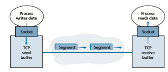
**Figure 3.28**  ♦  TCP send and receive buffers

its own send buffer and its own receive buffer. (You can see the online flow-control interactive animation at http://www.awl.com/kurose-ross, which provides an anima- tion of the send and receive buffers.)

We see from this discussion that a TCP connection consists of buffers, variables, and a socket connection to a process in one host, and another set of buffers, vari- ables, and a socket connection to a process in another host. As mentioned earlier, no buffers or variables are allocated to the connection in the network elements (routers, switches, and repeaters) between the hosts.

### TCP Segment Structure
Having taken a brief look at the TCP connection, let’s examine the TCP segment structure. The TCP segment consists of header fields and a data field. The data field contains a chunk of application data. As mentioned above, the MSS limits the maxi- mum size of a segment’s data field. When TCP sends a large file, such as an image as part of a Web page, it typically breaks the file into chunks of size MSS (except for the last chunk, which will often be less than the MSS). Interactive applications, however, often transmit data chunks that are smaller than the MSS; for example, with remote login applications such as Telnet and ssh, the data field in the TCP segment is often only one byte. Because the TCP header is typically 20 bytes (12 bytes more than the UDP header), segments sent by Telnet and ssh may be only 21 bytes in length.

Figure 3.29 shows the structure of the TCP segment. As with UDP, the header includes **source and destination port numbers**, which are used for multiplexing/ demultiplexing data from/to upper-layer applications. Also, as witAaaaaaaaaaaaaaaaaaaaaaaaah UDP, the header includes a **checksum field**. A TCP segment header also contains the following fields:

• The 32-bit **sequence number field** and the 32-bit **acknowledgment number field** are used by the TCP sender and receiver in implementing a reliable data transfer service, as discussed below.

• The 16-bit **receive window** field is used for flow control. We will see shortly that it is used to indicate the number of bytes that a receiver is willing to accept.

• The 4-bit **header length field** specifies the length of the TCP header in 32-bit words. The TCP header can be of variable length due to the TCP options field. (Typically, the options field is empty, so that the length of the typical TCP header is 20 bytes.)

• The optional and variable-length **options field** is used when a sender and receiver negotiate the maximum segment size (MSS) or as a window scaling factor 


for use in high-speed networks. A time-stamping option is also defined. See RFC 854 and RFC 1323 for additional details.

• The **flag field** contains 6 bits. The **ACK bit** is used to indicate that the value carried in the acknowledgment field is valid; that is, the segment contains an acknowledgment for a segment that has been successfully received. The **RST**,
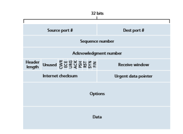
**Figure 3.29**  ♦  TCP segment structure

**SYN**, and **FIN** bits are used for connection setup and teardown, as we will discuss at the end of this section. The CWR and ECE bits are used in explicit congestion notification, as discussed in Section 3.7.2. Setting the **PSH** bit indicates that the receiver should pass the data to the upper layer immediately. Finally, the **URG** bit is used to indicate that there is data in this segment that the sending-side upper- layer entity has marked as “urgent.” The location of the last byte of this urgent data is indicated by the 16-bit **urgent data pointer field**. TCP must inform the receiving-side upper-layer entity when urgent data exists and pass it a pointer to the end of the urgent data. (In practice, the PSH, URG, and the urgent data pointer are not used. However, we mention these fields for completeness.)

Our experience as teachers is that our students sometimes find discussion of packet formats rather dry and perhaps a bit boring. For a fun and fanciful look at TCP header fields, particularly if you love Legos™ as we do, see [Pomeranz 2010].

**Sequence Numbers and Acknowledgment Numbers**

Two of the most important fields in the TCP segment header are the sequence number field and the acknowledgment number field. These fields are a critical part of TCP’s reliable data transfer service. But before discussing how these fields are used to pro- vide reliable data transfer, let us first explain what exactly TCP puts in these fields.

**Figure 3.30**  ♦  Dividing file data into TCP segments

TCP views data as an unstructured, but ordered, stream of bytes. TCP’s use of sequence numbers reflects this view in that sequence numbers are over the stream of transmitted bytes and _not_ over the series of transmitted segments. The **sequence number for a segment** is therefore the byte-stream number of the first byte in the segment. Let’s look at an example. Suppose that a process in Host A wants to send a stream of data to a process in Host B over a TCP connection. The TCP in Host A will implicitly number each byte in the data stream. Suppose that the data stream consists of a file consisting of 500,000 bytes, that the MSS is 1,000 bytes, and that the first byte of the data stream is numbered 0. As shown in Figure 3.30, TCP constructs 500 segments out of the data stream. The first segment gets assigned sequence number 0, the second segment gets assigned sequence number 1,000, the third segment gets assigned sequence number 2,000, and so on. Each sequence number is inserted in the sequence number field in the header of the appropriate TCP segment.

Now let’s consider acknowledgment numbers. These are a little trickier than sequence numbers. Recall that TCP is full-duplex, so that Host A may be receiving data from Host B while it sends data to Host B (as part of the same TCP connection). Each of the segments that arrive from Host B has a sequence number for the data flowing from B to A. _The acknowledgment number that Host A puts in its segment is the sequence number of the next byte Host A is expecting from Host B._ It is good to look at a few examples to understand what is going on here. Suppose that Host A has received all bytes numbered 0 through 535 from B and suppose that it is about to send a segment to Host B. Host A is waiting for byte 536 and all the subsequent bytes in Host B’s data stream. So Host A puts 536 in the acknowledgment number field of the segment it sends to B.

As another example, suppose that Host A has received one segment from Host B containing bytes 0 through 535 and another segment containing bytes 900 through 1,000. For some reason Host A has not yet received bytes 536 through 899. In this example, Host A is still waiting for byte 536 (and beyond) in order to re-create B’s data stream. Thus, A’s next segment to B will contain 536 in the acknowledgment number field. Because TCP only acknowledges bytes up to the first missing byte in the stream, TCP is said to provide **cumulative acknowledgments**.

This last example also brings up an important but subtle issue. Host A received the third segment (bytes 900 through 1,000) before receiving the second segment (bytes 536 through 899). Thus, the third segment arrived out of order. The sub- tle issue is: What does a host do when it receives out-of-order segments in a TCP connection? Interestingly, the TCP RFCs do not impose any rules here and leave the decision up to the programmers implementing a TCP implementation. There are basically two choices: either (1) the receiver immediately discards out-of-order segments (which, as we discussed earlier, can simplify receiver design), or (2) the receiver keeps the out-of-order bytes and waits for the missing bytes to fill in the gaps. Clearly, the latter choice is more efficient in terms of network bandwidth, and is the approach taken in practice.

In Figure 3.30, we assumed that the initial sequence number was zero. In truth, both sides of a TCP connection randomly choose an initial sequence number. This is done to minimize the possibility that a segment that is still present in the network from an earlier, already-terminated connection between two hosts is mistaken for a valid segment in a later connection between these same two hosts (which also happen to be using the same port numbers as the old connection) \[Sunshine 1978\].

**Telnet: A Case Study for Sequence and Acknowledgment Numbers**

Telnet, defined in RFC 854, is a popular application-layer protocol used for remote login. It runs over TCP and is designed to work between any pair of hosts. Unlike the bulk data transfer applications discussed in Chapter 2, Telnet is an interactive appli- cation. We discuss a Telnet example here, as it nicely illustrates TCP sequence and acknowledgment numbers. We note that many users now prefer to use the SSH proto- col rather than Telnet, since data sent in a Telnet connection (including passwords!) are not encrypted, making Telnet vulnerable to eavesdropping attacks (as discussed in Section 8.7).

Suppose Host A initiates a Telnet session with Host B. Because Host A initiates the session, it is labeled the client, and Host B is labeled the server. Each character typed by the user (at the client) will be sent to the remote host; the remote host will send back a copy of each character, which will be displayed on the Telnet user’s screen. This “echo back” is used to ensure that characters seen by the Telnet user have already been received and processed at the remote site. Each character thus traverses the network twice between the time the user hits the key and the time the character is displayed on the user’s monitor.

Now suppose the user types a single letter, ‘C,’ and then grabs a coffee. Let’s examine the TCP segments that are sent between the client and server. As shown in Figure 3.31, we suppose the starting sequence numbers are 42 and 79 for the client and server, respectively. Recall that the sequence number of a segment is the sequence 
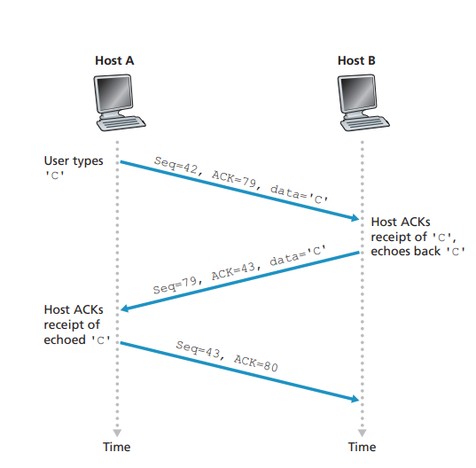
**Figure 3.31** ♦ Sequence and acknowledgment numbers for a simple Telnet application over TCP

number of the first byte in the data field. Thus, the first segment sent from the client will have sequence number 42; the first segment sent from the server will have sequence number 79. Recall that the acknowledgment number is the sequencenumber of the next byte of data that the host is waiting for. After the TCP connec- tion is established but before any data is sent, the client is waiting for byte 79 and the server is waiting for byte 42.

As shown in Figure 3.31, three segments are sent. The first segment is sent from the client to the server, containing the 1-byte ASCII representation of the letter ‘C’ in its data field. This first segment also has 42 in its sequence number field, as we just described. Also, because the client has not yet received any data from the server, this first segment will have 79 in its acknowledgment number field.

The second segment is sent from the server to the client. It serves a dual purpose. First it provides an acknowledgment of the data the server has received. By putting 43 in the acknowledgment field, the server is telling the client that it has successfully received everything up through byte 42 and is now waiting for bytes 43 onward. The second purpose of this segment is to echo back the letter ‘C.’ Thus, the second seg- ment has the ASCII representation of ‘C’ in its data field. This second segment has the sequence number 79, the initial sequence number of the server-to-client data flow of this TCP connection, as this is the very first byte of data that the server is send- ing. Note that the acknowledgment for client-to-server data is carried in a segment carrying server-to-client data; this acknowledgment is said to be **piggybacked** on the server-to-client data segment.

The third segment is sent from the client to the server. Its sole purpose is to acknowledge the data it has received from the server. (Recall that the second seg- ment contained data—the letter ‘C’—from the server to the client.) This segment has an empty data field (that is, the acknowledgment is not being piggybacked with any client-to-server data). The segment has 80 in the acknowledgment number field because the client has received the stream of bytes up through byte sequence number 79 and it is now waiting for bytes 80 onward. You might think it odd that this seg- ment also has a sequence number since the segment contains no data. But because TCP has a sequence number field, the segment needs to have some sequence number.

### Round-Trip Time Estimation and Timeout
 TCP, like our rdt protocol in Section 3.4, uses a timeout/retransmit mechanism to recover from lost segments. Although this is conceptually simple, many subtle issues arise when we implement a timeout/retransmit mechanism in an actual protocol such as TCP. Perhaps the most obvious question is the length of the timeout intervals. Clearly, the timeout should be larger than the connection’s round-trip time (RTT), that is, the time from when a segment is sent until it is acknowledged. Otherwise, unnecessary retransmissions would be sent. But how much larger? How should the RTT be estimated in the first place? Should a timer be associated with each and every unacknowledged segment? So many questions! Our discussion in this section is based on the TCP work in [Jacobson 1988] and the current IETF recommendations for managing TCP timers [RFC 6298].

**Estimating the Round-Trip Time**

Let’s begin our study of TCP timer management by considering how TCP estimates the round-trip time between sender and receiver. This is accomplished as follows. The sample RTT, denoted SampleRTT, for a segment is the amount of time between when the segment is sent (that is, passed to IP) and when an acknowledgment for the segment is received. Instead of measuring a SampleRTT for every transmitted segment, most TCP implementations take only one SampleRTT measurement at a time. That is, at any point in time, the SampleRTT is being estimated for only one of the transmitted but currently unacknowledged segments, leading to a new value of SampleRTT approximately once every RTT. Also, TCP never computes a SampleRTT for a segment that has been retransmitted; it only measures SampleRTT for segments that have been transmitted once [Karn 1987]. (A problem at the end of the chapter asks you to consider why.)

Obviously, the SampleRTT values will fluctuate from segment to segment due to congestion in the routers and to the varying load on the end systems. Because of this fluctuation, any given SampleRTT value may be atypical. In order to estimatea typical RTT, it is therefore natural to take some sort of average of the SampleRTT values. TCP maintains an average, called EstimatedRTT, of the SampleRTT values. Upon obtaining a new SampleRTT, TCP updates EstimatedRTT accord- ing to the following formula:
```
EstimatedRTT = (1 – α)  EstimatedRTT + α . SampleRTT 
```
The formula above is written in the form of a programming-language statement—the new value of **EstimatedRTT** is a weighted combination of the previous value of **EstimatedRTT** and the new value for **SampleRTT**. The recommended value of α is α = 0.125 (that is, 1/8) [RFC 6298], in which case the formula above becomes:
```
EstimatedRTT = 0.875 # EstimatedRTT + 0.125 . SampleRTT 
```
Note that **EstimatedRTT** is a weighted average of the **SampleRTT** values. As discussed in a homework problem at the end of this chapter, this weighted average puts more weight on recent samples than on old samples. This is natural, as the more recent samples better reflect the current congestion in the network. In statistics, such an average is called an **exponential weighted moving average (EWMA)**. The word “exponential” appears in EWMA because the weight of a given SampleRTT decays exponentially fast as the updates proceed. In the homework problems, you will be asked to derive the exponential term in EstimatedRTT.

Figure 3.32 shows the SampleRTT values and EstimatedRTT for a value of α = 1/8 for a TCP connection between gaia.cs.umass.edu (in Amherst, Massachusetts) to fantasia.eurecom.fr (in the south of France). Clearly, the variations in the SampleRTT are smoothed out in the computation of the EstimatedRTT.

In addition to having an estimate of the RTT, it is also valuable to have a meas- ure of the variability of the RTT. [RFC 6298] defines the RTT variation, DevRTT, as an estimate of how much SampleRTT typically deviates from EstimatedRTT:
```
DevRTT = (1 – β) # DevRTT + β # | SampleRTT – EstimatedRTT |
```
Note that DevRTT is an EWMA of the difference between SampleRTT and EstimatedRTT. If the SampleRTT values have little fluctuation, then DevRTT will be small; on the other hand, if there is a lot of fluctuation, DevRTT will be large. The recommended value of β is 0.25.

**Setting and Managing the Retransmission Timeout Interval**

Given values of EstimatedRTT and DevRTT, what value should be used for TCP’s timeout interval? Clearly, the interval should be greater than or equal to

**PRINCIPLES IN PRACTICE**

TCP provides reliable data transfer by using positive acknowledgments and timers in much the same way that we studied in Section 3.4. TCP acknowledges data that has been received correctly, and it then retransmits segments when segments or their corresponding acknowledgments are thought to be lost or corrupted. Certain versions of TCP also have an implicit NAK mechanism—with TCP’s fast retransmit mechanism, the receipt of three duplicate ACKs for a given segment serves as an implicit NAK for the following segment, triggering retransmission of that segment before timeout. TCP uses sequences of numbers to allow the receiver to identify lost or duplicate segments. Just as in the case of our reliable data transfer protocol, rdt3.0, TCP cannot itself tell for certain if a segment, or its ACK, is lost, corrupted, or overly delayed. At the sender, TCP’s response will be the same: retrans- mit the segment in question.

TCP also uses pipelining, allowing the sender to have multiple transmitted but yet-to- be-acknowledged segments outstanding at any given time. We saw earlier that pipelining can greatly improve a session’s throughput when the ratio of the segment size to round- trip delay is small. The specific number of outstanding, unacknowledged segments that a sender can have is determined by TCP’s flow-control and congestion-control mechanisms. TCP flow control is discussed at the end of this section; TCP congestion control is discussed in Section 3.7. For the time being, we must simply be aware that the TCP sender uses pipelining.
********************************


EstimatedRTT, or unnecessary retransmissions would be sent. But the timeout interval should not be too much larger than EstimatedRTT; otherwise, when a segment is lost, TCP would not quickly retransmit the segment, leading to large data transfer delays. It is therefore desirable to set the timeout equal to the EstimatedRTT plus some margin. The margin should be large when there is a lot of fluctuation in the SampleRTT values; it should be small when there is little fluc- tuation. The value of DevRTT should thus come into play here. All of these consid- erations are taken into account in TCP’s method for determining the retransmission timeout interval:
```
TimeoutInterval = EstimatedRTT + 4 . DevRTT 
```
An initial TimeoutInterval value of 1 second is recommended [RFC6298]. Also, when a timeout occurs, the value of TimeoutInterval is doubled to avoid a premature timeout occurring for a subsequent segment that will soon be acknowledged. However, as soon as a segment is received and EstimatedRTT is updated, the TimeoutInterval is again computed using the formula above.

**Figure 3.32**  ♦  RTT samples and RTT estimates

### Reliable Data Transfer

 Recall that the Internet’s network-layer service (IP service) is unreliable. IP does not guarantee datagram delivery, does not guarantee in-order delivery of datagrams, and does not guarantee the integrity of the data in the datagrams. With IP service, datagrams can overflow router buffers and never reach their destination, datagrams can arrive out of order, and bits in the datagram can get corrupted (flipped from 0 to 1 and vice versa). Because transport-layer segments are carried across the network by IP datagrams, transport-layer segments can suffer from these problems as well.

TCP creates a **reliable data transfer service** on top of IP’s unreliable best- effort service. TCP’s reliable data transfer service ensures that the data stream that a process reads out of its TCP receive buffer is uncorrupted, without gaps, with- out duplication, and in sequence; that is, the byte stream is exactly the same byte stream that was sent by the end system on the other side of the connection. How TCP provides a reliable data transfer involves many of the principles that we studied in Section 3.4.

In our earlier development of reliable data transfer techniques, it was conceptu- ally easiest to assume that an individual timer is associated with each transmitted but not yet acknowledged segment. While this is great in theory, timer management can require considerable overhead. Thus, the recommended TCP timer management
procedures [RFC 6298] use only a _single_ retransmission timer, even if there are mul- tiple transmitted but not yet acknowledged segments. The TCP protocol described in this section follows this single-timer recommendation.

We will discuss how TCP provides reliable data transfer in two incremental steps. We first present a highly simplified description of a TCP sender that uses only timeouts to recover from lost segments; we then present a more complete description that uses duplicate acknowledgments in addition to timeouts. In the ensuing discus- sion, we suppose that data is being sent in only one direction, from Host A to Host B, and that Host A is sending a large file.

Figure 3.33 presents a highly simplified description of a TCP sender. We see that there are three major events related to data transmission and retransmission in the TCP sender: data received from application above; timer timeout; and ACK
```
\* Assume sender is not constrained by TCP flow or congestion control, that data from above is less

than MSS in size, and that data transfer is in one direction only. \*/

NextSeqNum=InitialSeqNumber

SendBase=InitialSeqNumber

loop (forever) {

switch(event)

event: data received from application above

create TCP segment with sequence number NextSeqNum

if (timer currently not running)

start timer

pass segment to IP

NextSeqNum=NextSeqNum+length(data)

break;

event: timer timeout

retransmit not-yet-acknowledged segment with

smallest sequence number

start timer

break;

event: ACK received, with ACK field value of y

if (y > SendBase) {

SendBase=y

if (there are currently any not-yet-acknowledged segments)

start timer

}

break;

} /\* end of loop forever \*/
```
**Figure 3.33**  ♦  Simplified TCP sender

receipt. Upon the occurrence of the first major event, TCP receives data from the application, encapsulates the data in a segment, and passes the segment to IP. Note that each segment includes a sequence number that is the byte-stream number of the first data byte in the segment, as described in Section 3.5.2. Also note that if the timer is already not running for some other segment, TCP starts the timer when the segment is passed to IP. (It is helpful to think of the timer as being associated with the oldest unacknowledged segment.) The expiration interval for this timer is the TimeoutInterval, which is calculated from EstimatedRTT and DevRTT, as described in Section 3.5.3.

The second major event is the timeout. TCP responds to the timeout event by retransmitting the segment that caused the timeout. TCP then restarts the timer.

The third major event that must be handled by the TCP sender is the arrival of an acknowledgment segment (ACK) from the receiver (more specifically, a segment containing a valid ACK field value). On the occurrence of this event, TCP compares the ACK value y with its variable SendBase. The TCP state variable SendBase is the sequence number of the oldest unacknowledged byte. (Thus SendBase–1 is the sequence number of the last byte that is known to have been received correctly and in order at the receiver.) As indicated earlier, TCP uses cumulative acknowl- edgments, so that y acknowledges the receipt of all bytes before byte number y. If y > SendBase, then the ACK is acknowledging one or more previously unac- knowledged segments. Thus the sender updates its SendBase variable; it also restarts the timer if there currently are any not-yet-acknowledged segments.

**A Few Interesting Scenarios**

We have just described a highly simplified version of how TCP provides reliable data transfer. But even this highly simplified version has many subtleties. To get a good feeling for how this protocol works, let’s now walk through a few simple scenarios. Figure 3.34 depicts the first scenario, in which Host A sends one segment to Host B. Suppose that this segment has sequence number 92 and contains 8 bytes of data. After sending this segment, Host A waits for a segment from B with acknowledgment num- ber 100. Although the segment from A is received at B, the acknowledgment from B to A gets lost. In this case, the timeout event occurs, and Host A retransmits the same segment. Of course, when Host B receives the retransmission, it observes from the sequence number that the segment contains data that has already been received. Thus, TCP in Host B will discard the bytes in the retransmitted segment.

In a second scenario, shown in Figure 3.35, Host A sends two segments back to back. The first segment has sequence number 92 and 8 bytes of data, and the second segment has sequence number 100 and 20 bytes of data. Suppose that both segments arrive intact at B, and B sends two separate acknowledgments for each of these seg- ments. The first of these acknowledgments has acknowledgment number 100; the second has acknowledgment number 120. Suppose now that neither of the acknowl- edgments arrives at Host A before the timeout. When the timeout event occurs, Host

**Figure 3.34**  ♦  Retransmission due to a lost acknowledgment

A resends the first segment with sequence number 92 and restarts the timer. As long as the ACK for the second segment arrives before the new timeout, the second seg- ment will not be retransmitted.

In a third and final scenario, suppose Host A sends the two segments, exactly as in the second example. The acknowledgment of the first segment is lost in the network, but just before the timeout event, Host A receives an acknowledgment with acknowledgment number 120. Host A therefore knows that Host B has received _everything_ up through byte 119; so Host A does not resend either of the two segments. This scenario is illustrated in Figure 3.36.

**Doubling the Timeout Interval**

We now discuss a few modifications that most TCP implementations employ. The first concerns the length of the timeout interval after a timer expiration. In this modi- fication, whenever the timeout event occurs, TCP retransmits the not-yet-acknowl- edged segment with the smallest sequence number, as described above. But each time TCP retransmits, it sets the next timeout interval to twice the previous value,

**Figure 3.35**  ♦  Segment 100 not retransmitted
rather than deriving it from the last EstimatedRTT and DevRTT (as described in Section 3.5.3). For example, suppose TimeoutInterval associated with the oldest not yet acknowledged segment is .75 sec when the timer first expires. TCP will then retransmit this segment and set the new expiration time to 1.5 sec. If the timer expires again 1.5 sec later, TCP will again retransmit this segment, now setting the expiration time to 3.0 sec. Thus, the intervals grow exponentially after each retransmission. However, whenever the timer is started after either of the two other events (that is, data received from application above, and ACK received), the TimeoutInterval is derived from the most recent values of EstimatedRTT and DevRTT.

This modification provides a limited form of congestion control. (More com- prehensive forms of TCP congestion control will be studied in Section 3.7.) The timer expiration is most likely caused by congestion in the network, that is, too many packets arriving at one (or more) router queues in the path between the source and destination, causing packets to be dropped and/or long queuing delays. In times of congestion, if the sources continue to retransmit packets persistently, the congestion
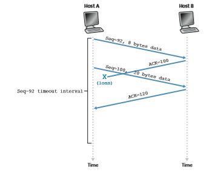
**Figure 3.36**  ♦   A cumulative acknowledgment avoids retransmission of the first segment

may get worse. Instead, TCP acts more politely, with each sender retransmitting after longer and longer intervals. We will see that a similar idea is used by Ethernet when we study CSMA/CD in Chapter 6.

**Fast Retransmit**

One of the problems with timeout-triggered retransmissions is that the timeout period can be relatively long. When a segment is lost, this long timeout period forces the sender to delay resending the lost packet, thereby increasing the end-to-end delay. Fortunately, the sender can often detect packet loss well before the timeout event occurs by noting so-called duplicate ACKs. A **duplicate ACK** is an ACK that reac- knowledges a segment for which the sender has already received an earlier acknowl- edgment. To understand the sender’s response to a duplicate ACK, we must look at why the receiver sends a duplicate ACK in the first place. Table 3.2 summarizes the TCP receiver’s ACK generation policy [RFC 5681]. When a TCP receiver receives

**Table 3.2**  ♦  TCP ACK Generation Recommendation [RFC 5681]

a segment with a sequence number that is larger than the next, expected, in-order sequence number, it detects a gap in the data stream—that is, a missing segment. This gap could be the result of lost or reordered segments within the network. Since TCP does not use negative acknowledgments, the receiver cannot send an explicit negative acknowledgment back to the sender. Instead, it simply reacknowledges (that is, generates a duplicate ACK for) the last in-order byte of data it has received. (Note that Table 3.2 allows for the case that the receiver does not discard out-of- order segments.)

Because a sender often sends a large number of segments back to back, if one segment is lost, there will likely be many back-to-back duplicate ACKs. If the TCP sender receives three duplicate ACKs for the same data, it takes this as an indication that the segment following the segment that has been ACKed three times has been lost. (In the homework problems, we consider the question of why the sender waits for three duplicate ACKs, rather than just a single duplicate ACK.) In the case that three duplicate ACKs are received, the TCP sender performs a **fast retransmit** [RFC 5681], retransmitting the missing segment _before_ that segment’s timer expires. This is shown in Figure 3.37, where the second segment is lost, then retransmitted before its timer expires. For TCP with fast retransmit, the following code snippet replaces the ACK received event in Figure 3.33:
```
event: ACK received, with ACK field value of y if (y > SendBase) { SendBase=y 
if (there are currently any not yet acknowledged segments) 
start timer 
}
```

**Figure 3.37**  ♦   Fast retransmit: retransmitting the missing segment before the segment’s timer expires
```
else {/\* a duplicate ACK for already ACKed segment \*/ 
increment number of duplicate ACKs received for y 
if (number of duplicate ACKS received for y==3) 
\* TCP fast retransmit \*/ resend segment with sequence number y 
} 
break;
```
We noted earlier that many subtle issues arise when a timeout/retransmit mech- anism is implemented in an actual protocol such as TCP. The procedures above, which have evolved as a result of more than 30 years of experience with TCP timers, should convince you that this is indeed the case!

**Go-Back-N or Selective Repeat?**

Let us close our study of TCP’s error-recovery mechanism by considering the fol- lowing question: Is TCP a GBN or an SR protocol? Recall that TCP acknowledg- ments are cumulative and correctly received but out-of-order segments are not individually ACKed by the receiver. Consequently, as shown in Figure 3.33 (see also Figure 3.19), the TCP sender need only maintain the smallest sequence number of a transmitted but unacknowledged byte (SendBase) and the sequence number of the next byte to be sent (NextSeqNum). In this sense, TCP looks a lot like a GBN-style protocol. But there are some striking differences between TCP and Go- Back-N. Many TCP implementations will buffer correctly received but out-of-order segments [Stevens 1994]. Consider also what happens when the sender sends a sequence of segments 1, 2, . . . , _N_, and all of the segments arrive in order without error at the receiver. Further suppose that the acknowledgment for packet _n_ 6 _N_ gets lost, but the remaining _N_ \- 1 acknowledgments arrive at the sender before their respective timeouts. In this example, GBN would retransmit not only packet _n,_ but also all of the subsequent packets _n_ \+ 1, _n_ \+ 2, . . . , _N_. TCP, on the other hand, would retransmit at most one segment, namely, segment _n_. Moreover, TCP would not even retransmit segment _n_ if the acknowledgment for segment _n_ \+ 1 arrived before the timeout for segment _n_.

A proposed modification to TCP, the so-called **selective acknowledgment** [RFC 2018], allows a TCP receiver to acknowledge out-of-order segments selectively rather than just cumulatively acknowledging the last correctly received, in-order segment. When combined with selective retransmission—skipping the retransmis- sion of segments that have already been selectively acknowledged by the receiver— TCP looks a lot like our generic SR protocol. Thus, TCP’s error-recovery mechanism is probably best categorized as a hybrid of GBN and SR protocols.

### Flow Control
 Recall that the hosts on each side of a TCP connection set aside a receive buffer for the connection. When the TCP connection receives bytes that are correct and in sequence, it places the data in the receive buffer. The associated application process will read data from this buffer, but not necessarily at the instant the data arrives. Indeed, the receiving application may be busy with some other task and may not even attempt to read the data until long after it has arrived. If the application is relatively slow at reading the data, the sender can very easily overflow the connection’s receive buffer by sending too much data too quickly.

TCP provides a **flow-control service** to its applications to eliminate the pos- sibility of the sender overflowing the receiver’s buffer. Flow control is thus a speed- matching service—matching the rate at which the sender is sending against the rate at which the receiving application is reading. As noted earlier, a TCP sender can also be throttled due to congestion within the IP network; this form of sender control isreferred to as **congestion control**, a topic we will explore in detail in Sections 3.6 and 3.7. Even though the actions taken by flow and congestion control are similar (the throttling of the sender), they are obviously taken for very different reasons. Unfortunately, many authors use the terms interchangeably, and the savvy reader would be wise to distinguish between them. Let’s now discuss how TCP provides its flow-control service. In order to see the forest for the trees, we suppose throughout this section that the TCP implementation is such that the TCP receiver discards out- of-order segments.

TCP provides flow control by having the _sender_ maintain a variable called the **receive window**. Informally, the receive window is used to give the sender an idea of how much free buffer space is available at the receiver. Because TCP is full-duplex, the sender at each side of the connection maintains a distinct receive window. Let’s investigate the receive window in the context of a file transfer. Sup- pose that Host A is sending a large file to Host B over a TCP connection. Host B allocates a receive buffer to this connection; denote its size by RcvBuffer. From time to time, the application process in Host B reads from the buffer. Define the following variables:

• LastByteRead: the number of the last byte in the data stream read from the buffer by the application process in B

• LastByteRcvd: the number of the last byte in the data stream that has arrived from the network and has been placed in the receive buffer at B

Because TCP is not permitted to overflow the allocated buffer, we must have

LastByteRcvd – LastByteRead … RcvBuffer

The receive window, denoted rwnd is set to the amount of spare room in the buffer:
```
rwnd = RcvBuffer – \[LastByteRcvd – LastByteRead\]
```
Because the spare room changes with time, rwnd is dynamic. The variable rwnd is illustrated in Figure 3.38.

How does the connection use the variable rwnd to provide the flow-control service? Host B tells Host A how much spare room it has in the connection buffer by placing its current value of rwnd in the receive window field of every segment it sends to A. Initially, Host B sets rwnd = RcvBuffer. Note that to pull this off, Host B must keep track of several connection-specific variables.

Host A in turn keeps track of two variables, LastByteSent and Last- ByteAcked, which have obvious meanings. Note that the difference between these two variables, LastByteSent – LastByteAcked, is the amount of unac- knowledged data that A has sent into the connection. By keeping the amount of unacknowledged data less than the value of rwnd, Host A is assured that it is not

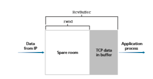
**Figure 3.38**  ♦   The receive window (rwnd) and the receive buffer (RcvBuffer)

overflowing the receive buffer at Host B. Thus, Host A makes sure throughout the connection’s life that
```
LastByteSent – LastByteAcked … rwnd
```
There is one minor technical problem with this scheme. To see this, suppose Host B’s receive buffer becomes full so that rwnd = 0. After advertising rwnd = 0 to Host A, also suppose that B has _nothing_ to send to A. Now consider what happens. As the application process at B empties the buffer, TCP does not send new seg- ments with new rwnd values to Host A; indeed, TCP sends a segment to Host A only if it has data to send or if it has an acknowledgment to send. Therefore, Host A is never informed that some space has opened up in Host B’s receive buffer— Host A is blocked and can transmit no more data! To solve this problem, the TCP specification requires Host A to continue to send segments with one data byte when B’s receive window is zero. These segments will be acknowledged by the receiver. Eventually the buffer will begin to empty and the acknowledgments will contain a nonzero rwnd value.

The online site at for this book provides an interactive animation that illustrates the operation of the TCP receive window.

Having described TCP’s flow-control service, we briefly mention here that UDP does not provide flow control and consequently, segments may be lost at the receiver due to buffer overflow. For example, consider sending a series of UDP segments from a process on Host A to a process on Host B. For a typical UDP implementation, UDP will append the segments in a finite-sized buffer that “precedes” the corre- sponding socket (that is, the door to the process). The process reads one entire seg- ment at a time from the buffer. If the process does not read the segments fast enough from the buffer, the buffer will overflow and segments will get dropped.

### TCP Connection Management

 In this subsection, we take a closer look at how a TCP connection is established and torn down. Although this topic may not seem particularly thrilling, it is important because TCP connection establishment can significantly add to perceived delays (for example, when surfing the Web). Furthermore, many of the most common network attacks—including the incredibly popular SYN flood attack (see sidebar on the SYN flood attack)—exploit vulnerabilities in TCP connection management. Let’s first take a look at how a TCP connection is established. Suppose a process running in one host (client) wants to initiate a connection with another process in another host (server). The client application process first informs the client TCP that it wants to establish a connection to a process in the server. The TCP in the client then proceeds to establish a TCP connection with the TCP in the server in the following manner:

_• Step 1._ The client-side TCP first sends a special TCP segment to the server-side TCP. This special segment contains no application-layer data. But one of the flag bits in the segment’s header (see Figure 3.29), the SYN bit, is set to 1. For this reason, this special segment is referred to as a SYN segment. In addition, the cli- ent randomly chooses an initial sequence number (client\_isn) and puts this number in the sequence number field of the initial TCP SYN segment. This seg- ment is encapsulated within an IP datagram and sent to the server. There has been considerable interest in properly randomizing the choice of the client\_isn in order to avoid certain security attacks [CERT 2001–09; RFC 4987].

_• Step 2._ Once the IP datagram containing the TCP SYN segment arrives at the server host (assuming it does arrive!), the server extracts the TCP SYN segment from the datagram, allocates the TCP buffers and variables to the connection, and sends a connection-granted segment to the client TCP. (We’ll see in Chapter 8 that the allocation of these buffers and variables before completing the third step of the three-way handshake makes TCP vulnerable to a denial-of-service attack known as SYN flooding.) This connection-granted segment also contains no application-layer data. However, it does contain three important pieces of information in the segment header. First, the SYN bit is set to 1. Second, the acknowledgment field of the TCP segment header is set to client\_isn+1. Finally, the server chooses its own initial sequence number (server\_isn) and puts this value in the sequence number field of the TCP segment header. This connection-granted segment is saying, in effect, “I received your SYN packet to start a connection with your initial sequence number, client\_isn. I agree to establish this connection. My own initial sequence number is server\_isn.” The connection-granted segment is referred to as a **SYNACK segment**.

_• Step 3._ Upon receiving the SYNACK segment, the client also allocates buffers and variables to the connection. The client host then sends the server yet another segment; this last segment acknowledges the server’s connection-granted segment (the client does so by putting the value server\_isn+1 in the acknowledgmentfield of the TCP segment header). The SYN bit is set to zero, since the connection is established. This third stage of the three-way handshake may carry client-to- server data in the segment payload.

Once these three steps have been completed, the client and server hosts can send segments containing data to each other. In each of these future segments, the SYN bit will be set to zero. Note that in order to establish the connection, three packets are sent between the two hosts, as illustrated in Figure 3.39. For this reason, this connection-establishment procedure is often referred to as a **three-way handshake**. Several aspects of the TCP three-way handshake are explored in the homework prob- lems (Why are initial sequence numbers needed? Why is a three-way handshake, as opposed to a two-way handshake, needed?). It’s interesting to note that a rock climber and a belayer (who is stationed below the rock climber and whose job it is to handle the climber’s safety rope) use a three-way-handshake communication pro- tocol that is identical to TCP’s to ensure that both sides are ready before the climber begins ascent.

All good things must come to an end, and the same is true with a TCP connec- tion. Either of the two processes participating in a TCP connection can end the con- nection. When a connection ends, the “resources” (that is, the buffers and variables)
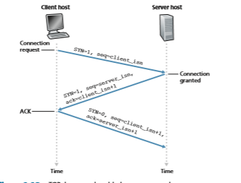
**Figure 3.39**  ♦  TCP three-way handshake: segment exchange

**Figure 3.40**  ♦  Closing a TCP connection
in the hosts are deallocated. As an example, suppose the client decides to close the connection, as shown in Figure 3.40. The client application process issues a close command. This causes the client TCP to send a special TCP segment to the server process. This special segment has a flag bit in the segment’s header, the FIN bit (see Figure 3.29), set to 1. When the server receives this segment, it sends the client an acknowledgment segment in return. The server then sends its own shutdown segment, which has the FIN bit set to 1. Finally, the client acknowledges the server’s shutdown segment. At this point, all the resources in the two hosts are now deallocated.

During the life of a TCP connection, the TCP protocol running in each host makes transitions through various **TCP states**. Figure 3.41 illustrates a typical sequence of TCP states that are visited by the _client_ TCP. The client TCP begins in the CLOSED state. The application on the client side initiates a new TCP con- nection (by creating a Socket object in our Python examples from Chapter 2). This causes TCP in the client to send a SYN segment to TCP in the server. After hav- ing sent the SYN segment, the client TCP enters the SYN\_SENT state. While in the SYN\_SENT state, the client TCP waits for a segment from the server TCP that includes an acknowledgment for the client’s previous segment and has the SYN bit
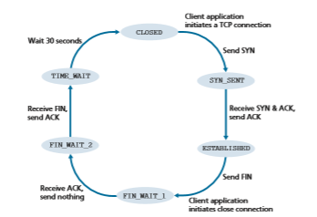
**Figure 3.41**  ♦  A typical sequence of TCP states visited by a client

set to 1. Having received such a segment, the client TCP enters the ESTABLISHED state. While in the ESTABLISHED state, the TCP client can send and receive TCP segments containing payload (that is, application-generated) data.

Suppose that the client application decides it wants to close the connection. (Note that the server could also choose to close the connection.) This causes the client TCP to send a TCP segment with the FIN bit set to 1 and to enter the FIN\_WAIT\_1 state. While in the FIN\_WAIT\_1 state, the client TCP waits for a TCP segment from the server with an acknowledgment. When it receives this segment, the client TCP enters the FIN\_WAIT\_2 state. While in the FIN\_WAIT\_2 state, the client waits for another segment from the server with the FIN bit set to 1; after receiving this segment, the client TCP acknowledges the server’s segment and enters the TIME\_WAIT state. The TIME\_ WAIT state lets the TCP client resend the final acknowledgment in case the ACK is lost. The time spent in the TIME\_WAIT state is implementation-dependent, but typical values are 30 seconds, 1 minute, and 2 minutes. After the wait, the connection formally closes and all resources on the client side (including port numbers) are released.

Figure 3.42 illustrates the series of states typically visited by the server-side TCP, assuming the client begins connection teardown. The transitions are self- explanatory. In these two state-transition diagrams, we have only shown how a TCP connection is normally established and shut down. We have not described what hap- pens in certain pathological scenarios, for example, when both sides of a connection want to initiate or shut down at the same time. If you are interested in learning about

**Figure 3.42**  ♦   A typical sequence of TCP states visited by a server-side TCP

this and other advanced issues concerning TCP, you are encouraged to see Stevens’ comprehensive book [Stevens 1994].

Our discussion above has assumed that both the client and server are prepared to communicate, that is, that the server is listening on the port to which the client sends its SYN segment. Let’s consider what happens when a host receives a TCP segment whose port numbers or source IP address do not match with any of the ongoing sock- ets in the host. For example, suppose a host receives a TCP SYN packet with desti- nation port 80, but the host is not accepting connections on port 80 (that is, it is not running a Web server on port 80). Then the host will send a special reset segment to the source. This TCP segment has the RST flag bit (see Section 3.5.2) set to 1. Thus, when a host sends a reset segment, it is telling the source “I don’t have a socket for that segment. Please do not resend the segment.” When a host receives a UDP packet whose destination port number doesn’t match with an ongoing UDP socket, the host sends a special ICMP datagram, as discussed in Chapter 5.

Now that we have a good understanding of TCP connection management, let’s revisit the nmap port-scanning tool and examine more closely how it works. To explore a specific TCP port, say port 6789, on a target host, nmap will send a TCP SYN seg- ment with destination port 6789 to that host. There are three possible outcomes:

• _The source host receives a TCP SYNACK segment from the target host_. Since this means that an application is running with TCP port 6789 on the target post, nmap returns “open.”

**THE SYN FLOOD ATTACK**

We’ve seen in our discussion of TCP’s three-way handshake that a server allocates and initializes connection variables and buffers in response to a received SYN. The server then sends a SYNACK in response, and awaits an ACK segment from the cli- ent. If the client does not send an ACK to complete the third step of this 3-way hand- shake, eventually (often after a minute or more) the server will terminate the half-open connection and reclaim the allocated resources.

This TCP connection management protocol sets the stage for a classic Denial of Service (DoS) attack known as the **SYN flood attack**. In this attack, the attacker(s) send a large number of TCP SYN segments, without completing the third handshake step. With this deluge of SYN segments, the server’s connection resources become exhausted as they are allocated (but never used!) for half-open connections; legitimate clients are then denied service. Such SYN flooding attacks were among the first documented DoS attacks [CERT SYN 1996]. Fortunately, an effective defense known as **SYN cookies** [RFC 4987] are now deployed in most major operating systems. SYN cookies work as follows:

• When the server receives a SYN segment, it does not know if the segment is coming from a legitimate user or is part of a SYN flood attack. So, instead of creating a half-open TCP connection for this SYN, the server creates an initial TCP sequence number that is a complicated function (hash function) of source and destination IP addresses and port numbers of the SYN segment, as well as a secret number only known to the server. This carefully crafted initial sequence number is the so-called “cookie.” The server then sends the client a SYNACK packet with this special initial sequence number. _Importantly, the server does not remember the cookie or any other state information corresponding to the SYN_.

• A legitimate client will return an ACK segment. When the server receives this ACK, it must verify that the ACK corresponds to some SYN sent earlier. But how is this done if the server maintains no memory about SYN segments? As you may have guessed, it is done with the cookie. Recall that for a legitimate ACK, the value in the acknowledgment field is equal to the initial sequence number in the SYNACK (the cookie value in this case) plus one (see Figure 3.39). The server can then run the same hash function using the source and destination IP address and port numbers in the SYNACK (which are the same as in the original SYN) and the secret number. If the result of the function plus one is the same as the acknowledgment (cookie) value in the client’s SYNACK, the server concludes that the ACK corresponds to an earlier SYN segment and is hence valid. The server then creates a fully open connection along with a socket.

• On the other hand, if the client does not return an ACK segment, then the origi- nal SYN has done no harm at the server, since the server hasn’t yet allocated any resources in response to the original bogus SYN.
********************

• _The source host receives a TCP RST segment from the target host_. This means that the SYN segment reached the target host, but the target host is not running an application with TCP port 6789. But the attacker at least knows that the seg- ments destined to the host at port 6789 are not blocked by any firewall on the path between source and target hosts. (Firewalls are discussed in Chapter 8.)

• _The source receives nothing_. This likely means that the SYN segment was blocked by an intervening firewall and never reached the target host.

Nmap is a powerful tool that can “case the joint” not only for open TCP ports, but also for open UDP ports, for firewalls and their configurations, and even for the versions of applications and operating systems. Most of this is done by manip- ulating TCP connection-management segments. You can download nmap from www.nmap.org.

This completes our introduction to error control and flow control in TCP. In Section 3.7, we’ll return to TCP and look at TCP congestion control in some depth. Before doing so, however, we first step back and examine congestion-control issues in a broader context.

## Principles of Congestion Control
In the previous sections, we examined both the general principles and specific TCP mechanisms used to provide for a reliable data transfer service in the face of packet loss. We mentioned earlier that, in practice, such loss typically results from the over- flowing of router buffers as the network becomes congested. Packet retransmission thus treats a symptom of network congestion (the loss of a specific transport-layer segment) but does not treat the cause of network congestion—too many sources attempting to send data at too high a rate. To treat the cause of network congestion, mechanisms are needed to throttle senders in the face of network congestion.

In this section, we consider the problem of congestion control in a general con- text, seeking to understand why congestion is a bad thing, how network congestion is manifested in the performance received by upper-layer applications, and various approaches that can be taken to avoid, or react to, network congestion. This more general study of congestion control is appropriate since, as with reliable data trans- fer, it is high on our “top-ten” list of fundamentally important problems in network- ing. The following section contains a detailed study of TCP’s congestion-control algorithm.

### The Causes and the Costs of Congestion
 Let’s begin our general study of congestion control by examining three increas- ingly complex scenarios in which congestion occurs. In each case, we’ll look at whycongestion occurs in the first place and at the cost of congestion (in terms of resources not fully utilized and poor performance received by the end systems). We’ll not (yet) focus on how to react to, or avoid, congestion but rather focus on the simpler issue of understanding what happens as hosts increase their transmission rate and the network becomes congested.

**Scenario 1: Two Senders, a Router with Infinite Buffers**

We begin by considering perhaps the simplest congestion scenario possible: Two hosts (A and B) each have a connection that shares a single hop between source and destination, as shown in Figure 3.43.

Let’s assume that the application in Host A is sending data into the connection (for example, passing data to the transport-level protocol via a socket) at an average rate of lin bytes/sec. These data are original in the sense that each unit of data is sent into the socket only once. The underlying transport-level protocol is a simple one. Data is encapsulated and sent; no error recovery (e.g., retransmission), flow control, or congestion control is performed. Ignoring the additional overhead due to adding transport- and lower-layer header information, the rate at which Host A offers traffic to the router in this first scenario is thus lin bytes/sec. Host B operates in a similar manner, and we assume for simplicity that it too is sending at a rate of lin bytes/sec. Packets from Hosts A and B pass through a router and over a shared outgoing link of capacity _R_. The router has buffers that allow it to store incoming packets when the packet-arrival rate exceeds the outgoing link’s capacity. In this first scenario, we assume that the router has an infinite amount of buffer space.

Figure 3.44 plots the performance of Host A’s connection under this first sce- nario. The left graph plots the **per-connection throughput** (number of bytes per
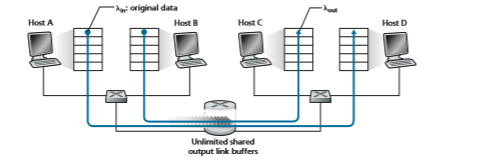
**Figure 3.43**  ♦   Congestion scenario 1: Two connections sharing a single hop with infinite buffers
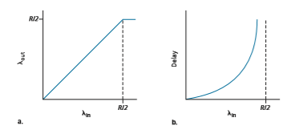
**Figure 3.44**  ♦   Congestion scenario 1: Throughput and delay as a function of host sending rate

second at the receiver) as a function of the connection-sending rate. For a sending rate between 0 and _R_/2, the throughput at the receiver equals the sender’s sending rate—everything sent by the sender is received at the receiver with a finite delay. When the sending rate is above _R_/2, however, the throughput is only _R_/2. This upper limit on throughput is a consequence of the sharing of link capacity between two connections. The link simply cannot deliver packets to a receiver at a steady-state rate that exceeds _R_/2. No matter how high Hosts A and B set their sending rates, they will each never see a throughput higher than _R_/2.

Achieving a per-connection throughput of _R_/2 might actually appear to be a good thing, because the link is fully utilized in delivering packets to their destinations. The right-hand graph in Figure 3.44, however, shows the consequence of operating near link capacity. As the sending rate approaches _R_/2 (from the left), the average delay becomes larger and larger. When the sending rate exceeds _R_/2, the average number of queued packets in the router is unbounded, and the average delay between source and destina- tion becomes infinite (assuming that the connections operate at these sending rates for an infinite period of time and there is an infinite amount of buffering available). Thus, while operating at an aggregate throughput of near _R_ may be ideal from a throughput standpoint, it is far from ideal from a delay standpoint. _Even in this (extremely) ideal- ized scenario, we’ve already found one cost of a congested network—large queuing delays are experienced as the packet-arrival rate nears the link capacity._

**Scenario 2: Two Senders and a Router with Finite Buffers**

Let’s now slightly modify scenario 1 in the following two ways (see Figure 3.45). First, the amount of router buffering is assumed to be finite. A consequence of this real-world assumption is that packets will be dropped when arriving to an already- full buffer. Second, we assume that each connection is reliable. If a packet containing
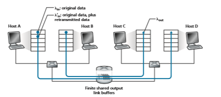
**Figure 3.45**  ♦   Scenario 2: Two hosts (with retransmissions) and a router with finite buffers

a transport-level segment is dropped at the router, the sender will eventually retrans- mit it. Because packets can be retransmitted, we must now be more careful with our use of the term _sending rate_. Specifically, let us again denote the rate at which the application sends original data into the socket by lin bytes/sec. The rate at which the transport layer sends segments (containing original data _and_ retransmitted data) into the network will be denoted l′in bytes/sec. l′in is sometimes referred to as the **offered load** to the network.

The performance realized under scenario 2 will now depend strongly on how retransmission is performed. First, consider the unrealistic case that Host A is able to somehow (magically!) determine whether or not a buffer is free in the router and thus sends a packet only when a buffer is free. In this case, no loss would occur, lin would be equal to l′in, and the throughput of the connection would be equal to lin. This case is shown in Figure 3.46(a). From a throughput standpoint, performance is ideal—everything that is sent is received. Note that the average host sending rate cannot exceed _R_/2 under this scenario, since packet loss is assumed never to occur.

Consider next the slightly more realistic case that the sender retransmits only when a packet is known for certain to be lost. (Again, this assumption is a bit of a stretch. However, it is possible that the sending host might set its timeout large enough to be virtually assured that a packet that has not been acknowledged has been lost.) In this case, the performance might look something like that shown in Fig- ure 3.46(b). To appreciate what is happening here, consider the case that the offered load, l′in (the rate of original data transmission plus retransmissions), equals _R/2_. According to Figure 3.46(b), at this value of the offered load, the rate at which data

**Figure 3.46**  ♦  Scenario 2 performance with finite buffers

are delivered to the receiver application is _R_/3. Thus, out of the 0.5_R_ units of data transmitted, 0.333_R_ bytes/sec (on average) are original data and 0.166_R_ bytes/sec (on average) are retransmitted data. _We see here another cost of a congested network— the sender must perform retransmissions in order to compensate for dropped (lost) packets due to buffer overflow._

Finally, let us consider the case that the sender may time out prematurely and retransmit a packet that has been delayed in the queue but not yet lost. In this case, both the original data packet and the retransmission may reach the receiver. Of course, the receiver needs but one copy of this packet and will discard the retrans- mission. In this case, the work done by the router in forwarding the retransmitted copy of the original packet was wasted, as the receiver will have already received the original copy of this packet. The router would have better used the link trans- mission capacity to send a different packet instead. _Here then is yet another cost of a congested network—unneeded retransmissions by the sender in the face of large delays may cause a router to use its link bandwidth to forward unneeded copies of a packet._ Figure 3.46 (c) shows the throughput versus offered load when each packet is assumed to be forwarded (on average) twice by the router. Since each packet is forwarded twice, the throughput will have an asymptotic value of _R_/4 as the offered load approaches _R_/2.

**Scenario 3: Four Senders, Routers with Finite Buffers, and Multihop Paths**

In our final congestion scenario, four hosts transmit packets, each over overlap- ping two-hop paths, as shown in Figure 3.47. We again assume that each host uses a timeout/retransmission mechanism to implement a reliable data transfer service, that all hosts have the same value of lin, and that all router links have capacity _R_ bytes/sec.
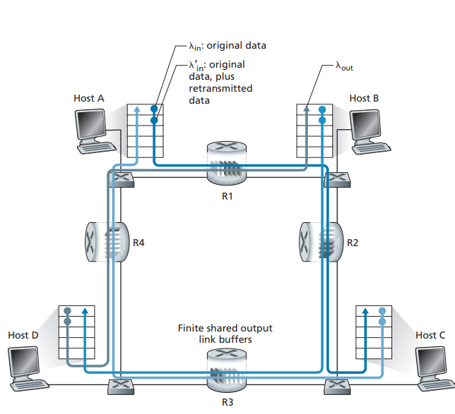
**Figure 3.47** ♦ Four senders, routers with finite buffers, and multihop paths

Let’s consider the connection from Host A to Host C, passing through routers R1 and R2. The A–C connection shares router R1 with the D–B connection and shares router R2 with the B–D connection. For extremely small values of lin, buffer overflows are rare (as in congestion scenarios 1 and 2), and the throughput approxi- mately equals the offered load. For slightly larger values of lin, the corresponding throughput is also larger, since more original data is being transmitted into the net- work and delivered to the destination, and overflows are still rare. Thus, for small values of lin, an increase in lin results in an increase in lout.

Having considered the case of extremely low traffic, let’s next examine the case that lin (and hence l′in) is extremely large. Consider router R2. The A–C traffic arriving to router R2 (which arrives at R2 after being forwarded from R1) can have an arrival rate at R2 that is at most _R,_ the capacity of the link from R1 to R2, regard- less of the value of lin. If l′in is extremely large for all connections (including the
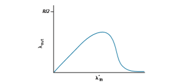

**Figure 3.48**  ♦   Scenario 3 performance with finite buffers and multihop paths

B–D connection), then the arrival rate of B–D traffic at R2 can be much larger than that of the A–C traffic. Because the A–C and B–D traffic must compete at router R2 for the limited amount of buffer space, the amount of A–C traffic that success- fully gets through R2 (that is, is not lost due to buffer overflow) becomes smaller and smaller as the offered load from B–D gets larger and larger. In the limit, as the offered load approaches infinity, an empty buffer at R2 is immediately filled by a B–D packet, and the throughput of the A–C connection at R2 goes to zero. This, in turn, _implies that the A–C end-to-end throughput goes to zero_ in the limit of heavy traffic. These considerations give rise to the offered load versus throughput tradeoff shown in Figure 3.48.

The reason for the eventual decrease in throughput with increasing offered load is evident when one considers the amount of wasted work done by the net- work. In the high-traffic scenario outlined above, whenever a packet is dropped at a second-hop router, the work done by the first-hop router in forwarding a packet to the second-hop router ends up being “wasted.” The network would have been equally well off (more accurately, equally bad off) if the first router had simply discarded that packet and remained idle. More to the point, the transmission capac- ity used at the first router to forward the packet to the second router could have been much more profitably used to transmit a different packet. (For example, when selecting a packet for transmission, it might be better for a router to give priority to packets that have already traversed some number of upstream routers.) _So here we see yet another cost of dropping a packet due to congestion—when a packet is dropped along a path, the transmission capacity that was used at each of the upstream links to forward that packet to the point at which it is dropped ends up having been wasted.
### Approaches to Congestion Control

 In Section 3.7, we’ll examine TCP’s specific approach to congestion control in great detail. Here, we identify the two broad approaches to congestion control that are taken in practice and discuss specific network architectures and congestion-control protocols embodying these approaches.

At the highest level, we can distinguish among congestion-control approaches by whether the network layer provides explicit assistance to the transport layer for congestion-control purposes:

• _End-to-end congestion control_. In an end-to-end approach to congestion control, the network layer provides no explicit support to the transport layer for conges- tion-control purposes. Even the presence of network congestion must be inferred by the end systems based only on observed network behavior (for example, packet loss and delay). We’ll see shortly in Section 3.7.1 that TCP takes this end-to-end approach toward congestion control, since the IP layer is not required to provide feedback to hosts regarding network congestion. TCP segment loss (as indicated by a timeout or the receipt of three duplicate acknowledgments) is taken as an indication of network congestion, and TCP decreases its window size accord- ingly. We’ll also see a more recent proposal for TCP congestion control that uses increasing round-trip segment delay as an indicator of increased network congestion

• _Network-assisted congestion control_. With network-assisted congestion control, routers provide explicit feedback to the sender and/or receiver regarding the con- gestion state of the network. This feedback may be as simple as a single bit indi- cating congestion at a link—an approach taken in the early IBM SNA [Schwartz 1982], DEC DECnet [Jain 1989; Ramakrishnan 1990] architectures, and ATM [Black 1995] network architectures. More sophisticated feedback is also possible. For example, in **ATM Available Bite Rate (ABR)** congestion control, a router informs the sender of the maximum host sending rate it (the router) can support on an outgoing link. As noted above, the Internet-default versions of IP and TCP adopt an end-to-end approach towards congestion control. We’ll see, however, in Section 3.7.2 that, more recently, IP and TCP may also optionally implement network-assisted congestion control.

For network-assisted congestion control, congestion information is typically fed back from the network to the sender in one of two ways, as shown in Fig- ure 3.49. Direct feedback may be sent from a network router to the sender. This form of notification typically takes the form of a choke packet (essentially say- ing, “I’m congested!”). The second and more common form of notification occurs when a router marks/updates a field in a packet flowing from sender to receiver to indicate congestion. Upon receipt of a marked packet, the receiver then notifies the sender of the congestion indication. This latter form of notification takes a full round-trip time.


**Figure 3.49**  ♦   Two feedback pathways for network-indicated congestion information

## TCP Congestion Control

In this section, we return to our study of TCP. As we learned in Section 3.5, TCP provides a reliable transport service between two processes running on different hosts. Another key component of TCP is its congestion-control mechanism. As indicated in the previous sec- tion, what we might refer to as “Classic” TCP—the version of TCP standardized in [RFC 2581] and most recently [RFC 5681]—uses end-to-end congestion control rather than network-assisted congestion control, since the IP layer provides no explicit feedback to the end systems regarding network congestion. We’ll first cover this “classic” version of TCP in depth in Section 7.3.1. In Section 7.3.2, we’ll then look at newer flavors of TCP that use an explicit congestion indication provided by the network layer, or differ a bit from “classic” TCP in any of several different ways. We’ll then cover the challenge of providing fairness among transport layer flows that must share a congested link.

### Classic TCP Congestion Control
 The approach taken by TCP is to have each sender limit the rate at which it sends traf- fic into its connection as a function of perceived network congestion. If a TCP sender perceives that there is little congestion on the path between itself and the destination, then the TCP sender increases its send rate; if the sender perceives that there is conges- tion along the path, then the sender reduces its send rate. But this approach raises three questions. First, how does a TCP sender limit the rate at which it sends traffic into its connection? Second, how does a TCP sender perceive that there is congestion on the path between itself and the destination? And third, what algorithm should the sender use to change its send rate as a function of perceived end-to-end congestion?

Let’s first examine how a TCP sender limits the rate at which it sends traffic into its connection. In Section 3.5, we saw that each side of a TCP connection consists of a receive buffer, a send buffer, and several variables (LastByteRead, rwnd, and so on). The TCP congestion-control mechanism operating at the sender keeps track of an additional variable, the **congestion window**. The congestion window, denoted cwnd, imposes a constraint on the rate at which a TCP sender can send traffic into the network. Specifically, the amount of unacknowledged data at a sender may not exceed the minimum of cwnd and rwnd, that is:
```
LastByteSent – LastByteAcked … min{cwnd, rwnd}
```
In order to focus on congestion control (as opposed to flow control), let us henceforth assume that the TCP receive buffer is so large that the receive-window constraint can be ignored; thus, the amount of unacknowledged data at the sender is solely limited by cwnd. We will also assume that the sender always has data to send, that is, that all segments in the congestion window are sent.

The constraint above limits the amount of unacknowledged data at the sender and therefore indirectly limits the sender’s send rate. To see this, consider a connection for which loss and packet transmission delays are negligible. Then, roughly, at the begin- ning of every RTT, the constraint permits the sender to send cwnd bytes of data into the connection; at the end of the RTT the sender receives acknowledgments for the data. _Thus the sender’s send rate is roughly cwnd/RTT bytes/sec. By adjusting the value of_ cwnd_, the sender can therefore adjust the rate at which it sends data into its connection._

Let’s next consider how a TCP sender perceives that there is congestion on the path between itself and the destination. Let us define a “loss event” at a TCP sender as the occurrence of either a timeout or the receipt of three duplicate ACKs from the receiver. (Recall our discussion in Section 3.5.4 of the timeout event in Figure 3.33 and the subsequent modification to include fast retransmit on receipt of three dupli- cate ACKs.) When there is excessive congestion, then one (or more) router buffers along the path overflows, causing a datagram (containing a TCP segment) to be dropped. The dropped datagram, in turn, results in a loss event at the sender—either a timeout or the receipt of three duplicate ACKs—which is taken by the sender to be an indication of congestion on the sender-to-receiver path.

Having considered how congestion is detected, let’s next consider the more opti- mistic case when the network is congestion-free, that is, when a loss event doesn’t occur. In this case, acknowledgments for previously unacknowledged segments will be received at the TCP sender. As we’ll see, TCP will take the arrival of these acknowledgments as an indication that all is well—that segments being transmitted into the network are being successfully delivered to the destination—and will use acknowledgments to increase its congestion window size (and hence its transmis- sion rate). Note that if acknowledgments arrive at a relatively slow rate (e.g., if the end-end path has high delay or contains a low-bandwidth link), then the congestion window will be increased at a relatively slow rate. On the other hand, if acknowl- edgments arrive at a high rate, then the congestion window will be increased morequickly. Because TCP uses acknowledgments to trigger (or clock) its increase in congestion window size, TCP is said to be **self-clocking**.

Given the _mechanism_ of adjusting the value of cwnd to control the sending rate, the critical question remains: _How_ should a TCP sender determine the rate at which it should send? If TCP senders collectively send too fast, they can congest the network, leading to the type of congestion collapse that we saw in Figure 3.48. Indeed, the ver- sion of TCP that we’ll study shortly was developed in response to observed Internet congestion collapse [Jacobson 1988] under earlier versions of TCP. However, if TCP senders are too cautious and send too slowly, they could under utilize the bandwidth in the network; that is, the TCP senders could send at a higher rate without congest- ing the network. How then do the TCP senders determine their sending rates such that they don’t congest the network but at the same time make use of all the avail- able bandwidth? Are TCP senders explicitly coordinated, or is there a distributed approach in which the TCP senders can set their sending rates based only on local information? TCP answers these questions using the following guiding principles:

• _A lost segment implies congestion, and hence, the TCP sender’s rate should be decreased when a segment is lost._ Recall from our discussion in Section 3.5.4, that a timeout event or the receipt of four acknowledgments for a given segment (one original ACK and then three duplicate ACKs) is interpreted as an implicit “loss event” indication of the segment following the quadruply ACKed segment, triggering a retransmission of the lost segment. From a congestion-control stand- point, the question is how the TCP sender should decrease its congestion window size, and hence its sending rate, in response to this inferred loss event.

• _An acknowledged segment indicates that the network is delivering the sender’s segments to the receiver, and hence, the sender’s rate can be increased when an ACK arrives for a previously unacknowledged segment._ The arrival of acknowl- edgments is taken as an implicit indication that all is well—segments are being successfully delivered from sender to receiver, and the network is thus not con- gested. The congestion window size can thus be increased.

• _Bandwidth probing_. Given ACKs indicating a congestion-free source-to-destina- tion path and loss events indicating a congested path, TCP’s strategy for adjusting its transmission rate is to increase its rate in response to arriving ACKs until a loss event occurs, at which point, the transmission rate is decreased. The TCP sender thus increases its transmission rate to probe for the rate that at which congestion onset begins, backs off from that rate, and then to begins probing again to see if the congestion onset rate has changed. The TCP sender’s behavior is perhaps analogous to the child who requests (and gets) more and more goodies until finally he/she is finally told “No!”, backs off a bit, but then begins making requests again shortly afterward. Note that there is no explicit signaling of congestion state by the network—ACKs and loss events serve as implicit signals—and that each TCP sender acts on local information asynchronously from other TCP senders.

Given this overview of TCP congestion control, we’re now in a position to consider the details of the celebrated **TCP congestion-control algorithm**, which was first describedin [Jacobson 1988] and is standardized in [RFC 5681]. The algorithm has three major components: (1) slow start, (2) congestion avoidance, and (3) fast recovery. Slow start and congestion avoidance are mandatory components of TCP, differing in how they increase the size of cwnd in response to received ACKs. We’ll see shortly that slow start increases the size of cwnd more rapidly (despite its name!) than congestion avoid- ance. Fast recovery is recommended, but not required, for TCP senders.

**Slow Start**

When a TCP connection begins, the value of cwnd is typically initialized to a small value of 1 MSS [RFC 3390], resulting in an initial sending rate of roughly MSS/ RTT. For example, if MSS = 500 bytes and RTT = 200 msec, the resulting initial sending rate is only about 20 kbps. Since the available bandwidth to the TCP sender may be much larger than MSS/RTT, the TCP sender would like to find the amount of available bandwidth quickly. Thus, in the **slow-start** state, the value of cwnd begins at 1 MSS and increases by 1 MSS every time a transmitted segment is first acknowl- edged. In the example of Figure 3.50, TCP sends the first segment into the network

**Figure 3.50**  ♦  TCP slow start

and waits for an acknowledgment. When this acknowledgment arrives, the TCP sender increases the congestion window by one MSS and sends out two maximum- sized segments. These segments are then acknowledged, with the sender increasing the congestion window by 1 MSS for each of the acknowledged segments, giving a congestion window of 4 MSS, and so on. This process results in a doubling of the sending rate every RTT. Thus, the TCP send rate starts slow but grows exponentially during the slow start phase.

But when should this exponential growth end? Slow start provides several answers to this question. First, if there is a loss event (i.e., congestion) indicated by a timeout, the TCP sender sets the value of cwnd to 1 and begins the slow start process anew. It also sets the value of a second state variable, ssthresh (short- hand for “slow start threshold”) to cwnd/2—half of the value of the congestion window value when congestion was detected. The second way in which slow start may end is directly tied to the value of ssthresh. Since ssthresh is half the value of cwnd when congestion was last detected, it might be a bit reckless to keep doubling cwnd when it reaches or surpasses the value of ssthresh. Thus, when the value of cwnd equals ssthresh, slow start ends and TCP transitions into con- gestion avoidance mode. As we’ll see, TCP increases cwnd more cautiously when in congestion-avoidance mode. The final way in which slow start can end is if three duplicate ACKs are detected, in which case TCP performs a fast retransmit (see Sec- tion 3.5.4) and enters the fast recovery state, as discussed below. TCP’s behavior in slow start is summarized in the FSM description of TCP congestion control in Figure 3.51. The slow-start algorithm traces it roots to [Jacobson 1988]; an approach similar to slow start was also proposed independently in [Jain 1986].

**Congestion Avoidance**

On entry to the congestion-avoidance state, the value of cwnd is approximately half its value when congestion was last encountered—congestion could be just around the corner! Thus, rather than doubling the value of cwnd every RTT, TCP adopts a more conservative approach and increases the value of cwnd by just a single MSS every RTT [RFC 5681]. This can be accomplished in several ways. A common approach is for the TCP sender to increase cwnd by MSS bytes (MSS/cwnd) when- ever a new acknowledgment arrives. For example, if MSS is 1,460 bytes and cwnd is 14,600 bytes, then 10 segments are being sent within an RTT. Each arriving ACK (assuming one ACK per segment) increases the congestion window size by 1/10 MSS, and thus, the value of the congestion window will have increased by one MSS after ACKs when all 10 segments have been received.

But when should congestion avoidance’s linear increase (of 1 MSS per RTT) end? TCP’s congestion-avoidance algorithm behaves the same when a timeout occurs as in the case of slow start: The value of cwnd is set to 1 MSS, and the value of ssthresh is updated to half the value of cwnd when the loss event occurred. Recall, however, that a loss event also can be triggered by a triple duplicate ACK event.

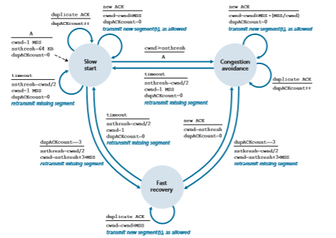

**Figure 3.51**  ♦  FSM description of TCP congestion control


In this case, the network is continuing to deliver some segments from sender to receiver (as indicated by the receipt of duplicate ACKs). So TCP’s behavior to this type of loss event should be less drastic than with a timeout-indicated loss: TCP halves the value of cwnd (adding in 3 MSS for good measure to account for the triple duplicate ACKs received) and records the value of ssthresh to be half the value of cwnd when the triple duplicate ACKs were received. The fast-recovery state is then entered.

**Fast Recovery**

In fast recovery, the value of cwnd is increased by 1 MSS for every duplicate ACK received for the missing segment that caused TCP to enter the fast-recovery state. Eventually, when an ACK arrives for the missing segment, TCP enters the

**Examining the behavior of TCP**

**VideoNote**congestion-avoidance state after deflating cwnd. If a timeout event occurs, fast recovery transitions to the slow-start state after performing the same actions as in slow start and congestion avoidance: The value of cwnd is set to 1 MSS, and the value of ssthresh is set to half the value of cwnd when the loss event occurred.

**PRINCIPLES IN PRACTICE**

**TCP SPLITTING: OPTIMIZING THE PERFORMANCE OF CLOUD SERVICES**

For cloud services such as search, e-mail, and social networks, it is desirable to provide a high-level of responsiveness, ideally giving users the illusion that the services are running within their own end systems (including their smartphones). This can be a major challenge, as users are often located far away from the data centers responsible for serving the dynamic content associated with the cloud services. Indeed, if the end system is far from a data center, then the RTT will be large, potentially leading to poor response time perfor- mance due to TCP slow start.

As a case study, consider the delay in receiving a response for a search query. Typically, the server requires three TCP windows during slow start to deliver the response [Pathak 2010]. Thus the time from when an end system initiates a TCP connection until the time when it receives the last packet of the response is roughly 4 # RTT (one RTT to set up the TCP connection plus three RTTs for the three windows of data) plus the processing time in the data center. These RTT delays can lead to a noticeable delay in returning search results for a significant fraction of queries. Moreover, there can be significant packet loss in access networks, leading to TCP retransmissions and even larger delays.

One way to mitigate this problem and improve user-perceived performance is to (1) deploy front-end servers closer to the users, and (2) utilize **TCP splitting** by break- ing the TCP connection at the front-end server. With TCP splitting, the client establishes a TCP connection to the nearby front-end, and the front-end maintains a persistent TCP connection to the data center with a very large TCP congestion window [Tariq 2008, Pathak 2010, Chen 2011]. With this approach, the response time roughly becomes 4 # RTTFE + RTTBE + processing time, where RTTFE is the round-trip time between client and front-end server, and RTTBE is the round-trip time between the front-end server and the data center (back-end server). If the front-end server is close to client, then this response time approximately becomes RTT plus processing time, since RTTFE is negligibly small and RTTBE is approximately RTT. In summary, TCP splitting can reduce the networking delay roughly from 4 # RTT to RTT, significantly improving user-perceived performance, particularly for users who are far from the nearest data center. TCP splitting also helps reduce TCP retransmission delays caused by losses in access networks. Google and Akamai have made extensive use of their CDN servers in access networks (recall our discussion in Section 2.6) to perform TCP splitting for the cloud services they support [Chen 2011].
**************************
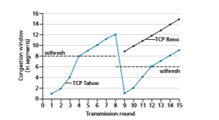
**Figure 3.52**  ♦  Evolution of TCP’s congestion window (Tahoe and Reno)

Fast recovery is a recommended, but not required, component of TCP [RFC 5681]. It is interesting that an early version of TCP, known as **TCP Tahoe**, uncon- ditionally cut its congestion window to 1 MSS and entered the slow-start phase after either a timeout-indicated or triple-duplicate-ACK-indicated loss event. The newer version of TCP, **TCP Reno**, incorporated fast recovery.

Figure 3.52 illustrates the evolution of TCP’s congestion window for both Reno and Tahoe. In this figure, the threshold is initially equal to 8 MSS. For the first eight transmission rounds, Tahoe and Reno take identical actions. The congestion window climbs exponentially fast during slow start and hits the threshold at the fourth round of transmission. The congestion window then climbs linearly until a triple duplicate- ACK event occurs, just after transmission round 8. Note that the congestion window is 12 # _MSS_ when this loss event occurs. The value of ssthresh is then set to 0.5 # cwnd = 6 # MSS. Under TCP Reno, the congestion window is set to cwnd = 9 # MSS and then grows linearly. Under TCP Tahoe, the congestion window is set to 1 MSS and grows exponentially until it reaches the value of ssthresh, at which point it grows linearly.

Figure 3.51 presents the complete FSM description of TCP’s congestion-control algorithms—slow start, congestion avoidance, and fast recovery. The figure also indicates where transmission of new segments or retransmitted segments can occur. Although it is important to distinguish between TCP error control/retransmission and TCP congestion control, it’s also important to appreciate how these two aspects of TCP are inextricably linked.

**TCP Congestion Control: Retrospective**

Having delved into the details of slow start, congestion avoidance, and fast recovery, it’s worthwhile to now step back and view the forest from the trees. Ignoring the
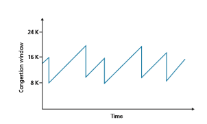
**Figure 3.53**  ♦  Additive-increase, multiplicative-decrease congestion control

initial slow-start period when a connection begins and assuming that losses are indi- cated by triple duplicate ACKs rather than timeouts, TCP’s congestion control con- sists of linear (additive) increase in cwnd of 1 MSS per RTT and then a halving (multiplicative decrease) of cwnd on a triple duplicate-ACK event. For this reason, TCP congestion control is often referred to as an **additive-increase, multiplicative- decrease (AIMD)** form of congestion control. AIMD congestion control gives rise to the “saw tooth” behavior shown in Figure 3.53, which also nicely illustrates our earlier intuition of TCP “probing” for bandwidth—TCP linearly increases its conges- tion window size (and hence its transmission rate) until a triple duplicate-ACK event occurs. It then decreases its congestion window size by a factor of two but then again begins increasing it linearly, probing to see if there is additional available bandwidth.

TCP’s AIMD algorithm was developed based on a tremendous amount of engineering insight and experimentation with congestion control in operational networks. Ten years after TCP’s development, theoretical analyses showed that TCP’s congestion-control algorithm serves as a distributed asynchronous-optimization algorithm that results in several important aspects of user and network performance being simultaneously optimized [Kelly 1998]. A rich theory of congestion control has since been developed [Srikant 2012].

**TCP Cubic**

Given TCP Reno’s additive-increase, multiplicative-decrease approach to conges- tion control, one might naturally wonder whether this is the best way to “probe” for a packet sending rate that is just below the threshold of triggering packet loss. Indeed, cutting the sending rate in half (or even worse, cutting the sending rate to one packet per RTT as in an earlier version of TCP known as TCP Tahoe) and then increasing rather slowly over time may be overly cautious. If the state of the congested link

where packet loss occurred hasn’t changed much, then perhaps it’s better to more quickly ramp up the sending rate to get close to the pre-loss sending rate and only then probe cautiously for bandwidth. This insight lies at the heart of a flavor of TCP known as TCP CUBIC [Ha 2008, RFC 8312].

TCP CUBIC differs only slightly from TCP Reno. Once again, the congestion window is increased only on ACK receipt, and the slow start and fast recovery phases remain the same. CUBIC only changes the congestion avoidance phase, as follows:

• Let _W_max be size of TCP’s congestion control window when loss was last detected, and let _K_ be the future point in time when TCP CUBIC’s window size will again reach _W_max, assuming no losses. Several tunable CUBIC parameters determine the value _K_, that is, how quickly the protocol’s congestion window size would reach _W_max.

• CUBIC increases the congestion window as a function of _cube_ of the distance between the current time, _t_, and _K_. Thus, when _t_ is further away from _K_, the congestion window size increases are much larger than when _t_ is close to _K_. That is, CUBIC quickly ramps up TCP’s sending rate to get close to the pre-loss rate, _W_max, and only then probes cautiously for bandwidth as it approaches _W_max.

• When _t_ is greater than _K_, the cubic rule implies that CUBIC’s congestion window increases are small when _t_ is still close to _K_ (which is good if the congestion level of the link causing loss hasn’t changed much) but then increases rapidly as _t_ exceeds _K_ (which allows CUBIC to more quickly find a new operating point if the congestion level of the link that caused loss has changed significantly).

Under these rules, the idealized performance of TCP Reno and TCP CUBIC are compared in Figure 3.54, adapted from [Huston 2017]. We see the slow start phase

**Figure 3.54**  ♦   TCP congestion avoidance sending rates: TCP Reno and TCP CUBIC
a ending at _t_0\. Then, when congestion loss occurs at _t_1, _t_2, and _t_3, CUBIC more quickly ramps up close to _W_max (thereby enjoying more overall throughput than TCP Reno). We can see graphically how TCP CUBIC attempts to maintain the flow for as long as possible just below the (unknown to the sender) congestion threshold. Note that at _t_3_,_ the congestion level has presumably decreased appreciably, allowing both TCP Reno and TCP CUBIC to achieve sending rates higher than _W_max_._

TCP CUBIC has recently gained wide deployment. While measurements taken around 2000 on popular Web servers showed that nearly all were running some version of TCP Reno [Padhye 2001], more recent measurements of the 5000 most popular Web servers shows that nearly 50% are running a version of TCP CUBIC [Yang 2014], which is also the default version of TCP used in the Linux operating system.

**Macroscopic Description of TCP Reno Throughput**

Given the saw-toothed behavior of TCP Reno, it’s natural to consider what the average throughput (that is, the average rate) of a long-lived TCP Reno connec- tion might be. In this analysis, we’ll ignore the slow-start phases that occur after timeout events. (These phases are typically very short, since the sender grows out of the phase exponentially fast.) During a particular round-trip interval, the rate at which TCP sends data is a function of the congestion window and the current _RTT_. When the window size is _w_ bytes and the current round-trip time is _RTT_ second_s_, then TCP’s transmission rate is roughly _w/RTT._ TCP then probes for additional bandwidth by increasing _w_ by 1 MSS each _RTT_ until a loss event occurs. Denote by _W_ the value of _w_ when a loss event occurs. Assuming that _RTT_ and _W_ are approxi- mately constant over the duration of the connection, the TCP transmission rate ranges from _W_/(2 · _RTT_) to _W/RTT_.

These assumptions lead to a highly simplified macroscopic model for the steady- state behavior of TCP. The network drops a packet from the connection when the rate increases to _W/RTT;_ the rate is then cut in half and then increases by MSS/_RTT_ every _RTT_ until it again reaches _W/RTT_. This process repeats itself over and over again. Because TCP’s throughput (that is, rate) increases linearly between the two extreme values, we have

average throughput of a connection = 0.75 # _W_

_RTT_

Using this highly idealized model for the steady-state dynamics of TCP, we can also derive an interesting expression that relates a connection’s loss rate to its available bandwidth [Mathis 1997]. This derivation is outlined in the homework problems. A more sophisticated model that has been found empirically to agree with measured data is [Padhye 2000].

### Network-Assisted Explicit Congestion Notification and Delayed-based Congestion Control

Since the initial standardization of slow start and congestion avoidance in the late 1980’s [RFC 1122], TCP has implemented the form of end-end congestion control that we studied in Section 3.7.1: a TCP sender receives no explicit congestion indica- tions from the network layer, and instead infers congestion through observed packet loss. More recently, extensions to both IP and TCP [RFC 3168] have been proposed, implemented, and deployed that allow the network to explicitly signal congestion to a TCP sender and receiver. In addition, a number of variations of TCP congestion control protocols have been proposed that infer congestion using measured packet delay. We’ll take a look at both network-assisted and delay-based congestion control in this section.

**Explicit Congestion Notification**

Explicit Congestion Notification [RFC 3168] is the form of network-assisted con- gestion control performed within the Internet. As shown in Figure 3.55, both TCP and IP are involved. At the network layer, two bits (with four possible values, overall) in the Type of Service field of the IP datagram header (which we’ll discuss in Section 4.3) are used for ECN.

One setting of the ECN bits is used by a router to indicate that it (the router) is experiencing congestion. This congestion indication is then carried in the marked IP datagram to the destination host, which then informs the sending host, as shown in Figure 3.55. RFC 3168 does not provide a definition of when a router is con- gested; that decision is a configuration choice made possible by the router vendor, and decided by the network operator. However, the intuition is that the congestion indication bit can be set to signal the onset of congestion to the send before loss actu- ally occurs. A second setting of the ECN bits is used by the sending host to inform routers that the sender and receiver are ECN-capable, and thus capable of taking action in response to ECN-indicated network congestion.

As shown in Figure 3.55, when the TCP in the receiving host receives an ECN congestion indication via a received datagram, the TCP in the receiving host informs the TCP in the sending host of the congestion indication by setting the ECE (Explicit Congestion Notification Echo) bit (see Figure 3.29) in a receiver-to-sender TCP ACK segment. The TCP sender, in turn, reacts to an ACK with a congestion indica- tion by halving the congestion window, as it would react to a lost segment using fast retransmit, and sets the CWR (Congestion Window Reduced) bit in the header of the next transmitted TCP sender-to-receiver segment.

Other transport-layer protocols besides TCP may also make use of network- layer-signaled ECN. The Datagram Congestion Control Protocol (DCCP) [RFC 4340] provides a low-overhead, congestion-controlled UDP-like unreliable service that utilizes ECN. DCTCP (Data Center TCP) [Alizadeh 2010, RFC 8257] and

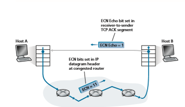

**Figure 3.55**  ♦   Explicit Congestion Notification: network-assisted congestion control

DCQCN (Data Center Quantized Congestion Notification) [Zhu 2015] designed specifically for data center networks, also makes use of ECN. Recent Internet meas- urements show increasing deployment of ECN capabilities in popular servers as well as in routers along paths to those servers [Kühlewind 2013].

**Delay-based Congestion Control**

Recall from our ECN discussion above that a congested router can set the congestion indication bit to signal congestion onset to senders _before_ full buffers cause packets to be dropped at that router. This allows senders to decrease their sending rates earlier, hopefully _before_ packet loss, thus avoiding costly packet loss and retrans- mission. A second congestion-avoidance approach takes a delay-based approach to also proactively detect congestion onset _before_ packet loss occurs.

In TCP Vegas [Brakmo 1995], the sender measures the RTT of the source-to- destination path for all acknowledged packets. Let _RTT_min be the minimum of these measurements at a sender; this occurs when the path is uncongested and packets experience minimal queuing delay. If TCP Vegas’ congestion window size is cwnd, then the uncongested throughput rate would be cwnd/_RTT_min. The intuition behind TCP Vegas is that if the actual sender-measured throughput is close to this value, the TCP sending rate can be increased since (by definition and by measurement) the path is not yet congested. However, if the actual sender-measured throughput is signifi- cantly less than the uncongested throughput rate, the path is congested and the Vegas TCP sender will decrease its sending rate. Details can be found in [Brakmo 1995].

TCP Vegas operates under the intuition that TCP senders should _“Keep the pipe just full, but no fuller”_ [Kleinrock 2018]. “Keeping the pipe full” means that links (in particular the bottleneck link that is limiting a connection’s throughput) are kept busy transmitting, doing useful work; “but no fuller” means that there is nothing to gain (except increased delay!) if large queues are allowed to build up while the pipe is kept full.

The BBR congestion control protocol [Cardwell 2017] builds on ideas in TCP Vegas, and incorporates mechanisms that allows it compete fairly (see Section 3.7.3) with TCP non-BBsenders. [Cardwell 2017] reports that in 2016, Google began using BBR for all TCP traffic on its private B4 network [Jain 2013] that intercon- nects Google data centers, replacing CUBIC. It is also being deployed on Google and YouTube Web servers. Other delay-based TCP congestion control protocols include TIMELY for data center networks \Mittal 2015], and Compound TCP (CTPC) [Tan 2006\] and FAST [Wei 2006] for high-speed and long distance networks.

### Fairness
 Consider _K_ TCP connections, each with a different end-to-end path, but all pass- ing through a bottleneck link with transmission rate _R_ bps. (By _bottleneck link_, we mean that for each connection, all the other links along the connection’s path are not congested and have abundant transmission capacity as compared with the transmis- sion capacity of the bottleneck link.) Suppose each connection is transferring a large file and there is no UDP traffic passing through the bottleneck link. A congestion- control mechanism is said to be _fair_ if the average transmission rate of each connec- tion is approximately _R/K;_ that is, each connection gets an equal share of the link bandwidth.

Is TCP’s AIMD algorithm fair, particularly given that different TCP connec- tions may start at different times and thus may have different window sizes at a given point in time? [Chiu 1989] provides an elegant and intuitive explanation of why TCP congestion control converges to provide an equal share of a bottleneck link’s band- width among competing TCP connections.

Let’s consider the simple case of two TCP connections sharing a single link with transmission rate _R_, as shown in Figure 3.55. Assume that the two connections have the same MSS and RTT (so that if they have the same congestion window size, then they have the same throughput), that they have a large amount of data to send, and that no other TCP connections or UDP datagrams traverse this shared link. Also, ignore the slow-start phase of TCP and assume the TCP connections are operating in CA mode (AIMD) at all times.

Figure 3.56 plots the throughput realized by the two TCP connections. If TCP is to share the link bandwidth equally between the two connections, then the realized throughput should fall along the 45-degree arrow (equal bandwidth share) emanating from the origin. Ideally, the sum of the two throughputs should equal _R_. (Cer- tainly, each connection receiving an equal, but zero, share of the link capacity is not a 

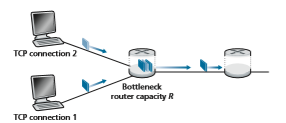
**Figure 3.56**  ♦  Two TCP connections sharing a single bottleneck link

desirable situation!) So the goal should be to have the achieved throughputs fall somewhere near the intersection of the equal bandwidth share line and the full band- width utilization line in Figure 3.56.

Suppose that the TCP window sizes are such that at a given point in time, con- nections 1 and 2 realize throughputs indicated by point _A_ in Figure 3.56. Because the amount of link bandwidth jointly consumed by the two connections is less than _R_, no loss will occur, and both connections will increase their window by 1 MSS per RTT as a result of TCP’s congestion-avoidance algorithm. Thus, the joint throughput of the two connections proceeds along a 45-degree line (equal increase for both connec- tions) starting from point _A_. Eventually, the link bandwidth jointly consumed by the two connections will be greater than _R,_ and eventually packet loss will occur. Sup- pose that connections 1 and 2 experience packet loss when they realize throughputs indicated by point _B_. Connections 1 and 2 then decrease their windows by a factor of two. The resulting throughputs realized are thus at point _C,_ halfway along a vector starting at _B_ and ending at the origin. Because the joint bandwidth use is less than _R_ at point _C,_ the two connections again increase their throughputs along a 45-degree line starting from _C_. Eventually, loss will again occur, for example, at point _D,_ and the two connections again decrease their window sizes by a factor of two, and so on. You should convince yourself that the bandwidth realized by the two connections eventually fluctuates along the equal bandwidth share line. You should also convince yourself that the two connections will converge to this behavior regardless of where they are in the two-dimensional space! Although a number of idealized assumptions lie behind this scenario, it still provides an intuitive feel for why TCP results in an equal sharing of bandwidth among connections.

In our idealized scenario, we assumed that only TCP connections traverse the bottleneck link, that the connections have the same RTT value, and that only a single TCP connection is associated with a host-destination pair. In practice, these conditions are typically not met, and client-server applications can thus obtain very unequal portions of link bandwidth. In particular, it has been shown that when
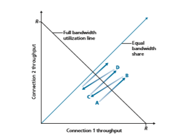
**Figure 3.57**  ♦  Throughput realized by TCP connections 1 and 2

multiple connections share a common bottleneck, those sessions with a smaller RTT are able to grab the available bandwidth at that link more quickly as it becomes free (that is, open their congestion windows faster) and thus will enjoy higher throughput than those connections with larger RTTs \[Lakshman 1997\].

**Fairness and UDP**

We have just seen how TCP congestion control regulates an application’s trans- mission rate via the congestion window mechanism. Many multimedia applications, such as Internet phone and video conferencing, often do not run over TCP for this very reason—they do not want their transmission rate throttled, even if the network is very congested. Instead, these applications prefer to run over UDP, which does not have built-in congestion control. When running over UDP, applications can pump their audio and video into the network at a constant rate and occasionally lose packets, rather than reduce their rates to “fair” levels at times of congestion and not lose any packets. From the perspective of TCP, the multimedia applications running over UDP are not being fair—they do not cooperate with the other connections nor adjust their transmission rates appropriately. Because TCP congestion control will decrease its transmission rate in the face of increasing congestion (loss), while UDP sources need not, it is possible for UDP sources to crowd out TCP traffic. A number

of congestion-control mechanisms have been proposed for the Internet that prevent UDP traffic from bringing the Internet’s throughput to a grinding halt \[Floyd 1999; Floyd 2000; Kohler 2006; RFC 4340\].

**Fairness and Parallel TCP Connections**

But even if we could force UDP traffic to behave fairly, the fairness problem would still not be completely solved. This is because there is nothing to stop a TCP-based application from using multiple parallel connections. For example, Web browsers often use multiple parallel TCP connections to transfer the multiple objects within a Web page. (The exact number of multiple connections is configurable in most browsers.) When an application uses multiple parallel connections, it gets a larger fraction of the bandwidth in a congested link. As an example, consider a link of rate _R_ supporting nine ongoing client-server applications, with each of the applications using one TCP connection. If a new application comes along and also uses one TCP connection, then each application gets approximately the same transmission rate of _R_/10. But if this new application instead uses 11 parallel TCP connections, then the new application gets an unfair allocation of more than _R_/2. Because Web traffic is so pervasive in the Internet, multiple parallel connections are not uncommon.

## Evolution of Transport-Layer Functionality
Our discussion of specific Internet transport protocols in this chapter has focused on UDP and TCP—the two “work horses” of the Internet transport layer. However, as we’ve seen, three decades of experience with these two protocols has identified cir- cumstances in which neither is ideally suited, and so the design and implementation of transport layer functionality has continued to evolve.

We’ve seen a rich evolution in the use of TCP over the past decade. In Sections 3.7.1 and 3.7.2, we learned that in addition to “classic” versions of TCP such as TCP Tahoe and Reno, there are now several newer versions of TCP that have been developed, implemented, deployed, and are in significant use today. These include TCP CUBIC, DCTCP, CTCP, BBR, and more. Indeed, measurements in [Yang 2014] indicate that CUBIC (and its predecessor, BIC [Xu 2004\) and CTCP are more widely deployed on Web servers than classic TCP Reno; we also saw that BBR is being deployed in Google’s internal B4 network, as well as on many of Google’s public-facing servers.

And there are many (many!) more versions of TCP! There are versions of TCP specifically designed for use over wireless links, over high-bandwidth paths with large RTTs, for paths with packet re-ordering, and for short paths strictly within data centers. There are versions of TCP that implement different priorities among TCPconnections competing for bandwidth at a bottleneck link, and for TCP connections whose segments are being sent over different source-destination paths in parallel. There are also variations of TCP that deal with packet acknowledgment and TCP session establishment/closure differently than we studied in Section 3.5.6. Indeed, it’s probably not even correct anymore to refer to “the” TCP protocol; perhaps the _only_ common features of these protocols is that they use the TCP segment format that we studied in Figure 3.29, and that they should compete “fairly” amongst themselves in the face of network congestion! For a survey of the many flavors of TCP, see [Afanasyev 2010\ and [Narayan 2018].

**QUIC: Quick UDP Internet Connections**

If the transport services needed by an application don’t quite fit either the UDP or TCP service models—perhaps an application needs more services than those provided by UDP but does not want all of the particular functionality that comes with TCP, or may want different services than those provided by TCP—applica- tion designers can always “roll their own” protocol at the application layer. This is the approach taken in the QUIC (Quick UDP Internet Connections) protocol \[Langley 2017, QUIC 2020\]. Specifically, QUIC is a new application-layer pro- tocol designed from the ground up to improve the performance of transport-layer services for secure HTTP. QUIC has already been widely deployed, although is still in the process of being standardized as an Internet RFC \[QUIC 2020\]. Google has deployed QUIC on many of its public-facing Web servers, in its mobile video streaming YouTube app, in its Chrome browser, and in Android’s Google Search app. With more than 7% of Internet traffic today now being QUIC \[Langley 2017\], we’ll want to take a closer look. Our study of QUIC will also serve as a nice culmi- nation of our study of the transport layer, as QUIC uses many of the approaches for reliable data transfer, congestion control, and connection management that we’ve studied in this chapter.

As shown in Figure 3.58, QUIC is an application-layer protocol, using UDP as its underlying transport-layer protocol, and is designed to interface above specifi- cally to a simplified but evolved version of HTTP/2. In the near future, HTTP/3 will natively incorporate QUIC [HTTP/3 2020]. Some of QUIC’s major features include:

• **Connection-Oriented and Secure.** Like TCP, QUIC is a connection-oriented protocol between two endpoints. This requires a handshake between endpoints to set up the QUIC connection state. Two pieces of connection state are the source and destination connection ID. All QUIC packets are encrypted, and as suggested in Figure 3.58, QUIC combines the handshakes needed to establish connection state with those needed for authentication and encryption (transport layer security topics that we’ll study in Chapter 8), thus providing faster estab- lishment than the protocol stack in Figure 3.58(a), where multiple RTTs are
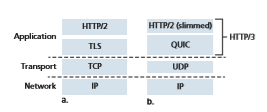
**Figure 3.58**  ♦   (a) traditional secure HTTP protocol stack, and the (b) secure QUIC-based HTTP/3 protocol stack

required to first establish a TCP connection, and then establish a TLS connection over the TCP connection.

• **Streams.** QUIC allows several different application-level “streams” to be mul- tiplexed through a single QUIC connection, and once a QUIC connection is established, new streams can be quickly added. A stream is an abstraction for the reliable, in-order bi-directional delivery of data between two QUIC endpoints. In the context of HTTP/3, there would be a different stream for each object in a Web page. Each connection has a connection ID, and each stream within a connection has a stream ID; both of these IDs are contained in a QUIC packet header (along with other header information). Data from multiple streams may be contained within a single QUIC segment, which is carried over UDP. The Stream Control Transmission Protocol (SCTP) \[RFC 4960, RFC 3286\] is an earlier reliable, mes- sage-oriented protocol that pioneered the notion of multiplexing multiple appli- cation-level “streams” through a single SCTP connection. We’ll see in Chapter 7 that SCTP is used in control plane protocols in 4G/5G cellular wireless networks.

• **Reliable, TCP-friendly congestion-controlled data transfer.** As illustrated in Figure 3.59(b), QUIC provides reliable data transfer to each QUIC stream _separately_. Figure 3.59(a) shows the case of HTTP/1.1 sending multiple HTTP requests, all over a single TCP connection. Since TCP provides reliable, in-order byte delivery, this means that the multiple HTTP requests must be delivered in- order at the destination HTTP server. Thus, if bytes from one HTTP request are lost, the remaining HTTP requests can not be delivered until those lost bytes are retransmitted and correctly received by TCP at the HTTP server—the so-called HOL blocking problem that we encountered earlier in Section 2.2.5. Since QUIC provides a reliable in-order delivery on a _per-stream_ basis, a lost UDP segment only impacts those streams whose data was carried in that segment; HTTP mes- sages in other streams can continue to be received and delivered to the applica- tion. QUIC provides reliable data transfer using acknowledgment mechanisms similar to TCP’s, as specified in \[RFC 5681\].

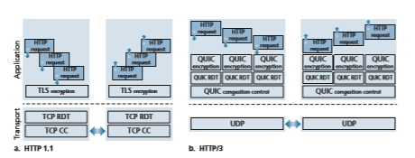
**Figure 3.59** ♦ (a) HTTP/1.1: a single-connection client and server using application-level TLS encryption over TCP’s reliable data transfer (RDT) and congestion control (CC) (b) HTTP/3: a multi-stream client and server using QUIC’s encryption, reliable data transfer and congestion control over UDP’s unreliable datagram

QUIC’s congestion control is based on TCP NewReno \[RFC 6582\], a slight modification to the TCP Reno protocol that we studied in Section 3.7.1. QUIC’s Draft specification \[QUIC-recovery 2020\] notes “Readers familiar with TCP’s loss detection and congestion control will find algorithms here that parallel well- known TCP ones.” Since we’ve carefully studied TCP’s congestion control in Section 3.7.1, we’d be right at home reading the details of QUIC’s draft specifica- tion of its congestion control algorithm!

In closing, it’s worth highlighting again that QUIC is an _application-layer_ protocol providing reliable, congestion-controlled data transfer between two endpoints. The authors of QUIC [Langley 2017\] stress that this means that changes can be made to QUIC at “application-update timescales,” that is, much faster than TCP or UDP update timescales.

# Summary
We began this chapter by studying the services that a transport-layer protocol can provide to network applications. At one extreme, the transport-layer protocol can be very simple and offer a no-frills service to applications, providing only a multiplexing/ demultiplexing function for communicating processes. The Internet’s UDP protocol serviceis an example of such a no-frills transport-layer protocol. At the other extreme, a transport-layer protocol can provide a variety of guarantees to applications, such as reliable delivery of data, delay guarantees, and bandwidth guarantees. Nevertheless, the services that a transport protocol can provide are often constrained by the service model of the underlying network-layer protocol. If the network-layer protocol cannot provide delay or bandwidth guarantees to transport-layer segments, then the transport- layer protocol cannot provide delay or bandwidth guarantees for the messages sent between processes.

We learned in Section 3.4 that a transport-layer protocol can provide reliable data transfer even if the underlying network layer is unreliable. We saw that provid- ing reliable data transfer has many subtle points, but that the task can be accom- plished by carefully combining acknowledgments, timers, retransmissions, and sequence numbers.

Although we covered reliable data transfer in this chapter, we should keep in mind that reliable data transfer can be provided by link-, network-, transport-, or application-layer protocols. Any of the upper four layers of the protocol stack can implement acknowledgments, timers, retransmissions, and sequence numbers and provide reliable data transfer to the layer above. In fact, over the years, engineers and computer scientists have independently designed and implemented link-, network-, transport-, and application-layer protocols that provide reliable data transfer (although many of these protocols have quietly disappeared).

In Section 3.5, we took a close look at TCP, the Internet’s connection-oriented and reliable transport-layer protocol. We learned that TCP is complex, involving con- nection management, flow control, and round-trip time estimation, as well as reli- able data transfer. In fact, TCP is actually more complex than our description—we intentionally did not discuss a variety of TCP patches, fixes, and improvements that are widely implemented in various versions of TCP. All of this complexity, however, is hidden from the network application. If a client on one host wants to send data reliably to a server on another host, it simply opens a TCP socket to the server and pumps data into that socket. The client-server application is blissfully unaware of TCP’s complexity.

In Section 3.6, we examined congestion control from a broad perspective, and in Section 3.7, we showed how TCP implements congestion control. We learned that congestion control is imperative for the well-being of the network. Without conges- tion control, a network can easily become gridlocked, with little or no data being transported end-to-end. In Section 3.7, we learned that classic TCP implements an end-to-end congestion-control mechanism that additively increases its transmission rate when the TCP connection’s path is judged to be congestion-free, and multiplica- tively decreases its transmission rate when loss occurs. This mechanism also strives to give each TCP connection passing through a congested link an equal share of the link bandwidth. We also studied several newer variations of TCP congestion controlthat try to determine TCP’s sending rate rate more quickly than classic TCP, use a delay-based approach or explicit congestion notification from the network (rather than a loss-based approach) to determine TCP’s sending rate. We also examined in some depth the impact of TCP connection establishment and slow start on latency. We observed that in many important scenarios, connection establishment and slow start significantly contribute to end-to-end delay. We emphasize once more that while TCP congestion control has evolved over the years, it remains an area of intensive research and will likely continue to evolve in the upcoming years. To wrap up this chapter, in Section 3.8, we studied recent developments in implement- ing many of the transport layer’s functions—reliable data transfer, congestion con- trol, connection establishment, and more—in the application layer using the QUIC protocol.

In Chapter 1, we said that a computer network can be partitioned into the “network edge” and the “network core.” The network edge covers everything that happens in the end systems. Having now covered the application layer and the t ransport layer, our discussion of the network edge is complete. It is time to explore the network core! This journey begins in the next two chapters, where we’ll study the network layer, and continues into Chapter 6, where we’ll study the link layer.

**Homework Problems and Questions**
*********************************
**Chapter 3 Review Questions** 
SECTIONS 3.1–3.3 
R1. Suppose the network layer provides the following service. The network layer in the source host accepts a segment of maximum size 1,200 bytes and a destination host address from the transport layer. The network layer then guarantees to deliver the segment to the transport layer at the destination host. Suppose many network application processes can be running at the destination host.

a. Design the simplest possible transport-layer protocol that will get applica- tion data to the desired process at the destination host. Assume the operat- ing system in the destination host has assigned a 4-byte port number to each running application process.

b. Modify this protocol so that it provides a “return address” to the destina- tion process.

c. In your protocols, does the transport layer “have to do anything” in the core of the computer network?
R2. Consider a planet where everyone belongs to a family of six, every family lives in its own house, each house has a unique address, and each person in a given house has a unique name. Suppose this planet has a mail service that delivers letters from source house to destination house. The mail service requires that (1) the letter be in an envelope, and that (2) the address of the destination house (and nothing more) be clearly written on the envelope. Sup- pose each family has a delegate family member who collects and distributes letters for the other family members. The letters do not necessarily provide any indication of the recipients of the letters.

a. Using the solution to Problem R1 above as inspiration, describe a protocol that the delegates can use to deliver letters from a sending family member to a receiving family member.

b. In your protocol, does the mail service ever have to open the envelope and examine the letter in order to provide its service?

R3. How is a UDP socket fully identified? What about a TCP socket? What is the difference between the full identification of both sockets?

R4. Describe why an application developer might choose to run an application over UDP rather than TCP.

R5. Why is it that voice and video traffic is often sent over TCP rather than UDP in today’s Internet? (_Hint_: The answer we are looking for has nothing to do with TCP’s congestion-control mechanism.)

R6. Is it possible for an application to enjoy reliable data transfer even when the application runs over UDP? If so, how?

R7. Suppose a process in Host C has a UDP socket with port number 6789. Suppose both Host A and Host B each send a UDP segment to Host C with destination port number 6789. Will both of these segments be directed to the same socket at Host C? If so, how will the process at Host C know that these two segments originated from two different hosts?

R8. Suppose that a Web server runs in Host C on port 80. Suppose this Web server uses persistent connections, and is currently receiving requests from two different Hosts, A and B. Are all of the requests being sent through the same socket at Host C? If they are being passed through different sockets, do both of the sockets have port 80? Discuss and explain.

SECTION 3.4 
R9. In our rdt protocols, why did we need to introduce sequence numbers?

R10. In our rdt protocols, why did we need to introduce timers?
 R11. Suppose that the roundtrip delay between sender and receiver is constant and known to the sender. Would a timer still be necessary in protocol rdt 3.0, assuming that packets can be lost? Explain.

R12. Visit the Go-Back-N interactive animation at the Companion Website.

a. Have the source send five packets, and then pause the animation before any of the five packets reach the destination. Then kill the first packet and resume the animation. Describe what happens.

b. Repeat the experiment, but now let the first packet reach the destination and kill the first acknowledgment. Describe again what happens.

c. Finally, try sending six packets. What happens?

R13. Repeat R12, but now with the Selective Repeat interactive animation. How are Selective Repeat and Go-Back-N different?

SECTION 3.5 
R14. True or false?

a. Host A is sending Host B a large file over a TCP connection. Assume Host B has no data to send Host A. Host B will not send acknowledgments to Host A because Host B cannot piggyback the acknowledgments on data.

b. The size of the TCP rwnd never changes throughout the duration of the connection.

c. Suppose Host A is sending Host B a large file over a TCP connection. The number of unacknowledged bytes that A sends cannot exceed the size of the receive buffer.

d. Suppose Host A is sending a large file to Host B over a TCP connection. If the sequence number for a segment of this connection is _m_, then the sequence number for the subsequent segment will necessarily be _m_ \+ 1.

e. The TCP segment has a field in its header for rwnd.

f. Suppose that the last SampleRTT in a TCP connection is equal to 1 sec. The current value of TimeoutInterval for the connection will neces- sarily be Ú 1 sec.

g. Suppose Host A sends one segment with sequence number 38 and 4 bytes of data over a TCP connection to Host B. In this same segment, the acknowledgment number is necessarily 42.

R15. Suppose Host A sends two TCP segments back to back to Host B over a TCP connection. The first segment has sequence number 90; the second has sequence number 110.

a. How much data is in the first segment?

b. Suppose that the first segment is lost but the second segment arrives at B. In the acknowledgment that Host B sends to Host A, what will be the acknowledgment number?R16. Consider the Telnet example discussed in Section 3.5. A few seconds after the user types the letter ‘C,’ the user types the letter ‘R.’ After typing the let- ter ‘R,’ how many segments are sent, and what is put in the sequence number and acknowledgment fields of the segments?

SECTION 3.7 

R17. Consider two hosts, A and B, transmitting a large file to a server C, over a bottleneck link with rate _R_. To transfer the file, the hosts use TCP with the same parameters (including MSS and RTT) and start their transmis- sions at the same time. Host A uses a single TCP connection for the entire file, while Host B uses 9 simultaneous TCP connections, each for a portion (i.e., a chunk) of the file. What is the overall transmission rate achieved by each host at the beginning of the file transfer? Is this situation fair?

R18. True or false? Consider congestion control in TCP. When the timer expires at the sender, the value of ssthresh is set to one half of its previous value.

R19. According to the discussion of TCP splitting in the sidebar in Section 3.7, the response time with TCP splitting is approximately 4 \* RTTFE + RTTBE + processing time, as opposed to 4 \* RTT + processing time when a direct connection is used. Assume that RTT BE is 0.5 \* RTT. For what values of RTTFE does TCP splitting have a shorter delay than a direct connection?

**Problems**
**************************
P1. Suppose Client A requests a web page from Server S through HTTP and its socket is associated with port 33000.

a. What are the source and destination ports for the segments sent from A to S?

b. What are the source and destination ports for the segments sent from S to A?

c. Can Client A contact to Server S using UDP as the transport protocol?

d. Can Client A request multiple resources in a single TCP connection?

P2. Consider Figure 3.5.

a. Let us assume the following change: at B we want to access an FTP server from host A. What port number should be used to replace port 80?

b. Would there be an error if the right process of C used port number 8080?

c. What are the source and destination network and port values in the segments flowing from the server back to the clients’ processes?

P3. UDP and TCP use 1s complement for their checksums. Suppose you have the following three 16 bit words: 0101001101100110; 0111010010110100; 0000110111000001. What is the 1s complement of the sum of these words? Show all work. Why is it that UDP offers a checksum? With the 1’s comple- ment scheme, how does the receiver detect errors? Describe how a single bit flip can be detected.P4. Assume that a host receives a UDP segment with 01011101 11110010 (we separated the values of each byte with a space for clarity) as the checksum. The host adds the 16-bit words over all necessary fields _excluding the check- sum_ and obtains the value 00110010 00001101. Is the segment considered correctly received or not? What does the receiver do?

P5. Suppose that the UDP receiver computes the Internet checksum for the received UDP segment and finds that it matches the value carried in the checksum field. Can the receiver be absolutely certain that no bit errors have occurred? Explain.

P6. Consider our motivation for correcting protocol rdt2.1. Show that the receiver, shown in Figure 3.60, when operating with the sender shown in Figure 3.11, can lead the sender and receiver to enter into a deadlock state, where each is waiting for an event that will never occur.

P7. In protocol rdt3.0, the ACK packets flowing from the receiver to the sender do not have sequence numbers (although they do have an ACK field that contains the sequence number of the packet they are acknowledging). Why is it that our ACK packets do not require sequence numbers?
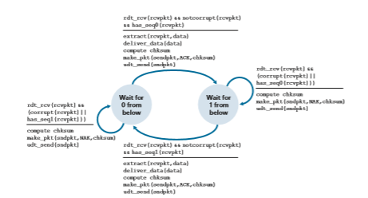
**Figure 3.60**  ♦  An incorrect receiver for protocol rdt 2.1

P8. Draw the FSM for the receiver side of protocol rdt3.0.

P9. Give a trace of the operation of protocol rdt3.0 when data packets and acknowledgment packets are garbled. Your trace should be similar to that used in Figure 3.16.

P10. Consider a channel that can lose packets but has a maximum delay that is known. Modify protocol rdt2.1 to include sender timeout and retransmit. Informally argue why your protocol can communicate correctly over this channel.

P11. Consider the rdt2.2 receiver in Figure 3.14, and the creation of a new packet in the self-transition (i.e., the transition from the state back to itself) in the Wait-for-0-from-below and the Wait-for-1-from-below states: sndpkt=make\_pkt(ACK,1,checksum) and sndpkt=make\_ pkt(ACK,0,checksum). Would the protocol work correctly if this action were removed from the self-transition in the Wait-for-1-from-below state? Justify your answer. What if this event were removed from the self-transition in the Wait-for-0-from-below state? \[_Hint_: In this latter case, consider what would happen if the first sender-to-receiver packet were corrupted.\]

P12. The sender side of rdt3.0 simply ignores (that is, takes no action on) all received packets that are either in error or have the wrong value in the acknum field of an acknowledgment packet. Suppose that in such circum- stances, rdt3.0 were simply to retransmit the current data packet. Would the protocol still work? (_Hint_: Consider what would happen if there were only bit errors; there are no packet losses but premature timeouts can occur. Consider how many times the _n_th packet is sent, in the limit as _n_ approaches infinity.)

P13. Assume Host A is streaming a video from Server B using UDP. Also assume that the network suddenly becomes very congested while Host A is seeing the video. Is there any way to handle this situation with UDP? What about with TCP? Is there any other option?

P14. Consider a stop-and-wait data-transfer protocol that provides error check- ing and retransmissions but uses only negative acknowledgments. Assume that negative acknowledgments are never corrupted. Would such a protocol work over a channel with bit errors? What about over a lossy channel with bit errors?P15. Consider the cross-country example shown in Figure 3.17, with a 10 Gbps link. How big would the window size have to be for the channel utilization to be greater than 98 percent? Suppose that the size of a packet is 1,500 bytes, including header fields and data.

P16. Suppose an application uses rdt 3.0 as its transport layer protocol. As the stop-and-wait protocol has very low channel utilization (shown in the cross- country example), the designers of this application let the receiver keep send- ing back a number (more than two) of alternating ACK 0 and ACK 1 even if the corresponding data have not arrived at the receiver. Would this applica- tion design increase the channel utilization? Why? Are there any potential problems with this approach? Explain.

P17. Consider two network entities, A and B, which are connected by a perfect bi-directional channel (i.e., any message sent will be received correctly; the channel will not corrupt, lose, or re-order packets). A and B are to deliver data messages to each other in an alternating manner: First, A must deliver a message to B, then B must deliver a message to A, then A must deliver a message to B and so on. If an entity is in a state where it should not attempt to deliver a message to the other side, and there is an event like rdt\_ send(data) call from above that attempts to pass data down for transmis- sion to the other side, this call from above can simply be ignored with a call to rdt\_unable\_to\_send(data), which informs the higher layer that it is currently not able to send data. \[Note: This simplifying assumption is made so you don’t have to worry about buffering data.\]

Draw a FSM specification for this protocol (one FSM for A, and one FSM for B!). Note that you do not have to worry about a reliability mechanism here; the main point of this question is to create a FSM specification that reflects the synchronized behavior of the two entities. You should use the following events and actions that have the same meaning as protocol rdt1.0 in Figure 3.9: rdt\_send(data), packet = make\_pkt(data), udt\_ send(packet), rdt\_rcv(packet), extract (packet,data), deliver\_data(data). Make sure your protocol reflects the strict alter- nation of sending between A and B. Also, make sure to indicate the initial states for A and B in your FSM descriptions.

P18. In the generic SR protocol that we studied in Section 3.4.4, the sender transmits a message as soon as it is available (if it is in the window) without waiting for an acknowledgment. Suppose now that we want an SR protocol that sends messages two at a time. That is, the sender will send a pair of mes- sages and will send the next pair of messages only when it knows that both messages in the first pair have been received correctly.

Suppose that the channel may lose messages but will not corrupt or reorder messages. Design an error-control protocol for the unidirectional reliabletransfer of messages. Give an FSM description of the sender and receiver. Describe the format of the packets sent between sender and receiver, and vice versa. If you use any procedure calls other than those in Section 3.4 (for example, udt\_send(), start\_timer(), rdt\_rcv(), and so on), clearly state their actions. Give an example (a timeline trace of sender and receiver) showing how your protocol recovers from a lost packet.

P19. Suppose Host A and Host B use a GBN protocol with window size _N_ \= 3 and a long-enough range of sequence numbers. Assume Host A sends six application messages to Host B and that all messages are correctly received, except for the first acknowledgment and the fifth data segment. Draw a timing diagram (similar to Figure 3.22), showing the data segments and the acknowledgments sent along with the corresponding sequence and acknowledge numbers, respectively.

P20. Consider a scenario in which Host A and Host B want to send messages to Host C. Hosts A and C are connected by a channel that can lose and corrupt (but not reorder) messages. Hosts B and C are connected by another channel (independent of the channel connecting A and C) with the same properties. The transport layer at Host C should alternate in delivering messages from A and B to the layer above (that is, it should first deliver the data from a packet from A, then the data from a packet from B, and so on). Design a stop-and- wait-like error-control protocol for reliably transferring packets from A and B to C, with alternating delivery at C as described above. Give FSM descrip- tions of A and C. (_Hint:_ The FSM for B should be essentially the same as for A.) Also, give a description of the packet format(s) used.

P21. Suppose we have two network entities, A and B. B has a supply of data mes- sages that will be sent to A according to the following conventions. When A gets a request from the layer above to get the next data (D) message from B, A must send a request (R) message to B on the A-to-B channel. Only when B receives an R message can it send a data (D) message back to A on the B-to- A channel. A should deliver exactly one copy of each D message to the layer above. R messages can be lost (but not corrupted) in the A-to-B channel; D messages, once sent, are always delivered correctly. The delay along both channels is unknown and variable.

Design (give an FSM description of) a protocol that incorporates the appro- priate mechanisms to compensate for the loss-prone A-to-B channel and implements message passing to the layer above at entity A, as discussed above. Use only those mechanisms that are absolutely necessary.P22. Consider the GBN protocol with a sender window size of 4 and a sequence number range of 1,024. Suppose that at time _t_, the next in-order packet that the receiver is expecting has a sequence number of _k_. Assume that the medium does not reorder messages. Answer the following questions:

a. What are the possible sets of sequence numbers inside the sender’s window at time _t_? Justify your answer.

b. What are all possible values of the ACK field in all possible messages currently propagating back to the sender at time _t_? Justify your answer.

P23. Give one example where buffering out-of-order segments would significantly improve the throughput of a GBN protocol.

P24. Consider a scenario where the three hosts A, B, and C are connected as a ring: A to B, B to C, and C to A. Assume that A and C run protocol rdt3.0, whereas B simply relays all messages received from A to C.

a. Does this arrangement enable reliable delivery of messages from A to C?

b. Can B tell if a certain message has been correctly received by A?

P25. We have said that an application may choose UDP for a transport protocol because UDP offers finer application control (than TCP) of what data is sent in a segment and when.

Why does an application have more control of what data is sent in a segment?

Why does an application have more control on when the segment is sent?

P26. Consider transferring an enormous file of _L_ bytes from Host A to Host B. Assume an MSS of 536 bytes.

a. What is the maximum value of _L_ such that TCP sequence numbers are not exhausted? Recall that the TCP sequence number field has 4 bytes.

b. For the _L_ you obtain in (a), find how long it takes to transmit the file. Assume that a total of 66 bytes of transport, network, and data-link header are added to each segment before the resulting packet is sent out over a 155 Mbps link. Ignore flow control and congestion control so A can pump out the segments back to back and continuously.

P27. Host A and B are communicating over a TCP connection following RFC 5681. Host B has already received from A all bytes up through byte 96. Suppose Host A then sends two segments to Host B back-to-back. The firstand the second segments contain 40 and 80 bytes of data, respectively. In the first segment, the sequence number is 97, the source port number is 302, and the destination port number is 80.

Host B sends an acknowledgment whenever it receives a segment from Host A.

a. In the second segment sent from Host A to B, what are the sequence num- ber, source port number, and destination port number?

b. If the first segment arrives before the second segment, in the acknowledg- ment of the first arriving segment, what is the acknowledgment number, the source port number, and the destination port number?

c. If the second segment arrives before the first segment, in the acknowledg- ment of the first arriving segment, what is the acknowledgment number?

d. Suppose the two segments sent by A arrive in order at B. The first acknow- ledgment arrives after the first timeout interval. What is the sequence number of the next segment that A will transmit?

P28. Host A and B are directly connected with a 10 Gbps link. There is one TCP connection between the two hosts, and Host A is sending to Host B an enor- mous file over this connection. Host A can send its application data into its TCP socket at a rate as high as 1 Gbps, but Host B can read out of its TCP receive buffer at a maximum rate of 600 Mbps. Describe the effect of TCP flow control.

P29. SYN cookies were discussed in Section 3.5.6.

a. Why is it necessary for the server to use a special initial sequence number in the SYNACK?

b. Suppose an attacker knows that a target host uses SYN cookies. Can the attacker create half-open or fully open connections by simply sending an ACK packet to the target? Why or why not?

c. Suppose an attacker collects a large amount of initial sequence numbers sent by the server. Can the attacker cause the server to create many fully open connections by sending ACKs with those initial sequence numbers? Why?

P30. Consider the network shown in Scenario 2 in Section 3.6.1. Suppose both sending hosts A and B have some fixed timeout values.

a. Argue that increasing the size of the finite buffer of the router might pos- sibly decrease the throughput (lout).

b. Now suppose both hosts dynamically adjust their timeout values (like what TCP does) based on the buffering delay at the router. Would increas- ing the buffer size help to increase the throughput? Why?P31. Suppose that the five measured SampleRTT values (see Section 3.5.3) are 112 ms, 140 ms, 110 ms, 90 ms, and 90 ms. Compute the EstimatedRTT after each of these SampleRTT values is obtained, using a value of α = 0.125 and assuming that the value of EstimatedRTT was 120 ms just before the first of these five samples were obtained.

Compute also the DevRTT after each sample is obtained, assuming a value of b = 0.25 and assuming the value of DevRTT was 6 ms just before the first of these five samples was obtained.

Finally, compute the TCP TimeoutInterval after each of these samples is obtained.

P32. Consider the TCP procedure for estimating RTT. Suppose that α = 0.1. Let SampleRTT1 be the most recent sample RTT, let SampleRTT2 be the next most recent sample RTT, and so on.

a. For a given TCP connection, suppose four acknowledgments have been returned with corresponding sample RTTs: SampleRTT4, SampleRTT3, SampleRTT2, and SampleRTT1. Express EstimatedRTT in terms of the four sample RTTs.

b. Generalize your formula for _n_ sample RTTs.

c. For the formula in part (b) let _n_ approach infinity. Comment on why this averaging procedure is called an exponential moving average.

P33. In Section 3.5.3, we discussed TCP’s estimation of RTT. Why do you think TCP avoids measuring the SampleRTT for retransmitted segments?

P34. What is the relationship between the variable SendBase in Section 3.5.4 and the variable LastByteRcvd in Section 3.5.5?

P35. What is the relationship between the variable LastByteRcvd in Section 3.5.5 and the variable y in Section 3.5.4?

P36. In Section 3.5.4, we saw that TCP waits until it has received three dupli- cate ACKs before performing a fast retransmit. Why do you think the TCP designers chose not to perform a fast retransmit after the first duplicate ACK for a segment is received?

P37. Compare GBN, SR, and TCP (no delayed ACK). Assume that the timeout values for all three protocols are sufficiently long such that five consecutive data segments and their corresponding ACKs can be received (if not lost in the channel) by the receiving host (Host B) and the sending host (Host A) respectively. Suppose Host A sends five data segments to Host B, and the second segment (sent from A) is lost. In the end, all five data segments have been correctly received by Host B.

a. How many segments has Host A sent in total and how many ACKs has Host B sent in total? What are their sequence numbers? Answer this question for all three protocols.
b. If the timeout values for all three protocol are much longer than 5 RTT, then which protocol successfully delivers all five data segments in short- est time interval?

P38. In our description of TCP in Figure 3.53, the value of the threshold, ssthresh, is set as ssthresh=cwnd/2 in several places and ssthresh value is referred to as being set to half the window size when a loss event occurred. Must the rate at which the sender is sending when the loss event occurred be approximately equal to cwnd segments per RTT? Explain your answer. If your answer is no, can you suggest a different manner in which ssthresh should be set?

P39. Consider Figure 3.46(b). If l′in increases beyond _R_/2, can lout increase beyond _R_/3? Explain. Now consider Figure 3.46(c). If l′in increases beyond _R_/2, can lout increase beyond R/4 under the assumption that a packet will be forwarded twice on average from the router to the receiver? Explain.

P40. Consider Figure 3.61. Assuming TCP Reno is the protocol experiencing the behavior shown above, answer the following questions. In all cases, you should provide a short discussion justifying your answer.

a. Identify the intervals of time when TCP slow start is operating.

b. Identify the intervals of time when TCP congestion avoidance is operating.

c. After the 16th transmission round, is segment loss detected by a triple duplicate ACK or by a timeout?

d. After the 22nd transmission round, is segment loss detected by a triple duplicate ACK or by a timeout?
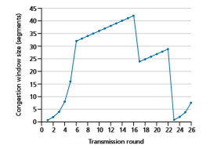

**Figure 3.61**  ♦  TCP window size as a function of time

e. What is the initial value of ssthresh at the first transmission round?

f. What is the value of ssthresh at the 22nd transmission round?

g. During what transmission round is the 70th segment sent?

h. Assuming a packet loss is detected after the 26th round by the receipt of a triple duplicate ACK, what will be the values of the congestion window size and of ssthresh?

i. Suppose TCP Tahoe is used (instead of TCP Reno), and assume that triple duplicate ACKs are received at the 10th round. What are the ssthresh and the congestion window size at the 11th round?

j. Again, suppose TCP Tahoe is used, and there is a timeout event at the 22nd round. How many packets have been sent out from the 17th round till the 22nd round, inclusive?

P41. Refer to Figure 3.55, which illustrates the convergence of TCP’s AIMD algorithm. Suppose that instead of a multiplicative decrease, TCP decreased the window size by a constant amount. Would the resulting AIAD algorithm converge to an equal share algorithm? Justify your answer using a diagram similar to Figure 3.55.

P42. In Section 3.5.4, we discussed the doubling of the timeout interval after a timeout event. This mechanism is a form of congestion control. Why does TCP need a window-based congestion-control mechanism (as studied in Section 3.7) in addition to this doubling-timeout-interval mechanism?

P43. Host A is sending an enormous file to Host B over a TCP connection. Over this connection there is never any packet loss and the timers never expire. Denote the transmission rate of the link connecting Host A to the Internet by _R_ bps. Suppose that the process in Host A is capable of sending data into its TCP socket at a rate _S_ bps, where _S_ \= 10 # _R_. Further suppose that the TCP receive buffer is large enough to hold the entire file, and the send buffer can hold only one percent of the file. What would prevent the process in Host A from continuously passing data to its TCP socket at rate _S_ bps? TCP flow control? TCP congestion control? Or something else? Elaborate.

P44. Consider sending a large file from a host to another over a TCP connection that has no loss.

a. Suppose TCP uses AIMD for its congestion control without slow start. Assuming cwnd increases by 1 MSS every time a batch of ACKs is received and assuming approximately constant round-trip times, how long does it take for cwnd increase from 6 MSS to 12 MSS (assuming no loss events)?

b. What is the average throughput (in terms of MSS and RTT) for this con- nection up through time = 6 RTT?
P45. Consider Figure 3.54. Suppose that at _t_3, the sending rate at which conges- tion loss next occurs drops to 0.75\*_W_max (unbeknownst to the TCP senders, of course). Show the evolution of both TCP Reno and TCP CUBIC for two more rounds each _(Hint: note that the times at which TCP Reno and TCP CUBIC react to congestion loss may not be the same anymore)._

P46. Consider Figure 3.54 again. Suppose that at _t_3, the sending rate at which conges- tion loss next occurs increases to 1.5\*_W_max_._ Show the evolution of both TCP Reno and TCP CUBIC for at two more rounds each _(Hint: see the hint in P45)._

P47. Recall the macroscopic description of TCP throughput. In the period of time from when the connection’s rate varies from _W_/(2 ? RTT) to _W/RTT_, only one packet is lost (at the very end of the period).

a. Show that the loss rate (fraction of packets lost) is equal to

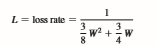
b. Use the result above to show that if a connection has loss rate _L_, then its average rate is approximately given by

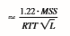
P48. Consider that only a single TCP (Reno) connection uses one 54 Mbps wire- less link which does not buffer any data. Suppose that this link is the only congested link between the sending and receiving hosts. Assume that the TCP sender has a huge file to send to the receiver and the receiver’s receive buffer is much larger than the congestion window.

We also make the following assumptions: each TCP segment size is 536 bytes; the two-way propagation delay of this connection is 6 msec; and this TCP connection is always in congestion avoidance phase, that is, ignore slow start.

a. What is the maximum window size (in segments) that this TCP connec- tion can achieve?

b. What is the average window size (in segments) and average throughput (in bps) of this TCP connection?

c. How long would it take for this TCP connection to reach its maximum window again after recovering from a packet loss?

P49. Consider the scenario described in the previous problem. Suppose that the 10 Mbps link can buffer a finite number of segments. Argue that in order for the link to always be busy sending data, we would like to choose a buffer size that is at least the product of the link speed _C_ and the two-way propagation delay between the sender and the receiver.

P50. Repeat Problem 48, but replacing the 54 Mbps link with a 100 Gbps link and an RTT of 60 ms. Note that in your answer to part c, you will realize that it takes a very long time for the congestion window size to reach its maximum window size after recovering from a packet loss.

Can you consider solutions for this?

P51. Let _T_ (measured by RTT) denote the time interval that a TCP connection takes to increase its congestion window size from _W/2_ to _W_, where _W_ is the maximum congestion window size. Argue that T is a function of TCP’s average throughput.

P52. Consider a simplified TCP’s AIMD algorithm where the congestion window size is measured in number of segments, not in bytes. In additive increase, the congestion window size increases by one segment in each RTT. In multipli- cative decrease, the congestion window size decreases by half (if the result is not an integer, round down to the nearest integer). Suppose that two TCP connections, C1 and C2, share a single congested link of speed 30 segments per second. Assume that both C1 and C2 are in the congestion avoidance phase. Connection C1’s RTT is 50 msec and connection C2’s RTT is 100 msec. Assume that when the data rate in the link exceeds the link’s speed, all TCP connections experience data segment loss.

a. If both C1 and C2 at time t0 have a congestion window of 10 segments, what are their congestion window sizes after 1000 msec?

b. In the long run, will these two connections get the same share of the band- width of the congested link? Explain.

P53. Consider the network described in the previous problem. Now suppose that the two TCP connections, C1 and C2, have the same RTT of 100 msec. Suppose that at time t0, C1’s congestion window size is 15 segments but C2’s congestion window size is 10 segments.

a. What are their congestion window sizes after 2200 msec?

b. In the long run, will these two connections get about the same share of the bandwidth of the congested link?

c. We say that two connections are synchronized, if both connections reach their maximum window sizes at the same time and reach their minimum window sizes at the same time. In the long run, will these two connec- tions get synchronized eventually? If so, what are their maximum window sizes?

d. Will this synchronization help to improve the utilization of the shared link? Why? Sketch some idea to break this synchronization.

P54. Consider a modification to TCP’s congestion control algorithm. Instead of additive increase, we can use multiplicative increase. A TCP sender increases its window size by a small positive constant _a_ (0 6 _a_ 6 1) whenever it receives a valid ACK. Find the functional relationship between loss rate L
and maximum congestion window W. Argue that for this modified TCP, regardless of TCP’s average throughput, a TCP connection always spends the same amount of time to increase its congestion window size from _W/2_ to _W_.

P55. In our discussion of TCP futures in Section 3.7, we noted that to achieve a throughput of 10 Gbps, TCP could only tolerate a segment loss probability of 2 # 10-10 (or equivalently, one loss event for every 5,000,000,000 segments). Show the derivation for the values of 2 # 10-10 (1 out of 5,000,000) for the RTT and MSS values given in Section 3.7. If TCP needed to support a 100 Gbps connection, what would the tolerable loss be?

P56. In our discussion of TCP congestion control in Section 3.7, we implicitly assumed that the TCP sender always had data to send. Consider now the case that the TCP sender sends a large amount of data and then goes idle (since it has no more data to send) at _t_1\. TCP remains idle for a relatively long period of time and then wants to send more data at _t_2\. What are the advantages and disadvantages of having TCP use the cwnd and ssthresh values from _t_1 when starting to send data at _t_2? What alternative would you recommend? Why?

P57. In this problem, we investigate whether either UDP or TCP provides a degree of end-point authentication.

a. Consider a server that receives a request within a UDP packet and responds to that request within a UDP packet (for example, as done by a DNS server). If a client with IP address X spoofs its address with address Y, where will the server send its response?

b. Suppose a server receives a SYN with IP source address Y, and after responding with a SYNACK, receives an ACK with IP source address Y with the correct acknowledgment number. Assuming the server chooses a random initial sequence number and there is no “man-in-the-middle,” can the server be certain that the client is indeed at Y (and not at some other address X that is spoofing Y)?

P58. In this problem, we consider the delay introduced by the TCP slow-start phase. Consider a client and a Web server directly connected by one link of rate _R_. Suppose the client wants to retrieve an object whose size is exactly equal to 15 _S_, where _S_ is the maximum segment size (MSS). Denote the round-trip time between client and server as RTT (assumed to be constant). Ignoring protocol headers, determine the time to retrieve the object (includ- ing TCP connection establishment) when

a. 4 _S_/_R_ 7 _S_/_R_ \+ _RTT_ 7 2_S_/_R_

b. _S_/_R_ \+ _RTT_ 7 4 _S_/_R_

c. _S_/_R_ 7 _RTT_ .

**Programming Assignments**
**************************
**Implementing a Reliable Transport Protocol** In this laboratory programming assignment, you will be writing the sending and receiving transport-level code for implementing a simple reliable data transfer pro- tocol. There are two versions of this lab, the alternating-bit-protocol version and the GBN version. This lab should be fun—your implementation will differ very little from what would be required in a real-world situation.

Since you probably don’t have standalone machines (with an OS that you can modify), your code will have to execute in a simulated hardware/software environ- ment. However, the programming interface provided to your routines—the code that would call your entities from above and from below—is very close to what is done in an actual UNIX environment. (Indeed, the software interfaces described in this programming assignment are much more realistic than the infinite loop senders and receivers that many texts describe.) Stopping and starting timers are also simulated, and timer interrupts will cause your timer handling routine to be activated.

The full lab assignment, as well as code you will need to compile with your own code, are available at this book’s Web site: www.pearsonglobaleditions.com.

**Wireshark Lab: Exploring TCP**
*************************************
In this lab, you’ll use your Web browser to access a file from a Web server. As in earlier Wireshark labs, you’ll use Wireshark to capture the packets arriving at your computer. Unlike earlier labs, you’ll _also_ be able to download a Wireshark-readable packet trace from the Web server from which you downloaded the file. In this server trace, you’ll find the packets that were generated by your own access of the Web server. You’ll ana- lyze the client- and server-side traces to explore aspects of TCP. In particular, you’ll evaluate the performance of the TCP connection between your computer and the Web server. You’ll trace TCP’s window behavior, and infer packet loss, retransmission, flow control and congestion control behavior, and estimated roundtrip time.

As is the case with all Wireshark labs, the full description of this lab is available at this book’s Web site, www.pearsonglobaleditions.com.

**Wireshark Lab: Exploring UDP**
*********************
In this short lab, you’ll do a packet capture and analysis of your favorite application that uses UDP (for example, DNS or a multimedia application such as Skype). As we learned in Section 3.3, UDP is a simple, no-frills transport protocol. In this lab, you’ll investigate the header fields in the UDP segment as well as the checksum calculation.

As is the case with all Wireshark labs, the full description of this lab is available at this book’s Web site, www.pearsonglobaleditions.com.

**AN INTERVIEW WITH...**

Van Jacobson


Van Jacobson works at Google and was previously a Research Fellow at PARC. Prior to that, he was co-founder and Chief Scientist of Packet Design. Before that, he was Chief Scientist at Cisco. Before joining Cisco, he was head of the Network Research Group at Lawrence Berkeley National Laboratory and taught at UC Berkeley and Stanford. Van received the ACM SIGCOMM Award in 2001 for outstanding lifetime contribution to the field of commu- nication networks and the IEEE Kobayashi Award in 2002 for “con- tributing to the understanding of network congestion and developing congestion control mechanisms that enabled the successful scaling of the Internet”. He was elected to the U.S. National Academy of Engineering in 2004.

**Please describe one or two of the most exciting projects you have worked on during your career. What were the biggest challenges?** School teaches us lots of ways to find answers. In every interesting problem I’ve worked on, the challenge has been finding the right question. When Mike Karels and I started look- ing at TCP congestion, we spent months staring at protocol and packet traces asking “Why is it failing?”. One day in Mike’s office, one of us said “The reason I can’t figure out why it fails is because I don’t understand how it ever worked to begin with.” That turned out to be the right question and it forced us to figure out the “ack clocking” that makes TCP work. After that, the rest was easy.


**More generally, where do you see the future of networking and the Internet?**
For most people, the Web is the Internet. Networking geeks smile politely since we know the Web is an application running over the Internet but what if they’re right? The Internet 
is about enabling conversations between pairs of hosts. The Web is about distributed information production and consumption. “Information propagation” is a very general view of communication of which “pairwise conversation” is a tiny subset. We need to move into the larger tent. Networking today deals with broadcast media (radios, PONs, etc.) by pretending it’s a point-to-point wire. That’s massively inefficient. Terabits-per-second of data are being 
exchanged all over the World via thumb drives or smart phones but we don’t know how to treat that as “networking”. ISPs are busily setting up caches and CDNs to scalably distribute 
video and audio. Caching is a necessary part of the solution but there’s no part of today’s networking—from Information, QueuingorTraffic Theory down to the Internet protocol 
Van Jacobson works at Google and was previously a Research 
Fellow at PARC. Prior to that, he was co-founder and Chief Scientist 
of Packet Design. Before that, he was Chief Scientist at Cisco. 
Before joining Cisco, he was head of the Network Research 
Group at Lawrence Berkeley National Laboratory and taught at UC 
Berkeley and Stanford. Van received the ACM SIGCOMM Award 
in 2001 for outstanding lifetime contribution to the field of communication networks and the IEEE Kobayashi Award in 2002 for “contributing to the understanding of network congestion and developing 
congestion control mechanisms that enabled the successful scaling 
of the Internet”. He was elected to the U.S. National Academy of 
Engineering in 2004.
Van Jacobson
AN INTERVIEW WITH...
Courtesy of Van Jacobson
M03_KURO5469_08_GE_C03.indd 331 08/05/2021 13:58
332
specs—that tells us how to engineer and deploy it. I think and hope that over the next few 
years, networking will evolve to embrace the much larger vision of communication that 
underlies the Web.
**What people inspired you professionally?**
When I was in grad school, Richard Feynman visited and gave a colloquium. He talked 
about a piece of Quantum theory that I’d been struggling with all semester and his explanation was so simple and lucid that what had been incomprehensible gibberish to me became 
obvious and inevitable. That ability to see and convey the simplicity that underlies our 
complex world seems to me a rare and wonderful gift.

**What are your recommendations for students who wantcareersincomputer science and networking?**

It’s a wonderful field—computers and networking have probably had more impact on society 
than any invention since the book. Networking is fundamentally about connecting stuff, and 
studying it helps you make intellectual connections: Ant foraging & Bee dances demonstrate 
protocol design better than RFCs, traffic jams or people leaving a packed stadium are the 
essence of congestion, and students finding flights back to school in a post-Thanksgiving 
blizzard are the core of dynamic routing. If you’re interested in lots of stuff and want to 
have an impact, it’s hard to imagine a better field.

