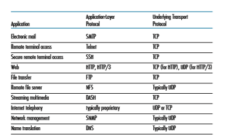

## Connectionless Transport: UDP

In this section, we’ll take a close look at UDP, how it works, and what it does. We encourage you to refer back to Section 2.1, which includes an overview of the UDP service model, and to Section 2.7.1, which discusses socket programming using UDP.

To motivate our discussion about UDP, suppose you were interested in design- ing a no-frills, bare-bones transport protocol. How might you go about doing this? You might first consider using a vacuous transport protocol. In particular, on the sending side, you might consider taking the messages from the application process and passing them directly to the network layer; and on the receiving side, you might consider taking the messages arriving from the network layer and passing them directly to the application process. But as we learned in the previous section, we haveto do a little more than nothing! At the very least, the transport layer has to provide a multiplexing/demultiplexing service in order to pass data between the network layer and the correct application-level process.

UDP, defined in [RFC 768], does just about as little as a transport protocol can do. Aside from the multiplexing/demultiplexing function and some light error checking, it adds nothing to IP. In fact, if the application developer chooses UDP instead of TCP, then the application is almost directly talking with IP. UDP takes messages from the application process, attaches source and destination port number fields for the multi- plexing/demultiplexing service, adds two other small fields, and passes the resulting segment to the network layer. The network layer encapsulates the transport-layer seg- ment into an IP datagram and then makes a best-effort attempt to deliver the segment to the receiving host. If the segment arrives at the receiving host, UDP uses the destina- tion port number to deliver the segment’s data to the correct application process. Note that with UDP there is no handshaking between sending and receiving transport-layer entities before sending a segment. For this reason, UDP is said to be _connectionless._

DNS is an example of an application-layer protocol that typically uses UDP. When the DNS application in a host wants to make a query, it constructs a DNS query message and passes the message to UDP. Without performing any handshaking with the UDP entity running on the destination end system, the host-side UDP adds header fields to the message and passes the resulting segment to the network layer. The net- work layer encapsulates the UDP segment into a datagram and sends the datagram to a name server. The DNS application at the querying host then waits for a reply to its query. If it doesn’t receive a reply (possibly because the underlying network lost the query or the reply), it might try resending the query, try sending the query to another name server, or inform the invoking application that it can’t get a reply.

Now you might be wondering why an application developer would ever choose to build an application over UDP rather than over TCP. Isn’t TCP always preferable, since TCP provides a reliable data transfer service, while UDP does not? The answer is no, as some applications are better suited for UDP for the following reasons:

• _Finer application-level control over what data is sent, and when._ Under UDP, as soon as an application process passes data to UDP, UDP will package the data inside a UDP segment and immediately pass the segment to the network layer. TCP, on the other hand, has a congestion-control mechanism that throttles the transport-layer TCP sender when one or more links between the source and des- tination hosts become excessively congested. TCP will also continue to resend a segment until the receipt of the segment has been acknowledged by the destina- tion, regardless of how long reliable delivery takes. Since real-time applications often require a minimum sending rate, do not want to overly delay segment trans- mission, and can tolerate some data loss, TCP’s service model is not particularly well matched to these applications’ needs. As discussed below, these applications can use UDP and implement, as part of the application, any additional functional- ity that is needed beyond UDP’s no-frills segment-delivery service.• _No connection establishment._ As we’ll discuss later, TCP uses a three-way hand- shake before it starts to transfer data. UDP just blasts away without any formal preliminaries. Thus UDP does not introduce any delay to establish a connection. This is probably the principal reason why DNS runs over UDP rather than TCP— DNS would be much slower if it ran over TCP. HTTP uses TCP rather than UDP, since reliability is critical for Web pages with text. But, as we briefly discussed in Section 2.2, the TCP connection-establishment delay in HTTP is an important contributor to the delays associated with downloading Web documents. Indeed, the QUIC protocol (Quick UDP Internet Connection, [IETF QUIC 2020]), used in Google’s Chrome browser, uses UDP as its underlying transport protocol and implements reliability in an application-layer protocol on top of UDP. We’ll take a closer look at QUIC in Section 3.8.

• _No connection state._ TCP maintains connection state in the end systems. This connection state includes receive and send buffers, congestion-control param- eters, and sequence and acknowledgment number parameters. We will see in Section 3.5 that this state information is needed to implement TCP’s reliable data transfer service and to provide congestion control. UDP, on the other hand, does not maintain connection state and does not track any of these parameters. For this reason, a server devoted to a particular application can typically support many more active clients when the application runs over UDP rather than TCP.

• _Small packet header overhead._ The TCP segment has 20 bytes of header over- head in every segment, whereas UDP has only 8 bytes of overhead.

Figure 3.6 lists popular Internet applications and the transport protocols that they use. As we expect, e-mail, remote terminal access, and file transfer run over TCP—all these applications need the reliable data transfer service of TCP. We learned in Chapter 2 that early versions of HTTP ran over TCP but that more recent versions of HTTP run over UDP, providing their own error control and congestion control (among other services) at the application layer. Nevertheless, many important applications run over UDP rather than TCP. For example, UDP is used to carry network management (SNMP; see Section 5.7) data. UDP is preferred to TCP in this case, since network management applications must often run when the network is in a stressed state—precisely when reliable, congestion-controlled data transfer is diffi- cult to achieve. Also, as we mentioned earlier, DNS runs over UDP, thereby avoiding TCP’s connection-establishment delays.

As shown in Figure 3.6, both UDP and TCP are sometimes used today with multimedia applications, such as Internet phone, real-time video conferencing, and streaming of stored audio and video. We just mention now that all of these applica- tions can tolerate a small amount of packet loss, so that reliable data transfer is not absolutely critical for the application’s success. Furthermore, real-time applications, like Internet phone and video conferencing, react very poorly to TCP’s congestion control. For these reasons, developers of multimedia applications may choose to run their applications over UDP instead of TCP. When packet loss rates are low, and

**Figure 3.6**  ♦   Popular Internet applications and their underlying transport protocol

with some organizations blocking UDP traffic for security reasons (see Chapter 8), TCP becomes an increasingly attractive protocol for streaming media transport.

Although commonly done today, running multimedia applications over UDP needs to be done with care. As we mentioned above, UDP has no congestion control. But congestion control is needed to prevent the network from entering a congested state in which very little useful work is done. If everyone were to start streaming high-bit-rate video without using any congestion control, there would be so much packet overflow at routers that very few UDP packets would successfully traverse the source-to-destination path. Moreover, the high loss rates induced by the uncontrolled UDP senders would cause the TCP senders (which, as we’ll see, _do_ decrease their sending rates in the face of congestion) to dramatically decrease their rates. Thus, the lack of congestion control in UDP can result in high loss rates between a UDP sender and receiver, and the crowding out of TCP sessions. Many researchers have proposed new mechanisms to force all sources, including UDP sources, to perform adaptive congestion control [Mahdavi 1997; Floyd 2000; Kohler 2006: RFC 4340].

Before discussing the UDP segment structure, we mention that it _is_ possible for an application to have reliable data transfer when using UDP. This can be done if reliability is built into the application itself (for example, by adding acknowl- edgment and retransmission mechanisms, such as those we’ll study in the next section). We mentioned earlier that the QUIC protocol implements reliability in an application-layer protocol on top of UDP. But this is a nontrivial task that would keep an application developer busy debugging for a long time. Neverthe- less, building reliability directly into the application allows the application to “have sits cake and eat it too.” That is, application processes can communicate reliably without being subjected to the transmission-rate constraints imposed by TCP’s congestion-control mechanism.

### UDP Segment Structure
 The UDP segment structure, shown in Figure 3.7, is defined in RFC 768. The applica- tion data occupies the data field of the UDP segment. For example, for DNS, the data field contains either a query message or a response message. For a streaming audio application, audio samples fill the data field. The UDP header has only four fields, each consisting of two bytes. As discussed in the previous section, the port numbers allow the destination host to pass the application data to the correct process run- ning on the destination end system (that is, to perform the demultiplexing function). The length field specifies the number of bytes in the UDP segment (header plus data). An explicit length value is needed since the size of the data field may differ from one UDP segment to the next. The checksum is used by the receiving host to check whether errors have been introduced into the segment. In truth, the check- sum is also calculated over a few of the fields in the IP header in addition to the UDP segment. But we ignore this detail in order to see the forest through the trees. We’ll discuss the checksum calculation below. Basic principles of error detection are described in Section 6.2. The length field specifies the length of the UDP segment, including the header, in bytes.

### UDP Checksum
 The UDP checksum provides for error detection. That is, the checksum is used to determine whether bits within the UDP segment have been altered (for example, by noise in the links or while stored in a router) as it moved from source to destination.

**Figure 3.7**  ♦  UDP segment structure

UDP at the sender side performs the 1s complement of the sum of all the 16-bit words in the segment, with any overflow encountered during the sum being wrapped around. This result is put in the checksum field of the UDP segment. Here we give a simple example of the checksum calculation. You can find details about efficient implementation of the calculation in RFC 1071 and performance over real data in \[Stone 1998; Stone 2000\]. As an example, suppose that we have the following three 16-bit words:

0110011001100000 
0101010101010101 
1000111100001100

The sum of first two of these 16-bit words is

0110011001100000 
0101010101010101 
1011101110110101

Adding the third word to the above sum gives

1011101110110101 
1000111100001100 
0100101011000010

Note that this last addition had overflow, which was wrapped around. The 1s complement is obtained by converting all the 0s to 1s and converting all the 1s to 0s. Thus, the 1s complement of the sum 0100101011000010 is 1011010100111101, which becomes the checksum. At the receiver, all four 16-bit words are added, including the checksum. If no errors are introduced into the packet, then clearly the sum at the receiver will be 1111111111111111. If one of the bits is a 0, then we know that errors have been introduced into the packet.

You may wonder why UDP provides a checksum in the first place, as many link-layer protocols (including the popular Ethernet protocol) also provide error checking. The reason is that there is no guarantee that all the links between source and destination provide error checking; that is, one of the links may use a link-layer protocol that does not provide error checking. Furthermore, even if segments are correctly transferred across a link, it’s possible that bit errors could be introduced when a segment is stored in a router’s memory. Given that neither link-by-link reli- ability nor in-memory error detection is guaranteed, UDP must provide error detec- tion at the transport layer, _on an end-end basis_, if the end-end data transfer service is to provide error detection. This is an example of the celebrated **end-end principle** in system design [Saltzer 1984], which states that since certain functionality (error detection, in this case) must be implemented on an end-end basis: “functions placedat the lower levels may be redundant or of little value when compared to the cost of providing them at the higher level.”

Because IP is supposed to run over just about any layer-2 protocol, it is useful for the transport layer to provide error checking as a safety measure. Although UDP provides error checking, it does not do anything to recover from an error. Some implementations of UDP simply discard the damaged segment; others pass the dam- aged segment to the application with a warning.

That wraps up our discussion of UDP. We will soon see that TCP offers reli- able data transfer to its applications as well as other services that UDP doesn’t offer. Naturally, TCP is also more complex than UDP. Before discussing TCP, however, it will be useful to step back and first discuss the underlying principles of reliable data transfer.
