## Principles of Reliable Data Transfer

In this section, we consider the problem of reliable data transfer in a general context. This is appropriate since the problem of implementing reliable data transfer occurs not only at the transport layer, but also at the link layer and the application layer as well. The general problem is thus of central importance to networking. Indeed, if one had to identify a “top-ten” list of fundamentally important problems in all of networking, this would be a candidate to lead the list. In the next section, we’ll examine TCP and show, in particular, that TCP exploits many of the principles that we are about to describe.

Figure 3.8 illustrates the framework for our study of reliable data transfer. The service abstraction provided to the upper-layer entities is that of a reliable channel through which data can be transferred. With a reliable channel, no transferred data bits are corrupted (flipped from 0 to 1, or vice versa) or lost, and all are delivered in the order in which they were sent. This is precisely the service model offered by TCP to the Internet applications that invoke it.

It is the responsibility of a **reliable data transfer protocol** to implement this service abstraction. This task is made difficult by the fact that the layer _below_ the reliable data transfer protocol may be unreliable. For example, TCP is a reliable data transfer protocol that is implemented on top of an unreliable (IP) end-to-end network layer. More generally, the layer beneath the two reliably communicating end points might consist of a single physical link (as in the case of a link-level data transfer protocol) or a global internetwork (as in the case of a transport-level protocol). For our purposes, however, we can view this lower layer simply as an unreliable point- to-point channel.

In this section, we will incrementally develop the sender and receiver sides of a reliable data transfer protocol, considering increasingly complex models of the underlying channel. For example, we’ll consider what protocol mechanisms are
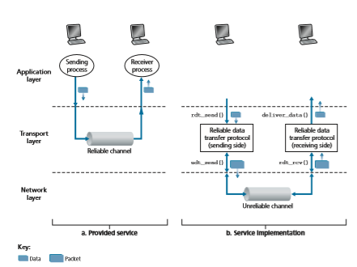
**Figure 3.8**  ♦   Reliable data transfer: Service model and service implementation

needed when the underlying channel can corrupt bits or lose entire packets. One assumption we’ll adopt throughout our discussion here is that packets will be deliv- ered in the order in which they were sent, with some packets possibly being lost; that is, the underlying channel will not reorder packets. Figure 3.8(b) illustrates the interfaces for our data transfer protocol. The sending side of the data transfer proto- col will be invoked from above by a call to rdt\_send(). It will pass the data to be delivered to the upper layer at the receiving side. (Here rdt stands for _reliable data transfer_ protocol and \_send indicates that the sending side of rdt is being called. The first step in developing any protocol is to choose a good name!) On the receiving side, rdt\_rcv() will be called when a packet arrives from the receiving side of the channel. When the rdt protocol wants to deliver data to the upper layer, it will do so by calling deliver\_data(). In the following, we use the terminology “packet” rather than transport-layer “segment.” Because the theory developed in this section
applies to computer networks in general and not just to the Internet transport layer, the generic term “packet” is perhaps more appropriate here.

In this section, we consider only the case of **unidirectional data transfer**, that is, data transfer from the sending to the receiving side. The case of reliable **bidirectional** (that is, full-duplex) **data transfer** is conceptually no more difficult but considerably more tedious to explain. Although we consider only unidirectional data transfer, it is important to note that the sending and receiving sides of our protocol will nonetheless need to transmit packets in _both_ directions, as indicated in Figure 3.8. We will see shortly that, in addition to exchanging packets containing the data to be transferred, the sending and receiving sides of rdt will also need to exchange control packets back and forth. Both the send and receive sides of rdt send packets to the other side by a call to udt\_send() (where udt stands for _unreliable data transfer_).

### Building a Reliable Data Transfer Protocol

 We now step through a series of protocols, each one becoming more complex, arriv- ing at a flawless, reliable data transfer protocol.

**Reliable Data Transfer over a Perfectly Reliable Channel: rdt1.0**

We first consider the simplest case, in which the underlying channel is completely reliable. The protocol itself, which we’ll call rdt1.0, is trivial. The **finite-state machine (FSM)** definitions for the rdt1.0 sender and receiver are shown in Figure 3.9. The FSM in Figure 3.9(a) defines the operation of the sender, while the FSM in Figure 3.9(b) defines the operation of the receiver. It is important to note that there are _separate_ FSMs for the sender and for the receiver. The sender and receiver FSMs in Figure 3.9 each have just one state. The arrows in the FSM description indicate the transition of the protocol from one state to another. (Since each FSM in Figure 3.9 has just one state, a transition is necessarily from the one state back to itself; we’ll see more complicated state diagrams shortly.) The event causing the transition is shown above the horizontal line labeling the transition, and the actions taken when the event occurs are shown below the horizontal line. When no action is taken on an event, or no event occurs and an action is taken, we’ll use the symbol Λ below or above the horizontal, respectively, to explicitly denote the lack of an action or event. The initial state of the FSM is indicated by the dashed arrow. Although the FSMs in Figure 3.9 have but one state, the FSMs we will see shortly have multiple states, so it will be important to identify the initial state of each FSM.

The sending side of rdt simply accepts data from the upper layer via the rdt\_send(data) event, creates a packet containing the data (via the action make\_pkt(data)) and sends the packet into the channel. In practice, the rdt\_send(data) event would result from a procedure call (for example, to rdt\_send()) by the upper-layer application.

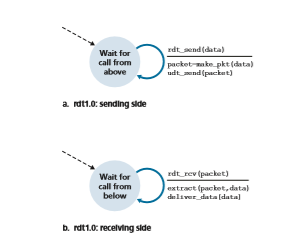
**Figure 3.9**  ♦ rdt1.0—A protocol for a completely reliable channel

On the receiving side, rdt receives a packet from the underlying channel via the rdt\_rcv(packet) event, removes the data from the packet (via the action extract (packet, data)) and passes the data up to the upper layer (via the action deliver\_data(data)). In practice, the rdt\_rcv(packet) event would result from a procedure call (for example, to rdt\_rcv()) from the lower- layer protocol.

In this simple protocol, there is no difference between a unit of data and a packet. Also, all packet flow is from the sender to receiver; with a perfectly reliable chan- nel there is no need for the receiver side to provide any feedback to the sender since nothing can go wrong! Note that we have also assumed that the receiver is able to receive data as fast as the sender happens to send data. Thus, there is no need for the receiver to ask the sender to slow down!

**Reliable Data Transfer over a Channel with Bit Errors: rdt2.0**

A more realistic model of the underlying channel is one in which bits in a packet may be corrupted. Such bit errors typically occur in the physical components of a network as a packet is transmitted, propagates, or is buffered. We’ll continue to assume for the moment that all transmitted packets are received (although their bits may be cor- rupted) in the order in which they were sent.

Before developing a protocol for reliably communicating over such a channel, first consider how people might deal with such a situation. Consider how you yourself
might dictate a long message over the phone. In a typical scenario, the message taker might say “OK” after each sentence has been heard, understood, and recorded. If the message taker hears a garbled sentence, you’re asked to repeat the garbled sentence. This message-dictation protocol uses both **positive acknowledgments** (“OK”) and **negative acknowledgments** (“Please repeat that.”). These control messages allow the receiver to let the sender know what has been received correctly, and what has been received in error and thus requires repeating. In a computer network setting, reliable data transfer protocols based on such retransmission are known as **ARQ (Automatic Repeat reQuest) protocols**.

Fundamentally, three additional protocol capabilities are required in ARQ pro- tocols to handle the presence of bit errors:

• _Error detection._ First, a mechanism is needed to allow the receiver to detect when bit errors have occurred. Recall from the previous section that UDP uses the Inter- net checksum field for exactly this purpose. In Chapter 6, we’ll examine error- detection and -correction techniques in greater detail; these techniques allow the receiver to detect and possibly correct packet bit errors. For now, we need only know that these techniques require that extra bits (beyond the bits of original data to be transferred) be sent from the sender to the receiver; these bits will be gath- ered into the packet checksum field of the rdt2.0 data packet.

• _Receiver feedback._ Since the sender and receiver are typically executing on dif- ferent end systems, possibly separated by thousands of miles, the only way for the sender to learn of the receiver’s view of the world (in this case, whether or not a packet was received correctly) is for the receiver to provide explicit feedback to the sender. The positive (ACK) and negative (NAK) acknowledgment replies in the message-dictation scenario are examples of such feedback. Our rdt2.0 protocol will similarly send ACK and NAK packets back from the receiver to the sender. In principle, these packets need only be one bit long; for example, a 0 value could indicate a NAK and a value of 1 could indicate an ACK.

• _Retransmission._ A packet that is received in error at the receiver will be retrans- mitted by the sender.

Figure 3.10 shows the FSM representation of rdt2.0, a data transfer protocol employing error detection, positive acknowledgments, and negative acknowledgments.

The send side of rdt2.0 has two states. In the leftmost state, the send-side protocol is waiting for data to be passed down from the upper layer. When the rdt\_send(data) event occurs, the sender will create a packet (sndpkt) con- taining the data to be sent, along with a packet checksum (for example, as discussed in Section 3.3.2 for the case of a UDP segment), and then send the packet via the udt\_send(sndpkt) operation. In the rightmost state, the sender protocol is wait- ing for an ACK or a NAK packet from the receiver.


**Figure 3.10**  ♦ rdt2.0—A protocol for a channel with bit errors

(the notation rdt\_rcv(rcvpkt) && isACK(rcvpkt) in Figure 3.10 cor- responds to this event), the sender knows that the most recently transmitted packet has been received correctly and thus the protocol returns to the state of waiting for data from the upper layer. If a NAK is received, the protocol retransmits the last packet and waits for an ACK or NAK to be returned by the receiver in response to the retransmitted data packet. It is important to note that when the sender is in the wait-for-ACK-or-NAK state, it _cannot_ get more data from the upper layer; that is, the rdt\_send() event can not occur; that will happen only after the sender receives an ACK and leaves this state. Thus, the sender will not send a new piece of data until it is sure that the receiver has correctly received the current packet. Because of this behavior, protocols such as rdt2.0 are known as **stop-and-wait** protocols.

The receiver-side FSM for rdt2.0 still has a single state. On packet arrival, the receiver replies with either an ACK or a NAK, depending on whether or not the received packet is corrupted. In Figure 3.10, the notation rdt\_rcv(rcvpkt) && corrupt(rcvpkt) corresponds to the event in which a packet is received and is found to be in error.

Protocol rdt2.0 may look as if it works but, unfortunately, it has a fatal flaw. In particular, we haven’t accounted for the possibility that the ACK or NAK packet could be corrupted! (Before proceeding on, you should think about how this prob- lem may be fixed.) Unfortunately, our slight oversight is not as innocuous as it may seem. Minimally, we will need to add checksum bits to ACK/NAK packets in order to detect such errors. The more difficult question is how the protocol should recover from errors in ACK or NAK packets. The difficulty here is that if an ACK or NAK is corrupted, the sender has no way of knowing whether or not the receiver has cor- rectly received the last piece of transmitted data.

Consider three possibilities for handling corrupted ACKs or NAKs:

• For the first possibility, consider what a human might do in the message-dictation scenario. If the speaker didn’t understand the “OK” or “Please repeat that” reply from the receiver, the speaker would probably ask, “What did you say?” (thus introducing a new type of sender-to-receiver packet to our protocol). The receiver would then repeat the reply. But what if the speaker’s “What did you say?” is cor- rupted? The receiver, having no idea whether the garbled sentence was part of the dictation or a request to repeat the last reply, would probably then respond with “What did _you_ say?” And then, of course, that response might be garbled. Clearly, we’re heading down a difficult path.

• A second alternative is to add enough checksum bits to allow the sender not only to detect, but also to recover from, bit errors. This solves the immediate problem for a channel that can corrupt packets but not lose them.

• A third approach is for the sender simply to resend the current data packet when it receives a garbled ACK or NAK packet. This approach, however, introduces **duplicate packets** into the sender-to-receiver channel. The fundamental diffi- culty with duplicate packets is that the receiver doesn’t know whether the ACK or NAK _it_ last sent was received correctly at the sender. Thus, it cannot know _a priori_ whether an arriving packet contains new data or is a retransmission!

A simple solution to this new problem (and one adopted in almost all exist- ing data transfer protocols, including TCP) is to add a new field to the data packet and have the sender number its data packets by putting a **sequence number** into this field. The receiver then need only check this sequence number to determine whether or not the received packet is a retransmission. For this simple case of a stop-and-wait protocol, a 1-bit sequence number will suffice, since it will allow the receiver to know whether the sender is resending the previously transmitted packet(the sequence number of the received packet has the same sequence number as the most recently received packet) or a new packet (the sequence number changes, mov- ing “forward” in modulo-2 arithmetic). Since we are currently assuming a channel that does not lose packets, ACK and NAK packets do not themselves need to indicate the sequence number of the packet they are acknowledging. The sender knows that a received ACK or NAK packet (whether garbled or not) was generated in response to its most recently transmitted data packet.

Figures 3.11 and 3.12 show the FSM description for rdt2.1, our fixed version of rdt2.0. The rdt2.1 sender and receiver FSMs each now have twice as many states as before. This is because the protocol state must now reflect whether the packet currently being sent (by the sender) or expected (at the receiver) should have a sequence number of 0 or 1. Note that the actions in those states where a 0-numbered packet is being sent or expected are mirror images of those where a 1-numbered packet is being sent or expected; the only differences have to do with the handling of the sequence number.

Protocol rdt2.1 uses both positive and negative acknowledgments from the receiver to the sender. When an out-of-order packet is received, the receiver sends a positive acknowledgment for the packet it has received. When a corrupted packet

**Figure 3.11**  ♦ rdt2.1 sender
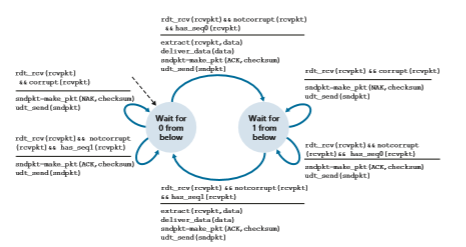
**Figure 3.12**  ♦ rdt2.1 receiver

is received, the receiver sends a negative acknowledgment. We can accomplish the same effect as a NAK if, instead of sending a NAK, we send an ACK for the last correctly received packet. A sender that receives two ACKs for the same packet (that is, receives **duplicate ACKs**) knows that the receiver did not correctly receive the packet following the packet that is being ACKed twice. Our NAK-free reliable data transfer protocol for a channel with bit errors is rdt2.2, shown in Figures 3.13 and 3.14. One subtle change between rtdt2.1 and rdt2.2 is that the receiver must now include the sequence number of the packet being acknowledged by an ACK message (this is done by including the ACK, 0 or ACK, 1 argument in make\_pkt() in the receiver FSM), and the sender must now check the sequence number of the packet being acknowledged by a received ACK message (this is done by including the 0 or 1 argument in isACK() in the sender FSM).

**Reliable Data Transfer over a Lossy Channel with Bit Errors: rdt3.0**

Suppose now that in addition to corrupting bits, the underlying channel can _lose_ packets as well, a not-uncommon event in today’s computer networks (including the Internet). Two additional concerns must now be addressed by the protocol: how to detect packet loss and what to do when packet loss occurs. The use of check- summing, sequence numbers, ACK packets, and retransmissions—the techniques


**Figure 3.13**  ♦ rdt2.2 sender

already developed in rdt2.2—will allow us to answer the latter concern. Handling the first concern will require adding a new protocol mechanism.

There are many possible approaches toward dealing with packet loss (several more of which are explored in the exercises at the end of the chapter). Here, we’ll put the burden of detecting and recovering from lost packets on the sender. Suppose that the sender transmits a data packet and either that packet, or the receiver’s ACK of that packet, gets lost. In either case, no reply is forthcoming at the sender from the receiver. If the sender is willing to wait long enough so that it is _certain_ that a packet has been lost, it can simply retransmit the data packet. You should convince yourself that this protocol does indeed work.

But how long must the sender wait to be certain that something has been lost? The sender must clearly wait at least as long as a round-trip delay between the sender and receiver (which may include buffering at intermediate routers) plus whatever amount of time is needed to process a packet at the receiver. In many networks, this worst-case maximum delay is very difficult even to estimate, much less know with certainty. Moreover, the protocol should ideally recover from packet loss as soon as possible; waiting for a worst-case delay could mean a long wait until error recovery
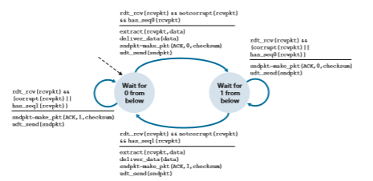
**Figure 3.14**  ♦ rdt2.2 receiver

is initiated. The approach thus adopted in practice is for the sender to judiciously choose a time value such that packet loss is likely, although not guaranteed, to have happened. If an ACK is not received within this time, the packet is retransmitted. Note that if a packet experiences a particularly large delay, the sender may retrans- mit the packet even though neither the data packet nor its ACK have been lost. This introduces the possibility of **duplicate data packets** in the sender-to-receiver chan- nel. Happily, protocol rdt2.2 already has enough functionality (that is, sequence numbers) to handle the case of duplicate packets.

From the sender’s viewpoint, retransmission is a panacea. The sender does not know whether a data packet was lost, an ACK was lost, or if the packet or ACK was simply overly delayed. In all cases, the action is the same: retransmit. Implement- ing a time-based retransmission mechanism requires a **countdown timer** that can interrupt the sender after a given amount of time has expired. The sender will thus need to be able to (1) start the timer each time a packet (either a first-time packet or a retransmission) is sent, (2) respond to a timer interrupt (taking appropriate actions), and (3) stop the timer.

Figure 3.15 shows the sender FSM for rdt3.0, a protocol that reliably transfers data over a channel that can corrupt or lose packets; in the homework problems, you’ll be asked to provide the receiver FSM for rdt3.0. Figure 3.16 shows how the pro- tocol operates with no lost or delayed packets and how it handles lost data packets. In Figure 3.16, time moves forward from the top of the diagram toward the bottom of the

diagram; note that a receive time for a packet is necessarily later than the send time for a packet as a result of transmission and propagation delays. In Figures 3.16(b)–(d), the send-side brackets indicate the times at which a timer is set and later times out. Sev- eral of the more subtle aspects of this protocol are explored in the exercises at the end of this chapter. Because packet sequence numbers alternate between 0 and 1, protocol rdt3.0 is sometimes known as the **alternating-bit protocol**.
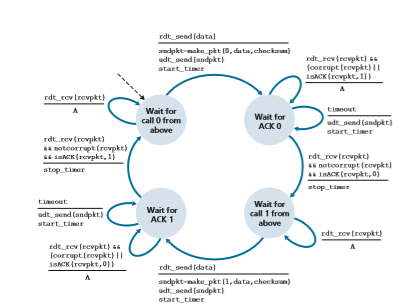
**Figure 3.15**  ♦ rdt3.0 sender
We have now assembled the key elements of a data transfer protocol. Check- sums, sequence numbers, timers, and positive and negative acknowledgment packets each play a crucial and necessary role in the operation of the protocol. We now have a working reliable data transfer protocol!

### Pipelined Reliable Data Transfer Protocols

Protocol rdt3.0 is a functionally correct protocol, but it is unlikely that anyone would be happy with its performance, particularly in today’s high-speed networks. At the heart of rdt3.0’s performance problem is the fact that it is a stop-and-wait protocol.

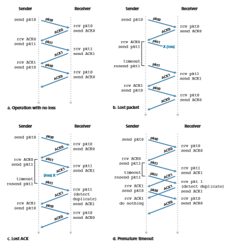
**Figure 3.16**  ♦  Operation of rdt3.0, the alternating-bit protocol


**Figure 3.17**  ♦  Stop-and-wait versus pipelined protocol

To appreciate the performance impact of this stop-and-wait behavior, consider an idealized case of two hosts, one located on the West Coast of the United States and the other located on the East Coast, as shown in Figure 3.17. The speed-of-light round-trip propagation delay between these two end systems, RTT, is approximately 30 milliseconds. Suppose that they are connected by a channel with a transmission rate, _R_, of 1 Gbps (109 bits per second). With a packet size, _L,_ of 1,000 bytes (8,000 bits) per packet, including both header fields and data, the time needed to actually transmit the packet into the 1 Gbps link is

_d_trans = _L R_\= 8000 bits
109 bits/sec = 8 microseconds

Figure 3.18(a) shows that with our stop-and-wait protocol, if the sender begins sending the packet at _t_ \= 0, then at _t_ \= _L_/_R_ \= 8 microseconds, the last bit enters the channel at the sender side. The packet then makes its 15-msec cross-country jour- ney, with the last bit of the packet emerging at the receiver at _t_ \= RTT/2 + _L_/_R_ = 15.008 msec. Assuming for simplicity that ACK packets are extremely small (so that we can ignore their transmission time) and that the receiver can send an ACK as soon as the last bit of a data packet is received, the ACK emerges back at the sender at _t_ \= RTT + _L_/_R_ \= 30.008 msec. At this point, the sender can now transmit the next message. Thus, in 30.008 msec, the sender was sending for only 0.008 msec. If we define the **utilization** of the sender (or the channel) as the fraction of time the sender is actually busy sending bits into the channel, the analysis in Figure 3.18(a) shows that the stop-and-wait protocol has a rather dismal sender utilization, _U_sender, of

_U_sender = _L_\>_R_

_RTT_ \+ _L_\>_R_ \= .008

30.008 = 0.00027

Data packetsData packet

ACK packets

**a. A stop-and-wait protocol in operation b. A pipelined protocol in operation**

First bit of first packet transmitted, t = 0 Last bit of first packet transmitted, t = _L/R_
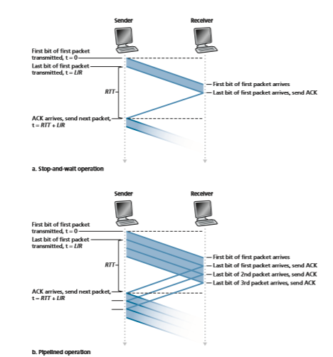
**Figure 3.18**  ♦  Stop-and-wait and pipelined sending

That is, the sender was busy only 2.7 hundredths of one percent of the time! Viewed another way, the sender was able to send only 1,000 bytes in 30.008 mil- liseconds, an effective throughput of only 267 kbps—even though a 1 Gbps link was available! Imagine the unhappy network manager who just paid a fortune for a gigabit capacity link but manages to get a throughput of only 267 kilobits per second! This is a graphic example of how network protocols can limit the capabili- ties provided by the underlying network hardware. Also, we have neglected lower- layer protocol-processing times at the sender and receiver, as well as the process- ing and queuing delays that would occur at any intermediate routers between the sender and receiver. Including these effects would serve only to further increase the delay and further accentuate the poor performance.

The solution to this particular performance problem is simple: Rather than oper- ate in a stop-and-wait manner, the sender is allowed to send multiple packets with- out waiting for acknowledgments, as illustrated in Figure 3.17(b). Figure 3.18(b) shows that if the sender is allowed to transmit three packets before having to wait for acknowledgments, the utilization of the sender is essentially tripled. Since the many in-transit sender-to-receiver packets can be visualized as filling a pipeline, this tech- nique is known as **pipelining**. Pipelining has the following consequences for reliable data transfer protocols:

• The range of sequence numbers must be increased, since each in-transit packet (not counting retransmissions) must have a unique sequence number and there may be multiple, in-transit, unacknowledged packets.

• The sender and receiver sides of the protocols may have to buffer more than one packet. Minimally, the sender will have to buffer packets that have been transmit- ted but not yet acknowledged. Buffering of correctly received packets may also be needed at the receiver, as discussed below.

• The range of sequence numbers needed and the buffering requirements will depend on the manner in which a data transfer protocol responds to lost, cor- rupted, and overly delayed packets. Two basic approaches toward pipelined error recovery can be identified: **Go-Back-N** and **selective repeat**.

### Go-Back-N (GBN)
In a **Go-Back-N** (GBN) protocol, the sender is allowed to transmit multiple packets (when available) without waiting for an acknowledgment, but is constrained to have no more than some maximum allowable number, _N,_ of unacknowledged packets in the pipeline. We describe the GBN protocol in some detail in this section. But before reading on, you are encouraged to play with the GBN animation (an awesome inter- active animation) at the Companion Website.

Figure 3.19 shows the sender’s view of the range of sequence numbers in a GBN protocol. If we define base to be the sequence number of the oldest unacknowledged

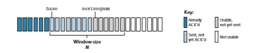
**Figure 3.19**  ♦  Sender’s view of sequence numbers in Go-Back-Nrdt\_send(data)

packet and nextseqnum to be the smallest unused sequence number (that is, the sequence number of the next packet to be sent), then four intervals in the range of sequence numbers can be identified. Sequence numbers in the interval [0,base-1] correspond to packets that have already been transmitted and acknowledged. The inter- val [base,nextseqnum-1] corresponds to packets that have been sent but not yet acknowledged. Sequence numbers in the interval [nextseqnum,base+N-1] can be used for packets that can be sent immediately, should data arrive from the upper layer. Finally, sequence numbers greater than or equal to base+N cannot be used until an unacknowledged packet currently in the pipeline (specifically, the packet with sequence number base) has been acknowledged.

As suggested by Figure 3.19, the range of permissible sequence numbers for transmitted but not yet acknowledged packets can be viewed as a window of size _N_ over the range of sequence numbers. As the protocol operates, this window slides forward over the sequence number space. For this reason, _N_ is often referred to as the **window size** and the GBN protocol itself as a **sliding-window protocol**. You might be wondering why we would even limit the number of outstanding, unacknowledged packets to a value of _N_ in the first place. Why not allow an unlimited number of such packets? We’ll see in Section 3.5 that flow control is one reason to impose a limit on the sender. We’ll examine another reason to do so in Section 3.7, when we study TCP congestion control.

In practice, a packet’s sequence number is carried in a fixed-length field in the packet header. If _k_ is the number of bits in the packet sequence number field, the range of sequence numbers is thus [0,2_k_ \- 1]. With a finite range of sequence num- bers, all arithmetic involving sequence numbers must then be done using modulo 2_k_ arithmetic. (That is, the sequence number space can be thought of as a ring of size 2_k_, where sequence number 2_k_ \- 1 is immediately followed by sequence number 0.) Recall that rdt3.0 had a 1-bit sequence number and a range of sequence numbers of [0,1]. Several of the problems at the end of this chapter explore the consequences of a finite range of sequence numbers. We will see in Section 3.5 that TCP has a 32-bit sequence number field, where TCP sequence numbers count bytes in the byte stream rather than packets.

Figures 3.20 and 3.21 give an extended FSM description of the sender and receiver sides of an ACK-based, NAK-free, GBN protocol. We refer to this FSM

```
if(nextseqnum<base+N){ 
sndpkt\[nextseqnum\]=make\_pkt(nextseqnum,data,checksum) udt\_send(sndpkt\[nextseqnum\]) 
if(base==nextseqnum) s
tart\_timer 
nextseqnum++ 
} 
else refuse\_data(data)
```
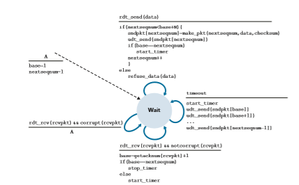
**Figure 3.20**  ♦  Extended FSM description of the GBN sender

**Figure 3.21**  ♦  Extended FSM description of the GBN receiver
description as an _extended FSM_ because we have added variables (similar to programming-language variables) for base and nextseqnum, and added opera- tions on these variables and conditional actions involving these variables. Note that the extended FSM specification is now beginning to look somewhat like a program- ming-language specification. \[Bochman 1984\] provides an excellent survey of addi- tional extensions to FSM techniques as well as other programming-language-based techniques for specifying protocols.

The GBN sender must respond to three types of events:

• _Invocation from above._ When rdt\_send() is called from above, the sender first checks to see if the window is full, that is, whether there are _N_ outstand- ing, unacknowledged packets. If the window is not full, a packet is created and sent, and variables are appropriately updated. If the window is full, the sender simply returns the data back to the upper layer, an implicit indication that the window is full. The upper layer would presumably then have to try again later. In a real implementation, the sender would more likely have either buffered (but not immediately sent) this data, or would have a synchronization mechanism (for example, a semaphore or a flag) that would allow the upper layer to call rdt\_send() only when the window is not full.

• _Receipt of an ACK._ In our GBN protocol, an acknowledgment for a packet with sequence number _n_ will be taken to be a **cumulative acknowledgment**, indicat- ing that all packets with a sequence number up to and including _n_ have been correctly received at the receiver. We’ll come back to this issue shortly when we examine the receiver side of GBN.

• _A timeout event._ The protocol’s name, “Go-Back-N,” is derived from the sender’s behavior in the presence of lost or overly delayed packets. As in the stop-and-wait protocol, a timer will again be used to recover from lost data or acknowledgment packets. If a timeout occurs, the sender resends _all_ packets that have been previ- ously sent but that have not yet been acknowledged. Our sender in Figure 3.20 uses only a single timer, which can be thought of as a timer for the oldest trans- mitted but not yet acknowledged packet. If an ACK is received but there are still additional transmitted but not yet acknowledged packets, the timer is restarted. If there are no outstanding, unacknowledged packets, the timer is stopped.

The receiver’s actions in GBN are also simple. If a packet with sequence number _n_ is received correctly and is in order (that is, the data last delivered to the upper layer came from a packet with sequence number _n_ \- 1), the receiver sends an ACK for packet _n_ and delivers the data portion of the packet to the upper layer. In all other cases, the receiver discards the packet and resends an ACK for the most recently received in-order packet. Note that since packets are delivered one at a time to the upper layer, if packet _k_ has been received and delivered, then all packets with asequence number lower than _k_ have also been delivered. Thus, the use of cumulative acknowledgments is a natural choice for GBN.

In our GBN protocol, the receiver discards out-of-order packets. Although it may seem silly and wasteful to discard a correctly received (but out-of-order) packet, there is some justification for doing so. Recall that the receiver must deliver data in order to the upper layer. Suppose now that packet _n_ is expected, but packet _n_ \+ 1 arrives. Because data must be delivered in order, the receiver _could_ buffer (save) packet _n_ \+ 1 and then deliver this packet to the upper layer after it had later received and delivered packet _n_. However, if packet _n_ is lost, both it and packet _n_ \+ 1 will eventually be retransmitted as a result of the GBN retransmis- sion rule at the sender. Thus, the receiver can simply discard packet _n_ \+ 1. The advantage of this approach is the simplicity of receiver buffering—the receiver need not buffer _any_ out-of-order packets. Thus, while the sender must maintain the upper and lower bounds of its window and the position of nextseqnum within this window, the only piece of information the receiver need maintain is the sequence number of the next in-order packet. This value is held in the variable expectedseqnum, shown in the receiver FSM in Figure 3.21. Of course, the disadvantage of throwing away a correctly received packet is that the subsequent retransmission of that packet might be lost or garbled and thus even more retrans- missions would be required.

Figure 3.22 shows the operation of the GBN protocol for the case of a window size of four packets. Because of this window size limitation, the sender sends pack- ets 0 through 3 but then must wait for one or more of these packets to be acknowl- edged before proceeding. As each successive ACK (for example, ACK0 and ACK1) is received, the window slides forward and the sender can transmit one new packet (pkt4 and pkt5, respectively). On the receiver side, packet 2 is lost and thus packets 3, 4, and 5 are found to be out of order and are discarded.

Before closing our discussion of GBN, it is worth noting that an implementa- tion of this protocol in a protocol stack would likely have a structure similar to that of the extended FSM in Figure 3.20. The implementation would also likely be in the form of various procedures that implement the actions to be taken in response to the various events that can occur. In such **event-based programming**, the various procedures are called (invoked) either by other procedures in the protocol stack, or as the result of an interrupt. In the sender, these events would be (1) a call from the upper-layer entity to invoke rdt\_send(), (2) a timer interrupt, and (3) a call from the lower layer to invoke rdt\_rcv() when a packet arrives. The programming exercises at the end of this chapter will give you a chance to actually implement these routines in a simulated, but realistic, network setting.

We note here that the GBN protocol incorporates almost all of the techniques that we will encounter when we study the reliable data transfer components of TCP in Section 3.5. These techniques include the use of sequence numbers, cumulative acknowledgments, checksums, and a timeout/retransmit operation.

**Figure 3.22**  ♦  Go-Back-N in operation

### Selective Repeat (SR)
 The GBN protocol allows the sender to potentially “fill the pipeline” in Figure 3.17 with packets, thus avoiding the channel utilization problems we noted with stop- and-wait protocols. There are, however, scenarios in which GBN itself suffers from performance problems. In particular, when the window size and bandwidth-delay product are both large, many packets can be in the pipeline. A single packet error can thus cause GBN to retransmit a large number of packets, many unnecessarily. As the probability of channel errors increases, the pipeline can become filled with these unnecessary retransmissions. Imagine, in our message-dictation scenario, that if every time a word was garbled, the surrounding 1,000 words (for example, a win- dow size of 1,000 words) had to be repeated. The dictation would be slowed by all of the reiterated words.

As the name suggests, selective-repeat protocols avoid unnecessary retrans- missions by having the sender retransmit only those packets that it suspects were received in error (that is, were lost or corrupted) at the receiver. This individual, as-needed, retransmission will require that the receiver _individually_ acknowledge correctly received packets. A window size of _N_ will again be used to limit the num- ber of outstanding, unacknowledged packets in the pipeline. However, unlike GBN, the sender will have already received ACKs for some of the packets in the window. Figure 3.23 shows the SR sender’s view of the sequence number space. Figure 3.24 details the various actions taken by the SR sender.

The SR receiver will acknowledge a correctly received packet whether or not it is in order. Out-of-order packets are buffered until any missing packets (that is, packets with lower sequence numbers) are received, at which point a batch of packets can be delivered in order to the upper layer. Figure 3.25 itemizes the various actions taken by the SR receiver. Figure 3.26 shows an example of SR operation in the presence of lost packets. Note that in Figure 3.26, the receiver initially buffers packets 3, 4, and 5, and delivers them together with packet 2 to the upper layer when packet 2 is finally received.

**Figure 3.23**  ♦   Selective-repeat (SR) sender and receiver views of sequence-number space

1\. _Data received from above._ When data is received from above, the SR sender checks the next available sequence number for the packet. If the sequence number is within the sender’s window, the data is packetized and sent; other- wise it is either buered or returned to the upper layer for later transmission, as in GBN.

2\. _Timeout_. Timers are again used to protect against lost packets. However, each packet must now have its own logical timer, since only a single packet will be transmitted on timeout. A single hardware timer can be used to mimic the operation of multiple logical timers [Varghese 1997].

3\. _ACK received_. If an ACK is received, the SR sender marks that packet as having been received, provided it is in the window. If the packet’s sequence number is equal to send\_base, the window base is moved forward to the unacknowledged packet with the smallest sequence number. If the window moves and there are untransmitted packets with sequence numbers that now fall within the window, these packets are transmitted.
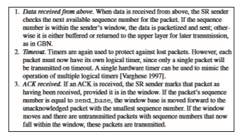
**Figure 3.24**  ♦  SR sender events and actions

1\. _Packet with sequence number in_ [rcv\_base, rcv\_base+N-1]_is cor- rectly received._ In this case, the received packet falls within the receiver’s win- dow and a selective ACK packet is returned to the sender. If the packet was not previously received, it is buered. If this packet has a sequence number equal to the base of the receive window (rcv\_base in Figure 3.22), then this packet, and any previously buered and consecutively numbered (beginning with rcv\_base) packets are delivered to the upper layer. The recive window is then moved forward by the number of packets delivered to the upper layer. As an example, consider Figure 3.26. When a packet with a sequence number of rcv\_base=2 is received, it and packets 3, 4, and 5 can be delivered to the upper layer.

2\. _Packet with sequence number in_ \[rcv\_base-N, rcv\_base-1\]_is cor- rectly received._ In this case, an ACK must be generated, even though this is a packet that the receiver has previously acknowledged.

3\. _Otherwise._ Ignore the packet.
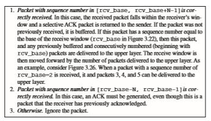
**Figure 3.25**  ♦  SR receiver events and actions
It is important to note that in Step 2 in Figure 3.25, the receiver reacknowledges (rather than ignores) already received packets with certain sequence numbers _below_ the current window base. You should convince yourself that this reacknowledgment is indeed needed. Given the sender and receiver sequence number spaces in Fig- ure 3.23, for example, if there is no ACK for packet send\_base propagating from
**Figure 3.26** ♦ SR operation

the receiver to the sender, the sender will eventually retransmit packet send\_base, even though it is clear (to us, not the sender!) that the receiver has already received that packet. If the receiver were not to acknowledge this packet, the sender’s win- dow would never move forward! This example illustrates an important aspect of SR protocols (and many other protocols as well). The sender and receiver will not always have an identical view of what has been received correctly and what has not. For SR protocols, this means that the sender and receiver windows will not always coincide.

The lack of synchronization between sender and receiver windows has impor- tant consequences when we are faced with the reality of a finite range of sequence numbers. Consider what could happen, for example, with a finite range of four packet sequence numbers, 0, 1, 2, 3, and a window size of three. Suppose packets 0 through 2 are transmitted and correctly received and acknowledged at the receiver. At this point, the receiver’s window is over the fourth, fifth, and sixth packets, which have sequence numbers 3, 0, and 1, respectively. Now consider two scenarios. In the first scenario, shown in Figure 3.27(a), the ACKs for the first three packets are lost and the sender retransmits these packets. The receiver thus next receives a packet with sequence number 0—a copy of the first packet sent.

In the second scenario, shown in Figure 3.27(b), the ACKs for the first three packets are all delivered correctly. The sender thus moves its window forward and sends the fourth, fifth, and sixth packets, with sequence numbers 3, 0, and 1, respec- tively. The packet with sequence number 3 is lost, but the packet with sequence number 0 arrives—a packet containing _new_ data.

Now consider the receiver’s viewpoint in Figure 3.27, which has a figurative curtain between the sender and the receiver, since the receiver cannot “see” the actions taken by the sender. All the receiver observes is the sequence of messages it receives from the channel and sends into the channel. As far as it is concerned, the two scenarios in Figure 3.27 are _identical._ There is no way of distinguishing the retransmission of the first packet from an original transmission of the fifth packet. Clearly, a window size that is 1 less than the size of the sequence number space won’t work. But how small must the window size be? A problem at the end of the chapter asks you to show that the window size must be less than or equal to half the size of the sequence number space for SR protocols.

At the Companion Website, you will find an animation that illustrates the opera- tion of the SR protocol. Try performing the same experiments that you did with the GBN animation. Do the results agree with what you expect?

This completes our discussion of reliable data transfer protocols. We’ve covered a _lot_ of ground and introduced numerous mechanisms that together provide for reli- able data transfer. Table 3.1 summarizes these mechanisms. Now that we have seen all of these mechanisms in operation and can see the “big picture,” we encourage you to review this section again to see how these mechanisms were incrementally added to cover increasingly complex (and realistic) models of the channel connecting the sender and receiver, or to improve the performance of the protocols.

Let’s conclude our discussion of reliable data transfer protocols by consider- ing one remaining assumption in our underlying channel model. Recall that we have assumed that packets cannot be reordered within the channel between the sender and receiver. This is generally a reasonable assumption when the sender and receiver are connected by a single physical wire. However, when the “channel” connecting the two is a network, packet reordering can occur. One manifestation of packet reordering is that old copies of a packet with a sequence or acknowledgmentpkt0

**Figure 3.27**  ♦   SR receiver dilemma with too-large windows: A new packet or a retransmission?

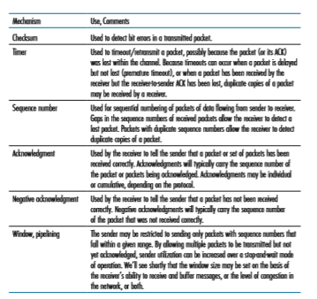
**Table 3.1**  ♦  Summary of reliable data transfer mechanisms and their use

number of _x_ can appear, even though neither the sender’s nor the receiver’s win- dow contains _x_. With packet reordering, the channel can be thought of as essen- tially buffering packets and spontaneously emitting these packets at _any_ point in the future. Because sequence numbers may be reused, some care must be taken to guard against such duplicate packets. The approach taken in practice is to ensure that a sequence number is not reused until the sender is “sure” that any previously sent packets with sequence number _x_ are no longer in the network. This is done by assuming that a packet cannot “live” in the network for longer than some fixed maximum amount of time. A maximum packet lifetime of approximately three minutes is assumed in the TCP extensions for high-speed networks [RFC 7323]. [Sunshine 1978] describes a method for using sequence numbers such that reorder- ing problems can be completely avoided.
