  

In the telephony world, the past 25 years have been the golden years of cellular telephony. The number of worldwide mobile cellular subscribers increased from 34 million in 1993 to 8.3 billion subscribers in 2019. There are now a larger number of mobile phone subscriptions than there are people on our planet. The many advan- tages of cell phones are evident to all—anywhere, anytime, untethered access to the global telephone network via a highly portable lightweight device. More recently, smartphones, tablets, and laptops have become wirelessly connected to the Internet via a cellular or WiFi network. And increasingly, devices such as gaming consoles, thermostats, home security systems, home appliances, watches, eye glasses, cars, traffic control systems and more are being wirelessly connected to the Internet.

From a networking standpoint, the challenges posed by networking these wire- less and mobile devices, particularly at the link layer and the network layer, are so different from traditional wired computer networks that an individual chapter devoted to the study of wireless and mobile networks (i.e., _this_ chapter) is appropriate.

We’ll begin this chapter with a discussion of mobile users, wireless links, and networks, and their relationship to the larger (typically wired) networks to which they connect. We’ll draw a distinction between the challenges posed by the _wireless_ nature of the communication links in such networks, and by the _mobility_ that these wireless links enable. Making this important distinction—between wireless and mobility—will allow us to better isolate, identify, and master the key concepts in each area.

We will begin with an overview of wireless access infrastructure and associ- ated terminology. We’ll then consider the characteristics of this wireless link in

Section 7.2. We include a brief introduction to code division multiple access (CDMA), a shared-medium access protocol that is often used in wireless networks, in Section 7.2. In Section 7.3, we’ll examine the link-level aspects of the IEEE 802.11 (WiFi) wireless LAN standard in some depth; we’ll also say a few words about Bluetooth wireless personal area networks. In Section 7.4, we’ll provide an overview of cellular Internet access, including 4G and emerging 5G cellular technologies that provide both voice and high-speed Internet access. In Section 7.5, we’ll turn our attention to mobility, focusing on the problems of locating a mobile user, routing to the mobile user, and “handing over” the mobile user who dynamically moves from one point of attachment to the network to another. We’ll examine how these mobility services are implemented in the 4G/5G cellular networks, and the in the Mobile IP standard in Section 7.6. Finally, we’ll consider the impact of wireless links and mobility on transport-layer protocols and networked applications in Section 7.7.

# Introduction
Figure 7.1 shows the setting in which we’ll consider the topics of wireless data com- munication and mobility. We’ll begin by keeping our discussion general enough to cover a wide range of networks, including both wireless LANs such as WiFi and 4G and 5G cellular networks; we’ll drill down into a more detailed discussion of specific wireless architectures in later sections. We can identify the following elements in a wireless network:

• _Wireless hosts._ As in the case of wired networks, hosts are the end-system devices that run applications. A **wireless host** might be a smartphone, tablet, or laptop, or it could be an Internet of Things (IoT) device such as a sensor, appliance, auto- mobile, or any other of the myriad devices being connected to the Internet. The hosts themselves may or may not be mobile.

• _Wireless links._ A host connects to a base station (defined below) or to another wireless host through a **wireless communication link**. Different wireless link technologies have different transmission rates and can transmit over different distances. Figure 7.2 shows two key characteristics, link transmission rates and coverage ranges, of the more popular wireless network standards. (The figure is only meant to provide a rough idea of these characteristics. For example, some of these types of networks are only now being deployed, and some link rates can increase or decrease beyond the values shown depending on distance, chan- nel conditions, and the number of users in the wireless network.) We’ll cover these standards later in the first half of this chapter; we’ll also consider other wireless link characteristics (such as their bit error rates and the causes of bit errors) in Section 7.2.In Figure 7.1, wireless links connect wireless hosts located at the edge of the network into the larger network infrastructure. We hasten to add that wireless links are also sometimes used _within_ a network to connect routers, switches, and other network equipment. However, our focus in this chapter will be on the use of wireless communication at the network edge, as it is here that many of the most exciting technical challenges, and most of the growth, are occurring.

• _Base station._ The **base station** is a key part of the wireless network infrastructure. Unlike the wireless host and wireless link, a base station has no obvious counter- part in a wired network. A base station is responsible for sending and receiving data (e.g., packets) to and from a wireless host that is associated with that base station. A base station will often be responsible for coordinating the transmission of multiple wireless hosts with which it is associated. When we say a wireless host is “associated” with a base station, we mean that (1) the host is within the wireless communication distance of the base station, and (2) the host uses that base station to relay data between it (the host) and the larger network. **Cell towers** in cellular networks and **access points** in 802.11 wireless LANs are examples of base stations.
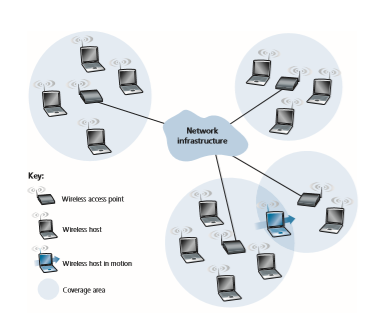
**Figure 7.1**  ♦  Elements of a wireless network

Wireless host in motionIn Figure 7.1, the base station is connected to the larger network (e.g., the Internet, corporate or home network), thus functioning as a link-layer relay between the wireless host and the rest of the world with which the host communicates.

Hosts associated with a base station are often referred to as operating in **infrastructure mode**, since all traditional network services (e.g., address assign- ment and routing) are provided by the network to which a host is connected via the base station. In **ad hoc networks**, wireless hosts have no such infrastructure with which to connect. In the absence of such infrastructure, the hosts themselves must provide for services such as routing, address assignment, DNS-like name translation, and more.

When a mobile host moves beyond the range of one base station and into the range of another, it will change its point of attachment into the larger network (i.e., change the base station with which it is associated)—a process referred to as **handoff** or **handover**. Such mobility raises many challenging questions. If a host can move, how does one find the mobile host’s current location in the network so that data can be forwarded to that mobile host? How is addressing performed, given that a host can be in one of many possible locations? If the host moves _during_ a TCP connection or phone call, how is data routed so that the connection
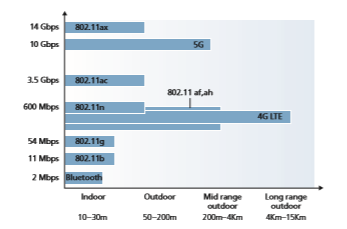
**Figure 7.2**  ♦   Wireless transmission rates and range for WiFi, cellular 4G/5G and Bluetooth standards (note: axes are not linear)
continues uninterrupted? These and many (many!) other questions make wireless and mobile networking an area of exciting networking research.

• _Network infrastructure._ This is the larger network with which a wireless host may wish to communicate.

Having discussed the “pieces” of a wireless network, we note that these pieces can be combined in many different ways to form different types of wireless net- works. You may find a taxonomy of these types of wireless networks useful as you read on in this chapter, or read/learn more about wireless networks beyond this book. At the highest level we can classify wireless networks according to two criteria: _(i)_ whether a packet in the wireless network crosses exactly _one wireless hop or multiple wireless hops_, and _(ii)_ whether there is _infrastructure_ such as a base station in the network:

• _Single-hop, infrastructure-based._ These networks have a base station that is con- nected to a larger wired network (e.g., the Internet). Furthermore, all communica- tion is between this base station and a wireless host over a single wireless hop. The 802.11 networks you use in the classroom, café, or library; and the 4G LTE data networks that we will learn about shortly all fall in this category. The vast majority of our daily interactions are with single-hop, infrastructure-based wireless networks.

• _Single-hop, infrastructure-less._ In these networks, there is no base station that is connected to a wireless network. However, as we will see, one of the nodes in this single-hop network may coordinate the transmissions of the other nodes. Bluetooth networks (that connect small wireless devices such as keyboards, speakers, and headsets, and which we will study in Section 7.3.6) are single-hop, infrastructure-less networks.

• _Multi-hop, infrastructure-based._ In these networks, a base station is present that is wired to the larger network. However, some wireless nodes may have to relay their communication through other wireless nodes in order to communicate via the base station. Some wireless sensor networks and so-called **wireless mesh networks** deployed in homes fall in this category.

• _Multi-hop, infrastructure-less._ There is no base station in these networks, and nodes may have to relay messages among several other nodes in order to reach a destination. Nodes may also be mobile, with connectivity changing among nodes—a class of networks known as **mobile ad hoc networks (MANETs)**. If the mobile nodes are vehicles, the network is a **vehicular ad hoc network (VANET)**. As you might imagine, the development of protocols for such net- works is challenging and is the subject of much ongoing research.

In this chapter, we’ll mostly confine ourselves to single-hop networks, and then mostly to infrastructure-based networks.Let’s now dig deeper into the technical challenges that arise in wireless and mobile networks. We’ll begin by first considering the individual wireless link, defer- ring our discussion of mobility until later in this chapter.

# Wireless Links and Network Characteristics
Wireless links differ from their wired counterparts in a number important ways:

• _Decreasing signal strength_. Electromagnetic radiation attenuates as it passes through matter (e.g., a radio signal passing through a wall). Even in free space, the signal will disperse, resulting in decreased signal strength (sometimes referred to as **path loss**) as the distance between sender and receiver increases.

• _Interference from other sources._ Radio sources transmitting in the same fre- quency band will interfere with each other. For example, 2.4 GHz wireless phones and 802.11b wireless LANs transmit in the same frequency band. Thus, the 802.11b wireless LAN user talking on a 2.4 GHz wireless phone can expect that neither the network nor the phone will perform particularly well. In addi- tion to interference from transmitting sources, electromagnetic noise within the environment (e.g., a nearby motor, a microwave) can result in interference. For this reason, a number of more recent 802.11 standards operate in the 5GHz frequency band.

• _Multipath propagation._ **Multipath propagation** occurs when portions of the electromagnetic wave reflect off objects and the ground, taking paths of different lengths between a sender and receiver. This results in the blurring of the received signal at the receiver. Moving objects between the sender and receiver can cause multipath propagation to change over time.

For a detailed discussion of wireless channel characteristics, models, and measure- ments, see \[Anderson 1995; Almers 2007\].

The discussion above suggests that bit errors will be more common in wireless links than in wired links. For this reason, it is perhaps not surprising that wireless link protocols (such as the 802.11 protocol we’ll examine in the following section) employ not only powerful CRC error detection codes, but also link-level relia- ble-data-transfer protocols that retransmit corrupted frames.

Having considered the impairments that can occur on a wireless channel, let’s next turn our attention to the host receiving the wireless signal. This host receives an elec- tromagnetic signal that is a combination of a degraded form of the original signal trans- mitted by the sender (degraded due to the attenuation and multipath propagation effects that we discussed above, among others) and background noise in the environment. The **signal-to-noise ratio (SNR)** is a relative measure of the strength of the received signal (i.e., the information being transmitted) and this noise. The SNR is typically measured in units of decibels (dB), a unit of measure that some think is used byelectrical engineers primarily to confuse computer scientists. The SNR, measured in dB, is 20 times the ratio of the base-10 logarithm of the amplitude of the received signal to the amplitude of the noise. For our purposes here, we need only know that a larger SNR makes it easier for the receiver to extract the transmitted signal from the background noise.

Figure 7.3 (adapted from \[Holland 2001\]) shows the bit error rate (BER)— roughly speaking, the probability that a transmitted bit is received in error at the receiver—versus the SNR for three different modulation techniques for encod- ing information for transmission on an idealized wireless channel. The theory of modulation and coding, as well as signal extraction and BER, is well beyond the scope of this text (see \[Schwartz 1980; Goldsmith 2005\] for a discussion of these topics). Nonetheless, Figure 7.3 illustrates several physical-layer charac- teristics that are important in understanding higher-layer wireless communica- tion protocols:

• _For a given modulation scheme, the higher the SNR, the lower the BER._ Since a sender can increase the SNR by increasing its transmission power, a sender can decrease the probability that a frame is received in error by increasing its transmission power. Note, however, that there is arguably little practical gain in increasing the power beyond a certain threshold, say to decrease the BER from 10-12 to 10-13. There are also _disadvantages_ associated with increas- ing the transmission power: More energy must be expended by the sender

**Figure 7.3**  ♦  Bit error rate, transmission rate, and SNR
(an important concern for battery-powered mobile users), and the sender’s transmissions are more likely to interfere with the transmissions of another sender (see Figure 7.4(b)).

• _For a given SNR, a modulation technique with a higher bit transmission rate (whether in error or not) will have a higher BER._ For example, in Figure 7.3, with an SNR of 10 dB, BPSK modulation with a transmission rate of 1 Mbps has a BER of less than 10-7, while with QAM16 modulation with a transmission rate of 4 Mbps, the BER is 10-1, far too high to be practically useful. However, with an SNR of 20 dB, QAM16 modulation has a transmission rate of 4 Mbps and a BER of 10-7, while BPSK modulation has a transmission rate of only 1 Mbps and a BER that is so low as to be (literally) “off the charts.” If one can tolerate a BER of 10-7, the higher transmission rate offered by QAM16 would make it the preferred modulation technique in this situation. These considerations give rise to the final characteristic, described next.

• _Dynamic selection of the physical-layer modulation technique can be used to adapt the modulation technique to channel conditions._ The SNR (and hence the BER) may change as a result of mobility or due to changes in the environ- ment. Adaptive modulation and coding are used in the 802.11 WiFi and in 4G and 5G cellular data networks that we’ll study in Sections 7.3 and 7.4. This allows, for example, the selection of a modulation technique that provides the highest transmission rate possible subject to a constraint on the BER, for given channel characteristics.

A higher and time-varying bit error rate is not the only difference between a wired and wireless link. Recall that in the case of wired broadcast links, all nodes

**Figure 7.4**  ♦  Hidden terminal problem caused by obstacle (a) and fading (b)
receive the transmissions from all other nodes. In the case of wireless links, the situ- ation is not as simple, as shown in Figure 7.4. Suppose that Station A is transmit- ting to Station B. Suppose also that Station C is transmitting to Station B. With the so-called **hidden terminal problem**, physical obstructions in the environment (for example, a mountain or a building) may prevent A and C from hearing each other’s transmissions, even though A’s and C’s transmissions are indeed interfering at the destination, B. This is shown in Figure 7.4(a). A second scenario that results in unde- tectable collisions at the receiver results from the **fading** of a signal’s strength as it propagates through the wireless medium. Figure 7.4(b) illustrates the case where A and C are placed such that their signals are not strong enough to detect each other’s transmissions, yet their signals _are_ strong enough to interfere with each other at sta- tion B. As we’ll see in Section 7.3, the hidden terminal problem and fading make multiple access in a wireless network considerably more complex than in a wired network.

## CDMA
 Recall from Chapter 6 that when hosts communicate over a shared medium, a pro- tocol is needed so that the signals sent by multiple senders do not interfere at the receivers. In Chapter 6, we described three classes of medium access protocols: channel partitioning, random access, and taking turns. Code division multiple access (CDMA) belongs to the family of channel partitioning protocols. It is prevalent in wireless LAN and cellular technologies. Because CDMA is so important in the wire- less world, we’ll take a quick look at CDMA now, before getting into specific wire- less access technologies in the subsequent sections.

In a CDMA protocol, each bit being sent is encoded by multiplying the bit by a signal (the code) that changes at a much faster rate (known as the **chipping rate**) than the original sequence of data bits. Figure 7.5 shows a simple, idealized CDMA encoding/decoding scenario. Suppose that the rate at which original data bits reach the CDMA encoder defines the unit of time; that is, each original data bit to be transmitted requires a one-bit slot time. Let _di_ be the value of the data bit for the _i_th bit slot. For mathematical convenience, we represent a data bit with a 0 value as -1. Each bit slot is further subdivided into _M_ mini-slots; in Figure 7.5, _M_ \= 8, although in practice _M_ is much larger. The CDMA code used by the sender con- sists of a sequence of _M_ values, _cm_, _m_ \= 1, . . . , _M_, each taking a +1 or -1 value. In the example in Figure 7.5, the _M_\-bit CDMA code being used by the sender is (1, 1, 1, -1, 1, -1, -1, -1).

To illustrate how CDMA works, let us focus on the _i_th data bit, _di_. For the _m_th mini-slot of the bit-transmission time of _di_, the output of the CDMA encoder, _Zi_,_m_, is the value of _di_ multiplied by the _m_th bit in the assigned CDMA code, _cm_:

_Zi_,_m_ \= _di_ \# _cm_ (7.1)In a simple world, with no interfering senders, the receiver would receive the encoded bits, _Zi_,_m_, and recover the original data bit, _di_, by computing:

_di_ \= 1 _M_

a _M_

_m_\=1 _Zi_,_m_

\# _cm_ (7.2)

The reader might want to work through the details of the example in Figure 7.5 to see that the original data bits are indeed correctly recovered at the receiver using Equation 7.2.

**Figure 7.5**  ♦  A simple CDMA example: Sender encoding, receiver decoding
The world is far from ideal, however, and as noted above, CDMA must work in the presence of interfering senders that are encoding and transmitting their data using a different assigned code. But how can a CDMA receiver recover a sender’s original data bits when those data bits are being tangled with bits being transmitted by other senders? CDMA works under the assumption that the interfering transmitted bit sig- nals are additive. This means, for example, that if three senders send a 1 value, and a fourth sender sends a -1 value during the same mini-slot, then the received signal at all receivers during that mini-slot is a 2 (since 1 + 1 + 1 - 1 = 2). In the presence of multiple senders, sender _s_ computes its encoded transmissions, _Zs_

_i_,_m_, in exactly the same manner as in Equation 7.1. The value received at a receiver during the _m_th mini-slot of the _i_th bit slot, however, is now the _sum_ of the transmitted bits from all _N_ senders during that mini-slot:

_Z_\* _i_, _m_ \= a

_N_

_s_\=1 _Zs_

_i_,_m_

Amazingly, if the senders’ codes are chosen carefully, each receiver can recover the data sent by a given sender out of the aggregate signal simply by using the sender’s code in exactly the same manner as in Equation 7.2:

_di_ \= 1 _M_ a

_M_

_m_\=1 _Zi_,_m_

\* # _cm_ (7.3)

as shown in Figure 7.6, for a two-sender CDMA example. The _M_\-bit CDMA code being used by the upper sender is (1, 1, 1, -1, 1, -1, -1, -1), while the CDMA code being used by the lower sender is (1, -1, 1, 1, 1, -1, 1, 1). Figure 7.6 illustrates a receiver recovering the original data bits from the upper sender. Note that the receiver is able to extract the data from sender 1 in spite of the interfering transmission from sender 2.

Recall our cocktail analogy from Chapter 6. A CDMA protocol is similar to having partygoers speaking in multiple languages; in such circumstances humans are actually quite good at locking into the conversation in the language they understand, while filtering out the remaining conversations. We see here that CDMA is a parti- tioning protocol in that it partitions the codespace (as opposed to time or frequency) and assigns each node a dedicated piece of the codespace.

Our discussion here of CDMA is necessarily brief; in practice a number of dif- ficult issues must be addressed. First, in order for the CDMA receivers to be able to extract a particular sender’s signal, the CDMA codes must be carefully chosen. Second, our discussion has assumed that the received signal strengths from various senders are the same; in reality, this can be difficult to achieve. There is a consid- erable body of literature addressing these and other issues related to CDMA; see \[Pickholtz 1982; Viterbi 1995\] for details.# WiFi: 802.11 Wireless LANs
Pervasive in the workplace, the home, educational institutions, cafés, airports, and street corners, wireless LANs are now one of the most important access network technologies in the Internet today. Although many technologies and standards for

**Figure 7.6**  ♦  A two-sender CDMA example

wireless LANs were developed in the 1990s, one particular class of standards has clearly emerged as the winner: the **IEEE 802.11 wireless LAN**, also known as **WiFi**. In this section, we’ll take a close look at 802.11 wireless LANs, examining its frame structure, its medium access protocol, and its internetworking of 802.11 LANs with wired Ethernet LANs.

As summarized in Table 7.1, there are several 802.11 standards \[IEEE 802.11 2020\]. The 802.11 b, g, n, ac, ax are successive generations of 802.11 technology aimed for wireless local area networks (WLANs), typically less than 70 m range in a home office, workplace, or business setting. The 802.11 n, ac, and ax standards have recently been branded as WiFi 4, 5 and 6, respectively—no doubt competing with 4G and 5G cellular network branding. The 802.11 af, ah standards operate over longer distances and are aimed at Internet of Things, sensor networks, and metering applications.

The different 802.11 b, g, n, ac, ax standards all share some common character- istics, including the 802.11 frame format that we will study shortly, and are back- ward compatible, meaning, for example, that a mobile capable only of 802.11 g may still interact with a newer 802.11 ac or 802.11 ax base station. They also all use the same medium access protocol, CSMA/CA, which we’ll also discuss shortly, while also 802.11 ax also supports centralized scheduling by the base station of transmis- sions from associated wireless devices.

However, as shown in Table 7.1, the standards have some major differences at the physical layer. 802.11 devices operate in two different frequency ranges: 2.4–2.485 GHz (referred to as the 2.4 GHz range) and 5.1–5.8 GHz (referred to as the 5 GHz range). The 2.4 GHz range is an unlicensed frequency band, where 802.11 devices may compete for frequency spectrum with 2.4 GHz phones and appli- ances such as microwave ovens. At 5 GHz, 802.11 LANs have a shorter transmis- sion distance for a given power level and suffer more from multipath propagation. The 802.11n, 802.11ac, and 802.11ax standards use multiple input multiple-output (MIMO) antennas; that is, two or more antennas on the sending side and two or more antennas on the receiving side that are transmitting/receiving different signals

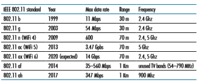
**Table 7.1**  ♦  Summary of IEEE 802.11 standards\[Diggavi 2004\]. 802.11ac and 802.11 ax base stations may transmit to multiple sta- tions simultaneously, and use “smart” antennas to adaptively beamform to target transmissions in the direction of a receiver. This decreases interference and increases the distance reached at a given data rate. The data rates shown in Table 7.1 are for an idealized environment, for example, a receiver close to the base station, with no interference—a scenario that we’re unlikely to experience in practice! So as the say- ing goes, YMMV: Your Mileage (or in this case your wireless data rate) May Vary.

## The 802.11 Wireless LAN Architecture
Figure 7.7 illustrates the principal components of the 802.11 wireless LAN architec- ture. The fundamental building block of the 802.11 architecture is the **basic service set (BSS)**. A BSS contains one or more wireless stations and a central **base station**, known as an **access point (AP)
 in 802.11 parlance. Figure 7.7 shows the AP in each of two BSSs connecting to an interconnection device (such as a switch or router), which in turn leads to the Internet. In a typical home network, there is one AP and one router (typically integrated together as one unit) that connects the BSS to the Internet.

As with Ethernet devices, each 802.11 wireless station has a 6-byte MAC address that is stored in the firmware of the station’s adapter (that is, 802.11 network interface card). Each AP also has a MAC address for its wireless interface. As with Ethernet, these MAC addresses are administered by IEEE and are (in theory) globally unique.

As noted in Section 7.1, wireless LANs that deploy APs are often referred to as **infrastructure wireless LANs**, with the “infrastructure” being the APs along with the
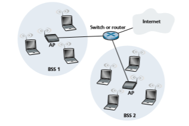
**Figure 7.7**  ♦  IEEE 802.11 LAN architecture
wired Ethernet infrastructure that interconnects the APs and a router. Figure 7.8 shows that IEEE 802.11 stations can also group themselves together to form an ad hoc net- work—a network with no central control and with no connections to the “outside world.” Here, the network is formed “on the fly,” by mobile devices that have found themselves in proximity to each other, that have a need to communicate, and that find no preexist- ing network infrastructure in their location. An ad hoc network might be formed when people with laptops get together (e.g., in a conference room, a train, or a car) and want to exchange data in the absence of a centralized AP. There has been tremendous interest in ad hoc networking, as communicating portable devices continue to proliferate. In this section, though, we’ll focus our attention on infrastructure wireless LANs.

**Channels and Association**

In 802.11, each wireless station needs to associate with an AP before it can send or receive network-layer data. Although all of the 802.11 standards use association, we’ll discuss this topic specifically in the context of IEEE 802.11b, g, n, ac, ax.

When a network administrator installs an AP, the administrator assigns a one- or two-word **Service Set Identifier (SSID)** to the access point. (When you choose Wi-Fi under Setting on your iPhone, for example, a list is displayed showing the SSID of each AP in range.) The administrator must also assign a channel number to the AP. To understand channel numbers, recall that 802.11 operates in the fre- quency range of 2.4 GHz to 2.4835 GHz. Within this 85 MHz band, 802.11 defines 11 partially overlapping channels. Any two channels are non-overlapping if and only if they are separated by four or more channels. In particular, the set of chan- nels 1, 6, and 11 is the only set of three non-overlapping channels. This means that an administrator could create a wireless LAN with an aggregate maximum trans- mission rate of three times the maximum transmission rate shown in Table 7.1 by installing three 802.11 APs at the same physical location, assigning channels 1, 6, and 11 to the APs, and interconnecting each of the APs with a switch.

**Figure 7.8**  ♦  An IEEE 802.11 ad hoc network

**BSS**Now that we have a basic understanding of 802.11 channels, let’s describe an interesting (and not completely uncommon) situation—that of a WiFi jungle. A **WiFi jungle** is any physical location where a wireless station receives a sufficiently strong signal from two or more APs. For example, in many cafés in New York City, a wire- less station can pick up a signal from numerous nearby APs. One of the APs might be managed by the café, while the other APs might be in residential apartments near the café. Each of these APs would likely be located in a different IP subnet and would have been independently assigned a channel.

Now suppose you enter such a WiFi jungle with your smartphone, tablet, or laptop, seeking wireless Internet access and a blueberry muffin. Suppose there are five APs in the WiFi jungle. To gain Internet access, your wireless device needs to join exactly one of the subnets and hence needs to **associate** with exactly one of the APs. Associating means the wireless device creates a virtual wire between itself and the AP. Specifically, only the associated AP will send data frames (that is, frames con- taining data, such as a datagram) to your wireless device, and your wireless device will send data frames into the Internet only through the associated AP. But how does your wireless device associate with a particular AP? And more fundamentally, how does your wireless device know which APs, if any, are out there in the jungle?

The 802.11 standard requires that an AP periodically send **beacon frames**, each of which includes the AP’s SSID and MAC address. Your wireless device, know- ing that APs are sending out beacon frames, scans the 11 channels, seeking beacon frames from any APs that may be out there (some of which may be transmitting on the same channel—it’s a jungle out there!). Having learned about available APs from the beacon frames, you (or your wireless device) select one of the APs for association.

The 802.11 standard does not specify an algorithm for selecting which of the available APs to associate with; that algorithm is left up to the designers of the 802.11 firmware and software in your wireless device. Typically, the device chooses the AP whose beacon frame is received with the highest signal strength. While a high signal strength is good (see, e.g., Figure 7.3), signal strength is not the only AP characteristic that will determine the performance a device receives. In particular, it’s possible that the selected AP may have a strong signal, but may be overloaded with other affiliated devices (that will need to share the wireless band- width at that AP), while an unloaded AP is not selected due to a slightly weaker signal. A number of alternative ways of choosing APs have thus recently been pro- posed \[Vasudevan 2005; Nicholson 2006; Sundaresan 2006\]. For an interesting and down-to-earth discussion of how signal strength is measured, see \[Bardwell 2004\].

The process of scanning channels and listening for beacon frames is known as **passive scanning** (see Figure 7.9a). A wireless device can also perform **active scanning**, by broadcasting a probe frame that will be received by all APs within the wireless device’s range, as shown in Figure 7.9b. APs respond to the probe request frame with a probe response frame. The wireless device can then choose the AP with which to associate from among the responding APs.

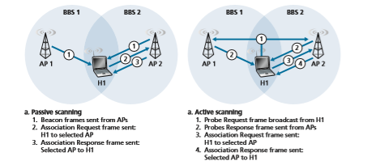
**Figure 7.9**  ♦  Active and passive scanning for access points
After selecting the AP with which to associate, the wireless device sends an asso- ciation request frame to the AP, and the AP responds with an association response frame. Note that this second request/response handshake is needed with active scan- ning, since an AP responding to the initial probe request frame doesn’t know which of the (possibly many) responding APs the device will choose to associate with, in much the same way that a DHCP client can choose from among multiple DHCP servers (see Figure 4.21). Once associated with an AP, the device will want to join the subnet (in the IP addressing sense of Section 4.3.3) to which the AP belongs. Thus, the device will typically send a DHCP discovery message (see Figure 4.21) into the subnet via the AP in order to obtain an IP address on the subnet. Once the address is obtained, the rest of the world then views that device simply as another host with an IP address in that subnet.

In order to create an association with a particular AP, the wireless device may be required to authenticate itself to the AP. 802.11 wireless LANs provide a number of alternatives for authentication and access. One approach, used by many companies, is to permit access to a wireless network based on a device’s MAC address. A second approach, used by many Internet cafés, employs usernames and passwords. In both cases, the AP typically communicates with an authentication server, relaying informa- tion between the wireless device and the authentication server using a protocol such as RADIUS \[RFC 2865\] or DIAMETER \[RFC 6733\]. Separating the authentication server from the AP allows one authentication server to serve many APs, centralizing the (often sensitive) decisions of authentication and access within the single server, and keepingAP costs and complexity low. We’ll see in chapter 8 that the new IEEE 802.11i protocol defining security aspects of the 802.11 protocol family takes precisely this approach.

## The 802.11 MAC Protocol
Once a wireless device is associated with an AP, it can start sending and receiving data frames to and from the access point. But because multiple wireless devices, or the AP itself may want to transmit data frames at the same time over the same channel, a multiple access protocol is needed to coordinate the transmissions. In the following, we'll refer to the devices or the AP as wireless “stations” that share the multiple access channel. As discussed in Chapter 6 and Section 7.2.1, broadly speaking there are three classes of multiple access protocols: channel partitioning (including CDMA), random access, and taking turns. Inspired by the huge success of Ethernet and its random access protocol, the designers of 802.11 chose a random access protocol for 802.11 wireless LANs. This random access protocol is referred to as **CSMA with collision avoidance**, or more succinctly as **CSMA/CA
. As with Ethernet’s CSMA/CD, the “CSMA” in CSMA/CA stands for “carrier sense multiple access,” meaning that each station senses the channel before transmitting, and refrains from transmitting when the channel is sensed busy. Although both Ethernet and 802.11 use carrier-sensing ran- dom access, the two MAC protocols have important differences. First, instead of using collision detection, 802.11 uses collision-avoidance techniques. Second, because of the relatively high bit error rates of wireless channels, 802.11 (unlike Ethernet) uses a link-layer acknowledgment/retransmission (ARQ) scheme. We’ll describe 802.11’s collision-avoidance and link-layer acknowledgment schemes below.

Recall from Sections 6.3.2 and 6.4.2 that with Ethernet’s collision-detection algorithm, an Ethernet station listens to the channel as it transmits. If, while transmit- ting, it detects that another station is also transmitting, it aborts its transmission and tries to transmit again after waiting a small, random amount of time. Unlike the 802.3 Ethernet protocol, the 802.11 MAC protocol does _not_ implement collision detection. There are two important reasons for this:

• The ability to detect collisions requires the ability to send (the station’s own signal) and receive (to determine whether another station is also transmitting) at the same time. Because the strength of the received signal is typically very small compared to the strength of the transmitted signal at the 802.11 adapter, it is costly to build hardware that can detect a collision.

• More importantly, even if the adapter could transmit and listen at the same time (and presumably abort transmission when it senses a busy channel), the adapter would still not be able to detect all collisions, due to the hidden terminal problem and fading, as discussed in Section 7.2.

Because 802.11wireless LANs do not use collision detection, once a station begins to transmit a frame, _it transmits the frame in its entirety_; that is, once a station

**Figure 7.10**  ♦  802.11 uses link-layer acknowledgments
gets started, there is no turning back. As one might expect, transmitting entire frames (particularly long frames) when collisions are prevalent can significantly degrade a multiple access protocol’s performance. In order to reduce the likelihood of collisions, 802.11 employs several collision-avoidance techniques, which we’ll shortly discuss.

Before considering collision avoidance, however, we’ll first need to examine 802.11’s **link-layer acknowledgment** scheme. Recall from Section 7.2 that when a station in a wireless LAN sends a frame, the frame may not reach the destination sta- tion intact for a variety of reasons. To deal with this non-negligible chance of failure, the 802.11 MAC protocol uses link-layer acknowledgments. As shown in Figure 7.10, when the destination station receives a frame that passes the CRC, it waits a short period of time known as the **Short Inter-frame Spacing (SIFS)** and then sends back an acknowledgment frame. If the transmitting station does not receive an acknowl- edgment within a given amount of time, it assumes that an error has occurred and retransmits the frame, using the CSMA/CA protocol to access the channel. If an acknowledgment is not received after some fixed number of retransmissions, the trans- mitting station gives up and discards the frame.Having discussed how 802.11 uses link-layer acknowledgments, we’re now in a position to describe the 802.11 CSMA/CA protocol. Suppose that a station (wireless device or an AP) has a frame to transmit.

1\. If initially the station senses the channel idle, it transmits its frame after a short period of time known as the **Distributed Inter-frame Space (DIFS)**; see Figure 7.10.

2\. Otherwise, the station chooses a random backoff value using binary exponen- tial backoff (as we encountered in Section 6.3.2) and counts down this value after DIFS when the channel is sensed idle. While the channel is sensed busy, the counter value remains frozen.

3\. When the counter reaches zero (note that this can only occur while the chan- nel is sensed idle), the station transmits the entire frame and then waits for an acknowledgment.

4\. If an acknowledgment is received, the transmitting station knows that its frame has been correctly received at the destination station. If the station has another frame to send, it begins the CSMA/CA protocol at step 2. If the acknowledg- ment isn’t received, the transmitting station reenters the backoff phase in step 2, with the random value chosen from a larger interval.

Recall that under Ethernet’s CSMA/CD, multiple access protocol (Section 6.3.2), a station begins transmitting as soon as the channel is sensed idle. With CSMA/CA, however, the station refrains from transmitting while counting down, even when it senses the channel to be idle. Why do CSMA/CD and CDMA/CA take such different approaches here?

To answer this question, let’s consider a scenario in which two stations each have a data frame to transmit, but neither station transmits immediately because each senses that a third station is already transmitting. With Ethernet’s CSMA/CD, the two stations would each transmit as soon as they detect that the third station has finished transmitting. This would cause a collision, which isn’t a serious issue in CSMA/CD, since both stations would abort their transmissions and thus avoid the useless transmissions of the remainders of their frames. In 802.11, however, the situ- ation is quite different. Because 802.11 does not detect a collision and abort trans- mission, a frame suffering a collision will be transmitted in its entirety. The goal in 802.11 is thus to avoid collisions whenever possible. In 802.11, if the two sta- tions sense the channel busy, they both immediately enter random backoff, hopefully choosing different backoff values. If these values are indeed different, once the chan- nel becomes idle, one of the two stations will begin transmitting before the other, and (if the two stations are not hidden from each other) the “losing station” will hear the “winning station’s” signal, freeze its counter, and refrain from transmitting until the winning station has completed its transmission. In this manner, a costly collision is avoided. Of course, collisions can still occur with 802.11 in this scenario: The two stations could be hidden from each other, or the two stations could choose randombackoff values that are close enough that the transmission from the station starting first have yet to reach the second station. Recall that we encountered this problem earlier in our discussion of random access algorithms in the context of Figure 6.12.

**Dealing with Hidden Terminals: RTS and CTS**

The 802.11 MAC protocol also includes a nifty (but optional) reservation scheme that helps avoid collisions even in the presence of hidden terminals. Let’s investi- gate this scheme in the context of Figure 7.11, which shows two wireless stations and one access point. Both of the wireless stations are within range of the AP (whose coverage is shown as a shaded circle) and both have associated with the AP. However, due to fading, the signal ranges of wireless stations are limited to the inte- riors of the shaded circles shown in Figure 7.11. Thus, each of the wireless stations is hidden from the other, although neither is hidden from the AP.

Let’s now consider why hidden terminals can be problematic. Suppose Station H1 is transmitting a frame and halfway through H1’s transmission, Station H2 wants to send a frame to the AP. H2, not hearing the transmission from H1, will first wait a DIFS interval and then transmit the frame, resulting in a collision. The channel will therefore be wasted during the entire period of H1’s transmission as well as during H2’s transmission.

In order to avoid this problem, the IEEE 802.11 protocol allows a station to use a short **Request to Send (RTS)** control frame and a short **Clear to Send (CTS)** control frame to _reserve_ access to the channel. When a sender wants to send a DATA frame, it can first send an RTS frame to the AP, indicating the total time required to transmit the DATA frame and the acknowledgment (ACK) frame. When the AP receives the RTS frame, it responds by broadcasting a CTS frame. This CTS frame
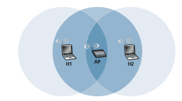
**Figure 7.11**  ♦   Hidden terminal example: H1 is hidden from H2, and vice versa

APH1 H2serves two purposes: It gives the sender explicit permission to send and also instructs the other stations not to send for the reserved duration.

Thus, in Figure 7.12, before transmitting a DATA frame, H1 first broadcasts an RTS frame, which is heard by all stations in its circle, including the AP. The AP then responds with a CTS frame, which is heard by all stations within its range, including H1 and H2. Station H2, having heard the CTS, refrains from transmitting for the time specified in the CTS frame. The RTS, CTS, DATA, and ACK frames are shown in Figure 7.12.
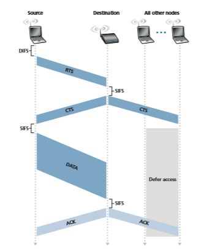
**Figure 7.12**  ♦  Collision avoidance using the RTS and CTS frames
The use of the RTS and CTS frames can improve performance in two important ways:

• The hidden station problem is mitigated, since a long DATA frame is transmitted only after the channel has been reserved.

• Because the RTS and CTS frames are short, a collision involving an RTS or CTS frame will last only for the duration of the short RTS or CTS frame. Once the RTS and CTS frames are correctly transmitted, the following DATA and ACK frames should be transmitted without collisions.

You are encouraged to check out the 802.11 animation in the textbook’s Web site. This interactive animation illustrates the CSMA/CA protocol, including the RTS/ CTS exchange sequence.

Although the RTS/CTS exchange can help reduce collisions, it also introduces delay and consumes channel resources. For this reason, the RTS/CTS exchange is only used (if at all) to reserve the channel for the transmission of a long DATA frame. In practice, each wireless station can set an RTS threshold such that the RTS/ CTS sequence is used only when the frame is longer than the threshold. For many wireless stations, the default RTS threshold value is larger than the maximum frame length, so the RTS/CTS sequence is skipped for all DATA frames sent.

**Using 802.11 as a Point-to-Point Link**

Our discussion so far has focused on the use of 802.11 in a multiple access setting. We should mention that if two nodes each have a directional antenna, they can point their directional antennas at each other and run the 802.11 protocol over what is essentially a point-to-point link. Given the low cost of commodity 802.11 hardware, the use of directional antennas and an increased transmission power allow 802.11 to be used as an inexpensive means of providing wireless point-to-point connections over tens of kilo- meters distance. \[Raman 2007\] describes one of the first such multi-hop wireless net- works, operating in the rural Ganges plains in India using point-to-point 802.11 links.

## The IEEE 802.11 Frame
 Although the 802.11 frame shares many similarities with an Ethernet frame, it also con- tains a number of fields that are specific to its use for wireless links. The 802.11 frame is shown in Figure 7.13. The numbers above each of the fields in the frame represent the lengths of the fields in _bytes_; the numbers above each of the subfields in the frame control field represent the lengths of the subfields in _bits_. Let’s now examine the fields in the frame as well as some of the more important subfields in the frame’s control field.

**Payload and CRC Fields**

At the heart of the frame is the payload, which typically consists of an IP datagram or an ARP packet. Although the field is permitted to be as long as 2,312 bytes, it istypically fewer than 1,500 bytes, holding an IP datagram or an ARP packet. As with an Ethernet frame, an 802.11 frame includes a 32-bit cyclic redundancy check (CRC) so that the receiver can detect bit errors in the received frame. As we’ve seen, bit errors are much more common in wireless LANs than in wired LANs, so the CRC is even more useful here.

**Address Fields**

Perhaps the most striking difference in the 802.11 frame is that it has _four_ address fields, each of which can hold a 6-byte MAC address. But why four address fields? Doesn’t a source MAC field and destination MAC field suffice, as they do for Ethernet? It turns out that three address fields are needed for internetworking purposes—specifically, for moving the network-layer datagram from a wireless sta- tion through an AP to a router interface. The fourth address field is used when APs forward frames to each other in ad hoc mode. Since we are only considering infra- structure networks here, let’s focus our attention on the first three address fields. The 802.11 standard defines these fields as follows:

• Address 2 is the MAC address of the station that transmits the frame. Thus, if a wireless station transmits the frame, that station’s MAC address is inserted in the address 2 field. Similarly, if an AP transmits the frame, the AP’s MAC address is inserted in the address 2 field.

• Address 1 is the MAC address of the wireless station that is to receive the frame. Thus if a mobile wireless station transmits the frame, address 1 contains the MAC address of the destination AP. Similarly, if an AP transmits the frame, address 1 contains the MAC address of the destination wireless station.

• To understand address 3, recall that the BSS (consisting of the AP and wireless stations) is part of a subnet, and that this subnet connects to other subnets via some router interface. Address 3 contains the MAC address of this router interface.

**Figure 7.13**  ♦  The 802.11 frame
**Frame control field expanded (numbers indicate field length in bits):**To gain further insight into the purpose of address 3, let’s walk through an inter- networking example in the context of Figure 7.14. In this figure, there are two APs, each of which is responsible for a number of wireless stations. Each of the APs has a direct connection to a router, which in turn connects to the global Internet. We should keep in mind that an AP is a link-layer device, and thus neither “speaks” IP nor understands IP addresses. Consider now moving a datagram from the router interface R1 to the wireless Station H1. The router is not aware that there is an AP between it and H1; from the router’s perspective, H1 is just a host in one of the subnets to which it (the router) is connected.

• The router, which knows the IP address of H1 (from the destination address of the datagram), uses ARP to determine the MAC address of H1, just as in an ordinary Eth- ernet LAN. After obtaining H1’s MAC address, router interface R1 encapsulates the datagram within an Ethernet frame. The source address field of this frame contains R1’s MAC address, and the destination address field contains H1’s MAC address.

• When the Ethernet frame arrives at the AP, the AP converts the 802.3 Ethernet frame to an 802.11 frame before transmitting the frame into the wireless chan- nel. The AP fills in address 1 and address 2 with H1’s MAC address and its own MAC address, respectively, as described above. For address 3, the AP inserts the MAC address of R1. In this manner, H1 can determine (from address 3) the MAC address of the router interface that sent the datagram into the subnet.
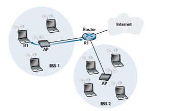
**Figure 7.14**  ♦   The use of address fields in 802.11 frames: Sending frames between H1 and R1
Now consider what happens when the wireless station H1 responds by moving a datagram from H1 to R1.

• H1 creates an 802.11 frame, filling the fields for address 1 and address 2 with the AP’s MAC address and H1’s MAC address, respectively, as described above. For address 3, H1 inserts R1’s MAC address.

• When the AP receives the 802.11 frame, it converts the frame to an Ethernet frame. The source address field for this frame is H1’s MAC address, and the destination address field is R1’s MAC address. Thus, address 3 allows the AP to determine the appropriate destination MAC address when constructing the Ethernet frame.

In summary, address 3 plays a crucial role for internetworking the BSS with a wired LAN.

**Sequence Number, Duration, and Frame Control Fields**

Recall that in 802.11, whenever a station correctly receives a frame from another sta- tion, it sends back an acknowledgment. Because acknowledgments can get lost, the sending station may send multiple copies of a given frame. As we saw in our discus- sion of the rdt2.1 protocol (Section 3.4.1), the use of sequence numbers allows the receiver to distinguish between a newly transmitted frame and the retransmission of a previous frame. The sequence number field in the 802.11 frame thus serves exactly the same purpose here at the link layer as it did in the transport layer in Chapter 3.

Recall that the 802.11 protocol allows a transmitting station to reserve the chan- nel for a period of time that includes the time to transmit its data frame and the time to transmit an acknowledgment. This duration value is included in the frame’s dura- tion field (both for data frames and for the RTS and CTS frames).

As shown in Figure 7.13, the frame control field includes many subfields. We’ll say just a few words about some of the more important subfields; for a more complete discussion, you are encouraged to consult the 802.11 specification \[Held 2001; Crow 1997; IEEE 802.11 1999\]. The _type_ and _subtype_ fields are used to distinguish the asso- ciation, RTS, CTS, ACK, and data frames. The _to_ and _from_ fields are used to define the meanings of the different address fields. (These meanings change depending on whether ad hoc or infrastructure modes are used and, in the case of infrastructure mode, whether a wireless station or an AP is sending the frame.) Finally the WEP field indicates whether encryption is being used or not (WEP is discussed in Chapter 8).

## Mobility in the Same IP Subnet
 In order to increase the physical range of a wireless LAN, companies and universities will often deploy multiple BSSs within the same IP subnet. This naturally raises the issue of mobility among the BSSs—how do wireless stations seamlessly move from one BSS to another while maintaining ongoing TCP sessions? As we’ll see in this subsection, mobility can be handled in a relatively straightforward manner when the BSSs are partof the subnet. When stations move between subnets, more sophisticated mobility man- agement protocols will be needed, such as those we’ll study in Sections 7.5 and 7.6.

Let’s now look at a specific example of mobility between BSSs in the same sub- net. Figure 7.15 shows two interconnected BSSs with a host, H1, moving from BSS1 to BSS2. Because in this example the interconnection device that connects the two BSSs is _not_ a router, all of the stations in the two BSSs, including the APs, belong to the same IP subnet. Thus, when H1 moves from BSS1 to BSS2, it may keep its IP address and all of its ongoing TCP connections. If the interconnection device were a router, then H1 would have to obtain a new IP address in the subnet in which it was moving. This address change would disrupt (and eventually terminate) any on-going TCP connections at H1. In Section 7.6, we’ll see how a network-layer mobility pro- tocol, such as mobile IP, can be used to avoid this problem.

But what specifically happens when H1 moves from BSS1 to BSS2? As H1 wanders away from AP1, H1 detects a weakening signal from AP1 and starts to scan for a stronger signal. H1 receives beacon frames from AP2 (which in many corporate and university settings will have the same SSID as AP1). H1 then disassociates with AP1 and associates with AP2, while keeping its IP address and maintaining its ongoing TCP sessions.

This addresses the handover problem from the host and AP viewpoint. But what about the switch in Figure 7.15? How does it know that the host has moved from one AP to another? As you may recall from Chapter 6, switches are “self-learning” and automatically build their forwarding tables. This self-learning feature nicely handles occasional moves (for example, when an employee gets transferred from one depart- ment to another); however, switches were not designed to support highly mobile users who want to maintain TCP connections while moving between BSSs. To appreciate the problem here, recall that before the move, the switch has an entry in its forwarding table that pairs H1’s MAC address with the outgoing switch interface through which H1 can be reached. If H1 is initially in BSS1, then a datagram des- tined to H1 will be directed to H1 via AP1. Once H1 associates with BSS2, however, its frames should be directed to AP2. One solution (a bit of a hack, really) is for AP2 to send a broadcast Ethernet frame with H1’s source address to the switch just after
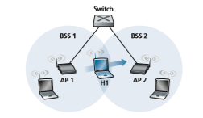
**Figure 7.15**  ♦  Mobility in the same subnet
the new association. When the switch receives the frame, it updates its forwarding table, allowing H1 to be reached via AP2. The 802.11f standards group is developing an inter-AP protocol to handle these and related issues.

Our discussion above has focused on mobility with the same LAN subnet. Recall that VLANs, which we studied in Section 6.4.4, can be used to connect together islands of LANs into a large virtual LAN that can span a large geographical region. Mobility among base stations within such a VLAN can be handled in exactly the same manner as above \[Yu 2011\].

**LOCATION DISCOVERY: GPS AND WIFI POSITIONING**

Many of the most useful and important smartphone apps today are location-based mobile apps, including Foursquare, Yelp, Uber, Pokémon Go, and Waze. These software apps all make use of an API that allows them to extract their current geographi- cal position directly from the smartphone. Have you ever wondered how your smart- phone obtains its geographical position? Today, it is done by combining two systems, the **Global Positioning System (GPS)** and the **WiFi Positioning System (WPS)**.

The GPS, with a constellation of 30+ satellites, broadcasts satellite location and timing information, which in turn is used by each GPS receiver to estimate its geoloca- tion. The United States government created the system, maintains it, and makes it freely accessible to anyone with a GPS receiver. The satellites have very stable atomic clocks that are synchronized with one another and with ground clocks. The satellites also know their locations with great precision. Each GPS satellite continuously broadcasts a radio signal containing its current time and position. If a GPS receiver obtains this information from at least four satellites, it can solve triangulation equations to estimate its position.

GPS, however, cannot always provide accurate geolocations if it does not have line-of-sight with at least four GPS satellites or when there is interference from other high-frequency communication systems. This is particularly true in urban environments, where tall buildings frequently block GPS signals. This is where WiFi positioning systems come to the rescue. WiFi positioning systems make use of databases of WiFi access points, which are independently maintained by various Internet companies, including Google, Apple, and Microsoft. Each database contains information about millions of WiFi access points, including each access point’s SSID and an estimate of its geographic location. To understand how a WiFi positioning system makes use of such a database, consider an Android smartphone along with the Google location ser- vice. From each nearby access point, the smartphone receives and measures the signal strength of beacon signals (see Section 7.3.1), which contain the access point’s SSID. The smartphone can therefore continually send messages to the Google location service (in the cloud) that include the SSIDs of nearby access points and the corresponding signal strengths. It will also send its GPS position (obtained via the satellite broadcast

**CASE HISTORY**signals, as described above) when available. Using the signal-strength information, Google will estimate the distance between the smartphone and each of the WiFi access points. Leveraging these estimated distances, it can then solve triangulation equations to estimate the smartphone’s geolocation. Finally, this WiFi-based estimate is combined with the GPS satellite-based estimate to form an aggregate estimate, which is then sent back to the smartphone and used by the location-based mobile apps.

But you may still be wondering how Google (and Apple, Microsoft, and so on) obtain and maintain the database of access points, and in particular, the access point’s geographic location? Recall that for a given access point, every nearby Android smartphone will send to the Google location service the strength of the signal received from the access point as well as the smartphone’s estimated location. Given that thousands of smartphones may be passing by the access point during any single day, Google’s location service will have _lots_ of data at its disposition to use in estimating the access point’s position, again by solving triangulation equations. Thus, the access points help the smartphones determine their locations, and in turn the smartphones help the access points determine their locations!

## Advanced Features in 802.11
 We’ll wrap up our coverage of 802.11 with a short discussion of two advanced capabili- ties found in 802.11 networks. As we’ll see, these capabilities are _not_ completely speci- fied in the 802.11 standard, but rather are made possible by mechanisms specified in the standard. This allows different vendors to implement these capabilities using their own (proprietary) approaches, presumably giving them an edge over the competition.

**802.11 Rate Adaptation**

We saw earlier in Figure 7.3 that different modulation techniques (with the different transmission rates that they provide) are appropriate for different SNR scenarios. Consider, for example, a mobile 802.11 user who is initially 20 meters away from the base station, with a high signal-to-noise ratio. Given the high SNR, the user can communicate with the base station using a physical-layer modulation technique that provides high transmission rates while maintaining a low BER. This is one happy user! Suppose now that the user becomes mobile, walking away from the base sta- tion, with the SNR falling as the distance from the base station increases. In this case, if the modulation technique used in the 802.11 protocol operating between the base station and the user does not change, the BER will become unacceptably high as the SNR decreases, and eventually no transmitted frames will be received correctly.

For this reason, some 802.11 implementations have a rate adaptation capability that adaptively selects the underlying physical-layer modulation technique to use based on current or recent channel characteristics. If a node sends two frames in a row without receiving an acknowledgment (an implicit indication of bit errors onthe channel), the transmission rate falls back to the next lower rate. If 10 frames in a row are acknowledged, or if a timer that tracks the time since the last fallback expires, the transmission rate increases to the next higher rate. This rate adapta- tion mechanism shares the same “probing” philosophy as TCP’s congestion-control mechanism—when conditions are good (reflected by ACK receipts), the transmis- sion rate is increased until something “bad” happens (the lack of ACK receipts); when something “bad” happens, the transmission rate is reduced. 802.11 rate adapta- tion and TCP congestion control are thus similar to the young child who is constantly pushing his/her parents for more and more (say candy for a young child, later curfew hours for the teenager) until the parents finally say “Enough!” and the child backs off (only to try again later after conditions have hopefully improved!). A number of other schemes have also been proposed to improve on this basic automatic rate- adjustment scheme \[Kamerman 1997; Holland 2001; Lacage 2004\].

**Power Management**

Power is a precious resource in mobile devices, and thus the 802.11 standard provides power-management capabilities that allow 802.11 nodes to minimize the amount of time that their sense, transmit, and receive functions and other circuitry need to be “on.” 802.11 power management operates as follows. A node is able to explicitly alternate between sleep and wake states (not unlike a sleepy student in a classroom!). A node indicates to the access point that it will be going to sleep by setting the power-management bit in the header of an 802.11 frame to 1. A timer in the node is then set to wake up the node just before the AP is scheduled to send its beacon frame (recall that an AP typically sends a beacon frame every 100 msec). Since the AP knows from the set power-transmission bit that the node is going to sleep, it (the AP) knows that it should not send any frames to that node, and will buffer any frames destined for the sleeping host for later transmission.

A node will wake up just before the AP sends a beacon frame, and quickly enter the fully active state (unlike the sleepy student, this wakeup requires only 250 microseconds \[Kamerman 1997\]!). The beacon frames sent out by the AP contain a list of nodes whose frames have been buffered at the AP. If there are no buffered frames for the node, it can go back to sleep. Otherwise, the node can explicitly request that the buffered frames be sent by sending a polling message to the AP. With an inter-beacon time of 100 msec, a wakeup time of 250 microseconds, and a similarly small time to receive a beacon frame and check to ensure that there are no buffered frames, a node that has no frames to send or receive can be asleep 99% of the time, resulting in a significant energy savings.

## Personal Area Networks: Bluetooth\* Bluetooth
 networks seem to have quickly become part of everyday life. Perhaps you’ve used a Bluetooth network as a “cable replacement” technology to interconnect

\*The terms used below may differ from the terms found in the official Bluetooth Specification. The terms used in the official specifica- tion DO NOT align with Pearson’s commitment to promoting diversity, equality, and inclusion, and protecting against bias and stereo- typing in the global population of the learners we serve.your computer with a wireless keyboard, mouse, or other peripheral device. Or per- haps you’ve used a Bluetooth network to connect your wireless earbuds, speaker, watch, or health monitoring band to your smartphone or to connect your smartphone to a car’s audio system. In all of these cases, Bluetooth operates over short ranges (tens of meters or less), at low power, and at low cost. For this reason, Bluetooth networks are sometimes referred to as **wireless personal area networks** (WPANs) or **piconets.**

Although Bluetooth networks are small and relatively simple by design, they’re packed with many of the link-level networking techniques that we’ve studied earlier including time division multiplexing (TDM) and frequency division (Section 6.3.1), randomized backoff (Section 6.3.2), polling (Section 6.3.3), error detection _and_ cor- rection (Section 6.2), reliable data transfer via ACKs and NAKS (Section 3.4.1). And that’s just considering Bluetooth’s link layer!

Bluetooth networks operate in the unlicensed 2.4 GHz Industrial, Scientific and Medical (ISM) radio band along with other home appliances such as micro- waves, garage door openers, and cordless phones. As a result, Bluetooth networks are designed explicitly with noise and interference in mind. The Bluetooth wire- less channel is operated in a TDM manner, with time slots of 625 microseconds. During each time slot, a sender transmits on one of 79 channels, with the channel (frequency) changing in a known but pseudo-random manner from slot to slot. This form of channel hopping, known as **frequency-hopping spread spectrum** (FHSS), is used so that interference from another device or appliance operating in the ISM band will only interfere with Bluetooth communications in at most a subset of the slots. Bluetooth data rates can reach up to 3 Mbps.

Bluetooth networks are ad hoc networks—no network infrastructure (e.g., an access point) is needed. Instead, Bluetooth devices must organize _themselves_ into a piconet of up to eight active devices, as shown in Figure 7.16. One of these devices
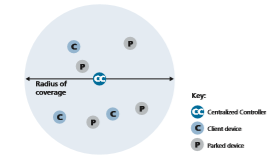
**Figure 7.16**  ♦  A Bluetooth piconet
is designated as the centralized controller, with the remaining devices acting as clients. The centralized controller node truly rules the piconet—its clock determines time in the piconet (e.g., determines TDM slot boundaries), it determine the slot-to-slot frequency hopping sequence, it controls entry of client devices into the piconet, it controls the power (100 mW, 2.5mW, or 1 mW) at which client devices transmit; and uses polling to grant clients permission to transmit once admitted to the network. In addition to the active devices, there can also be up to 255 “parked” devices in the piconet. These parked devices are often in some form of “sleep mode” to conserve energy (as we saw with 802.11 power management) and will awaken periodically, according to the centralized controller’s schedule, to receive beacon messages from the centralized controller. A parked device cannot communicate until its status has been changed from parked to active by the centralized controller node.

Because Bluetooth ad hoc networks must be **self-organizing**, it’s worth looking into how they bootstrap their network structure. When a centralized controller node wants to form a Bluetooth network, it must first determine which other Bluetooth devices are within range; this is the **neighbor discovery** problem. The centralized controller does this by broadcasting a series of 32 inquiry messages, each on a dif- ferent frequency channel, and repeats the transmission sequence for up to 128 times. A client device listens on its chosen frequency, hoping to hear one of the centralized controller’s inquiry messages on this frequency. When it hears an inquiry message, it backs off a random amount of time between 0 and 0.3 seconds (to avoid colli- sions with other responding nodes, reminiscent of Ethernet’s binary backoff) and then responds to the centralized controller with a message containing its device ID.

Once the Bluetooth centralized controller has discovered all of the potential clients within range, it then invites those clients that it wishes to join the piconet. This second phase is known as **Bluetooth paging**, and is reminiscent of 802.11 clients associating with a base station. Through the paging process, the centralized controller will inform the client of the frequency-hopping pattern to be used, and the sender’s clock. The centralized controller begins the paging process by again send- ing 32 identical paging invitation messages, each now addressed to a specific client, but again using different frequencies, since that client has yet to learn the frequency- hopping pattern. Once the client replies with an ACK message to the paging invita- tion message, the centralized controller sends frequency-hopping information, clock synchronization information and an active member address to the client, and then finally polls the client, now using the frequency-hopping pattern, to ensure that the client is connected into the network.

In our discussion above, we have only touched on Bluetooth’s wireless net- working. Higher level protocols provide for reliable data packet transfer, circuit- like streaming of audio and video, changing transmission power levels, changing active/parked state (and other states), and more. More recent versions of Bluetooth have addressed low energy and security considerations. For more information about Bluetooth, the interested reader should consult \[Bisdikian 2001, Colbach 2017, and Bluetooth 2020\].# Cellular Networks: 4G and 5G
In the previous section, we examined how a host can access the Internet when within the vicinity of an 802.11 WiFi access point (AP). But as we’ve seen, APs have small coverage areas, and a host certainly will not be able to associate with every AP it encounters. As a result, WiFi access is hardly ubiquitous for a user on the move.

By contrast, 4G cellular network access has rapidly become pervasive. A recent measurement study of more than one million US mobile cellular network subscribers found that they can find 4G signals more than 90% of the time, with download speeds of 20 Mbps and higher. Users of Korea’s three major cellular carriers are able to find a 4G signal between 95 and 99.5% of the time \[Open Signal 2019\]. As a result, it is now commonplace to stream HD videos or participate in videoconferences while on the move in a car, bus, or high-speed train. The ubiquity of 4G Internet access has also enabled myriad new IoT applications such as Internet-connected shared bike and scooter systems, and smartphone applications such as mobile payments (commonplace in China since 2018) and Internet-based messaging (WeChat, WhatsApp, and more).

The term _cellular_ refers to the fact that the region covered by a cellular network is partitioned into a number of geographic coverage areas, known as **cells.** Each cell contains a **base station** that transmits signals to, and receives signals from, the **mobile devices** currently in its cell. The coverage area of a cell depends on many factors, includ- ing the transmitting power of the base station, the transmitting power of the devices, obstructing buildings in the cell, and the height and type of the base station antennas.

In this section, we provide an overview of the current 4G and emerging 5G cellular networks. We’ll consider the wireless first hop between the mobile device and the base station, as well as the cellular carrier’s all-IP core network that connects the wireless first hop into the carrier’s network, other carrier networks, and the larger Internet. Perhaps surprisingly (given the origins of mobile cellular networks in the telephony world, which had a _very_ different network architecture from the Internet), we’ll encounter many of the architectural principles in 4G networks that we encoun- tered in our Internet-focused studies in Chapters 1–6, including protocol layering, an edge/core distinction, the interconnection of multiple provider networks to form a global “network of networks,” and the clear separation of data and control planes with logically centralized control. We’ll now see these principles through the lens of mobile cellular networks (rather than through an Internet lens) and thus see these principles instantiated in different ways. And of course, with a carrier’s network having an all- IP core, we’ll also encounter many of the Internet protocols that we now know well. We’ll cover additional 4G topics—mobility management in Section 7.6, and 4G secu- rity in Section 8.8—later, after developing the basic principles needed for these topics.

Our discussion here of 4G and 5G networks will be relatively brief. Mobile cellular networking is an area with great breadth and depth, with many universi- ties offering several courses on the topic. Readers seeking a deeper understanding are encouraged to see \[Goodman 1997; Kaaranen 2001; Lin 2001; Korhonen 2003;Schiller 2003; Palat 2009; Scourias 2012; Turner 2012; Akyildiz 2010\], as well as the particularly excellent and exhaustive books \[Mouly 1992; Sauter 2014\].

Just as Internet RFCs define Internet-standard architecture and protocols, 4G and 5G networks are also defined by standards documents known as Technical Spec- ifications. These documents are freely available online at \[3GPP 2020\]. Just like RFCs, technical specifications can make for rather dense and detailed reading. But when you have a question, they are the definitive source for answers!

## 4G LTE Cellular Networks: Architecture and Elements
The 4G networks that are pervasive as of this writing in 2020 implement the 4G Long-Term Evolution standard, or more succinctly **4G LTE
. In this section, we’ll describe 4G LTE networks. Figure 7.17 shows the major elements of the 4G LTE network architecture. The network broadly divides into the radio network at the cellular network’s edge and the core network. All network elements communicate with each other using the IP protocol we studied in Chapter 4. As with earlier 2G and 3G networks, 4G LTE is full of rather obtuse acronyms and element names. We’ll try to cut through that jumble by first focusing on element functions and how the various elements of a 4G LTE network interact with each other in both the data and the control planes:

• **Mobile Device.** This is a smartphone, tablet, laptop, or IoT device that connects into a cellular carrier’s network. This is where applications such as web browsers, map apps, voice and videoconference apps, mobile payment apps, and so much more are run. The mobile device typically implements the full 5-layer Internet pro- tocol stack, including the transport and application layers, as we saw with hosts at the Internet’s network edge. The mobile device is a network endpoint, with an IP address (obtained through NAT, as we’ll see). The mobile device also has a glob- ally unique 64-bit identifier called the **International Mobile Subscriber Iden- tity (IMSI)**, which is stored on its SIM (Subscriber Identity Module) card. The IMSI identifies the subscriber in the worldwide cellular carrier network system, including the country and home cellular carrier network to which the subscriber belongs. In some ways, the IMSI is analogous to a MAC address. The SIM card also stores information about the services that the subscriber is able to access and encryption key information for that subscriber. In the official 4G LTE jargon, the mobile device is referred to as **User Equipment (UE)**. However, in this text- book, we’ll use the more reader-friendly term “mobile device” throughout. We also note here that a mobile device is not always mobile; for example, the device might be a fixed temperature sensor or a surveillance camera.

• **Base Station.** The base station sits at the “edge” of the carrier’s network and is responsible for managing the wireless radio resources and the mobile devices with its coverage area (shown as a hexagonal cell in Figure 7.17). As we’ll see, a mobile device will interact with a base station to attach to the carrier’s network. The base station coordinates device authentication and allocation of resources(channel access) in the radio access network. In this sense, cellular base station functions are comparable (but by no means identical) to those of APs in wireless LANs. But cellular base stations have several other important roles not found in wireless LANs. In particular, base stations create device-specific IP tunnels from the mobile device to gateways and interact among themselves to handle device mobility among cells. Nearby base stations also coordinate among themselves to manage the radio spectrum to minimize interference between cells. In the offi- cial 4G LTE terminology, the base station is referred to as an “**eNode-B**,” which is rather opaque and non-descriptive. In this textbook, we will instead use the reader-friendlier term “base station” throughout.

As an aside, if you find LTE terminology a bit opaque, you aren’t alone! The etymology of “eNode-B” is rooted in earlier 3G terminology, where network function points were referred to as “nodes,” with “B” harkening back to earlier “Base Station (BS)” 1G terminology or “Base Transceiver Station (BTS)” in 2G terminology. 4G LTE is an “e”volution over 3G, and hence, an “e” now precedes “Node-B” in 4G LTE terminology. This name opaqueness shows no signs in stopping! In 5G systems, eNode-B functions are now referred to as “ng-eNB”; perhaps you can guess what that acronym stands for!

• **Home Subscriber Server (HSS).** As shown in Figure 7.18, the HSS is a control-plane element. The HSS is a database, storing information about the mobile devices for which the HSS’s network is their home network. It is used in conjunction with the MME (discussed below) for device authentication.

• **Serving Gateway (S-GW), Packet Data Network Gateway (P-GW), and other network routers.** As shown in Figure 7.18, the Serving Gateway and the Packet Data Network Gateway are two routers (often collocated in practice) that
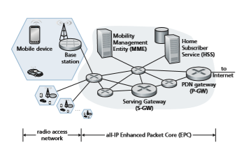
**Figure 7.17**  ♦  Elements of the 4G LTE architecturelie on the data path between the mobile device and the Internet. The PDN Gateway also provides NAT IP addresses to mobile devices and performs NAT functions (see Section 4.3.4). The PDN Gateway is the last LTE element that a datagram originating at a mobile device encounters before entering the larger Internet. To the outside world, the P-GW looks like any other gateway router; the mobility of the mobile nodes within the cellular carrier’s LTE network is hidden from the outside world behind the P-GW. In addition to these gateway routers, a cellular carrier’s all-IP core will have additional routers whose role is similar to that of traditional IP routers—to forward IP datagrams among themselves along paths that will typically terminate at elements of the LTE core network.

• **Mobility Management Entity (MME).** The MME is also a control-plane element, as shown in Figure 7.18. Along with the HSS, it plays an important role in authen- ticating a device wanting to connect into its network. It also sets up the tunnels on the data path from/to the device and the PDN Internet gateway router, and maintains information about an active mobile device’s cell location within the carrier’s cel- lular network. But, as shown in Figure 7.18, it is not in the forwarding path for the mobile device’s datagrams being sent to and from the Internet.

_Authentication._ It is important for the network and the mobile device attaching to the network to _mutually_ authenticate each other—for the network to know that the attaching device is indeed the device associated with a given IMSI, and for the mobile device to know that the network to which it is attaching is also a legitimate cellular carrier network. We will cover authentication in Chapter 8 and cover 4G authentication in Section 8.8. Here, we simply note that the MME plays a middleman role between the mobile and Home Subscriber Service (HSS) in the mobile’s home network. Specifically, after receiving an attach request from mobile device, the local MME contacts the HSS in the mobile’s home network. The mobile’s home HSS then returns enough encrypted infor- mation to the local MME to prove to the mobile device that the home HSS is performing authentication through this MME, and for the mobile device to prove to the MME that it is indeed the mobile associated with that IMSI. When a mobile device is attached to its home network, the HSS to be contacted dur- ing authentication is located within that same home network. However, when a mobile device is roaming on a visited network operated by a different cellular network carrier, the MME in that roaming network will need to contact the HSS in the mobile device’s home network.

_Path setup._ As shown in the bottom half of Figure 7.18, the data path from the mobile device to the carrier’s gateway router consists of a wireless first hop between the mobile device and the base station, and concatenated IP tunnels between the base station and the Serving Gateway, and the Serving Gateway and the PDN Gateway. Tunnels are setup under the control of the MME and used for data forwarding (rather than direct forwarding among network routers) to facilitate device mobility—when a device moves, only the tunnel endpoint

**Figure 7.18**  ♦  LTE data-plane and control-plane elements

terminating at the base station needs to be changed, while other tunnel end- points, and the Quality of Service associated with a tunnel, remain unchanged.

_Cell location tracking._ As the device moves between cells, the base stations will update the MME on the device’s location. If the mobile device is in a sleep mode but nonetheless moving between cells, the base stations can no longer track the device’s location. In this case, it will be the responsibility of the MME to locate the device for wakeup, through a process known as **paging.**

Table 7.2 summarizes the key LTE architectural elements that we have dis- cussed above and compares these functions with those we encountered in our study of WiFi wireless LANs (WLANs).
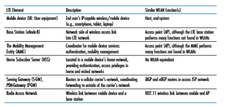
**Table 7.2**  ♦  LTE Elements, and similar WLAN (WiFi) functionsTHE ARCHITECTURAL EVOLUTION FROM 2G TO 3G TO 4G

In a relatively short span of 20 years, cellular carrier networks have undergone an astonishing transition from being almost exclusively circuit-switched telephone net- works to being all-IP packet-switched data networks which include voice as just one of many applications. How did this transition happen from an architectural stand- point? Was there a “flag day,” when the previous telephony-oriented networks were turned “off” and the all-IP cellular network was turned “on”? Or did elements in the previous telephony-oriented networks begin taking on dual circuit (legacy) and packet (new) functionality, as we saw with the IPv4-to-IPv6 transition in Section 4.3.5?

Figure 7.19 is taken from the earlier 7th edition of this textbook, which covered both 2G and 3G cellular networks. (We have retired this historical material, which is still available on this book’s website, in favor of a deeper coverage of 4G LTE in this 8th edition). Although the 2G network is a circuit-switched mobile telephone network, a comparison of Figures 7.17 and 7.19 illustrates a similar conceptual structure, albeit for voice rather than for data services—a wireless edge controlled by a base station, a gateway from the carrier’s network to the outside world, and aggregation points between the base stations and the gateway.

**CASE HISTORY**

**Figure 7.19**  ♦   Elements of the 2G cellular architecture, supporting circuit-switched voice service with the carrier’s core networkGateway Mobile Switching Center
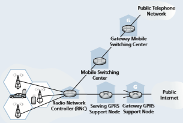
**Figure 7.20**  ♦   3G system architecture: supporting separate circuit-switched voice service and packet-switched data service with the carrier’s core network

Figure 7.20 (also taken from the 7th edition of this textbook) shows the main archi- tectural components of the 3G cellular architecture, which supports both circuit-switched voice service _and_ packet-switched data services. Here, the transition from a voice-only network to a combined voice and data network is clear: the existing core 2G cellular voice network elements remained untouched. _However, additional cellular data func- tionality was added in parallel to, and functioned independently from, the existing core voice network at that time._ As shown in Figure 7.20, the splitting point into these two separate core voice and data networks happened at the network edge, at the base station in the radio access network. The alternative—integrating new data services directly into the core elements of the existing cellular voice network—would have raised the same challenges encountered in integrating new (IPv6) and legacy (IPv4) technolo- gies in the Internet. The carriers also wanted to leverage and exploit their considerable investment of existing infrastructure (and profitable services!) in their existing cellular voice network.## LTE Protocols Stacks
 Since the 4G LTE architecture is an all-IP architecture, we’re already very famil- iar with the higher-layer protocols in the LTE protocol stack, in particular IP, TCP, UDP, and various application layer protocols, from our studies in Chapters 2 through 5. Consequently, the new LTE protocols that we’ll focus on here are pri- marily at the link and physical layers, and in mobility management.

Figure 7.21 shows the user-plane protocol stacks at the LTE mobile node, the base station, and the serving gateway. We’ll touch on several of LTE’s control-plane protocols later when we study LTE mobility management (Section 7.6) and security (Section 8.8). As we can see from Figure 7.21, most of the new and interesting user- plane protocol activity is happening at the wireless radio link between the mobile device and the base station.

LTE divides the mobile device’s link layer into three sublayers:

• _Packet Data Convergence._ This uppermost sublayer of the link layer sits just below IP. The Packet Data Convergence Protocol (PDCP) \[3GPP PDCP 2019\] performs IP header/compression in order to decrease the number of bits sent over the wireless link, and encryption/decryption of the IP datagram using keys that were established via signaling messages between the LTE mobile device and the Mobility Management Entity (MME) when the mobile device first attached to the network; we’ll cover aspects of LTE security in Section 8.8.2.

• _Radio Link Control._ The Radio Link Control (RLC) Protocol \[3GPP RLCP 2018\] performs two important functions: _(i)_ fragmenting (on the sending side) and reassembly (on the receiving) of IP datagrams that are too large to fit into

**Figure 7.21**  ♦  LTE data-plane protocol stacksthe underlying link-layer frames, and _(ii)_ link-layer reliable data transfer at the through the use of an ACK/NAK-based ARQ protocol. Recall the we’ve studied the basic elements of ARQ protocols in Section 3.4.1.

• _Medium Access Control (MAC)._ The MAC layer performs transmission sched- uling, that is, the requesting and use of the radio transmission slots described in Section 7.4.4. The MAC sublayer also performs additional error detection/ correction functions, including the use of redundant bit transmission as a forward error-correction technique. The amount of redundancy can be adapted to channel conditions.

Figure 7.21 also shows the use of tunnels in the user data path. As discussed above, these tunnels are established, under MME control, when the mobile device first attaches to the network. Each tunnel between two endpoints has a unique tunnel endpoint identifier (TEID). When the base station receives datagrams from the mobile device, it encapsulates them using the GPRS Tunneling Protocol \[3GPP GTPv1-U 2019\], including the TEID, and sends them in UDP segments to the Serving Gateway at the other end of the tunnel. On the receiving side, the base station decapsulates tun- neled UDP datagrams, extracts the encapsulated IP datagram destined for the mobile device, and forwards that IP datagram over the wireless hop to the mobile device.

## LTE Radio Access Network
 LTE uses a combination of frequency division multiplexing and time division multi- plexing on the downstream channel, known as orthogonal frequency division multi- plexing (OFDM) \[Hwang 2009\]. (The term “orthogonal” comes from the fact the signals being sent on different frequency channels are created so that they interfere very little with each other, even when channel frequencies are tightly spaced). In LTE, each active mobile device is allocated one or more 0.5 ms time slots in one or more of the channel frequencies. Figure 7.22 shows an allocation of eight time slots over four frequencies. By being allocated increasingly more time slots (whether on the same frequency or on different frequencies), a mobile device is able to achieve increasingly higher transmission rates. Slot (re)allocation among mobile devices can be performed as often as once every millisecond. Different modulation schemes can also be used to change the transmission rate; see our earlier discussion of Figure 7.3 and dynamic selection of modulation schemes in WiFi networks.

The particular allocation of time slots to mobile devices is not mandated by the LTE standard. Instead, the decision of which mobile devices will be allowed to trans- mit in a given time slot on a given frequency is determined by the scheduling algo- rithms provided by the LTE equipment vendor and/or the network operator. With opportunistic scheduling \[Bender 2000; Kolding 2003; Kulkarni 2005\], matching the physical-layer protocol to the channel conditions between the sender and receiver and choosing the receivers to which packets will be sent based on channel conditions allow the base station to make best use of the wireless medium. In addition, userpriorities and contracted levels of service (e.g., silver, gold, or platinum) can be used in scheduling downstream packet transmissions. In addition to the LTE capabilities described above, LTE-Advanced allows for downstream bandwidths of hundreds of Mbps by allocating aggregated channels to a mobile device \[Akyildiz 2010\].

## Additional LTE Functions: Network Attachment and Power Management
Let’s conclude or study of 4G LTE here by considering two additional important LTE functions: _(i)_ the process with which a mobile device first attaches to the net- work and _(ii)_ the techniques used by the mobile device, in conjunction with core network elements, to manage its power use.

**Network Attachment**

The process by which a mobile device attaches to the cellular carrier’s network divides broadly into three phases:

• _Attachment to a Base Station._ This first phase of device attachment is similar in purpose to, but quite different in practice from, the 802.11 association protocol that we studied in Section 7.31. A mobile device wishing to attach to a cellular carrier network will begin a bootstrap process to learn about, and then associate with, a nearby base station. The mobile device initially searches all channels in all frequency bands for a primary synchronization signal that is periodically broadcast
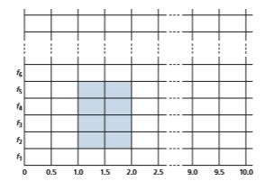
**Figure 7.22**  ♦   Twenty 0.5-ms slots organized into 10 ms frames at each frequency. An eight-slot allocation is shown shaded.
every 5 ms by a base station. Once this signal is found, the mobile device remains on this frequency and locates the secondary synchronization signal. With information found in this second signal, the device can locate (following several further steps) additional information such as channel bandwidth, channel configurations, and the cellular carrier information of that base station. Armed with this information, the mobile device can select a base station to associate with (preferentially attaching to its home network, if available) and establish a control-plane signaling connection across the wireless hop with that base station. This mobile-to-base-station channel will be used through the remainder of the network attachment process.

• _Mutual Authentication._ In our earlier description of the Mobility Management Entity (MME) in Section 7.4.1, we noted that the base station contacts the local MME to perform mutual authentication—a process that we’ll study in further detail in Section 8.8.2. This is the second phase of network attachment, allowing the network to know that the attaching device is indeed the device associated with a given IMSI, and the mobile device to know that the network to which it is attaching is also a legitimate cellular carrier network. Once this second phase of network attachment is complete, the MME and mobile device have mutually authenticated each other, and the MME also knows the identity of the base station to which the mobile is attached. Armed with this information, the MME is now ready to configure the Mobile-device-to-PDN-gateway data path.

• _Mobile-device-to-PDN-gateway Data Path Configuration._ The MME contacts the PDN gateway (which also provides a NAT address for the mobile device), the Serving gateway, and the base station to establish the two tunnels shown in Figure 7.21. Once this phase is complete, the mobile device is able to send/receive IP datagrams via the base station through these tunnels to and from the Internet!

**Power Management: Sleep Modes**

Recall in our earlier discussion of advanced features in 802.11 (Section 7.3.5) and Bluetooth (Section 7.3.6) that a radio in a wireless device may enter a sleep state to save power when it is not transmitting or receiving in order to minimize the amount of time that the mobile device’s circuitry needs to be “on” for sending/receiving data, and for channel sensing. In 4G LTE, a sleeping mobile device can be in one of two different sleep states. In the discontinuous reception state, which is typically entered after several hundred milliseconds of inactivity \[Sauter 2014\], the mobile device and the base station will schedule periodic times in advance (typically several hundred milliseconds apart) at which the mobile device will wake up and actively monitor the channel for downstream (base station to mobile device) transmissions; apart from these scheduled times, however, the mobile device’s radio will be sleeping.

If the discontinuous reception state might be considered a “light sleep,” the second sleep state—the Idle state—which follows even longer periods of 5 to 10 seconds of inactivity, might be thought of as a “deep sleep.” While in this deep sleep, the mobile device’s radio wakes up and monitors the channel even less frequently. Indeed, this sleep is so deep that if the mobile device moves into a new cell in the carrier’s networkwhile sleeping, it need not inform the base station with which it was previous associ- ated. Thus, when waking up periodically from this deep sleep, the mobile device will need to re-establish an association with a (potentially new) base station in order to check for paging messages broadcast by the MME to base stations nearby the base station with which the mobile was last associated. These control-plane paging mes- sages, which are broadcast by these base stations to all mobile devices in their cells, indicate which mobile devices should fully wake up and re-establish a new data-plane connection to a base station (see Figure 7.18) in order to receive incoming packets.

## The Global Cellular Network: A Network of Networks
 Having now studied the 4G cellular network architecture, let’s take a step back at take a look at how the global cellular network—itself a “network of networks” like the Internet—is organized.

Figure 7.23 shows a user’s mobile smartphone connected via a 4G base station into its **home network**. The user’s home mobile network is operated by a cellular

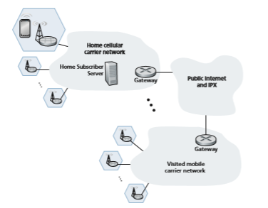
**Figure 7.23**  ♦   The global cellular data network: a network of networks.carrier such as Verizon, AT&T, T-Mobile, or Sprint in the United States; Orange in France; or SK Telecom in Korea. The user’s home network, in turn, is connected to the networks of other cellular carriers and to the global Internet, though one or more gateway routers in the home network, as shown in Figure 7.23. The mobile networks themselves interconnect with each other either via the public Internet or via an Internet Protocol Packet eXchange (IPX) Network \[GSMA 2018a\]. An IPX is a managed network specifically for interconnecting cellular carriers, similar to Internet eXchange Points (see Figure 1.15) for peering among ISPs. From Figure 7.23, we can see that the global cellular network is indeed a “network of networks”—just like the Internet (recall Figure 1.15 and Section 5.4). 4G networks can also peer with 3G cellular voice/data networks and earlier voice-only networks.

We’ll return shortly to additional 4G LTE topics—mobility management in Section 7.6, and 4G security in Section 8.8.2—later, after developing the basic principles needed for these topics. Let’s now take a quick look at the emerging 5G networks.

## 5G Cellular Networks
 The ultimate wide-area data service would be one with ubiquitous gigabit connec- tion speeds, extremely low latency, and unrestricted limitations on the number of users and devices that could be supported in any region. Such a service would open the door to all kinds of new applications, including pervasive augmented reality and virtual reality, control of autonomous vehicles via wireless connections, control of robots in factories via wireless connections, and replacement of residential access technologies, such as DSL and cable, with fixed wireless Internet services (that is, residential wireless connections from base stations to modems in homes).

It is expected that 5G, for which progressively improved versions are likely to be rolled out in the 2020 decade, will make a big step towards achieving the goals of the ultimate wide-area data service. It is predicted that 5G will provide roughly a 10x increase in peak bitrate, a 10x decrease in latency, and a 100x increase in traffic capacity over 4G \[Qualcomm 2019\].

Principally, 5G refers to “5G NR (New Radio),” which is the standard adopted by 3GPP. Other 5G technologies besides NR do exist, however. For example, Veri- zon’s proprietary 5G TF network operates on 28 and 39 GHz frequencies and is used only for fixed wireless Internet service, not in smartphones.

5G standards divide frequencies into two groups: FR1 (450 MHz–6 GHz) and FR2 (24 GHz–52 GHz). Most early deployments will be in the FR1 space, although there are early deployments as of 2020 in the FR2 space for fixed Internet residential access as mentioned just above. Importantly, the physical layer (that is, wireless) aspects of 5G are _not_ backward-compatible with 4G mobile communications systems such as LTE: in particular, it can’t be delivered to existing smartphones by deploying base station upgrades or software updates. Therefore, in the transition to 5G, wireless carriers will need to make substantial investments in physical infrastructure.FR2 frequencies are also known as **millimeter wave frequencies**. While millimeter wave frequencies allow for much faster data speeds, they come with two major drawbacks:

• Millimeter wave frequencies have much shorter range from base station to receiv- ers. This makes millimeter wave technology unsuitable in rural areas and requires denser deployments of base stations in urban areas.

• Millimeter wave communication is highly susceptible to atmospheric interfer- ence. Nearby foliage and rain can cause problems for outdoor use.

5G is not one cohesive standard, but instead consists of three co-existing standards \[Dahlman 2018\]:

• _eMBB (Enhanced Mobile Broadband)._ Initial deployments of 5G NR have focused on eMBB, which provides for increased bandwidth for higher down- load and upload speeds, as well as a moderate reduction in latency when compared to 4G LTE. eMBB enables rich media applications, such as mobile augmented reality and virtual reality, as well as mobile 4K resolution and 360° video streaming.

• _URLLC (Ultra Reliable Low-Latency Communications)._ URLLC is targeted towards applications that are highly latency-sensitive, such as factory automation and autonomous driving. URLLC is targeting latencies of 1msec. As of this writ- ing, technologies that enable URLLC are still being standardized.

• _mMTC (Massive Machine Type Communications)._ mMTC is a narrowband access type for sensing, metering, and monitoring applications. One priority for the design of 5G networks is to lower barriers for network connectivity for IoT devices. In addition to lowering latency, emerging technologies for 5G networks are focusing on reducing power requirements, making the use of IoT devices more pervasive than has been with 4G LTE.

**5G and Millimeter Wave Frequencies**

Many 5G innovations will be a direct result of working in the millimeter wave fre- quencies in the 24 GHz–52 GHz band. For example, these frequencies offer the potential of achieving 100x increase in capacity over 4G. To get some insight into this, capacity can be defined as the product of three terms \[Björnson 2017\]:

capacity = cell density \* available spectrum \* spectral efficiency

where cell density is in units of cells/km2, available spectrum is in units of Hertz, and spectral efficiency is a measure of how efficiently each base station can com- municate with users and is in units of bps/Hz/cell. By multiplying these units out, it is easy to see that capacity is in units of bps/km2. For each of these three terms, the values will be larger for 5G than for 4G:• Because millimeter frequencies have much shorter range than 4G LTE fre- quencies, more base stations are required, which in turn increases the cell density.

• Because 5G FR2 operates in a much larger frequency band (52 − 24 = 28 GHz) than 4G LTE (up to about 2 GHz), it has more available spectrum.

• With regard to spectral efficiency, information theory says that if you want to double spectral efficiency, a 17-fold increase in power is needed \[Björnson 2017\]. Instead of increasing power, 5G uses MIMO-technology (the same tech- nology we encountered in our study of 802.11 networks in Section 7.3), which uses multiple antennas at each base station. Rather than broadcasting signals in all directions, each MIMO antenna employs **beam forming** and directs the signal at the user. MIMO technology allows a base station to send to 10–20 users at the same time in the same frequency band.

By increasing all three terms in the capacity equation, 5G is expected to provide a 100x increase in capacity in urban areas. Similarly, owing to the much wider fre- quency band, 5G is expected to provide peak download rates of 1 Gbps or higher.

Millimeter wave signals are, however, easily blocked by buildings and trees. **Small cell stations** are needed to fill in coverage gaps between base stations and users. In a highly populous region, the distance between two small cells could vary from 10 to 100 meters \[Dahlman 2018\].

**5G Core Network**

The **5G Core network** is the data network that manages all of the 5G mobile voice, data and Internet connections. The 5G Core network is being redesigned to better integrate with the Internet and cloud-based services, and also includes distributed servers and caches across the network, thereby reducing latency. Network function virtualization (as discussed in Chapters 4 and 5), and network slicing for different applications and services, will be managed in the core.

The new 5G Core specification introduces major changes in the way mobile networks support a wide variety of services with varied performance. As in the case of the 4G core network (recall Figures 7.17 and 7.18), the 5G core relays data traffic from end devices, authenticates devices, and manages device mobility. The 5G core also contains all of the network elements that we encountered in Section 7.4.2—the mobile devices, the cells, the base stations, and the Mobility Management Entity (now divided into two sub-elements, as discussed below), the HSS, and the Serving and PDN gateways.

Although the 4G and 5G core networks perform similar functions, there are some major differences in that the new 5G core architecture. The 5G Core is designed for complete control and user-plane separation (see Chapter 5). The 5G Core consists purely of virtualized software-based network functions. This new architecture will giveoperators the flexibility to meet the diverse requirements of the different 5G applica- tions. Some of the new 5G core network functions include \[Rommer 2019\]:

• _User-Plane Function (UPF)._ Control and user-plane separation (see Chapter 5) allows packet processing to be distributed and pushed to the network edge.

• _Access and Mobility Management Function (AMF)._ The 5G Core essentially decomposes the 4G Mobility Management Entity (MME) into two functional elements: AMF and SMF. The AMF receives all the connection and session information from end-user equipment but only handles connection and mobility management tasks.

• _Session Management Function (SMF)._ Session management is handled by the Session Management Function (SMF). The SMF is responsible for interacting with the decoupled data plane. The SMF also performs IP address management and plays the role of DHCP.

As of this writing (2020), 5G is in its early stages of deployment, and many 5G standards have yet to be finalized. Only time will tell whether 5G will become a per- vasive broadband wireless service, whether it will successfully compete with WiFi for indoor wireless service, whether it will become a critical component of factory automation and the autonomous vehicle infrastructure, and whether it will take us a big step forward toward the ultimate wide-area wireless service.

# Mobility Management: Principles
Having covered the wireless nature of the communication links in a wireless net- work, it’s now time to turn our attention to the mobility that these wireless links ena- ble. In the broadest sense, a mobile device is one that changes its point of attachment into the network over time. Because the term mobility has taken on many meanings in both the computer and telephony worlds, it will serve us well first to carefully consider forms of mobility.

## Device Mobility: a Network-layer Perspective
 From the network layer’s standpoint, a physically mobile device will present a very different set of challenges to the network layer, depending on how active the device is as it moves between points of attachment to the network. At the one end of the spec- trum, scenario _(a)_ in Figure 7.24 is the mobile user who himself/herself physically moves between networks, but powers down the mobile device when moving. For example, a student might disconnect from a wireless classroom network and power down his/her device, head to the dining commons and connect to the wireless accessnetwork there while eating, and then disconnect and power down from the dining commons network, walk to the library, and connect to the library’s wireless network while studying. From a networking perspective, this device is _not_ mobile—it attaches to an access network and remains in that access network while on. In this case, the device serially associates with, and later disassociates from, each wireless access network encountered. This case of device (non-)mobility can be completely handled using the networking mechanisms we’ve already studied in Sections 7.3 and 7.4.

In scenario _(b)_ in Figure 7.24, the device is physically mobile but remains attached to the same access network. This device is also _not_ mobile from a network- layer perspective. Additionally, if the device remains associated with the same 802.11 AP or LTE base station, the device is not even mobile from a link-layer perspective.

From a network standpoint, our interest in device mobility really starts with case _(c),_ where a device changes its access network (e.g., 802.11 WLAN or LTE cell) while continuing to send and receiving IP datagrams, and while maintaining higher-level (e.g., TCP) connections. Here, the network will need to provide **handover**—a trans- fer of responsibility for forwarding datagrams to/from one AP or base station to the mobile device—as the device moves among WLANs or among LTE cells. We’ll cover handover in detail in Section 7.6. If the handover occurs within access net- works belonging to a single network provider, that provider can orchestrate handover on its own. When a mobile device roams between multiple provider networks, as in scenario _(d)_, the providers must orchestrate handover together, which considerably complicates the handover process.

## Home Networks and Roaming on Visited Networks
 As we learned in our discussions of cellular 4G LTE networks in Section 7.4.1, every subscriber has a “home” with some cellular provider. We learned that the Home Subscriber Service (HSS) stores information about each of its subscribers, includ- ing a globally unique device ID (embedded in a subscriber’s SIM card), information about services that the subscriber may access, cryptographic keys to be used for

_(a)_ Device mobility between access networks, but powered down while moving between access networks

_(b)_ Device mobility only within same wireless access network, in single provider network

_(c)_ Device mobility among access networks in single provider network, _while maintaining ongoing connections_

_(d)_ Device mobility among multiple provider networks, _while maintaining ongoing connections_
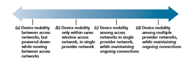
**Figure 7.24**  ♦   Various degrees of mobility, from a network-layer perspectivecommunication, and billing/charging information. When a device is connected to a cellular network, other than its **home network**, that device is said to be **roaming** on a **visited network**. When a mobile device attaches to, and roams on, a visited network, coordination will be required between the home network and the visited network.

The Internet does not have a similarly strong notion of a home network or a vis- ited network. In practice, a student’s home network might be the network operated by his/her school; for mobile professionals, their home network might be their com- pany network. The visited network might be the network of a school or a company they are visiting. But there is no notion of a home/visited network deeply embedded in the Internet’s architecture. The Mobile IP protocol \[Perkins 1998, RFC 5944\], which we will cover briefly in Section 7.6, was a proposal that strongly incorporated the notion of home/visited networks. But Mobile IP has seen limited deployment/use in practice. There are also activities underway that are built on top of the existing IP infrastructure to provide authenticated network access across visited IP networks. Eduroam \[Eduroam 2020\] is one such activity.

The notion of a mobile device having a home network provides two important advantages: the home network provides a single location where information about that device can be found, and (as we will see) it can serve as a coordination point for communication to/from a roaming mobile device.

To appreciate the potential value of the central point of information and coordi- nation, consider the human analogy of a 20-something adult Bob moving out of the family home. Bob becomes mobile, living in a series of dormitories and apartments, and often changing addresses. If an old friend Alice wants to get in touch, how can Alice find the current address of Bob? One common way is to contact the family, since a mobile 20-something adult will often register his or her current address with the family (if for no other reason than so that the parents can send money to help pay the rent!). The family home becomes that unique location that others can go to as a first step in communicating with Bob. Additionally, later postal communication from Alice may be either _indirect_ (e.g., with mail being sent first to Bob’s family home and then forwarded to Bob) or _direct_ (e.g., with Alice using the address obtained from Bob’s parents to send mail directly to Bob).

## Direct and Indirect Routing to/from a Mobile Device
 Let us now consider the conundrum faced by the Internet-connected host (that we will refer to as a _correspondent_) in Figure 7.25 wishing to communicate with a mobile device that might be located within that mobile device’s cellular home net- work, or might be roaming in a visited network. In our development below, we’ll adopt a 4G/5G cellular network perspective, since these networks have such a long history of supporting device mobility. But as we’ll see, the fundamental challenges and basic solution approaches for supporting device mobility are equally applicable in both cellular networks and in the Internet.

As shown in Figure 7.25, we’ll assume that the mobile device has a globally unique identifier associated with it. In 4G, LTE cellular networks (see Section 7.4),this would be the International Mobile Subscriber Identity (IMSI) and an associated phone number, stored on a mobile device’s SIM card. For mobile Internet users, this would be a permanent IP address in the IP address range of its home network, as in the case of the Mobile IP architecture.

What approaches might be used in a mobile network architecture that would allow a datagram sent by the correspondent to reach that mobile device? Three basic approaches can be identified and are discussed below. As we will see, the latter two of these are adopted in practice.

**Leveraging the Existing IP Address Infrastructure**

Perhaps the simplest approach to routing to a mobile device in a visited network is to simply use the existing IP addressing infrastructure—to add nothing new to the architecture. What could be easier!

Recall from our discussion of Figure 4.21 that an ISP uses BGP to advertise routes to destination networks by enumerating the CIDRized address ranges of reach- able networks. A visited network could thus advertise to all other networks that a

**Figure 7.25**  ♦  Elements of a mobile network architectureparticular mobile device is resident in its network simply by advertising a highly specific address—the mobile device’s full 32-bit IP permanent address—essentially informing other networks that it has the path to be used to forward datagrams to that mobile device. These neighboring networks would then propagate this routing infor- mation throughout the network as part of the normal BGP procedure of updating rout- ing information and forwarding tables. Since datagrams will always be forwarded to the router advertising the most specific destination for that address (see Section 4.3), all datagrams addressed to that mobile device will be forwarded to the visited net- work. If the mobile device leaves one visited network and joins another, the new vis- ited network can advertise a new, highly specific route to the mobile device, and the old visited network can withdraw its routing information regarding the mobile device.

This solves two problems at once, and does so without making changes to the network-layer infrastructure! Other networks know the location of the mobile device, and it is easy to route datagrams to the mobile device, since the forwarding tables will direct datagrams to the visited network. The killer drawback, however, is that of scalability—network routers would have to maintain forwarding table entries for potentially billions of mobile devices, and update a device’s entry each time it roams to a different network. Clearly, this approach would not work in practice. Some addi- tional drawbacks are explored in the problems at the end of this chapter.

An alternative, more practical, approach (and one that has been adopted in prac- tice) is to push mobility functionality from the network core to the network edge— a recurring theme in our study of Internet architecture. A natural way to do this is via the mobile device’s home network. In much the same way that parents of the mobile 20-something adult track their child’s location, a mobility management entity (MME) in the mobile device’s home network could track the visited network in which the mobile device resides. This information might reside in a database, shown as the HSS database in Figure 7.25. A protocol operating between the visited network and the home network will be needed to update the network in which the mobile device resides. You might recall that we encountered the MME and HSS elements in our study of 4G LTE. We’ll reuse their element names here, since they are so descriptive, and also because they are pervasively deployed in 4G networks.

Let’s next consider the visited network elements shown in Figure 7.25 in more detail. The mobile device will clearly need an IP address in the visited network. The possibilities here include using a permanent address associated with the mobile device’s home network, allocating a new address in the address range of the visited network, or providing an IP address via NAT (see Section 4.3.4). In the latter two cases, a mobile device has a transient identifier (a newly allocated IP address) in addition to its permanent identifiers stored in the HSS in its home network. These cases are analogous to a writer addressing a letter to the address of the house in which our mobile 20-something adult is currently living. In the case of a NAT address, datagrams destined to the mobile device would eventually reach the NAT gateway router in the visited network, which would then perform NAT address translation and forward the datagram to the mobile device.We have now seen a number of elements of a solution to the correspondent’s dilemma in Figure 7.24: home and visited networks, the MME and HSS, and mobile device addressing. But how should datagrams be addressed and forwarded to the mobile device? Since only the HSS (and not network-wide routers) knows the loca- tion of the mobile device, the correspondent cannot simply address a datagram to the mobile device’s permanent address and send it into the network. Something more must be done. Two approaches can be identified: indirect and direct routing.

**Indirect Routing to a Mobile Device**

Let’s again consider the correspondent that wants to send a datagram to a mobile device. In the **indirect routing** approach, the correspondent simply addresses the datagram to the mobile device’s permanent address and sends the datagram into the network, blissfully unaware of whether the mobile device is resident in its home network or in a visited network; mobility is thus completely transparent to the cor- respondent. Such datagrams are first routed, as usual, to the mobile device’s home network. This is illustrated in step 1 in Figure 7.26.
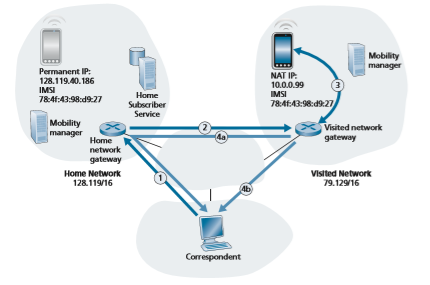
**Figure 7.26**  ♦  Indirect routing to a mobile deviceLet’s now turn our attention to the HSS, which is responsible for interacting with visited networks to track the mobile device’s location, and the home network’s gate- way router. One job of this gateway router is to be on the lookout for an arriving data- gram addressed to a device whose home is in that network, but that currently resides in a visited network. The home network gateway intercepts this datagram, consults with the HSS to determine the visited network where the mobile device is resident, and forwards the datagram toward the visited network gateway router—step 2 in Fig- ure 7.26. The visited network gateway router then forwards the datagram toward the mobile device—step 3 in Figure 7.26. If NAT translation is used, as in Figure 7.26, the visited network gateway router performs NAT translation.

It is instructive to consider the rerouting at the home network in bit more detail. Clearly, the home network gateway will need to forward the arriving datagram to the gateway router in the visited network. On the other hand, it is desirable to leave the correspondent’s datagram intact, since the application receiving the datagram should be unaware that the datagram was forwarded via the home network. Both goals can be satisfied by having the home gateway encapsulate the correspondent’s original complete datagram within a new (larger) datagram. This larger datagram is then addressed and delivered to the visited network’s gateway router, which will decapsulate the datagram—that is, remove the correspondent’s original datagram from within the larger encapsulating datagram—and forward (step 3 in Figure 7.26) the original datagram to the mobile device. The sharp reader will note that the encap- sulation/decapsulation described here is precisely the notion of tunneling, discussed in Section 4.3 in the context of IPv6; indeed, we also discussed the use of tunneling in the context of Figure 7.18, when we introduced the 4G LTE data plane.

Finally, let’s consider how the mobile device sends datagrams to the corre- spondent. In the context of Figure 7.26, the mobile device will clearly need to for- ward the datagram through the visited gateway router, in order to perform NAT translation. But how then should the visited gateway router forward the datagram to the correspondent? As shown in Figure 7.26, there are two options here: _(4a)_ the datagram could be tunneled back to the home gateway router, and sent to the corre- spondent from there, or _(4b)_ the datagram could be transmitted from the visited net- work directly to the correspondent—an approach known as **local breakout** \[GSMA 2019a\] in LTE.

Let’s summarize our discussion of indirect routing by reviewing the new net- work-layer functionality required to support mobility.

• _A mobile-device–to–visited-network association protocol._ The mobile device will need to associate with the visited network, and will similarly need to disassociate when leaving the visited network.

• _A visited-network–to–home-network-HSS registration protocol._ The visited net- work will need to register the mobile device’s location with the HSS in the home network, and perhaps use information obtained from the HSS in performing device authentication.• _A datagram tunneling protocol between in the home network gateway and the visited network gateway router._ The sending side performs encapsulation and forwarding of the correspondent’s original datagram; on the receiving side, the gateway router performs decapsulation, NAT translation, and forwarding of the original datagram to the mobile device.

The previous discussion provides all the needed elements for a mobile device to maintain an ongoing connection with a correspondent as the device moves among networks. When a device roams from one visited network to another, the new visited network information needs to be updated in the home network HSS, and the home- gateway-router-to-visited-gateway-router tunnel endpoint needs to be moved. But will the mobile device see an interrupted flow of datagrams as it moves between networks? As long as the time between the mobile device disconnection from one visited network and its attachment to the next visited network is small, few datagrams will be lost. Recall from Chapter 3 that end-to-end connections can experience datagram loss due to network congestion. Hence, occasional datagram loss within a connection when a device moves between networks is by no means a catastrophic problem. If loss-free communication is required, upper-layer mechanisms will recover from datagram loss, whether such loss results from network congestion or from device mobility.

Our discussion above has been purposefully somewhat generic. An indirect routing approach is used in the mobile IP standard \[RFC 5944\], as well as in 4G LTE networks \[Sauter 2014\]. Their details, in particular the tunneling procedures employed, differ just a bit from our generic discussion above.

**Direct Routing to a Mobile Device**

The indirect routing approach illustrated in Figure 7.26 suffers from an inefficiency known as the **triangle routing problem**—datagrams addressed to the mobile device must be forwarded first to the home network and then to the visited network, even when a much more efficient route exists between the correspondent and the roaming mobile device. In the worst case, imagine a mobile user who is roaming on the same network that is the home network for an overseas colleague who our mobile user is visiting. The two are sitting side-by-side and exchanging data. Datagrams between the mobile user and his overseas colleague will be forwarded to the mobile user’s home network and then back again to the visited network!

**Direct routing** overcomes the inefficiency of triangle routing, but does so at the cost of additional complexity. In the direct routing approach, shown in Figure 7.27, the correspondent first discovers the visited network in which the mobile is resident. This is done by querying the HSS in the mobile device’s home network, assuming (as in the case of indirect routing) that the mobile device’s visited network is regis- tered in the HSS. This is shown as steps 1 and 2 in Figure 7.27. The correspondent then tunnels datagrams from its network _directly_ to the gateway router in the mobile device’s visited network.While direct routing overcomes the triangle routing problem, it introduces two important additional challenges:

• A mobile-user location protocol is needed for the correspondent to query the HSS to obtain the mobile device’s visited network (steps 1 and 2 in Figure 7.27). This is in addition to the protocol needed for the mobile device to register its location with its HSS.

• When the mobile device moves from one visited network to another, how will the correspondent know to now forward datagrams to the new visited network? In the case of indirect routing, this problem was easily solved by updating the HSS in the home network, and changing the tunnel endpoint to terminate at the gateway router of the new visited network. However, with direct routing, this change in vis- ited networks is not so easily handled, as the HSS is queried by the correspondent only at the beginning of the session. Thus, additional protocol mechanisms would be required to proactively update the correspondent each time the mobile device moves. Two problems at the end of this chapter explore solutions to this problem.

**Figure 7.27**  ♦  Direct routing to a mobile device# Mobility Management in Practice
In the previous section, we identified key fundamental challenges and potential solu- tions in developing a network architecture to support device mobility: the notions of home and visited networks; the home network’s role as a central point of informa- tion and control for mobile devices subscribed to that home network; control-plane functions needed by a home network’s mobility management entity to track a mobile device roaming among visited networks; and data-plane approaches of direct and indirect routing to enable a correspondent and a mobile device to exchange data- grams. Let’s now look at how these principles are put into practice! In Section 7.2.1, we’ll study mobility management in 4G/5G networks; in Section 7.2.1, we’ll look at Mobile IP, which has been proposed for the Internet.

## Mobility Management in 4G/5G Networks
 Our earlier study of 4G and emerging 5G architectures in Section 7.4 acquainted us with all of the network elements that play a central role in 4G/5G mobility management. Let’s now illustrate how those elements interoperate with each other to provide mobility services in today’s 4G/5G networks \[Sauter 2014; GSMA 2019b\], which have their roots in earlier 3G cellular voice and data networks \[Sauter 2014\], and even earlier 2G voice-only networks \[Mouly 1992\]. This will help us synthesize what we’ve learned so far, allow us to introduce a few more advanced topics as well, and provide a lens into what might be in store for 5G mobility management.

Let’s consider a simple scenario in which a mobile user (e.g., a passenger in a car), with a smartphone attaches to a visited 4G/5G network, begins streaming a HD video from a remote server, and then moves from the cell coverage of one 4G/5G base station to another. The four major steps in this scenario are shown in Figure 7.28:

1\. _Mobile device and base station association._ The mobile device associates with a base station in the visited network.

2\. _Control-plane configuration of network elements for the mobile device._ The visited and home networks establish control-plane state indicating that the mobile device is resident in the visited network.

3\. _Data-plane configuration of forwarding tunnels for the mobile device._ The vis- ited network and the home network establish tunnels through which the mobile device and streaming server can send/receive IP datagrams, using indirect rout- ing through the home network’s Packet Data Network gateway (P-GW).

4\. _Mobile device handover from one base station to another._ The mobile device changes its point of attachment to the visited network, via handover from one base station to another.

Let’s now consider each of these four steps in more detail.**1\. Base station association.** Recall that in Section 7.4.2, we studied the procedures by which a mobile device associates with a base station. We learned that the mobile device listens on all frequencies for primary signals being transmitted by base sta- tions in its area. The mobile device acquires progressively more information about these base stations, ultimately selecting the base station with which to associate, and bootstrapping a control- signaling channel with that base station. As part of this association, the mobile device provides the base station with its International Mobile Subscriber Identity (IMSI), which uniquely identifies the mobile device as well as its home network and other additional subscriber information.

**2\. Control-plane configuration of LTE network elements for the mobile device.** Once the mobile-device-to-base-station signaling channel has been established, the base station can contact the MME in the visited network. The MME will consult and configure a number of 4G/5G elements in both the home and visited networks to establish state on behalf of the mobile node:

• The MME will use to the IMSI and other information provided by the mobile device to retrieve authentication, encryption, and available network service infor- mation for that subscriber. That information might be in the MME’s local cache, retrieved from another MME that the mobile device had recently contacted, or retrieved from the HSS in the mobile device’s home network. The mutual authen- tication process (which we will cover in more detail in Section 8.8) ensures that
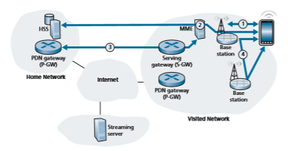
**Figure 7.28**  ♦  An example 4G/5G mobility scenariothe visited network is sure about the identity of the mobile device and that the device can authenticate the network to which it is attaching.

• The MME informs the HSS in the mobile device’s home network that the mobile device is now resident in the visited network, and the HSS updates its database.

• The base station and the mobile device select parameters for the data-plane chan- nel to be established between the mobile device and the base station (recall that a control plane signaling channel is already in operation).

**3\. Data-plane configuration of forwarding tunnels for the mobile device.** The MME next configures the data plane for the mobile device, as shown in Figure 7.29. Two tunnels are established. One tunnel is between the base station and a Serving Gateway in the visited network. The second tunnel is between that Serving Gateway and the PDN Gateway router _in the mobile device’s home network._ 4G LTE implements this form of symmetric indirect routing—all traffic to/from the mobile device will be tunneled through the device’s home network. 4G/5G tunnels use the GPRS Tunneling Protocol (GTP), specified in \[3GPP GTPv1-U 2019\]. The Tunnel Endpoint ID (TEID) in the GTP header indicates which tunnel a datagram belongs, allowing multiple flows to be multiplexed and de-multiplexed by GTP between tunnel endpoints.

It is instructive to compare the configuration of tunnels in Figure 7.29 (the case of mobile roaming in a visited network) with that of Figure 7.18 (the case of mobility

**Figure 7.29**  ♦   Tunneling in 4G/5G networks between the Serving Gateway in the visited network and the PDN gateway in the home networkonly within the mobile device’s home network). We see that in both cases, the Serv- ing Gateway is co-resident in the same network as the mobile device, but PDN Gate- way (which is always the PDN Gateway in the mobile device’s home network) may be in a different network than the mobile device. This is precisely indirect routing. An alternative to indirect routing, known as **local breakout** \[GSMA 2019a\] has been specified in which the Serving Gateway establishes a tunnel to the PDN Gateway in the local, visited network. In practice, however, local breakout is not widely used \[Sauter 2014\].

Once the tunnels have been configured and activated, the mobile device can now forward packets to/from the Internet via the PDN gateway in its home network!

**4\. Handover management.** A **handover** occurs when a mobile device changes its association from one base station to another. The handover process described below is the same, regardless of whether the mobile device is resident in its home network, or is roaming in a visited network.

As shown in Figure 7.30, datagrams to/from the device are initially (before handover) forwarded to the mobile through one base station (which we’ll refer to as the _source_ base station), and after handover are routed to the mobile device through another base station (which we’ll refer to as the _target_ base station). As we will see, a handover between base stations results not only in the mobile device transmitting/ receiving to/from a new base station but also in a change of the base-station side of the Serving-Gateway-to-base-station tunnel in Figure 7.29. In the simplest case of

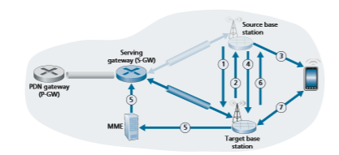
**Figure 7.30**  ♦   Steps in handing over a mobile device from the source base station to the target base stationhandover, when the two base stations are near each other and in the same network, all changes occurring as a result of handover are thus relatively local. In particular, the PDN gateway being used by the Serving Gateway remains blissfully unaware of device mobility. Of course, more complicated handoff scenarios will require the use of more complex mechanisms \[Sauter 2014; GSMA 2019a\].

There may be several reasons for handover to occur. For example, the signal between the current base station and the mobile may have deteriorated to such an extent that communication is severely impaired. Or a cell may have become over- loaded, handling a large amount of traffic; handing over mobile devices to less congested nearby cells may alleviate this congestion. A mobile device periodically measures characteristics of a beacon signal from its current base station as well as signals from nearby base stations that it can “hear.” These measurements are reported once or twice a second to the mobile device’s current (source) base station. Based on these measurements, the current loads of mobiles in nearby cells, and other factors, the source base station may choose to initiate a handover. The 4G/5G standards do not specify a specific algorithm to be used by a base station to determine whether or not to perform handover, or which target base station to choose; this is an active area of research \[Zheng 2008; Alexandris 2016\].

Figure 7.30 illustrates the steps involved when a source base station decides to hand over a mobile device to the target base station.

1\. The current (source) base station selects the target base station, and sends a Handover Request message to the target base station.

2\. The target base station checks whether it has the resources to support the mobile device and its quality of service requirements. If so, it pre-allocates channel resources (e.g., time slots) on its radio access network and other resources for that device. This pre-allocation of resources frees the mobile device from having to go through the time-consuming base-station association protocol discussed earlier, allowing handover to be executed as fast as possible. The target base station replies to the source base station with a Handover Request Acknowledge message, containing all the information at the target base station that the mobile device will need to associate with the new base station.

3\. The source base station receives the Handover Request Acknowledgement message and informs the mobile device of the target base station’s identity and channel access information. At this point, the mobile device can begin send- ing/receiving datagrams to/from the new target base station. From the mobile device’s point of view, handover is now complete! However, there is still a bit of work to be done within the network.

4\. The source base station will also stop forwarding datagrams to the mobile device and instead forward any tunneled datagrams it receives to the target base station, which will later forward these datagrams to the mobile device.

5\. The target base station informs the MME that it (the target base station) will be the new base station servicing the mobile device. The MME, in turn, signalsto the Serving Gateway and the target base station to reconfigure the Serving- Gateway-to-base-station tunnel to terminate at the target base station, rather than at the source base station.

6\. The target base station confirms back to the source base station that the tunnel has been reconfigured, allowing the source base station to release resources associated with that mobile device.

7\. At this point, the target base station can also begin delivering datagrams to the mobile device, including datagrams forwarded to the target base station by the source base station during handover, as well as datagrams newly arriving on the reconfigured tunnel from the Serving Gateway. It can also forward outgo- ing datagrams received from the mobile device into the tunnel to the Serving Gateway.

The roaming configurations in today’s 4G LTE networks, such as that dis- cussed above, will also be used in future emerging 5G networks \[GSMA 2019c\]. Recall, however, from our discussion in Section 7.4.6 that the 5G networks will be denser, with significantly smaller cell sizes. This will make handover an even more critically important network function. In addition, low handover latency will be critical for many real-time 5G applications. The migration of the cellular network control plane to the SDN framework that we studied earlier in Chapter 5 \[GSMA 2018b; Condoluci 2018\] promises to enable implementations of a higher-capacity, lower-latency 5G cellular network control plane. The application of SDN in a 5G context is the subject of considerable research \[Giust 2015; Ordonez-Lucena 2017; Nguyen 2016\].

## Mobile IP
 Today’s Internet does not have any widely deployed infrastructure that provides the type of services for “on the go” mobile users that we encountered for 4G/5G cellular networks. But this is certainly not due to the lack of technical solutions for providing such services in an Internet setting! Indeed, the Mobile IP architecture and protocols \[RFC 5944\] that we will briefly discuss below have been standardized by Internet RFCs for more than 20 years, and research has continued on new, more secure and more generalized mobility solutions \[Venkataramani 2014\].

Instead, it has perhaps been the lack of motivating business and use cases \[Arkko 2012\] and the timely development and deployment of alternative mobility solutions in cellular networks that has blunted the deployment of Mobile IP. Recall that 20 years ago, 2G cellular networks had already provided a solution for mobile voice services (the “killer app” for mobile users); additionally, next generation 3G net- works supporting voice _and_ data were on the horizon. Perhaps the dual technology solution—mobile services via cellular networks when we are truly mobile and “on the go” (i.e., the rightmost side of the mobility spectrum in Figure 7.24) and Internet services via 802.11 networks or wireline networks when we are stationary or movinglocally (i.e., the leftmost side of the mobility spectrum in Figure 7.24)—that we had 20 years ago and still have today will persist into the future.

It will nonetheless be instructive to briefly overview the Mobile IP standard here, as it provides many of the same services as cellular networks and implements many of the same basic mobility principles. Earlier editions of this textbook have provided a more in-depth study of Mobile IP than we will provide here; the inter- ested reader can find this retired material on this textbook’s website. The Internet architecture and protocols for supporting mobility, collectively known as Mobile IP, are defined primarily in RFC 5944 for IPv4. Mobile IP, like 4G/5G, is a complex standard, and would require an entire book to describe in detail; indeed one such book is \[Perkins 1998b\]. Our modest goal here is to provide an overview of the most important aspects of Mobile IP.

The overall architecture and elements of Mobile IP are strikingly similar to that of cellular provider networks. There is a strong notion of a home network, in which a mobile device has a permanent IP address, and visited networks (known as “foreign” networks in Mobile IP), where the mobile device will be allocated a care-of-address. The home agent in Mobile IP has a similar function to the LTE HSS: it tracks the location of a mobile device by receiving updates from foreign agents in foreign net- works visited by that mobile device, just as the HSS receives updates from Mobil- ity Management Entities (MMEs) in visited networks in which a 4G mobile device resides. And both 4G/5G and Mobile IP use indirect routing to a mobile node, using tunnels to connect the gateway routers in the home and visited/foreign networks. Table 7.3 summarizes the elements of the Mobile IP architecture, along with a com- parison with similar elements in 4G/5G networks

**Table 7.3**  ♦  Commonalities between 4G/5G and Mobile IP architecturesThe mobile IP standard consists of three main pieces:

• _Agent discovery._ Mobile IP defines the protocols used by a foreign agent to adver- tise its mobility services to a mobile device that wishes to attach to its network. Those services will include providing a care-of-address to the mobile device for use in the foreign network, registration of the mobile device with the home agent in the mobile device’s home network, and forwarding of datagrams to/from the mobile device, among other services.

• _Registration with the home agent._ Mobile IP defines the protocols used by the mobile device and/or foreign agent to register and deregister a care-of-address with a mobile device’s home agent.

• _Indirect routing of datagrams._ Mobile IP also defines the manner in which data- grams are forwarded to mobile devices by a home agent, including rules for for- warding datagrams and handling error conditions, and several forms of tunneling \[RFC 2003, RFC 2004\].

Again, our coverage here of Mobile IP has been intentionally brief. The inter- ested reader should consult the references in this section, or more-detailed discus- sions of Mobile IP in earlier editions of this textbook.

# Wireless and Mobility: Impact on Higher-Layer Protocols
In this chapter, we’ve seen that wireless networks differ significantly from their wired counterparts at both the link layer (as a result of wireless channel charac- teristics such as fading, multipath, and hidden terminals) and at the network layer (as a result of mobile users who change their points of attachment to the network). But are there important differences at the transport and application layers? It’s tempt- ing to think that these differences will be minor, since the network layer provides the same best-effort delivery service model to upper layers in both wired and wireless networks. Similarly, if protocols such as TCP or UDP are used to provide transport- layer services to applications in both wired and wireless networks, then the applica- tion layer should remain unchanged as well. In one sense, our intuition is right—TCP and UDP can (and do) operate in networks with wireless links. On the other hand, transport protocols in general, and TCP in particular, can sometimes have very dif- ferent performance in wired and wireless networks, and it is here, in terms of perfor- mance, that differences are manifested. Let’s see why.

Recall that TCP retransmits a segment that is either lost or corrupted on the path between sender and receiver. In the case of mobile users, loss can result from either network congestion (router buffer overflow) or from handover (e.g., from delays in rerouting segments to a mobile’s new point of attachment to the network). In allcases, TCP’s receiver-to-sender ACK indicates only that a segment was not received intact; the sender is unaware of whether the segment was lost due to congestion, during handover, or due to detected bit errors. In all cases, the sender’s response is the same—to retransmit the segment. TCP’s congestion-control response is _also_ the same in all cases—TCP decreases its congestion window, as discussed in Section 3.7. By unconditionally decreasing its congestion window, TCP implicitly assumes that segment loss results from congestion rather than corruption or handover. We saw in Section 7.2 that bit errors are much more common in wireless networks than in wired networks. When such bit errors occur or when handover loss occurs, there’s really no reason for the TCP sender to decrease its congestion window (and thus decrease its sending rate). Indeed, it may well be the case that router buffers are empty and packets are flowing along the end-to-end path unimpeded by congestion.

Researchers realized in the early to mid 1990s that given high bit error rates on wireless links and the possibility of handover loss, TCP’s congestion-control response could be problematic in a wireless setting. Three broad classes of approaches are possible for dealing with this problem:

• _Local recovery._ Local recovery protocols recover from bit errors when and where (e.g., at the wireless link) they occur, for example, the 802.11 ARQ protocol we studied in Section 7.3, or more sophisticated approaches that use both ARQ and FEC \[Ayanoglu 1995\] that we saw in use in 4G/5G networks in Section 7.4.2.

• _TCP sender awareness of wireless links._ In the local recovery approaches, the TCP sender is blissfully unaware that its segments are traversing a wireless link. An alternative approach is for the TCP sender and receiver to be aware of the existence of a wireless link, to distinguish between congestive losses occurring in the wired network and corruption/loss occurring at the wireless link, and to invoke congestion control only in response to congestive wired-network losses. \[Liu 2003\] investigates techniques for distinguishing between losses on the wired and wireless segments of an end-to-end path. \[Huang 2013\] provides insights on developing transport protocol mechanisms and applications that are more LTE- friendly.

• _Split-connection approaches._ In a split-connection approach \[Bakre 1995\], the end-to-end connection between the mobile user and the other end point is broken into two transport-layer connections: one from the mobile host to the wireless access point, and one from the wireless access point to the other communication end point (which we’ll assume here is a wired host). The end-to-end connection is thus formed by the concatenation of a wireless part and a wired part. The trans- port layer over the wireless segment can be a standard TCP connection \[Bakre 1995\], or a specially tailored error recovery protocol on top of UDP. \[Yavatkar 1994\] investigates the use of a transport-layer selective repeat protocol over the wireless connection. Measurements reported in \[Wei 2006\] indicate that split TCP connections have been widely used in cellular data networks, and that significant improvements can indeed be made through the use of split TCP connections.Our treatment of TCP over wireless links has been necessarily brief here. In-depth surveys of TCP challenges and solutions in wireless networks can be found in \[Hanabali 2005; Leung 2006\]. We encourage you to consult the references for details of this ongoing area of research.

Having considered transport-layer protocols, let us next consider the effect of wireless and mobility on application-layer protocols. Because of the shared nature of the wireless spectrum, applications that operate over wireless links, particularly over cellular wireless links, must treat bandwidth as a scarce commodity. For example, a Web server serving content to a Web browser executing on a 4G smartphone will likely not be able to provide the same image-rich content that it gives to a browser operating over a wired connection. Although wireless links do provide challenges at the application layer, the mobility they enable also makes possible a rich set of loca- tion-aware and context-aware applications \[Baldauf 2007\]. More generally, wireless and mobile networks will continue to play a key role in realizing the ubiquitous com- puting environments of the future \[Weiser 1991\]. It’s fair to say that we’ve only seen the tip of the iceberg when it comes to the impact of wireless and mobile networks on networked applications and their protocols!

# Summary
Wireless and mobile networks first revolutionized telephony and are now having an increasingly profound impact in the world of computer networks as well. With their anytime, anywhere, untethered access into the global network infrastructure, they are not only making network access more ubiquitous, they are also enabling an exciting new set of location-dependent services. Given the growing importance of wireless and mobile networks, this chapter has focused on the principles, common link technologies, and network architectures for supporting wireless and mobile communication.

We began this chapter with an introduction to wireless and mobile networks, drawing an important distinction between the challenges posed by the _wireless_ nature of the communication links in such networks, and by the _mobility_ that these wireless links enable. This allowed us to better isolate, identify, and master the key concepts in each area. We focused first on wireless communication, considering the characteristics of a wireless link in Section 7.2. In Sections 7.3 and 7.4, we examined the link-level aspects of the IEEE 802.11 (WiFi) wireless LAN standard, Bluetooth, and 4G/5G cellular neworks. We then turned our attention to the issue of mobility. In Section 7.5, we identified several forms of mobility, with points along this spectrum posing dif- ferent challenges and admitting different solutions. We considered the problems of locating and routing to a mobile user, as well as approaches for handing over the mobile user who dynamically moves from one point of attachment to the network to another. We examined how these issues were addressed in 4G/5G networks and in the
HOMEWORK PROBLEMS AND QuESTIONS 

Mobile IP standard. Finally, we considered the impact of wireless links and mobility on transport-layer protocols and networked applications in Section 7.7.

Although we have devoted an entire chapter to the study of wireless and mobile networks, an entire book (or more) would be required to fully explore this exciting and rapidly expanding field. We encourage you to delve more deeply into this field by consulting the many references provided in this chapter.

**Homework Problems and Questions**

**Chapter 7 Review Questions** SECTION 7.1 R1. What does it mean for a wireless network to be operating in “infrastructure

mode”? If the network is not in infrastructure mode, what mode of operation is it in, and what is the difference between that mode of operation and infra- structure mode?

R2. Both MANET and VANET are multi-hop infrastructure-less wireless net- works. What is the difference between them?

SECTION 7.2 R3. What are the differences between the following types of wireless channel

impairments: path loss, multipath propagation, interference from other sources?

R4. As a mobile node gets farther and farther away from a base station, what are two actions that a base station could take to ensure that the loss probability of a transmitted frame does not increase?

SECTION 7.3 R5. Describe the role of the beacon frames in 802.11.

R6. An access point periodically sends beacon frames. What are the contents of the beacon frames?

R7. Why are acknowledgments used in 802.11 but not in wired Ethernet?

R8. What is the difference between passive scanning and active scanning?

R9. What are the two main purposes of a CTS frame?

R10. Suppose the IEEE 802.11 RTS and CTS frames were as long as the standard DATA and ACK frames. Would there be any advantage to using the CTS and RTS frames? Why or why not?

R11. Section 7.3.4 discusses 802.11 mobility, in which a wireless station moves from one BSS to another within the same subnet. When the APs are intercon- nected with a switch, an AP may need to send a frame with a spoofed MAC address to get the switch to forward the frame properly. Why?R12. What is the difference between Bluetooth and Zigbee in terms of data rate? R13. What is the role of the base station in 4G/5G cellular architecture? With

which other 4G/5G network elements (mobile device, MME, HSS, Serving Gateway Router, PDN Gateway Router) does it _directly_ communicate with in the control plane? In the data plane?

R14. What is an International Mobile Subscriber Identity (IMSI)? R15. What is the role of the Home Subscriber Service (HSS) in 4G/5G cellular

architecture? With which other 4G/5G network elements (mobile device, base station, MME, Serving Gateway Router, PDN Gateway Router) does it _directly_ communicate with in the control plane? In the data plane?

R16. What is the role of the Mobility Management Entity (MME) in 4G/5G cellular architecture? With which other 4G/5G network elements (mobile device, base station, HSS, Serving Gateway Router, PDN Gateway Router) does it _directly_ communicate with in the control plane? In the data plane?

R17. Describe the purpose of two tunnels in the data plane of the 4G/5G cellular architecture. When a mobile device is attached to its own home network, at which 4G/5G network element (mobile device, base station, HSS, MME, Serving Gateway Router, PDN Gateway Router) does each end of each of the two tunnels terminate?

R18. What are the three sublayers in the link layer in the LTE protocol stack? Briefly describe their functions.

R19. Does the LTE wireless access network use FDMA, TDMA, or both? Explain your answer.

R20. Describe the two possible sleep modes of a 4G/5G mobile device. In each of these sleep modes, will the mobile device remain associated with the same base station between the time it goes to sleep and the time it wakes up and first sends/receives a new datagram?

R21. What is meant by a “visited network” and a “home network” in 4G/5G cel- lular architecture?

R22. List three important differences between 4G and 5G cellular networks.

SECTION 7.5 R23. What does it mean that a mobile device is said to be “roaming?” R24. What is meant by “hand over” of a network device? R25. What is the difference between direct and indirect routing of datagrams to/

from a roaming mobile host? R26. What does “triangle routing” mean?

\*The terms used above may differ from the terms found in the official Bluetooth Specification. The terms used in the official specifica- tion DO NOT align with Pearson’s commitment to promoting diversity, equality, and inclusion, and protecting against bias and stereo- typing in the global population of the learners we serve.
PROBLEMS 

SECTION 7.6 R27. Describe the similarity and differences in tunnel configuration when a mobile device

is resident in its home network, versus when it is roaming in a visited network.

R 28. When a mobile device is handed over from one base station to another in a 4G/5G network, which network element makes the decision to initiate that handover? Which network element chooses the target base station to which the mobile device will be handed over?

R 29. Describe how and when the forwarding path of datagrams entering the visited net- work and destined to the mobile device changes before, during, and after hand over.

R 30. Consider the following elements of the Mobile IP architecture: the home net- work, foreign network permanent IP address, home agent, foreign agent, data plane forwarding, Access Point (AP), and WLANs at the network edge. What are the closest equivalent elements in the 4G/5G cellular network architecture?

SECTION 7.7 R31. What are three approaches that can be used to avoid having a single wireless

link degrade the performance of an end-to-end transport-layer TCP connection?

**Problems**

P1. Consider the single-sender CDMA example in Figure 7.5. What would be the sender’s output (for the 2 data bits shown) if the sender’s CDMA code were (1, 1, -1, 1, 1, -1, -1, 1)?

P2. Consider sender 2 in Figure 7.6. What is the sender’s output to the channel (before it is added to the signal from sender 1), Z2 _i_,_m_?

P3. After selecting the AP with which to associate, a wireless host sends an association request frame to the AP, and the AP responds with an association response frame. Once associated with an AP, the host will want to join the subnet (in the IP addressing sense of Section 4.4.2) to which the AP belongs. What does the host do next?

P4. If two CDMA senders have codes (1, 1, 1, -1, 1, -1, -1, -1) and (1, -1, 1, 1, 1, 1, 1, 1), would the corresponding receivers be able to decode the data correctly? Justify.

P5. Suppose there are two ISPs providing WiFi access in a particular café, with each ISP operating its own AP and having its own IP address block.

a. Further suppose that by accident, each ISP has configured its AP to oper- ate over channel 11. Will the 802.11 protocol completely break down in this situation? Discuss what happens when two stations, each associated with a different ISP, attempt to transmit at the same time.

b. Now suppose that one AP operates over channel 1 and the other over channel 11. How do your answers change?P6. In step 4 of the CSMA/CA protocol, a station that successfully transmits a frame begins the CSMA/CA protocol for a second frame at step 2, rather than at step 1. What rationale might the designers of CSMA/CA have had in mind by having such a station not transmit the second frame immediately (if the channel is sensed idle)?

P7. Suppose an 802.11b station is configured to always reserve the channel with the RTS/CTS sequence. Suppose this station suddenly wants to transmit 1,000 bytes of data, and all other stations are idle at this time. Assume a transmission rate of 10 Mbps. Calculate the time required to transmit the frame and receive the acknowledgment as a function of SIFS and DIFS, ignoring propagation delay and assuming no bit errors.

P8. Consider the scenario shown in Figure 7.31, in which there are four wireless nodes, A, B, C, and D. The radio coverage of the four nodes is shown via the shaded ovals; all nodes share the same frequency. When A transmits, it can only be heard/received by B; when B transmits, both A and C can hear/ receive from B; when C transmits, both B and D can hear/receive from C; when D transmits, only C can hear/receive from D.

Suppose now that each node has an infinite supply of messages that it wants to send to each of the other nodes. If a message’s destination is not an immediate neighbor, then the message must be relayed. For example, if A wants to send to D, a message from A must first be sent to B, which then sends the mes- sage to C, which then sends the message to D. Time is slotted, with a message transmission time taking exactly one time slot, e.g., as in slotted Aloha. During a slot, a node can do one of the following: (_i_) send a message, (_ii_) receive a mes- sage (if exactly one message is being sent to it), (_iii_) remain silent. As always, if a node hears two or more simultaneous transmissions, a collision occurs and none of the transmitted messages are received successfully. You can assume here that there are no bit-level errors, and thus if exactly one message is sent, it will be received correctly by those within the transmission radius of the sender.

a. Suppose now that an omniscient controller (i.e., a controller that knows the state of every node in the network) can command each node to do whatever it (the omniscient controller) wishes, that is, to send a message, to receive a
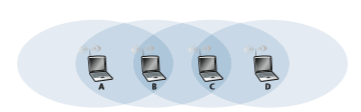
**Figure 7.31**  ♦  Scenario for problem P8

PROBLEMS 

message, or to remain silent. Given this omniscient controller, what is the maximum rate at which a data message can be transferred from C to A, given that there are no other messages between any other source/destination pairs?

b. Suppose now that A sends messages to B, and D sends messages to C. What is the combined maximum rate at which data messages can flow from A to B and from D to C?

c. Suppose now that A sends messages to B, and C sends messages to D. What is the combined maximum rate at which data messages can flow from A to B and from C to D?

d. Suppose now that the wireless links are replaced by wired links. Repeat questions (a) through (c) again in this wired scenario.

e. Now suppose we are again in the wireless scenario, and that for every data message sent from source to destination, the destination will send an ACK message back to the source (e.g., as in TCP). Also suppose that each ACK message takes up one slot. Repeat questions (a)–(c) above for this scenario.

P9. Power is a precious resource in mobile devices, and thus the 802.11 standard provides power-management capabilities that allow 802.11 nodes to minimize the amount of time that their sense, transmit, and receive functions and other circuitry need to be “on.” In 802.11, a node is able to explicitly alternate between sleep and wake states. Explain in brief how a node communicates with the AP to perform power management.

P10. Consider the following idealized LTE scenario. The downstream channel (see Figure 7.22) is slotted in time, across F frequencies. There are four nodes, A, B, C, and D, reachable from the base station at rates of 10 Mbps, 5 Mbps, 2.5 Mbps, and 1 Mbps, respectively, on the downstream channel. These rates assume that the base station utilizes all time slots available on all F frequen- cies to send to just one station. The base station has an infinite amount of data to send to each of the nodes, and can send to any one of these four nodes using any of the F frequencies during any time slot in the downstream sub-frame.

a. What is the maximum rate at which the base station can send to the nodes, assuming it can send to any node it chooses during each time slot? Is your solution fair? Explain and define what you mean by “fair.”

b. If there is a fairness requirement that each node must receive an equal amount of data during each one second interval, what is the average transmission rate by the base station (to all nodes) during the downstream sub-frame? Explain how you arrived at your answer.

c. Suppose that the fairness criterion is that any node can receive at most twice as much data as any other node during the sub-frame. What is the average transmission rate by the base station (to all nodes) during the sub- frame? Explain how you arrived at your answer.

P11. In Section 7.5, one proposed solution that allowed mobile users to maintain their IP addresses as they moved among foreign networks was to have a foreign network advertise a highly specific route to the mobile user and use the existingrouting infrastructure to propagate this information throughout the network. We identified scalability as one concern. Suppose that when a mobile user moves from one network to another, the new foreign network advertises a specific route to the mobile user, and the old foreign network withdraws its route. Consider how routing information propagates in a distance-vector algorithm (particularly for the case of interdomain routing among networks that span the globe).

a. Will other routers be able to route datagrams immediately to the new for- eign network as soon as the foreign network begins advertising its route?

b. Is it possible for different routers to believe that different foreign networks contain the mobile user?

c. Discuss the timescale over which other routers in the network will eventu- ally learn the path to the mobile users.

P12. In 4G/5G networks, what effect will handoff have on end-to-end delays of datagrams between the source and destination?

P13. Consider a mobile device that powers on and attaches to an LTE visited network _A_, and assume that indirect routing to the mobile device from its home network _H_ is being used. Subsequently, while roaming, the device moves out of range of visited network _A_ and moves into range of an LTE visited network _B_. You will design a handover process from a base sta- tion _BS.A_ in visited network _A_ to a base station _BS.B_ in visited network _B_. Sketch the series of steps that would need to be taken, taking care to identify the network elements involved (and the networks to which they belong), to accomplish this handover. Assume that following handover, the tunnel from the home network to the visited network will terminate in visiting network _B_.

P14. Consider again the scenario in Problem P13. But now assume that the tunnel from home network _H_ to visited network _A_ will continue to be used. That is, visited network _A_ will serve as an anchor point following handover. (Aside: this is actually the process used for routing circuit-switched voice calls to a roaming mobile phone in 2G GSM networks.) In this case, additional tunnel(s) will need to be built to reach the mobile device in its resident visited network _B_. Once again, sketch the series of steps that would need to be taken, taking care to identify the network elements involved (and the networks to which they belong), to accomplish this handover. What are one advantage and one disadvantage of this approach over the approach taken in your solution to Problem P13?

**Wireshark Lab: WiFi**

At the Web site for this textbook, www.pearsonglobaleditions.com, also mirrored on the instructors’ website, http://gaia.cs.umass.edu/kurose\_ross, you’ll find a Wireshark lab for this chapter that captures and studies the 802.11 frames exchanged between a wireless laptop and an access point.Please describe a few of the most exciting projects you have worked on during your career. What were the biggest challenges? In the mid-90s at USC and ISI, I had the great fortune to work with the likes of Steve Deering, Mark Handley, and Van Jacobson on the design of multicast routing protocols (in particular, PIM). I tried to carry many of the architectural design lessons from multicast into the design of ecological monitoring arrays, where for the first time I really began to take applications and multidisciplinary research seriously. The need for jointly innovating in the social and technological space is what interests me so much about my latest area of research, mobile health. The challenges in multicast routing, environmental sensing and

**AN INTERVIEW WITH…**

Deborah Estrin

Deborah Estrin is a Professor of Computer Science and Associate Dean for Impact at Cornell Tech in New York City and a Professor of Public Health at Weill Cornell Medical College. She received her Ph.D. (1985) in Computer Science from M.I.T. and her B.S. (1980) from UC Berkeley. Estrin’s early research focused on the design of network protocols, including multicast and inter-domain routing. In 2002 Estrin founded the NSF-funded Science and Technology Center at UCLA, Center for Embedded Networked Sensing (CENS http://cens.ucla.edu.). CENS launched new areas of multi-disciplinary computer systems research from sensor networks for environmental monitoring, to participatory sensing and mobile health. As described in her 2013 TEDMED talk, she explores how individuals can benefit from the pervasive data byproducts of digi- tal and IoT interactions for health and life management. Professor Estrin is an elected member of the American Academy of Arts and Sciences (2007), the National Academy of Engineering (2009), and the National Academy of Medicine (2019). She is a Fellow of the IEEE, ACM, and AAAS. She was selected as the first ACM-W Athena Lecturer (2006), awarded the Anita Borg Institute’s Women of Vision Award for Innovation (2007), inducted into the WITI hall of fame (2008), received honorary doctorates from EPFL (2008) and Uppsala University (2011), and was selected as a MacArthur Fellow (2018).mobile health are as diverse as the problem domains, but what they have in common is the need to keep our eyes open to whether we have the problem definition right as we iterate between design and deployment, prototype and pilot. None of these are problems that could be solved solely analytically, or with simulation or even in constructed laboratory experi- ments. They challenged our ability to retain clean architectures in the presence of messy problems and contexts, and they required extensive collaboration.

What changes and innovations do you see happening in wireless networks and mobility in the future? In a prior edition of this interview I said that I have never put much faith into predicting the future, but I did go on to speculate that we might see the end of feature phones (i.e., those that are not programmable and are used only for voice and text messaging) as smart phones become more and more powerful and the primary point of Internet access for many—and now not so many years later that is clearly the case. I also predicted that we would see the continued proliferation of embedded SIMs by which all sorts of devices have the ability to communicate via the cellular network at low data rates. While that has occurred, we see many devices and “Internet of Things” that use embedded WiFi and other lower power, shorter range, forms of connectivity to local hubs. I did not anticipate at that time the emer- gence of a large consumer wearables market or interactive voice agents like Siri and Alexa. By the time the next edition is published I expect broad proliferation of personal applica- tions that leverage data from IoT and other digital traces.

Where do you see the future of networking and the Internet? Again I think it’s useful to look both back and forward. Previously I commented that the efforts in named data and software-defined networking would emerge to create a more manageable, evolvable, and richer infrastructure and more generally represent moving the role of architecture higher up in the stack. In the beginnings of the Internet, architecture was layer 4 and below, with applications being more siloed/monolithic, sitting on top. Now data and analytics dominate transport. The adoption of SDN (which I was really happy to see introduced into the 7th edition of this book) has been well beyond what I ever anticipated. That said, new challenges have emerged from higher up in the stack. Machine Learning based systems and services favor scale, particularly when they rely on continuous consumer engagement (clicks) for financial viability. The resulting information ecosystem has become far more monolithic than in earlier decades. This is a challenge for networking, the Internet, and frankly our society.What people inspired you professionally? There are three people who come to mind. First, Dave Clark, the secret sauce and under- sung hero of the Internet community. I was lucky to be around in the early days to see him act as the “organizing principle” of the IAB and Internet governance; the priest of rough consensus and running code. Second, Scott Shenker, for his intellectual brilliance, integrity, and persistence. I strive for, but rarely attain, his clarity in defining problems and solutions. He is always the first person I e-mail for advice on matters large and small. Third, my sister Judy Estrin, who had the creativity and commitment to spend the first half of her career bringing ideas and concepts to market; and now has the courage to study, write, and advise on how to rebuild it to support a healthier democracy.

What are your recommendations for students who want careers in computer science and networking? First, build a strong foundation in your academic work, balanced with any and every real- world work experience you can get. As you look for a working environment, seek opportu- nities in problem areas you really care about and with smart teams that you can learn from and work with to build things that matter._This page is intentionally left blank_