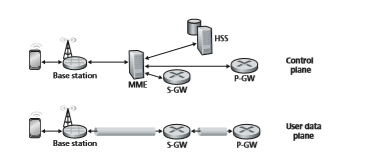
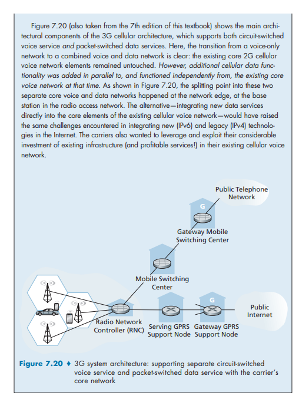
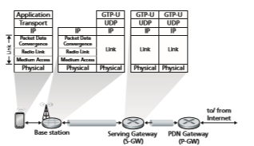

## Cellular Networks: 4G and 5G
In the previous section, we examined how a host can access the Internet when within the vicinity of an 802.11 WiFi access point (AP). But as we’ve seen, APs have small coverage areas, and a host certainly will not be able to associate with every AP it encounters. As a result, WiFi access is hardly ubiquitous for a user on the move.

By contrast, 4G cellular network access has rapidly become pervasive. A recent measurement study of more than one million US mobile cellular network subscribers found that they can find 4G signals more than 90% of the time, with download speeds of 20 Mbps and higher. Users of Korea’s three major cellular carriers are able to find a 4G signal between 95 and 99.5% of the time [Open Signal 2019]. As a result, it is now commonplace to stream HD videos or participate in videoconferences while on the move in a car, bus, or high-speed train. The ubiquity of 4G Internet access has also enabled myriad new IoT applications such as Internet-connected shared bike and scooter systems, and smartphone applications such as mobile payments (commonplace in China since 2018) and Internet-based messaging (WeChat, WhatsApp, and more).

The term _cellular_ refers to the fact that the region covered by a cellular network is partitioned into a number of geographic coverage areas, known as **cells.** Each cell contains a **base station** that transmits signals to, and receives signals from, the **mobile devices** currently in its cell. The coverage area of a cell depends on many factors, includ- ing the transmitting power of the base station, the transmitting power of the devices, obstructing buildings in the cell, and the height and type of the base station antennas.

In this section, we provide an overview of the current 4G and emerging 5G cellular networks. We’ll consider the wireless first hop between the mobile device and the base station, as well as the cellular carrier’s all-IP core network that connects the wireless first hop into the carrier’s network, other carrier networks, and the larger Internet. Perhaps surprisingly (given the origins of mobile cellular networks in the telephony world, which had a _very_ different network architecture from the Internet), we’ll encounter many of the architectural principles in 4G networks that we encoun- tered in our Internet-focused studies in Chapters 1–6, including protocol layering, an edge/core distinction, the interconnection of multiple provider networks to form a global “network of networks,” and the clear separation of data and control planes with logically centralized control. We’ll now see these principles through the lens of mobile cellular networks (rather than through an Internet lens) and thus see these principles instantiated in different ways. And of course, with a carrier’s network having an all- IP core, we’ll also encounter many of the Internet protocols that we now know well. We’ll cover additional 4G topics—mobility management in Section 7.6, and 4G secu- rity in Section 8.8—later, after developing the basic principles needed for these topics.

Our discussion here of 4G and 5G networks will be relatively brief. Mobile cellular networking is an area with great breadth and depth, with many universi- ties offering several courses on the topic. Readers seeking a deeper understanding are encouraged to see [Goodman 1997; Kaaranen 2001; Lin 2001; Korhonen 2003;Schiller 2003; Palat 2009; Scourias 2012; Turner 2012; Akyildiz 2010], as well as the particularly excellent and exhaustive books [Mouly 1992; Sauter 2014].

Just as Internet RFCs define Internet-standard architecture and protocols, 4G and 5G networks are also defined by standards documents known as Technical Spec- ifications. These documents are freely available online at [3GPP 2020]. Just like RFCs, technical specifications can make for rather dense and detailed reading. But when you have a question, they are the definitive source for answers!

### 4G LTE Cellular Networks: Architecture and Elements
The 4G networks that are pervasive as of this writing in 2020 implement the 4G Long-Term Evolution standard, or more succinctly **4G LTE
. In this section, we’ll describe 4G LTE networks. Figure 7.17 shows the major elements of the 4G LTE network architecture. The network broadly divides into the radio network at the cellular network’s edge and the core network. All network elements communicate with each other using the IP protocol we studied in Chapter 4. As with earlier 2G and 3G networks, 4G LTE is full of rather obtuse acronyms and element names. We’ll try to cut through that jumble by first focusing on element functions and how the various elements of a 4G LTE network interact with each other in both the data and the control planes:

• **Mobile Device.** This is a smartphone, tablet, laptop, or IoT device that connects into a cellular carrier’s network. This is where applications such as web browsers, map apps, voice and videoconference apps, mobile payment apps, and so much more are run. The mobile device typically implements the full 5-layer Internet pro- tocol stack, including the transport and application layers, as we saw with hosts at the Internet’s network edge. The mobile device is a network endpoint, with an IP address (obtained through NAT, as we’ll see). The mobile device also has a glob- ally unique 64-bit identifier called the **International Mobile Subscriber Iden- tity (IMSI)**, which is stored on its SIM (Subscriber Identity Module) card. The IMSI identifies the subscriber in the worldwide cellular carrier network system, including the country and home cellular carrier network to which the subscriber belongs. In some ways, the IMSI is analogous to a MAC address. The SIM card also stores information about the services that the subscriber is able to access and encryption key information for that subscriber. In the official 4G LTE jargon, the mobile device is referred to as **User Equipment (UE)**. However, in this text- book, we’ll use the more reader-friendly term “mobile device” throughout. We also note here that a mobile device is not always mobile; for example, the device might be a fixed temperature sensor or a surveillance camera.

• **Base Station.** The base station sits at the “edge” of the carrier’s network and is responsible for managing the wireless radio resources and the mobile devices with its coverage area (shown as a hexagonal cell in Figure 7.17). As we’ll see, a mobile device will interact with a base station to attach to the carrier’s network. The base station coordinates device authentication and allocation of resources

**Figure 7.17**  ♦  Elements of the 4G LTE architecturelie

(channel access) in the radio access network. In this sense, cellular base station functions are comparable (but by no means identical) to those of APs in wireless LANs. But cellular base stations have several other important roles not found in wireless LANs. In particular, base stations create device-specific IP tunnels from the mobile device to gateways and interact among themselves to handle device mobility among cells. Nearby base stations also coordinate among themselves to manage the radio spectrum to minimize interference between cells. In the offi- cial 4G LTE terminology, the base station is referred to as an “**eNode-B**,” which is rather opaque and non-descriptive. In this textbook, we will instead use the reader-friendlier term “base station” throughout.

As an aside, if you find LTE terminology a bit opaque, you aren’t alone! The etymology of “eNode-B” is rooted in earlier 3G terminology, where network function points were referred to as “nodes,” with “B” harkening back to earlier “Base Station (BS)” 1G terminology or “Base Transceiver Station (BTS)” in 2G terminology. 4G LTE is an “e”volution over 3G, and hence, an “e” now precedes “Node-B” in 4G LTE terminology. This name opaqueness shows no signs in stopping! In 5G systems, eNode-B functions are now referred to as “ng-eNB”; perhaps you can guess what that acronym stands for!

• **Home Subscriber Server (HSS).** As shown in Figure 7.18, the HSS is a control-plane element. The HSS is a database, storing information about the mobile devices for which the HSS’s network is their home network. It is used in conjunction with the MME (discussed below) for device authentication.

• **Serving Gateway (S-GW), Packet Data Network Gateway (P-GW), and other network routers.** As shown in Figure 7.18, the Serving Gateway and the Packet Data Network Gateway are two routers (often collocated in practice) that
 on the data path between the mobile device and the Internet. The PDN Gateway also provides NAT IP addresses to mobile devices and performs NAT functions (see Section 4.3.4). The PDN Gateway is the last LTE element that a datagram originating at a mobile device encounters before entering the larger Internet. To the outside world, the P-GW looks like any other gateway router; the mobility of the mobile nodes within the cellular carrier’s LTE network is hidden from the outside world behind the P-GW. In addition to these gateway routers, a cellular carrier’s all-IP core will have additional routers whose role is similar to that of traditional IP routers—to forward IP datagrams among themselves along paths that will typically terminate at elements of the LTE core network.

• **Mobility Management Entity (MME).** The MME is also a control-plane element, as shown in Figure 7.18. Along with the HSS, it plays an important role in authen- ticating a device wanting to connect into its network. It also sets up the tunnels on the data path from/to the device and the PDN Internet gateway router, and maintains information about an active mobile device’s cell location within the carrier’s cel- lular network. But, as shown in Figure 7.18, it is not in the forwarding path for the mobile device’s datagrams being sent to and from the Internet.

_Authentication._ It is important for the network and the mobile device attaching to the network to _mutually_ authenticate each other—for the network to know that the attaching device is indeed the device associated with a given IMSI, and for the mobile device to know that the network to which it is attaching is also a legitimate cellular carrier network. We will cover authentication in Chapter 8 and cover 4G authentication in Section 8.8. Here, we simply note that the MME plays a middleman role between the mobile and Home Subscriber Service (HSS) in the mobile’s home network. Specifically, after receiving an attach request from mobile device, the local MME contacts the HSS in the mobile’s home network. The mobile’s home HSS then returns enough encrypted infor- mation to the local MME to prove to the mobile device that the home HSS is performing authentication through this MME, and for the mobile device to prove to the MME that it is indeed the mobile associated with that IMSI. When a mobile device is attached to its home network, the HSS to be contacted dur- ing authentication is located within that same home network. However, when a mobile device is roaming on a visited network operated by a different cellular network carrier, the MME in that roaming network will need to contact the HSS in the mobile device’s home network.

_Path setup._ As shown in the bottom half of Figure 7.18, the data path from the mobile device to the carrier’s gateway router consists of a wireless first hop between the mobile device and the base station, and concatenated IP tunnels between the base station and the Serving Gateway, and the Serving Gateway and the PDN Gateway. Tunnels are setup under the control of the MME and used for data forwarding (rather than direct forwarding among network routers) to facilitate device mobility—when a device moves, only the tunnel endpoint

**Figure 7.18**  ♦  LTE data-plane and control-plane elements

terminating at the base station needs to be changed, while other tunnel end- points, and the Quality of Service associated with a tunnel, remain unchanged.

_Cell location tracking._ As the device moves between cells, the base stations will update the MME on the device’s location. If the mobile device is in a sleep mode but nonetheless moving between cells, the base stations can no longer track the device’s location. In this case, it will be the responsibility of the MME to locate the device for wakeup, through a process known as **paging.**

Table 7.2 summarizes the key LTE architectural elements that we have dis- cussed above and compares these functions with those we encountered in our study of WiFi wireless LANs (WLANs).

**Table 7.2**  ♦  LTE Elements, and similar WLAN (WiFi) functions

### LTE Protocols Stacks
Since the 4G LTE architecture is an all-IP architecture, we’re already very familiar  with the higher-layer protocols in the LTE protocol stack, in particular IP, 
TCP, UDP, and various application layer protocols, from our studies in Chapters 2 
through 5. Consequently, the new LTE protocols that we’ll focus on here are pri marily at the link and physical layers, and in mobility management.

Figure 7.21 shows the user-plane protocol stacks at the LTE mobile node, the base station, and the serving gateway. We’ll touch on several of LTE’s control-plane protocols later when we study LTE mobility management (Section 7.6) and security (Section 8.8). As we can see from Figure 7.21, most of the new and interesting user- plane protocol activity is happening at the wireless radio link between the mobile device and the base station.

LTE divides the mobile device’s link layer into three sublayers:

• _Packet Data Convergence._ This uppermost sublayer of the link layer sits just below IP. The Packet Data Convergence Protocol (PDCP) [3GPP PDCP 2019] performs IP header/compression in order to decrease the number of bits sent over the wireless link, and encryption/decryption of the IP datagram using keys that were established via signaling messages between the LTE mobile device and the Mobility Management Entity (MME) when the mobile device first attached to the network; we’ll cover aspects of LTE security in Section 8.8.2.

• _Radio Link Control._ The Radio Link Control (RLC) Protocol [3GPP RLCP 2018] performs two important functions: _(i)_ fragmenting (on the sending side) and reassembly (on the receiving) of IP datagrams that are too large to fit into

**Figure 7.21**  ♦  LTE data-plane protocol stacks

the underlying link-layer frames, and _(ii)_ link-layer reliable data transfer at the through the use of an ACK/NAK-based ARQ protocol. Recall the we’ve studied the basic elements of ARQ protocols in Section 3.4.1.

• _Medium Access Control (MAC)._ The MAC layer performs transmission sched- uling, that is, the requesting and use of the radio transmission slots described in Section 7.4.4. The MAC sublayer also performs additional error detection/ correction functions, including the use of redundant bit transmission as a forward error-correction technique. The amount of redundancy can be adapted to channel conditions.

Figure 7.21 also shows the use of tunnels in the user data path. As discussed above, these tunnels are established, under MME control, when the mobile device first attaches to the network. Each tunnel between two endpoints has a unique tunnel endpoint identifier (TEID). When the base station receives datagrams from the mobile device, it encapsulates them using the GPRS Tunneling Protocol [3GPP GTPv1-U 2019], including the TEID, and sends them in UDP segments to the Serving Gateway at the other end of the tunnel. On the receiving side, the base station decapsulates tun- neled UDP datagrams, extracts the encapsulated IP datagram destined for the mobile device, and forwards that IP datagram over the wireless hop to the mobile device.

### LTE Radio Access Network
 LTE uses a combination of frequency division multiplexing and time division multi- plexing on the downstream channel, known as orthogonal frequency division multi- plexing (OFDM) [Hwang 2009]. (The term “orthogonal” comes from the fact the signals being sent on different frequency channels are created so that they interfere very little with each other, even when channel frequencies are tightly spaced). In LTE, each active mobile device is allocated one or more 0.5 ms time slots in one or more of the channel frequencies. Figure 7.22 shows an allocation of eight time slots over four frequencies. By being allocated increasingly more time slots (whether on the same frequency or on different frequencies), a mobile device is able to achieve increasingly higher transmission rates. Slot (re)allocation among mobile devices can be performed as often as once every millisecond. Different modulation schemes can also be used to change the transmission rate; see our earlier discussion of Figure 7.3 and dynamic selection of modulation schemes in WiFi networks.

The particular allocation of time slots to mobile devices is not mandated by the LTE standard. Instead, the decision of which mobile devices will be allowed to trans- mit in a given time slot on a given frequency is determined by the scheduling algo- rithms provided by the LTE equipment vendor and/or the network operator. With opportunistic scheduling [Bender 2000; Kolding 2003; Kulkarni 2005], matching the physical-layer protocol to the channel conditions between the sender and receiver and choosing the receivers to which packets will be sent based on channel conditions allow the base station to make best use of the wireless medium. In addition, user

**Figure 7.22**  ♦   Twenty 0.5-ms slots organized into 10 ms frames at each frequency. An eight-slot allocation is shown shaded.

priorities and contracted levels of service (e.g., silver, gold, or platinum) can be used in scheduling downstream packet transmissions. In addition to the LTE capabilities described above, LTE-Advanced allows for downstream bandwidths of hundreds of Mbps by allocating aggregated channels to a mobile device [Akyildiz 2010].

### Additional LTE Functions: Network Attachment and Power Management
Let’s conclude or study of 4G LTE here by considering two additional important LTE functions: _(i)_ the process with which a mobile device first attaches to the net- work and _(ii)_ the techniques used by the mobile device, in conjunction with core network elements, to manage its power use.

**Network Attachment**

The process by which a mobile device attaches to the cellular carrier’s network divides broadly into three phases:

• _Attachment to a Base Station._ This first phase of device attachment is similar in purpose to, but quite different in practice from, the 802.11 association protocol that we studied in Section 7.31. A mobile device wishing to attach to a cellular carrier network will begin a bootstrap process to learn about, and then associate with, a nearby base station. The mobile device initially searches all channels in all frequency bands for a primary synchronization signal that is periodically broadcast every 5 ms by a base station. Once this signal is found, the mobile device remains on this frequency and locates the secondary synchronization signal. With information found in this second signal, the device can locate (following several further steps) additional information such as channel bandwidth, channel configurations, and the cellular carrier information of that base station. Armed with this information, the mobile device can select a base station to associate with (preferentially attaching to its home network, if available) and establish a control-plane signaling connection across the wireless hop with that base station. This mobile-to-base-station channel will be used through the remainder of the network attachment process.

• _Mutual Authentication._ In our earlier description of the Mobility Management Entity (MME) in Section 7.4.1, we noted that the base station contacts the local MME to perform mutual authentication—a process that we’ll study in further detail in Section 8.8.2. This is the second phase of network attachment, allowing the network to know that the attaching device is indeed the device associated with a given IMSI, and the mobile device to know that the network to which it is attaching is also a legitimate cellular carrier network. Once this second phase of network attachment is complete, the MME and mobile device have mutually authenticated each other, and the MME also knows the identity of the base station to which the mobile is attached. Armed with this information, the MME is now ready to configure the Mobile-device-to-PDN-gateway data path.

• _Mobile-device-to-PDN-gateway Data Path Configuration._ The MME contacts the PDN gateway (which also provides a NAT address for the mobile device), the Serving gateway, and the base station to establish the two tunnels shown in Figure 7.21. Once this phase is complete, the mobile device is able to send/receive IP datagrams via the base station through these tunnels to and from the Internet!

**Power Management: Sleep Modes**

Recall in our earlier discussion of advanced features in 802.11 (Section 7.3.5) and Bluetooth (Section 7.3.6) that a radio in a wireless device may enter a sleep state to save power when it is not transmitting or receiving in order to minimize the amount of time that the mobile device’s circuitry needs to be “on” for sending/receiving data, and for channel sensing. In 4G LTE, a sleeping mobile device can be in one of two different sleep states. In the discontinuous reception state, which is typically entered after several hundred milliseconds of inactivity [Sauter 2014], the mobile device and the base station will schedule periodic times in advance (typically several hundred milliseconds apart) at which the mobile device will wake up and actively monitor the channel for downstream (base station to mobile device) transmissions; apart from these scheduled times, however, the mobile device’s radio will be sleeping.

If the discontinuous reception state might be considered a “light sleep,” the second sleep state—the Idle state—which follows even longer periods of 5 to 10 seconds of inactivity, might be thought of as a “deep sleep.” While in this deep sleep, the mobile device’s radio wakes up and monitors the channel even less frequently. Indeed, this sleep is so deep that if the mobile device moves into a new cell in the carrier’s networkwhile sleeping, it need not inform the base station with which it was previous associ- ated. Thus, when waking up periodically from this deep sleep, the mobile device will need to re-establish an association with a (potentially new) base station in order to check for paging messages broadcast by the MME to base stations nearby the base station with which the mobile was last associated. These control-plane paging mes- sages, which are broadcast by these base stations to all mobile devices in their cells, indicate which mobile devices should fully wake up and re-establish a new data-plane connection to a base station (see Figure 7.18) in order to receive incoming packets.

### The Global Cellular Network: A Network of Networks
 Having now studied the 4G cellular network architecture, let’s take a step back at take a look at how the global cellular network—itself a “network of networks” like the Internet—is organized.

Figure 7.23 shows a user’s mobile smartphone connected via a 4G base station into its **home network**. The user’s home mobile network is operated by a cellular

**Figure 7.23**  ♦   The global cellular data network: a network of networks.

carrier such as Verizon, AT&T, T-Mobile, or Sprint in the United States; Orange in France; or SK Telecom in Korea. The user’s home network, in turn, is connected to the networks of other cellular carriers and to the global Internet, though one or more gateway routers in the home network, as shown in Figure 7.23. The mobile networks themselves interconnect with each other either via the public Internet or via an Internet Protocol Packet eXchange (IPX) Network [GSMA 2018a]. An IPX is a managed network specifically for interconnecting cellular carriers, similar to Internet eXchange Points (see Figure 1.15) for peering among ISPs. From Figure 7.23, we can see that the global cellular network is indeed a “network of networks”—just like the Internet (recall Figure 1.15 and Section 5.4). 4G networks can also peer with 3G cellular voice/data networks and earlier voice-only networks.

We’ll return shortly to additional 4G LTE topics—mobility management in Section 7.6, and 4G security in Section 8.8.2—later, after developing the basic principles needed for these topics. Let’s now take a quick look at the emerging 5G networks.

### 5G Cellular Networks
 The ultimate wide-area data service would be one with ubiquitous gigabit connec- tion speeds, extremely low latency, and unrestricted limitations on the number of users and devices that could be supported in any region. Such a service would open the door to all kinds of new applications, including pervasive augmented reality and virtual reality, control of autonomous vehicles via wireless connections, control of robots in factories via wireless connections, and replacement of residential access technologies, such as DSL and cable, with fixed wireless Internet services (that is, residential wireless connections from base stations to modems in homes).

It is expected that 5G, for which progressively improved versions are likely to be rolled out in the 2020 decade, will make a big step towards achieving the goals of the ultimate wide-area data service. It is predicted that 5G will provide roughly a 10x increase in peak bitrate, a 10x decrease in latency, and a 100x increase in traffic capacity over 4G [Qualcomm 2019].

Principally, 5G refers to “5G NR (New Radio),” which is the standard adopted by 3GPP. Other 5G technologies besides NR do exist, however. For example, Veri- zon’s proprietary 5G TF network operates on 28 and 39 GHz frequencies and is used only for fixed wireless Internet service, not in smartphones.

5G standards divide frequencies into two groups: FR1 (450 MHz–6 GHz) and FR2 (24 GHz–52 GHz). Most early deployments will be in the FR1 space, although there are early deployments as of 2020 in the FR2 space for fixed Internet residential access as mentioned just above. Importantly, the physical layer (that is, wireless) aspects of 5G are _not_ backward-compatible with 4G mobile communications systems such as LTE: in particular, it can’t be delivered to existing smartphones by deploying base station upgrades or software updates. Therefore, in the transition to 5G, wireless carriers will need to make substantial investments in physical infrastructure.FR2 frequencies are also known as **millimeter wave frequencies**. While millimeter wave frequencies allow for much faster data speeds, they come with two major drawbacks:

• Millimeter wave frequencies have much shorter range from base station to receiv- ers. This makes millimeter wave technology unsuitable in rural areas and requires denser deployments of base stations in urban areas.

• Millimeter wave communication is highly susceptible to atmospheric interfer- ence. Nearby foliage and rain can cause problems for outdoor use.

5G is not one cohesive standard, but instead consists of three co-existing standards [Dahlman 2018]:

• _eMBB (Enhanced Mobile Broadband)._ Initial deployments of 5G NR have focused on eMBB, which provides for increased bandwidth for higher down- load and upload speeds, as well as a moderate reduction in latency when compared to 4G LTE. eMBB enables rich media applications, such as mobile augmented reality and virtual reality, as well as mobile 4K resolution and 360° video streaming.

• _URLLC (Ultra Reliable Low-Latency Communications)._ URLLC is targeted towards applications that are highly latency-sensitive, such as factory automation and autonomous driving. URLLC is targeting latencies of 1msec. As of this writ- ing, technologies that enable URLLC are still being standardized.

• _mMTC (Massive Machine Type Communications)._ mMTC is a narrowband access type for sensing, metering, and monitoring applications. One priority for the design of 5G networks is to lower barriers for network connectivity for IoT devices. In addition to lowering latency, emerging technologies for 5G networks are focusing on reducing power requirements, making the use of IoT devices more pervasive than has been with 4G LTE.

**5G and Millimeter Wave Frequencies**

Many 5G innovations will be a direct result of working in the millimeter wave fre- quencies in the 24 GHz–52 GHz band. For example, these frequencies offer the potential of achieving 100x increase in capacity over 4G. To get some insight into this, capacity can be defined as the product of three terms [Björnson 2017]:

capacity = cell density \* available spectrum \* spectral efficiency

where cell density is in units of cells/km2, available spectrum is in units of Hertz, and spectral efficiency is a measure of how efficiently each base station can com- municate with users and is in units of bps/Hz/cell. By multiplying these units out, it is easy to see that capacity is in units of bps/km2. For each of these three terms, the values will be larger for 5G than for 4G:

• Because millimeter frequencies have much shorter range than 4G LTE fre- quencies, more base stations are required, which in turn increases the cell density.

• Because 5G FR2 operates in a much larger frequency band (52 − 24 = 28 GHz) than 4G LTE (up to about 2 GHz), it has more available spectrum.

• With regard to spectral efficiency, information theory says that if you want to double spectral efficiency, a 17-fold increase in power is needed [Björnson 2017]. Instead of increasing power, 5G uses MIMO-technology (the same tech- nology we encountered in our study of 802.11 networks in Section 7.3), which uses multiple antennas at each base station. Rather than broadcasting signals in all directions, each MIMO antenna employs **beam forming** and directs the signal at the user. MIMO technology allows a base station to send to 10–20 users at the same time in the same frequency band.

By increasing all three terms in the capacity equation, 5G is expected to provide a 100x increase in capacity in urban areas. Similarly, owing to the much wider fre- quency band, 5G is expected to provide peak download rates of 1 Gbps or higher.

Millimeter wave signals are, however, easily blocked by buildings and trees. **Small cell stations** are needed to fill in coverage gaps between base stations and users. In a highly populous region, the distance between two small cells could vary from 10 to 100 meters [Dahlman 2018].

**5G Core Network**

The **5G Core network** is the data network that manages all of the 5G mobile voice, data and Internet connections. The 5G Core network is being redesigned to better integrate with the Internet and cloud-based services, and also includes distributed servers and caches across the network, thereby reducing latency. Network function virtualization (as discussed in Chapters 4 and 5), and network slicing for different applications and services, will be managed in the core.

The new 5G Core specification introduces major changes in the way mobile networks support a wide variety of services with varied performance. As in the case of the 4G core network (recall Figures 7.17 and 7.18), the 5G core relays data traffic from end devices, authenticates devices, and manages device mobility. The 5G core also contains all of the network elements that we encountered in Section 7.4.2—the mobile devices, the cells, the base stations, and the Mobility Management Entity (now divided into two sub-elements, as discussed below), the HSS, and the Serving and PDN gateways.

Although the 4G and 5G core networks perform similar functions, there are some major differences in that the new 5G core architecture. The 5G Core is designed for complete control and user-plane separation (see Chapter 5). The 5G Core consists purely of virtualized software-based network functions. This new architecture will giveoperators the flexibility to meet the diverse requirements of the different 5G applica- tions. Some of the new 5G core network functions include [Rommer 2019]:

• _User-Plane Function (UPF)._ Control and user-plane separation (see Chapter 5) allows packet processing to be distributed and pushed to the network edge.

• _Access and Mobility Management Function (AMF)._ The 5G Core essentially decomposes the 4G Mobility Management Entity (MME) into two functional elements: AMF and SMF. The AMF receives all the connection and session information from end-user equipment but only handles connection and mobility management tasks.

• _Session Management Function (SMF)._ Session management is handled by the Session Management Function (SMF). The SMF is responsible for interacting with the decoupled data plane. The SMF also performs IP address management and plays the role of DHCP.

As of this writing (2020), 5G is in its early stages of deployment, and many 5G standards have yet to be finalized. Only time will tell whether 5G will become a per- vasive broadband wireless service, whether it will successfully compete with WiFi for indoor wireless service, whether it will become a critical component of factory automation and the autonomous vehicle infrastructure, and whether it will take us a big step forward toward the ultimate wide-area wireless service.
