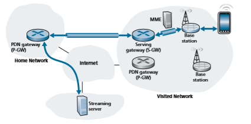
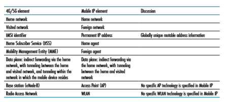

## Mobility Management in Practice
In the previous section, we identified key fundamental challenges and potential solu- tions in developing a network architecture to support device mobility: the notions of home and visited networks; the home network’s role as a central point of informa- tion and control for mobile devices subscribed to that home network; control-plane functions needed by a home network’s mobility management entity to track a mobile device roaming among visited networks; and data-plane approaches of direct and indirect routing to enable a correspondent and a mobile device to exchange data- grams. Let’s now look at how these principles are put into practice! In Section 7.2.1, we’ll study mobility management in 4G/5G networks; in Section 7.2.1, we’ll look at Mobile IP, which has been proposed for the Internet.

### Mobility Management in 4G/5G Networks
 Our earlier study of 4G and emerging 5G architectures in Section 7.4 acquainted us with all of the network elements that play a central role in 4G/5G mobility management. Let’s now illustrate how those elements interoperate with each other to provide mobility services in today’s 4G/5G networks [Sauter 2014; GSMA 2019b], which have their roots in earlier 3G cellular voice and data networks [Sauter 2014], and even earlier 2G voice-only networks [Mouly 1992]. This will help us synthesize what we’ve learned so far, allow us to introduce a few more advanced topics as well, and provide a lens into what might be in store for 5G mobility management.

Let’s consider a simple scenario in which a mobile user (e.g., a passenger in a car), with a smartphone attaches to a visited 4G/5G network, begins streaming a HD video from a remote server, and then moves from the cell coverage of one 4G/5G base station to another. The four major steps in this scenario are shown in Figure 7.28:

1\. _Mobile device and base station association._ The mobile device associates with a base station in the visited network.

2\. _Control-plane configuration of network elements for the mobile device._ The visited and home networks establish control-plane state indicating that the mobile device is resident in the visited network.

3\. _Data-plane configuration of forwarding tunnels for the mobile device._ The vis- ited network and the home network establish tunnels through which the mobile device and streaming server can send/receive IP datagrams, using indirect rout- ing through the home network’s Packet Data Network gateway (P-GW).

4\. _Mobile device handover from one base station to another._ The mobile device changes its point of attachment to the visited network, via handover from one base station to another.

Let’s now consider each of these four steps in more detail.

**Figure 7.28**  ♦  An example 4G/5G mobility scenario

**1\. Base station association.** Recall that in Section 7.4.2, we studied the procedures by which a mobile device associates with a base station. We learned that the mobile device listens on all frequencies for primary signals being transmitted by base sta- tions in its area. The mobile device acquires progressively more information about these base stations, ultimately selecting the base station with which to associate, and bootstrapping a control- signaling channel with that base station. As part of this association, the mobile device provides the base station with its International Mobile Subscriber Identity (IMSI), which uniquely identifies the mobile device as well as its home network and other additional subscriber information.

**2\. Control-plane configuration of LTE network elements for the mobile device.** Once the mobile-device-to-base-station signaling channel has been established, the base station can contact the MME in the visited network. The MME will consult and configure a number of 4G/5G elements in both the home and visited networks to establish state on behalf of the mobile node:

• The MME will use to the IMSI and other information provided by the mobile device to retrieve authentication, encryption, and available network service infor- mation for that subscriber. That information might be in the MME’s local cache, retrieved from another MME that the mobile device had recently contacted, or retrieved from the HSS in the mobile device’s home network. The mutual authen- tication process (which we will cover in more detail in Section 8.8) ensures that
the visited network is sure about the identity of the mobile device and that the device can authenticate the network to which it is attaching.

• The MME informs the HSS in the mobile device’s home network that the mobile device is now resident in the visited network, and the HSS updates its database.

• The base station and the mobile device select parameters for the data-plane chan- nel to be established between the mobile device and the base station (recall that a control plane signaling channel is already in operation).

**3\. Data-plane configuration of forwarding tunnels for the mobile device.** 
The MME next configures the data plane for the mobile device, as shown in Figure 7.29. Two tunnels are established. One tunnel is between the base station and a Serving Gateway in the visited network. The second tunnel is between that Serving Gateway and the PDN Gateway router _in the mobile device’s home network._ 4G LTE implements this form of symmetric indirect routing—all traffic to/from the mobile device will be tunneled through the device’s home network. 4G/5G tunnels use the GPRS Tunneling Protocol (GTP), specified in [3GPP GTPv1-U 2019]. The Tunnel Endpoint ID (TEID) in the GTP header indicates which tunnel a datagram belongs, allowing multiple flows to be multiplexed and de-multiplexed by GTP between tunnel endpoints.

It is instructive to compare the configuration of tunnels in Figure 7.29 (the case of mobile roaming in a visited network) with that of Figure 7.18 (the case of mobility

**Figure 7.29**  ♦   Tunneling in 4G/5G networks between the Serving Gateway in the visited network and the PDN gateway in the home network

only within the mobile device’s home network). We see that in both cases, the Serv- ing Gateway is co-resident in the same network as the mobile device, but PDN Gate- way (which is always the PDN Gateway in the mobile device’s home network) may be in a different network than the mobile device. This is precisely indirect routing. An alternative to indirect routing, known as **local breakout** [GSMA 2019a] has been specified in which the Serving Gateway establishes a tunnel to the PDN Gateway in the local, visited network. In practice, however, local breakout is not widely used [Sauter 2014].

Once the tunnels have been configured and activated, the mobile device can now forward packets to/from the Internet via the PDN gateway in its home network!

**4\. Handover management.** A **handover** occurs when a mobile device changes its association from one base station to another. The handover process described below is the same, regardless of whether the mobile device is resident in its home network, or is roaming in a visited network.

As shown in Figure 7.30, datagrams to/from the device are initially (before handover) forwarded to the mobile through one base station (which we’ll refer to as the _source_ base station), and after handover are routed to the mobile device through another base station (which we’ll refer to as the _target_ base station). As we will see, a handover between base stations results not only in the mobile device transmitting/ receiving to/from a new base station but also in a change of the base-station side of the Serving-Gateway-to-base-station tunnel in Figure 7.29. In the simplest case of

**Figure 7.30**  ♦   Steps in handing over a mobile device from the source base station to the target base station

handover, when the two base stations are near each other and in the same network, all changes occurring as a result of handover are thus relatively local. In particular, the PDN gateway being used by the Serving Gateway remains blissfully unaware of device mobility. Of course, more complicated handoff scenarios will require the use of more complex mechanisms [Sauter 2014; GSMA 2019a].

There may be several reasons for handover to occur. For example, the signal between the current base station and the mobile may have deteriorated to such an extent that communication is severely impaired. Or a cell may have become over- loaded, handling a large amount of traffic; handing over mobile devices to less congested nearby cells may alleviate this congestion. A mobile device periodically measures characteristics of a beacon signal from its current base station as well as signals from nearby base stations that it can “hear.” These measurements are reported once or twice a second to the mobile device’s current (source) base station. Based on these measurements, the current loads of mobiles in nearby cells, and other factors, the source base station may choose to initiate a handover. The 4G/5G standards do not specify a specific algorithm to be used by a base station to determine whether or not to perform handover, or which target base station to choose; this is an active area of research [Zheng 2008; Alexandris 2016].

Figure 7.30 illustrates the steps involved when a source base station decides to hand over a mobile device to the target base station.

1\. The current (source) base station selects the target base station, and sends a Handover Request message to the target base station.

2\. The target base station checks whether it has the resources to support the mobile device and its quality of service requirements. If so, it pre-allocates channel resources (e.g., time slots) on its radio access network and other resources for that device. This pre-allocation of resources frees the mobile device from having to go through the time-consuming base-station association protocol discussed earlier, allowing handover to be executed as fast as possible. The target base station replies to the source base station with a Handover Request Acknowledge message, containing all the information at the target base station that the mobile device will need to associate with the new base station.

3\. The source base station receives the Handover Request Acknowledgement message and informs the mobile device of the target base station’s identity and channel access information. At this point, the mobile device can begin send- ing/receiving datagrams to/from the new target base station. From the mobile device’s point of view, handover is now complete! However, there is still a bit of work to be done within the network.

4\. The source base station will also stop forwarding datagrams to the mobile device and instead forward any tunneled datagrams it receives to the target base station, which will later forward these datagrams to the mobile device.

5\. The target base station informs the MME that it (the target base station) will be the new base station servicing the mobile device. The MME, in turn, signalsto the Serving Gateway and the target base station to reconfigure the Serving- Gateway-to-base-station tunnel to terminate at the target base station, rather than at the source base station.

6\. The target base station confirms back to the source base station that the tunnel has been reconfigured, allowing the source base station to release resources associated with that mobile device.

7\. At this point, the target base station can also begin delivering datagrams to the mobile device, including datagrams forwarded to the target base station by the source base station during handover, as well as datagrams newly arriving on the reconfigured tunnel from the Serving Gateway. It can also forward outgo- ing datagrams received from the mobile device into the tunnel to the Serving Gateway.

The roaming configurations in today’s 4G LTE networks, such as that dis- cussed above, will also be used in future emerging 5G networks [GSMA 2019c]. Recall, however, from our discussion in Section 7.4.6 that the 5G networks will be denser, with significantly smaller cell sizes. This will make handover an even more critically important network function. In addition, low handover latency will be critical for many real-time 5G applications. The migration of the cellular network control plane to the SDN framework that we studied earlier in Chapter 5 [GSMA 2018b; Condoluci 2018] promises to enable implementations of a higher-capacity, lower-latency 5G cellular network control plane. The application of SDN in a 5G context is the subject of considerable research [Giust 2015; Ordonez-Lucena 2017; Nguyen 2016].

### Mobile IP
 Today’s Internet does not have any widely deployed infrastructure that provides the type of services for “on the go” mobile users that we encountered for 4G/5G cellular networks. But this is certainly not due to the lack of technical solutions for providing such services in an Internet setting! Indeed, the Mobile IP architecture and protocols [RFC 5944] that we will briefly discuss below have been standardized by Internet RFCs for more than 20 years, and research has continued on new, more secure and more generalized mobility solutions [Venkataramani 2014].

Instead, it has perhaps been the lack of motivating business and use cases [Arkko 2012] and the timely development and deployment of alternative mobility solutions in cellular networks that has blunted the deployment of Mobile IP. Recall that 20 years ago, 2G cellular networks had already provided a solution for mobile voice services (the “killer app” for mobile users); additionally, next generation 3G net- works supporting voice _and_ data were on the horizon. Perhaps the dual technology solution—mobile services via cellular networks when we are truly mobile and “on the go” (i.e., the rightmost side of the mobility spectrum in Figure 7.24) and Internet services via 802.11 networks or wireline networks when we are stationary or movinglocally (i.e., the leftmost side of the mobility spectrum in Figure 7.24)—that we had 20 years ago and still have today will persist into the future.

It will nonetheless be instructive to briefly overview the Mobile IP standard here, as it provides many of the same services as cellular networks and implements many of the same basic mobility principles. Earlier editions of this textbook have provided a more in-depth study of Mobile IP than we will provide here; the inter- ested reader can find this retired material on this textbook’s website. The Internet architecture and protocols for supporting mobility, collectively known as Mobile IP, are defined primarily in RFC 5944 for IPv4. Mobile IP, like 4G/5G, is a complex standard, and would require an entire book to describe in detail; indeed one such book is [Perkins 1998b]. Our modest goal here is to provide an overview of the most important aspects of Mobile IP.

The overall architecture and elements of Mobile IP are strikingly similar to that of cellular provider networks. There is a strong notion of a home network, in which a mobile device has a permanent IP address, and visited networks (known as “foreign” networks in Mobile IP), where the mobile device will be allocated a care-of-address. The home agent in Mobile IP has a similar function to the LTE HSS: it tracks the location of a mobile device by receiving updates from foreign agents in foreign net- works visited by that mobile device, just as the HSS receives updates from Mobil- ity Management Entities (MMEs) in visited networks in which a 4G mobile device resides. And both 4G/5G and Mobile IP use indirect routing to a mobile node, using tunnels to connect the gateway routers in the home and visited/foreign networks. Table 7.3 summarizes the elements of the Mobile IP architecture, along with a com- parison with similar elements in 4G/5G networks

**Table 7.3**  ♦  Commonalities between 4G/5G and Mobile IP architectures

The mobile IP standard consists of three main pieces:

• _Agent discovery._ Mobile IP defines the protocols used by a foreign agent to adver- tise its mobility services to a mobile device that wishes to attach to its network. Those services will include providing a care-of-address to the mobile device for use in the foreign network, registration of the mobile device with the home agent in the mobile device’s home network, and forwarding of datagrams to/from the mobile device, among other services.

• _Registration with the home agent._ Mobile IP defines the protocols used by the mobile device and/or foreign agent to register and deregister a care-of-address with a mobile device’s home agent.

• _Indirect routing of datagrams._ Mobile IP also defines the manner in which data- grams are forwarded to mobile devices by a home agent, including rules for for- warding datagrams and handling error conditions, and several forms of tunneling [RFC 2003, RFC 2004].

Again, our coverage here of Mobile IP has been intentionally brief. The inter- ested reader should consult the references in this section, or more-detailed discus- sions of Mobile IP in earlier editions of this textbook.
