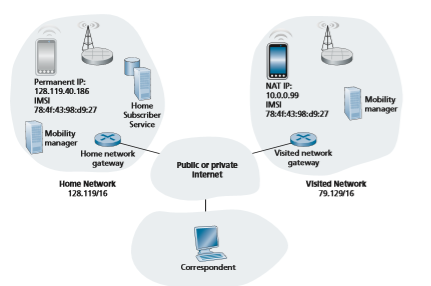
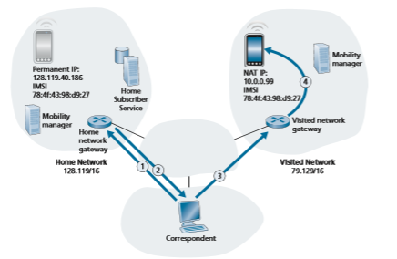

## Mobility Management: Principles
Having covered the wireless nature of the communication links in a wireless net- work, it’s now time to turn our attention to the mobility that these wireless links ena- ble. In the broadest sense, a mobile device is one that changes its point of attachment into the network over time. Because the term mobility has taken on many meanings in both the computer and telephony worlds, it will serve us well first to carefully consider forms of mobility.

### Device Mobility: a Network-layer Perspective
 From the network layer’s standpoint, a physically mobile device will present a very different set of challenges to the network layer, depending on how active the device is as it moves between points of attachment to the network. At the one end of the spec- trum, scenario _(a)_ in Figure 7.24 is the mobile user who himself/herself physically moves between networks, but powers down the mobile device when moving. For example, a student might disconnect from a wireless classroom network and power down his/her device, head to the dining commons and connect to the wireless access
 
 
**Figure 7.24**  ♦   Various degrees of mobility, from a network-layer perspective
 
 network there while eating, and then disconnect and power down from the dining commons network, walk to the library, and connect to the library’s wireless network while studying. From a networking perspective, this device is _not_ mobile—it attaches to an access network and remains in that access network while on. In this case, the device serially associates with, and later disassociates from, each wireless access network encountered. This case of device (non-)mobility can be completely handled using the networking mechanisms we’ve already studied in Sections 7.3 and 7.4.

In scenario _(b)_ in Figure 7.24, the device is physically mobile but remains attached to the same access network. This device is also _not_ mobile from a network- layer perspective. Additionally, if the device remains associated with the same 802.11 AP or LTE base station, the device is not even mobile from a link-layer perspective.

From a network standpoint, our interest in device mobility really starts with case _(c),_ where a device changes its access network (e.g., 802.11 WLAN or LTE cell) while continuing to send and receiving IP datagrams, and while maintaining higher-level (e.g., TCP) connections. Here, the network will need to provide **handover**—a trans- fer of responsibility for forwarding datagrams to/from one AP or base station to the mobile device—as the device moves among WLANs or among LTE cells. We’ll cover handover in detail in Section 7.6. If the handover occurs within access net- works belonging to a single network provider, that provider can orchestrate handover on its own. When a mobile device roams between multiple provider networks, as in scenario _(d)_, the providers must orchestrate handover together, which considerably complicates the handover process.

### Home Networks and Roaming on Visited Networks
 As we learned in our discussions of cellular 4G LTE networks in Section 7.4.1, every subscriber has a “home” with some cellular provider. We learned that the Home Subscriber Service (HSS) stores information about each of its subscribers, includ- ing a globally unique device ID (embedded in a subscriber’s SIM card), information about services that the subscriber may access, cryptographic keys to be used for

communication, and billing/charging information. When a device is connected to a cellular network, other than its home network, that device is said to be roaming on a visited network. When a mobile device attaches to, and roams on, a visited network, coordination will be required between the home network and the visited network.

The Internet does not have a similarly strong notion of a home network or a visited network. In practice, a student’s home network might be the network operated by his/her school; for mobile professionals, their home network might be their company network. The visited network might be the network of a school or a company they are visiting. But there is no notion of a home/visited network deeply embedded in the Internet’s architecture. The Mobile IP protocol [Perkins 1998, RFC 5944], which we will cover briefly in Section 7.6, was a proposal that strongly incorporated the notion of home/visited networks. But Mobile IP has seen limited deployment/use in practice. There are also activities underway that are built on top of the existing IP infrastructure to provide authenticated network access across visited IP networks. Eduroam [Eduroam 2020] is one such activity.

The notion of a mobile device having a home network provides two important advantages: the home network provides a single location where information about that device can be found, and (as we will see) it can serve as a coordination point for communication to/from a roaming mobile device.

To appreciate the potential value of the central point of information and coordi nation, consider the human analogy of a 20-something adult Bob moving out of the family home. Bob becomes mobile, living in a series of dormitories and apartments, and often changing addresses. If an old friend Alice wants to get in touch, how can Alice find the current address of Bob? One common way is to contact the family, since a mobile 20-something adult will often register his or her current address with the family (if for no other reason than so that the parents can send money to help pay the rent!). The family home becomes that unique location that others can go to as a first step in communicating with Bob. Additionally, later postal communication from Alice may be either indirect (e.g., with mail being sent first to Bob’s family home and then forwarded to Bob) or direct (e.g., with Alice using the address obtained from Bob’s parents to send mail directly to Bob)

### Direct and Indirect Routing to/from a Mobile Device
 Let us now consider the conundrum faced by the Internet-connected host (that we will refer to as a _correspondent_) in Figure 7.25 wishing to communicate with a mobile device that might be located within that mobile device’s cellular home net- work, or might be roaming in a visited network. In our development below, we’ll adopt a 4G/5G cellular network perspective, since these networks have such a long history of supporting device mobility. But as we’ll see, the fundamental challenges and basic solution approaches for supporting device mobility are equally applicable in both cellular networks and in the Internet.

As shown in Figure 7.25, we’ll assume that the mobile device has a globally unique identifier associated with it. In 4G, LTE cellular networks (see Section 7.4),

**Figure 7.25**  ♦  Elements of a mobile network architecture

this would be the International Mobile Subscriber Identity (IMSI) and an associated phone number, stored on a mobile device’s SIM card. For mobile Internet users, this would be a permanent IP address in the IP address range of its home network, as in the case of the Mobile IP architecture.

What approaches might be used in a mobile network architecture that would allow a datagram sent by the correspondent to reach that mobile device? Three basic approaches can be identified and are discussed below. As we will see, the latter two of these are adopted in practice.

**Leveraging the Existing IP Address Infrastructure**

Perhaps the simplest approach to routing to a mobile device in a visited network is to simply use the existing IP addressing infrastructure—to add nothing new to the architecture. What could be easier!

Recall from our discussion of Figure 4.21 that an ISP uses BGP to advertise routes to destination networks by enumerating the CIDRized address ranges of reach- able networks. A visited network could thus advertise to all other networks that a
particular mobile device is resident in its network simply by advertising a highly specific address—the mobile device’s full 32-bit IP permanent address—essentially informing other networks that it has the path to be used to forward datagrams to that mobile device. These neighboring networks would then propagate this routing infor- mation throughout the network as part of the normal BGP procedure of updating rout- ing information and forwarding tables. Since datagrams will always be forwarded to the router advertising the most specific destination for that address (see Section 4.3), all datagrams addressed to that mobile device will be forwarded to the visited net- work. If the mobile device leaves one visited network and joins another, the new vis- ited network can advertise a new, highly specific route to the mobile device, and the old visited network can withdraw its routing information regarding the mobile device.

This solves two problems at once, and does so without making changes to the network-layer infrastructure! Other networks know the location of the mobile device, and it is easy to route datagrams to the mobile device, since the forwarding tables will direct datagrams to the visited network. The killer drawback, however, is that of scalability—network routers would have to maintain forwarding table entries for potentially billions of mobile devices, and update a device’s entry each time it roams to a different network. Clearly, this approach would not work in practice. Some addi- tional drawbacks are explored in the problems at the end of this chapter.

An alternative, more practical, approach (and one that has been adopted in prac- tice) is to push mobility functionality from the network core to the network edge— a recurring theme in our study of Internet architecture. A natural way to do this is via the mobile device’s home network. In much the same way that parents of the mobile 20-something adult track their child’s location, a mobility management entity (MME) in the mobile device’s home network could track the visited network in which the mobile device resides. This information might reside in a database, shown as the HSS database in Figure 7.25. A protocol operating between the visited network and the home network will be needed to update the network in which the mobile device resides. You might recall that we encountered the MME and HSS elements in our study of 4G LTE. We’ll reuse their element names here, since they are so descriptive, and also because they are pervasively deployed in 4G networks.

Let’s next consider the visited network elements shown in Figure 7.25 in more detail. The mobile device will clearly need an IP address in the visited network. The possibilities here include using a permanent address associated with the mobile device’s home network, allocating a new address in the address range of the visited network, or providing an IP address via NAT (see Section 4.3.4). In the latter two cases, a mobile device has a transient identifier (a newly allocated IP address) in addition to its permanent identifiers stored in the HSS in its home network. These cases are analogous to a writer addressing a letter to the address of the house in which our mobile 20-something adult is currently living. In the case of a NAT address, datagrams destined to the mobile device would eventually reach the NAT gateway router in the visited network, which would then perform NAT address translation and forward the datagram to the mobile device.We have now seen a number of elements of a solution to the correspondent’s dilemma in Figure 7.24: home and visited networks, the MME and HSS, and mobile device addressing. But how should datagrams be addressed and forwarded to the mobile device? Since only the HSS (and not network-wide routers) knows the loca- tion of the mobile device, the correspondent cannot simply address a datagram to the mobile device’s permanent address and send it into the network. Something more must be done. Two approaches can be identified: indirect and direct routing.

**Indirect Routing to a Mobile Device**

Let’s again consider the correspondent that wants to send a datagram to a mobile device. In the **indirect routing** approach, the correspondent simply addresses the datagram to the mobile device’s permanent address and sends the datagram into the network, blissfully unaware of whether the mobile device is resident in its home network or in a visited network; mobility is thus completely transparent to the cor- respondent. Such datagrams are first routed, as usual, to the mobile device’s home network. This is illustrated in step 1 in Figure 7.26.

**Figure 7.26**  ♦  Indirect routing to a mobile device

Let’s now turn our attention to the HSS, which is responsible for interacting with visited networks to track the mobile device’s location, and the home network’s gate- way router. One job of this gateway router is to be on the lookout for an arriving data- gram addressed to a device whose home is in that network, but that currently resides in a visited network. The home network gateway intercepts this datagram, consults with the HSS to determine the visited network where the mobile device is resident, and forwards the datagram toward the visited network gateway router—step 2 in Fig- ure 7.26. The visited network gateway router then forwards the datagram toward the mobile device—step 3 in Figure 7.26. If NAT translation is used, as in Figure 7.26, the visited network gateway router performs NAT translation.

It is instructive to consider the rerouting at the home network in bit more detail. Clearly, the home network gateway will need to forward the arriving datagram to the gateway router in the visited network. On the other hand, it is desirable to leave the correspondent’s datagram intact, since the application receiving the datagram should be unaware that the datagram was forwarded via the home network. Both goals can be satisfied by having the home gateway encapsulate the correspondent’s original complete datagram within a new (larger) datagram. This larger datagram is then addressed and delivered to the visited network’s gateway router, which will decapsulate the datagram—that is, remove the correspondent’s original datagram from within the larger encapsulating datagram—and forward (step 3 in Figure 7.26) the original datagram to the mobile device. The sharp reader will note that the encap- sulation/decapsulation described here is precisely the notion of tunneling, discussed in Section 4.3 in the context of IPv6; indeed, we also discussed the use of tunneling in the context of Figure 7.18, when we introduced the 4G LTE data plane.

Finally, let’s consider how the mobile device sends datagrams to the corre- spondent. In the context of Figure 7.26, the mobile device will clearly need to for- ward the datagram through the visited gateway router, in order to perform NAT translation. But how then should the visited gateway router forward the datagram to the correspondent? As shown in Figure 7.26, there are two options here: _(4a)_ the datagram could be tunneled back to the home gateway router, and sent to the corre- spondent from there, or _(4b)_ the datagram could be transmitted from the visited net- work directly to the correspondent—an approach known as **local breakout** [GSMA 2019a] in LTE.

Let’s summarize our discussion of indirect routing by reviewing the new net- work-layer functionality required to support mobility.

• _A mobile-device–to–visited-network association protocol._ The mobile device will need to associate with the visited network, and will similarly need to disassociate when leaving the visited network.

• _A visited-network–to–home-network-HSS registration protocol._ The visited net- work will need to register the mobile device’s location with the HSS in the home network, and perhaps use information obtained from the HSS in performing device authentication.

• _A datagram tunneling protocol between in the home network gateway and the visited network gateway router._ The sending side performs encapsulation and forwarding of the correspondent’s original datagram; on the receiving side, the gateway router performs decapsulation, NAT translation, and forwarding of the original datagram to the mobile device.

The previous discussion provides all the needed elements for a mobile device to maintain an ongoing connection with a correspondent as the device moves among networks. When a device roams from one visited network to another, the new visited network information needs to be updated in the home network HSS, and the         home-ateway-router-to-visited-gateway-router tunnel endpoint needs to be moved. But will the mobile device see an interrupted flow of datagrams as it moves between networks? As long as the time between the mobile device disconnection from one visited network and its attachment to the next visited network is small, few datagrams will be lost. Recall from Chapter 3 that end-to-end connections can experience datagram loss due to network congestion. Hence, occasional datagram loss within a connection when a device moves between networks is by no means a catastrophic problem. If loss-free communication is required, upper-layer mechanisms will recover from datagram loss, whether such loss results from network congestion or from device mobility.

Our discussion above has been purposefully somewhat generic. An indirect routing approach is used in the mobile IP standard [RFC 5944], as well as in 4G LTE networks [Sauter 2014]. Their details, in particular the tunneling procedures employed, differ just a bit from our generic discussion above.

**Direct Routing to a Mobile Device**

The indirect routing approach illustrated in Figure 7.26 suffers from an inefficiency known as the **triangle routing problem**—datagrams addressed to the mobile device must be forwarded first to the home network and then to the visited network, even when a much more efficient route exists between the correspondent and the roaming mobile device. In the worst case, imagine a mobile user who is roaming on the same network that is the home network for an overseas colleague who our mobile user is visiting. The two are sitting side-by-side and exchanging data. Datagrams between the mobile user and his overseas colleague will be forwarded to the mobile user’s home network and then back again to the visited network!

**Direct routing** overcomes the inefficiency of triangle routing, but does so at the cost of additional complexity. In the direct routing approach, shown in Figure 7.27, the correspondent first discovers the visited network in which the mobile is resident. This is done by querying the HSS in the mobile device’s home network, assuming (as in the case of indirect routing) that the mobile device’s visited network is regis- tered in the HSS. This is shown as steps 1 and 2 in Figure 7.27. The correspondent then tunnels datagrams from its network _directly_ to the gateway router in the mobile device’s visited network

**Figure 7.27**  ♦  Direct routing to a mobile device

.While direct routing overcomes the triangle routing problem, it introduces two important additional challenges:

• A mobile-user location protocol is needed for the correspondent to query the HSS to obtain the mobile device’s visited network (steps 1 and 2 in Figure 7.27). This is in addition to the protocol needed for the mobile device to register its location with its HSS.

• When the mobile device moves from one visited network to another, how will the correspondent know to now forward datagrams to the new visited network? In the case of indirect routing, this problem was easily solved by updating the HSS in the home network, and changing the tunnel endpoint to terminate at the gateway router of the new visited network. However, with direct routing, this change in vis- ited networks is not so easily handled, as the HSS is queried by the correspondent only at the beginning of the session. Thus, additional protocol mechanisms would be required to proactively update the correspondent each time the mobile device moves. Two problems at the end of this chapter explore solutions to this problem.
