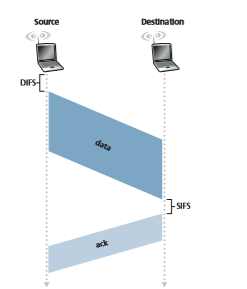
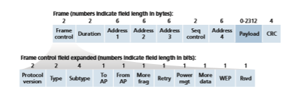
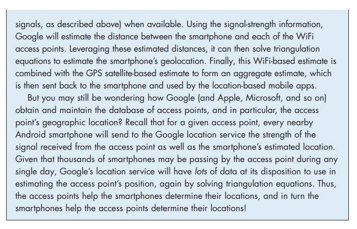

## WiFi: 802.11 Wireless LANs
Pervasive in the workplace, the home, educational institutions, cafés, airports, and street corners, wireless LANs are now one of the most important access network technologies in the Internet today. Although many technologies and standards for

wireless LANs were developed in the 1990s, one particular class of standards has clearly emerged as the winner: the **IEEE 802.11 wireless LAN**, also known as **WiFi**. In this section, we’ll take a close look at 802.11 wireless LANs, examining its frame structure, its medium access protocol, and its internetworking of 802.11 LANs with wired Ethernet LANs.

As summarized in Table 7.1, there are several 802.11 standards [IEEE 802.11 2020]. The 802.11 b, g, n, ac, ax are successive generations of 802.11 technology aimed for wireless local area networks (WLANs), typically less than 70 m range in a home office, workplace, or business setting. The 802.11 n, ac, and ax standards have recently been branded as WiFi 4, 5 and 6, respectively—no doubt competing with 4G and 5G cellular network branding. The 802.11 af, ah standards operate over longer distances and are aimed at Internet of Things, sensor networks, and metering applications.

The different 802.11 b, g, n, ac, ax standards all share some common character- istics, including the 802.11 frame format that we will study shortly, and are back- ward compatible, meaning, for example, that a mobile capable only of 802.11 g may still interact with a newer 802.11 ac or 802.11 ax base station. They also all use the same medium access protocol, CSMA/CA, which we’ll also discuss shortly, while also 802.11 ax also supports centralized scheduling by the base station of transmis- sions from associated wireless devices.

However, as shown in Table 7.1, the standards have some major differences at the physical layer. 802.11 devices operate in two different frequency ranges: 2.4–2.485 GHz (referred to as the 2.4 GHz range) and 5.1–5.8 GHz (referred to as the 5 GHz range). The 2.4 GHz range is an unlicensed frequency band, where 802.11 devices may compete for frequency spectrum with 2.4 GHz phones and appli- ances such as microwave ovens. At 5 GHz, 802.11 LANs have a shorter transmis- sion distance for a given power level and suffer more from multipath propagation. The 802.11n, 802.11ac, and 802.11ax standards use multiple input multiple-output (MIMO) antennas; that is, two or more antennas on the sending side and two or more antennas on the receiving side that are transmitting/receiving different signals

**Table 7.1**  ♦  Summary of IEEE 802.11 standards

[Diggavi 2004]. 802.11ac and 802.11 ax base stations may transmit to multiple sta- tions simultaneously, and use “smart” antennas to adaptively beamform to target transmissions in the direction of a receiver. This decreases interference and increases the distance reached at a given data rate. The data rates shown in Table 7.1 are for an idealized environment, for example, a receiver close to the base station, with no interference—a scenario that we’re unlikely to experience in practice! So as the say- ing goes, YMMV: Your Mileage (or in this case your wireless data rate) May Vary.

### The 802.11 Wireless LAN Architecture
Figure 7.7 illustrates the principal components of the 802.11 wireless LAN architec- ture. The fundamental building block of the 802.11 architecture is the **basic service set (BSS)**. A BSS contains one or more wireless stations and a central **base station**, known as an **access point (AP) in 802.11 parlance. Figure 7.7 shows the AP in each of two BSSs connecting to an interconnection device (such as a switch or router), which in turn leads to the Internet. In a typical home network, there is one AP and one router (typically integrated together as one unit) that connects the BSS to the Internet.

As with Ethernet devices, each 802.11 wireless station has a 6-byte MAC address that is stored in the firmware of the station’s adapter (that is, 802.11 network interface card). Each AP also has a MAC address for its wireless interface. As with Ethernet, these MAC addresses are administered by IEEE and are (in theory) globally unique.

As noted in Section 7.1, wireless LANs that deploy APs are often referred to as **infrastructure wireless LANs**, with the “infrastructure” being the APs along with the

**Figure 7.7**  ♦  IEEE 802.11 LAN architecture

**Figure 7.8**  ♦  An IEEE 802.11 ad hoc network

wired Ethernet infrastructure that interconnects the APs and a router. Figure 7.8 shows that IEEE 802.11 stations can also group themselves together to form an ad hoc net- work—a network with no central control and with no connections to the “outside world.” Here, the network is formed “on the fly,” by mobile devices that have found themselves in proximity to each other, that have a need to communicate, and that find no preexist- ing network infrastructure in their location. An ad hoc network might be formed when people with laptops get together (e.g., in a conference room, a train, or a car) and want to exchange data in the absence of a centralized AP. There has been tremendous interest in ad hoc networking, as communicating portable devices continue to proliferate. In this section, though, we’ll focus our attention on infrastructure wireless LANs.

**Channels and Association**

In 802.11, each wireless station needs to associate with an AP before it can send or receive network-layer data. Although all of the 802.11 standards use association, we’ll discuss this topic specifically in the context of IEEE 802.11b, g, n, ac, ax.

When a network administrator installs an AP, the administrator assigns a one- or two-word **Service Set Identifier (SSID)** to the access point. (When you choose Wi-Fi under Setting on your iPhone, for example, a list is displayed showing the SSID of each AP in range.) The administrator must also assign a channel number to the AP. To understand channel numbers, recall that 802.11 operates in the fre- quency range of 2.4 GHz to 2.4835 GHz. Within this 85 MHz band, 802.11 defines 11 partially overlapping channels. Any two channels are non-overlapping if and only if they are separated by four or more channels. In particular, the set of chan- nels 1, 6, and 11 is the only set of three non-overlapping channels. This means that an administrator could create a wireless LAN with an aggregate maximum trans- mission rate of three times the maximum transmission rate shown in Table 7.1 by installing three 802.11 APs at the same physical location, assigning channels 1, 6, and 11 to the APs, and interconnecting each of the APs with a switch.

Now that we have a basic understanding of 802.11 channels, let’s describe an interesting (and not completely uncommon) situation—that of a WiFi jungle. A **WiFi jungle** is any physical location where a wireless station receives a sufficiently strong signal from two or more APs. For example, in many cafés in New York City, a wire- less station can pick up a signal from numerous nearby APs. One of the APs might be managed by the café, while the other APs might be in residential apartments near the café. Each of these APs would likely be located in a different IP subnet and would have been independently assigned a channel.

Now suppose you enter such a WiFi jungle with your smartphone, tablet, or laptop, seeking wireless Internet access and a blueberry muffin. Suppose there are five APs in the WiFi jungle. To gain Internet access, your wireless device needs to join exactly one of the subnets and hence needs to **associate** with exactly one of the APs. Associating means the wireless device creates a virtual wire between itself and the AP. Specifically, only the associated AP will send data frames (that is, frames con- taining data, such as a datagram) to your wireless device, and your wireless device will send data frames into the Internet only through the associated AP. But how does your wireless device associate with a particular AP? And more fundamentally, how does your wireless device know which APs, if any, are out there in the jungle?

The 802.11 standard requires that an AP periodically send **beacon frames**, each of which includes the AP’s SSID and MAC address. Your wireless device, know- ing that APs are sending out beacon frames, scans the 11 channels, seeking beacon frames from any APs that may be out there (some of which may be transmitting on the same channel—it’s a jungle out there!). Having learned about available APs from the beacon frames, you (or your wireless device) select one of the APs for association.

The 802.11 standard does not specify an algorithm for selecting which of the available APs to associate with; that algorithm is left up to the designers of the 802.11 firmware and software in your wireless device. Typically, the device chooses the AP whose beacon frame is received with the highest signal strength. While a high signal strength is good (see, e.g., Figure 7.3), signal strength is not the only AP characteristic that will determine the performance a device receives. In particular, it’s possible that the selected AP may have a strong signal, but may be overloaded with other affiliated devices (that will need to share the wireless band- width at that AP), while an unloaded AP is not selected due to a slightly weaker signal. A number of alternative ways of choosing APs have thus recently been pro- posed [Vasudevan 2005; Nicholson 2006; Sundaresan 2006]. For an interesting and down-to-earth discussion of how signal strength is measured, see [Bardwell 2004].

The process of scanning channels and listening for beacon frames is known as **passive scanning** (see Figure 7.9a). A wireless device can also perform **active scanning**, by broadcasting a probe frame that will be received by all APs within the wireless device’s range, as shown in Figure 7.9b. APs respond to the probe request frame with a probe response frame. The wireless device can then choose the AP with which to associate from among the responding APs.

**Figure 7.9**  ♦  Active and passive scanning for access points

After selecting the AP with which to associate, the wireless device sends an asso- ciation request frame to the AP, and the AP responds with an association response frame. Note that this second request/response handshake is needed with active scan- ning, since an AP responding to the initial probe request frame doesn’t know which of the (possibly many) responding APs the device will choose to associate with, in much the same way that a DHCP client can choose from among multiple DHCP servers (see Figure 4.21). Once associated with an AP, the device will want to join the subnet (in the IP addressing sense of Section 4.3.3) to which the AP belongs. Thus, the device will typically send a DHCP discovery message (see Figure 4.21) into the subnet via the AP in order to obtain an IP address on the subnet. Once the address is obtained, the rest of the world then views that device simply as another host with an IP address in that subnet.

In order to create an association with a particular AP, the wireless device may be required to authenticate itself to the AP. 802.11 wireless LANs provide a number of alternatives for authentication and access. One approach, used by many companies, is to permit access to a wireless network based on a device’s MAC address. A second approach, used by many Internet cafés, employs usernames and passwords. In both cases, the AP typically communicates with an authentication server, relaying informa- tion between the wireless device and the authentication server using a protocol such as RADIUS [RFC 2865] or DIAMETER [RFC 6733]. Separating the authentication server from the AP allows one authentication server to serve many APs, centralizing the (often sensitive) decisions of authentication and access within the single server, and keepingAP costs and complexity low. We’ll see in chapter 8 that the new IEEE 802.11i protocol defining security aspects of the 802.11 protocol family takes precisely this approach.

### The 802.11 MAC Protocol
Once a wireless device is associated with an AP, it can start sending and receiving data frames to and from the access point. But because multiple wireless devices, or the AP itself may want to transmit data frames at the same time over the same channel, a multiple access protocol is needed to coordinate the transmissions. In the following, we'll refer to the devices or the AP as wireless “stations” that share the multiple access channel. As discussed in Chapter 6 and Section 7.2.1, broadly speaking there are three classes of multiple access protocols: channel partitioning (including CDMA), random access, and taking turns. Inspired by the huge success of Ethernet and its random access protocol, the designers of 802.11 chose a random access protocol for 802.11 wireless LANs. This random access protocol is referred to as **CSMA with collision avoidance**, or more succinctly as **CSMA/CA. As with Ethernet’s CSMA/CD, the “CSMA” in CSMA/CA stands for “carrier sense multiple access,” meaning that each station senses the channel before transmitting, and refrains from transmitting when the channel is sensed busy. Although both Ethernet and 802.11 use carrier-sensing ran- dom access, the two MAC protocols have important differences. First, instead of using collision detection, 802.11 uses collision-avoidance techniques. Second, because of the relatively high bit error rates of wireless channels, 802.11 (unlike Ethernet) uses a link-layer acknowledgment/retransmission (ARQ) scheme. We’ll describe 802.11’s collision-avoidance and link-layer acknowledgment schemes below.

Recall from Sections 6.3.2 and 6.4.2 that with Ethernet’s collision-detection algorithm, an Ethernet station listens to the channel as it transmits. If, while transmit- ting, it detects that another station is also transmitting, it aborts its transmission and tries to transmit again after waiting a small, random amount of time. Unlike the 802.3 Ethernet protocol, the 802.11 MAC protocol does _not_ implement collision detection. There are two important reasons for this:

• The ability to detect collisions requires the ability to send (the station’s own signal) and receive (to determine whether another station is also transmitting) at the same time. Because the strength of the received signal is typically very small compared to the strength of the transmitted signal at the 802.11 adapter, it is costly to build hardware that can detect a collision.

• More importantly, even if the adapter could transmit and listen at the same time (and presumably abort transmission when it senses a busy channel), the adapter would still not be able to detect all collisions, due to the hidden terminal problem and fading, as discussed in Section 7.2.

Because 802.11wireless LANs do not use collision detection, once a station begins to transmit a frame, _it transmits the frame in its entirety_; that is, once a station

**Figure 7.10**  ♦  802.11 uses link-layer acknowledgments

gets started, there is no turning back. As one might expect, transmitting entire frames (particularly long frames) when collisions are prevalent can significantly degrade a multiple access protocol’s performance. In order to reduce the likelihood of collisions, 802.11 employs several collision-avoidance techniques, which we’ll shortly discuss.

Before considering collision avoidance, however, we’ll first need to examine 802.11’s **link-layer acknowledgment** scheme. Recall from Section 7.2 that when a station in a wireless LAN sends a frame, the frame may not reach the destination sta- tion intact for a variety of reasons. To deal with this non-negligible chance of failure, the 802.11 MAC protocol uses link-layer acknowledgments. As shown in Figure 7.10, when the destination station receives a frame that passes the CRC, it waits a short period of time known as the **Short Inter-frame Spacing (SIFS)** and then sends back an acknowledgment frame. If the transmitting station does not receive an acknowl- edgment within a given amount of time, it assumes that an error has occurred and retransmits the frame, using the CSMA/CA protocol to access the channel. If an acknowledgment is not received after some fixed number of retransmissions, the trans- mitting station gives up and discards the frame.

Having discussed how 802.11 uses link-layer acknowledgments, we’re now in a position to describe the 802.11 CSMA/CA protocol. Suppose that a station (wireless device or an AP) has a frame to transmit.

1\. If initially the station senses the channel idle, it transmits its frame after a short period of time known as the **Distributed Inter-frame Space (DIFS)**; see Figure 7.10.

2\. Otherwise, the station chooses a random backoff value using binary exponen- tial backoff (as we encountered in Section 6.3.2) and counts down this value after DIFS when the channel is sensed idle. While the channel is sensed busy, the counter value remains frozen.

3\. When the counter reaches zero (note that this can only occur while the chan- nel is sensed idle), the station transmits the entire frame and then waits for an acknowledgment.

4\. If an acknowledgment is received, the transmitting station knows that its frame has been correctly received at the destination station. If the station has another frame to send, it begins the CSMA/CA protocol at step 2. If the acknowledg- ment isn’t received, the transmitting station reenters the backoff phase in step 2, with the random value chosen from a larger interval.

Recall that under Ethernet’s CSMA/CD, multiple access protocol (Section 6.3.2), a station begins transmitting as soon as the channel is sensed idle. With CSMA/CA, however, the station refrains from transmitting while counting down, even when it senses the channel to be idle. Why do CSMA/CD and CDMA/CA take such different approaches here?

To answer this question, let’s consider a scenario in which two stations each have a data frame to transmit, but neither station transmits immediately because each senses that a third station is already transmitting. With Ethernet’s CSMA/CD, the two stations would each transmit as soon as they detect that the third station has finished transmitting. This would cause a collision, which isn’t a serious issue in CSMA/CD, since both stations would abort their transmissions and thus avoid the useless transmissions of the remainders of their frames. In 802.11, however, the situ- ation is quite different. Because 802.11 does not detect a collision and abort trans- mission, a frame suffering a collision will be transmitted in its entirety. The goal in 802.11 is thus to avoid collisions whenever possible. In 802.11, if the two sta- tions sense the channel busy, they both immediately enter random backoff, hopefully choosing different backoff values. If these values are indeed different, once the chan- nel becomes idle, one of the two stations will begin transmitting before the other, and (if the two stations are not hidden from each other) the “losing station” will hear the “winning station’s” signal, freeze its counter, and refrain from transmitting until the winning station has completed its transmission. In this manner, a costly collision is avoided. Of course, collisions can still occur with 802.11 in this scenario: The two stations could be hidden from each other, or the two stations could choose randombackoff values that are close enough that the transmission from the station starting first have yet to reach the second station. Recall that we encountered this problem earlier in our discussion of random access algorithms in the context of Figure 6.12.

**Dealing with Hidden Terminals: RTS and CTS**

The 802.11 MAC protocol also includes a nifty (but optional) reservation scheme that helps avoid collisions even in the presence of hidden terminals. Let’s investi- gate this scheme in the context of Figure 7.11, which shows two wireless stations and one access point. Both of the wireless stations are within range of the AP (whose coverage is shown as a shaded circle) and both have associated with the AP. However, due to fading, the signal ranges of wireless stations are limited to the inte- riors of the shaded circles shown in Figure 7.11. Thus, each of the wireless stations is hidden from the other, although neither is hidden from the AP.

Let’s now consider why hidden terminals can be problematic. Suppose Station H1 is transmitting a frame and halfway through H1’s transmission, Station H2 wants to send a frame to the AP. H2, not hearing the transmission from H1, will first wait a DIFS interval and then transmit the frame, resulting in a collision. The channel will therefore be wasted during the entire period of H1’s transmission as well as during H2’s transmission.

In order to avoid this problem, the IEEE 802.11 protocol allows a station to use a short **Request to Send (RTS)** control frame and a short **Clear to Send (CTS)** control frame to _reserve_ access to the channel. When a sender wants to send a DATA frame, it can first send an RTS frame to the AP, indicating the total time required to transmit the DATA frame and the acknowledgment (ACK) frame. When the AP receives the RTS frame, it responds by broadcasting a CTS frame. This CTS frame

**Figure 7.11**  ♦   Hidden terminal example: H1 is hidden from H2, and vice versa

serves two purposes: It gives the sender explicit permission to send and also instructs the other stations not to send for the reserved duration.

Thus, in Figure 7.12, before transmitting a DATA frame, H1 first broadcasts an RTS frame, which is heard by all stations in its circle, including the AP. The AP then responds with a CTS frame, which is heard by all stations within its range, including H1 and H2. Station H2, having heard the CTS, refrains from transmitting for the time specified in the CTS frame. The RTS, CTS, DATA, and ACK frames are shown in Figure 7.12.

**Figure 7.12**  ♦  Collision avoidance using the RTS and CTS frames

The use of the RTS and CTS frames can improve performance in two important ways:

• The hidden station problem is mitigated, since a long DATA frame is transmitted only after the channel has been reserved.

• Because the RTS and CTS frames are short, a collision involving an RTS or CTS frame will last only for the duration of the short RTS or CTS frame. Once the RTS and CTS frames are correctly transmitted, the following DATA and ACK frames should be transmitted without collisions.

You are encouraged to check out the 802.11 animation in the textbook’s Web site. This interactive animation illustrates the CSMA/CA protocol, including the RTS/ CTS exchange sequence.

Although the RTS/CTS exchange can help reduce collisions, it also introduces delay and consumes channel resources. For this reason, the RTS/CTS exchange is only used (if at all) to reserve the channel for the transmission of a long DATA frame. In practice, each wireless station can set an RTS threshold such that the RTS/ CTS sequence is used only when the frame is longer than the threshold. For many wireless stations, the default RTS threshold value is larger than the maximum frame length, so the RTS/CTS sequence is skipped for all DATA frames sent.

**Using 802.11 as a Point-to-Point Link**

Our discussion so far has focused on the use of 802.11 in a multiple access setting. We should mention that if two nodes each have a directional antenna, they can point their directional antennas at each other and run the 802.11 protocol over what is essentially a point-to-point link. Given the low cost of commodity 802.11 hardware, the use of directional antennas and an increased transmission power allow 802.11 to be used as an inexpensive means of providing wireless point-to-point connections over tens of kilo- meters distance. \[Raman 2007\] describes one of the first such multi-hop wireless net- works, operating in the rural Ganges plains in India using point-to-point 802.11 links.

### The IEEE 802.11 Frame
 Although the 802.11 frame shares many similarities with an Ethernet frame, it also con- tains a number of fields that are specific to its use for wireless links. The 802.11 frame is shown in Figure 7.13. The numbers above each of the fields in the frame represent the lengths of the fields in _bytes_; the numbers above each of the subfields in the frame control field represent the lengths of the subfields in _bits_. Let’s now examine the fields in the frame as well as some of the more important subfields in the frame’s control field.

**Payload and CRC Fields**

At the heart of the frame is the payload, which typically consists of an IP datagram or an ARP packet. Although the field is permitted to be as long as 2,312 bytes, it is

**Figure 7.13**  ♦  The 802.11 frame

typically fewer than 1,500 bytes, holding an IP datagram or an ARP packet. As with an Ethernet frame, an 802.11 frame includes a 32-bit cyclic redundancy check (CRC) so that the receiver can detect bit errors in the received frame. As we’ve seen, bit errors are much more common in wireless LANs than in wired LANs, so the CRC is even more useful here.

**Address Fields**

Perhaps the most striking difference in the 802.11 frame is that it has _four_ address fields, each of which can hold a 6-byte MAC address. But why four address fields? Doesn’t a source MAC field and destination MAC field suffice, as they do for Ethernet? It turns out that three address fields are needed for internetworking purposes—specifically, for moving the network-layer datagram from a wireless sta- tion through an AP to a router interface. The fourth address field is used when APs forward frames to each other in ad hoc mode. Since we are only considering infra- structure networks here, let’s focus our attention on the first three address fields. The 802.11 standard defines these fields as follows:

• Address 2 is the MAC address of the station that transmits the frame. Thus, if a wireless station transmits the frame, that station’s MAC address is inserted in the address 2 field. Similarly, if an AP transmits the frame, the AP’s MAC address is inserted in the address 2 field.

• Address 1 is the MAC address of the wireless station that is to receive the frame. Thus if a mobile wireless station transmits the frame, address 1 contains the MAC address of the destination AP. Similarly, if an AP transmits the frame, address 1 contains the MAC address of the destination wireless station.

• To understand address 3, recall that the BSS (consisting of the AP and wireless stations) is part of a subnet, and that this subnet connects to other subnets via some router interface. Address 3 contains the MAC address of this router interface.

**Figure 7.14**  ♦   The use of address fields in 802.11 frames: Sending frames between H1 and R1

To gain further insight into the purpose of address 3, let’s walk through an inter- networking example in the context of Figure 7.14. In this figure, there are two APs, each of which is responsible for a number of wireless stations. Each of the APs has a direct connection to a router, which in turn connects to the global Internet. We should keep in mind that an AP is a link-layer device, and thus neither “speaks” IP nor understands IP addresses. Consider now moving a datagram from the router interface R1 to the wireless Station H1. The router is not aware that there is an AP between it and H1; from the router’s perspective, H1 is just a host in one of the subnets to which it (the router) is connected.

• The router, which knows the IP address of H1 (from the destination address of the datagram), uses ARP to determine the MAC address of H1, just as in an ordinary Eth- ernet LAN. After obtaining H1’s MAC address, router interface R1 encapsulates the datagram within an Ethernet frame. The source address field of this frame contains R1’s MAC address, and the destination address field contains H1’s MAC address.

• When the Ethernet frame arrives at the AP, the AP converts the 802.3 Ethernet frame to an 802.11 frame before transmitting the frame into the wireless chan- nel. The AP fills in address 1 and address 2 with H1’s MAC address and its own MAC address, respectively, as described above. For address 3, the AP inserts the MAC address of R1. In this manner, H1 can determine (from address 3) the MAC address of the router interface that sent the datagram into the subnet.

Now consider what happens when the wireless station H1 responds by moving a datagram from H1 to R1.

• H1 creates an 802.11 frame, filling the fields for address 1 and address 2 with the AP’s MAC address and H1’s MAC address, respectively, as described above. For address 3, H1 inserts R1’s MAC address.

• When the AP receives the 802.11 frame, it converts the frame to an Ethernet frame. The source address field for this frame is H1’s MAC address, and the destination address field is R1’s MAC address. Thus, address 3 allows the AP to determine the appropriate destination MAC address when constructing the Ethernet frame.

In summary, address 3 plays a crucial role for internetworking the BSS with a wired LAN.

**Sequence Number, Duration, and Frame Control Fields**

Recall that in 802.11, whenever a station correctly receives a frame from another sta- tion, it sends back an acknowledgment. Because acknowledgments can get lost, the sending station may send multiple copies of a given frame. As we saw in our discus- sion of the rdt2.1 protocol (Section 3.4.1), the use of sequence numbers allows the receiver to distinguish between a newly transmitted frame and the retransmission of a previous frame. The sequence number field in the 802.11 frame thus serves exactly the same purpose here at the link layer as it did in the transport layer in Chapter 3.

Recall that the 802.11 protocol allows a transmitting station to reserve the chan- nel for a period of time that includes the time to transmit its data frame and the time to transmit an acknowledgment. This duration value is included in the frame’s dura- tion field (both for data frames and for the RTS and CTS frames).

As shown in Figure 7.13, the frame control field includes many subfields. We’ll say just a few words about some of the more important subfields; for a more complete discussion, you are encouraged to consult the 802.11 specification [Held 2001; Crow 1997; IEEE 802.11 1999]. The _type_ and _subtype_ fields are used to distinguish the asso- ciation, RTS, CTS, ACK, and data frames. The _to_ and _from_ fields are used to define the meanings of the different address fields. (These meanings change depending on whether ad hoc or infrastructure modes are used and, in the case of infrastructure mode, whether a wireless station or an AP is sending the frame.) Finally the WEP field indicates whether encryption is being used or not (WEP is discussed in Chapter 8).

### Mobility in the Same IP Subnet
 In order to increase the physical range of a wireless LAN, companies and universities will often deploy multiple BSSs within the same IP subnet. This naturally raises the issue of mobility among the BSSs—how do wireless stations seamlessly move from one BSS to another while maintaining ongoing TCP sessions? As we’ll see in this subsection, mobility can be handled in a relatively straightforward manner when the BSSs are partof the subnet. When stations move between subnets, more sophisticated mobility man- agement protocols will be needed, such as those we’ll study in Sections 7.5 and 7.6.

Let’s now look at a specific example of mobility between BSSs in the same sub- net. Figure 7.15 shows two interconnected BSSs with a host, H1, moving from BSS1 to BSS2. Because in this example the interconnection device that connects the two BSSs is _not_ a router, all of the stations in the two BSSs, including the APs, belong to the same IP subnet. Thus, when H1 moves from BSS1 to BSS2, it may keep its IP address and all of its ongoing TCP connections. If the interconnection device were a router, then H1 would have to obtain a new IP address in the subnet in which it was moving. This address change would disrupt (and eventually terminate) any on-going TCP connections at H1. In Section 7.6, we’ll see how a network-layer mobility pro- tocol, such as mobile IP, can be used to avoid this problem.

But what specifically happens when H1 moves from BSS1 to BSS2? As H1 wanders away from AP1, H1 detects a weakening signal from AP1 and starts to scan for a stronger signal. H1 receives beacon frames from AP2 (which in many corporate and university settings will have the same SSID as AP1). H1 then disassociates with AP1 and associates with AP2, while keeping its IP address and maintaining its ongoing TCP sessions.

This addresses the handover problem from the host and AP viewpoint. But what about the switch in Figure 7.15? How does it know that the host has moved from one AP to another? As you may recall from Chapter 6, switches are “self-learning” and automatically build their forwarding tables. This self-learning feature nicely handles occasional moves (for example, when an employee gets transferred from one depart- ment to another); however, switches were not designed to support highly mobile users who want to maintain TCP connections while moving between BSSs. To appreciate the problem here, recall that before the move, the switch has an entry in its forwarding table that pairs H1’s MAC address with the outgoing switch interface through which H1 can be reached. If H1 is initially in BSS1, then a datagram des- tined to H1 will be directed to H1 via AP1. Once H1 associates with BSS2, however, its frames should be directed to AP2. One solution (a bit of a hack, really) is for AP2 to send a broadcast Ethernet frame with H1’s source address to the switch just after

**Figure 7.15**  ♦  Mobility in the same subnet

the new association. When the switch receives the frame, it updates its forwarding table, allowing H1 to be reached via AP2. The 802.11f standards group is developing an inter-AP protocol to handle these and related issues.

Our discussion above has focused on mobility with the same LAN subnet. Recall that VLANs, which we studied in Section 6.4.4, can be used to connect together islands of LANs into a large virtual LAN that can span a large geographical region. Mobility among base stations within such a VLAN can be handled in exactly the same manner as above [Yu 2011].

**LOCATION DISCOVERY: GPS AND WIFI POSITIONING**    

### Advanced Features in 802.11
 We’ll wrap up our coverage of 802.11 with a short discussion of two advanced capabili- ties found in 802.11 networks. As we’ll see, these capabilities are _not_ completely speci- fied in the 802.11 standard, but rather are made possible by mechanisms specified in the standard. This allows different vendors to implement these capabilities using their own (proprietary) approaches, presumably giving them an edge over the competition.

**802.11 Rate Adaptation**

We saw earlier in Figure 7.3 that different modulation techniques (with the different transmission rates that they provide) are appropriate for different SNR scenarios. Consider, for example, a mobile 802.11 user who is initially 20 meters away from the base station, with a high signal-to-noise ratio. Given the high SNR, the user can communicate with the base station using a physical-layer modulation technique that provides high transmission rates while maintaining a low BER. This is one happy user! Suppose now that the user becomes mobile, walking away from the base sta- tion, with the SNR falling as the distance from the base station increases. In this case, if the modulation technique used in the 802.11 protocol operating between the base station and the user does not change, the BER will become unacceptably high as the SNR decreases, and eventually no transmitted frames will be received correctly.

For this reason, some 802.11 implementations have a rate adaptation capability that adaptively selects the underlying physical-layer modulation technique to use based on current or recent channel characteristics. If a node sends two frames in a row without receiving an acknowledgment (an implicit indication of bit errors onthe channel), the transmission rate falls back to the next lower rate. If 10 frames in a row are acknowledged, or if a timer that tracks the time since the last fallback expires, the transmission rate increases to the next higher rate. This rate adapta- tion mechanism shares the same “probing” philosophy as TCP’s congestion-control mechanism—when conditions are good (reflected by ACK receipts), the transmis- sion rate is increased until something “bad” happens (the lack of ACK receipts); when something “bad” happens, the transmission rate is reduced. 802.11 rate adapta- tion and TCP congestion control are thus similar to the young child who is constantly pushing his/her parents for more and more (say candy for a young child, later curfew hours for the teenager) until the parents finally say “Enough!” and the child backs off (only to try again later after conditions have hopefully improved!). A number of other schemes have also been proposed to improve on this basic automatic rate- adjustment scheme [Kamerman 1997; Holland 2001; Lacage 2004].

**Power Management**

Power is a precious resource in mobile devices, and thus the 802.11 standard provides power-management capabilities that allow 802.11 nodes to minimize the amount of time that their sense, transmit, and receive functions and other circuitry need to be “on.” 802.11 power management operates as follows. A node is able to explicitly alternate between sleep and wake states (not unlike a sleepy student in a classroom!). A node indicates to the access point that it will be going to sleep by setting the power-management bit in the header of an 802.11 frame to 1. A timer in the node is then set to wake up the node just before the AP is scheduled to send its beacon frame (recall that an AP typically sends a beacon frame every 100 msec). Since the AP knows from the set power-transmission bit that the node is going to sleep, it (the AP) knows that it should not send any frames to that node, and will buffer any frames destined for the sleeping host for later transmission.

A node will wake up just before the AP sends a beacon frame, and quickly enter the fully active state (unlike the sleepy student, this wakeup requires only 250 microseconds [Kamerman 1997]!). The beacon frames sent out by the AP contain a list of nodes whose frames have been buffered at the AP. If there are no buffered frames for the node, it can go back to sleep. Otherwise, the node can explicitly request that the buffered frames be sent by sending a polling message to the AP. With an inter-beacon time of 100 msec, a wakeup time of 250 microseconds, and a similarly small time to receive a beacon frame and check to ensure that there are no buffered frames, a node that has no frames to send or receive can be asleep 99% of the time, resulting in a significant energy savings.

### Personal Area Networks: Bluetooth
 **Bluetooth** networks seem to have quickly become part of everyday life. Perhaps you’ve used a Bluetooth network as a “cable replacement” technology to interconnect

The terms used below may differ from the terms found in the official Bluetooth Specification. The terms used in the official specifica- tion DO NOT align with Pearson’s commitment to promoting diversity, equality, and inclusion, and protecting against bias and stereo- typing in the global population of the learners we serve.your computer with a wireless keyboard, mouse, or other peripheral device. Or per- haps you’ve used a Bluetooth network to connect your wireless earbuds, speaker, watch, or health monitoring band to your smartphone or to connect your smartphone to a car’s audio system. In all of these cases, Bluetooth operates over short ranges (tens of meters or less), at low power, and at low cost. For this reason, Bluetooth networks are sometimes referred to as **wireless personal area networks** (WPANs) or **piconets.**

Although Bluetooth networks are small and relatively simple by design, they’re packed with many of the link-level networking techniques that we’ve studied earlier including time division multiplexing (TDM) and frequency division (Section 6.3.1), randomized backoff (Section 6.3.2), polling (Section 6.3.3), error detection _and_ cor- rection (Section 6.2), reliable data transfer via ACKs and NAKS (Section 3.4.1). And that’s just considering Bluetooth’s link layer!

Bluetooth networks operate in the unlicensed 2.4 GHz Industrial, Scientific and Medical (ISM) radio band along with other home appliances such as micro- waves, garage door openers, and cordless phones. As a result, Bluetooth networks are designed explicitly with noise and interference in mind. The Bluetooth wire- less channel is operated in a TDM manner, with time slots of 625 microseconds. During each time slot, a sender transmits on one of 79 channels, with the channel (frequency) changing in a known but pseudo-random manner from slot to slot. This form of channel hopping, known as **frequency-hopping spread spectrum** (FHSS), is used so that interference from another device or appliance operating in the ISM band will only interfere with Bluetooth communications in at most a subset of the slots. Bluetooth data rates can reach up to 3 Mbps.

Bluetooth networks are ad hoc networks—no network infrastructure (e.g., an access point) is needed. Instead, Bluetooth devices must organize _themselves_ into a piconet of up to eight active devices, as shown in Figure 7.16. One of these devices

**Figure 7.16**  ♦  A Bluetooth piconet

is designated as the centralized controller, with the remaining devices acting as clients. The centralized controller node truly rules the piconet—its clock determines time in the piconet (e.g., determines TDM slot boundaries), it determine the slot-to-slot frequency hopping sequence, it controls entry of client devices into the piconet, it controls the power (100 mW, 2.5mW, or 1 mW) at which client devices transmit; and uses polling to grant clients permission to transmit once admitted to the network. In addition to the active devices, there can also be up to 255 “parked” devices in the piconet. These parked devices are often in some form of “sleep mode” to conserve energy (as we saw with 802.11 power management) and will awaken periodically, according to the centralized controller’s schedule, to receive beacon messages from the centralized controller. A parked device cannot communicate until its status has been changed from parked to active by the centralized controller node.

Because Bluetooth ad hoc networks must be **self-organizing**, it’s worth looking into how they bootstrap their network structure. When a centralized controller node wants to form a Bluetooth network, it must first determine which other Bluetooth devices are within range; this is the **neighbor discovery** problem. The centralized controller does this by broadcasting a series of 32 inquiry messages, each on a dif- ferent frequency channel, and repeats the transmission sequence for up to 128 times. A client device listens on its chosen frequency, hoping to hear one of the centralized controller’s inquiry messages on this frequency. When it hears an inquiry message, it backs off a random amount of time between 0 and 0.3 seconds (to avoid colli- sions with other responding nodes, reminiscent of Ethernet’s binary backoff) and then responds to the centralized controller with a message containing its device ID.

Once the Bluetooth centralized controller has discovered all of the potential clients within range, it then invites those clients that it wishes to join the piconet. This second phase is known as **Bluetooth paging**, and is reminiscent of 802.11 clients associating with a base station. Through the paging process, the centralized controller will inform the client of the frequency-hopping pattern to be used, and the sender’s clock. The centralized controller begins the paging process by again send- ing 32 identical paging invitation messages, each now addressed to a specific client, but again using different frequencies, since that client has yet to learn the frequency- hopping pattern. Once the client replies with an ACK message to the paging invita- tion message, the centralized controller sends frequency-hopping information, clock synchronization information and an active member address to the client, and then finally polls the client, now using the frequency-hopping pattern, to ensure that the client is connected into the network.

In our discussion above, we have only touched on Bluetooth’s wireless net- working. Higher level protocols provide for reliable data packet transfer, circuit- like streaming of audio and video, changing transmission power levels, changing active/parked state (and other states), and more. More recent versions of Bluetooth have addressed low energy and security considerations. For more information about Bluetooth, the interested reader should consult [Bisdikian 2001, Colbach 2017, and Bluetooth 2020].