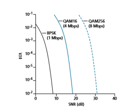
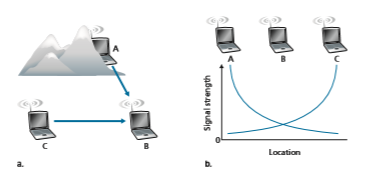
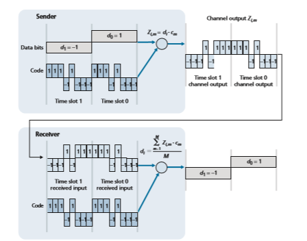
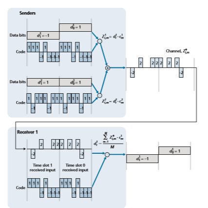

## Wireless Links and Network Characteristics
Wireless links differ from their wired counterparts in a number important ways:

• _Decreasing signal strength_. Electromagnetic radiation attenuates as it passes through matter (e.g., a radio signal passing through a wall). Even in free space, the signal will disperse, resulting in decreased signal strength (sometimes referred to as **path loss**) as the distance between sender and receiver increases.

• _Interference from other sources._ Radio sources transmitting in the same fre- quency band will interfere with each other. For example, 2.4 GHz wireless phones and 802.11b wireless LANs transmit in the same frequency band. Thus, the 802.11b wireless LAN user talking on a 2.4 GHz wireless phone can expect that neither the network nor the phone will perform particularly well. In addi- tion to interference from transmitting sources, electromagnetic noise within the environment (e.g., a nearby motor, a microwave) can result in interference. For this reason, a number of more recent 802.11 standards operate in the 5GHz frequency band.

• _Multipath propagation._ **Multipath propagation** occurs when portions of the electromagnetic wave reflect off objects and the ground, taking paths of different lengths between a sender and receiver. This results in the blurring of the received signal at the receiver. Moving objects between the sender and receiver can cause multipath propagation to change over time.

For a detailed discussion of wireless channel characteristics, models, and measure- ments, see [Anderson 1995; Almers 2007].

The discussion above suggests that bit errors will be more common in wireless links than in wired links. For this reason, it is perhaps not surprising that wireless link protocols (such as the 802.11 protocol we’ll examine in the following section) employ not only powerful CRC error detection codes, but also link-level relia- ble-data-transfer protocols that retransmit corrupted frames.

Having considered the impairments that can occur on a wireless channel, let’s next turn our attention to the host receiving the wireless signal. This host receives an elec- tromagnetic signal that is a combination of a degraded form of the original signal trans- mitted by the sender (degraded due to the attenuation and multipath propagation effects that we discussed above, among others) and background noise in the environment. The **signal-to-noise ratio (SNR)** is a relative measure of the strength of the received signal (i.e., the information being transmitted) and this noise. The SNR is typically measured in units of decibels (dB), a unit of measure that some think is used by

**Figure 7.3**  ♦  Bit error rate, transmission rate, and SNR

electrical engineers primarily to confuse computer scientists. The SNR, measured in dB, is 20 times the ratio of the base-10 logarithm of the amplitude of the received signal to the amplitude of the noise. For our purposes here, we need only know that a larger SNR makes it easier for the receiver to extract the transmitted signal from the background noise.

Figure 7.3 (adapted from [Holland 2001]) shows the bit error rate (BER)— roughly speaking, the probability that a transmitted bit is received in error at the receiver—versus the SNR for three different modulation techniques for encod- ing information for transmission on an idealized wireless channel. The theory of modulation and coding, as well as signal extraction and BER, is well beyond the scope of this text (see [Schwartz 1980; Goldsmith 2005] for a discussion of these topics). Nonetheless, Figure 7.3 illustrates several physical-layer charac- teristics that are important in understanding higher-layer wireless communica- tion protocols:

• _For a given modulation scheme, the higher the SNR, the lower the BER._ Since a sender can increase the SNR by increasing its transmission power, a sender can decrease the probability that a frame is received in error by increasing its transmission power. Note, however, that there is arguably little practical gain in increasing the power beyond a certain threshold, say to decrease the BER from 10-12 to 10-13. There are also _disadvantages_ associated with increas- ing the transmission power: More energy must be expended by the sender

**Figure 7.4**  ♦  Hidden terminal problem caused by obstacle (a) and fading (b)

(an important concern for battery-powered mobile users), and the sender’s transmissions are more likely to interfere with the transmissions of another sender (see Figure 7.4(b)).

• _For a given SNR, a modulation technique with a higher bit transmission rate (whether in error or not) will have a higher BER._ For example, in Figure 7.3, with an SNR of 10 dB, BPSK modulation with a transmission rate of 1 Mbps has a BER of less than 10-7, while with QAM16 modulation with a transmission rate of 4 Mbps, the BER is 10-1, far too high to be practically useful. However, with an SNR of 20 dB, QAM16 modulation has a transmission rate of 4 Mbps and a BER of 10-7, while BPSK modulation has a transmission rate of only 1 Mbps and a BER that is so low as to be (literally) “off the charts.” If one can tolerate a BER of 10-7, the higher transmission rate offered by QAM16 would make it the preferred modulation technique in this situation. These considerations give rise to the final characteristic, described next.

• _Dynamic selection of the physical-layer modulation technique can be used to adapt the modulation technique to channel conditions._ The SNR (and hence the BER) may change as a result of mobility or due to changes in the environ- ment. Adaptive modulation and coding are used in the 802.11 WiFi and in 4G and 5G cellular data networks that we’ll study in Sections 7.3 and 7.4. This allows, for example, the selection of a modulation technique that provides the highest transmission rate possible subject to a constraint on the BER, for given channel characteristics.

A higher and time-varying bit error rate is not the only difference between a wired and wireless link. Recall that in the case of wired broadcast links, all nodes receive the transmissions from all other nodes. In the case of wireless links, the situ- ation is not as simple, as shown in Figure 7.4. Suppose that Station A is transmit- ting to Station B. Suppose also that Station C is transmitting to Station B. With the so-called **hidden terminal problem**, physical obstructions in the environment (for example, a mountain or a building) may prevent A and C from hearing each other’s transmissions, even though A’s and C’s transmissions are indeed interfering at the destination, B. This is shown in Figure 7.4(a). A second scenario that results in unde- tectable collisions at the receiver results from the **fading** of a signal’s strength as it propagates through the wireless medium. Figure 7.4(b) illustrates the case where A and C are placed such that their signals are not strong enough to detect each other’s transmissions, yet their signals _are_ strong enough to interfere with each other at sta- tion B. As we’ll see in Section 7.3, the hidden terminal problem and fading make multiple access in a wireless network considerably more complex than in a wired network.

### CDMA
 Recall from Chapter 6 that when hosts communicate over a shared medium, a pro- tocol is needed so that the signals sent by multiple senders do not interfere at the receivers. In Chapter 6, we described three classes of medium access protocols: channel partitioning, random access, and taking turns. Code division multiple access (CDMA) belongs to the family of channel partitioning protocols. It is prevalent in wireless LAN and cellular technologies. Because CDMA is so important in the wire- less world, we’ll take a quick look at CDMA now, before getting into specific wire- less access technologies in the subsequent sections.

In a CDMA protocol, each bit being sent is encoded by multiplying the bit by a signal (the code) that changes at a much faster rate (known as the **chipping rate**) than the original sequence of data bits. Figure 7.5 shows a simple, idealized CDMA encoding/decoding scenario. Suppose that the rate at which original data bits reach the CDMA encoder defines the unit of time; that is, each original data bit to be transmitted requires a one-bit slot time. Let _di_ be the value of the data bit for the _i_th bit slot. For mathematical convenience, we represent a data bit with a 0 value as -1. Each bit slot is further subdivided into _M_ mini-slots; in Figure 7.5, _M_ \= 8, although in practice _M_ is much larger. The CDMA code used by the sender con- sists of a sequence of _M_ values, _cm_, _m_ \= 1, . . . , _M_, each taking a +1 or -1 value. In the example in Figure 7.5, the _M_\-bit CDMA code being used by the sender is (1, 1, 1, -1, 1, -1, -1, -1).

To illustrate how CDMA works, let us focus on the _i_th data bit, _di_. For the _m_th mini-slot of the bit-transmission time of _di_, the output of the CDMA encoder, _Zi_,_m_, is the value of _di_ multiplied by the _m_th bit in the assigned CDMA code, _cm_:

**Figure 7.5**  ♦  A simple CDMA example: Sender encoding, receiver decoding

_Zi_,_m_ \= _di_ \# _cm_ (7.1)In a simple world, with no interfering senders, the receiver would receive the encoded bits, _Zi_,_m_, and recover the original data bit, _di_, by computing:

_di_ \= 1 _M_

a _M_

_m_\=1 _Zi_,_m_

\# _cm_ (7.2)

The reader might want to work through the details of the example in Figure 7.5 to see that the original data bits are indeed correctly recovered at the receiver using Equation 7.2.

The world is far from ideal, however, and as noted above, CDMA must work in the presence of interfering senders that are encoding and transmitting their data using a different assigned code. But how can a CDMA receiver recover a sender’s original data bits when those data bits are being tangled with bits being transmitted by other senders? CDMA works under the assumption that the interfering transmitted bit sig- nals are additive. This means, for example, that if three senders send a 1 value, and a fourth sender sends a -1 value during the same mini-slot, then the received signal at all receivers during that mini-slot is a 2 (since 1 + 1 + 1 - 1 = 2). In the presence of multiple senders, sender _s_ computes its encoded transmissions, _Zs_ _i_,_m_, in exactly the same manner as in Equation 7.1. The value received at a receiver during the _m_th mini-slot of the _i_th bit slot, however, is now the _sum_ of the transmitted bits from all _N_ senders during that mini-slot:

_Z_\* _i_, _m_ \= a

_N_

_s_\=1 _Zs_

_i_,_m_

Amazingly, if the senders’ codes are chosen carefully, each receiver can recover the data sent by a given sender out of the aggregate signal simply by using the sender’s code in exactly the same manner as in Equation 7.2:

_di_ \= 1 _M_ a

_M_

_m_\=1 _Zi_,_m_

\* # _cm_ (7.3)

as shown in Figure 7.6, for a two-sender CDMA example. The _M_\-bit CDMA code being used by the upper sender is (1, 1, 1, -1, 1, -1, -1, -1), while the CDMA code being used by the lower sender is (1, -1, 1, 1, 1, -1, 1, 1). Figure 7.6 illustrates a receiver recovering the original data bits from the upper sender. Note that the receiver is able to extract the data from sender 1 in spite of the interfering transmission from sender 2.

Recall our cocktail analogy from Chapter 6. A CDMA protocol is similar to having partygoers speaking in multiple languages; in such circumstances humans are actually quite good at locking into the conversation in the language they understand, while filtering out the remaining conversations. We see here that CDMA is a parti- tioning protocol in that it partitions the codespace (as opposed to time or frequency) and assigns each node a dedicated piece of the codespace.

Our discussion here of CDMA is necessarily brief; in practice a number of dif- ficult issues must be addressed. First, in order for the CDMA receivers to be able to extract a particular sender’s signal, the CDMA codes must be carefully chosen. Second, our discussion has assumed that the received signal strengths from various senders are the same; in reality, this can be difficult to achieve. There is a consid- erable body of literature addressing these and other issues related to CDMA; see [Pickholtz 1982; Viterbi 1995] for details.

**Figure 7.6**  ♦  A two-sender CDMA example
